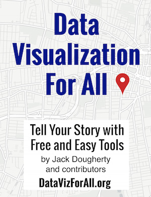

### Tell your story with free and easy-to-learn tools.

***Data Visualization for All***, an open-access textbook, shows how to design interactive charts and maps for your website. We begin with drag-and-drop tools and gradually work our way up to editing open-source code templates. This friendly introduction includes step-by-step tutorials, video screencasts, and real-world examples. Featured tools include Google Sheets, Tableau Public, Carto, Highcharts, Leaflet, GitHub, and more.

[About the authors](introduction/who.md) from [Trinity College, Hartford CT](http://www.trincoll.edu): Jack Dougherty, Veronica X. Armendariz, Ilya Ilyankou, Stacy Lam, David Tatem, and guest contributor Derek Eder.

[Read for free online](https://www.gitbook.com/read/book/jackdougherty/datavizforall) (recommended) or download the [PDF](https://www.gitbook.com/download/pdf/book/jackdougherty/datavizforall) or [ePUB](https://www.gitbook.com/download/epub/book/jackdougherty/datavizforall) or [Mobi/Kindle](https://www.gitbook.com/download/mobi/book/jackdougherty/datavizforall) editions.

[Learn how GitBook works](gitbook) and publish your own book.

<strong>Data Visualization for All</strong> is copyrighted
by <a href="https://www.datavizforall.org/introduction/who.html">Jack Dougherty and contributors</a>
and distributed under a <a rel="license" href="http://creativecommons.org/licenses/by-nc/4.0/">Creative Commons BY-NC 4.0 International License</a>.
You may freely share and modify this content for non-commercial purposes, with a source credit to <a href="http://DataVizForAll.org">http://DataVizForAll.org</a>.
 <strong>Help improve this book:</strong> <a href="https://www.datavizforall.org/gitbook/improve.html">Select text and (+) symbol to comment</a> or <a href="https://github.com/JackDougherty/datavizforall">suggest edits on GitHub</a>.

