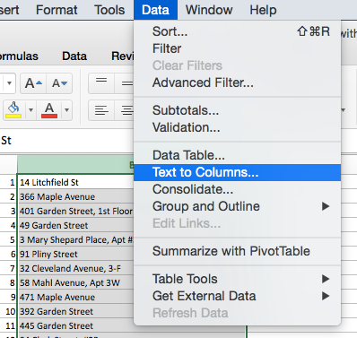

# Clean Your Data with Spreadsheet Tools

**TO DO** decide if this is still relevant -- since it's not a problem for Census geocoder

Sometimes we receive a spreadsheet with problem entries that need to be cleaned up before we can successfully upload it into a visualization tool. Look at the simple table below. What could possibly go wrong?

| Address              |
| :------------------- |
| 100 Main St, Apt 33  |
| 102 Main St          |

The first address includes a comma between the street and the apartment number. Some data visualization tools require spreadsheets to be uploaded in Comma Separated Values (CSV) format, which as the name suggests, divides columns with commas. In the example above, saving the file into CSV format might misalign the data columns.

## Split Text into Columns with Excel

To remove the extra comma and the apartment number in the example above:

1.

2.

