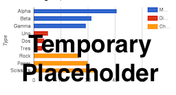

# Chart Your Data
*by [Jack Dougherty](../introduction/who.md), last updated February 20, 2017*

Charts are often the best way to visualize your data and pull readers deeper into the story. Even if your data contains geographical information, in some cases a chart tells your story better than a map. But well-designed charts require careful thought about how to communicate meaningful insights to your audience. This chapter features tools to create interactive charts (rather than static images) that you can embed in your website.

## Recommended steps
1) [Draw and write your data story](../../choose/draw) as shown in a previous chapter. What are key insights that you want to explore or explain? Sketch a simple picture and write out the main ideas to capture your vision on paper.
2) Practice the [principles of good chart design chart](design) as described in this chapter. Learn to identify good charts from bad ones.
3) Choose a chart type that matches your story and data format, in the table below. For each type, follow tutorial links to *easy tools* for beginners or *power tools* that require code templates. If necessary, see the [Spreadsheet Skills](../spreadsheet) and [Clean Your Data](../clean) chapters in this book to reformat your data to match your desired chart type.
4) [Embed your interactive chart in your website](../embed), as shown in an upcoming chapter.
- Embed your interactive chart on your website (link to embed chapters)
5) Focus on [storytelling](../storytelling) to accompany your visualization. Write sentences, titles, and labels that call attention to the most meaningful insights in your chart, as well as any data limitations.

| Basic chart types | Best use and tutorial chapters |
| --- | --- |
| Grouped Column and Bar   | Best to compare categories side-by-side. Vertical columns, or horizontal bars for long labels.  Easy tool: [Google Sheets bar and column tutorial](column-bar-google) Power tool: [Highcharts templates](../highcharts/) |
| Separated Column and Bar   | Best to compare categories in separate clusters. Vertical columns, or horizontal bars for long labels. Easy tool: [Google Sheets bar and column tutorial](column-bar-google) Power tool: [Highcharts templates](../highcharts/) |
| Stacked Column and Bar   | Best to compare sub-categories, or parts of a whole. Vertical columns, or horizontal bars for long labels. Easy tool: [Google Sheets bar and column tutorial](column-bar-google) Power tool: [Highcharts templates](../highcharts/) |
| Histograms   | Best to show distribution of raw data, with number of values in each bucket. Easy tool: [Google Sheets bar and column tutorial](column-bar-google) Power tool: [Highcharts templates](../highcharts/) |
| Pie chart   | Best to show parts of a whole, but hard to estimate size of slices. Easy tool: [Google Sheets pie chart tutorial](pie-line-area-google) Power tool: [Highcharts templates](../highcharts/) |
| Line chart   | Best to show continuous data, such as change over time. Easy tool: [Google Sheets line chart tutorial](pie-line-area-google) Power tool: [Highcharts templates](../highcharts/) |
| Filtered Line chart    | Best to show multiple lines of continuous data, with on-off toggle buttons.  Easy tool: [Tableau Public filtered line chart tutorial](filtered-line-chart-tableau) |
| Stacked Area   | Best to show parts of a whole, with change over time.  Easy tool: [Google Sheets stacked area tutorial](pie-line-area-google) Power tool: [Highcharts templates](../highcharts/) |
| Scatter chart    | Best to show relationship between two sets of data. Also called an XY chart.  Easy tool: [Google Sheets scatter chart tutorial](scatter-bubble-google) or [Tableau Public scatter chart tutorial](scatter-chart-tableau-public/) Power tool: [Highcharts templates](../highcharts) |
| Bubble chart    | Best to show relationship between three or four sets of data, using bubble size and color. Easy tool: [Google Sheets bubble chart tutorial](scatter-bubble-google) Power tool: [Highcharts templates](../highcharts/) |

## For more advanced chart types and tutorials:
- [Google Sheets Chart types help page](https://support.google.com/docs/answer/190718)
- [Tableau Public resources page](https://public.tableau.com/en-us/s/resources)
- [Highcharts demo page](http://www.highcharts.com/demo)
