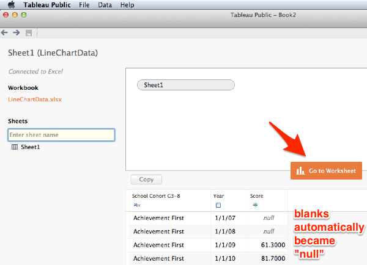
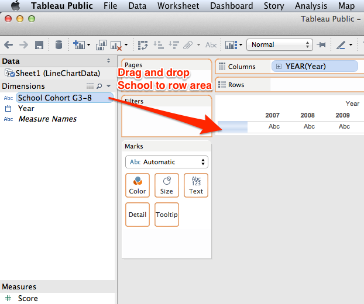
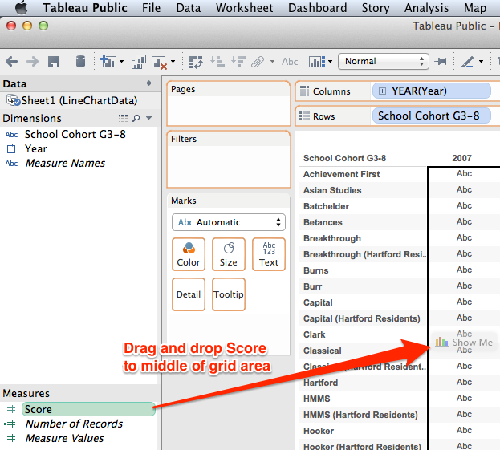
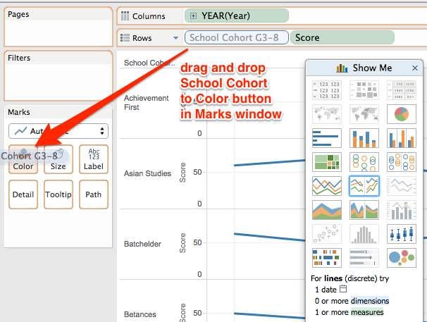
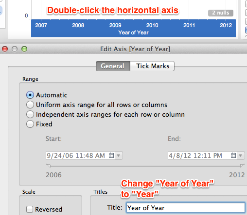
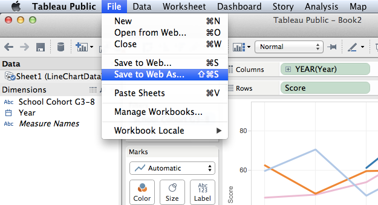

# Filtered line chart with Tableau Public

*By [Veronica X. Armendariz](introduction/contact.md), last updated May 5, 2015*

Explore this [interactive filtered line chart](http://jackdougherty.github.io/tableau-public-sample/linechart.html):

<iframe src='http://jackdougherty.github.io/tableau-public-sample/linechart.html' width="100%" height="600"></iframe>

With [Tableau Public](https://public.tableau.com), both Mac and Windows users now have another free and easy-to-use tool for creating interactive data visualizations that tell stories on the web. This tutorial demonstrates how to build a filtered line chart, with checkboxes to display selected school data, using screenshots from the Mac version (with similar steps in Windows). We created this visualization for a non-profit education advocacy group that wants web visitors to compare achievement by student cohorts across forty schools. Since displaying all of the lines at once is too complex, the filter box adds only the desired schools to the line chart, and users can float the cursor over each line to identify the school and data points.

Step 1: Organize your data in a format that Tableau Public can read. Before importing, examine your data in a spreadsheet tool (such as Microsoft Excel) and format the Year column as a Date. To avoid displaying “2007” as “1/1/2007,” create a custom date format as “yyyy,” which displays it as 2007. Also, leave all blank spaces in the spreadsheet as-is so that Tableau automatically converts them to “null” values during the data import.

Sample data files:
- [LineChartData.xlsx - long version](LineChartData.xlsx)
- [LineChartDataAY.xlsx - with academic years](LineChartDataAY.xlsx)
- [SchoolSnapshotSampleData.xlsx - sample school for Achieve Hartford](SchoolSnapshotSampleData.xlsx)

Step 2: Download a free copy of [Tableau Public](https://public.tableau.com), open the application, and click the Open Data button. (Note that users may pay to upgrade to Tableau Professional to access live server data across a wide range of business platforms.)

Step 3: Connect your spreadsheet data file to Tableau Public, search through your drive, and select it.

Step 4: The sheets of your data file will automatically appear in Tableau Public and allow you to rename them if you wish. Any blanks will automatically convert to “null.” Click the Go to Worksheet button.

Step 5: Tableau Public encourages users to select dimensions and measures, then drag-and-drop them into a grid of rows and columns, which serves as a framework for the interactive chart you wish to build. Dimensions are any information that is qualitative or categorical, while measures are quantitative information about the dimensions ([learn more from Tableau documentation](http://onlinehelp.tableau.com/v6.1/public/online/en-us/Id112A8A00YEX.html)).  In this example, we are creating a line chart with two dimensions (year and school) and one measure (test scores). Drag and drop Year into the Column area of the grid, which places our unit of time across the horizontal axis.

Step 6: Drag and drop School Cohorts dimension into the Row area of the grid, which will display this dimension in the vertical axis.

Step 7: Since Scores is a numerical measure, drag and drop this value into the middle of the grid, which will display all of the scores for each school and year.

Step 8: We need to reformat the Score measure so that the numbers are displayed individually, and not aggregated by default. Select Score (but not its drop-down menu), then go to the Analysis menu and turn off Aggregated Measures. All of the data measures will be visible.

Step 9: To visualize your data table as a line chart, go to the Show Me window and select Lines (continuous).

Step 10: Initially, each School row appears at its own chart. To blend all of them together into one master chart, drag the School Cohort dimension to the Marks window and drop it on the Color button. All of the School lines will appear in one chart, with identifying colors.

Step 11: To filter the line chart to display only selected items, go to the Marks window, select the School Cohort drop-down menu, and choose Show Quick Filter.

Step 12: In the Quick Filter window, select only a few Schools to display.

Step 13: Since the Quick Filter window shows users the schools they want to see, we don't necessarily need the legend that matches each school with a color. Optional: in the School Cohort window, select the drop-down menu and choose Hide Card to the color legend from your visualization.

Step 14: Make sure that all of the wording on the axes appears exactly as desired, and double-click any element to edit. For example, double-click the horizontal x-axis to change text from “Year to Year” to simply “Year.”

Step 15: Before saving your workbook, create a free Tableau Public account in your web browser. Once you have a valid login, in the Tableau Public app, go to File menu and select Save to Web As to save your work and make it publicly accessible. (If you wish to make your work private, upgrade to Tableau Professional.)

Step 16: After saving your workbook, Tableau will generate a general view of how your visualization appears on the web, with an option to email the link. To embed the visualization in your website, copy the HTML embed code and paste it into a web page that can host this code. 

In some websites, the HTML embed code can be pasted directly into a web page.

For self-hosted WordPress.org websites, which do not accept HTML code directly, we do this workaround:

- host the HTML embed code in the free GitHub Pages service
- paste the URL of the hosted GitHub Page as an iframe in our WordPress.org post or page

For more details, see the Host HTML code on the web with GitHub Pages tutorial in this book.

 Data Visualization for All by <a xmlns:cc="http://creativecommons.org/ns#" href="http://www.datavizbook.org/content/introduction/contact.html" property="cc:attributionName" rel="cc:attributionURL">Jack Dougherty and contributors</a> is licensed under a <a rel="license" href="http://creativecommons.org/licenses/by-nc/4.0/">Creative Commons Attribution-NonCommercial 4.0 International License</a>. You may freely share and modify this content for non-commercial purposes, with a source credit to the author(s) listed in the byline and this link: http://DataVizBook.org.
