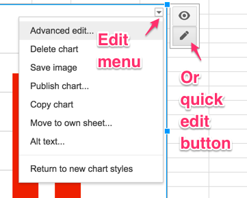
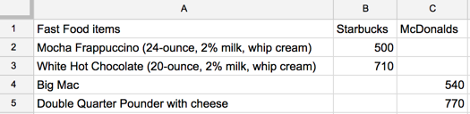

# Charts with Google Sheets
*By [Jack Dougherty](../../introduction/who.md), last updated January 22, 2017*

Use Google Sheets (http://sheets.google.com) to create common types of interactive charts that can be embedded in your website. In these tutorials, you will learn how to make:
- [Column chart with separated data](#<column-chart-with-separated-data>)
- [Bar chart with separated data](#<bar-chart-with-separated-data>)
- [Column chart with grouped data](#<column-chart-with-grouped-data>)
- [Stacked column chart](#<stacked-column-chart>)
- [Line chart](#<line-chart>)
- [Scatter chart](#<scatter-chart>)
- [Bubble chart with 3 columns](#<bubble-chart-with-3-columns>)
- [Bubble chart with 5 columns](#<bubble-chart-with-5-columns>)
- and [learn about more chart types](https://support.google.com/docs/answer/190718)

## Tool Review
- Pros:
  - Free and easy-to-learn tool on the collaborative Google Drive platform.
  - Edit, share, and host live charts from your data, all in one spreadsheet.
- Cons:
  - Limited control over chart appearance.
  - No automatic option to cite or link source data inside the chart.
  - Scatter charts do not correctly display data labels in tooltips, and cannot create bubble charts with uniform small bubble size. For alternative tools with greater power, see chapters in this book on [Tableau Public](../scatter-chart-tableau/) and [Highcharts](../../highcharts/).

** TO DO **
- clean up text steps below and make more uniform

### Column chart with separated data
Try it: Float your cursor over columns to explore data details.

<iframe width="600" height="371" seamless frameborder="0" scrolling="no" src="https://docs.google.com/spreadsheets/d/1_bzUNULtAgGesP-J9gke2xEn4jdaqfMb1d24ZuaAkzA/pubchart?oid=355867442&amp;format=interactive"></iframe><a href="https://docs.google.com/spreadsheets/d/1_bzUNULtAgGesP-J9gke2xEn4jdaqfMb1d24ZuaAkzA/edit#gid=1527457280">View data from USDA</a>

Best use: restate

Tutorial:
- Click to open in a new tab: [Google Sheet Column chart with separated data template](https://docs.google.com/spreadsheets/d/1_bzUNULtAgGesP-J9gke2xEn4jdaqfMb1d24ZuaAkzA/)
- Log in or [create your free Google account](http://sheets.google.com)
- Select File > Make a Copy to create your own version in your Google Drive.

- To remove the current chart from your copy, click it and press the delete button on your keyboard.
- Format your data in a similar way to the image below. Each row is a data series or group, which displays as a separate color in the chart.

- Use your cursor to select only the data you wish to chart, then select Insert > Chart.

- In the Chart Editor > Recommendations tab, choose your preferred Column chart, or see more options in Chart Types tab. Press the Insert button.

- To customize title and labels and more, click the editing controls in the upper-right corner. 

- To make your data public, select the blue Share button > Advanced, then Change from Private to Public On the Web, with Anyone Can View.

- To embed your chart in another website, click the chart editing controls in the upper-right corner, select Publish Chart, select Embed, and press the Publish button. Copy the iframe code and read the [Embed on Your Web](http://www.datavizforall.org/embed/) chapter.

### Bar chart with separated data
- Float cursor over columns to see data details

<iframe width="700" height="432" seamless frameborder="0" scrolling="no" src="https://docs.google.com/spreadsheets/d/1LGUYaVLoRcOiB8KcXb3Rn7LRj0exnUQYOy58LrkGPAk/pubchart?oid=1270431574&amp;format=interactive"></iframe><a href="https://docs.google.com/spreadsheets/d/1LGUYaVLoRcOiB8KcXb3Rn7LRj0exnUQYOy58LrkGPAk/edit#gid=956322126">View data from Starbucks and McDonalds</a>

- Best use: restate
- Try this [Google Sheet Bar chart with separated data template](https://docs.google.com/spreadsheets/d/1LGUYaVLoRcOiB8KcXb3Rn7LRj0exnUQYOy58LrkGPAk/)
- Format your data in a similar way to the image below. Each column is a data series or group, which displays as a separate color in the chart.

- Follow the same instructions as above, but in the Chart Editor > Recommendations tab, choose your preferred Bar chart, or see more options in Chart Types tab.

### Column chart with grouped data

<iframe width="600" height="371" seamless frameborder="0" scrolling="no" src="https://docs.google.com/spreadsheets/d/1ltA9siijVSDkTE3fzB3UaWHO7dotBIrGH4R9wI_Qyqw/pubchart?oid=787918829&amp;format=interactive"></iframe><a href="https://docs.google.com/spreadsheets/d/1ltA9siijVSDkTE3fzB3UaWHO7dotBIrGH4R9wI_Qyqw/edit#gid=1017658845">View data from CDC and StateOfObesity.org</a>

- Best use: restate
- Try this [Google Sheet Column chart with grouped data template](https://docs.google.com/spreadsheets/d/1ltA9siijVSDkTE3fzB3UaWHO7dotBIrGH4R9wI_Qyqw/)
- Format your data in a similar way to the image below. Each column is a data series or group, which displays as a separate color in the chart.

- Follow the same instructions as above, but in the Chart Editor > Recommendations tab, choose your preferred Column chart, or see more options in Chart Types tab.

### Stacked column chart

<iframe width="600" height="371" seamless frameborder="0" scrolling="no" src="https://docs.google.com/spreadsheets/d/1WS11EK33JCmvCRzSDh9UpP6R7Z2sHglF7ve5iJL6eZk/pubchart?oid=307057605&amp;format=interactive"></iframe><a href="https://docs.google.com/spreadsheets/d/1WS11EK33JCmvCRzSDh9UpP6R7Z2sHglF7ve5iJL6eZk/edit#gid=735710691">View data from WHO and CDC</a>

- Best use: restate and emphasize subgroups
- Try this [Google Sheets Stacked column chart template
- Format your data in a similar way to the image below.

- Follow the same instructions as above, but in the Chart Editor > Recommendations tab, choose Stacked column chart, or see more options in Chart Types tab.

### Line chart

<iframe width="600" height="371" seamless frameborder="0" scrolling="no" src="https://docs.google.com/spreadsheets/d/1wkWxxZ2-N5hqkcp7in8bxwdEcT1-XMnt1A8qUXxUSjw/pubchart?oid=2073830845&amp;format=interactive"></iframe><a href="https://docs.google.com/spreadsheets/d/1wkWxxZ2-N5hqkcp7in8bxwdEcT1-XMnt1A8qUXxUSjw/edit#gid=894957893">View source data from USDA</a>

- Best use: restate and emphasize continuous values (such as time) for each group
- Try this [Google Sheet Line chart template](https://docs.google.com/spreadsheets/d/1wkWxxZ2-N5hqkcp7in8bxwdEcT1-XMnt1A8qUXxUSjw/)
- Format your data in a similar way to the image below.

- Follow the same instructions as above, but in the Chart Editor > Recommendations tab, choose Line chart, or see more options in Chart Types tab.

### Scatter chart

<iframe width="626" height="387" seamless frameborder="0" scrolling="no" src="https://docs.google.com/spreadsheets/d/1LJCj3RaVgaQsAZriV_JDQhBrIBSvnH_N1LBCkZK1bqs/pubchart?oid=386475448&amp;format=interactive"></iframe><a href="https://docs.google.com/spreadsheets/d/1LJCj3RaVgaQsAZriV_JDQhBrIBSvnH_N1LBCkZK1bqs/edit#gid=562477420">View source data from World Bank</a>

** TO DO **
- explain data setup
- explain limitations of static data labels
- suggest alternatives: Google Sheet Bubble chart with 3 columns, or Scatter Chart with Tableau Public

### Bubble chart with 3 columns

<iframe width="600" height="371" seamless frameborder="0" scrolling="no" src="https://docs.google.com/spreadsheets/d/1CL7joH_3wvMYo9HIiSuFP0Ykv_Nl5DK6DYYcd3_gFnU/pubchart?oid=2105121864&amp;format=interactive"></iframe><a href="https://docs.google.com/spreadsheets/d/1CL7joH_3wvMYo9HIiSuFP0Ykv_Nl5DK6DYYcd3_gFnU/edit#gid=1602534273">View source data from World Bank</a>

** TO DO **
- rewrite this into 3 vs 5 column sections, and explain how to use 3-col instead of scatter chart

- Best use:   use this instead of a scatter chart in Google Sheets
- Try this Google Sheet template (link)
- Format your data in a similar way to the image below. The table must include 5 columns in this order:
  - A: label for each bubble
  - B: value on horizontal x-axis
  - C: value on vertical y-axis
  - D: data series: each group will appear in a different color, or leave blank for one color)
  - E: bubble size (option to display a third value, or set all one value (such as 15) for same size)
(insert screenshot)
- Follow the same instructions as above, but on the Chart Types tab, choose Bubble chart.
- Labels will appear on each bubble by default. To hide labels in the default display (and show them only in the interactive tooltips when floating the cursor over data), customize your chart by clicking editing controls in the upper-right corner, scroll down to Series, and change Labels > Color > None.

### Bubble chart with 5 columns

<iframe width="600" height="371" seamless frameborder="0" scrolling="no" src="https://docs.google.com/spreadsheets/d/1YgBWYm9nTGlCuyqSwU3SDb7xk-SMSPgjfYq5iLqL0nQ/pubchart?oid=200651442&amp;format=interactive"></iframe><a href="https://docs.google.com/spreadsheets/d/1YgBWYm9nTGlCuyqSwU3SDb7xk-SMSPgjfYq5iLqL0nQ/edit#gid=1182154897">View data from World Bank</a>

Explanation...

### Learn more
See additional chart types in this [Google Sheets Help Page](https://support.google.com/docs/answer/190718)
