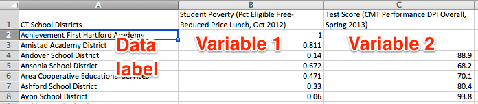
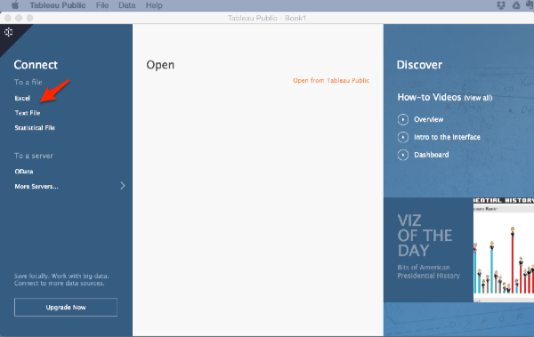
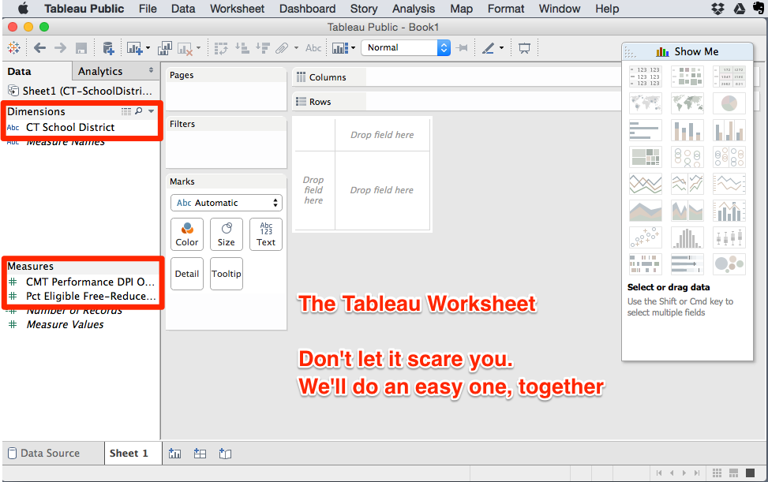
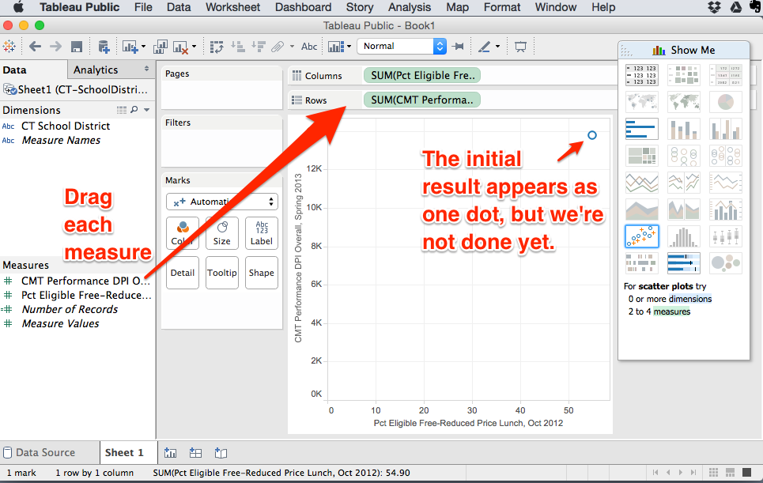
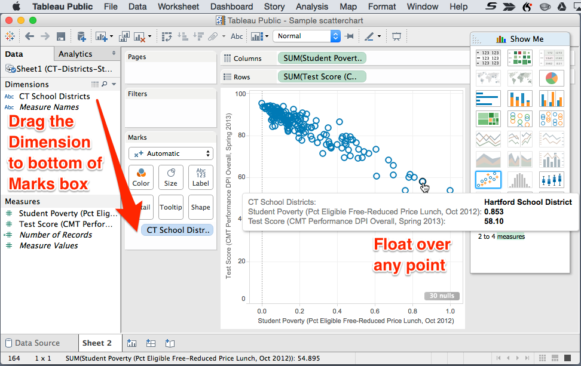
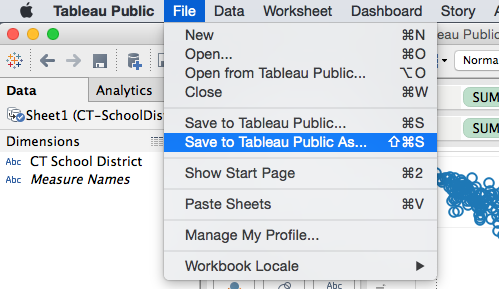

# Create an XY Scatter Chart with Tableau Public

A scatter chart shows the relationship between two variables by displaying a series of XY coordinate points. For example, if you want to view the relationship between a school district's test scores and its student poverty levels, place both of these variables inside an XY scatter chart, as shown below. With an online interactive version, viewers can explore the data and float over or click any point to see its label.

<!-- TO DO insert iframe of test and poverty here -->

## Prepare your XY data
For a simple XY scatter chart, create a spreadsheet that contains three columns: data labels, variable 1, and variable 2. For example, to compare how Connecticut school districts vary by student poverty and standardized test scores, I created this 3-column spreadsheet from two different tables that I found in the [Connecticut Open Data repository, Education section](https://data.ct.gov/Education).

TO DO: To learn how to join two different tables that share a similar column, see the VLookup instructions in this book, *to come*)

## The Tableau Public tool
Several tools can create scatter charts, but Tableau Public offers a relatively quick way to produce a highly interactive version that can easily be embedded on your site, with links to the data source.

Download and install Tableau Public (https://public.tableau.com/), currently available for Mac or Windows. The free Tableau Public app requires your data to become public, as the name suggests, and is designed for academics, journalists, and non-profit organizations that wish to publish data visualizations on the open web. If you wish to keep your visualizations and the underlying data private, the company sells a similar app called Tableau Desktop. (This tutorial displays screens from version 9.2 for Mac.)

Start up Tableau Public. Click connect to link to the data you prepared above, in an Excel spreadsheet, a generic text file (CSV, comma separated values), or a statistical file (for applications such as SAS, SPSS, and R.)

Tableau Public opens a new workbook and shows the data source tab, to confirm that your spreadsheet has been uploaded correctly. To create your visualization, go to the worksheet by clicking "Sheet 1" in the bottom-left corner.

At first glance, the Tableau Public worksheet can feel overwhelming. Don't let it scare you. We're going to do an easy one, together. On the left side, see the three columns of data. Tableau Public has automatically identified our first column (CT School District) as a "Dimension," and our second and third columns (test score and student poverty data) as "Measures."

The key to Tableau Public is learning where to drag items from the data tab into the main worksheet.

Drag one measure (such as student poverty) into the Columns field, where it will turn green. Drag the other measure (test scores) into the Rows field, where it also will turn green. The initial chart will appear as one dot, with all of your data clumped together, but don't worry. We're not done yet.

Drag the dimension (school districts) into the bottom of the Marks tab. Your scatter chart will appear. Float over each point to reveal its label and underlying data.

To reinforce the concept, here's a short animated loop of the two dragging steps above.

## Sharing your Tableau Public on the web

Go to File > Save to Tableau Public As. The next step requires signing up for a free Tableau account.

Save your Tableau Public workbook, with a meaningful name. Your interactive chart and underlying data will be published on the Tableau server and become publicly available.

After your workbook is saved on the server, Tableau Public will automatically open it in your default web browser. Click the Edit Details button to modify the title or add a brief description. Click the Share button to copy the embed code. Learn how to embed the interactive chart in your own website with iframe, in the [Publish section of this book](publish/about.md).

### TO DO
Redo the tutorial screenshots and steps by inserting simpler labels (Districts. . .; Poverty...; Test Scores...) in the Excel sheet, which will appear at front of the variable names.

[Data Visualization for All](http://datavizbook.org)
by [Jack Dougherty and contributors](introduction/contributors.md)
is published under a [Creative Commons Attribution-NonCommercial 4.0 International License](http://creativecommons.org/licenses/by-nc/4.0).
You may freely share and modify this content for non-commercial purposes, with a source credit to http://DataVizBook.org.
