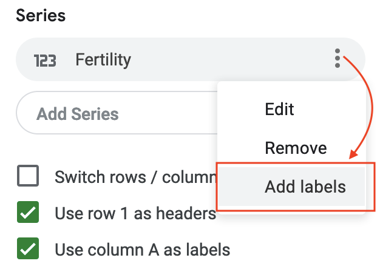

# Chart Your Data {#chart}
Charts pull readers deeper into your story. Even if your data contains geographical information,
sometimes a chart tells your story better than a map. But designing meaningful, interactive charts
requires careful thought about how to communicate your data story with your audience.

In this chapter, we will look at main [principles of chart design](chart-design.html), and
learn to identify good charts from bad ones. You will learn important rules that apply to all charts, and also some aesthetic guidelines to follow when customizing your own designs. In addition to static chart images, this book focuses on interactive charts that display more data when you float your cursor over them in your web browser. Later you'll learn how to [embed interactive charts on your website](embed.html) in chapter 7.

To begin, this grid of basic chart types will help you decide which type you wish to create. Your decision will be based on the format of your data, and the story you wish to tell, such as the type of data comparison you wish to draw to your reader's attention. Once you choose your chart type, follow our tool recommendations to create it. This chapter features easy-to-learn drag-and-drop tools, such as the [Google Sheets chart tool](chart-google-sheets.html), and for more advanced charts, [Tableau Public](tableau-public.html), the free version of the powerful software used by many data analysts and visualization practitioners. The grid also refers to more powerful chart tools, such as [Chart.js and Highcharts templates](chartjs-highcharts.html) in chapter 9, which give you ever more control over how your design and display your data, but also require learning how to [edit and host code templates with GitHub](github.html) in chapter 8.

Table: (\#tab:chart-types) Chart types covered in this book

| Basic chart types | Best use and tutorial chapters |
| --- | --- |
| Grouped column or bar<br>  | Best to compare categories side-by-side. Vertical columns, or horizontal bars for long labels. <br>Easy tool: [Google Sheets bar and column tutorial](column-bar-google.html)<br>Power tool: [Chart.js and Highcharts templates](chartjs-highcharts.html) |
| Separated column or bar<br>  | Best to compare categories in separate clusters. Vertical columns, or horizontal bars for long labels.<br>Easy tool: [Google Sheets bar and column tutorial](column-bar-google.html)<br>Power tool: [Chart.js and Highcharts templates](chartjs-highcharts.html) |
| Stacked column or bar<br>  | Best to compare sub-categories, or parts of a whole. Vertical columns, or horizontal bars for long labels.<br>Easy tool: [Google Sheets bar and column tutorial](column-bar-google.html)<br>Power tool: [Chart.js and Highcharts templates](chartjs-highcharts.html) |
| Histogram<br>  | Best to show distribution of raw data, with number of values in each bucket.<br>Easy tool: [Google Sheets bar and column tutorial](column-bar-google.html)<br>Power tool: [Chart.js and Highcharts templates](chartjs-highcharts.html) |
| Pie chart<br>  | Best to show parts of a whole, but hard to estimate size of slices.<br>Easy tool: [Google Sheets pie chart tutorial](pie-line-area-google.html)<br>Power tool: [Chart.js and Highcharts templates](chartjs-highcharts.html) |
| Line chart<br>  | Best to show continuous data, such as change over time.<br>Easy tool: [Google Sheets line chart tutorial](pie-line-area-google.html)<br>Power tool: [Chart.js and Highcharts templates](chartjs-highcharts.html) |
| Filtered line chart <br>  | Best to show multiple lines of continuous data, with on-off toggle buttons. <br>Easy tool: [Tableau Public filtered line chart tutorial](filtered-line-chart-tableau.html) |
| Stacked area chart<br>  | Best to show parts of a whole, with change over time. <br>Easy tool: [Google Sheets stacked area tutorial](pie-line-area-google.html)<br>Power tool: [Chart.js and Highcharts templates](chartjs-highcharts.html) |
| XY Scatter chart <br>  | Best to show the relationship between two sets of data. <br>Easy tool: [Google Sheets scatter chart tutorial](scatter-bubble-google.html) or [Tableau Public scatter chart tutorial](scatter-chart-tableau.html)<br>Power tool: [Chart.js and Highcharts templates](chartjs-highcharts.html) |
| Bubble chart <br>  | Best to show the relationship between three or four sets of data, using bubble size and color.<br>Easy tool: [Google Sheets bubble chart tutorial](scatter-bubble-google.html)<br>Power tool: [Chart.js and Highcharts templates](chartjs-highcharts.html) |

## Chart Design Principles {- #chart-design}

Although not a science, data visualization comes with a set of rules, principles, and best practices
that create a basis for clear and eloquent charts. Some of those rules are less rigid than others,
but prior to "breaking" them, it is important to establish why they are important.

Before you begin, ask yourself: Do I really need a chart to tell this data story?
Or would a table or text alone do a better job? Making a good chart takes time and effort,
so make sure it enhances your story.

### Deconstructing a Chart {-}

Let's take a look at Figure \@ref(fig:design-principles-chart-components).
It shows basic chart components that are shared among most chart types.

(ref:design-principles-chart-components) Common chart components.


```r
knitr::include_graphics("images/05-chart/design-principles-chart-components.png")
```

 

A *title* is perhaps the most important element of any chart. A good title is short, clear,
and tells a story on its own. For example, "Black and Asian Population More Likely to Die of Covid-19",
or "Millions of Tons of Plastic Enter the Ocean Every Year" are both clear titles.

Sometimes a more "dry" and "technical" title is preferred. Our two titles can then be changed to
"Covid-19 Deaths by Race in New York City, March 2020" and "Tons of Plastic Entering the Ocean, 1950–2020", respectively.

Often these two styles are combined into a title ("story") and a subtitle ("technical"), like that:

```
Black and Asian Population More Likely to Die of Covid-19
Covid-19 Deaths by Race in New York City, March 2020
```

Make sure your subtitle is less prominent than the title. You can achieve this by decreasing font size,
or changing font color (or both).

Horizontal (x) and vertical (y) *axes* define the scale and units of measure.

A *data series* is a collection of observations, which is usually a row or
a column of numbers, or *data points*, in your dataset.

*Labels* and *annotations* are often used across the chart to give more context. For example,
a line chart showing US unemployment levels between 1900 and 2020
can have a "Great Depression" annotation around 1930s, and "Covid-19 Impact" annotation for 2020,
both representing spikes in unemployment.
You might also choose to label items directly instead of relying on axes, which is common
with bar charts. In that case, a relevant axis can be hidden and the chart will look less cluttered.

A *legend* shows symbology, such as colors and shapes used in the chart, and their meaning (usually values that they represent).

You should add any *Notes*, *Data Sources*, and *Credits* underneath the chart to give more context about
where the data came from, how it was processed and analyzed, and who created the visualization.
Remember that being open about these things helps build credibility and accountability.

In interactive charts, a *tooltip* is often used to provide more data or context
once a user clicks or hovers over a data point or a data series.
Tooltips are great for complex visualizations with multiple layers of data,
because they declutter the chart. But because tooltips are harder to interact with on smaller screens,
such as phones and tablets, and are invisible when the chart is printed, only rely on them to convey
additional, nice-to-have information. Make sure all essential information
is visible without any user interaction.

### Some Rules are More Important than Others {-}

Although the vast majority of rules in data visualization are open to interpretation,
there are some that are hard to bend.

#### Bar charts must start at zero {-}

Bar charts use *length* to represent value, therefore their value axis *must start at zero*.
That applies to column and area charts as well.
This is to ensure that a bar twice the length of another bar represents twice its value.
The Figure \@ref(fig:design-principles-start-at-zero) shows a good and a bad example.

(ref:design-principles-start-at-zero) Start your bar chart at zero.


```r
knitr::include_graphics("images/05-chart/design-principles-start-at-zero.png")
```

 

Starting y-axis at anything other than zero is a common trick used by some media
and politicians to exaggerate differences in surveys and election results. Learn more about how to [detect bias in data stories](detect.html) in chapter 12.

#### Pie Charts Represent 100% {-}
Pie charts is one of the most contentious issues in data visualization.
Most dataviz practitioners will recommend avoiding them entirely, saying that
people are bad at accurately estimating sizes of different slices.
We take a less dramatic stance, as long as you adhere to the recommendations
we give in the next section.

But the one and only thing in data visualization that every single professional
will agree on is that *pie charts represent 100% of the quantity*.
If slices sum up to anything other than 100%, it is a crime. If you design a survey
titled *Are you a cat or a dog person?* and include *I am both* as the third option,
forget about putting the results into a pie chart.

### Chart Aesthetics {-}

Remember that you create a chart to help the reader understand the story, not to confuse them.
Decide if you want to show absolute numbers, percentages, or percent changes,
and do the math for your readers.

#### Avoid chart junk {-}
Start with a white background and add elements as you see appropriate.
You should be able to justify each element you add. To do so, ask yourself:
Does this element improve the chart, or can I drop it without decreasing readability?
This way you won't end up with so-called "chart junk" as shown
in Figure \@ref(fig:design-principles-junk), which includes 3D perspectives,
shadows, and unnecessary elements. They might have looked cool in
early versions of Microsoft Office, but let's stay away from them today.
Chart junk distracts the viewer and reduces chart readability and comprehension.
It also looks unprofessional and doesn't add credibility to you as a storyteller.

(ref:design-principles-junk) Chart junk distracts the viewer, so stay away from shadows, 3D perspectives, unnecessary colors and other fancy elements.


```r
knitr::include_graphics("images/05-chart/design-principles-junk.png")
```

 

Do not use shadows or thick outlines with bar charts, because the reader might think
that decorative elements are part of the chart, and thus misread the
values that bars represent.

The only justification for using three dimensions is to plot three-dimensional data,
which has x, y, and z values. For example, you can build a [three-dimensional map of
population density](https://blog.mapbox.com/3d-mapping-global-population-density-how-i-built-it-141785c91107),
where x and y values represent latitude and longitude. In most cases, however,
three dimensions are best represented in a bubble chart, or a scatterplot
with varying shapes and/or colors.

#### Beware of pie charts {-}
Remember that pie charts only show part-to-whole relationship, so all slices need to add up to 100%. Generally, the fewer slices—the better. Arrange slices from largest
to smallest, clockwise, and put the largest slice at 12 o'clock.
Figure \@ref(fig:design-principles-pie) illustrates that.

(ref:design-principles-pie) Sort slices in pie charts from largest to smallest, and start at 12 o'clock.


```r
knitr::include_graphics("images/05-chart/design-principles-pie.png")
```

 

If your pie chart has more than five slices, consider showing your data in a bar chart, either stacked or separated, like Figure \@ref(fig:design-principles-pie-to-bar) shows.

(ref:design-principles-pie-to-bar) Consider using bar charts instead of pies.


```r
knitr::include_graphics("images/05-chart/design-principles-pie-to-bar.png")
```

 

#### Don't make people turn their heads to read labels {-}
When your column chart has long x-axis labels that have to be rotated (often 90 degrees) to fit, consider turning the chart 90 degrees so that it becomes a horizontal bar chart. Take a look at Figure \@ref(fig:design-principles-turn-bar) to see how much easier it is to read horizontally-oriented labels.

(ref:design-principles-turn-bar) For long labels, use horizontal bar charts.


```r
knitr::include_graphics("images/05-chart/design-principles-turn-bar.png")
```

 

#### Arrange elements logically {-}
If your bar chart shows different categories, consider ordering them, like is shown in Figure \@ref(fig:design-principles-order-categories). You might want to sort them alphabetically, which can be useful if you want the reader to be able to quickly look up an item, such as their town. Ordering categories by value is another common technique that makes comparisons possible. If your columns represent a value of something at a particular time, they have to be ordered sequentially, of course.

(ref:design-principles-order-categories) For long labels, use horizontal bar charts.


```r
knitr::include_graphics("images/05-chart/design-principles-order-categories.png")
```

 

#### Do not overload your chart {-}
When labelling axes, choose natural increments that space equally, such as [0, 20, 40, 60, 80, 100], or [1, 10, 100, 1000] for a logarithmic scale. Do not overload your scales.
Keep your typography simple, and use (but do not overuse) **bolding** to highlight major insights.
Consider using commas as thousands separators for readability (`1,000,000` is much easier to read than `1000000`).

#### Be careful with the colors {-}
The use of color is a complex topic, and there are plenty
of books and research devoted to it. But some principles are fairly universal. First, do not use colors just for the sake of it, most charts are fine being monochromatic. Second, remember that colors come with some meaning attached, which can vary among cultures. In the world of business, red is conventionally used to represent loss, and it would be unwise to use this color to show profit. Make sure you avoid random colors.

Whatever colors you end up choosing, they need to be distinguishable (otherwise what is the point?). Do not use colors that are too similar in hue (for example, various shades of green–--leave them for choropleth maps). Certain color combinations are hard to interpret for color-blind people, like green/red or yellow/blue, so be very careful with those. Figure \@ref(fig:design-principles-color) shows some good and bad examples of color use.

(ref:design-principles-color) Don't use colors just for the sake of it.


```r
knitr::include_graphics("images/05-chart/design-principles-color.png")
```

 

If you follow the advice, you should end up with a de-cluttered chart as shown in
Figure \@ref(fig:design-principles-decluttered). Notice how your eyes are drawn to the bars and their corresponding values, not bright colors or secondary components like the axes lines.

(ref:design-principles-decluttered) Make sure important things catch the eye first.


```r
knitr::include_graphics("images/05-chart/design-principles-decluttered.png")
```

 

## Google Sheets Charts {- #chart-google-sheets}

In addition to powerful data wrangling capabilities, [Google Sheets](https://sheets.google.com)
has robust support for charting. Most people who create charts with Google Sheets export
them as static *png* images. But in fact these interactive charts can be
easily [embedded on your website](embed.html), as you'll learn in chapter 7.

In this section, we will look at creating column and bar charts that are separated,
grouped, and stacked. We will also look at making pie, line, area, and scatter charts,
and learn to visualize three-dimensional data using bubble charts.

As most easy-to-use tools, Google Sheets has its shortcomings.
You won't be able to control tooltips of scatterplot tooltips,
or cite or link to source data inside charts.
You won't be able to annotate or highlight items.
But you *will* be able to *quickly* make good-looking interactive charts
*quickly*.

Tip: Visit [Types of charts & graphs in Google Sheets](https://support.google.com/docs/answer/190718)
for an overview of the various chart types supported by this tool.

## Column and Bar Charts with Google Sheets {- #column-bar-google}

Column and bar charts are some of the most common types of charts
in data visualization (column charts are just vertical bar charts).
They are used to compare values across categories.

In this tutorial, we will use three small datasets to build interactive
separated, grouped, and stacked bar charts in Google Sheets:

* Obesity in the US (by US CDC and StateOfObesity.org project)
* High-Calorie Fast-Food Items
* Global Database on Body Mass Index by World Health Organization

### Grouped Column and Bar Charts {-}

Figure \@ref(fig:column-grouped) shows differences in obesity between men and women, grouped together in three age brackets to allow for easier gender comparisons across the same ages. In the interactive web version, hover over columns and see tooltips with data.

(ref:column-grouped) Grouped column chart with data from [StateOfObesity.org](http://stateofobesity.org/files/stateofobesity2016.pdf). Explore the [full-screen interactive version](https://docs.google.com/spreadsheets/d/e/2PACX-1vSkvNNrgYCpNtsaCRxn7g5o4UR8OJXSxBWvUK531t5vYubt39gecV9yLIfic89DCeJnGNvpRttFfKzn/pubchart?oid=787918829&format=interactive).


```r
if(knitr::is_html_output()) knitr::include_url("https://docs.google.com/spreadsheets/d/e/2PACX-1vSkvNNrgYCpNtsaCRxn7g5o4UR8OJXSxBWvUK531t5vYubt39gecV9yLIfic89DCeJnGNvpRttFfKzn/pubchart?oid=787918829&amp;format=interactive") else knitr::include_graphics("images/05-chart/column-grouped.png")
```

 

The following steps will help you recreate an interactive grouped column (or horizontal bar) chart.

1. Open [Google Sheet Column chart with grouped data template](https://docs.google.com/spreadsheets/d/1ltA9siijVSDkTE3fzB3UaWHO7dotBIrGH4R9wI_Qyqw/) in your browser.

2. Sign in to continue to Google Sheets (which is part of Google Drive). If you don't already have a Google account, you can create one.

3. Select File > Make a Copy to save your own version to your Google Drive, as shown in Figure \@ref(fig:file-make-copy2).

(ref:file-make-copy2) Make your own copy of the Google Sheet template.


```r
 knitr::include_graphics("images/05-chart/file-make-copy2.png")
```

\begin{figure}
\includegraphics[width=250px]{images/05-chart/file-make-copy2} \caption{(ref:file-make-copy2)}(\#fig:file-make-copy2)
\end{figure}

4. To remove the current chart from your copy of the spreadsheet, float your cursor to the top-right corner of the chart to make the 3-dot (kebab) menu appear, and select Delete, as shown in Figure \@ref(fig:delete-chart).

(ref:delete-chart) Float cursor in top-right corner of the chart to make the 3-dot (kebab) menu appear, and select Delete.


```r
 knitr::include_graphics("images/05-chart/delete-chart.png")
```

\begin{figure}
\includegraphics[width=180px]{images/05-chart/delete-chart} \caption{(ref:delete-chart)}(\#fig:delete-chart)
\end{figure}

Note: Another name for the 3-dot menu symbol is the "kebab menu" because it resembles Middle Eastern
food cooked on a skewer, in contrast to the three-line "hamburger menu" on many mobile devices,
as shown in Figure \@ref(fig:menu-hamburger-kebab).

(ref:menu-hamburger-kebab) You should be able to distinguish kebab from hamburger menu icons.


```r

```

 

5. Format your data to make each column a data series, as shown in Figure \@ref(fig:column-grouped-data), which means it will display as a separate color in the chart.

(ref:column-grouped-data) Format data in columns to make colored grouped columns in your chart.


```r
 knitr::include_graphics("images/05-chart/column-grouped-data.png")
```

\begin{figure}
\includegraphics[width=350px]{images/05-chart/column-grouped-data} \caption{(ref:column-grouped-data)}(\#fig:column-grouped-data)
\end{figure}

6. Use your cursor to select only the data you wish to chart, then go to the Insert menu and select Chart, as shown in Figure \@ref(fig:column-grouped-insert).

(ref:column-grouped-insert) Select your data and then Insert the Chart.


```r
 knitr::include_graphics("images/05-chart/column-grouped-insert.png")
```

\begin{figure}
\includegraphics[width=250px]{images/05-chart/column-grouped-insert} \caption{(ref:column-grouped-insert)}(\#fig:column-grouped-insert)
\end{figure}

7. In the Chart Editor, change the default selection to Column chart, with Stacking none, to display Grouped Columns, as shown in Figure \@ref(fig:column-grouped-editor). Or select *Horizontal bar chart* if you have longer labels.

(ref:column-grouped-editor) Change the default to Column chart, with Stacking none.


```r
 knitr::include_graphics("images/05-chart/column-grouped-editor.png")
```

\begin{figure}
\includegraphics[width=250px]{images/05-chart/column-grouped-editor} \caption{(ref:column-grouped-editor)}(\#fig:column-grouped-editor)
\end{figure}

8. To customize title, labels, and more, in the Chart Editor select Customize, as shown in Figure \@ref(fig:chart-editor-customize).

(ref:chart-editor-customize) Select Customize to edit title, labels, and more.


```r
 knitr::include_graphics("images/05-chart/chart-editor-customize.png")
```

\begin{figure}
\includegraphics[width=250px]{images/05-chart/chart-editor-customize} \caption{(ref:chart-editor-customize)}(\#fig:chart-editor-customize)
\end{figure}

9. To make your data public, go to the upper-right corner of your sheet to click the Share button, and in the next screen, click the words "Change to anyone with the link," as shown in Figure \@ref(fig:share-button-sheet). This means your sheet is no longer Restricted to only you, but can be viewed by anyone with the link. See additional options.

(ref:share-button-sheet) Click the Share button and then click *Change to anyone with the link* to make your data public.


```r
 knitr::include_graphics("images/05-chart/share-button-sheet-annotated.png")
```

\begin{figure}
\includegraphics[width=350px]{images/05-chart/share-button-sheet-annotated} \caption{(ref:share-button-sheet)}(\#fig:share-button-sheet)
\end{figure}

10. To embed an interactive version of your chart in another web page, click the kebab menu in the upper-right corner of your chart, and select Publish Chart, as shown in Figure \@ref(fig:chart-publish). In the next screen, select Embed and press the Publish button. See [Chapter 7 Embed on the Web](embed.html) to learn what to do with the iframe code.

(ref:chart-publish) Select Publish Chart to embed an interactive chart on another web page, as described in Chapter 7.


```r
 knitr::include_graphics("images/05-chart/chart-publish.png")
```

\begin{figure}
\includegraphics[width=200px]{images/05-chart/chart-publish} \caption{(ref:chart-publish)}(\#fig:chart-publish)
\end{figure}

Note: Currently, there is no easy way to cite or link to your source data inside a Google Sheets chart.
Instead, cite and link to your source data in the text of the web page. Remember that citing your sources
adds credibility to your work.

### Separated Column and Bar Charts {-}

When you visualize independent categories of data, and you don't want them to appear grouped together, then create a chart with separated columns (or horizontal bars, if you have long data labels). For example, Figure \@ref(fig:bar-separated) is a separated bar chart of calorie counts of fast food items for two restaurant chains, Starbucks and McDonald's. Unlike the grouped column chart in Figure \@ref(fig:column-grouped), here the bars are separated from each other, because we do not need to make comparisons between sub-groups.

(ref:bar-separated) Separated bar chart with data from [Starbucks and McDonalds](https://docs.google.com/spreadsheets/d/1LGUYaVLoRcOiB8KcXb3Rn7LRj0exnUQYOy58LrkGPAk/edit#gid=956322126). Explore the [full-screen interactive version](https://docs.google.com/spreadsheets/d/e/2PACX-1vSkvNNrgYCpNtsaCRxn7g5o4UR8OJXSxBWvUK531t5vYubt39gecV9yLIfic89DCeJnGNvpRttFfKzn/pubchart?oid=787918829&format=interactive).


```r
if(knitr::is_html_output()) knitr::include_url("https://docs.google.com/spreadsheets/d/1LGUYaVLoRcOiB8KcXb3Rn7LRj0exnUQYOy58LrkGPAk/pubchart?oid=1270431574&amp;format=interactive") else knitr::include_graphics("images/05-chart/bar-separated.png")
```

 

The only difference between making a grouped versus a separated chart is how you structure your data.
To make Google Sheets separate columns or bars, you need to leave some cells blank, as shown in Figure \@ref(fig:bar-separated-data).
The rest of the steps remain the same as above.

(ref:bar-separated-data) Create a separated column or bar chart by leaving some cells blank.


```r
 knitr::include_graphics("images/05-chart/bar-separated-data.png")
```

 

To create your own separated column or bar chart using the fast-food example,
make a copy of [Google Sheet Separated Bar Chart template](https://docs.google.com/spreadsheets/d/1LGUYaVLoRcOiB8KcXb3Rn7LRj0exnUQYOy58LrkGPAk/).

### Stacked Column and Bar Charts {-}

Stacked column and bar charts can be used to compare subcategories. They can also be used
to represent parts of a whole instead of pie charts. For example, the stacked column chart in Figure \@ref(fig:column-stacked) compares the percentage of overweight residents across nations, where colors allow for easy comparisons of weight-group subcategories across nations.

(ref:column-stacked) Stacked column chart with data from [WHO and CDC](https://docs.google.com/spreadsheets/d/1WS11EK33JCmvCRzSDh9UpP6R7Z2sHglF7ve5iJL6eZk/edit#gid=735710691). Explore the [full-screen interactive version](https://docs.google.com/spreadsheets/d/e/2PACX-1vSZrCP99EDqmpYc3VxFF5-Fpryh7KOU3GZ39Gl33OmDw4ecWKXxjrfzHDeQKfandKiUwvDkyF6kwK6L/pubchart?oid=307057605&format=interactive).


```r
if(knitr::is_html_output()) knitr::include_url("https://docs.google.com/spreadsheets/d/e/2PACX-1vSZrCP99EDqmpYc3VxFF5-Fpryh7KOU3GZ39Gl33OmDw4ecWKXxjrfzHDeQKfandKiUwvDkyF6kwK6L/pubchart?oid=307057605&amp;format=interactive") else knitr::include_graphics("images/05-chart/column-stacked.png")
```

 

To create a stacked column or bar chart, structure your data so that each column will become a new series with its own color, as shown in Figure \@ref(fig:column-stacked-data). Then in the Chart Editor window, choose Chart Type > Stacked column chart (or Stacked bar chart). The rest of the steps are similar to the ones above.

(ref:column-stacked-data) Create a stacked column or bar chart by structuring your data as shown.


```r
 knitr::include_graphics("images/05-chart/column-stacked-data.png")
```

\begin{figure}
\includegraphics[width=350px]{images/05-chart/column-stacked-data} \caption{(ref:column-stacked-data)}(\#fig:column-stacked-data)
\end{figure}

To create your own stacked column or bar chart using the international weight level example,
visit the [Google Sheets Stacked Column Chart template](https://docs.google.com/spreadsheets/d/1WS11EK33JCmvCRzSDh9UpP6R7Z2sHglF7ve5iJL6eZk/)
and make a copy of the spreadsheet.

To change colors of series (for example, to show Overweight category in red),
click the kebab menu in the top-right corner of the chart, then
go to *Edit Chart > Customize > Series*. There, choose the appropriate series
from the dropdown menu, and set its color from the Color dropdown menu that appears.


### Histograms {-}

Histogram is a type of bar chart that represents distribution of items, whether numerical
or categorical. To build a histogram, you need to assign each data point to one of
the non-overlapping *buckets* (or *bins*).

Let's say you want to know what time of day you are more likely to get an email.
One approach would be to download metadata about all emails you received in 2020,
and assign them to a bucket between 0 and 23 according to the email hour.
Hours will become your bins, and email counts will be your frequency data.
Then your final dataset would look something like this:

```
| Hour | Emails |
| ---- | ------ |
| 0    | 12     |
| 1    | 11     |
| 2    | 7      |
.................
| 22   | 34     |
| 23   | 22     |
```
You can now make a histogram. The good news is, Google Sheets considers histograms to
be regular column charts, so you should be able to use a previous tutorial to make one.

Select two columns with the data you want to visualize,
and go to Insert > Chart. In the Chart editor window, in the Setup tab, select Chart type > Column chart. See the result in Figure \@ref(fig:histogram)

(ref:histogram) Histogram chart with [fictitious source data](https://docs.google.com/spreadsheets/d/1V-r1bOWpvyCRhmJa0gRZ1TEchXvrr7UTZ97rKOU1WRo/edit#gid=0). Explore the [full-screen interactive version](https://docs.google.com/spreadsheets/d/e/2PACX-1vRyg09UZgGWVHPk3oOKAZ-zlqtDF_RpvOLdAsM-k-ZW5NavcxAyHbErgr-7dt7U_AFSVZONSTZ9sVII/pubchart?oid=509234663&format=interactive).


```r
if(knitr::is_html_output()) knitr::include_url("https://docs.google.com/spreadsheets/d/e/2PACX-1vRyg09UZgGWVHPk3oOKAZ-zlqtDF_RpvOLdAsM-k-ZW5NavcxAyHbErgr-7dt7U_AFSVZONSTZ9sVII/pubchart?oid=509234663&amp;format=interactive") else knitr::include_graphics("images/05-chart/histogram.png")
```

 

If you wish to use our fictional email dataset to create your own histogram, you can make a copy of the
[Histogram Chart template](https://docs.google.com/spreadsheets/d/1V-r1bOWpvyCRhmJa0gRZ1TEchXvrr7UTZ97rKOU1WRo/edit?usp=sharing).

Bins in a histogram should span (in other words, "cover") the entire range of values of your dataset.
This way you don't leave out any data. We recommend you use bins of the same size (like 24 1-hour bins, or four 6-hour bins) to ensure
readers can compare across bars. For example, if you want to create a less detailed histogram, you can combine hours into larger bins, such as
*Morning*, *Afternoon*, *Evening*, and *Night*
to cover the hours of 6–11, 12–17, 18–23, and 0–5, respectively. Then your dataset will look like:

```
| TimeOfDay | Emails |
| --------- | ------ |
| Morning   | 353    |
| Afternoon | 497    |
| Evening   | 279    |
| Night     | 37     |
```

## Pie, Line, and Area Charts with Google Sheets {- #pie-line-area-google}

#### Pie Chart {-}
As we mentioned in the [Chart Aesthetics section](chart-design.html), you need to be careful when using pie charts.
First, remember to not have too many slices (ideally you should limit slices to 5). They should be arranged
from largest to smallest and start at 12 o'clock. To separate slices, you can use different slice colors,
or lines.

Make sure your data adds up to 100%. For example, if you want to show a pie chart with the number of fruit your store had
sold in a day—--21 apples, 5 oranges, and 32 bananas—--the sum of all fruit, 58, is your 100%.
Then a reader can figure out that of all fruits sold, approximately 55% were bananas.
This example is illustrated in Figure \@ref(fig:pie).
If you decided to include *some*, but *not all* other items that your store has sold (for example,
you include pizzas but exclude ice cream), your pie chart would not make sense.

(ref:pie) Pie chart with [fictitious source data](https://docs.google.com/spreadsheets/d/11cn0eysXqXIwhcTKmGuzMDw_RmpDpYLKZN3TeevT-Vg/edit?usp=sharing). Explore the [full-screen interactive version](https://docs.google.com/spreadsheets/d/e/2PACX-1vQai8YWkqMOHsiwWXpe1jyhBKy5wW6zcMaEIklkF-598h1QaVBrRR0F9JVrsX2Zo5ihXWP-HlnY-KlE/pubchart?oid=760990456&format=interactive).


```r
if(knitr::is_html_output()) knitr::include_url("https://docs.google.com/spreadsheets/d/e/2PACX-1vQai8YWkqMOHsiwWXpe1jyhBKy5wW6zcMaEIklkF-598h1QaVBrRR0F9JVrsX2Zo5ihXWP-HlnY-KlE/pubchart?oid=760990456&amp;format=interactive") else knitr::include_graphics("images/05-chart/pie.png")
```

 

To make a pie chart with Google Sheets, arrange your data in two columns, *Label* and *Value*.
Values can be expressed as either percentages or counts.
For example,

```
| Apple  |  21 |
| Orange |   5 |
| Banana |  32 |
```

Select all cells and go to *Insert > Chart*. Google Sheets is good at guessing chart types,
so it is possible the chart you will see right away will be a pie. If not, in Chart editor in tab Setup,
select  *Pie chart* from the Chart type dropdown list.

Notice that slices are ordered the same way they appear in the spreadsheet. We highly recommend you
sort values from largest to smallest: right-click the header of your values column, and choose `Sort sheet Z-A`.
You will see that the chart updates automatically.

Right-click on the chart, and choose *Chart & axis titles > Chart title* to add a meaningful title.
In *Customize* tab of the Chart editor, you can also change colors and add borders to slices.

#### Line Chart {-}
The most common use of line charts is to represent values at different points in time,
in other words to show change over time. The line chart in Figure \@ref(fig:line) shows per-capita
meat availability in the US for the past 110 years. You can see that
the level of chicken (shown in light-green) rises steadily and surpasses beef (blue) and pork (gray).

(ref:line) Line chart showing meat availability per capita in the US, according to the [US Department of Agriculture](https://docs.google.com/spreadsheets/d/1wkWxxZ2-N5hqkcp7in8bxwdEcT1-XMnt1A8qUXxUSjw/edit?usp=sharing). Explore the [full-screen interactive version](https://docs.google.com/spreadsheets/d/e/2PACX-1vS38EC_34L8gKK9NStS8S322BzvBRbnRNpu9KXQ4oHHpaDmVMBAhEu4SXtCC6CD2yv_V6brX8s386Nf/pubchart?oid=2073830845&format=interactive).


```r
if(knitr::is_html_output()) knitr::include_url("https://docs.google.com/spreadsheets/d/e/2PACX-1vS38EC_34L8gKK9NStS8S322BzvBRbnRNpu9KXQ4oHHpaDmVMBAhEu4SXtCC6CD2yv_V6brX8s386Nf/pubchart?oid=2073830845&amp;format=interactive") else knitr::include_graphics("images/05-chart/line.png")
```

 

The simplest way to organize your data is to use the first column as x-axis labels,
and each additional column as a new series (which will become its own line).
For example, the meat data from the line chart is
structured as shown in Figure \@ref(fig:line-data).

(ref:line-data) Data for the line chart shown in Figure \@ref(fig:line).


```r
knitr::include_graphics("images/05-chart/line-data.png")
```

\begin{figure}
\includegraphics[width=250px]{images/05-chart/line-data} \caption{(ref:line-data)}(\#fig:line-data)
\end{figure}

The data is available in the [Google Sheet Line chart template](https://docs.google.com/spreadsheets/d/1wkWxxZ2-N5hqkcp7in8bxwdEcT1-XMnt1A8qUXxUSjw/).
If you wish to use it, just make a copy to your own Google Drive from the File menu.

Select the data, and choose *Insert > Chart*. It is possible Google Sheets will create a line chart right away.
If not, in Chart editor in tab Setup, select  *Line chart* from the Chart type dropdown list.

#### Stacked Area Chart {-}
The line chart in the previous example made it possible to see how individual meat availability changed over time.
It was hard, however, to estimate if the overall meat availability went up or down.
(That is, of course, if we assume that beef, pork, and chicken are the only meats we eat).

We can see how availability of individual meat types, *and* the total meat availability over time
using a stacked area chart, like shown in Figure \@ref(fig:stacked-area). Here, we can still see that chicken
has been on the rise since the 1970s. We can also see that the total availability was on the
rise between 1910 and 1970 with a small dip around 1930s, and it didn't change much between
1970 and 2017.

(ref:stacked-area) In addition to individual meat availability, stacked area charts show the overall availability. See data by [US Department of Agriculture](https://docs.google.com/spreadsheets/d/16QR4prVUoztW6bFVyj_q0n8GjNWqkcW6sgAkIyHQIJc/edit?usp=sharing). Explore the [full-screen interactive version](https://docs.google.com/spreadsheets/d/e/2PACX-1vSotrM_zZDo0MT--JgXwA3nBQudzIwmt8TGwmZxvUxNUzPrfBgqso5glLn05ObJxdTTmKoT_fQWQMx-/pubchart?oid=1976471326&format=interactive).


```r
if(knitr::is_html_output()) knitr::include_url("https://docs.google.com/spreadsheets/d/e/2PACX-1vSotrM_zZDo0MT--JgXwA3nBQudzIwmt8TGwmZxvUxNUzPrfBgqso5glLn05ObJxdTTmKoT_fQWQMx-/pubchart?oid=1976471326&amp;format=interactive") else knitr::include_graphics("images/05-chart/stacked-area.png")
```

 

The data for the stacked area chart is available from the [Google Sheet Stacked area chart template](https://docs.google.com/spreadsheets/d/16QR4prVUoztW6bFVyj_q0n8GjNWqkcW6sgAkIyHQIJc/),
which you copy to your own Drive.

Set up the data exactly as you would with a line chart (first column is labels for the x-axis,
second and following columns are series, or lines). Select it, and choose *Insert > Chart*.
In the Chart editor, in tab Setup, select  *Stacked area chart* from the Chart type dropdown list.

## XY Scatter and Bubble Charts with Google Sheets {- #scatter-bubble-google}
Consider using XY scatter charts, also known as scatterplots, to display data coordinates to show the relationship between
two variables. The first example below compares the relationships between life expectancy (shown on the X axis) and fertility (shown on the Y axis),
which each nation is represented as a dot (an X-Y coordinate).
Bubble charts are basically scatter charts on steroids, meaning that they can display the relationship of up to five variables.
Further below you'll build a bubble chart based on the same XY life expectancy-fertility dataset, with added variables for population (displayed as circle size) and region of the world (displayed as circle color).

Fancier bubble charts animate the circles to represent one more variable: change over time.
Such animated bubble charts were popularized by Hans Rosling, a renowned Swedish professor
of global health.

Note: We recommend you watch one of Hans Rosling's famous [TED talks](https://www.ted.com/talks/hans_rosling_the_best_stats_you_ve_ever_seen)
to see animated bar charts in action. You can also visit [Gapminder Foundation website](https://www.gapminder.org/) to see more data visualizations
and learn more about Hans's work and legacy.

#### XY Scatter chart {-}
The scatter chart in Figure \@ref(fig:scatter) uses World Bank data to reveal a downward slope:
nations with lower fertility (births per woman)
tend to have higher life expectancy. You can also phrase is the other way,
nations with higher life expectancy at birth have lower fertility.
Remember that correlation does not
mean causation, so you cannot use this chart to argue that fewer
births result in longer lives, or that longer-living females give birth to fewer children.

(ref:scatter) This scatter chart shows that nations with lower fertility tend to have higher life expectancy. [See data](https://docs.google.com/spreadsheets/d/1LJCj3RaVgaQsAZriV_JDQhBrIBSvnH_N1LBCkZK1bqs/) by World Bank. Explore the [full-screen interactive version](https://docs.google.com/spreadsheets/d/e/2PACX-1vSyKSe_dy3FURPuTllvmGBvI1b-J5_7Q3hR_6bdP20olDFA79OqoGOKEqtxfhv796NMXJO5vzhs_d0f/pubchart?oid=386475448&format=interactive).


```r
if(knitr::is_html_output()) knitr::include_url("https://docs.google.com/spreadsheets/d/e/2PACX-1vSyKSe_dy3FURPuTllvmGBvI1b-J5_7Q3hR_6bdP20olDFA79OqoGOKEqtxfhv796NMXJO5vzhs_d0f/pubchart?oid=386475448&amp;format=interactive") else knitr::include_graphics("images/05-chart/scatter.png")
```

 

The data used in Figure \@ref(fig:scatter) is available from our
[Google Sheets Scatter chart template](https://docs.google.com/spreadsheets/d/1LJCj3RaVgaQsAZriV_JDQhBrIBSvnH_N1LBCkZK1bqs/edit?usp=sharing).
You can copy it to your own Google Drive so that you're able to edit it (go to *File > Make a copy*).

Figure \@ref(fig:scatter-data) shows the first few rows of the dataset.
Notice that the data is structured in three columns. The first column, *Life Expectancy*,
is plotted on the x-axis (horizontal). The second column, *Fertility*, is plotted on the y-axis (vertical).
The third column contains *Country* labels.

(ref:scatter-data) Data for a scatterplot is usually represented in 3 columns: x-values, y-values, and labels.


```r
knitr::include_graphics("images/05-chart/scatter-data.png")
```

\begin{figure}
\includegraphics[width=350px]{images/05-chart/scatter-data} \caption{(ref:scatter-data)}(\#fig:scatter-data)
\end{figure}

To build a scatter chart, select the *two* columns that contain your numeric data,
and go to *Insert > Chart*. Google Sheets will likely to guess the chart type and you will see a scatterplot,
but if not, you can always manually pick Scatter chart from the *Chart type* dropdown.
Make sure your x-axis is set to Life Expectancy, and your Series shows Fertility.
Note that both Life Expectancy and Fertility have `123` icon, meaning they are numeric.

You will see a lot of scatter charts out there that do not label data points, and that's okay.
Some scatter plots are designed to show whether or not there is a correlation, and knowing
which points are which is not important. But sometimes labels are important for your storytelling.

In Chart editor, open the kebab menu (3 dots) of your Series dataset (Fertility), and then *Add labels*
(see Figure \@ref(fig:scatter-labels)).
The labels added by default will be the x-values of points. To make Google Sheets read
labels from the third column (*Country*), click the name of your label dataset (Life Expectancy),
then *Select a data range* button in the upper-right corner of the dropdown,
and choose cells in the relevant columns. Make sure to include the header (first row) if
all other data ranges include it.

(ref:scatter-labels) In the chart's Setup window, choose *Add labels* to the Series.


```r

```

\begin{figure}
\includegraphics[width=350px]{images/05-chart/scatter-labels-annotated} \caption{(ref:scatter-labels)}(\#fig:scatter-labels)
\end{figure}

Tip: You may notice that some data points are too close to edges, and their labels are cut off.
To fix this, go to Customize tab of the Chart editor. There, you can set minimum and maximum values
for both horizontal and vertical axes. Unlike in bar charts, axes in scatter plots do not have to start at zero.
You can set your minimum and maximum values to be a few units below and above the extreme points of your
data range.

#### Bubble chart with 3 columns {-}
In this tutorial, we will show you a little trick that you can use if you want a scatter chart
with both data values displayed in a tooltip. We will use the same
World Bank dataset as we did for the scatter plot.

The bubble chart (more about the *proper* use of bubble charts in the next section)
in Figure \@ref(fig:bubble-3) shows the same data as our scatterplot on life expectancy vs fertility.

In the interactive version of the chart, hover your cursor over each bubble (dot) to reveal a tooltip
with the country name and the two data points.

(ref:bubble-3) This bubble chart is essentially a scatter chart, because no other dimensions (colors, sizes) are used. [See data](https://docs.google.com/spreadsheets/d/1CL7joH_3wvMYo9HIiSuFP0Ykv_Nl5DK6DYYcd3_gFnU/edit?usp=sharing) by World Bank. Explore the [full-screen interactive version](https://docs.google.com/spreadsheets/u/3/d/e/2PACX-1vQtMosshgyX6YoPpHo9QhSPk-ckOw1_yRryTF_vYJooBeWF13RaPv2IrGffcpaiqHPwfKFJAWY0HwA3/pubchart?oid=2105121864&format=interactive).


```r
if(knitr::is_html_output()) knitr::include_url("https://docs.google.com/spreadsheets/d/1CL7joH_3wvMYo9HIiSuFP0Ykv_Nl5DK6DYYcd3_gFnU/pubchart?oid=2105121864&amp;format=interactive") else knitr::include_graphics("images/05-chart/bubble-3.png")
```

 

The data for this example is available in [Google Sheets Bubble chart with 3 columns template](https://docs.google.com/spreadsheets/d/1CL7joH_3wvMYo9HIiSuFP0Ykv_Nl5DK6DYYcd3_gFnU/).

Notice that we moved the labels column (*Country*) to be the first one in the dataset,
but the order shouldn't matter in this case. So our first column is the label for each bubble,
the second column is the data to be plotted on horizontal x-axis, and the third column (fertility)
will be placed on the y-axis.

Select all three columns, and go to *Insert > Chart*. Google Sheets will likely create a stacked
column chart by default, so choose *Bubble* from the Chart type dropdown window.

If you want to remove labels from the bubbles, remove the *ID* series (click on the kebab menu > Remove).

Unfortunately, there is no easy way to reduce all bubbles to a uniformly smaller size.
In the following section, we will introduce you to the proper way of using bubble charts.

#### Bubble chart with 5 columns {-}
Bubble charts are a good alternative to scatter charts if you need to include
one or two extra series in addition to your x- and y-coordinates. One of those
can be expressed through bubble size (bigger bubbles represent larger values).
Another one can make use of color (best for categorical data).

The bubble chart in Figure \@ref(fig:bubble-5) shows fertility and life expectancy for a subset of the nations,
with population (shown by bubble size) and region (shown by bubble color).
Float your cursor over bubbles to view data details in the interactive version of the chart.

(ref:bubble-5) This bubble chart shows fertility and life expectancy for several countries, including their population (shown by bubble size) and region (shown by bubble color). [See data](https://docs.google.com/spreadsheets/d/1YgBWYm9nTGlCuyqSwU3SDb7xk-SMSPgjfYq5iLqL0nQ/) by World Bank. Explore the [full-screen interactive version](https://docs.google.com/spreadsheets/d/e/2PACX-1vQV0lrK1Lomxg-2IJJAYrB8Dvb9uc9mu5bKM2S8sWHzY9-E6ajoZwU4fRSghe2kXIHcmK4SfZO2NG4B/pubchart?oid=200651442&format=interactive).


```r
if(knitr::is_html_output()) knitr::include_url("https://docs.google.com/spreadsheets/d/e/2PACX-1vQV0lrK1Lomxg-2IJJAYrB8Dvb9uc9mu5bKM2S8sWHzY9-E6ajoZwU4fRSghe2kXIHcmK4SfZO2NG4B/pubchart?oid=200651442&amp;format=interactive") else knitr::include_graphics("images/05-chart/bubble-5.png")
```

 

The five-column dataset is available in this [Google Sheets Bubble chart with 5 columns template](https://docs.google.com/spreadsheets/d/1YgBWYm9nTGlCuyqSwU3SDb7xk-SMSPgjfYq5iLqL0nQ/).
The columns are arranged in the following order: country label, x-axis value,
y-axis value, color, and bubble size.

(ref:bubble-5-data) Bubble chart data. Bubble size represents population, color – region.


```r
knitr::include_graphics("images/05-chart/bubble-5-data.png")
```

\begin{figure}
\includegraphics[width=400px]{images/05-chart/bubble-5-data} \caption{(ref:bubble-5-data)}(\#fig:bubble-5-data)
\end{figure}

Select all data and go to *Insert > Chart*, and choose Bubble as the Chart type.
Make sure your *ID*, *X-axis*, *Y-axis*, *Series*, and *Size* fields
contain the series you want to display, and make sure to have *Use row 1 as headers* option checked.

To change labels color, go to Customize tab of the Chart editor, and set Text color under the Bubble menu.
Make it gray or black, so that it won't interfere with the bubble colors themselves.

Tip: If some of your bubbles are too close to the borders, set Min and Max values for the axis manually
under Horizontal axis and Vertical axis menus.

## Create Charts with Tableau Public {- #tableau-public}

Tableau is powerful data visualization software used by many professionals and organizations
to analyze and present data. Tableau can combine multiple datasets to show in a single chart (or a map),
and allows to create dashboards with multiple visualizations. Individual visualizations
and dashboards can be published and embedded on your website through an iframe.

This book focuses on the free [Tableau Public tool](https://public.tableau.com), available to download for Mac or Windows. This free version of Tableau Public is very similar to the pricier versions that the company sells, but one constraint is that the data visualizations you create will be public, as the name suggests, so do not use it for any sensitive or confidential data that should not be shared with others.

You might be overwhelmed
by the amount of options and features Tableau provides through its interface.
We will show you the very basics enough to get started, and if you want to
dive further, there are many great books on Tableau available.

In this book, we will show you how to add datasets to Tableau Public, and how to [create a scatterplot](scatter-chart-tableau.html)
and a [filtered line chart](filtered-line-chart-tableau.html).

## Create XY Scatter Chart with Tableau Public {- #scatter-chart-tableau}
Just to remind you, scatter charts plot two variables
against each other, on x- and y-axis, revealing possible correlations.
With Tableau Public, you can create an interactive scatter chart,
letting users hover over points to view specific details.

Figure \@ref(fig:tableau-xy-demo) illustrates a
strong relationship between Connecticut school district income and
test scores.

(ref:tableau-xy-demo) This scatterplot is made in Tableau Public an shows the relationship between household income and test scores in Connecticut school districts.


```r
if(knitr::is_html_output()) knitr::include_url("https://public.tableau.com/views/CTSchoolDistrictsbyIncomeandGradeLevels2009-13/Sheet1?:showVizHome=no&:embed=true", height="500px") else knitr::include_graphics("images/05-chart/tableau-xy-demo.png")
```

 

#### Install Tableau and Get Data {-}

You can download Tableau Public for Windows or Mac from Tableau's [official
website](https://public.tableau.com). You will need to provide your email address.

If you wish to use the dataset from the scatter plot in Figure \@ref(fig:tableau-xy-demo),
you can [download the sample Excel file](data/ct-districts-income-grades-2009-13.xlsx).
This data file consists of three columns: district, median household income, and grade levels
(above/below national average for 6th grade Math and English test scores).
The Notes tab explains how this data is based on the work of Sean Reardon et al.
at the [Stanford Education Data Archive](http://purl.stanford.edu/db586ns4974),
Motoko Rich et al. at [The New York Times](http://www.nytimes.com/interactive/2016/04/29/upshot/money-race-and-success-how-your-school-district-compares.html),
Andrew Ba Tran at [TrendCT](http://trendct.org/2016/05/06/wealth-and-grades-compare-connecticuts-school-districts/),
and the American Community Survey 2009-13 via [Social Explorer](http://socialexplorer.com).

#### Connect Data and Create a Scatterplot {-}

Tableau Public's welcome page includes three sections: Connect, Open, and Discover.

1. Under Connect, choose Microsoft Excel if you decided to use the sample dataset
or your own Excel file. To load a CSV file, choose *Text file*.
If your data is in Google Sheets, click *More...* and choose Google Sheets.
Once you successfully connect to your data source, you will see it under Connections
in the Data Source tab. Under Sheets, you will see two tables, `data` and `notes`.

2.  Drag `data` sheet into *Drag tables here* area, like is shown in Figure \@ref(fig:tableau-connect).
You will see the preview of the table under the drag-and-drop area.
You have successfully connected one data source to Tableau Public, and you are ready
to build your first chart.

(ref:tableau-connect) Drag `data` sheet into *Drag tables here* area.


```r
knitr::include_graphics("images/05-chart/tableau-connect-annotated.png")
```

 

<!-- TODO: Let's find out whether real first-time users can follow these steps! -->

3. Go to *Sheet 1* tab (in the lower-left corner of the window) to view your worksheet.
Although it may feel overwhelming at first, the key is learning
where to drag items from the Data pane (left) into the main worksheet.
Tableau marks all data fields as blue (discrete values, mostly text fields or numeric labels)
or green (continuous values, mostly numbers).

4. Drag the *Grade Levels* field into the *Rows* field above the charting area, which
for now is just empty space. You can consult Figure \@ref(fig:tableau-xy-dragging) for this
and two following steps.
Tableau will apply a summation function to it, and you will see the `SUM(Grade Levels)` appearing
in the Rows row, and a blue bar in the charting area. It makes little sense so far, so let's
plot another data field.

5. Drag *Median Household Income* to the *Columns* field (just above the Rows field).
Tableau will once again apply the summation function, so you will see `SUM(Median Household Income)`
in the Columns. The bar chart will transform into a scatter chart with just one data point
in the upper-right corner. That is because the data for both is aggregated (remember the `SUM` function).

6. We want to tell Tableau to disaggregate the household and grade levels variables. To do so,
drag *District* dimension into the *Detail* box of the Marks card. You will now see
a real scatter chart in the charting area. If you hover over points, you will see all three
values associated with it.

(ref:tableau-xy-dragging) Drag data fields to the right places in Tableau.


```r
knitr::include_graphics("images/05-chart/tableau-xy-dragging-annotated.png")
```

 

#### Add Title and Caption, and Publish {-}

Give your scatter chart a meaningful title by double-clicking on default *Sheet 1* title
above the charting area.

You will normally need to provide additional information about the chart,
such as source of the data, who built the visualization and when, and other
important things. You can do so inside a Caption, a text block that accompanies
your Tableau visualization. In the menu, go to *Worksheet > Show Caption*. Double-click
the Caption block that appeared, and edit the text.

As a result, your final worksheet will look like shown in Figure \@ref(fig:tableau-xy-final).

(ref:tableau-xy-final) This scatter chart is ready to be published.


```r
knitr::include_graphics("images/05-chart/tableau-xy-final-annotated.png")
```

 

Tip: In the dropdown above Columns section, change *Standard* to *Fit Width*
to ensure your chart occupies 100% of available horizontal space.

To publish the chart to the web,

1. Go to *File > Save to Tableau Public As...*. A window to sign in to your account will pop up.
If you don't have an account, click *Create one now for free* at the bottom.

2. Once signed in, a window to set the workbook title will appear. Change the default *Book1* title
to something meaningful, as this name will appear in the URL for your published work. Click Save.

3. Once the dashboard is saved, Tableau Public will open up a window in your default browser
with the visualization. In the green ribbon above the chart, click *Edit Details*
to edit the title or description. Under *Toolbar Settings*, see checkbox to
*Allow others to download or explore and copy this workbook and its data*
(Figure \@ref(fig:tableau-toolbar-settings)), and enable/disable
it as you think is appropriate. As advocates for open and accessible data, we recommend
leaving the box checked.

(ref:tableau-toolbar-settings) This scatter chart is ready to be published.


```r
knitr::include_graphics("images/05-chart/tableau-toolbar-settings-annotated.png")
```

 

See the [Embed Tableau Public on Your Website](embed-tableau.html) section of this book to insert the interactive version of your chart on a web page that you control.

Tip: Your entire portfolio of Tableau Public visualizations is online at `https://public.tableau.com/profile/USERNAME`,
where `USERNAME` is your unique username.

To learn more, see [Tableau Public resources page](https://public.tableau.com/en-us/s/resources).


## Create Filtered Line Chart with Tableau Public {- #filtered-line-chart-tableau}

One of the advantages of interactive visualizations over static (including printed)
is the ability to store a lot more data, and show it only when required.
In other words, an interactive visualization can be made into a data-exploration tool
that won't overwhelm the viewer at first sight, but will allow the viewer
to "dig" and find specific data points and patterns.

In this tutorial, we will build an interactive filtered line chart with Tableau Public
like is shown in Figure \@ref(fig:tableau-filtered-demo).
The filter will be a collection of checkboxes that allow to add/remove lines
from the chart. Viewers can hover over each line to identify the school
name and data attached to it.

We will use % Population with Internet Access by the World Bank. You can download the dataset
[here](data/world-bank-internet-users-1995-2018.csv).

(ref:tableau-filtered-demo) Internet Access by Country, 1995–2018.


```r
if(knitr::is_html_output()) knitr::include_url("https://public.tableau.com/views/InternetAccessbyCountry/Sheet1?:showVizHome=no&:embed=true", height="500px") else knitr::include_graphics("images/05-chart/tableau-filtered-demo.png")
```

 

We assume that you have Tableau installed. If not, see the previous tutorial, [Create XY Scatter Chart with Tableau Public](scatter-chart-tableau.html).

### Connect Text File and Build a Line Chart {-}

Open Tableau Public, and under Connect menu, choose *Text file*.
Tableau may or may not have imported the table automatically. If you see the preview of the table
with three columns: *Country Name*, *Year*, and *Percent Internet Users*, you can proceed to Sheet 1.

If not, drag and drop the file (under Files section in the left) to the *Drag tables here* area.
Once you see the preview, go to Sheet 1.

Your variables will be listed under Tables in the left-hand side. The original variables
are displayed in normal font, the *generated* variables will be shown in *italics*
(such as *Latitude* and *Longitude* that Tableau guessed from the country names).

To build a line chart,

1. Drag Year variable to *Columns*.
2. Drag Percent Internet Users variable to *Rows*. The variable will change to `SUM(Percent Internet Users)`.
You should see a single line chart that sums up percentages for each year. That is completely incorrect, so let's fix it.
3. In order to "break" aggregation, drag and drop Country Name to the Color box of the Marks card.
Tableau will warn you that the recommended number of colors should not exceed 20. Since we will be adding filtering,
we don't care about it much. So go ahead and press *Add all members* button.
4. Now you should see an absolute spaghetti plate of lines and colors. To add filtering,
drag *Country Name* to the Filters card. In the Filter window, make sure all countries
are checked, and click *OK*.
5. Right-click on *Country Name* pill in Filters card, and check Show Filter (see Figure \@ref(fig:tableau-filtered-show-filter))
6. You will see a list of options with all checkboxes on have appeared to the right of the visualization.
Click *(All)* to add/remove all options, and add a few of your favorite countries to see
how the interactive filtering works.

(ref:tableau-filtered-show-filter) After you drag Country Name to the Filters card, make sure the Filter is displayed.


```r
knitr::include_graphics("images/05-chart/tableau-filtered-show-filter.png")
```

\begin{figure}
\includegraphics[width=220px]{images/05-chart/tableau-filtered-show-filter} \caption{(ref:tableau-filtered-show-filter)}(\#fig:tableau-filtered-show-filter)
\end{figure}

### Add Title and Caption, and Publish {-}

Replace *Sheet 1* title (above the chart) with "Internet Access by Country, 1995–2018" by double-clicking on it.
In the menu, go to *Worksheet > Show Caption* to add a Caption block under the chart.
Use this space to add source of your data (World Bank), and perhaps credit yourself as
the author of this visualization.

Change *Standard* to *Fit Width* in the dropdown above the Columns field.

You may notice that the x-axis (Year) starts with 1994 and ends with 2020,
although our data is for 1995–2018. Double-click on the x-axis, and change
*Range* from *Automatic* to *Fixed*, with the Fixed start of `1995`, and the Fixed end of `2018`.
Close the window and see that the empty space on the edges has disappeared.

Once your filtered line chart looks like the one shown in Figure \@ref(fig:tableau-filtered-ready),
you are ready to publish.

(ref:tableau-filtered-ready) This workbook is ready to be published.


```r
knitr::include_graphics("images/05-chart/tableau-filtered-ready.png")
```

 

To publish the filtered line chart to the web, go to *File > Save to Tableau Public As...*.
You may be prompted with the window to log in to your account (or create one if you don't have it yet).
The next steps are fairly self-explanatory, and you can consult
[the previous tutorial](scatter-chart-tableau.html) for more information on publishing.

See the [Embed Tableau Public on Your Website](embed-tableau.html) section of this
book to insert the interactive version of your chart on a web page that you control.

### Summary {- #summary5}

Congratulations on creating interactive charts that pull readers deeper into your story, and encourage them to explore the underlying data! As you continue to create more, always match the chart type to your data format and the story you wish to emphasize. Also, design your charts based on the principles and aesthetic guidelines in this chapter.
While anyone can click a few buttons to quickly create a chart nowadays, your audiences will greatly appreciate well-designed charts that thoughtfully call their attention to meaningful patterns in the data.

The next chapter on [Map Your Data](map.html) follows a similar format to introduce different map types, design principles, and hands-on tutorials to create interactive visualizations with spatial data. Later you'll learn how to [embed interactive charts on your web](embed.html) in chapter 7.

To learn about more powerful charting tools, see [Chart.js and Highcharts templates](chartjs-highcharts.html) in chapter 9, which give you ever more control over how your design and display your data, but also require learning how to [edit and host code templates with GitHub](github.html) in chapter 8.
