Introduction
============

<!-- R global options: R chunk images display without code (no echo); show PDF image over JPG/PNG when available -->

**This open-access book-in-progress** was last updated on: 2020-05-12.

#### Tell your data story with free and easy-to-learn tools.

Tell your story and show it with data, using free and easy-to-learn
tools on the web. This introductory book teaches you how to design
interactive charts and customized maps for your website, beginning with
easy drag-and-drop tools, such as Google Sheets and Tableau Public, then
gradually working up to editing open-source Chart.js and Leaflet code
templates on GitHub. Follow along with the step-by-step tutorials,
real-world examples, and online resources. This book is ideal for
students, non-profit organizations, small business owners, local
governments, journalists, academics, or anyone who wants to tell their
story and show the data. No coding experience is required.

[About the authors and contributors](authors) from [Trinity College,
Hartford CT](http://www.trincoll.edu): Jack Dougherty, Ilya Ilyankou,
Veronica X. Armendariz, Stacy Lam, and David Tatem.

Read for free online at
<a href="https://handsondataviz.org" class="uri">https://handsondataviz.org</a>
or purchase print/eBook editions (to come).

View open-source code for source text and templates at
<a href="https://github.com/handsondataviz" class="uri">https://github.com/handsondataviz</a>.

Please send corrections or suggestions for this book-in-progress to
<a href="mailto:handsondataviz@gmail.com" class="email">handsondataviz@gmail.com</a>,
or open an issue or submit a pull request on the GitHub repository at
<a href="https://github.com/handsondataviz/book" class="uri">https://github.com/handsondataviz/book</a>.
If you submit a GitHub pull request, in your commit message, please add
the sentence “I assign the copyright of this contribution to Jack
Dougherty and Ilya Ilyankou,” so that we can maintain the option of
publishing this book in other forms.

<strong>Hands-On Data Visualization</strong> is copyrighted by
<a href="https://handsondataviz.org/authors">Jack Dougherty and Ilya
Ilyankou</a> and distributed under a
<a rel="license" href="http://creativecommons.org/licenses/by-nc-nd/4.0/">Creative
Commons BY-NC-ND 4.0 International License</a>. You may freely share
this content for non-commercial purposes, with a source credit to
<a href="http://HandsOnDataViz.org">http://HandsOnDataViz.org</a>.

<!--chapter:end:index.Rmd-->

What is Data Visualization?
---------------------------

*last updated February 28, 2017*

Data visualization is broadly defined as a method of encoding
quantitative, relational, or spatial information into images. Classic
examples include [Charles Menard’s figurative
map](https://en.wikipedia.org/wiki/Charles_Joseph_Minard) of Napoleon’s
defeat and retreat during the Russian campaign of 1812, and [John Snow’s
dot map](https://en.wikipedia.org/wiki/John_Snow) of cholera cases
during the London epidemic of 1854.

This free online introductory book focuses on selected topics in data
visualization:

**Charts and maps** Despite the growing variety of visualization types,
this book features chapters on creating [charts](chart) and [maps](map),
and a wide range of ways to communicate with these classic models.

**Reusable tools and templates:** Unlike infographics created for
one-time use, all of the tools and templates in this book are
recyclable, and allow you to upload a new dataset to display your story.

**Free and easy-to-learn:** We have selected data visualization tools
that are free to use (or work on a freemium model, where advanced
features or higher usage requires payment), and searched for those that
we believe are easy-to-learn, based on our teaching experience with
undergraduate students and non-profit community organizations.

**Interactive on the open web:** Many books assume that you will deliver
your data visualizations to in-person audiences on printed paper or
presentation slides. But in this book, we show how to [embed interactive
charts and maps on your website](embed), to share with the wider public.

**Storytelling:** Data visualization is more than pretty pictures. In
this book, the best visualizations are those that [tell your data
story](story) – and pull readers’ attention to what really matters – by
combining images and text, and offering exploration with explanation.

#### Learn more

-   Michael Friendly and Daniel J. Denis, “Milestones in the History of
    Thematic Cartography, Statistical Graphics, and Data Visualization,”
    2001,
    <a href="http://www.datavis.ca/milestones/" class="uri">http://www.datavis.ca/milestones/</a>
-   Isabel Meirelles, Design for Information: An Introduction to the
    Histories, Theories, and Best Practices Behind Effective Information
    Visualizations (Rockport Publishers, 2013),
    <a href="http://isabelmeirelles.com/book-design-for-information/" class="uri">http://isabelmeirelles.com/book-design-for-information/</a>
-   Edward Tufte, The Visual Display of Quantitative Information
    (Graphics Press, 1983), and subsequent works at
    <a href="https://www.edwardtufte.com" class="uri">https://www.edwardtufte.com</a>

<!--chapter:end:0.1-what.Rmd-->

Why this book?
--------------

*last updated February 20, 2017*

*Hands-On Data Visualization*, an open-access online textbook, seeks to
help you tell your story – and show your data – through the power of the
public web.

This open-access book reflects what I’ve learned while teaching data
visualization [to undergraduate students at Trinity
College](http://commons.trincoll.edu/dataviz), and now [to a global
online class on the Trinity edX
platform](https://www.edx.org/school/trinityx). Over the past few years,
Trinity students and I have built interactive charts and maps in
partnership with non-profit organizations in Hartford, Connecticut, to
help them share their stories with data on the public web. Also, my
students and colleagues have used these tools to create [On The Line:
How Schooling, Housing, and Civil Rights Shaped Hartford and its
Suburbs](http://ontheline.trincoll.edu), an open-access book-in-progress
that features interactive historical maps of urban-suburban change.
Students and colleagues who wrote tutorials, designed learning
exercises, or developed code templates for *Hands-On Data Visualization*
are listed as [authors and contributors](authors).

Although my outstanding colleagues have professional training, do not
confuse them with me, the proverbial “Jack of all trades, master of
none.” I do not consider myself an expert in data visualization, nor
should anyone mistake me for a computer scientist or data scientist.
Inspect my higher education transcripts and you’ll see only one computer
science class (something called FORTRAN77 back in 1982), and not a
single course in statistics, sadly. Instead, my desire to learn data
visualization was driven by my need as an historian to tell stories
about urban-suburban places and change over time. If you’ve ever watched
me teach a class or deliver a presentation on these topics – always
talking with my hands in the air – you’ll understand my primal need to
create charts and maps. Stories become more persuasive when supported
with data, especially well-crafted images that convey data relationships
more clearly than words. Furthermore, these data stories become more
powerful when we share them online, where they reach broader audiences
who can interact with and evaluate our evidence.

In the early 2000s, when I began to dabble in data visualization, our
tools were expensive, not easy to learn, and not designed to share our
stories on the public web. (One of my well-worn jokes is point to the
bald spot on my head, and claim that it was caused while tearing out my
hair in frustration while using ArcGIS.) But everything began to change
around 2005 when Google Maps publicly released its application
programming interface (API) that allowed people with some coding skills
to show data points on an interactive web map. Gradually, between
2008-11, I began learning what was possible by working on map projects
with talented programmers and geographers, such as Jean-Pierre Haeberly
at Trinity, and Michael Howser at the [University of Connecticut
Libraries Map and Geographic Information
Center](http://magic.lib.uconn.edu/) (MAGIC, my favorite acronym),
thanks to a grant from the [National Endowment for the
Humanities](http://www.neh.gov). Free and low-cost workshops sponsored
by [The Humanities and Technology Camp](http://thatcamp.org) (THATCamp)
at the Center for History and New Media at George Mason University, and
[Transparency Camp](https://sunlightfoundation.com/transparency-camp/)
by the Sunlight Foundation, introduced me to many people (especially
Mano Marks and Derek Eder) who demonstrated easier-to-use tools and
templates, such as Google Fusion Tables and GitHub. Closer to home,
Alvin Chang and other data journalists at the [Connecticut
Mirror](http://ctmirror.org) showed me how to tell stories on the web
with more flexible open-source tools, such as Leaflet and Highcharts.

All of these data visualization lessons I learned have been **so
valuable** – to me, my students, our community partners, and thousands
of readers on the web – that my co-authors and I have agreed to share
our knowledge with everyone, **for free**. This open-access book is
guided by the principle of democratization of knowledge for the public
good, hence the book’s title: *Hands-On Data Visualization*. Not
everyone can afford to make this choice, I realize. But the [mission of
Trinity
College](http://www.trincoll.edu/AboutTrinity/mission/Pages/default.aspx)
is to engage, connect, and transform, with both our local city of
Hartford and the world at large. Since Trinity already pays my salary as
a tenured professor, the right thing to do with the knowledge my
students and I have gained is to pay it forward. That’s why we created
*Hands-On Data Visualization.*

If this free book is valuable for your education, then join us by
sharing and supporting it for future readers: - Tell your friends about
the book and share the link via social media, text, or email - Improve
the book by adding comments or suggesting new chapters on our GitBook
platform

Try out the tutorials, explore the online examples, share what you’ve
learned with others, and dream about better ways to tell your data
stories.

<!--chapter:end:0.2-why.Rmd-->

Authors and Contributors
------------------------

UPDATE THIS: Contributors to *Hands-On Data Visualization* are credited
in the byline to specific pages they authored (or co-authored), hold the
copyright to those pages (jointly if co-authored), and have agreed to
freely share the work as an open-access book. *Hands-On Data
Visualization* is copyrighted by Jack Dougherty and contributors and
distributed under a [Creative Commons BY-NC-ND 4.0 International
License](http://creativecommons.org/licenses/by-nc-nd/4.0/). You may
freely share this content for non-commercial purposes, with a source
credit to:
<a href="http://handsondataviz.org" class="uri">http://handsondataviz.org</a>

<table>
<colgroup>
<col style="width: 53%" />
<col style="width: 46%" />
</colgroup>
<thead>
<tr class="header">
<th>Co-Authors</th>
<th>About Us</th>
</tr>
</thead>
<tbody>
<tr class="odd">
<td></td>
<td><a href="http://jackdougherty.org">Jack Dougherty</a> is Professor of Educational Studies at Trinity College in Hartford, Connecticut. He and his <a href="http://commons.trincoll.edu/dataviz">DataViz students</a> partner with community organizations to help tell their data stories on the web. Follow him on <a href="https://twitter.com/doughertyjack">Twitter</a> and <a href="https://github/com/jackdougherty">on GitHub</a>.</td>
</tr>
<tr class="even">
<td></td>
<td><a href="https://www.linkedin.com/in/ilya-ilyankou-a64675ab">Ilya Ilyankou</a> is a Civic Technologist at Connecticut Data Collaborative. He has completed a double major in Computer Science and Studio Arts in the Class of 2018 at Trinity College. Ilya developed Leaflet and Chart.js code templates for this book. Visit <a href="http://ilyankou.com">his website</a> or follow him <a href="https://github.com/ilyankou">on GitHub</a>.</td>
</tr>
<tr class="odd">
<td>Contributors</td>
<td></td>
</tr>
<tr class="even">
<td></td>
<td><a href="https://www.linkedin.com/in/veronica-armendariz-4b814899">Veronica X. Armendariz</a> earned her bachelor’s degree in Educational Studies in 2016 from Trinity College, where she also served as a teaching assistant for the <a href="http://commons.trincoll.edu/dataviz">DataViz internship seminar</a>. She contributed tutorials for this book.</td>
</tr>
<tr class="odd">
<td></td>
<td>Stacy Lam is a co-instructor for the <a href="http://handsondataviz.org/enroll">Data Visualization for All online course</a> at Trinity College, where she is a prospective Engineering major in the Class of 2019. She contributed to chapters for this book.</td>
</tr>
<tr class="even">
<td></td>
<td><a href="http://www.trincoll.edu/LITC/its/about/Pages/Learn.aspx">David Tatem</a> is a co-instructor for the <a href="http://handsondataviz.org/enroll">Data Visualization for All online course</a> at Trinity College, where he is an Instructional Technologist who specializes in the Social Sciences. He contributed to chapters for this book.</td>
</tr>
</tbody>
</table>

Funding for student contributions to this book was generously provided
by the [Community Learning
Initiative](https://cher.trincoll.edu/community-learning/) and
[Information Technology Services](https://www.trincoll.edu/LITC/its/) at
[Trinity College in Hartford, Connecticut](http://www.trincoll.edu).

Live videos were produced with Trinity College Information Technology
staff and friends: Angie Wolf, Sean Donnelly, Ron Perkins, Samuel
Oyebefun, Phil Duffy, and Christopher Brown.

#### Trademarks

Any use of a trademarked name without a trademark symbol is for
readability purposes only. We have no intention of infringing on the
trademark.

-   CARTO is a registered trademark of CartoDB, Inc.
-   GitBook is a registered trademark of FriendCode, Inc.
-   GitHub and the GitHub logo are registered trademarks of GitHub, Inc.
-   Google and the Google logo are registered trademarks of Google Inc.
-   Social Explorer is a registered trademark of Social Explorer, Inc.
-   WordPress is a registered trademark of the WordPress Foundation

#### Disclaimer

The information is this book is provided without warranty. The lead
author, contributors, and publisher have neither liability nor
responsibility to any person or entity related to any loss or damages
arising from the information contained in this book.

<!--chapter:end:0.3-authors.Rmd-->

How to Read
-----------

*last updated May 12, 2020*

This open-access book-in-progress is free to read online at
<a href="http://handsondataviz.org" class="uri">http://handsondataviz.org</a>
to fully experience the interactive charts, maps, and video clips. Any
modern web browser will display the book, but readers may prefer larger
screens (desktop, laptop, tablet) over smaller screens (such as
smartphones). In your web browser, try these toolbar features near the
top of the page:

-   Menu
-   Search
-   Font to adjust text size and display
-   View source code on GitHub
-   Shortcuts (arrow keys to navigate; `s` to toggle sidebar; `f` to
    toggle search)
-   Social Media
-   Share

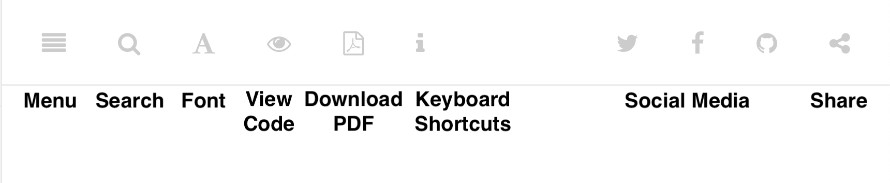

#### Open links in new tabs

Keep your place when reading online and moving between pages.  
- Two-finger trackpad click - or Control + click (Mac) - or Alt + click
(Chromebook) - or right-click (Windows and others)

#### Use a second monitor

If you have a small screen, consider connecting a second monitor, or
work next to a second computer or tablet. This allows you to view
tutorials in one screen and build visualizations in the other screen.

#### Refresh browser

To view the most up-to-date content in your web browser, do a “hard
refresh” to [bypass any saved content in your browser
cache](https://en.wikipedia.org/wiki/Wikipedia:Bypass_your_cache). -
Ctrl + F5 (most Windows-Linux browsers) - Command + Shift + R (Chrome or
Firefox for Mac) - Shift + Reload button toolbar (Safari for Mac)

<!--chapter:end:0.4-how-to-read.Rmd-->

Choose Tools to Tell Your Data Story
====================================

*by [Jack Dougherty with Stacy Lam and David Tatem](authors), last
updated February 10, 2017*

Do you feel overwhelmed by the enormous range of data visualization
tools? There’s been so many different tools released in recent years
that anyone would have a hard time deciding which ones to use. Even if
you limit your choices to the dozen or so tools specifically mentioned
in this book, how do you make wise decisions?

-   [Draw and Write Your Data Story](draw) reminds us to start with the
    most important item in your toolkit: ***your story***. Begin by
    drawing pictures and writing questions or sentences to capture your
    ideas on paper, and then choose the most appropriate tools to create
    your vision.
-   [Ask Questions When Choosing Tools](ask) lists several criteria to
    consider when making software decisions. Many of us look for free or
    affordable tools in the perfect sweet spot—easy-to-learn, yet
    powerful—and that’s the focus of this book.
-   [Rate Three Simple Map Tools](rate) invites readers to create a
    basic interactive point map using three different online tools, and
    to evaluate each one using selected criteria from the chapter above.

Enroll in our free online course **TO DO add link**, which introduces
these topics in the brief video below, and offers more exercises and
opportunities to interact with instructors and other learners.

#### Watch the YouTube Video

<iframe width="560" height="315" src="https://www.youtube.com/embed/SS1BGp_lxnU?rel=0" frameborder="0" allow="autoplay; encrypted-media" allowfullscreen>
</iframe>
<!--chapter:end:01-choose.Rmd-->

Draw and Write Your Data Story
------------------------------

*last updated February 20, 2017*

Before you dive deeply into software, think about the most important
item in your toolkit: **your story**. The primary reason we’re designing
visualizations is to improve how we communicate our data story to other
people, so let’s begin there.

Push away the computer and pick up some old-school tools:

-   colored markers or pencils
-   lots of blank paper
-   your imagination

First, at the top of the page, write down your data story.

-   Is it in the form of a question? If so, figure out how to pose the
    question.
-   Or maybe it’s in the form of an answer to that question? If so,
    spell out your clearest statement.
-   If you’re lucky, perhaps you already can envision a full story, with
    a beginning, middle, and end.
-   Whatever form it takes in your head, write out the words that come
    to mind.

Further down the page (or on a separate sheet), draw quick pictures of
the visualizations that comes to your mind, even if you don’t yet have
any data. No artistic skills are required. Just use your imagination. -
Do you envision some type of chart? Sketch a picture. - Or do you
imagine some type of map? Show what it might look like. - Will your
visualization be interactive? Insert arrows, buttons, whatever.

Finally, share your data story with someone else and talk through your
preliminary ideas. Does your sketch and sentences help to convey the
broader idea that you’re trying to communicate? If so, this is one good
sign that your data story is worth pursuing, with the visualization
tools, templates, and techniques in other chapters of this book.

<!--chapter:end:01.1-draw.Rmd-->

Ask Questions When Choosing Tools
---------------------------------

*last updated February 6, 2017*

When each of us decides which digital tools best fit our needs, we often
face trade-offs. On one hand, many of us prefer easy-to-learn tools,
especially those with a drag-and-drop interface, but they often force us
to settle for limited options. On the other hand, we also favor powerful
tools that allow us to control and customize our work, yet most of these
require higher-level coding skills. The goal of this book is to find the
best of both worlds: that “sweet spot” where tools are both friendly and
flexible.

Before testing out new tools, try listing the criteria that guide your
decision-making process. What are the most important factors that
influence whether or not you add another item to your digital toolkit?
Here’s the list that came to our minds:

***1) Price:*** Is the tool free, or is there a “freemium” model to pay
for more features or higher usage?

***2) Easy-to-learn:*** Is the tool relatively simple for new users
without coding skills?

***3) Power:*** Does the tool support large amounts of data, and various
types of visualizations?

***4) Customization:*** Can I modify details about how my work appears?

***5) Data Migration:*** Can I easily move my data in and out, in case I
switch to a different tool?

Hint for historians: Future-proof your digital history projects! Choose
tools that allow you to easily export and migrate data to other
platforms. Design projects to keep your data separate from its digital
presentation.

\*\*\* 6) Hosting:\*\*\* Can I decide exactly where my data and
visualizations will be stored online?

\*\*\* 7) Support:\*\*\* Is the tool actively maintained by its
creators, and do they answer questions?

\*\*\* 8) Open Source:\*\*\* Is the tool’s software visible, can it be
modified, and redistributed?

\*\*\* 9) Security:\*\*\* Is the tool and my data protected from
malicious hackers and malware?

\*\*\* 10) Collaborative:\*\*\* Does the tool allow several people to
work together on one shared product?

\*\*\* 11) Privacy:\*\*\* Under the terms of service, is my data and
work private or public?

\*\*\* 12) Error-friendly:\*\*\* When something fails, does the tool
point out possible problems and solutions?

\*\*\* 13) Cross-platform:\*\*\* Does this tool work across different
computer operating systems?

\*\*\* 14) Mobile-friendly:\*\*\* Will it correctly display my work on
various mobile devices and browsers?

That’s a long list! It’s even longer than the number of tools we’ll
mention in this book. But don’t let it overwhelm you. The diagram at the
top of the page illustrates the two most important criteria for the many
free tools that are currently available: easy-to-learn and powerful
features.

#### Learn more about choosing tools

Carl V. Lewis, Dataviz.tools: A curated guide to the best tools,
resources and technologies for data visualization,
<a href="http://dataviz.tools" class="uri">http://dataviz.tools</a>

Lincoln Mullen, “How to Make Prudent Choices About Your Tools,”
ProfHacker blog, Chronicle of Higher Education, August 14, 2013,
<a href="http://www.chronicle.com/blogs/profhacker/how-to-make-prudent-choices-about-your-tools" class="uri">http://www.chronicle.com/blogs/profhacker/how-to-make-prudent-choices-about-your-tools</a>

Lisa Charlotte Rost, “What I Learned Recreating One Chart Using 24
Tools,” Source, December 8, 2016,
<a href="https://source.opennews.org/en-US/articles/what-i-learned-recreating-one-chart-using-24-tools/" class="uri">https://source.opennews.org/en-US/articles/what-i-learned-recreating-one-chart-using-24-tools/</a>

Lisa Spiro and colleagues, DiRT: Digital Research Tools Directory
(formerly Bamboo),
<a href="http://dirtdirectory.org" class="uri">http://dirtdirectory.org</a>

Audrey Watters, “‘The Audrey Test’: Or, What Should Every Techie Know
About Education?,” Hack Education, March 17, 2012,
<a href="http://hackeducation.com/2012/03/17/what-every-techie-should-know-about-education" class="uri">http://hackeducation.com/2012/03/17/what-every-techie-should-know-about-education</a>

<!--chapter:end:01.2-ask.Rmd-->

Rate Three Simple Map Tools
---------------------------

*last updated March 16, 2017*

Let’s explore criteria from the previous chapter by comparing three
different tools, and reflecting on which factors you feel are most
important when making decisions about your toolkit. We’ll test three
drag-and-drop tools to transform sample address data into a simple
interactive point map.

Each tool can **geocode** address data by looking up a location (such as
500 Main Street, Hartford CT) in a large database, deciding on the best
match, and converting this data into latitude and longitude coordinates
(such as 41.762, -72.674).

For our sample data, we’ll use this table of 9 locations in North
America, with 3 intentional mistakes to test for geocoding errors.

First, click this link and Save to download the sample file to your
computer: [sample-address-data in CSV
format](data/sample-address-data.csv). CSV means comma-separated-values,
a generic spreadsheet format that many tools can easily open. If you
need help with downloading, see this [short video
tutorial](https://www.youtube.com/watch?v=-04PQldP9HQ).

Next, build a point map with the sample data, by following the tutorials
for the three tools below.

<table>
<thead>
<tr class="header">
<th style="text-align: left;">Tool</th>
<th style="text-align: left;">Step-by-step tutorial in this book</th>
</tr>
</thead>
<tbody>
<tr class="odd">
<td style="text-align: left;"><a href="https://www.google.com/maps/d/">Google My Maps</a></td>
<td style="text-align: left;"><a href="mymaps">My Maps tutorial</a></td>
</tr>
<tr class="even">
<td style="text-align: left;"><a href="http://carto.com">Carto Builder</a></td>
<td style="text-align: left;"><a href="carto">Carto tutorial</a></td>
</tr>
</tbody>
</table>

Finally, rate your experience using each tool with these selected
criteria:

-   Easy-to-learn: Which tool was the simplest for creating a basic
    point map?
-   Price: Which of these free tools provided the most services at no
    cost?
-   Customization: Which tool enabled you to modify the most details
    about your map?
-   Data Migration: Which tool most easily allowed you to import and
    export your data?
-   Error-friendly: Which tool geocoded most accurately or signaled
    possible errors?

Recommended: Enroll in our free online course **LINK TO DO** to compare
your ratings to other students.

<!--chapter:end:01.3-rate.Rmd-->

Improve Your Spreadsheet Skills
===============================

*by [Jack Dougherty](authors), last updated March 1, 2017*

Spreadsheets are wonderful tools to organize data into tables of rows
and columns. With a spreadsheet, you can sort, filter, calculate,
aggregate, and reorganize information to help you find the stories
buried inside.

Four common spreadsheet tools:

<table>
<colgroup>
<col style="width: 50%" />
<col style="width: 50%" />
</colgroup>
<thead>
<tr class="header">
<th style="text-align: left;">Tool</th>
<th style="text-align: left;">Features</th>
</tr>
</thead>
<tbody>
<tr class="odd">
<td style="text-align: left;"><a href="https://www.google.com/sheets/about/">Google Sheets</a></td>
<td style="text-align: left;">Free, online collaborative spreadsheet on Google Drive. Requires free account.</td>
</tr>
<tr class="even">
<td style="text-align: left;"><a href="https://office.live.com/start/Excel.aspx">Microsoft Excel Online</a></td>
<td style="text-align: left;">Free online spreadsheet on Microsoft OneDrive. Requires free account. Cannot open CSV generic spreadsheet files.</td>
</tr>
<tr class="odd">
<td style="text-align: left;"><a href="https://products.office.com/en-us/excel">Microsoft Excel desktop</a></td>
<td style="text-align: left;">Not free (US $100+) spreadsheet for Mac or Windows desktop, as part of Microsoft Office.</td>
</tr>
<tr class="even">
<td style="text-align: left;"><a href="http://www.libreoffice.org">LibreOffice</a></td>
<td style="text-align: left;">Free, open-source alternative to Microsoft Office desktop. Donation requested during download.</td>
</tr>
</tbody>
</table>

Which spreadsheet tool should you use? That depends on how you wish to
share and store data for your project.

-   If you are the **only person** working on a data project, use any
    spreadsheet tool.
-   If you need to **protect private data**, avoid online tools and use
    any desktop spreadsheet.
-   If you need to **share live data** with others, use Google Sheets.

This introductory online book features Google Sheets because it’s a free
and easy-to-learn tool for collaborating and sharing data with others.
The basic spreadsheet methods shown here are very similar across all
spreadsheet tools. But advanced users may need more complex tools to
manage very large datasets, or relational databases, or to perform
deeper analysis.

If you’re new to spreadsheets or want to refresh your skills, see the
following chapters:

-   [Upload and Convert to Google Sheets](upload)
-   [Make a Copy with Google Sheets](copy)
-   [Share with Google Sheets](share)
-   [Save as CSV or ODS Format](csv)
-   [Sort and Filter Data](sort)
-   [Calculate with Formulas](calculate)
-   [Group Data with Pivot Tables](pivot)
-   [Match Data with VLookup](vlookup)
-   [Collect and Share Survey Data with Google Forms](forms)

Enroll in our free online course\] which offers more spreadsheet
exercises and opportunities to interact with instructors and other
learners.

<!--chapter:end:02-spreadsheet.Rmd-->

Upload Files and Convert to Google Sheets
-----------------------------------------

*last updated March 2, 2017*

Google Drive can convert many file types into [Google Sheets
format](https://www.google.com/sheets/about/):

-   Microsoft Excel (.xls and .xlsx)
-   OpenDocument Spreadsheet (.ods)
-   Comma-separated values (.csv)
-   Tab-separated values (.tab)
-   Text files (.txt) into Google Sheets format

#### Tutorial

1.  Sign in to your free Google Drive account
    (<a href="http://drive.google.com" class="uri">http://drive.google.com</a>)

2.  To convert files into Google Sheets format, open the Settings
    (upper-right gear symbol), and **check the box** to Convert uploaded
    files to Google Docs.

1.  To upload your file, use the New &gt; File Upload menu OR
    drag-and-drop it into your Google Drive screen.

1.  When your file is successfully converted, the Google Sheets icon
    will appear. Recommended: Right-click to rename the file and remove
    the old extension (.xlsx or .csv or other), since it is no longer in
    this old format.

1.  Google Drive files that display different icons have **not** been
    converted into Google Sheets format.

**Beware**: A different way to convert spreadsheets into Google Sheets
format is the File &gt; Import menu, but this creates two files in your
Google Drive (such as data and data.csv), which is confusing.

<!--chapter:end:02.1-upload.Rmd-->

Make a Copy with Google Sheets
------------------------------

*last updated March 17, 2017*

In this book, you will open links to Google Sheets that allow you to
view – but not edit – the contents. How can you quickly make your own
version that you can edit?

#### Best solution

1.  Sign in to your Google account in the upper-right corner. Requires a
    free account.

2.  Go to File &gt; Make a Copy to save a duplicate of the spreadsheet
    to your Google Drive. By default, your copy will be private to you.
    Go to the [Share Data with Google Sheets](spreadsheet.html#share)
    chapter in this book to allow others to view, comment, or edit your
    spreadsheet.

Highly recommended: Create folders in your Google Drive to keep your
files organized and easily findable.

#### Alternate solution

Another option is to File &gt; Download As into a different format, such
as: - Microsoft Excel (.xlsx) - OpenData System (.ods), a generic
multi-tab spreadsheet - Comma-separated values (.csv), a generic single
sheet No Google account is required.

<!--chapter:end:02.2-copy.Rmd-->

Share Data with Google Sheets
-----------------------------

*last updated March 1, 2017*

To share live spreadsheet data with other people, use Google Sheets
(<a href="https://www.google.com/sheets/about/" class="uri">https://www.google.com/sheets/about/</a>).
Requires a free Google Drive account.

#### Video with step-by-step tutorial

<iframe width="560" height="315" src="https://www.youtube.com/embed/PoLhyld3KLo?rel=0" frameborder="0" allow="autoplay; encrypted-media" allowfullscreen>
</iframe>

1.  Sign in to your Google Drive
    (<a href="http://drive.google.com" class="uri">http://drive.google.com</a>),
    and in the New menu, select Google Sheets.

2.  New spreadsheets are private by default. Only the owner can view and
    edit.

3.  To open your spreadsheet to others, click the blue Share button.

4.  To share data with specific individuals, enter their Google
    usernames.

5.  Or, to share data more widely, click the **Advanced** button on the
    next screen. (I wish Google made this button larger!)

6.  Click the Change button and decide on Link Sharing settings:

-   Public on the web (anyone can find your data)
-   Anyone with the link (similar to an unlisted phone number)
-   Off (only specific people you list by Google usernames)

Below those settings, select the Access level: - Can view - Can comment
- Can edit (for co-authored data)

1.  Select Save, and scroll down on the next screen to select Done.

**Tip:** To avoid sending a long Google Sheets link to others, use a
free link-shortening service such as Bit.ly
(<a href="http://bit.ly" class="uri">http://bit.ly</a>). Requires a free
account.

#### Learn more

-   “Share Files from Google Drive,” Google help page,
    <a href="https://support.google.com/docs/answer/2494822" class="uri">https://support.google.com/docs/answer/2494822</a>
-   Jack Dougherty, “How to Co-Author and Peer Edit with Google Docs,”
    Web Writing: How and Why for Liberal Arts Teaching and Learning,
    (2015),
    <a href="http://epress.trincoll.edu/webwriting/chapter/how-to-google-docs" class="uri">http://epress.trincoll.edu/webwriting/chapter/how-to-google-docs</a>

<!--chapter:end:02.3-share.Rmd-->

Save Spreadsheets in CSV or ODS
-------------------------------

-   last updated March 2, 2017\*

To transfer spreadsheet data to another platform, or import it into a
visualization tool, you may need to convert your file into a different
format. Consider two options:

#### Comma-separated values (.csv)

-   to transfer only one sheet of data, with no formulas or formatting,
    into a wide range of spreadsheet and visualization tools

#### OpenDocument Spreadsheet (.ods)

-   to transfer multiple sheets, with basic formulas and formatting,
    into many spreadsheet tools (Excel, Google Sheets, LibreOffice)

#### Convert to CSV or ODS with Google Sheets

In the File &gt; Download As menu, select either ODS (to convert a
Google Sheets file with multiple tabs, formulas, and formatting) or CSV
(to capture only the data in the current sheet).

#### Convert to ODS with Microsoft Excel

In the File &gt; Save As menu, select ODS format.

#### Convert to CSV with Microsoft Excel

1.  Note that CSV format will save only the first sheet of a multi-sheet
    Excel workbook. If you have source information or other data in
    other tabs, keep your original Excel file for backup purposes. You
    can give them parallel file names:

-   data.csv
-   data.xlsx

1.  In the Excel file, select the File &gt; Save As menu, and select CSV
    format.

1.  Older versions of Excel may warn you that some features (such as
    formulas and formatting) will not be saved in a generic CSV data
    file. Be sure to keep a backup Excel version, then click Continue to
    save your data into CSV format.

1.  In older versions of Excel, when you quit the application, another
    screen will ask if you wish to save the CSV file a second time.
    **Don’t let Excel confuse you.** If you have not made any changes to
    the Excel file since the step above, click Don’t Save, because you
    already saved the file in CSV format.

<!--chapter:end:02.4-csv.Rmd-->

Sort and Filter Data
--------------------

*last updated January 13, 2017*

**TO DO** - write intro on the title concepts - when possible, start
text by posing a common problem, and how this method can solve it - redo
visuals: Google Sheets with better example - add Filter data

#### Sort data by columns

To sort data rows by a column, select the entire spreadsheet (top-left
corner icon), then right-click or look for the sort menu. Be sure to
select the entire sheet to avoid accidentally sorting one column without
the adjacent ones.

<iframe src="images/02-spreadsheet/SpreadsheetSort640w.gif" width="100%" height="400px">
</iframe>

#### Filter data by columns

TO DO

<!--chapter:end:02.5-sort.Rmd-->

Calculate with Formulas and Functions
-------------------------------------

*last updated March 16, 2016*

**TO DO** - when possible, start text by posing a common problem, and
how this method can solve it - redo visuals: Google Sheets with better
examples - see other notes inserted below

Simple formulas can save you lots of time. The big advantage of
spreadsheet tools is the ability to insert simple formulas to calculate
numbers, or combine columns of text, for entire rows and columns.

#### Write a simple formula

In most spreadsheets, begin writing a simple formula with an equal sign,
and refer to specific cells and functions, such as:

-   = A2 + B2 + C2

#### Write formulas with built-in functions

**TO DO** rewrite to show how this is same as above

-   = Sum(A2:C2)

\*\* TO DO \*\* rewrite to show common numerical and textual functions

-   = Average(A2:C2)

#### Copy and paste, or drag formulas

If you’ve inserted a formula into one row, how can you quickly do the
same calculation across all rows?

Spreadsheets can magically automate calculations across rows or columns.
In most cases, you can copy and paste a formula into new cells.
Sometimes you can click-and-drag the lower-right corner of a formula
cell (which may appear as a cross-hair) to automate calculations.

<iframe src="images/02-spreadsheet/SpreadsheetFormula640w.gif" width="100%" height="400px">
</iframe>

#### Copy and Paste &gt; Special &gt; Values to replace formulas with data

After inserting calculations in a spreadsheet, sometimes dynamic
formulas must be replaced with static data before the results can be
visualized. One solution is to select and copy a column (or the entire
sheet), then paste &gt; special &gt; values to replace the formula with
numerical results.

<iframe src="images/02-spreadsheet/SpreadsheetPasteSpecialValues640w.gif" width="100%" height="400px">
</iframe>

Remember that if you need to check or run the calculations again at a
later point, click (or right-click) the tab to save a copy to the
spreadsheet as a backup.

#### Create a column of consecutive numbers

To quickly create a column of consecutive numbers, such as unique ID
numbers, in most spreadsheet tools:

-   Insert the number 1 into a cell and press Return
-   Click the cell and float the cursor over the bottom-right corner,
    where it will change into a cross-hair symbol
-   On a Mac, hold down the Option key and drag the cross-hair down to
    create consecutive numbers
-   **TO DO** insert equivalent commands for Windows, Chromebook

<iframe src="images/02-spreadsheet/excel-drag-consec.gif" width="100%" height="400px">
</iframe>
<!--chapter:end:02.6-calculate.Rmd-->

Group Data with Pivot Tables
----------------------------

*last updated March 16, 2017*

Here’s a common problem: You open a large spreadsheet with many rows of
data, such as a list of students. Your goal is to count students by
categories, such as the number of students by each year of birth. What’s
the most efficient way to do this?

A solution: Create a pivot table to aggregate (or group together) and
summarize data in another spreadsheet tab.

While pivot tables may look different across spreadsheet tools, the
concept is the same.

#### Video with step-by-step tutorial for Google Sheets

<iframe width="560" height="315" src="https://www.youtube.com/embed/3sK7-g0otGM?rel=0" frameborder="0" allow="autoplay; encrypted-media" allowfullscreen>
</iframe>

1.  Click this link and Save to download to your computer:
    [sample-students in CSV format](data/sample-students.csv). CSV means
    comma-separated values, a generic spreadsheet format that most tools
    can easily open.

2.  Sign into [Google Drive](http://drive.google.com) (requires free
    account) and drag-and-drop the sample CSV file to instantly upload.
    Before you do this, make sure your Settings (gear symbol) is set to
    Convert Uploads to Google Docs editor format (the default setting).

3.  Shift-click to select all columns that you wish to pivot.

4.  Select Data &gt; Pivot Table…, which opens a new spreadsheet tab.

5.  In Report Editor, select Rows &gt; Add Field &gt; Year to list all
    entries in order.

6.  In Report Editor, select Values &gt; Add Field &gt; Year to
    summarize all values for each entry.

7.  Change Summarize by SUM to Summarize by COUNTA (to count
    alphabetical or numerical entries), or COUNT (to count only numeric
    values).

#### More Advanced Pivot Table with Google Sheets

In addition to grouping by rows, you can create more advanced pivot
tables by grouping by columns and filtering results. For example, the
pivot table shown below shows rows by birth year, columns by gender
(blank, female, male, other), and filters results to show only 18
students from one country: US.

#### Learn More

-   Google, Create and Use Pivot Tables Help Page
    <a href="https://support.google.com/docs/answer/1272898" class="uri">https://support.google.com/docs/answer/1272898</a>
-   LibreOffice, Creating Pivot Tables Help Page
    <a href="https://help.libreoffice.org/Calc/Creating_Pivot_Tables" class="uri">https://help.libreoffice.org/Calc/Creating_Pivot_Tables</a>
-   Andrew Ba Tran, “Tutorial: How to Make Pivot Tables in Google
    Sheets,” TrendCT, September 4, 2015,
    <a href="http://trendct.org/2015/09/04/tutorial-how-to-make-pivot-tables-in-google-sheets" class="uri">http://trendct.org/2015/09/04/tutorial-how-to-make-pivot-tables-in-google-sheets</a>

<!--chapter:end:02.7-pivot.Rmd-->

Match Columns with VLOOKUP
--------------------------

*last updated March 16, 2017*

Here’s a common problem: Sheet 1 contains a long roster of students
enrolled in our *Data Visualization For All* course, with a two-letter
code for their nation. Sheet 2 contains the list of codes for each
nation. How can we quickly match up this information in one sheet, so
that each row contains the nation for each student?

One solution: Spreadsheets contain a VLOOKUP function, which “looks up”
data across two or more vertical columns, and automatically fills in
matching entries. This tutorial demonstrates how to set up this
calculation in Google Sheets and Excel

#### Video with step-by-step tutorial for Google Sheets

<iframe width="560" height="315" src="https://www.youtube.com/embed/qrzKzts3mV0?rel=0" frameborder="0" allow="autoplay; encrypted-media" allowfullscreen>
</iframe>

1.  Click this link and Save to download to your computer:
    [sample-students-nations in .ODS
    format](data/sample-students-nations.ods). ODS means OpenDocument
    System, a generic multi-tab format that most spreadsheet tools can
    easily open.

2.  To upload the downloaded file to Google Sheets, see the [Upload
    Files and Convert tutorial](upload) in this book, and remember that
    Settings (gear symbol) must be set to Convert files to Google
    format. Or, open the file with Microsoft Excel or LibreOffice, and
    the directions below will be similar.

3.  In the students sheet, type “nation” as a column header into cell
    E1.

4.  Click in cell E2, start typing “=VLOOKUP” and the spreadsheet tool
    will suggest that you complete the formula in this format:

<!-- -->

    VLOOKUP(search_key, range, index, [is_sorted])

-   search\_key = the Sheet 1 cell we are trying to match
-   range = the columns in Sheet 2 where matches may exist
-   index = the column in the Sheet 2 range that contains the desired
    result, where 1 = first column, 2 = second column, etc.
-   \[is\_sorted\] = if the first column of the range is sorted, enter
    “true” to find the closest match; otherwise enter “false” to return
    exact matches only

1.  You can type in the formula, or fill it out by clicking on cells,
    columns, and sheets as shown in the video above.

<!--chapter:end:02.8-vlookup.Rmd-->

Collect and Share Data with Google Forms
----------------------------------------

**TO DO ** write simple tutorial for Google Forms and explain how to
share the spreadsheet; also mention other web form services

<!--chapter:end:02.9-forms.Rmd-->

Find and Know Your Data
=======================

*by [Jack Dougherty](authors), last updated March 1, 2017*

#### Searching for Open Data

Increasing numbers of governmental agencies and non-profit organizations
are publicly sharing *open data* on the web. When starting a new data
visualization project, ask yourself these questions:

-   Do I have the most relevant data for my project?
-   Is it the most current data, in the most user-friendly format?
-   Is data available at the individual level, or aggregated into larger
    groups?
-   Which organizations might have collected data for my topic?
-   Which open data repositories might have published this data?

#### What features do open repositories offer?

-   View and export: At minimum, most open data repositories allow users
    to view their data and export it into common spreadsheet formats.
    Some also provide geographical boundaries for polygon maps.
-   Built-in visualization tools: Some repositories offer built-in tools
    for users to create interactive charts or maps on the platform site.
    Some also provide code snippets for users to embed these built-in
    visualizations into their own websites.
-   Static and Live data: Most repositories offer static datasets for a
    specific time period, but some also provide “live” data that is
    continuously updated.
-   Application Programming Interface (APIs): Some repositories provide
    endpoints with code instructions that allow users to pull data
    directly from the platform into an external sites or online
    visualization, which is ideal for continuously updated data.

#### Know Your Data

Before starting to create charts or maps, get to know your data.

-   Where did it come from?
-   Who compiled the data, and for what purpose?
-   What do the data labels really mean?
-   Ask yourself: Am I working with the *most* recent version, in the
    *best* available format?

**TO DO** add resource
<a href="https://github.com/Quartz/bad-data-guide" class="uri">https://github.com/Quartz/bad-data-guide</a>

open data inception 1600+ sites portal
<a href="http://opendatainception.io/" class="uri">http://opendatainception.io/</a>

-   Know your data: go out into the field to directly observe how the
    original data is measured and collected

<a href="https://www.opendatanetwork.com/" class="uri">https://www.opendatanetwork.com/</a>

Closely examine your data files to understand their meaning, sources of
origin, and limitations. **TO DO** expand on this theme with examples of
bad and misleading data

1.  Always ask: Am I using the best available data?

-   Compare the HFS list to the City of Hartford’s current list of food
    establishments:
    <a href="https://data.hartford.gov/browse" class="uri">https://data.hartford.gov/browse</a>
-   go to Public Health Category
-   click on the “dataset” version (updated 10 Feb 2016), which is same
    data but different view than the “map” version
-   click on light blue “export” button into any format you wish to
    compare with the HFS list (see screenshot)
-   decide which list is best for your organization’s goal

<!--chapter:end:03-find.Rmd-->

US and Census Bureau Open Data
------------------------------

*By [Jack Dougherty and Ilya Ilyankou](authors), last updated December
25, 2019*

**The U.S. Census Bureau**
(<a href="https://census.gov" class="uri">https://census.gov</a>)
collects and shares population, housing, and economic data on its open
repositories.

-   The Decennial Census is a full count of the population every ten
    years, most recently in 2010 and the upcoming one in 2020. Because
    decennial data are counts and not estimates, they represent “true”
    values and hence come without margins of errors.
-   The American Community Survey (ACS)
    (<a href="https://www.census.gov/programs-surveys/acs/" class="uri">https://www.census.gov/programs-surveys/acs/</a>)
    is annual sample count, which produces:
    -   1-year estimates for areas with populations of 65,000+
    -   5-year estimates for all census areas
    -   ACS used to release 3-year estimates for geographies with
        population of 20,000+, but discontinued after the 2011-2013
        release.

Because ACS produces estimates and not “true” counts, data comes with
margins of errors. Generally, margins of errors are higher for smaller
geographies (eg census blocks) and smaller values (eg the number of
Asian females aged 60+ who live in Union, CT). Hence, one needs to be
critical when using ACS or other survey data.

**Census areas** are geographic divisions in this *general format*:

-   State
-   County
-   County subdivisions (equivalent to Connecticut towns and cities)
-   Census tracts (designated areas, roughly 2,500 to 8,000 people)
-   Block groups (sub-unit of tract, roughly 600 to 3,000 people)
-   Census blocks (sub-unit of block group, but not always a city block)

### Census areas in the Hartford region

The interactive map below illustrates hierarchical relations among
geographical census entities for the Hartford region, from state to
census block level.

<iframe src="https://datavizforall.github.io/datavizforall-jupyter-examples/census-divisions-hartford.html" height="400" width="100%" frameborder="0">
</iframe>

Learn more: Explore the standard hierarchy of US Census geographic
entities and definitions
(<a href="https://www2.census.gov/geo/pdfs/reference/geodiagram.pdf" class="uri">https://www2.census.gov/geo/pdfs/reference/geodiagram.pdf</a>)

See also in this book: [Geocode addresses with the US Census
Geocoder](geocode)

### Data.census.gov

Data.census.gov
(<a href="https://data.census.gov" class="uri">https://data.census.gov</a>)
is the main platform to access US Census data. It provides an easy
search across census and survey tables. There is an interface to view
tables for various years and geographies, and a download button to save
data as CSV or PDF. It replaced American FactFinder
(<a href="https://factfinder.census.gov" class="uri">https://factfinder.census.gov</a>)
in July 2019.

### Social Explorer

**Social Explorer**
(<a href="https://www.socialexplorer.com/" class="uri">https://www.socialexplorer.com/</a>)
is a popular tool to view and download census and related demographic
data, past and present. The platform allows users to create data maps
that may be exported as static images or presentation slides. Social
Explorer requires subscription, but many academic institutions provide
access.

**TO DO** create tutorial on how to cleanly download census data from
Social Explorer and Census.gov to join with geography, especially census
tract numbers

### Data.gov

**Data.gov**
(<a href="https://www.data.gov/" class="uri">https://www.data.gov/</a>)
is the official open data repository for US federal government agencies,
managed by the US General Services Administration, and powered by an
open-source CKAN and WordPress platform.

### National Center for Education Statistics

**National Center for Education Statistics (NCES)**
(<a href="https://nces.ed.gov/" class="uri">https://nces.ed.gov/</a>) is
the primary federal agency for collecting and reporting education data.

-   Elementary/Secondary Information System (ELSi)
    (<a href="https://nces.ed.gov/ccd/elsi" class="uri">https://nces.ed.gov/ccd/elsi</a>) -
    create custom tables and charts from the Common Core of Data (CCD)
    and Private School Survey.

#### Boundaries

\*\* TO DO \*\* - link and source files and scale -
<a href="http://mapstarter.com/" class="uri">http://mapstarter.com/</a>

<!--chapter:end:03.1-census.Rmd-->

Source Your Data Files
----------------------

*last updated March 1, 2017*

Source your data. Spell out exactly where it came from, so that someone
other than you, several years in the future, could understand its
origin.

#### Label the file name

Everyone has seen examples of bad file names:

-   data.xls
-   bldgdatalist.csv
-   data77.xls

Write a short but meaningful file name. It is a good idea to include
data source in file name (eg `acs2018`, `worldbank`, or `eurostat`). If
different versions of the data are floating around, add the current date
at the end, in YYYY-MM-DD format. Good file names look like this:

-   town-demographics-2019-12-02.xls
-   census2010\_population\_by\_county.csv
-   eurostat-1999-2019-CO2\_emissions.xlsx

#### Save source data in separate sheet

Before modifying the original dataset, make sure to duplicate it to
avoid any data losses. One way is to click (or right-click) on the
spreadsheet tab to copy the sheet to another tab as a backup.

<iframe src="images/02-spreadsheet/SpreadsheetCopySheet640w.gif" width="100%" height="400px">
</iframe>

Add a *source* tab, after the data, with notes to remind you and others
about its origins and when it was last updated.

### Learn more

Lisa Charlotte Rost, *How to prepare your data for analysis and charting
in Excel & Google Sheets*,
<a href="https://blog.datawrapper.de/prepare-and-clean-up-data-for-data-visualization/" class="uri">https://blog.datawrapper.de/prepare-and-clean-up-data-for-data-visualization/</a>

\*\* TO DO \*\*

Source your data

     - explain that data cannot be copyrighted, but representations of data can be
     - open-source and creative commons
     - credit sources and collaborators on dataviz products and readme files
     - Whose perspectives does your data privilege? Whose stories remain untold?

<!--chapter:end:03.2-source.Rmd-->

Public or Private Data?
-----------------------

Many of the free web-based tools in this book require that your publicly
share your data. Check each tool and decide whether it is appropriate
for your data, which may have some privacy restrictions.

In some cases, individual data privacy is protected by law, but a
government agency may aggregate (sort into larger groups) or anonymize
(remove personally identifiable details) data to make it public. For
example:

-   Individual-level census data is private for about 70 years, but the
    US Census Bureau publicly releases anonymous data for aggregated
    areas (such as census blocks, tracts, towns, etc.)
-   Patient-level health records are private, but public health
    officials share town- and county-level health data.
-   Student-level education data is private, but school districts and
    state agencies publicly share grade-level and school-level data.

In other cases, individual data is not private. For example:

-   When individuals contribute to political campaigns, most US and
    state laws require that the donor name, address, and amount is
    public data.
-   When an individual buys home in Connecticut, the owner’s name,
    address, purchase amount, and other details about the home are
    public data.

<!--chapter:end:03.3-public.Rmd-->

Know Your Data: Is It Good or Bad?
----------------------------------

Before starting to create charts or maps, get to know your data.

-   Where did it come from?
-   Who compiled the data, and for what purpose?
-   What do the data labels really mean?
-   Ask yourself: Am I working with the *most* recent version, in the
    *best* available format?

Closely examine your data files to understand their meaning, sources of
origin, and limitations. **TO DO** expand on this theme with examples of
bad and misleading data

\*\* TO DO \*\* cite and explain this resource
<a href="https://github.com/Quartz/bad-data-guide" class="uri">https://github.com/Quartz/bad-data-guide</a>

### Learn more

Christopher Ingraham, *An alarming number of scientific papers contain
Excel errors*,
<a href="https://www.washingtonpost.com/news/wonk/wp/2016/08/26/an-alarming-number-of-scientific-papers-contain-excel-errors/" class="uri">https://www.washingtonpost.com/news/wonk/wp/2016/08/26/an-alarming-number-of-scientific-papers-contain-excel-errors/</a>

<!--chapter:end:03.4-know.Rmd-->

Connecticut Open Data
---------------------

*last updated April 5, 2017*

Since this book was created in Hartford, Connecticut, we include state
and municipal open data repositories and boundary files.

**Connecticut Open Data**
(<a href="http://data.ct.gov" class="uri">http://data.ct.gov</a>), the
official portal for state government agencies, is hosted on the Socrata
platform, which offers built-in data visualization tools and APIs. See
also how to create a [filtered point map with
Socrata](filtered-point-map-socrata) in this book.

See also separate repositories for individual state agencies: - Office
of the State Comptroller
(<a href="http://www.osc.ct.gov/openCT.html" class="uri">http://www.osc.ct.gov/openCT.html</a>)
- CT State Department of Education
(<a href="http://www.sde.ct.gov/sde/cwp/view.asp?a=2758&amp;q=334520" class="uri">http://www.sde.ct.gov/sde/cwp/view.asp?a=2758&amp;q=334520</a>)
- Office of Policy and Management
(<a href="http://ct.gov/opm/cwp/view.asp?a=3006&amp;Q=383258&amp;opmNav_GID=1386" class="uri">http://ct.gov/opm/cwp/view.asp?a=3006&amp;Q=383258&amp;opmNav_GID=1386</a>)
- link to all CT state government agencies
(<a href="http://portal.ct.gov/Department-and-Agencies/" class="uri">http://portal.ct.gov/Department-and-Agencies/</a>)

**Connecticut State Data Center**
(<a href="http://ctsdc.uconn.edu/" class="uri">http://ctsdc.uconn.edu/</a>),
part of the U.S. Census Data Center Network, is the lead agency for US
Census data and other socioeconomic data for Connecticut, and is based
at the University of Connecticut Libraries. The site also features data
visualizations created on the Tableau platform and provides population
projections for the state of Connecticut.

**MAGIC: The Map and Geographic Information Center**
(<a href="http://magic.lib.uconn.edu" class="uri">http://magic.lib.uconn.edu</a>),
based at the University of Connecticut Libraries, specializes in
providing geographic, aerial photography, and map images for the state,
past and present. The site also features interactive maps.

**DataHaven**
(<a href="http://ctdatahaven.org/" class="uri">http://ctdatahaven.org/</a>),
a non-profit organization, collects and interprets information about
Connecticut neighborhoods, such as its Community Wellbeing Survey. Data
resources feature neighborhood profiles for densely-populated areas (New
Haven and Hartford-West Hartford), and town profiles for other areas
across the state.

**Connecticut Data Collaborative**
(<a href="http://ctdata.org" class="uri">http://ctdata.org</a>) is a
public-private partnership that advocates for open data access to drive
planning, policy, budgeting and decision making in Connecticut at the
state, regional and local levels. We democratize public data through
custom data exploration tools and a dynamic town profile tool, hosted on
the open-source CKAN platform. Users can find state and federal data on
topics such as public health, education, crime, municipal data, and
racial profiling data.

**Hartford Data**
(<a href="http://data.hartford.gov" class="uri">http://data.hartford.gov</a>),
the official portal of the City of Hartford municipal government, is
hosted on the Socrata platform, which features built-in visualizations
and APIs. See also how to create a [filtered point map with
Socrata](filtered-point-map-socrata) in this book. Also, the Hartford
Data site links to the City’s ArcGIS Online geographic data
(<a href="http://gisdata.hartford.gov/" class="uri">http://gisdata.hartford.gov/</a>)
and the City’s financial data
(<a href="http://checkbook.hartford.gov/" class="uri">http://checkbook.hartford.gov/</a>)
and budget
(<a href="http://budget.hartford.gov/" class="uri">http://budget.hartford.gov/</a>).

In addition to the official repositories above, Connecticut news
organizations that create data visualizations often include links to
download data files.

**Connecticut Mirror / Trend CT **
(<a href="http://ctmirror.org/" class="uri">http://ctmirror.org/</a>)
and (<a href="http://trendct.org/" class="uri">http://trendct.org/</a>)
are publications of the Connecticut News Project, an independent,
nonpartisan, nonprofit organization that focuses on state policy issues.
Most of their data visualizations are built with open-source code, with
publicly accessible data files. See also their GitHub repository
(<a href="https://github.com/trendct" class="uri">https://github.com/trendct</a>).

**Hartford Courant Data Desk**
(<a href="http://www.courant.com/data-desk" class="uri">http://www.courant.com/data-desk</a>)
produces digital visualizations for the *Hartford Courant*, the largest
daily newspaper in Connecticut, owned by Tribune Publishing. Many of
these data visualizations are published on the Tableau platform, which
allows readers to download the underlying data.

#### Boundaries

-   Converted from shapefile WGS84 to GeoJSON format
-   To download a GeoJSON file, right-click the link and Save to your
    computer
-   If you accidentally open the GeoJSON code in your browser, select
    File &gt; Save Web Page to download it
-   To view or edit, drag files into
    <a href="http://geojson.io" class="uri">http://geojson.io</a> or
    <a href="http://mapshaper.org" class="uri">http://mapshaper.org</a>
-   Learn more in the [Transform Your Map Data](transform.html) chapter
    of this book

<table>
<colgroup>
<col style="width: 32%" />
<col style="width: 25%" />
<col style="width: 21%" />
<col style="width: 21%" />
</colgroup>
<thead>
<tr class="header">
<th style="text-align: left;">Geography</th>
<th style="text-align: left;">Year-Source-Size</th>
<th style="text-align: left;">Right-click + Save to download GeoJSON</th>
<th style="text-align: left;"></th>
</tr>
</thead>
<tbody>
<tr class="odd">
<td style="text-align: left;">CT outline </td>
<td style="text-align: left;"><a href="http://magic.lib.uconn.edu/connecticut_data.html#boundaries">2010 Census UConn MAGIC WGS84 1:100,000</a></td>
<td style="text-align: left;"><a href="data/ct-outline.geojson">ct-outline.geojson</a></td>
<td style="text-align: left;"></td>
</tr>
<tr class="even">
<td style="text-align: left;">CT counties </td>
<td style="text-align: left;"><a href="http://magic.lib.uconn.edu/connecticut_data.html#boundaries">2010 Census UConn MAGIC WGS84 1:100,000</a></td>
<td style="text-align: left;"><a href="data/ct-counties.geojson">ct-counties.geojson</a></td>
<td style="text-align: left;"></td>
</tr>
<tr class="odd">
<td style="text-align: left;">CT towns </td>
<td style="text-align: left;"><a href="http://magic.lib.uconn.edu/connecticut_data.html#boundaries">2010 Census UConn MAGIC WGS84 simplified to 224k</a></td>
<td style="text-align: left;"><a href="data/ct-towns.geojson">ct-towns.geojson</a></td>
<td style="text-align: left;"></td>
</tr>
<tr class="even">
<td style="text-align: left;">CT census tracts </td>
<td style="text-align: left;"><a href="http://magic.lib.uconn.edu/connecticut_data.html#boundaries">2010 Census UConn MAGIC WGS84 1:100,000</a></td>
<td style="text-align: left;"><a href="data/ct-tracts-2010.geojson">ct-tracts-2010.geojson</a></td>
<td style="text-align: left;"></td>
</tr>
<tr class="odd">
<td style="text-align: left;">Hartford County outline </td>
<td style="text-align: left;"><a href="http://magic.lib.uconn.edu/connecticut_data.html#boundaries">2010 Census UConn MAGIC WGS84 1:100,000</a></td>
<td style="text-align: left;"><a href="data/hartfordcounty-outline.geojson">hartfordcounty-outline.geojson</a></td>
<td style="text-align: left;"></td>
</tr>
<tr class="even">
<td style="text-align: left;">Hartford County towns </td>
<td style="text-align: left;"><a href="http://magic.lib.uconn.edu/connecticut_data.html#boundaries">2010 Census UConn MAGIC WGS84 1:100,000</a></td>
<td style="text-align: left;"><a href="data/hartfordcounty-towns.geojson">hartfordcounty-towns.geojson</a></td>
<td style="text-align: left;"></td>
</tr>
<tr class="odd">
<td style="text-align: left;">Hartford County tracts </td>
<td style="text-align: left;"><a href="http://magic.lib.uconn.edu/connecticut_data.html#boundaries">2010 Census UConn MAGIC WGS84 1:100,000</a></td>
<td style="text-align: left;"><a href="data/hartfordcounty-tracts-2010.geojson">hartfordcounty-tracts-2010.geojson</a></td>
<td style="text-align: left;"></td>
</tr>
<tr class="even">
<td style="text-align: left;">Hartford outline </td>
<td style="text-align: left;"><a href="http://magic.lib.uconn.edu/connecticut_data.html#boundaries">2010 Census UConn MAGIC WGS84 1:100,000</a></td>
<td style="text-align: left;"><a href="data/hartford-outline.geojson">hartford-outline.geojson</a></td>
<td style="text-align: left;"></td>
</tr>
<tr class="odd">
<td style="text-align: left;">Hartford census tracts </td>
<td style="text-align: left;"><a href="http://magic.lib.uconn.edu/connecticut_data.html#boundaries">2010 Census UConn MAGIC WGS84 1:100,000</a></td>
<td style="text-align: left;"><a href="data/hartford-tracts-2010.geojson">hartford-tracts-2010.geojson</a></td>
<td style="text-align: left;"></td>
</tr>
<tr class="even">
<td style="text-align: left;">Hartford neighborhoods </td>
<td style="text-align: left;"><a href="http://gisdata.hartford.gov/datasets/d3deb11bfd9242ce9c927187c512da9e_5">2015 Hartford Open Data 1:50,000</a></td>
<td style="text-align: left;"><a href="data/hartford-neighborhoods.geojson">hartford-neighborhoods.geojson</a></td>
<td style="text-align: left;"></td>
</tr>
</tbody>
</table>

**TO DO** - add Capitol Region Council of Governments (CRCOG)
<a href="http://www.crcog.org/" class="uri">http://www.crcog.org/</a> -
add school districts (and clarify elementary-secondary) - add Capitol
Region Education Council (CREC)
<a href="http://www.crec.org/" class="uri">http://www.crec.org/</a> -
add school attendance areas from federal site - describe Freedom of
Information Act (FOIA) data requests in Connecticut

<!--chapter:end:03.5-ct.Rmd-->

Clean Up Messy Data
===================

*By [Jack Dougherty](authors), last updated April 2016*

TO DO

-   write a new intro to match content that I moved into subfolders
-   <a href="http://trendct.org/2015/08/28/getting-rid-of-duplicate-rows-using-google-sheets/" class="uri">http://trendct.org/2015/08/28/getting-rid-of-duplicate-rows-using-google-sheets/</a>
-   Clean up data that contains stray commas, or mistyped entries
-   Advanced clean up with Open Refine; see Alvin Chang’s CT Mirror
    guide
    <a href="http://trendct.org/2015/04/24/john-jonathan-and-johnny-how-to-merge-them-in-open-refine/" class="uri">http://trendct.org/2015/04/24/john-jonathan-and-johnny-how-to-merge-them-in-open-refine/</a>
-   rethink formatting data
-   see Jake Kara’s “Data Structure Whining”
    <a href="https://github.com/jakekara/publishing-data-for-journalists" class="uri">https://github.com/jakekara/publishing-data-for-journalists</a>

<!--chapter:end:04-clean.Rmd-->

Clean Data with Spreadsheets
----------------------------

*last updated April 16, 2016*

**TO DO** reorganize this to feature Google Sheets whenever possible, or
Excel Online if needed

Sometimes we receive a spreadsheet with problematic data that needs to
be cleaned up before we can successfully upload it into a visualization
tool.

#### Find and Replace with a blank

A common problem with census data is that geographic names contain
unnecessary words. For example, when downloading Connecticut county
subdivisions (towns), each row appears as:

-   Andover town
-   Ansonia town
-   Ashford town

Our goal is to remove the word “town” from each row, to produce a clean
spreadsheet that we can match with other data, like this:

-   Andover
-   Ansonia
-   Ashford

Here’s one quick solution: In any spreadsheet tool, use the Find and
Replace command to remove unwanted characters. Try it! Click this link
and Save to download to your computer:[find-replace-town-geonames in CSV
format](data/find-replace-town-geonames.csv). This tutorial shows
screens from Excel, but other tools are very similar.

1.  Open the Find and Replace command.

2.  In the Find field, type " town“, leaving a space before the word,
    since we wish to remove only that word when by itself. (Otherwise,
    we would accidentally remove the”town" in Newtown.)

3.  In the Replace field, leave it blank, to represent a blank space.

4.  Press the Replace All button. Since this sample file lists 169
    towns, the screen will states that 169 instances of “town” have been
    replaced.

#### Split one column into two with Excel

One common problem is when multiple pieces of data appear in one column,
and your goal is to split them into separate columns. If those data
pieces are separated by commas (or similar punctuation), you might be
able to fix this with a simple spreadsheet command: split text into
columns.

Try it! Click this link and Save to download to your computer:
[split-coordinate-pairs in CSV format](data/split-coordinate-pairs.csv),
and open with Excel. (**TO DO** test with other spreadsheet tools)

1.  Select the data column you wish to split.

2.  Select Data &gt; Split Text to Column

3.  In the wizard screen, select Delimited data and click next.

4.  In step 2 of the wizard screen, check the “comma” box, since this
    symbol divides the data column. Click next.

5.  In step 3 of the wizard screen, accept the default General format,
    and Finish.

The coordinate pairs column is now split into two separate columns.
Relabel the headers: longitude and latitude.

Animated example from Excel for Windows (thanks `@f3mlat`):

<iframe src="images/04-clean/excel-win-data-text-to-columns.gif" width="100%" height="400px">
</iframe>

**TO DO** write directions to split a single address cell “300 Summit
St, Hartford CT 06106” into separate columns for address, city, state,
zip

#### Combine separate data columns into one

Another common data cleaning problem is when you receive address data in
separate columns, like this:

<table>
<thead>
<tr class="header">
<th style="text-align: left;">Street</th>
<th style="text-align: left;">City</th>
<th style="text-align: left;">State</th>
<th style="text-align: left;">Zip</th>
</tr>
</thead>
<tbody>
<tr class="odd">
<td style="text-align: left;">100 Main St</td>
<td style="text-align: left;">Hartford</td>
<td style="text-align: left;">CT</td>
<td style="text-align: left;">06106</td>
</tr>
</tbody>
</table>

But your data visualization tool requires you to combine all of this
terms into one location column, like this:

<table>
<thead>
<tr class="header">
<th style="text-align: left;">Location</th>
</tr>
</thead>
<tbody>
<tr class="odd">
<td style="text-align: left;">100 Main St, Hartford, CT 06106</td>
</tr>
</tbody>
</table>

One easy solution is to write a simple spreadsheet formula to combine
(or concatenate) terms, using ampersands (&) as connectors, and
quotation marks around blank spaces as separators. For example, if a
spreadsheet contained four columns, *Address, City, State Zip* (A-D),
then in column E insert a new header named *Location* and a formula in
this format:

-   =A2 &" " & B2 &" " &C2 &" " &D2

**TO DO** - Confirm that Google Fusion Tables geocoder does not require
commas between terms - Clarify what happens with zip code in the example
above

#### Convert Connecticut town names with CTNamecleaner

In Connecticut, residents often list their village or neighborhood names
in their address, but these do not necessarily match the official list
of 169 Connecticut town governments (called county subdivisions by the
US Census). For example, the Elmwood neighborhood is located in the town
of West Hartford, and the Rockville village is located in the town of
Vernon.

To solve this problem, the data experts at TrendCT/CT Mirror have openly
shared a wonderful tool to convert village/neighborhood names into
official towns, called CTNamecleaner.

1.  Open CTNamecleaner with your browser at
    <a href="http://shiny.trendct.org/ctnamecleaner/" class="uri">http://shiny.trendct.org/ctnamecleaner/</a>
2.  Upload a CSV generic spreadsheet. Learn more about CSV format in
    this book **TO DO add link**.
3.  Select the data column to be converted into town names, and download
    the results.

Learn more about [CTNamecleaner on
GitHub](https://github.com/trendct/ctnamecleaner), and view the
[underlying list of Connecticut place names in a public Google
sheet](https://docs.google.com/spreadsheets/d/1WqZIGk2AkHXKYvd4uXy5a2nwyg529e7mMU5610Ale0g/edit#gid=0).

<!--chapter:end:04.1-clean-spreadsheets.Rmd-->

Clean Data with Open Refine
---------------------------

**TO DO ** show basic tutorial with Open Refine; link to Alvin Chang’s
fabulous [Open Refine tutorial in CT
Mirror](http://trendct.org/2015/04/24/john-jonathan-and-johnny-how-to-merge-them-in-open-refine/)

<!--chapter:end:04.2-open-refine.Rmd-->

Fix Connecticut Town Names with CTNamecleaner
---------------------------------------------

*last updated April 16, 2016*

**TO DO** update this page; avoid duplication in main chapter text

Here’s a wonderful data-cleaning tool that’s specific to Connecticut,
but the idea (and open-source code from TrendCT/CT Mirror) may inspire
others to create similar tools for other locations.

In Connecticut, residents often list their village or neighborhood names
in their address, but these do not necessarily match the official list
of 169 Connecticut town governments (called county subdivisions by the
US Census). For example, the Elmwood neighborhood is located in the town
of West Hartford, and the Rockville village is located in the town of
Vernon.

To solve this problem, the data experts at TrendCT/CT Mirror have openly
shared a wonderful tool to convert village/neighborhood names into
official towns, called CTNamecleaner.

1.  Open CTNamecleaner with your browser at
    <a href="http://shiny.trendct.org/ctnamecleaner/" class="uri">http://shiny.trendct.org/ctnamecleaner/</a>
2.  Upload a CSV generic spreadsheet. Learn more about CSV format in
    this book **TO DO** fix link
3.  Select the data column to be converted into town names, and download
    the results.

Learn more about [CTNamecleaner on
GitHub](https://github.com/trendct/ctnamecleaner), and view the
[underlying list of Connecticut place names in a public Google
sheet](https://docs.google.com/spreadsheets/d/1WqZIGk2AkHXKYvd4uXy5a2nwyg529e7mMU5610Ale0g/edit#gid=0).

<!--chapter:end:04.3-ctnamecleaner.Rmd-->

Chart Your Data
===============

*by [Jack Dougherty and Ilya Ilyankou](authors), last updated March 6,
2020*

Charts pull readers deeper into your story. Even if your data contains
geographical information, sometimes a chart tells your story better than
a map. But designing meaningful, interactive charts requires careful
thought about how to communicate your data story with your audience. In
this chapter, you will learn how to:

-   Practice [principles of chart design](chart-design). Learn to
    identify good charts from bad ones.
-   Choose a chart type that matches your story and data format, and
    follow tutorials in the table below. Beginners may start with
    easy-to-learn tools such as [Google Sheets](chart-google-sheets) or
    [Tableau Public](tableau-public), then move up to more powerful
    tools, such as [Chart.js](chartjs), which require you to [Modify and
    Host Code Templates with GitHub](github) or another web host.

See also related chapters in this book:

-   [Draw and write your data story](draw) to capture your ideas on
    paper
-   [Improve spreadsheet skills](spreadsheet), [Find and know your
    data](find), and [Clean your data](clean)
-   [Embed your interactive chart on your website](embed)
-   [Detect bias in data stories](detect), including [How to lie with
    charts](how-to-lie-with-charts)
-   [Tell your data story](story), including its most meaningful
    insights and limitations

<table>
<colgroup>
<col style="width: 50%" />
<col style="width: 50%" />
</colgroup>
<thead>
<tr class="header">
<th>Basic chart types</th>
<th>Best use and tutorial chapters</th>
</tr>
</thead>
<tbody>
<tr class="odd">
<td>Grouped column or bar  </td>
<td>Best to compare categories side-by-side. Vertical columns, or horizontal bars for long labels.  Easy tool: <a href="column-bar-google">Google Sheets bar and column tutorial</a> Power tool: <a href="chartjs">Chart.js templates</a></td>
</tr>
<tr class="even">
<td>Separated column or bar  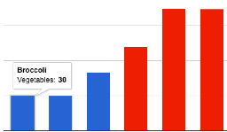</td>
<td>Best to compare categories in separate clusters. Vertical columns, or horizontal bars for long labels. Easy tool: <a href="column-bar-google">Google Sheets bar and column tutorial</a> Power tool: <a href="chartjs">Chart.js templates</a></td>
</tr>
<tr class="odd">
<td>Stacked column or bar  </td>
<td>Best to compare sub-categories, or parts of a whole. Vertical columns, or horizontal bars for long labels. Easy tool: <a href="column-bar-google">Google Sheets bar and column tutorial</a> Power tool: <a href="chartjs">Chart.js templates</a></td>
</tr>
<tr class="even">
<td>Histogram  </td>
<td>Best to show distribution of raw data, with number of values in each bucket. Easy tool: <a href="column-bar-google">Google Sheets bar and column tutorial</a> Power tool: <a href="chartjs">Chart.js templates</a></td>
</tr>
<tr class="odd">
<td>Pie chart  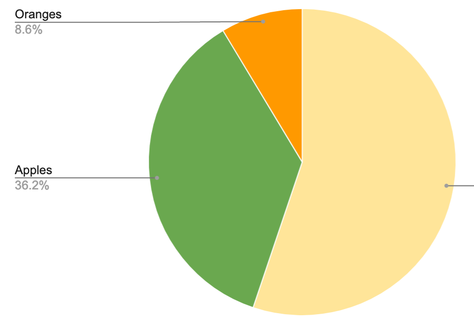</td>
<td>Best to show parts of a whole, but hard to estimate size of slices. Easy tool: <a href="pie-line-area-google">Google Sheets pie chart tutorial</a> Power tool: <a href="chartjs">Chart.js templates</a></td>
</tr>
<tr class="even">
<td>Line chart  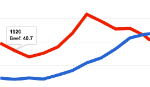</td>
<td>Best to show continuous data, such as change over time. Easy tool: <a href="pie-line-area-google">Google Sheets line chart tutorial</a> Power tool: <a href="chartjs">Chart.js templates</a></td>
</tr>
<tr class="odd">
<td>Filtered line chart   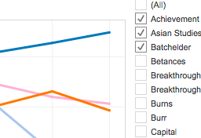</td>
<td>Best to show multiple lines of continuous data, with on-off toggle buttons.  Easy tool: <a href="filtered-line-chart-tableau">Tableau Public filtered line chart tutorial</a></td>
</tr>
<tr class="even">
<td>Stacked area chart  </td>
<td>Best to show parts of a whole, with change over time.  Easy tool: <a href="pie-line-area-google">Google Sheets stacked area tutorial</a> Power tool: <a href="chartjs">Chart.js templates</a></td>
</tr>
<tr class="odd">
<td>Scatter chart   </td>
<td>Best to show relationship between two sets of data. Also called an XY chart.  Easy tool: <a href="scatter-bubble-google">Google Sheets scatter chart tutorial</a> or <a href="scatter-chart-tableau">Tableau Public scatter chart tutorial</a> Power tool: <a href="chartjs">Chart.js templates</a></td>
</tr>
<tr class="even">
<td>Bubble chart   </td>
<td>Best to show relationship between three or four sets of data, using bubble size and color. Easy tool: <a href="scatter-bubble-google">Google Sheets bubble chart tutorial</a> Power tool: <a href="chartjs">Chart.js templates</a></td>
</tr>
</tbody>
</table>

#### For more advanced chart types and tutorials

-   [Google Sheets Chart types help
    page](https://support.google.com/docs/answer/190718)
-   [Tableau Public resources
    page](https://public.tableau.com/en-us/s/resources)
-   [Chart.js samples page](https://www.chartjs.org/samples/latest/)

<!--chapter:end:05-chart.Rmd-->

Chart Design Principles
-----------------------

*last updated July 7, 2019*

Spot the difference between good and bad charts, based on this
compilation of design principles from leading experts, with citations
listed below to learn more.

1.  Remember the **most important principle:** Find meaningful insights
    in your data, and create visualizations that help you tell these
    stories. All of the other details below are secondary.

2.  Before you begin, ask yourself: Do I really need a chart to tell
    this data story? Or would a table or text alone do a better job?

3.  Decide if the best way to communicate with your audience is with
    static charts (such as images printed on paper) or interactive
    charts (embedded in a website, with tooltip details and source
    links). Most of these principles apply to both types, but [this book
    features tools and tutorials](chart) to create interactive charts.

4.  Understand basic chart vocabulary: title, labels, horizontal x-axis
    and vertical y-axis, data series, tooltip, source and credits.

1.  Identify the [chart type](chart) that best matches your story and
    data format.

2.  Draw visual comparisons that are easy for readers to understand,
    rather than confusing them (adapted from Gourley p. 19).

3.  Do the math for your readers. Based on your data story, decide if
    you should show absolute numbers, percentages, or percent change
    (Wong pp. 23-25, 104-107).

1.  Order categories logically—either alphabetically, by value, or
    sequentially—depending on your data story (Gourley, p. 19; Wong
    pp. 70-71).

1.  For long labels, use horizontal bar charts instead of vertical
    column charts (Wong p. 66).

1.  On bar and column charts, start the vertical y-axis at zero, and
    choose natural increments (Wong pp. 51-52). But line charts do not
    need to start at zero, and can focus on specific ranges. See also
    the [How to Lie with Charts](how-to-lie-with-charts) and [How to Lie
    with Maps](how-to-lie-with-maps) chapters in this book.

1.  Beware of pie charts. Most readers cannot accurately estimate sizes
    of different slices. Consider other ways to show part-to-whole
    relationships, such as bar/column charts, or stacked bar/column
    charts (Few 2007, pp. 2-4; Wong p. 79).

1.  If you choose to use a pie chart, then show no more than 5 slices,
    and places the largest slices closest to the top at 12 o’clock
    (Wong, pp. 74-75).

1.  Words matter as much as pictures.

-   Add meaningful titles, labels, and annotations to draw attention to
    your data story.
-   Keep typography simple, and **use bold type** sparingly to highlight
    your key insights (Wong p. 32; Knaflic pp. 107, 111).

1.  On static charts, label items directly when possible. (On
    interactive charts, designers may need to rely on tooltips and
    text.) Insert a legend in a logical place for readers (Wong, p. 56).

2.  Add source credits and bylines—with links to view data tables and
    details—to build credibility and accountability.

3.  Avoid “chart junk”–such as 3D perspective, shadows, and unnecessary
    ornaments—which distract readers from your data story. Never use 3D
    unless you are plotting three-dimensional data (Tufte p. *to come*,
    Wong p. 62, Knaflic p. 65).

1.  De-clutter charts (Knaflic pp. 91-98, 130-135).

1.  Choose colors wisely.

-   Use color to logically organize your data. Avoid random colors (Wong
    pp. 40, 44).
-   Avoid bad combinations from opposite sides of color wheel, such as
    red/green or yellow/blue (Wong pp. 40, 44).
-   Use contrast (such as color vs gray) to call attention to your data
    story (Knaflic pp. 87-88)

See also [Map Design Principles](map-design) and [Tell Your Data
Story](story) chapters in this book.

#### Learn more

-   Stephanie D. H. Evergreen, Effective Data Visualization: The Right
    Chart for the Right Data, (Los Angeles: SAGE Publications,
    Inc, 2016)

-   Stephen Few, Now You See It: Simple Visualization Techniques for
    Quantitative Analysis, (Oakland, Calif: Analytics Press, 2009)

-   Stephen Few, “Save the Pies for Dessert \[critique of pie charts\],”
    Visual Business Intelligence Newsletter, 2007, 1–14,
    <a href="http://www.perceptualedge.com/articles/visual_business_intelligence/save_the_pies_for_dessert.pdf" class="uri">http://www.perceptualedge.com/articles/visual_business_intelligence/save_the_pies_for_dessert.pdf</a>

-   Stephen Few, Show Me the Numbers: Designing Tables and Graphs to
    Enlighten, Second edition (Burlingame, CA: Analytics Press, 2012)

-   Drew Gourley, How to Use Data Visualization to Win Over Your
    Audience, (Visage and Hubspot, June 2015),
    <a href="https://visage.co/content/data-viz-win-audience" class="uri">https://visage.co/content/data-viz-win-audience</a>

-   Cole Nussbaumer Knaflic, Storytelling with Data: A Data
    Visualization Guide for Business Professionals, (Hoboken, New
    Jersey: Wiley, 2015)

-   Cole Nussbaumer Knalfic, “An Updated Post on Pies,” StoryTelling
    with Data, February 16, 2017,
    <a href="http://www.storytellingwithdata.com/blog/2017/1/10/an-updated-post-on-pies" class="uri">http://www.storytellingwithdata.com/blog/2017/1/10/an-updated-post-on-pies</a>

-   Wayne Lytle, Viz-O-Matic: The Dangers of Glitziness and Other
    Visualization Faux Pas, 1993 video shared on YouTube,
    <a href="https://www.youtube.com/watch?v=fP-7rhb-qMg" class="uri">https://www.youtube.com/watch?v=fP-7rhb-qMg</a>

-   Isabel Meirelles, Design for Information: An Introduction to the
    Histories, Theories, and Best Practices Behind Effective Information
    Visualizations (Rockport Publishers, 2013),
    <a href="http://isabelmeirelles.com/book-design-for-information/" class="uri">http://isabelmeirelles.com/book-design-for-information/</a>

-   Tableau, Visual Analysis Best Practices: A Guidebook, n.d.,
    <a href="http://www.tableau.com/sites/default/files/media/whitepaper_visual-analysis-guidebook_0.pdf" class="uri">http://www.tableau.com/sites/default/files/media/whitepaper_visual-analysis-guidebook_0.pdf</a>.

-   Edward R. Tufte, Beautiful Evidence (Graphics Press, 2006)

-   “WTF Visualizations: Visualizations That Make No Sense,” 2017,
    <a href="http://viz.wtf" class="uri">http://viz.wtf</a>.

-   xkcd, “University Website,” accessed February 12, 2017,
    <a href="https://xkcd.com/773/" class="uri">https://xkcd.com/773/</a>

-   Nathan Yau, “One Dataset, Visualized 25 Ways,” FlowingData, January
    24, 2017,
    <a href="http://flowingdata.com/2017/01/24/one-dataset-visualized-25-ways/" class="uri">http://flowingdata.com/2017/01/24/one-dataset-visualized-25-ways/</a>

-   Nathan Yau, “Best Data Visualization Projects of 2016,” FlowingData,
    December 29, 2016,
    <a href="http://flowingdata.com/2016/12/29/best-data-visualization-projects-of-2016/" class="uri">http://flowingdata.com/2016/12/29/best-data-visualization-projects-of-2016/</a>

<!--chapter:end:05.01-chart-design.Rmd-->

Google Sheets Charts
--------------------

*last updated February 12, 2017*

Use Google Sheets
(<a href="http://sheets.google.com" class="uri">http://sheets.google.com</a>),
an easy drag-and-drop tool, to create basic interactive charts that you
can embed in your website.

#### Tool Review

-   Pros:
    -   Free and easy-to-learn tool on the collaborative Google Drive
        platform.
    -   Edit, share, and publish interactive charts from your data, all
        in one spreadsheet.
-   Cons:
    -   Limited control over chart appearance.
    -   Scatter charts cannot show data in tooltips.
    -   Bubble charts cannot show small, uniform bubbles.
    -   Cannot cite or link to source data inside the chart.
    -   Cannot add annotations to highlight items inside charts.
    -   For more powerful tools that require more skills, see tutorials
        in this book on [Tableau Public](scatter-chart-tableau/) and
        [Chart.js](chartjs).

#### Tutorials

Follow the Google Sheet Chart tutorials in this book to create:

-   [Column and Bar Charts](column-bar-google)
    -   Grouped
    -   Separated
    -   Stacked
    -   Histograms
-   [Pie, Line and Area Charts](pie-line-area-google)
-   [Scatter and Bubble Charts](scatter-bubble-google)

#### Learn more

-   [Google Sheet chart types help
    page](https://support.google.com/docs/answer/190718)

<!--chapter:end:05.02-chart-google-sheets.Rmd-->

Column and Bar Charts with Google Sheets
----------------------------------------

*last updated April 4, 2017*

Follow these tutorials to create different types of column and bar
charts with Google Sheets
<a href="http://sheets.google.com" class="uri">http://sheets.google.com</a>
on the Google Drive platform. Requires free account.

-   Grouped
-   Separated
-   Stacked
-   Histograms

#### Grouped Column and Bar Charts

Best to compare categories side-by-side. Vertical columns, or horizontal
bars for long labels.

**Try it:** This grouped column chart shows differences in obesity
between men and women in each age bracket. Float your cursor over
columns to view data details.

<iframe width="600" height="371" seamless frameborder="0" scrolling="no" src="https://docs.google.com/spreadsheets/d/1ltA9siijVSDkTE3fzB3UaWHO7dotBIrGH4R9wI_Qyqw/pubchart?oid=787918829&amp;format=interactive">
</iframe>

<a href="https://docs.google.com/spreadsheets/d/1ltA9siijVSDkTE3fzB3UaWHO7dotBIrGH4R9wI_Qyqw/edit#gid=1017658845"> View
data from CDC and StateOfObesity.org</a>

**Tutorial:**

1.  Right-click to open link in new tab: [Google Sheet Column chart with
    grouped data
    template](https://docs.google.com/spreadsheets/d/1ltA9siijVSDkTE3fzB3UaWHO7dotBIrGH4R9wI_Qyqw/)

2.  Sign in to your Google Drive or [sign up for a free
    account](http://sheets.google.com)

3.  Select File &gt; Make a Copy to save your own version to your Google
    Drive.

1.  To remove the current chart from your copy of the spreadsheet,
    select it and press the delete.

2.  Format your data in a similar way as shown below. Each row is a data
    series, which displays as a separate color in the chart.

1.  Use your cursor to select only the data you wish to chart, then
    select Insert &gt; Chart.

1.  In the Chart Editor &gt; Recommendations tab, choose your preferred
    Column chart (or horizontal Bar chart for longer labels), or see
    more options in Chart Types tab. Press the Insert button.

1.  To customize title, labels, and more, click the editing controls in
    the upper-right corner.

1.  To make your data public, select the blue Share button &gt;
    Advanced, then Change from Private to Public On the Web, with Anyone
    Can View.

<iframe src="images/05-chart/column-share.gif" width="100%" height="400px">
</iframe>

1.  To embed your chart in another website, click the upper-right chart
    editing controls, select Publish Chart, select Embed, and press the
    Publish button. Copy the iframe code and see the [Embed on Your
    Web](embed.html) chapter in this book.

2.  Reminder: Currently, there is no easy way to cite or link to your
    source data inside a Google Sheets chart. Instead, cite and link to
    your source data in the text of the web page, as shown in the
    example at the top.

#### Separated Column and Bar Charts

Best to compare categories in separate clusters. Vertical columns, or
horizontal bars for long labels.

**Try it:** This separated bar chart shows calorie counts of fast food
items, separated by restaurant chains. The horizontal bar offers more
space for longer labels. Float your cursor over bars to explore data
details.

<iframe width="700" height="432" seamless frameborder="0" scrolling="no" src="https://docs.google.com/spreadsheets/d/1LGUYaVLoRcOiB8KcXb3Rn7LRj0exnUQYOy58LrkGPAk/pubchart?oid=1270431574&amp;format=interactive">
</iframe>

<a href="https://docs.google.com/spreadsheets/d/1LGUYaVLoRcOiB8KcXb3Rn7LRj0exnUQYOy58LrkGPAk/edit#gid=956322126"> View
data from Starbucks and McDonalds</a>

\*\* Tutorial:\*\*

1.  Right-click to open this link in a new tab: [Google Sheet Column
    chart with separated data
    template](https://docs.google.com/spreadsheets/d/1LGUYaVLoRcOiB8KcXb3Rn7LRj0exnUQYOy58LrkGPAk/)

2.  Follow similar steps in the first tutorial above.

3.  Format your data in a similar way as shown below. Each column is a
    data series, which displays as a separate color in the chart.

1.  In the Chart Editor &gt; Recommendations tab, choose your preferred
    Bar chart, or see more options in Chart Types tab.

#### Stacked Column and Bar Charts

Best to compare sub-categories, or parts of a whole. Vertical columns,
or horizontal bars for long labels.

**Try it:** This stacked column chart compares the percentage of
overweight residents across nations. Float your cursor over columns to
view data details.

<iframe width="600" height="371" seamless frameborder="0" scrolling="no" src="https://docs.google.com/spreadsheets/d/1WS11EK33JCmvCRzSDh9UpP6R7Z2sHglF7ve5iJL6eZk/pubchart?oid=307057605&amp;format=interactive">
</iframe>

<a href="https://docs.google.com/spreadsheets/d/1WS11EK33JCmvCRzSDh9UpP6R7Z2sHglF7ve5iJL6eZk/edit#gid=735710691"> View
data from WHO and CDC</a>

**Tutorial:**

1.  Begin by opening this link in a new tab: [Google Sheets Stacked
    column chart
    template](https://docs.google.com/spreadsheets/d/1WS11EK33JCmvCRzSDh9UpP6R7Z2sHglF7ve5iJL6eZk/)

2.  Follow most of the same steps in first tutorial above.

3.  Format your data in a similar way as shown below. Each column is a
    data series, which displays as a separate color in the chart.

1.  In the Chart Editor &gt; Recommendations tab, choose Stacked column
    chart (or Stacked bar chart if you prefer a horizontal orientation),
    or see more options in Chart Types tab.

#### Histograms

Best to show the distribution of raw data, with number of values in each
bucket. Typically displayed in vertical columns.

**Try it** to come\*

**Tutorial:** to come \*

-   Format data into two columns
    -   data labels in the first column
    -   numeric values in second column

<!--chapter:end:05.03-column-bar-google.Rmd-->

Pie, Line, and Area Charts with Google Sheets
---------------------------------------------

*last updated February 12, 2017*

#### Pie Chart

Best to show parts of a whole, but hard to estimate size of slices.

Try it – to come

Tutorial - to come

#### Line Chart

Best to show change over time with continuous data.

**Try it:** In this line chart, the level of chicken (shown in orange)
rises steadily and surpasses beef (red) and pork (blue). Float your
cursor over lines to view data details.

<iframe width="600" height="371" seamless frameborder="0" scrolling="no" src="https://docs.google.com/spreadsheets/d/1wkWxxZ2-N5hqkcp7in8bxwdEcT1-XMnt1A8qUXxUSjw/pubchart?oid=2073830845&amp;format=interactive">
</iframe>
<a href="https://docs.google.com/spreadsheets/d/1wkWxxZ2-N5hqkcp7in8bxwdEcT1-XMnt1A8qUXxUSjw/edit#gid=894957893">View
source data from USDA</a>

**Tutorial:**

-   Begin by opening this link in a new tab: [Google Sheet Line chart
    template](https://docs.google.com/spreadsheets/d/1wkWxxZ2-N5hqkcp7in8bxwdEcT1-XMnt1A8qUXxUSjw/)
-   Follow most of the same steps in first tutorial above.
-   Format your data in a similar way as shown below. Each column is a
    data series, which displays as a separate color in the chart. 
    
-   In the Chart Editor &gt; Recommendations tab, choose Line chart, or
    see more options in Chart Types tab.

#### Stacked Area Chart

Best to show part-to-whole relationships that change over time.

**Try it:** to come

**Tutorial:** to come

<!--chapter:end:05.04-pie-line-area-google.Rmd-->

Scatter and Bubble Charts with Google Sheets
--------------------------------------------

*Last updated Spring 2017*

Follow these tutorials to create different types scatter and bubble
charts with [Google Sheets](http://sheets.google.com)

#### Scatter chart

Best to show relationships between two series of data. Also called an XY
chart, because each point represents a coordinate value plotted along
the horizontal x-axis and the vertical y-axis.

**Try it:** This scatter chart reveals a downward slope: nations with
lower fertility also tend to have higher life expectancy. But remember
that a data correlation does not necessarily show causation. Float your
cursor over points to view data details. However, the Google Sheet
scatter chart only displays static labels for each country, rather than
interactive tooltips. See alternative tools below.

<iframe width="626" height="387" seamless frameborder="0" scrolling="no" src="https://docs.google.com/spreadsheets/d/1LJCj3RaVgaQsAZriV_JDQhBrIBSvnH_N1LBCkZK1bqs/pubchart?oid=386475448&amp;format=interactive">
</iframe>
<a href="https://docs.google.com/spreadsheets/d/1LJCj3RaVgaQsAZriV_JDQhBrIBSvnH_N1LBCkZK1bqs/edit#gid=562477420">View
source data from World Bank</a>

**Tutorial:**

-   Begin by opening this link in a new tab: [Google Sheets Scatter
    chart with static data
    labels](https://docs.google.com/spreadsheets/d/1LJCj3RaVgaQsAZriV_JDQhBrIBSvnH_N1LBCkZK1bqs/)
-   Follow most of the same steps in first tutorial above.
-   Format your data in a similar way as shown below. The first column
    (life expectancy) is the x-axis data series, and the second column
    (fertility) is the y-axis data series. The third column consists of
    data labels (names of countries).  
-   In the Chart Editor &gt; Recommendations tab, choose Scatter chart,
    or see more options in Chart Types tab.
-   To display static labels for each point, click the upper-right
    charter corner for Advanced Editing tools &gt; Customization tab,
    the scroll down to Series &gt; Data labels &gt; Custom, and press
    Update. 
-   Since the Google Sheets scatter chart is not ideal, consider using
    the 3-column bubble chart below, or the [Scatter Chart with Tableau
    Public tutorial](scatter-chart-tableau) in this book.

#### Bubble chart with 3 columns

Best to show the relationship between two series of data, similar to the
scatter chart above, with labels in tooltips.

**Try it:** This bubble chart shows the same data as above on fertility
and life expectancy. Float your cursor over each bubble to reveal a
tooltip with the country name and the two data points.

<iframe width="600" height="371" seamless frameborder="0" scrolling="no" src="https://docs.google.com/spreadsheets/d/1CL7joH_3wvMYo9HIiSuFP0Ykv_Nl5DK6DYYcd3_gFnU/pubchart?oid=2105121864&amp;format=interactive">
</iframe>
<a href="https://docs.google.com/spreadsheets/d/1CL7joH_3wvMYo9HIiSuFP0Ykv_Nl5DK6DYYcd3_gFnU/edit#gid=1602534273">View
source data from World Bank</a>

**Tutorial:** - Begin by opening this link a new tab: [Google Sheets
Bubble chart with 3 columns
template](https://docs.google.com/spreadsheets/d/1CL7joH_3wvMYo9HIiSuFP0Ykv_Nl5DK6DYYcd3_gFnU/)
- Format your data in a similar way as shown below, with three columns
in this order: - A: label for each bubble - B: numeric data on
horizontal x-axis - C: numeric data on vertical y-axis   - Follow most of
the same steps in the first tutorial above. - In the Chart Editor, skip
the Recommendation tab, select the Chart Types tab, then choose Bubble
chart (near Scatter chart).   - Labels will appear on
each bubble by default. To hide labels initially, so that they appear
only in the interactive tooltips when floating the cursor over data,
customize your chart. Click the editing controls in the upper-right
corner, scroll down to Series, and change Labels &gt; Color &gt;
None.   - Unfortunately,
there is no easy way to reduce all bubbles to a uniformly smaller size.
See the Google Sheets Bubble chart with 5 columns below, or create a
[Scatter Chart with Tableau
Public](chart.html#scatter-chart-with-tableau-public) in this book.

#### Bubble chart with 5 columns

Best to show the relationship between three or four series of data.
Similar to a scatter chart, but with bubble size and color to represent
additional variables.

**Try it:** This bubble chart shows fertility and life expectancy for a
subset of the nations above, with population (shown by bubble size) and
region (shown by bubble color). Float your cursor over bubbles to view
data details.

<iframe width="600" height="371" seamless frameborder="0" scrolling="no" src="https://docs.google.com/spreadsheets/d/1YgBWYm9nTGlCuyqSwU3SDb7xk-SMSPgjfYq5iLqL0nQ/pubchart?oid=200651442&amp;format=interactive">
</iframe>
<a href="https://docs.google.com/spreadsheets/d/1YgBWYm9nTGlCuyqSwU3SDb7xk-SMSPgjfYq5iLqL0nQ/edit#gid=1182154897">View
data from World Bank</a>

\*\* Tutorial \*\* - Begin by opening this link a new tab: [Google
Sheets Bubble chart with 5 columns
template](https://docs.google.com/spreadsheets/d/1YgBWYm9nTGlCuyqSwU3SDb7xk-SMSPgjfYq5iLqL0nQ/)
- Follow most of the same steps in the tutorials above. - Format your
data in a similar way as shown below, with 5 columns in this order: - A:
label for each bubble - B: numeric data on horizontal x-axis - C:
numeric data on vertical y-axis - D: text data to represent bubble color
(each category will appear as a new color, or leave blank to display all
as one color)  
- E: numeric data to represent bubble size   -
Labels will appear on each bubble by default. To hide labels in the
default display (and show them only in the interactive tooltips when
floating the cursor over data), see the 3-column bubble chart tutorial
above.

#### Learn more

See additional chart types in this [Google Sheets help
page](https://support.google.com/docs/answer/190718)

<!--chapter:end:05.05-scatter-bubble-google.Rmd-->

Create Charts with Tableau Public
---------------------------------

*last updated March 10, 2017*

This book includes tutorials to create interactive charts with Tableau
Public
<a href="https://public.tableau.com" class="uri">https://public.tableau.com</a>.
Free download requires email signup.

-   [Create an XY Scatter Chart with Tableau
    Public](scatter-chart-tableau)
-   [Create a Filtered Line Chart with Tableau
    Public](filtered-line-chart-tableau)

#### Tool Review

-   Pros
    -   Easy-to-learn tool for basic charts, with power to create more
        advanced visualizations
    -   Tableau Public (free version) includes most features found in
        Tableau Desktop (US $999+)
    -   Connect to multiple data formats: Text (CSV), Google Sheets,
        Excel, and more
    -   Combine multiple visualizations and tell stories with dashboard
        and story point features
-   Cons
    -   Only available as a downloadable application for Mac or Windows
    -   New users may be overwhelmed by extensive options
    -   Saving your work online makes it public (hence the name Tableau
        Public)
    -   Limited support for maps below the nation or state levels
    -   Dependent upon Tableau web servers

#### Learn more

-   [Embed Tableau Public on Your Website](iframe-tableau) chapter in
    this book
-   Tableau Public Resources, with how-to videos and sample data
    <a href="https://public.tableau.com/en-us/s/resources" class="uri">https://public.tableau.com/en-us/s/resources</a>
-   Tableau Public Support page
    <a href="https://www.tableau.com/support/public" class="uri">https://www.tableau.com/support/public</a>

<!--chapter:end:05.06-tableau-public.Rmd-->

Create XY Scatter Chart with Tableau Public
-------------------------------------------

*last updated March 16, 2017*

An interactive scatter chart shows the relationship between two
variables by displaying a series of XY coordinates. Readers can float
their cursor over points to view specific details. The chart below,
which illustrates the strong relationship between Connecticut school
district income and test scores, was created with the free downloadable
tool for Mac and Windows, Tableau Public
<a href="http://public.tableau.com" class="uri">http://public.tableau.com</a>.

#### Try it

<iframe src="https://public.tableau.com/views/CTSchoolDistrictsbyIncomeandGradeLevels2009-13/Sheet1?:showVizHome=no&amp;:embed=true" width="90%" height="500">
</iframe>

#### Video with step-by-step tutorial

<iframe width="560" height="315" src="https://www.youtube.com/embed/70RKjT91cjs?rel=0" frameborder="0" allow="autoplay; encrypted-media" allowfullscreen>
</iframe>

1.  Read the [Tableau Public tool review](tableau-public) in this book,
    then download and install the free application on a Mac or Windows
    computer from
    <a href="http://public.tableau.com" class="uri">http://public.tableau.com</a>.
    Requires a free account.

2.  Click the link and Save to download the sample file to your
    computer: [ct-districts-income-grades-2009-13 in Excel
    format](data/ct-districts-income-grades-2009-13.xlsx).

3.  Open the sample file to view three columns: district, median
    household income, and grade levels (above/below national average for
    6th grade Math and English test scores). The Notes tab explains how
    this data is based on the work of Sean Reardon et al. at the
    [Stanford Education Data
    Archive](http://purl.stanford.edu/db586ns4974), Motoko Rich et
    al. at [The New York
    Times](http://www.nytimes.com/interactive/2016/04/29/upshot/money-race-and-success-how-your-school-district-compares.html),
    Andrew Ba Tran at
    [TrendCT](http://trendct.org/2016/05/06/wealth-and-grades-compare-connecticuts-school-districts/),
    and the American Community Survey 2009-13 via [Social
    Explorer](http://socialexplorer.com).

Hint: To prepare your own scatter chart data from different sources, see
the [Match Spreadsheet Columns with VLookup Function](vlookup) chapter
in this book.

1.  In Tableau Public, click Connect to import the data file from your
    computer. If you downloaded an Excel file, Connect to Excel. Or if
    you downloaded a CSV file, Connect to Text. Or click “More…” to
    connect to Google Sheets.

2.  Drag the Data sheet into the Data Source field.

3.  In bottom-left corner, below the “Go to Worksheet” reminder, click
    Sheet 1.

4.  Welcome to the Tableau Public Worksheet. Although it may feel
    overwhelming at first, the key is learning where to drag items from
    the data tab into the main worksheet. Dimensions are any information
    that is qualitative or categorical, while measures are quantitative
    information about the dimensions.

5.  Drag the Grade Levels measure into the Rows field.

6.  Drag the Median Household Income measure into the Columns field. The
    initial chart will appear as one point, but that’s because all of
    the data is aggregated together. We’re not done yet.

7.  Drag the District dimension into the lower portion of the Marks
    area. Now your scatter chart will appear, and float your cursor over
    each point to view details.

8.  Click Sheet 1 to rename the title of your chart.

9.  Click the Worksheet menu to Show Caption and type in data sources.

10. Recommended: Click the Standard menu (above Columns) to change view
    to Fit Width.

1.  To publish your chart on the public web, select File &gt; Save to
    Tableau Public As. Requires signup for a free Tableau account.

2.  Give your workbook a meaningful title, since this name will appear
    in the URL for your published work on the Tableau Public server, and
    press Save.

3.  After publishing your work on the web, Tableau Public will
    automatically open the web link in your default browser. Click Edit
    Details to enter more information. Under Toolbar settings, see
    checkbox to Allow your workbook and its data to be downloaded by
    others.

Checking this box enables the Download button at the bottom of your
published work, which allows users to access your data and workbook, to
see how you constructed the visualization.

1.  To insert your Tableau Public visualization in your own website, see
    the [Embed On Your Web](embed.html) chapter of this book, and in
    particular, [Embed Tableau Public on your
    Website](embed.html#tableau).

2.  To see all of your published visualizations, go to your Tableau
    Public online profile, which follows this format:

<!-- -->

    https://public.tableau.com/profile/USERNAME

#### Learn more

-   Combine multiple visualizations and tell stories with Tableau Public
    dashboard and story point features. See Tableau Public Resources,
    with how-to videos and sample data
    <a href="https://public.tableau.com/en-us/s/resources" class="uri">https://public.tableau.com/en-us/s/resources</a>.

<!--chapter:end:05.07-scatter-chart-tableau.Rmd-->

Create Filtered Line Chart with Tableau Public
----------------------------------------------

*by [Veronica X. Armendariz and Jack Dougherty](authors), last updated
March 16, 2017*

An interactive filtered line chart provides checkboxes to turn on/off
selected data lines to make specific comparisons, since displaying all
of the lines at once would be overwhelming. Readers can float their
cursor over each line to identify the school name and data details. We
created this tutorial to help a Hartford non-profit education advocacy
group compare cohorts of student achievement levels over time across
forty schools. You can create your own version with a free downloadable
tool for Mac and Windows computers, Tableau Public
<a href="https://public.tableau.com" class="uri">https://public.tableau.com</a>.

#### Try it

<iframe src="https://public.tableau.com/views/LineChartSample/Sheet1?:showVizHome=no&amp;:embed=true" width="90%" height="530">
</iframe>

Or right-click the [link to view full-size in a new
tab](https://public.tableau.com/views/LineChartSample/Sheet1?:embed=y&:display_count=yes)

#### Video with step-by-step tutorial

<iframe width="560" height="315" src="https://www.youtube.com/embed/_L4u9mfE8Qo?rel=0" frameborder="0" allow="autoplay; encrypted-media" allowfullscreen>
</iframe>

1.  Read the [Tableau Public tool review](tableau-public) in this book,
    then download and install the free application on a Mac or Windows
    computer from
    <a href="http://public.tableau.com" class="uri">http://public.tableau.com</a>.
    Requires a free account.

2.  Click link and Save file to download to your computer:
    [sample-filtered-line-chart in CSV
    format](data/sample-filtered-line-chart.csv). CSV means
    comma-separated values, a generic spreadsheet format that most data
    tools can easily open.

Hint: When preparing your own spreadsheet, format your data so that
Tableau Public can read it. For example, make sure that Year data is
entered as “2007” instead of “1/1/2007”. Leave all blank spaces as-is so
that Tableau automatically converts them to “null” values during the
data import.

1.  In Tableau Public, click Connect to import the data file you
    downloaded to your computer. If you downloaded a CSV file, Connect
    to Text. Or if you downloaded an Excel file, Connect to Excel. Or
    click “More…” to connect to Google Sheets.

2.  Your data sheet should automatically appear in Tableau Public. Any
    blanks will automatically convert to “null.”

3.  In bottom-left corner, below the “Go to Worksheet” reminder, click
    Sheet 1.

4.  Welcome to the Tableau Public Worksheet. Although it may feel
    overwhelming at first, the key is learning where to drag-and-drop
    items from the data tab into the main worksheet. Dimensions are any
    information that is qualitative or categorical, while measures are
    quantitative information about the dimensions. In this example, we
    are creating a line chart with two dimensions (year and school) and
    one measure (scores).

5.  Drag-and-drop Year into the Column field.

6.  Drag-and-drop Schools into the Row field.

7.  Drag-and-drop Scores into the middle of the grid.

8.  Select Score (but not its drop-down menu), then go to the Analysis
    menu and turn off Aggregated Measures. We need to do this so that
    the numbers are displayed individually, and not aggregated by
    default.

9.  In the upper-right corner, go to the Show Me window. (If it is
    closed, then open it.) Then select Lines (continuous).

10. Initially, each School row appears at its own chart. To blend all of
    them together into one master chart, drag School to the Marks window
    and drop it on the Color button. All of the School lines will appear
    in one chart, with identifying colors.

11. To filter the line chart to display only selected items, go to the
    Marks window, select the School Cohort drop-down menu, and choose
    Filter.

12. The Filter window should appear in the far-right side. (If
    necessary, close the Show Me window to view the Filter window.)
    Select only a few schools to display by default.

13. Since users can identify schools by turning them on in the Filter
    window, or floating their cursors to view tooltips for each line, we
    do not need to show the color legend for each school. In
    bottom-right School window, select the drop-down menu and choose
    Hide Card.

14. Confirm or enter text for the axes, title, and caption to describe
    the data source.

15. To publish your chart on the public web, select File &gt; Save to
    Tableau Public As. Requires signup for a free Tableau account.

16. Give your workbook a meaningful title, since this name will appear
    in the URL for your published work on the Tableau Public server, and
    Save.

17. After publishing your work on the web, Tableau Public will
    automatically open the web link in your default browser. Click Edit
    Details to enter more information. Under Toolbar settings, see
    checkbox to Allow your workbook and its data to be downloaded by
    others.

Checking this box enables the Download button at the bottom of your
published work, which allows users to access your data and workbook, to
see how you constructed the visualization.

1.  To insert your Tableau Public visualization in your own website, see
    the [Embed On Your Web](embed) chapter of this book, and in
    particular, [Embed Tableau Public on your Website](iframe-tableau).

2.  To see all of your published visualizations, go to your Tableau
    Public online profile, which follows this format:

<!-- -->

    https://public.tableau.com/profile/USERNAME

#### Learn more

-   Combine multiple visualizations and tell stories with Tableau Public
    dashboard and story point features. See Tableau Public Resources,
    with how-to videos and sample data
    <a href="https://public.tableau.com/en-us/s/resources" class="uri">https://public.tableau.com/en-us/s/resources</a>.

<!--chapter:end:05.08-filtered-line-chart-tableau.Rmd-->

Map Your Data
=============

*by [Jack Dougherty, Stacy Lam, and David Tatem](authors), last updated
January 27, 2020*

Maps entice readers to explore your data story and develop a stronger
sense of place. But good maps require careful thought about how to
clearly communicate spatial concepts with your audience. This book
features free tools to create interactive maps that you can embed in
your website. In this chapter, you will learn how to:

-   Practice key [principles of map design](map-design).
-   Choose a map type that matches your data story and format, with
    tutorial links in the table below. Beginners may start with
    easy-to-learn tools such as [Google My Maps](mymaps), then move up
    to more powerful tools, such as [Leaflet](leaflet), which require
    you to [Modify and Host Code Templates with GitHub](github) or other
    web servers.

See also related chapters in this book:

-   [Draw and write your data story](draw) to capture your ideas on
    paper
-   [Improve spreadsheet skills](spreadsheet), [Find and know your
    data](find), and [Clean your data](clean)
-   [Transform your map data](transform)
-   [Embed your interactive chart on your website](embed)
-   [Detect bias in data stories](detect), including [How to lie with
    maps](how-to-lie-with-maps)
-   [Tell your data story](story), including its most meaningful
    insights and limitations

<table>
<colgroup>
<col style="width: 50%" />
<col style="width: 50%" />
</colgroup>
<thead>
<tr class="header">
<th>Basic map types</th>
<th>Best use and tutorial chapters</th>
</tr>
</thead>
<tbody>
<tr class="odd">
<td>Point map   </td>
<td>Best to show specific locations, such as addresses with geocoded coordinates, with colors for different categories.  Easy tool: <a href="mymaps">Google My Maps tutorial</a> Power tool: <a href="leaflet-maps-with-google-sheets">Leaflet Maps with Google Sheets</a> and other <a href="leaflet">Leaflet templates</a></td>
</tr>
<tr class="even">
<td>Polygon map   </td>
<td>Best to show regions (such as nations or neighborhoods), with colors or shading to represent data values. Also known as choropleth map.  Easy tool: n/a  Power tools: <a href="tableau-polygon">Tableau Public</a> or <a href="leaflet-maps-with-google-sheets">Leaflet Maps with Google Sheets</a> and other <a href="leaflet">Leaflet templates</a></td>
</tr>
<tr class="odd">
<td>Polyline map   </td>
<td>Best to show routes (such as trails or transit), with colors for different categories.  Easy tool: n/a  Power tool: <a href="leaflet-maps-with-google-sheets">Leaflet Maps with Google Sheets</a> and other <a href="leaflet">Leaflet templates</a></td>
</tr>
<tr class="even">
<td>Combination map   </td>
<td>Best to show any combination of points, polygons, or polylines.  Easy tool: n/a  Power tool: <a href="leaflet-maps-with-google-sheets">Leaflet Maps with Google Sheets</a> and other <a href="leafletl">Leaflet templates</a></td>
</tr>
<tr class="odd">
<td>Storymap   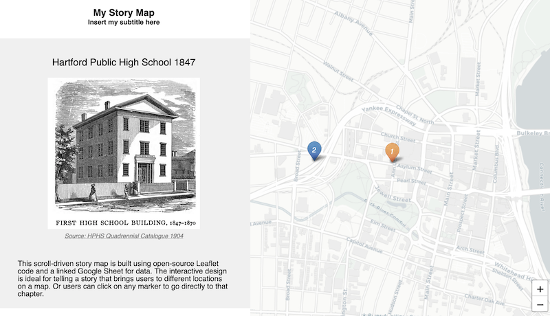</td>
<td>Best for guided point-by-point journey through a historical narrative, with optional photos, audio, or video on an interactive map.   Easy tool: <a href="https://storymap.knightlab.com/">Knight Lab’s StoryMap</a>, <a href="https://storymaps.arcgis.com/en/">ESRI Story Maps</a>   Power tool: <a href="leaflet-storymaps-with-google-sheets">Leaflet Storymaps with Google Sheets</a></td>
</tr>
</tbody>
</table>

\*\* TO DO \*\*

-   heat map
-   tab-view map for historical change
-   synchronized side-by-side map

<!--chapter:end:06-map.Rmd-->

Map Design Principles
---------------------

*last updated July 28, 2019*

#### Ask Before You Map

Before you leap into a mapping project, consider these questions:

**Does your data contain geographic information?** Common examples:

-   Specific locations or addresses (examples: *Trinity College*, or
    *300 Summit St, Hartford, CT*)
-   Latitude and longitude coordinates (example: *41.756, -72.675*)
-   Regions that are legally recognized (such as nations, states,
    counties, census tracts) or that correspond to a boundary map in
    your possession (such as designated neighborhoods or health
    districts)

While there are many more types of geographic information, these
examples above are the most common. If your data lacks geographic
information, or if you do not possess the corresponding boundary
information, it may not be possible to map it.

**Does location really matter to your data story?**

Sometimes a well-designed chart, rather than a map, may be the best way
to visualize your data story. Consider these alternatives:

-   to show change over time across different locations, consider a line
    chart

<iframe src="https://ourworldindata.org/grapher/projected-population-by-country" style="width: 100%; height: 450px; border: 0 none;">
</iframe>

-   to show the relationship between two or more datasets across
    different locations, consider an XY scatter chart or bubble chart

<iframe src="https://ourworldindata.org/grapher/learning-outcomes-vs-gdp-per-capita" style="width: 100%; height: 450px; border: 0 none;">
</iframe>

If a map is the best way to tell your data story, then choose an
appropriate type. See [table of basic map types](map) in this book.

#### Map Design Principles

1.  Understand basic map vocabulary: title, legend, baselayer, marker,
    popup, tooltip, zoom level, polygon, polyline, source.

2.  Add source credits and bylines—with links to view data tables and
    details—to build credibility and accountability.

3.  Choose colors wisely.

    -   Use color to logically organize your data. Avoid random colors
        (Wong pp. 40, 44).
    -   Avoid bad combinations from opposite sides of color wheel, such
        as red/green or yellow/blue (Wong pp. 40, 44).
    -   Use contrast (such as color vs gray) to call attention to your
        data story (Knaflic pp. 87-88)

4.  Choose basemaps wisely. Basemaps themselves may contain a lot of
    information, such as terrain, roads, parks, town names, buildings,
    etc. They may also use colors that can be distracting to the viewer.
    Think about the minimum number of elements required in the basemap
    to tell your story.

#### Design polygon maps with ColorBrewer

One of the most useful tools for creating meaningful polygon (or
choropleth) maps is ColorBrewer
<a href="http://colorbrewer2.org" class="uri">http://colorbrewer2.org</a>
created by Cynthia Brewer, Mark Harrower and the Pennsylvania State
University.

1.  Think about the **number of data classes** (or “dividers” or
    “buckets”). More does not necessarily mean better. Try different
    numbers and color schemes, and decide if you (and your audience) can
    easily distinguish between them.
    -   A smaller number sorts your data into fewer buckets, and shows a
        more **coarse map**, but differences in colored ranges become
        **more visible**.
    -   A larger number sorts your data into more buckets, and shows a
        more **granular map**, but differences in colored ranges become
        **less visible**.

1.  Think about the **nature of data** you are going to display.

-   Sequential: best to show steps from lower values (light color) to
    higher values (dark color)
    -   Example: a scale that increases from 1 to 100
-   Diverging: best to show extremes (dark colors) around a neutral
    middle (light color)
    -   Example: a scale that highlights extremes from -100 to 0 to 100
-   Qualitative: best to show different categories, represented by their
    own color
    -   Example: a map legend of the dominant crop in each area: apples,
        oranges, bananas

1.  Pick a **color scheme**, with options for colorblind-safe and
    print-friendly.
    -   Think about the ideal format for your audiences. Are readers
        more likely to view your visualization on a computer screen, or
        in print, or both?
2.  Click the Export tab to view all options. Some Leaflet map templates
    in this book use specific color names (such as “red” or “darkgreen”)
    and some use hexadecimal codes, abbreviated as “hex codes” (such as
    \#ff0000 or \#336600). To learn more, use a Color Picker tool, such
    as
    <a href="https://www.w3schools.com/colors/colors_picker.asp" class="uri">https://www.w3schools.com/colors/colors_picker.asp</a>

Beware that polygon map design choices about data classes and colors
reflect the biases of the author and the software. Read the [Detect Bias
in Data Stories](detect.html) chapter in this book, especially [How to
Lie with Maps](detect.html#how-to-lie-with-maps)

#### Learn more

-   Axis Maps, “The Basics of Data Classification,” 2010,
    <a href="http://axismaps.github.io/thematic-cartography/articles/classification.html" class="uri">http://axismaps.github.io/thematic-cartography/articles/classification.html</a>
-   Lisa Charlotte Rost, “Your Friendly Guide to Colors in Data
    Visualisation,” Lisa Charlotte Rost, April 22, 2016,
    <a href="https://lisacharlotterost.github.io/2016/04/22/Colors-for-DataVis/" class="uri">https://lisacharlotterost.github.io/2016/04/22/Colors-for-DataVis/</a>.
-   Josh Stevens, “Bivariate Choropleth Maps: A How-To Guide,” February
    18, 2015,
    <a href="http://www.joshuastevens.net/cartography/make-a-bivariate-choropleth-map/" class="uri">http://www.joshuastevens.net/cartography/make-a-bivariate-choropleth-map/</a>.

<!--chapter:end:06.01-map-design.Rmd-->

Point Map with Google My Maps
-----------------------------

*last updated March 16, 2017*

#### Try It

Explore the interactive point map below, or [view the full-screen
version](https://drive.google.com/open?id=1OPrulm2ISYUb990DJOCoYlt_sWc),
created with Google My Maps
<a href="https://www.google.com/maps/d/" class="uri">https://www.google.com/maps/d/</a>.

<iframe src="https://www.google.com/maps/d/u/0/embed?mid=1OPrulm2ISYUb990DJOCoYlt_sWc" width="90%" height="480">
</iframe>

#### Tool Review

-   Pros
    -   Easy-to learn free mapping tool to import and style point,
        polyline, and polygon layers and basemap layers
    -   Share and collaborate through the Google Drive platform
    -   Geocoding error warning
-   Cons
    -   Limited options to customize map markers
    -   Cannot easily create colored polygon maps from data values
    -   Cannot extract geocoded data to migrate to another tool

#### Video with Step-by-Step Tutorial

<iframe width="560" height="315" src="https://www.youtube.com/embed/ZVIPn8dJeYM?rel=0" frameborder="0" allow="autoplay; encrypted-media" allowfullscreen>
</iframe>

Let’s build a simple point map with sample data, using Google My Maps
<a href="https://www.google.com/maps/d/" class="uri">https://www.google.com/maps/d/</a>.
Requires signing up for a free Google Drive account.

1.  Click this link and Save to download to your computer:
    [sample-address-data in CSV format](data/sample-address-data.csv).
    CSV means comma-separated values, a generic spreadsheet format that
    most tools can easily open. For help with downloading, see this
    [short video tutorial](https://www.youtube.com/watch?v=-04PQldP9HQ).

2.  Open and sign in to Google My Maps
    <a href="https://www.google.com/maps/d/" class="uri">https://www.google.com/maps/d/</a>

3.  Click the red + symbol to create a new map, which will be saved
    automatically to your Google Drive folder.

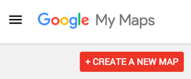

1.  In the map layers area, click the blue Import link. Drag-and-drop
    the CSV address data file into the web interface to import it.

1.  Choose columns to position your placements. Select “Address” for
    this sample data, then Continue.

1.  Choose a column to title your markers. Select “Description” for this
    sample data, then Finish.

1.  After My Maps uploads and geocodes your sample data, click Open Data
    Table to inspect the results.

1.  To style the map markers, click Individual Styles. In this sample
    data, you can select Group Places By &gt; Style By &gt; Group. This
    will color markers according to the three categories.

<iframe src="images/06-map/mymaps-style-groups-640w.gif" width="100%" height="400px">
</iframe>

1.  To publish your map on the web, click Share, add a map title, change
    from Private to Public on the Web, so that anyone can view your map.
    Click Save and Done.

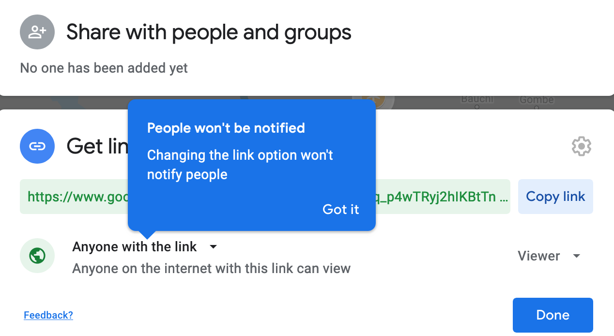

1.  To embed the map on your own website, click the three vertical dots
    next to the map title for more options, and select Embed On My Site.
    The tool will generate an iframe code for you to copy. For next
    steps, go to the [Embed on Your Web](embed.html) chapters in this
    book.

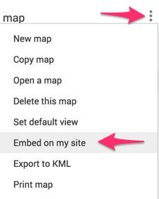

#### Learn more

-   Google My Maps Help Page
    <a href="https://support.google.com/mymaps/answer/3024396" class="uri">https://support.google.com/mymaps/answer/3024396</a>

<!--chapter:end:06.03-mymaps.Rmd-->

Point Map with Carto Builder
----------------------------

*last updated March 15, 2017*

#### TO DO

-   Test this tool and decide if it still warrants inclusion in this
    book
-   See note about old versus newer Cartobuilder – still relevant?
-   if this tool stays in the book, check the iframe below to see if
    update is needed

#### Try It

Explore the interactive point map below, or [view the full-screen
version](https://jackdougherty.carto.com/builder/1abbb430-ec89-11e6-a661-0e05a8b3e3d7/embed)
,created with Carto Builder
<a href="https://carto.com" class="uri">https://carto.com</a>.

<iframe width="90%" height="500" frameborder="0" src="https://jackdougherty.carto.com/builder/1abbb430-ec89-11e6-a661-0e05a8b3e3d7/embed" allowfullscreen webkitallowfullscreen mozallowfullscreen oallowfullscreen msallowfullscreen>
</iframe>

#### Tool Review

-   Pros:
    -   Free and powerful drag-and-drop map tool in the browser
    -   Customize point markers and polygon colors by data values
    -   Additional features include geographic analysis tools
-   Cons:
    -   Several steps required to create simple point or polygon map
    -   New users may get lost when moving through multiple screens
    -   Free account allows only 400 geocodes per month

#### Video with Step-By-Step Tutorial

<iframe width="560" height="315" src="https://www.youtube.com/embed/lto7Z5wC2hQ?rel=0" frameborder="0" allow="autoplay; encrypted-media" allowfullscreen>
</iframe>

***Before you begin:*** This tutorial uses the newer Carto Builder,
rather than older Carto Editor tool. Learn more at
<a href="https://carto.com/learn/guides/intro/migrating-from-carto-editor-to-carto-builder" class="uri">https://carto.com/learn/guides/intro/migrating-from-carto-editor-to-carto-builder</a>.
If you have an old Carto account that has not automatically updated to
the new Builder tool, you may need to create a brand-new account to use
this tutorial.

Let’s build a simple point map with sample data, using Carto Builder
<a href="https:/carto.com" class="uri">https:/carto.com</a>. Requires
signing up for a free account.

1.  Click this link and Save to download to your computer:
    [sample-address-data in CSV format](data/sample-address-data.csv).
    CSV means comma-separated-values, a generic spreadsheet format that
    many tools can easily open.

2.  Open Carto in your browser
    <a href="https://carto.com" class="uri">https://carto.com</a>.

3.  The Carto Dashboard displays two views: Maps and Datasets. Always
    begin with Datasets, then move to Maps. (Hint: If your dashboard
    looks very different than mine, then you might still be using the
    older Carto Editor, rather than the newer Carto Builder.)

1.  First, connect your dataset, and soon we’ll turn it into a map.
    Click blue button to add New Dataset.

2.  Drag-and-drop the CSV sample address data to upload it, and select
    Connect Dataset. (Be patient. Sometimes this takes more than 30
    seconds.)

3.  Inspect your connected dataset.

4.  Click the blue Create Map button.

5.  Click the Edit Your Map button.

6.  In your map data layer, click Add Analysis.

7.  In the next screen of Analysis options, select Georeference, then
    click the Add Analysis button.

8.  Back in your map data layer, under Georeference options, select
    Type &gt; Street Addresses (scroll down to the bottom) for this
    sample data.

9.  Under Parameters, for Column Street Address (abbreviated as Col.
    Street Ad.), select the “address” field for this sample data. Press
    the Apply button.

10. After Carto has attempted to geocode your address data, click Style
    This Analysis. Or, go to the map data layer and click the Style tab.

11. In Style options, for Aggregation select none (the default).

12. Under Style options:

-   select Fill Number to change circle sizes
-   enter a larger size, such as 13, to make our sample points more
    visible
-   select Fill Color to change circle color
-   switch from Solid (all points are same color) to By Value, and
    scroll down to Group (at the bottom) to automatically color by
    categories for this sample data. (Hint: If you don’t see Group in
    the menu, click somewhere else and try it again.)

1.  In the Pop-up tab, select a Window Style, then select boxes in Show
    Items to display.

2.  In the Legend tab, click Select a Style to display information, and
    your color-coded groups from above should automatically appear on
    your map. (Hint: A legend may automatically appear after styling
    your markers by color.)

3.  Before publishing your map: If you wish to rename it, do it now by
    selecting the three vertical dots next to the file name, and select
    Rename.

4.  To publish your map on the web: Next to your map file name, click
    the blue “back” arrow (NOT your browser back button) to return to
    the data layer. Click the green Public button, and on the next
    screen, click the blue Publish button.

1.  On the next screen, Get The Link generates a weblink to your map,
    and Embed It generates an iframe code to insert the live map in your
    website. For next steps, go to the [Embed on Your Web](../../embed)
    chapters in this book.

2.  If you make edits to your map, you must click the blue Update button
    to republish your map to the web.

#### Learn more

-   Getting Started with Carto Builder
    <a href="https://carto.com/learn/guides/intro/getting-started-with-carto-builder" class="uri">https://carto.com/learn/guides/intro/getting-started-with-carto-builder</a>

<!--chapter:end:06.04-carto.Rmd-->

Filtered Point Map with Socrata Open Data
-----------------------------------------

*by [Veronica X. Armendariz and Jack Dougherty](authors), last updated
March 16, 2016*

Open data repositories recently launched by [the State of
Connecticut](http://data.ct.gov) and [the City of
Hartford](http://data.hartford.gov) both use [the Socrata
platform](http://www.socrata.com), which offer user-friendly ways to
view, filter, and export data. Also, the Socrata platform includes
built-in support to create interactive charts and maps, and to embed
them on your own websites. This tutorial demonstrates these features by
creating an interactive point map of selected schools from the
Connecticut Education Directory in the state data portal. The final
product looks like this:

<iframe width="100%" title="CT Schools Map 2015" height="425px" src="https://data.ct.gov/w/qzq5-hbms/wqz6-rhce?cur=xi3jnhM8SI_&amp;from=root" frameborder="0" scrolling="no">
<a href="https://data.ct.gov/Education/CT-Schools-Map-2015/qzq5-hbms" title="CT Schools Map 2015" target="_blank">CT
Schools Map 2015</a>
</iframe>

<a href="http://www.socrata.com/" target="_blank">Powered by Socrata</a>

One advantage of creating data visualizations directly on an open data
platform is that the chart or map is linked to the data repository. For
example, if the Socrata platform administrator updates the data table,
then a Socrata dataviz based on that data will be automatically updated,
too. This may be especially useful for “live” data that is continuously
updated by agency administrators, such as fire, crime, and property data
repositories.

But there are limitations to creating your chart or map on an open data
repository platform. First, if the agency stops using the platform, or
changes the structure of the underlying data, your online chart or map
may stop functioning. Second, you are usually limited to using data
tables and geographic boundaries that already exist on that platform,
since importing your own may not be an option.

If these limitations concern you, a simple alternative is to export data
from the open repository (which means that any “live” data would become
“static” data), and import it into your preferred dataviz tool, such as
those described in other chapters of this book. A second, more advanced
alternative, is to learn how to pull live data from the repository
directly into your dataviz, using an Application Programming Interface
(API), which requires coding skills that are beyond the scope of this
tutorial. To learn more about the Socrata API:
<a href="https://dev.socrata.com/" class="uri">https://dev.socrata.com/</a>.

#### Steps to create a filtered point map

Sign up for a free account ID on any Socrata platform, such as
<a href="https://data.ct.gov/signup" class="uri">https://data.ct.gov/signup</a>.
One account will work on all Socrata sites.

Select your desired dataset in Socrata. In this tutorial, we will use CT
Open Data &gt; Education &gt; [CT Education
Directory](https://data.ct.gov/Education/Education-Directory/9k2y-kqxn).
The data table must include a location column that includes
geocoordinates. If there is address data but no geocoordinates, then
post a suggestion to the Socrata site administrator to add a geocoded
column.

Filter the data to display only the desired rows. The CT Education
Directory lists both district offices and school addresses, but for this
map we only wish to display the latter. On the top-right corner of the
table, click the Filter tab.

Add a New Filter Condition, which displays only the rows you select. In
this tutorial, select “Organization Type” and “is”, then type the exact
name from the table, such as “Public Schools.” Be sure to type it
correctly or the filter may not work. If you wish to select multiple
types, add a new filter condition for each. In this tutorial, we also
will filter for other types: Public Charter Schools, CT Technical High
Schools, Regional Schools, State Agency Facilities, Endowed and
Incorporated Academies Schools, and Regional Education Service Center
Schools.

Select the Visualize tab and choose Map, which will display several
options. First, under Config for Education Direction, select Point Map
as the Plot Style, and choose the Location column to identify the
geocoordinates.

Further below in the Visualize &gt; Map options, select the checkbox for
Advanced Config for the Education Directory to edit the Flyout Details
(similar to a pop-up information window) that displays details when
users click on a map point. Select data items you wish to display, such
as Title: Name, and additional Flyout Details: Organization Type,
Location I, and Website. Further down, select the “w/o labels” checkbox
to avoid displaying the column headers in your flyout details.

In Visualize &gt; Map &gt; Base Maps, select your desired background
map, such as Google Roadmap.

Add a legend to display once you build the map. In the Advanced
Configuration area, select the Legend Configuration checkbox and mark
its position. After selecting all of these map options, click Apply.
Socrata will generate your map with default point colors. Double-check
to make sure your data appear, and that your Visualize settings are
correct, before moving to the next step.

Assign point colors and legend labels by returning to the Filter tab,
and select Conditional Formatting. Understand the difference between
these two features. Previously, we used Filter to display only selected
types of data (in this case, school buildings, rather than district
administrative offices). Now, we will use Conditional Formatting to
assign color codes and labels to our filtered data.

In the Conditional Formatting section, type a name into the Description
that you wish to display in the legend. You may type a shorter name than
the longer name that appears in the data table, such as “Charter
Schools” instead of the longer “Public Charter Schools.” Also, select a
color for each Description.

Continue to add Conditional Formatting by defining the data columns. In
this example, select “All Conditions Apply,” choose “Organization Type”
and “Is”, then type the category exactly as it appears in the data table
(such as Public Charter Schools). For this map of schools in the CT
Education Directory data table, we added several more types (Regional
Schools, CT Technical High Schools, etc.) and also added a second rule
to identify Magnet Schools (where Organization Type is Public Schools,
and Interdistrict Schools is 1).

After setting all of your Conditional Formatting, press Apply at the
bottom of the tab. Double-check that your visualization appears exactly
as you wish, then Save As under an appropriate name. Note that your
visualization will become **publicly visible** to other users on the
Socrata open data platform, though you have the option to remove it via
your individual profile view.

Visualizations created in the Socrata platform produce HTML iframe
codes, which allows you to embed the dataviz in your own website. Select
the Embed tab to view and copy the code. Then go to the [Embed on the
Web](embed.html) chapters in this book.

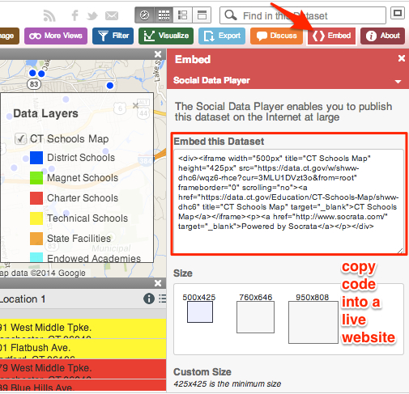

<!--chapter:end:06.05-filtered-point-map-socrata.Rmd-->

Polygon Maps and Storyboards with Social Explorer
-------------------------------------------------

*last updated February 2016*

The Social Explorer free edition
<a href="http://socialexplorer.com" class="uri">http://socialexplorer.com</a>
offers one solution to creating colored polygon maps with US Census
demographic data. Explore the embedded sample map below.

<iframe frameborder="0" scrolling="no" marginheight="0" marginwidth="0" src="https://www.socialexplorer.com/0889800f4d/embed" width="640" height="480" allowfullscreen="true" webkitallowfullscreen="true" mozallowfullscreen="true">
</iframe>

#### Advantages

-   Quick and easy-to-learn
-   Free edition includes basic census data
-   Export your static maps into presentation slides
-   Share link or embed iframe to your interactive map

#### Limitations

-   Maps are limited to the demographic data inside the tool.
-   Polygon map boundaries are limited to state, county, census tract.
    The tool does not display municipal data for cities, towns, etc.
-   Full census and historical data requires professional subscription.
-   Pro subscription available through several academic libraries, but
    few public libraries.

#### Quick overview of features

Start at the Social Explorer website
<a href="http://socialexplorer.com" class="uri">http://socialexplorer.com</a>
and click on Maps. This tutorial demonstrates features available on the
free edition.

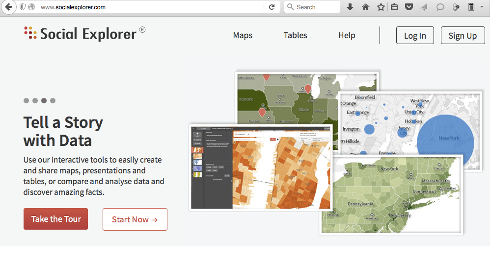

The default map view shows US population density, based on the American
Community Survey (ACS) 5-year estimates. Click the Change Data button to
explore other options.

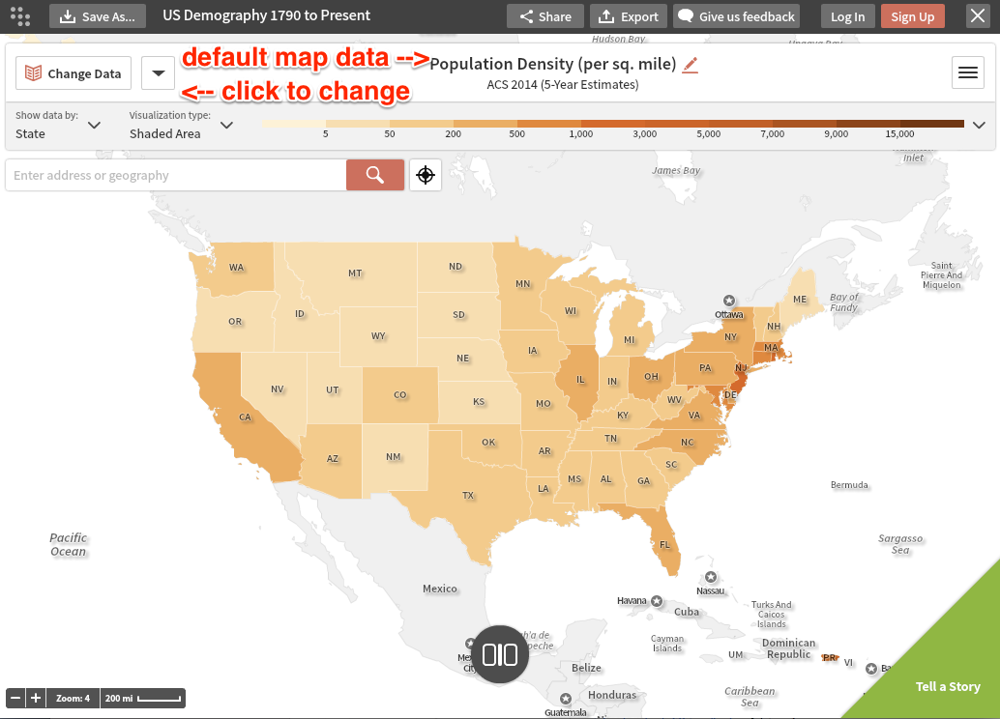

Geographic boundaries automatically change with the zoom level. As you
zoom in, the data levels automatically shift from state, to county, to
census tract.

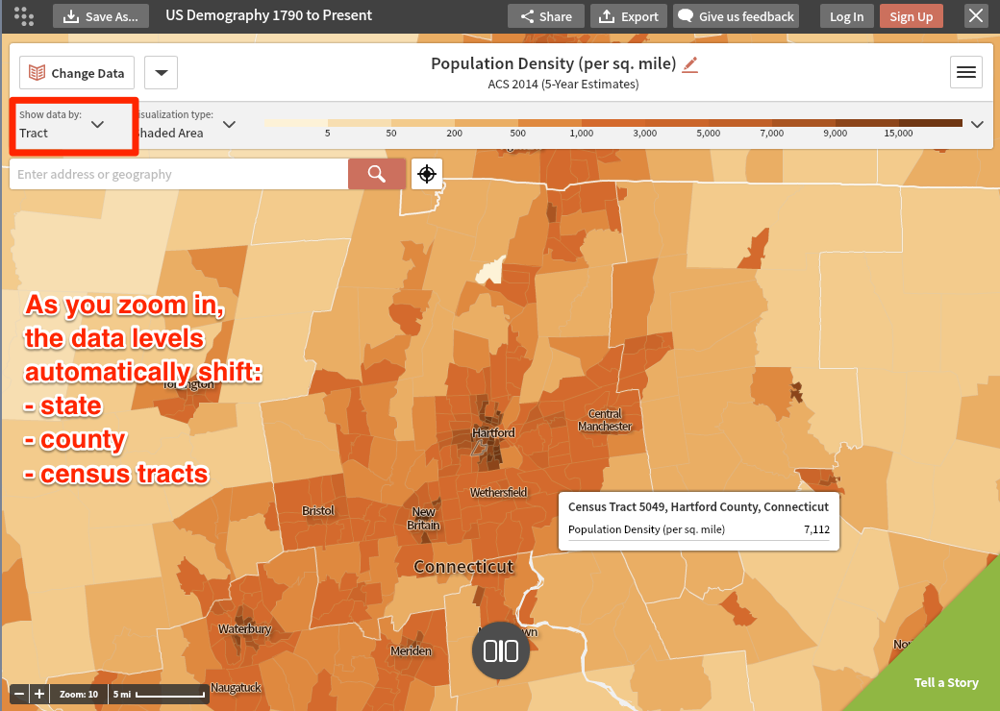

Click the Share button to copy the link to your map, or the iframe code
to embed it inside your own website.

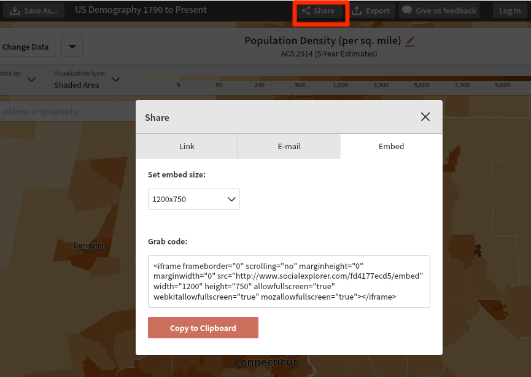

Create a free account to save your online map views. Click the Tell a
Story button, add a series of interactive map views, and show change
over time.

All of the steps above can be done with the free version, but data is
limited. Check if an academic library near you has a professional
subscription.

<!--chapter:end:06.06-social-explorer-maps.Rmd-->

Polygon Map with Tableau Public
-------------------------------

*by [Jack Dougherty](authors) last updated Monday January 27, 2020*

Tableau Public is freely-available software that contains powerful tools
to quickly create interactive polygon maps for common boundaries (such
as US States, or World Nations.) If you need to create customized maps
for less-common boundaries, see our chapter on [Leaflet Maps with Google
Sheets](leaflet-maps-with-google-sheets) in this volume.

Important: Tableau Public is designed to publicly display your data,
which makes this free tool very appropriate for educators, journalists,
non-profit organizations, or other users who wish to openly share their
map. If you desire a private tool to restrict your data, Tableau offers
other tools that require payment.

See also the Tableau Public support page
<a href="https://www.tableau.com/support/public" class="uri">https://www.tableau.com/support/public</a>
for additional resources, including video tutorials.

1.  Download and install the free Tableau Public tool, available for Mac
    or Windows, at
    <a href="https://public.tableau.com/en-us/s/download" class="uri">https://public.tableau.com/en-us/s/download</a>.
    Do not confuse with other Tableau products that require payment.
    Installation may require up to 5-10 minutes.

2.  Click this link and Save to download to your computer:
    [us-sample-data in CSV format](data/us-sample-data.csv). CSV means
    comma-separated values, a generic spreadsheet format that most tools
    can easily open. For help with downloading, see this [short video
    tutorial](https://www.youtube.com/watch?v=-04PQldP9HQ).

3.  Open the us-sample-data.csv file with any spreadsheet tool to view
    its contents.

4.  Launch Tableau Public. In the Connect column of the first screen,
    click “Text file” to connect to the CSV file you downloaded above.
    (If you had an Excel file in .xlsx format, you would click that
    instead.) Navigate to select the us-sample.data.csv file on your
    computer.

5.  At first, Tableau Public does **NOT** recognize the names of US
    areas, which initially appear simply as “text” values (with the
    “Abc” symbol). Click and hold down the mouse directly on the “Abc”
    symbol, and use the drop-down menu to convert to Geographic
    role &gt; State/Province. A tiny globe symbol will appear to show
    that Tableau Public now recognizes this column as geographic data,
    which is essential in order to make a map.

1.  Go to the Worksheet view, by clicking on “Sheet 1” in the
    bottom-left corner. The goal is to build a polygon map, based on the
    dimensions and variables provided by Tableau Public.

Step A - Drag the “Area” dimension to the middle of the worksheet to
create the geographic areas

Step B - In the “Marks” panel, change the drop-down menu from
“Automatic” to “Map”

Step C - Drag the “Type” dimension into the “Color” box of the Marks
panel to show polygon colors according to type

Optional: Add more items, such as “Abbreviation” dimension to “Label”
box to display state abbreviations, or “Area” dimension to “tooltips” to
display on mouseover.

1.  To display your map online, click “Dashboard” tab in the bottom-left
    corner.

2.  Drag “Sheet 1” (the default name of your map) into your dashboard.
    Also, drag the map legend from the corner into the lower body of the
    map (or choose other legend options).

3.  To publish your map online, go to File &gt; Save to Tableau Public
    As… This will require you to create a free Tableau Public Account.

4.  Modify your final online product as desired, and see options to
    embed elsewhere on the web.

<!--chapter:end:06.07-tableau-polygon.Rmd-->

Embed On Your Web
=================

*by [Jack Dougherty, Stacy Lam, and David Tatem](authors), last updated
on March 15, 2017*

After you create a chart or map, how do display it inside your website
as an *interactive* visualization? Our goal is not a static picture, but
a live chart or map that users can explore. This is an important
question for beginners, since data visualizations are not valuable
unless you can control where and how your work appears. This chapter
walks you through the key steps.

First, you need to own a website that supports iframe codes (which we’ll
explain below). If you do not have a website that supports this, then
follow this quick tutorial to [Create a simple web page with GitHub
Pages](github-pages). Even if you already have a website, still do this
tutorial, because it introduces a tool used many times in this book.

Second, you need to copy or create an iframe code from your chart or
map. An iframe is one line of HTML code with instructions on how to
display a web page from a specific address (called a URL). A simple
iframe looks like this:

    <iframe src="https://handsondataviz.org/embed/index.html"></iframe>

No coding skills are necessary. See these easy-to-follow examples:

\-[Copy iframe from a Google Sheets chart](iframe-google-sheets/)
-[Convert a link into an iframe](link-to-iframe)

Finally, you need to paste (or embed) the iframe code inside your
website. Like a picture frame, an iframe allows you to display one web
page (your data visualization) inside another web page (your personal
website). But unlike a picture frame, where the image is static, an
iframe makes content interactive, so visitors can explore the chart or
map on your site, even though it may actually be hosted on an entirely
different website. Go to this third tutorial, which combines the two
steps above, called [Embed Iframe in GitHub Pages](iframe-github).

See more tutorials in this chapter to copy iframes from other
visualization tools (such as [Tableau Public](iframe-tableau) and embed
them in other common websites (such as [WordPress](iframe-wordpress),
etc.) \*\* TO DO: add more tutorials and links \*\*

Enroll in our free online course **link to do**, which introduces these
topics in the brief video below, and offers more exercises and
opportunities to interact with instructors and other learners.

<iframe width="560" height="315" src="https://www.youtube.com/embed/RP1Zg_kbVGQ?rel=0" frameborder="0" allow="autoplay; encrypted-media" allowfullscreen>
</iframe>
<!--chapter:end:07-embed.Rmd-->

Create a Simple Web Page with GitHub Pages
------------------------------------------

*last updated March 15, 2017*

Question: After you create an interactive chart or map, how do you embed
the live version in a website that you control?

The full answer requires three steps:

-   1.  Create a web page that supports iframe codes

-   1.  Copy or create an iframe code from your visualization

-   1.  Embed (or paste) the iframe code into your web page

This tutorial focuses on the **first step**. If you don’t already have
your own website, or if you are not sure whether your site supports
iframe codes, then follow the steps below. We will create a simple web
page with a free and friendly tool called GitHub
<a href="http://github.com" class="uri">http://github.com</a>, and host
it on the public web with the built-in GitHub Pages feature. For **steps
2 and 3**, see the [Copy iframe from Google
Sheets](iframe-google-sheets) tutorial and the [Embed iframe in GitHub
Pages](iframe-github/) tutorial in this chapter.

#### Tool Review

GitHub <a href="http://github.com" class="uri">http://github.com</a> is
a versatile tool that can be used to create simple web pages.

-   Pros:
    -   Free and easy-to-learn tool to edit and host simple pages on the
        public web.
    -   All steps below can be completed in your web browser.
-   Cons:
    -   All work on GitHub is public by default. Private repositories
        (folders) require payment.
    -   New users sometimes confuse the links for code repositories
        versus published web pages.

#### Video with step-by-step tutorial

<iframe width="560" height="315" src="https://www.youtube.com/embed/AFdogZFyN0c?rel=0" frameborder="0" allow="autoplay; encrypted-media" allowfullscreen>
</iframe>

1.  Sign up for free GitHub account, then sign in, at
    <a href="http://github.com" class="uri">http://github.com</a>.

2.  Create a new repository (also called a “project” or similar to a
    “folder”).

3.  Name your repository (or “repo”), and select Initialize with a
    README file. Optional steps: add a description and select a license.

4.  Scroll down and click the green button to Create your repo, which
    will appear in a new browser tab, with this URL format:

<!-- -->

    https://github.com/YOUR-USERNAME/YOUR-REPO-NAME

1.  In your GitHub repo, click on Settings, scroll down to GitHub Pages,
    select Master branch as your source, then Save. This publishes the
    code from your repo to the public web.

Hint: Do NOT select Theme Chooser for this exercise. It will create
additional files that will interfere with displaying an iframe in your
README.md file.

1.  When the Settings page refreshes, scroll back down to GitHub Pages
    to see the new link to your published website, which will appear in
    this format:

<!-- -->

    https://YOUR-USERNAME.github.io/YOUR-REPO-NAME

1.  Right-click and Copy the link to your published web site.

2.  At the top of the page, click on the repo name to return to the main
    level.

3.  Click the README.md file to open it in your browser, and click the
    pencil symbol to edit it.

4.  Inside your README.md file, paste the link to your published web
    site, and type any text you wish to appear. The .md extension refers
    to Markdown, an easy-to-read computer language that GitHub Pages can
    process.

5.  Scroll down and click the green Commit button to save your edits.

6.  When your GitHub repo page refreshes, click on the new link to go to
    your published web site. **BE PATIENT!** Your new site may not
    appear instantly. Refresh the browser every 10 seconds. You may need
    to wait up to 1 minute for a new site to appear the first time, but
    later changes will be much faster.

Remember that GitHub Pages is designed to create simple web pages and
sites. See other web publishing tools mentioned in this chapter to
create more sophisticated web sites.

<!--chapter:end:07.01-github-pages.Rmd-->

Copy an iframe code from a Google Sheets interactive chart
----------------------------------------------------------

*last updated March 6, 2017*

Question: After you create an interactive chart or map, how do you embed
the live version in a website that you control?

The full answer requires three steps:

-   1.  Create a web page that supports iframe codes

-   1.  Copy the iframe code from your visualization

-   1.  Embed (or paste) the iframe code into your web page

This tutorial focuses on the **second step**, and shows how to publish a
Google Sheets interactive chart, and copy its iframe code. Details may
differ for other visualization tools, but the general iframe concept
will be similar to most cases. For **steps 1 and 3**, see the [Create a
Simple Web Page with GitHub Pages](github-pages) tutorial and the [Embed
iframe in GitHub Pages](iframe-github/) tutorial in this chapter.

#### Tutorial

1.  Create a Google Sheets chart, which requires a free Google Drive
    account. Learn more in the [Google Sheets Charts
    tutorial](charts-google-sheets) in this book.

2.  Click the drop-down menu in the upper-right corner of the
    interactive chart and select Publish chart. Click OK on next screen.

1.  Select the Embed tab, select the Interactive version, and click the
    blue Publish button. If you make changes to the chart, they will
    continue to be published to the web automatically, unless you click
    the Stop button or checkbox at the bottom.

1.  Copy the iframe embed code.

No coding skills are necessary, but it helps to be code-curious. This
iframe is a line of HTML code that contains these instructions:

-   iframe tags to mark the beginning and end
-   width and height: to display your chart in a second site, in pixels
-   seamless frameborder: “0” means no border will appear around the
    chart in the second site
-   scrolling: “no” means the chart will not include its own web
    scrolling feature
-   src: the web address (or URL) of the visualization to be displayed
    in the second site

See the next tutorial in this chapter, [Embed iframe in GitHub
Pages](iframe-github), to learn how to paste the iframe into a simple
web page. Or see related tutorials in this chapter to embed an iframe in
other common web sites.

<!--chapter:end:07.02-iframe-google-sheets.Rmd-->

Convert a Weblink into an Iframe
--------------------------------

*last updated March 15, 2017*

After you publish your data visualization to the web, how do you convert
its weblink (or URL) into an iframe, to embed in your personal website?

The answer depends: did you publish your visualization as a code
template on GitHub Pages? Or did you publish it using a drop-and-drag
tool such as Google Sheets or Tableau Public?

#### Published with a code template on GitHub Pages

If you published your visualization from a code template (such as
Leaflet or Chart.js) with GitHub Pages, follow these easy steps:

1.  Copy the URL of your published visualization on GitHub, which will
    be in this format:

<!-- -->

    https://USERNAME.github.io/REPOSITORY

1.  Add `iframe` tags to the beginning and end, insert `src=` and
    enclose the URL inside quotation marks, like this:

<!-- -->

    <iframe src="https://USERNAME.github.io/RESPOSITORY"></iframe>

1.  Optional: Insert preferred width and height (in pixels by default,
    or percentages), like this:

<!-- -->

    <iframe src="https://USERNAME.github.io/RESPOSITORY" width="90%" height="400"></iframe>

1.  Go to the appropriate tutorial to embed your iframe in your personal
    website:

-   [Embed an iframe in GitHub Pages](iframe-github)
-   [Embed an iframe in WordPress.org](iframe-wordpress)

#### Published with Google Sheets or Tableau Public

Or, if you published your visualization using a drop-and-drag tool, see
these tutorials:

-   [Copy an iframe code from a Google Sheets interactive
    chart](iframe-google-sheets)
-   [Embed Tableau Public on your Website](iframe-tableau)

<!--chapter:end:07.03-link-to-iframe.Rmd-->

Embed an Iframe in GitHub Pages
-------------------------------

*last updated March 6, 2017*

Question: After you create an interactive chart or map, how do you embed
the live version in a website that you control?

Here’s the full three-step answer that combines lessons from the [Embed
on the Web chapter introduction](embed) and the two previous tutorials:

1.  First, create a web page that supports iframe embed codes. If you
    don’t know what that means or don’t yet have a personal website, go
    back to the previous tutorial, [Create a Simple Web Page with GitHub
    Pages](github-pages), or see the video and step-by-step instructions
    below.

2.  Second, copy or create an iframe code from your data visualization.
    Go back to the previous tutorial, [Copy an iframe code from a Google
    Sheets interactive chart](iframe-google-sheets), or see the video
    and step-by-step instructions below.

3.  Third, embed (or paste) the iframe code into your website. The video
    and instructions below show how to paste an iframe from a Google
    Sheets interactive chart into a simple web page with GitHub Pages.

#### Try it

The goal is to embed the iframe code from a Google Sheets interactive
chart, which resides on a Google web server, into your GitHub Pages web
site. The result will be similar to the one below:

<iframe width="644" height="398" seamless frameborder="0" scrolling="no" src="https://docs.google.com/spreadsheets/d/1YgBWYm9nTGlCuyqSwU3SDb7xk-SMSPgjfYq5iLqL0nQ/pubchart?oid=200651442&amp;format=interactive">
</iframe>

#### Video tutorial and step-by-step instructions

<iframe width="560" height="315" src="https://www.youtube.com/embed/enjhlnqaXOE?rel=0" frameborder="0" allow="autoplay; encrypted-media" allowfullscreen>
</iframe>

1.  Sign up for free GitHub account, then sign in, at
    <a href="https://github.com" class="uri">https://github.com</a>.

2.  Create a **new repository** (think of it as a folder that contains
    your project).

3.  Name your repository (or “repo”), and select *Initialize this
    repository with a README*. Optional steps: add a description and
    select a license.

4.  Scroll down and click the green button to Create your repo, which
    will appear in a new browser tab, with this URL format:

<!-- -->

    https://github.com/YOUR-USERNAME/YOUR-REPO-NAME

1.  In your GitHub repo, click on Settings tab, scroll down to *GitHub
    Pages*, select **master branch** as your Source, then Save. This
    publishes the code from your repo to the public web.

2.  When the Settings page refreshes, scroll back down to GitHub Pages
    to see the new link to your published website, which will appear in
    this format:

<!-- -->

    https://YOUR-USERNAME.github.io/YOUR-REPO-NAME

1.  Right-click and Copy this link to your published web site.

2.  At the top of the page, click on the repo name to return to the main
    level.

3.  Click the README.md file to open it in your browser, and click the
    pencil symbol in the upper right corner to edit it.

4.  Inside your README.md file, paste the link to your published web
    site, and type any text you wish to appear. The .md extension refers
    to Markdown, an easy-to-read markup language that GitHub Pages can
    process and display as HTML.

5.  Go to a data visualization you have created, such as a Google Sheets
    chart, select Publish &gt; Embed, and copy the iframe code. This
    line of HTML code displays the interactive visualization website
    inside your personal website.

6.  Scroll down and click Commit to save your edits.

7.  When your GitHub repo page refreshes, click on the new link to go to
    your published web site. **BE PATIENT!** Your new site may not
    appear instantly. Refresh the browser every 10 seconds. You may need
    to wait for a few minutes for a new site to appear the first time,
    but later changes will be much faster.

Important:

-   A published README.md file will display an HTML iframe code, unless
    you add other HTML files (such as index.html) to your repository.

Remember that GitHub Pages is designed to create simple web pages and
sites. See other web publishing tools mentioned in this chapter to
create more sophisticated web sites.

<!--chapter:end:07.04-iframe-github.Rmd-->

Embed an Iframe on WordPress.org
--------------------------------

*Last updated February 11, 2016*

#### TO DO

-   rewrite this tutorial to merge the two versions (top and bottom)
-   then update all links and check all `code` tags

To embed one web page (the data visualization) inside a second web page
(the organization’s website), we use a simple HTML code known as
**iframe**. (Read more about the
<a href="http://www.w3schools.com/tags/tag_iframe.asp">iframe</a><a href="http://www.w3schools.com/tags/tag_iframe.asp">tag
at W3Schools</a>.)

The **general iframe concept** works across many data visualization
tools and many websites: - Copy the embed code or URL from your dataviz
website - Paste (and modify) the code as an iframe in your destination
website

To embed your dataviz in a self-hosted Wordpress.org site, the \[iframe
plugin\]
(<a href="http://wordpress.org/plugins/iframe/" class="uri">http://wordpress.org/plugins/iframe/</a>)
must be installed and activated. This plugin allows authors to embed
iframe codes inside posts/pages, in a modified “shortcode” format
surrounded by square brackets. Without the plugin, self-hosted
WordPress.org sites will usually “strip out” iframe codes for all users
except the site administrator. **I have already installed and
activated** the iframe plugin on my site, and the Dashboard view looks
like this:

Note that most WordPress.com sites do NOT support an iframe embed code.

But details vary, so read and experiment with the examples that follow.

1.  To embed the iframe in a WordPress.org site, the iframe plugin must
    be installed, as explained in the [Embed with iframe on
    WordPress.org](iframe-wordpress) chapter. **TO DO** fix
    self-reference

2.  Log into your Wordpress.org site and create a new post. In the
    editor window, switch from the Visual to the Text tab, which allows
    users to modify the code behind your post. Paste the iframe code
    from your interactive dataviz.

1.  Initially, the code you pasted includes HTML iframe tags at the
    front `<iframe...` and the end `...></iframe>`, which looks like
    this:

<!-- -->

    <iframe width="600" height="371" seamless frameborder="0" scrolling="no" src="https://docs.google.com/spreadsheets/d/1fwnl5hvkkwz-YDZrogyGnx274BqmozGlIeXyjJ2TKmE/pubchart?oid=462316012&amp;format=interactive"></iframe>

1.  Modify the front end of the iframe code by replacing the less-than
    symbol ( &lt; ) with a square opening bracket ( \[ ). Modify the
    back end by erasing the greater-than symbol ( &gt; ) and the end tag
    ( </iframe> ). Replace the back end with a square closing bracket (
    \] ).

Your modified code should look like this:

    [iframe width="600" height="371" seamless frameborder="0" scrolling="no" src="https://docs.google.com/spreadsheets/d/1fwnl5hvkkwz-YDZrogyGnx274BqmozGlIeXyjJ2TKmE/pubchart?oid=462316012&amp;format=interactive"]

1.  Click Preview or Publish/View Post to see how it appears on the web.

2.  If desired, continue to modify the iframe code to improve the
    display of your dataviz on your website. For example, the initial
    code was 600 pixels wide (width=“600”). To display the dataviz
    across the full width of your website, change this part of the code
    to 100% (width=“100%”).

The goal is to embed an interactive chart inside your website, so that
users can explore the data. This tutorial displays a *very basic chart*
to simplify the process, and the end result will appear like the one
below. Try it.

<iframe width="600" height="371" seamless frameborder="0" scrolling="no" src="https://docs.google.com/spreadsheets/d/1fwnl5hvkkwz-YDZrogyGnx274BqmozGlIeXyjJ2TKmE/pubchart?oid=462316012&amp;format=interactive">
</iframe>
<!--chapter:end:07.05-iframe-wordpress.Rmd-->

Embed Tableau Public on your Website
------------------------------------

*last updated March 10, 2017*

Question: After learning [how to create an interactive data
visualization with Tableau Public](tableau-public) in this book, how do
I embed it on my website?

Answer: Tableau Public supports two embedding methods, and your choice
depends on your type of website.

-   1.  Embed code: if you can paste directly into an HTML web page

-   1.  Convert Link to iframe: to paste into WordPress.org, Wix,
        SquareSpace, Weebly, and many other web platforms

#### Try it

Both methods produce an embedded visualization like the one below. Float
your cursor over points to view data details.

<iframe src="https://public.tableau.com/views/CTSchoolDistrictsbyIncomeandGradeLevels2009-13/Sheet1?:showVizHome=no&amp;:embed=true" width="90%" height="500">
</iframe>

#### A) Embed code method for HTML web pages

1.  Use this method if you can paste HTML and JavaScript code directly
    into a website with HTML pages.

2.  Go to the public web page of any Tableau Public visualization, such
    as this sample:
    <a href="https://public.tableau.com/profile/jackdougherty#!/vizhome/CTSchoolDistrictsbyIncomeandGradeLevels2009-13/Sheet1" class="uri">https://public.tableau.com/profile/jackdougherty#!/vizhome/CTSchoolDistrictsbyIncomeandGradeLevels2009-13/Sheet1</a>

3.  Before you begin the embed process, click the upper-right Edit
    Details button to make any final modifications to the title or
    toolbar settings.

4.  Click the bottom-right Share button, click inside the **Embed Code**
    field, and copy its contents. A typical embed code is a long string
    of HTML and JavaScript instructions to display the visualization.

1.  Open an HTML page on your website and paste the embed code in the
    body section. Below is an example of a sample Tableau Public embed
    code pasted between the body tags of a simple HTML page.

<!-- -->

    <!DOCTYPE html>
    <html>
    <head>
      <title>sample web page</title>
      <meta name="viewport" content="width=device-width, initial-scale=1.0">
      <meta charset="utf-8">
    </head>
    <body>
      
<noscript></noscript><object class='tableauViz'  style='display:none;'><param name='host_url' value='https%3A%2F%2Fpublic.tableau.com%2F' /> <param name='site_root' value='' /><param name='name' value='CTSchoolDistrictsbyIncomeandGradeLevels2009-13&#47;Sheet1' /><param name='tabs' value='no' /><param name='toolbar' value='yes' /><param name='static_image' value='https:&#47;&#47;public.tableau.com&#47;static&#47;images&#47;CT&#47;CTSchoolDistrictsbyIncomeandGradeLevels2009-13&#47;Sheet1&#47;1.png' /> <param name='animate_transition' value='yes' /><param name='display_static_image' value='yes' /><param name='display_spinner' value='yes' /><param name='display_overlay' value='yes' /><param name='display_count' value='yes' /></object>
                
    </body>
    </html>

#### B) Convert Link to iframe method

1.  Use this method if you need to paste an iframe into common web
    authoring platforms (such as WordPress.org, Squarespace, Wix,
    Weebly, etc.), since these platforms typically do not support HTML
    and JavaScript code pasted directly into content.

2.  Go to the public web page of any Tableau Public visualization, such
    as this sample:
    <a href="https://public.tableau.com/profile/jackdougherty#!/vizhome/CTSchoolDistrictsbyIncomeandGradeLevels2009-13/Sheet1" class="uri">https://public.tableau.com/profile/jackdougherty#!/vizhome/CTSchoolDistrictsbyIncomeandGradeLevels2009-13/Sheet1</a>

3.  Before you begin the embed process, click the upper-right Edit
    Details button to make any final modifications to the title or
    toolbar settings.

4.  Click the bottom-right Share button, click inside the **Link** field
    (NOT the Embed Code field), and copy its contents.

1.  A typical link will look similar to this example (scroll to right to
    see all):

<!-- -->

    https://public.tableau.com/views/CTSchoolDistrictsbyIncomeandGradeLevels2009-13/Sheet1?:embed=y&:display_count=yes

1.  We need to edit the link to convert it into an iframe format. First,
    delete any code that appears after the question mark, to make it
    look like this (scroll to right to see all):

<!-- -->

    https://public.tableau.com/views/CTSchoolDistrictsbyIncomeandGradeLevels2009-13/Sheet1?

1.  Add this snippet of code to the end, to replace what you deleted
    above:

<!-- -->

    :showVizHome=no&:embed=true

1.  Now your edited link should look similar to this (scroll to right to
    see all):

<!-- -->

    https://public.tableau.com/views/CTSchoolDistrictsbyIncomeandGradeLevels2009-13/Sheet1?:showVizHome=no&:embed=true

1.  Enclose the link inside an iframe source tag `src=` with quotes, to
    make it look similar to this (scroll to right to see all):

<!-- -->

    src="https://public.tableau.com/views/CTSchoolDistrictsbyIncomeandGradeLevels2009-13/Sheet1?:showVizHome=no&:embed=true"

1.  Add iframe tags for `width` and `height` in percentages or pixels
    (default), to make it look similar to this (scroll to right to see
    all):

<!-- -->

    src="https://public.tableau.com/views/CTSchoolDistrictsbyIncomeandGradeLevels2009-13/Sheet1?:showVizHome=no&:embed=true" width="90%" height="500"

Hint: Insert 90% width, rather than 100, to help readers easily scroll
down your web page

1.  Add iframe tags at the beginning and end, to make it look similar to
    this (scroll to right to see all):

<!-- -->

    <iframe src="https://public.tableau.com/views/CTSchoolDistrictsbyIncomeandGradeLevels2009-13/Sheet1?:showVizHome=no&:embed=true" width="90%" height="500"></iframe>

Exceptions to the last step above. As described in the [Embed iframe on
WordPress](embed.html#iframe-wordpress) chapter in this book, in a
self-hosted WordPress.org site, with the iframe plugin, insert iframe
brackets rather than HTML tags to make a shortcode like this (scroll to
right to see all):

    [iframe src="https://public.tableau.com/views/CTSchoolDistrictsbyIncomeandGradeLevels2009-13/Sheet1?:showVizHome=no&:embed=true" width="90%" height="500"]

#### Learn more

Embedding Tableau Public Views in iframe, Tableau Support page
<a href="http://kb.tableau.com/articles/howto/embedding-tableau-public-views-in-iframes" class="uri">http://kb.tableau.com/articles/howto/embedding-tableau-public-views-in-iframes</a>

<!--chapter:end:07.06-iframe-tableau.Rmd-->

Modify and Host Code with GitHub
================================

*by [Jack Dougherty, Ilya Ilyankou, Stacy Lam, and David
Tatem](authors), last updated March 11, 2017*

In the first half of this book, we explored free web services that offer
easy drag-and-drop tools to create interactive charts and maps, such as
Google Sheets, Google My Maps, Carto, and Tableau Public. But these web
services have limited options for designing and customizing your
visualizations, and also make you dependent on their web servers to host
your work. In this second half of the book, we’ll explore how to copy,
edit, and host code templates, meaning pre-written software instructions
to create visualizations. With templates, no prior coding skills are
necessary. You will learn how to make simple edits to insert your data,
customize its appearance, and display it on the web on a site you
control.

Enroll in our [free online
course](https://www.edx.org/course/data-visualization-for-all), which
introduces these topics in the brief video below, and offers more
exercises and opportunities to interact with instructors and other
learners.

#### Video overview

<iframe width="560" height="315" src="https://www.youtube.com/embed/w6dQ-RIQ5bc?rel=0" frameborder="0" allow="autoplay; encrypted-media" allowfullscreen>
</iframe>

#### Tool Review

GitHub (<a href="http://github.com" class="uri">http://github.com</a>)
is a versatile tool to share, edit, and host simple code templates on
the public web. Requires a free account. Although advanced coders use
more powerful command-line versions of this tool, this introduction
demonstrates all of the basic steps using GitHub in the web browser.

-   Pros:
    -   Free and easy-to-learn tool that beginners can use in the web
        browser.
    -   Popular tool to share, copy, and edit open-source code
        repositories (project folders).
    -   Host simple code (such as HTML/CSS/JavaScript) on the live web
        with GitHub Pages.
    -   Built-in support to quickly display open-data formats: CSV
        tables and GeoJSON geography.
    -   Easy to migrate code repositories to a different web server.
-   Cons:
    -   By default, all work on GitHub is public. Private repositories
        require payment.
    -   New users often confuse web addresses for code repository versus
        published web page.

In this chapter, you will learn how to:

-   [Fork and edit a simple Leaflet map with GitHub](fork-leaflet)
-   [Fork and edit a Highcharts scatter chart with
    GitHub](fork-highcharts)
-   [Create a new repository and upload code with GitHub](create-repo)
-   [Choose an open-source code license](choose-license)
-   [Pull request to merge changes on GitHub](pull-request)
-   [Work more efficiently with Atom editor and GitHub
    Desktop](atom-desktop)
-   [Fix Common Code and GitHub Errors](fix-code)

<!--chapter:end:08-github.Rmd-->

Fork and Edit a Simple Leaflet Map with GitHub
----------------------------------------------

*by [Jack Dougherty](authors), last updated March 25, 2017*

This tutorial introduces the **basic steps** of working with code
templates, using a simple Leaflet map code
(<a href="http://leafletjs.com" class="uri">http://leafletjs.com</a>)
and GitHub in your browser
(<a href="http://github.com" class="uri">http://github.com</a>). You
will learn how to:

-   1.  Fork (copy) Leaflet template to your GitHub account

-   1.  Publish your live map to public web with GitHub Pages

-   1.  Modify your map title and add layer controls

-   1.  Geocode addresses [in a Google
        Sheet](https://docs.google.com/spreadsheets/d/1z_0hKbw8Ff_fdp-XRoRL4YWe6ue0c0EpITveZ2rz1e8/)
        and upload points from data.csv

Code templates help us to move beyond the limits of drag-and-drop web
mapping services (such as Google MyMaps) and to create more customized
visualizations on a web server that you control. Before you begin, learn
the broad concepts in the chapter introduction [Modify and Host Code
Templates with GitHub](github). For more advanced examples, see the
[Leaflet Map Templates](leaflet) chapter in this book. If you have
problems with this tutorial, go to the [Fix Common GitHub and Code
Errors](fix-code) chapter in this book.

#### Try it

You will begin this tutorial with a simple interactive map that includes
one pop-up point:
<iframe src="https://datavizforall.github.io/leaflet-map-simple/" width="90%" height="350"></iframe>

By the end of this tutorial, you will learn how to modify the map, then
geocode and upload more data points:
<iframe src="https://datavizforall.github.io/leaflet-map-simple-instructor-sample/" width="90%" height="350"></iframe>

#### Video with step-by-step tutorial

<iframe width="560" height="315" src="https://www.youtube.com/embed/7iUocaxTYqk?rel=0" frameborder="0" allow="autoplay; encrypted-media" allowfullscreen>
</iframe>

#### A) Fork (copy) Leaflet template to your GitHub account

Before you begin, sign up for a free GitHub account:
<a href="http://github.com" class="uri">http://github.com</a>

1.  Right-click to open this GitHub code template in a new tab:
    <a href="https://github.com/datavizforall/leaflet-map-simple" class="uri">https://github.com/datavizforall/leaflet-map-simple</a>

2.  In the upper-right corner of the code template, sign in to your free
    GitHub account

3.  In the upper-right corner, click Fork to copy the template (also
    called a code repository, or repo) into your GitHub account. The web
    address (URL) of the new copy in your account will follow this
    format:

<!-- -->

    https://github.com/USERNAME/REPOSITORY

Reminder: You can only fork a GitHub repo **one time**. If needed, see
how to make a second copy in the [Create a New Repo in
GitHub](create-repo) chapter in this book.

#### B) Publish your live map to public web with GitHub Pages

1.  In your new copy of the code repo, click on Settings, scroll down to
    the GitHub Pages area, select Master, and Save. This publishes your
    code template to a live map on a public website that you control.

2.  Scroll down to GitHub Pages section again, to select and copy the
    link to your published web site, which will follow this format:

<!-- -->

    https://USERNAME.github.io/REPOSITORY

1.  Scroll up to the top, and click on your repo name to go back to its
    main page.

2.  At the top level of your repo main page, click on README.md, and
    click the pencil icon to edit this file, written in easy-to-read
    Markdown code.

3.  Delete the link to the current live site, and paste in the link to
    your site. Scroll down and Commit to save your edits.

4.  On your repo main page, right-click on the link to your published
    site to open in a new tab. **Be patient** during busy periods,
    because your website may take up to 1 minute to appear the first
    time.

#### C) Modify your map title and add layer controls

1.  Go back to your browser tab for your code repo. Click on the
    index.html file (which contains the map code), and click the pencil
    icon to edit it.

2.  Explore the map code, which contains HTML, CSS, and JavaScript. Look
    for sections that begin with “EDIT” for items that you can easily
    change. Scroll down to Commit your changes.

3.  Go to your live website browser tab and refresh the page to view
    your edits. **Be patient** during busy periods, when some edits may
    take up to 1 minute to appear.

4.  To change your map title in the index.html file, click the pencil
    symbol (to edit) and go to lines 23-25. Replace “EDIT your map
    title” with your new title:

<!-- -->

    <!-- Display the map and title with HTML division tags  -->
    
EDIT your map title

    

1.  To change your initial map zoom level, edit the index.html file and
    go to line 33. The zoom range for this map is from 1 (max zoom out)
    to 18 (max zoom in).

<!-- -->

    // Set up initial map center and zoom level
    var map = L.map('map', {
      center: [41.77, -72.69], // EDIT latitude, longitude to re-center map
      zoom: 12,  // EDIT from 1 to 18 -- decrease to zoom out, increase to zoom in
      scrollWheelZoom: false
    });

1.  To change the default basemap, edit lines 46 and 52 to delete
    “.addTo(map)” from the Carto light layer, then add it to the Stamen
    colored terrain layer. DO NOT erase the semicolons!

Your original code looks like this (scroll to right to see all):

    /* Carto light-gray basemap tiles with labels */
      var light = L.tileLayer('https://cartodb-basemaps-{s}.global.ssl.fastly.net/light_all/{z}/{x}/{y}.png', {
        attribution: '&copy; <a href="http://www.openstreetmap.org/copyright">OpenStreetMap</a>, &copy; <a href="https://carto.com/attribution">CARTO</a>'
      }).addTo(map); // EDIT - insert or remove ".addTo(map)" before last semicolon to display by default
      // controlLayers.addBaseLayer(light, 'Carto Light basemap');
      /* Stamen colored terrain basemap tiles with labels */
      var terrain = L.tileLayer('https://stamen-tiles.a.ssl.fastly.net/terrain/{z}/{x}/{y}.png', {
        attribution: 'Map tiles by <a href="http://stamen.com">Stamen Design</a>, under <a href="http://creativecommons.org/licenses/by/3.0">CC BY 3.0</a>. Data by <a href="http://openstreetmap.org">OpenStreetMap</a>, under <a href="http://www.openstreetmap.org/copyright">ODbL</a>.'
      }); // EDIT - insert or remove ".addTo(map)" before last semicolon to display by default
      // controlLayers.addBaseLayer(terrain, 'Stamen Terrain basemap');

After you edit the code, it should look like this (scroll to right to
see all):

    /* Carto light-gray basemap tiles with labels */
    var light = L.tileLayer('https://cartodb-basemaps-{s}.global.ssl.fastly.net/light_all/{z}/{x}/{y}.png', {
      attribution: '&copy; <a href="http://www.openstreetmap.org/copyright">OpenStreetMap</a>, &copy; <a href="https://carto.com/attribution">CARTO</a>'
    }); // EDIT - insert or remove ".addTo(map)" before last semicolon to display by default
    // controlLayers.addBaseLayer(light, 'Carto Light basemap');
    /* Stamen colored terrain basemap tiles with labels */
    var terrain = L.tileLayer('https://stamen-tiles.a.ssl.fastly.net/terrain/{z}/{x}/{y}.png', {
      attribution: 'Map tiles by <a href="http://stamen.com">Stamen Design</a>, under <a href="http://creativecommons.org/licenses/by/3.0">CC BY 3.0</a>. Data by <a href="http://openstreetmap.org">OpenStreetMap</a>, under <a href="http://www.openstreetmap.org/copyright">ODbL</a>.'
    }).addTo(map); // EDIT - insert or remove ".addTo(map)" before last semicolon to display by default
    // controlLayers.addBaseLayer(terrain, 'Stamen Terrain basemap');

1.  To add a control panel that turns on/off map layers, delete the code
    comment symbols (//) that appear in front of lines 38-41, 47, and 53
    to activate these sections. When you remove code comments in GitHub,
    the color changes from gray text (inactive code) to colored text
    (active code). After you remove the code comments, your file should
    look like this (scroll to right to see all):

<!-- -->

    /* Control panel to display map layers */
     var controlLayers = L.control.layers( null, null, {
      position: "topright",
      collapsed: false
     }).addTo(map);

    /* Carto light-gray basemap tiles with labels */
    var light = L.tileLayer('https://cartodb-basemaps-{s}.global.ssl.fastly.net/light_all/{z}/{x}/{y}.png', {
      attribution: '&copy; <a href="http://www.openstreetmap.org/copyright">OpenStreetMap</a>, &copy; <a href="https://carto.com/attribution">CARTO</a>'
    }); // EDIT - insert or remove ".addTo(map)" before last semicolon to display by default
     controlLayers.addBaseLayer(light, 'Carto Light basemap');
    /* Stamen colored terrain basemap tiles with labels */
    var terrain = L.tileLayer('https://stamen-tiles.a.ssl.fastly.net/terrain/{z}/{x}/{y}.png', {
      attribution: 'Map tiles by <a href="http://stamen.com">Stamen Design</a>, under <a href="http://creativecommons.org/licenses/by/3.0">CC BY 3.0</a>. Data by <a href="http://openstreetmap.org">OpenStreetMap</a>, under <a href="http://www.openstreetmap.org/copyright">ODbL</a>.'
    }).addTo(map); // EDIT - insert or remove ".addTo(map)" before last semicolon to display by default
     controlLayers.addBaseLayer(terrain, 'Stamen Terrain basemap');

1.  To change one point on the map, you could edit the latitude and
    longitude coordinates of the single marker in lines 55-57. To find
    coordinates for any location and to learn more, go to
    <a href="http://www.latlong.net" class="uri">http://www.latlong.net</a>

<!-- -->

    /* Display a blue point marker with pop-up text */
    L.marker([41.77, -72.69]).addTo(map) // EDIT latitude, longitude to re-position marker
    .bindPopup("Insert pop-up text here"); // EDIT pop-up text message

But a better way to display several points is to remove the code comment
symbols (//) in front of lines 60-69 to activate this section of code,
which pulls map points from the data.csv file in your GitHub repository.
After your edits, this section should look like this (scroll right to
see all):

    /* Upload Latitude/Longitude markers from data.csv file, show Title in pop-up, and override initial center and zoom to fit all in map */
     var customLayer = L.geoJson(null, {
      onEachFeature: function(feature, layer) {
        layer.bindPopup(feature.properties.Title);
      }
     });
     var runLayer = omnivore.csv('data.csv', null, customLayer)
     .on('ready', function() {
      map.fitBounds(runLayer.getBounds());
     }).addTo(map);
     controlLayers.addOverlay(customLayer, 'Markers from data.csv');

#### D) Geocode addresses in Google Sheet and upload points from data.csv

1.  A better way to display multiple points on your map is to prepare
    and upload a new data.csv file to your GitHub repository. First,
    right-click to open this Google Sheets template in a new tab:
    [Leaflet Maps Simple data points with
    Geocoder](https://docs.google.com/spreadsheets/d/1z_0hKbw8Ff_fdp-XRoRL4YWe6ue0c0EpITveZ2rz1e8/)

2.  Since this sheet is view-only, you cannot edit it. Instead, sign in
    to your Google account in the upper-right corner.

3.  Go to File &gt; Make a Copy, which will save a duplicate version to
    your Google Drive, which you can edit.

4.  In your copy of the Google Sheet, select any cells and press Delete
    on your keyboard to erase contents. Type new titles and addresses
    into columns A and B.

5.  To geocode your new addresses (which means converting them into
    latitude and longitude coordinates), select all of the contents
    across 6 columns, from Address (B) to Source (G).

6.  Go to the Geocoder menu that appears in this special Google Sheet
    template, and select any service, such as US Census (for US
    addresses) or Google Maps. The first time you run the geocoder, the
    script will ask for permission.

7.  After you have geocoded your addresses, go to File &gt; Download
    As &gt; Comma-separated values (.CSV format) to save the file to
    your computer.

8.  In your computer, right-click the downloaded file to rename it to:
    data.csv

9.  In your GitHub repository, click Upload Files, then drag-and-drop
    your new data.csv file, and Commit to upload it. Go to your live map
    browser tab and refresh to view changes. \*\*Be patient\* during
    busy periods, when some edits may take up to 1 minute to appear.

#### Learn more

-   To solve problems, see [Fix Common GitHub and Code Errors](fix-code)
    chapter in this book.
-   See more [advanced Leaflet Map Templates](leaflet) in this book
-   About Leaflet
    <a href="https://leafletjs.com" class="uri">https://leafletjs.com</a>
-   GitHub Pages features and tutorial,
    <a href="https://pages.github.com" class="uri">https://pages.github.com</a>

<!--chapter:end:08.01-fork-leaflet.Rmd-->

Fork and Edit a Highcharts Scatter Chart with GitHub
----------------------------------------------------

*By [Jack Dougherty](author), last updated March 25, 2017*

This tutorial introduces the **basic steps** of working with code
templates, using a simple Highcharts scatter chart code
(<a href="http://highcharts.com" class="uri">http://highcharts.com</a>)
and GitHub in your browser
(<a href="http://github.com" class="uri">http://github.com</a>). You
will learn how to:

-   1.  Fork (copy) the Highcharts template to your GitHub account

-   1.  Publish your live chart to the public web with GitHub Pages

-   1.  Modify the chart title, subtitle, and axis labels

-   1.  Upload new data points from a comma-separated values (.csv)
        spreadsheet

Code templates help us to move beyond the limits of drag-and-drop web
tools (such as Google Sheets and Tableau Public) and to create more
customized visualizations on a web server that you control. Before you
begin, learn the broad concepts in the chapter introduction [Modify and
Host Code Templates with GitHub](github). For more advanced examples,
see the [Highcharts Templates](highcharts) chapter in this book. If you
have problems with this tutorial, go to the [Fix Common GitHub and Code
Errors](fix-code) chapter in this book.

#### Try it

You will begin this tutorial with a basic chart template that includes
only 7 points. Right-click to open [full-size chart in new
tab](https://datavizforall.github.io/highcharts-scatter-csv/).

<iframe src="https://datavizforall.github.io/highcharts-scatter-csv/" width="90%" height="425">
</iframe>

By the end of this tutorial, you will learn how to modify the chart and
add a new CSV spreadsheet with over 160 points. Right-click to open
[full-size chart in new
tab](https://datavizforall.github.io/highcharts-scatter-csv-instructor-sample).

<iframe src="https://datavizforall.github.io/highcharts-scatter-csv-instructor-sample/" width="90%" height="425">
</iframe>

#### Video with step-by-step tutorial

<iframe width="560" height="315" src="https://www.youtube.com/embed/72pgCZqWg7Q?rel=0" frameborder="0" allow="autoplay; encrypted-media" allowfullscreen>
</iframe>

#### A) Fork (copy) the Highcharts template to your GitHub account

Before you begin, sign up for a free GitHub account:
<a href="http://github.com" class="uri">http://github.com</a>

1.  Right-click to open this GitHub code template in a new tab:
    <a href="https://github.com/datavizforall/highcharts-scatter-csv" class="uri">https://github.com/datavizforall/highcharts-scatter-csv</a>

2.  In the upper-right corner of the code template, sign in to your free
    GitHub account

3.  In the upper-right corner, click Fork to copy the template (also
    called a code repository, or repo) into your GitHub account. The web
    address (URL) of the new copy in your account will follow this
    format:

<!-- -->

    https://github.com/USERNAME/REPOSITORY

Reminder: You can only fork a GitHub repo **one time**. If needed, see
how to make a second copy in the [Create a New Repo in
GitHub](create-repo) chapter in this book.

#### B) Publish your live chart to the web with GitHub Pages

1.  In your new copy of the code repo, click on Settings, scroll down to
    the GitHub Pages area, select Master, and Save. This publishes your
    code template to a live map on a public website that you control.

2.  Scroll down to GitHub Pages section again, to select and copy the
    link to your published web site, which will follow this format:

<!-- -->

    https://USERNAME.github.io/REPOSITORY

1.  Scroll up to the top, and click on your repo name to go back to its
    main page.

2.  At the top level of your repo main page, click on README.md, and
    click the pencil icon to edit this file, written in easy-to-read
    Markdown code.

3.  Delete the existing link to the live site, and paste in the link to
    your site. Scroll down and Commit to save your edits.

4.  On your repo main page, right-click on the link to your published
    site to open in a new tab. **Be patient** during busy periods, when
    your website may take up to 1 minute to appear the first time.

#### C) Modify the chart title, subtitle, and axis labels

1.  Go back to your browser tab for your code repo. Click on the
    index.html file (which contains the chart code), and click the
    pencil icon to edit it.

2.  Explore the chart code, which contains HTML, CSS, and JavaScript.
    Look for code comments that begin with “EDIT” for sections that you
    can easily change, such as title, subtitle, x-axis and y-axis
    labels, and tooltip data labels. Scroll down to Commit your changes.

3.  Go to your live website browser tab and refresh the page to view
    your edits. **Be patient** during busy periods, when some edits may
    take up to 1 minute to appear.

#### D) Upload new data points from a .CSV spreadsheet

1.  Go to your GitHub code repository tab and click to view the file
    named: data-scatter.csv

2.  GitHub automatically opens CSV files. Although it’s possible to edit
    the file inside GitHub, let’s upload a larger data file with the
    same name. Click this link and Save to download to your computer:
    [data-scatter in CSV format](data/data-scatter.csv).

3.  In your GitHub code repo, click Upload Files, and drag the new
    data-scatter.csv into the folder, and Commit changes to replace the
    existing file with the same name.

4.  In your GitHub repo, click the new data-scatter.csv file to inspect
    the changes. Then go to your live website tab and refresh to see the
    updated scatter chart. \*\* Be patient\*\* during busy periods, when
    changes make take up to 1 minute to appear.

#### Learn more

-   To solve problems, see the [Fix Common GitHub and Code
    Errors](fix-code) chapter in this book.
-   See more [Highcharts Templates](highcharts) in this book
-   Highcharts Demos
    <a href="http://highcharts.com/demo" class="uri">http://highcharts.com/demo</a>
    and Highcharts Docs
    <a href="http://www.highcharts.com/docs" class="uri">http://www.highcharts.com/docs</a>
-   GitHub Pages features and tutorial,
    <a href="https://pages.github.com" class="uri">https://pages.github.com</a>

<!--chapter:end:08.02-fork-highcharts.Rmd-->

Create a New Repo and Upload Code with GitHub
---------------------------------------------

*by [Jack Dougherty](author), last updated March 14, 2017*

Question: If I already forked one copy of a GitHub code repository,
GitHub will not allow me to fork it a second time. So how do I make a
second copy of a repo?

Answer: GitHub has a “one-fork” rule for good reasons, but here’s a
simple way for beginners to work around it, using only your web browser
and any computer (such as Mac, Windows, or Chromebook).

-   Create a brand-new repository on GitHub in your browser
-   Download an existing code repository and unzip the folder
-   Upload the contents of that folder to your new repository and Commit
    Changes

#### Video with step-by-step tutorial

<iframe width="560" height="315" src="https://www.youtube.com/embed/Hev2UcoLtfw?rel=0" frameborder="0" allow="autoplay; encrypted-media" allowfullscreen>
</iframe>

1.  Follow these steps if you have already forked a GitHub repository
    and wish to make a second copy of it. For example, imagine that you
    have already forked a copy of the Leaflet Maps with Google Sheets
    repository from
    <a href="https://github.com/datavizforall/leaflet-maps-with-google-sheets" class="uri">https://github.com/datavizforall/leaflet-maps-with-google-sheets</a>
    **TO DO change repo address**

2.  If you try to “fork” it again, GitHub will simply send you back to
    the first forked copy you already made. Clicking the “fork” button a
    second time is useless here.

3.  Instead, go to your GitHub account and Create a New Repository. Give
    it a different name, and click the box to create a README.md file,
    then scroll down to click the Create button.

4.  Go to the original repository where you wish to make a second copy,
    and click the Clone or Download button, and Download a zipped
    (compressed) file to your computer.

5.  In your computer downloads folder, unzip the compressed file,
    typically by double-clicking it.

6.  Go to the top level of your brand-new GitHub repository, and click
    the Upload Files button. Drag-and-drop all of the contents of the
    code repo you downloaded, EXCEPT the README.md file, because you
    have already created a new one. Click the Commit Changes button and
    be patient. During busy periods, a large upload may take 1 minute or
    more for GitHub to process.

7.  When the upload is done, inspect the contents that you copied into
    your brand-new repository. To publish your new repo to the live web,
    go to Settings &gt; GitHub Pages &gt; select Master branch &gt;
    Save. Then copy the link to your published live site and paste into
    your README.md file for future reference. If you need to review
    these last steps, see Part B: Publish section of the [Fork and Edit
    a Leaflet Map](fork-leaflet) chapter in this book.

<!--chapter:end:08.03-create-repo.Rmd-->

Choose an Open-Source Code License
----------------------------------

*By [Jack Dougherty](authors), last updated March 25, 2017*

Whether you create a new code repository on GitHub, or fork a copy of
someone else’s code, you should understand the basic concepts of a
software license. Developers have the option to add a `LICENSE` file to
their GitHub repo, which explains what other people can (or cannot) do
with their code.

On GitHub, free repos are publicly viewable and forkable by other users,
so the platform encourages the use of open-source licenses. One example
that is commonly used for code templates linked to this book is the MIT
License: it allows anyone to copy, modify, and redistribute the code, as
long as they credit the author(s) and do not hold them liable. Learn
more about different types of open-source code licenses at
<a href="http://choosealicense.com" class="uri">http://choosealicense.com</a>

#### Learn more

Licensing a Repository, GitHub Help page,
<a href="https://help.github.com/articles/licensing-a-repository/" class="uri">https://help.github.com/articles/licensing-a-repository/</a>

<!--chapter:end:08.04-choose-license.Rmd-->

Pull Request to Merge Changes on GitHub
---------------------------------------

*By [Jack Dougherty](authors), last updated March 5, 2016*

\*\* TO DO \*\* - REWRITE this out-of-date page to focus solely on pull
requests, branches, and merge changes

Sign up for a [free GitHub account](http://github.com), a free
multi-purpose tool that allows you to:

-   View and fork a copy of open-source code from other users
-   Make simple edits to your code directly in the browser
-   Share your code and receive or suggest revisions to others
-   Host a live version of your web code with GitHub Pages

GitHub is free if you publicly share your work. Private accounts require
a subscription.

This chapter shows the basic steps to use GitHub **entirely in your
browser**, which works well for new users on nearly any computer (Mac,
Windows, Chromebook, etc.) Intermediate users will want to read the next
chapter with supplemental tools: GitHub Desktop and Atom editor.
Advanced users may prefer to use GitHub command-line instructions, which
are beyond the scope of this book.

**TO DO:** REWRITE directions below to point users to GitHub Desktop and
Atom Editor for editing on personal computer

Newcomers can host their code on GitHub, and publish to the web using
the GitHub Pages feature, by following step-by-step instructions or this
[YouTube video screencast](http://youtu.be/ZVejLE8qtOI).

<iframe width="560" height="315" src="https://www.youtube.com/embed/ZVejLE8qtOI?rel=0" frameborder="0" allow="autoplay; encrypted-media" allowfullscreen>
</iframe>

This basic tutorial demonstrates how to work with GitHub entirely
through the browser. More advanced GitHub users may download other free
tools (such as [GitHub for Mac](https://mac.github.com) or [GitHub for
Windows](https://windows.github.com)) or use other methods (such as the
terminal command line) to work more efficiently.

1.  Inside your free GitHub account, create a new repository (also known
    as a repo) to host your project’s code (such as an index.html file
    and more).

1.  Enter a repository name and description and check the box to
    automatically add a README file. If desired, select an open-source
    license (such as MIT), and click the Create Repository button.

1.  Your new repository automatically starts opens the “master” branch.
    Use the drop-down menu to create a new branch, and name it
    “gh-pages” (which is short for GitHub Pages), and press enter or
    return on your keyboard.

In this tutorial, we do all of our editing and testing work in the
gh-pages branch, which automatically appears on the public web. When
we’re done, we will pull a copy (or sync) our completed work to the
master branch for safekeeping and open sharing.

1.  To add ONE NEW FILE to the gh-pages branch, click the + button next
    to the repository name and enter the file name. For example,
    index.html is the default file name for most web projects.

1.  Select the “soft wrap” option (which makes long code strings more
    readable), and paste code into the editor. In this example, I pasted
    HTML code that was generated by publishing an interactive chart from
    a Google Spreadsheet.

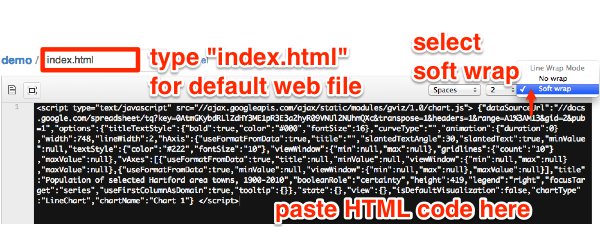

1.  At the bottom, select the “commit” button (which means you are
    making a code change). Optionally, name and describe your commit, if
    you wish to track changes to your work.

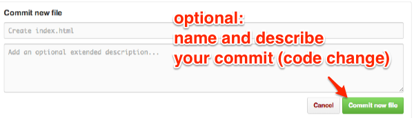

1.  Edit an existing file in the gh-pages branch by selecting its title.
    For example, select the README filename (which should have been
    automatically generated when you created the repository and the
    gh-pages branch). On the next screen, select the Edit button.

1.  When editing the README file, type a link to the live web version of
    this repository, so that visitors may easily click to view it. The
    GitHub generic public web address is a combination of your username
    and “.github.io/” and your repository name, like this:
    `http://USERNAME.github.io/REPOSITORYNAME`

In my README file, I typically write it this way so that visitors know
to click the link: View live demonstration site at *TO DO: insert link *

Commit your change to the README file in the gh-pages branch by pressing
the green button at the bottom of the editor page.

Hint: If you named your file “index.html” then you don’t need to add
anything else to the web address, because the site will automatically
point to this default file. But if you entered a different file name,
such as “sample.html”, then you need to add it to the web address in
this way: `http://Username.github.io/Repositoryname/sample.html`

1.  Select the repository name to go to the upper-most file in the
    gh-pages branch.

2.  To view your live index.html code on the public web, click the link
    you created in your README file. (Hint: use the right-click feature
    to open in a new tab/window). Important: The very first time you
    create a gh-pages branch, it may take up to 10 minutes for its
    content to appear on the open web. Afterwards, when you add or edit
    files in this branch, they should appear nearly instantly on the
    web, though you may need to refresh your browser to view any changes
    you have made.

1.  To add MULTIPLE FILES to the gh-pages branch, you could copy and
    paste each one individually as shown above, or choose one of these
    labor-saving options:

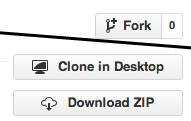

If a code template already exists somewhere on GitHub, “fork” a copy of
the repository to your own account, create a gh-pages branch for the
live web, and edit/modify the files as desired.

To sync and upload multiple files from your desktop to a GitHub
repository, use the free GitHub for Mac or GitHub for Windows tool,
which features a graphical user interface to do tasks above very easily.
Advanced coders may use command-line instructions to upload and sync
files to GitHub most efficiently.

1.  To BACKUP and SHARE your work: After adding or editing files in the
    gh-pages branch, create a “pull request” (to merge files) to the
    master branch.

1.  Use the drop-down menus to CAREFULLY select the direction of the
    merge in this TO-FROM format: TO master branch FROM gh-pages branch

1.  Follow these steps to finish the pull request, which merges all
    content TO the master branch FROM gh-pages branch:

-   Create the pull request (select green button)
-   Give it a title (such as “updated index and ReadMe”)
-   Send pull request (green button)
-   Merge pull request (another green button)
-   Confirm merge (and another green button!)
-   Always double-check your repository branch names to do editing and
    live web testing in the gh-pages branch, then make sync a copy to
    public share in the master branch.

To embed an interactive data visualization from a GitHub Pages host site
into a secondary website (such as an organization’s WordPress.org site),
see the [Embed iframe with WordPress tutorial in this
book](iframe-wordpress).

See my sample repositories, with links to live demo sites, at
<a href="https://github.com/datavizforall?tab=repositories" class="uri">https://github.com/datavizforall?tab=repositories</a>.
Learn more about GitHub general features to share and collaborate on
other users’ public code repositories.

**TO DO** Reminder: GitHub allows users to create **one fork** of a repo
to your account. To create a second copy, go to the repo of your first
copy, click Settings, and rename it. But if you rename your repo, you
also will need to change any links you created to its live version in
the next section.

<!--chapter:end:08.05-pull-request.Rmd-->

Work more efficiently with Atom editor and GitHub Desktop
---------------------------------------------------------

-   TO DO: revise this outdated page \*

While you can do **nearly** everything in this book with GitHub in your
browser, several steps will be faster and more efficient with two
related free tools:

-   download Atom Editor from GitHub
    (<a href="https://atom.io" class="uri">https://atom.io</a>)

-   download GitHub Desktop for Mac or Windows
    (<a href="https://desktop.github.com" class="uri">https://desktop.github.com</a>)

**OLD INSTRUCTIONS**

Download the free GitHub Desktop tool to sync and additional GitHub
repos on your local Mac or Windows computer. GitHub allows users to
create one fork of the basic Searchable Map template repository. To
create a second template, or to move and edit multiple files for more
advanced versions, download the GitHub for Mac/Windows tool. 1. Download
the free tool: [GitHub for Mac](https://mac.github.com/) or [GitHub for
Windows](https://windows.github.com/) 1. In the Searchable Map Template
in GitHub, click **Clone** and save to your hard drive 1. In your GitHub
browser, create a new repository for your second template, and select
options to create a README.MD and license (recommended: MIT). 1. Clone
your second template repository to your hard drive 1. In your hard
drive, copy and paste the files from the cloned Searchable Map Template
to your cloned second template. Replace the existing README.MD and
license files. 1. In your GitHub for Mac/Windows tool, **Commit and
Sync** your second template to your GitHub online account. Title the
commit before clicking the button. 1. Refresh your browser to view the
synced files in your GitHub account. Start at the top of these
directions to remove an old gh-pages branch, create a new gh-pages
branch, and edit files.

<!--chapter:end:08.06-atom-desktop.Rmd-->

Fix Common GitHub and Code Errors
---------------------------------

*By [Jack Dougherty](authors), last updated March 25, 2017*

What happens if you cannot view your published GitHub repository, or if
your code breaks and no longer displays what it was designed to show?
These are common problems, especially for newer students, because
accidentally clicking the wrong box or mistakenly erasing a single
character (such as a semicolon) can make your visualization seem to
vanish, even though your work is usually still there. Breaking your
code—and figuring out how to fix it—is a great way to learn, even if it
requires trial and error.

#### Safely Delete your GitHub Repo and Start Over

If you need to delete your GitHub repo and start over, here’s a simple
way to safely save your work: - Go to the top-level of your GitHub
repository, similar to `https://github.com/USERNAME/REPOSITORY` - Click
the green “Clone or Download” button, and select Download Zip to receive
a compressed folder of your repo contents on your computer. - In your
GitHub repo, click on Settings (upper-right area) and scroll down to
Delete This Repository. - To prevent accidental deletions, GitHub
requires you to type in the REPOSITORY name. - Now you can start over in
one of these ways: - If you wish to [Create a Simple Web Page with
GitHub Pages](github-pages), follow that tutorial again. - OR - Fork
another copy of the original GitHub repository to your account. After
you create your copy, if you wish to add selected files that you
previously downloaded to your computer, follow directions to [Upload
Code with GitHub](create-repo) in the second half of this tutorial in
this book

#### Problems with Creating a Simple Web Page with GitHub Pages

If you followed the [Create a Simple Web Page with GitHub Pages
tutorial](github-pages), it should have created two web links (or URLs):
- your code repository, in this format:
`https://github.com/USERNAME/REPOSITORY` - your published web page, in
this format: `https://USERNAME.github.io/REPOSITORY`

Be sure to insert your GitHub username, and your GitHub repository name,
in the general formats above.

These URLs are NOT case-sensitive, which means that
`https://github.com/USERNAME` and `https://gitub.com/username` point to
the same location.

##### My simple GitHub web page does not appear

-   Make sure that you are pointing to the correct URL for your
    published web page, in the format shown above.
-   Be patient. During busy periods on GitHub, it may take up to 1
    minute for new content to appear in your browser.
-   Do a “hard refresh” to [bypass any saved content in your browser
    cache](https://en.wikipedia.org/wiki/Wikipedia:Bypass_your_cache).
    -   Ctrl + F5 (most Windows-Linux browsers)
    -   Command + Shift + R (Chrome or Firefox for Mac)
    -   Shift + Reload button toolbar (Safari for Mac)
-   Test the link to your published web page in a different browser. If
    you normally use Chrome, try Firefox.
-   On rare occasions, the GitHub service or GitHub Pages feature may be
    down. Check
    <a href="https://status.github.com" class="uri">https://status.github.com</a>.

##### My simple GitHub web page does not display my iframe

-   If you followed the [Create a Simple Web Page with GitHub Pages
    tutorial](github-pages) and inserted an iframe in the README.md
    file, it will appear in your published web page, under these
    conditions:
    -   Ideally, your README.md should be the ONLY file in this GitHub
        repository
    -   Any other files in your repo (such as index.html, default.html,
        or index.md) will block the iframe HTML code in your README.md
        from being published on the web. If you accidentally selected a
        GitHub Pages Theme, you need to delete any extra files it
        created: click each file, select trash can to delete it, and
        commit changes.

#### Problems with iframes

##### My iframe does not appear in my web page

-   Go back to the [Embed tutorials in this book](embed) to double-check
    the directions
-   Items listed in your iframe (such as the URL, width, or height)
    should be enclosed inside straight quotation marks (single or
    double)
    -   BROKEN iframe (missing quotation marks for width and height)

    <!-- -->

        <iframe src="https://datavizforall.github.io/leaflet-map-simple" width=90% height=350></iframe>

    -   FIXED iframe (with correct quotation marks)

    <!-- -->

        <iframe src="https://datavizforall.github.io/leaflet-map-simple" width="90%" height="350"></iframe>
-   Use only `https` (the extra ‘s’ means ‘secure’), not `http`. Some
    web browsers will block content if it mixes http and https
    resources, and some code templates in this book require https.

-   Use only straight quotes, not curly quotes. Avoid pasting text from
    a word-processor into GitHub, which can accidentally carry over
    curly quotes. Typing directly into the GitHub editor will create
    straight quotes.

#### Problems with Leaflet Maps with Google Sheets template

##### My map does not appear

1.  Confirm that you have completed all of the key steps in the [Leaflet
    Maps with Google Sheets](leaflet-with-google-sheets) tutorial in
    this book, especially these:

-   Sign in to Google and File &gt; Make a Copy of the Google Sheet to
    your Google Drive.
-   File &gt; Publish your Google Sheet (Jack often forgets this key
    step!)
-   Copy your Google Sheet web address from top of your browser (usually
    ends with `...XYZ/edit#gid=0`) and paste into your
    `google-doc-url.js` file in your GitHub repo. Do NOT copy the
    *Published* web address (which usually ends with `...XYZ/pubhtml`)
-   When you paste your Google Sheet web address into
    `google-doc-url.js`, be careful not to erase single-quote marks or
    semicolon
-   Go to your live map link, which should follow this format:
    `https://USERNAME.github.io/REPOSITORY`, refresh the browser, and
    wait at least 30 seconds.

1.  Check your Google Sheet for errors:

-   Do NOT rename column headers (in row 1) of any sheet, because the
    Leaflet Map code looks for these exact words.

-   Do NOT rename row labels (in column A) of any sheet, due to the same
    reason above.

-   In your Points tab, DO NOT leave any blank rows

1.  Confirm on GitHub Status
    (<a href="https://status.github.com/" class="uri">https://status.github.com/</a>)
    that all systems are operational.

2.  If you cannot find the problem, go to the top of this page to Safely
    Delete Your GitHub Repo and Start Over. Also, make a new copy of the
    Google Sheet template, give it a new name, and copy data from your
    old sheet using File &gt; Paste Special &gt; Values Only.

#### Problems with Chart.js code templates

##### Chart displays old data

If you upload new data to your Chart.js code template on GitHub Pages,
and it does not appear in your browser after refreshing and waiting up
to one minute, then GitHub Pages is probably not the cause of the
problem. Instead, some browsers continue to show “old” Chart.js in the
web cache. The simplest solution is to File &gt; Quit your browser and
re-open the link to your Chart.js

#### Problems with Mac Computers

##### No file extensions

Several tools in this book will not work properly if your Mac Finder
does not display file extensions. In other words, every file should
include a period followed by several letters (such as data.csv and
map.geojson). If you do not see these extensions at the end of each file
name, then go to Finder &gt; Preferences &gt; Advanced and check the box
to turn them on, as show below:

#### Solve Problems with Browser Developer Tools

Peek inside any website and view the web code under the hood with the
browser developer tools.

In Chrome for Mac, go to View &gt; Developer &gt; Developer Tools

In Firefox for Mac, go to Tools &gt; Web Developer &gt; Inspector

<!--chapter:end:08.07-fix-code.Rmd-->

Transform Your Map Data
=======================

*by [Jack Dougherty with Stacy Lam and David Tatem](authors), last
updated March 30, 2017*

Interactive web maps are made up of different layers, such as background
basemaps, colored or shaded polygons, and/or colored point markers. This
chapter describes how to transform your data into layers that you can
upload into online map tools and templates. Specifically, you will learn
how to:

-   [Geocode locations into coordinates with US Census or
    Google](geocode)
-   [Pivot address-level point data into polygon
    data](pivot-point-to-polygon)
-   [Normalize data to create more meaningful polygon maps](normalize)
-   [Convert map data](convert-geojson) with [GeoJSON.io](geojsonio) or
    [Mapshaper.org](mapshaper)
-   [Join spreadsheets and polygon boundaries with
    MapShaper.org](mapshaper)

Enroll in our free online course **TO DO add link**, which introduces
these topics in the brief video below, and offers more exercises and
opportunities to interact with instructors and other learners.

<iframe width="560" height="315" src="https://www.youtube.com/embed/3sjjVEJY4MY?rel=0" frameborder="0" allow="autoplay; encrypted-media" allowfullscreen>
</iframe>
<!--chapter:end:09-transform.Rmd-->

Geocode Locations into Coordinates with US Census or Google
-----------------------------------------------------------

*By [Ilya Ilyankou and Jack Dougherty](authors), last updated September
28, 2017*

Many free map tools geocode locations by placing them on a map, such as
[Google My Maps tutorials](/mymaps) in this book. But those tools
typically do not allow you to easily extract the latitude-longitude
coordinates for each point.

We created two free Google Sheets Geocoder scripts that have several
advantages:

-   convert locations (Hartford CT) or addresses (300 Summit St,
    Hartford CT) into latitude-longitude coordinates (41.748, -72.692)
    inside your Google Sheet
-   show the location found in the geocoding database, and match
    quality, to review your results
-   convert US addresses into US Census geography, such as census
    tracts, block groups, and blocks

As with any geocoding service, accuracy is not guaranteed. Inspect your
results in the Found and Quality columns.

#### Google Sheets Geocoder: US Census or Google

-   Geocode locations into latitude, longitude, with source and match
    quality, inside a Google Sheet
-   Go to Google Sheet template, sign in to your account, and File &gt;
    Make a Copy to your Google Drive
    <a href="https://docs.google.com/spreadsheets/d/1XvtkzuVyQ_7Ud47ypDJ4KOmz_5lOpC9sqeEDBbJ5Pbg/edit#gid=0" class="uri">https://docs.google.com/spreadsheets/d/1XvtkzuVyQ_7Ud47ypDJ4KOmz_5lOpC9sqeEDBbJ5Pbg/edit#gid=0</a>
-   Insert locations, select 6 columns, and select Geocoder menu: US
    Census or Google (limit 1000 daily per user)
-   Google Sheets script will ask for permission to run the first time
-   Note: The [Leaflet Maps with Google Sheets
    template](leaflet-maps-with-google-sheets) in this book includes
    this Geocoder script.

<iframe src="images/09-transform/google-sheets-geocoder-census-google.gif" width="100%" height="400px">
</iframe>

Image 1: Screencast: Google Sheets Geocoder: US Census or Google

#### Google Sheets Geocoder: US Census Geographies

-   Geocode US addresses into latitude, longitude, GeoID, census tract,
    inside a Google Sheet
-   Go to Google Sheet template, sign in to your account, and File &gt;
    Make a Copy to your Google Drive
    <a href="https://docs.google.com/spreadsheets/d/1x_E9KwZ88c_kZvhZ13IF7BNwYKTJFxbfDu77sU1vn5w/edit#gid=0" class="uri">https://docs.google.com/spreadsheets/d/1x_E9KwZ88c_kZvhZ13IF7BNwYKTJFxbfDu77sU1vn5w/edit#gid=0</a>
-   Insert locations, select 8 columns, and select Geocoder menu: US
    Census 2010 Geographies
-   Google Sheets script will ask for permission to run the first time

<iframe src="images/09-transform/google-sheets-geocoder-census-geographies.gif" width="100%" height="400px">
</iframe>

Image 2: Screencast: Google Sheets Geocoder: US Census Geographies

##### About US Census 15-character GeoID

-   Make sure that column G is formatted as text (to preserve leading
    zeros), not number
-   Break down a sample GeoID: 090035245022001
    -   state = 09
    -   county = 003
    -   tract = 524502 = 5245.02
    -   block group = 2
    -   block = 001

##### How it works

The Google Sheet Geocoder runs from a script insert in the Google Sheet,
which calls one of two free geocoding services:

-   US Census Geocoder
    <a href="https://geocoding.geo.census.gov/geocoder" class="uri">https://geocoding.geo.census.gov/geocoder</a>.
    See more detailed documentation at
    <a href="http://www.census.gov/geo/maps-data/data/geocoder.html" class="uri">http://www.census.gov/geo/maps-data/data/geocoder.html</a>
-   Geocode with Google Apps: The Maps Service of Google Apps allows
    users to geocode street addresses without using the Google Maps API,
    with a limit of 1,000 searches daily per user,
    <a href="https://developers.google.com/apps-script/reference/maps/geocoder" class="uri">https://developers.google.com/apps-script/reference/maps/geocoder</a>

##### How to insert the Geocoder Script into any Google Sheet

If you do not wish to File &gt; Make a Copy of the Google Sheet
templates above, you can insert the open-source Geocoder Scripts into
your own Google Sheet:

-   Go to [Google Sheets Geocoder repo on
    GitHub](https://github.com/datavizforall/google-sheets-geocoder)
-   Sign in to your Google Sheets, then select Tools &gt; Script Editor
-   File &gt; Create New Script File
-   Open and copy a script (such as geocoder-census-google.gs) and paste
    into your Script Editor
-   Save and rename to geocoder-census-google.gs
-   Refresh your Google Sheet and look for new Geocoder menu

##### TO DO

-   Also describe and link back how to split columns to form
    multi-columns addresses
-   also describe and link back to how to unify columns to form a
    one-column address
-   add this
    <a href="https://developers.google.com/maps/faq#geocoder_queryformat" class="uri">https://developers.google.com/maps/faq#geocoder_queryformat</a>

#### See also: Batch upload to US Census

-   Available at US Census Geocoder
    <a href="https://geocoding.geo.census.gov/geocoder/" class="uri">https://geocoding.geo.census.gov/geocoder/</a>
-   Upload CSV table with up to 1000 rows for faster processing, in this
    format, WITHOUT column headers:

AnyID | Street | City | State | Zip |  
:—– | :—– | :— | :—- | : — |  
1 | 300 Summit St | Hartford | CT | 06106 |

-   Find Locations using &gt; Address Batch (returns latitude, longitude
    coordinates)
-   Find Geographies using &gt; Address Batch (returns lat, lng, census
    geographies)
-   Limitations:
    -   Inputs and outputs have no column headers, which may confuse
        novices
    -   Large batches may be delayed a few minutes during peak time
        periods
    -   Unmatched addresses need to be manually corrected and
        re-submitted

#### Try it: Batch Upload to US Census

1.  Right-click and Save this CSV file to your computer:
    [sample-addresses-50](sample-addresses-50.csv). CSV means
    comma-separated values, a generic spreadsheet format that most data
    tools can easily open.

2.  Use any spreadsheet tool to organize your address data into five
    columns: any ID number, street, city, state, zip code. **Remove all
    column headers**.

Hints:

-   If your data lacks ID numbers, quickly [create a column of
    consecutive numbers](calculate), as shown in this book.
-   If your address data includes apartment numbers, leave them in.
-   Only the ID and address fields are required. City, state, and zip
    code may be blank if you lack any of this information, but fewer
    matches will be exact.
-   If your address data is combined into one cell, such as: 300 Summit
    St, Hartford, CT 06106
    -   then try to [clean your data with the split column
        method](clean-spreadsheets) in this book.
-   If you need to temporarily move other non-address data columns into
    a second spreadsheet, remember to paste the column of ID numbers
    into the second sheet. After geocoding, sort both sheets by the ID
    column, then paste to rematch the data.

1.  Save the file in CSV generic spreadsheet format, in batches of no
    more than 1,0000 rows per file. Learn more about [saving in CSV
    format](csv) in this book.

2.  Go to US Census Geocoder
    (<a href="https://www.census.gov/geo/maps-data/data/geocoder.html" class="uri">https://www.census.gov/geo/maps-data/data/geocoder.html</a>)

3.  Select the Find Geographies Using…Address Batch button for maximum
    results, including lat-long coordinates and census geography (tracts
    and block groups). *If census geography is not needed, select Find
    Locations Using…Address Batch.*

4.  Click the Choose button to upload your CSV file. Use the default
    benchmark and vintage settings for the most current data. Click the
    Get Results button, and be patient if using the service during busy
    weekday hours.

1.  Census Geocoder will download the results through your web browser
    in a file named: GeocodeResults.csv. Since these results do not
    contain column headers, use the screenshot below for guidance, or
    [read the Census Geocoder
    documentation](http://www.census.gov/geo/maps-data/data/geocoder.html)
    for more details.

1.  Use a spreadsheet tool to open the CSV file. Sort results by the
    match quality (columns C and D), with these entries: match exact,
    match non-exact, tie, no-match.

2.  For results without an exact match, check the address for typos, and
    try to re-geocode in a separate CSV file. The US Census Geocoder
    tool is very good, but not perfect. For a few rows of hard-to-match
    data, use a different geocoding tool, such as the Google Maps &gt;
    What’s Here feature described at the top of this page, to look up
    individual addresses and coordinates.

#### Learn more

-   Aggregate individual rows of data into groups by census area with
    [pivot tables](pivot).
-   [Download census data](find) by tract or block group, and use the
    [VLOOKUP formula](vlookup/) to join or merge this rows of data that
    you have geocoded by census tract or block group.

<!--chapter:end:09.01-geocode.Rmd-->

Pivot Address-Level Point Data into Polygon Data
------------------------------------------------

*By [Jack Dougherty](authors), last updated March 30, 2017*

Problem: If I begin with address-level point data, how can I transform
this into polygon map data?

One solution: In any spreadsheet, split your address data into separate
columns (such as Street, City, State), then create a pivot table to
aggregate rows into groups (such as the number of addresses in each City
or State).

If your location data is combined into one column (example: 300 Summit
St, Hartford CT), then see the [Spreadsheets: Split Data Columns
tutorial](clean-spreadsheets) in this book.

Here’s an example using a long list of US hospitals from the Medicare
open data repository, which is already split into separate columns:
<a href="https://data.medicare.gov/Hospital-Compare/Hospital-General-Information/xubh-q36u" class="uri">https://data.medicare.gov/Hospital-Compare/Hospital-General-Information/xubh-q36u</a>

1.  Open the link above, see columns of data (Address, City, State,
    etc.), and click the blue Export button to download in the CSV
    generic spreadsheet format.

1.  Open the file with any spreadsheet tool, and create a pivot table to
    count up the number of hospitals in each state. For help, see the
    [Pivot Table tutorial](pivot) in this book.

1.  Now you can copy and paste the pivot table raw data of hospitals by
    US states. See the [Normalize Data tutorial](normalize) and also the
    [Edit and Join Spreadsheet with Polygon Map using
    Mapshaper](mapshaper) tutorial in this book.

#### Other Solutions

-   use the [Google Sheets Geocoder: US Census Geographies
    tutorial](geocode) in this book to convert addresses into census
    tracts, etc., and then pivot
-   do a polygons-to-points spatial join with Mapshaper.org \*\* TO DO
    \*\*

<!--chapter:end:09.02-pivot-point-to-polygon.Rmd-->

Normalize Data to Create Meaningful Polygon Maps
------------------------------------------------

*By [Jack Dougherty](authors), last updated March 31, 2017*

When preparing polygon maps, normalize your data to create more
meaningful comparisons. Learn the difference between:

-   **Raw data:** absolute values, such as the population of each US
    state (example: Connecticut population in 2015 = 3,590,886 people)
-   **Normalized data:** represented on a standard scale (also known as
    standardized data), such as the population density of each US state
    (example: Connecticut 2015 population density = 3,590,886 people /
    4,482 square miles = 742 people per square mile, equivalent to 1,922
    people per square kilometer)

The difference between raw versus normalized data matters, especially in
polygon maps. For example, the US states of Connecticut and Iowa have
similar populations of about 3 million people each. But the rural
midwestern state of Iowa has a much larger land area of over 55,000
square miles, while the more urbanized eastern state of Connecticut has
a smaller land area of around 4,000 square miles. We can display all of
this data in a table (as show below), but when making a polygon map, it
makes most sense to show a normalized value, such as population density.

<table>
<colgroup>
<col style="width: 25%" />
<col style="width: 25%" />
<col style="width: 25%" />
<col style="width: 25%" />
</colgroup>
<thead>
<tr class="header">
<th style="text-align: left;">US State</th>
<th style="text-align: left;">Population 2015</th>
<th style="text-align: left;">Land Area (in square miles)</th>
<th style="text-align: left;">Density (pop per square mile)</th>
</tr>
</thead>
<tbody>
<tr class="odd">
<td style="text-align: left;">Iowa</td>
<td style="text-align: left;">3,123,899</td>
<td style="text-align: left;">55,857</td>
<td style="text-align: left;">56</td>
</tr>
<tr class="even">
<td style="text-align: left;">Connecticut</td>
<td style="text-align: left;">3,590,886</td>
<td style="text-align: left;">4,842</td>
<td style="text-align: left;">741</td>
</tr>
</tbody>
</table>

But raw data still matters, too. Although normalized data allows for
easier comparisons across regions of different size, it can hide very
low raw data values. For example, imagine two city neighborhoods with
equally high unemployment rates of 20%, a normalized value. But if one
neighborhood has a labor market population of 5,000 people while the
other has only 500, the actual number of unemployed people in the second
neighborhood is much smaller, as shown in the table below.

<table>
<colgroup>
<col style="width: 25%" />
<col style="width: 25%" />
<col style="width: 25%" />
<col style="width: 25%" />
</colgroup>
<thead>
<tr class="header">
<th style="text-align: left;">Neighborhood</th>
<th style="text-align: left;">Labor Market Population</th>
<th style="text-align: left;">Unemployment Rate</th>
<th style="text-align: left;">Actual Unemployed People</th>
</tr>
</thead>
<tbody>
<tr class="odd">
<td style="text-align: left;">First</td>
<td style="text-align: left;">5,000</td>
<td style="text-align: left;">20%</td>
<td style="text-align: left;">1,000</td>
</tr>
<tr class="even">
<td style="text-align: left;">Second</td>
<td style="text-align: left;">500</td>
<td style="text-align: left;">20%</td>
<td style="text-align: left;">100</td>
</tr>
</tbody>
</table>

#### Different ways to normalize data

After you understand the basic concept, also think about different ways
to normalize the same data. Your method depends on the type of data
story you wish to emphasize. Look at the table excerpt below on US
population and land area by state in 2015:

There are at two acceptable ways to normalize this raw data:

-   Normalized by area: Population per square mile in each state
    (calculate = pop / square miles)
-   Normalized by total: Percent of total US population in each state
    (calculate = state pop / total US pop)

For example:

<table>
<thead>
<tr class="header">
<th style="text-align: left;">US State</th>
<th style="text-align: left;">Population 2015</th>
<th style="text-align: left;">Land Area (sq. mi)</th>
<th style="text-align: left;">Density (per square mile)</th>
</tr>
</thead>
<tbody>
<tr class="odd">
<td style="text-align: left;">Connecticut</td>
<td style="text-align: left;">3,590,886</td>
<td style="text-align: left;">4,842</td>
<td style="text-align: left;">741</td>
</tr>
</tbody>
</table>

<!--chapter:end:09.03-normalize.Rmd-->

Convert to GeoJSON format
-------------------------

*By [Jack Dougherty](authors), last updated April 3, 2017*

When you find map data, it may be stored in one of these common data
formats below:

#### GeoJSON

GeoJSON is newer, popular open format for map data, and works across
many tools, so is our top recommendation in this book. GeoJSON files can
be used with Leaflet map code, Google Maps JS API code, Carto map tools,
and more. Also, your GitHub repository will automatically display any
GeoJSON files in a map view.

GeoJSON data must follow a [structured format](http://geojson.org/), but
the file name may end with either `.geojson` or `.json`. The GeoJSON
structured format orders coordinates in *longitude-latitude* format, the
same as X-Y coordinates in mathematics. This is the opposite of Google
Maps and several other web map tools, which order points in
*latitude-longitude* format. For example, Hartford Connecticut is
located at (-72.67, 41.76) in GeoJSON, but (41.76, -72.67) in Google
Maps.

#### Shapefiles

The shapefile format was created in the 1990s by ESRI, the company that
developed ArcGIS software. Shapefiles typically appear as a folder of
subfiles with suffixes such as `.shp`, `.shx`, `.dbf`, and others.
Although government agencies commonly distribute map data in shapefile
format, the standard tools for editing these files—ArcGIS and its free
and open-source cousin, QGIS—are not as easy to learn as other tools in
this book. For this reason, this book recommends converting shapefiles
into one of the more friendlier formats below.

#### Keyhole Markup Language (or KML)

The KML format rose in popularity during the late 2000s. Google Earth, a
free and user-friendly tool, allowed many people to view and edit
geographic data. KML files are commonly used in the Google Fusion Tables
maps described in this book. Sometimes `.kml` files are distributed in a
compressed `.kmz` format. See the chapter on [converting from KMZ to KML
format](convert-kmz) in this book.

<!--chapter:end:09.04-convert-geojson.Rmd-->

GeoJson.io to Convert, Edit, and Create Map Data
------------------------------------------------

*By [Jack Dougherty](authors), last updated March 26, 2017*

\*\* TO DO \*\*

-   rewrite into tool review and tutorial format
-   place polygon conversion at top and specify import-export formats

Go to <a href="http://geojson.io" class="uri">http://geojson.io</a> to
explore this open-source web tool to convert, edit, and create GeoJSON
map data. The tool was originally developed by Tom MacWright, and is
supported by Mapbox.com.

#### Convert a CSV spreadsheet of point data into GeoJSON

Use any spreadsheet tool and prepare a list of coordinate points (known
as features). You must include column headers **lat** and **lon**, or a
fuller spelling, such as *latitude* and *longitude*. The order of the
columns does not matter. Also, you can add more headers to identify each
point (example: name) and include more details (known as the properties
of the features).

Save your spreadsheet in generic CSV format. *Hint:* see [Save
Spreadsheet as CSV chapter](csv) in this book.

Try it! Click this link and Save to download this sample file to your
computer: [name-lat-lon-info in CSV format](data/name-lat-lon-info.csv).
CSV means comma-separated values, a generic spreadsheet format that most
data tools can easily open.

Drag the CSV file into the GeoJSON.io map window. Flip between the JSON
and Table tabs to view or edit the data.

<iframe src="images/09-transform/dataviz-geojsonio-640.gif" width="100%" height="400px">
</iframe>

Image 3: Screencast: GeoJson.io

Select the Save menu and export into GeoJSON format.

Optional: Login to GeoJSON.io with your GitHub account and save directly
to your repository.

#### Convert Shapefile or KML polygons into GeoJSON

Polygon boundary data is often shared as ArcGIS Shapefiles (.shp) or
Keyhole Markup Language (.kml) files. Drag any of these (and other)
files into the
<a href="http://GeoJSON.io" class="uri">http://GeoJSON.io</a> map
window. Flip between the JSON and Table tabs to view or edit the data.

Select the Save menu and export into GeoJSON format.

#### Create GeoJSON data with drawing tools

Use the <a href="http://GeoJSON.io" class="uri">http://GeoJSON.io</a>
drawing tools to create points, polygons, and polylines. Flip between
the JSON and Table tabs to view or edit the data.

#### Learn more about GeoJSON.io

Read about more advanced features and view the code at
<a href="https://github.com/mapbox/geojson.io" class="uri">https://github.com/mapbox/geojson.io</a>

<!--chapter:end:09.05-geojsonio.Rmd-->

MapShaper.org to Convert, Edit, and Join Data
---------------------------------------------

*By [Jack Dougherty](authors), last updated April 10, 2017*

\*\* TO DO \*\*

-   rewrite into tool review/tutorial format
-   put conversion at top and clarify import-export formats
-   recommended browsers: Firefox or Chrome
-   Mac users: go to Finder &gt; Preferences &gt; Advanced &gt; turn on
    Show file extensions

MapShaper
(<a href="http://MapShaper.org" class="uri">http://MapShaper.org</a>) is
another versatile open-source mapping tool, developed and maintained by
[Matthew Bloch on GitHub](https://github.com/mbloch/mapshaper). Using
the web interface, users can:

-   Import and export map layers in multiple formats: Shapefile,
    GeoJSON, CSV, and more
-   Simplify (or smooth out) geographic details to reduce map file size
-   Edit geography with powerful commands (dissolve, clip, join files,
    etc.)

This free and easy-to-learn MapShaper.org web tool has replaced *many*
of my map preparation tasks that previously required expensive and
hard-to-learn ArcGIS software, or its free but
still-challenging-to-learn cousin, QGIS. Even advanced GIS users may
discover MapShaper.org to be a quick alternative for some common
time-consuming tasks.

The examples below focus on polygon boundary data to illustrate common
map editing tasks. But MapShaper.org also works with other data layers,
such as tables, points, and lines.

#### Import and convert map boundary files

Try it! Right-click the link and Save to download this sample file to
your computer: [ct-towns in GeoJSON format](data/ct-towns.geojson). If
you accidentally open a page of GeoJSON code in your browser, select
File &gt; Save Page As to download to your computer.

1.  Drag-and-drop any map layer into the
    <a href="http://MapShaper.org" class="uri">http://MapShaper.org</a>
    browser window.

-   Import GeoJSON (.geojson or .json), TopoJSON, CSV, or Shapefile
    formats
-   For Shapefiles, import the .shp (features), .dbf (attribute data),
    and .prj (projection) files. Reminder: the WGS84 projection is most
    portable across multiple platforms.
-   KML/KMZ files are not compatible. To convert these into a format
    that Mapshaper can import, see the [Convert KMZ to KML](convert-kmz)
    and [Geojson.io](geojsonio) chapters in this book.

1.  Click the Export button and select your preferred format:

-   Shapefile (best for ArcGIS/QGIS software)
-   GeoJSON (best for Leaflet and GitHub tools in this book)
-   TopoJSON (similar to GeoJSON, with topographical data)
-   SVG (Scalable Vector Graphics, for print or online)
-   CSV (Comma Separated Values, generic spreadsheet format)

<iframe src="images/09-transform/mapshaper-convert-640.gif" width="100%" height="400px"></iframe>

(\#fig:mapshaper-convert)Screencast: Mapshaper convert

#### Edit data for specific polygons

To edit data for any polygon in MapShaper.org:

-   Click the “i” information button

-   Select the polygon

-   Click inside its pop-up info window to directly edit the data

    

#### Simplify map boundaries to reduce file size

If your data visualization project displays a zoomed-out state or
national or world map, small geographic details that are invisible at
these zoom levels may not be necessary. Consider using the Simplify
command to reduce the file size, which may help your interactive web map
to load faster for web visitors. The example below began with a detailed
map of Connecticut town boundaries (1:100,000 scale) at 2MB, which
MapShaper simplified – without visibly sacrificing details at the
statewide zoom level – to a reduced size of about 200KB.

1.  Try it! Download and upload the sample GeoJSON file as described in
    the Import section above.

2.  Click the Simplify button to review options, and in most cases,
    accept the default settings. Click Next.

3.  Slide the Simplify button from 100 percent down to an appropriate
    number for your map zoom level. If important geographic details
    disappear, you may have gone too far.

4.  Look in the upper-left corner and click on recommended Repairs to
    your map file.

5.  Complete the process by clicking Simplify once again. Export your
    file in the preferred format for your project.

#### Dissolve internal polygons to create an outline map

MapShaper.org also includes a Console button to type in commands for
common map editing tasks. Imagine that you begin with a boundary map
that includes internal polygons, but your goal is to remove all of them
to create an outline map.

Click the Console button, which opens a window to type in commands.
Enter the command below, then press return. Close the Console window and
Export your outline map.

    -dissolve

<iframe src="images/09-transform/mapshaper-dissolve-simple-640.gif" width="100%" height="400px">
</iframe>

Image 5: Screencast: Mapshaper dissolve

#### Clip a map to match an outline layer

Imagine that you start with a polygon map of all towns in Connecticut,
and an outline map of Hartford County, a larger region that includes
some (but not all) of those smaller towns. Your goal is to create a
polygon map of all towns inside Hartford County. In other words, we will
“clip” the statewide town map using the county outline map.

Try it! Right-click the link and Save to download both sample files to
your computer:

-   [ct-towns in GeoJSON format](data/ct-towns.geojson)
-   [hartfordcounty-outline in GeoJSON
    format](data/hartfordcounty-outline.geojson)
-   If you accidentally open a page of GeoJSON code in your browser,
    select File &gt; Save Page As to download to your computer.

Refresh the browser to start a new session in
<a href="http://MapShaper.org" class="uri">http://MapShaper.org</a>.

1.  Drag-and-drop the ct-towns.geojson file to import to MapShaper.

2.  Drag-and-drop the hartfordcounty-outline.geojson map to MapShaper,
    and click Import to add this second layer.

3.  In the drop-down menu, select the first map (ct-towns) to display it
    as the active layer.

4.  Click the Console button, type or paste in the command below, and
    press enter.

<!-- -->

    -clip hartfordcounty-outline.geojson

1.  The command above instructs MapShaper to clip the active map layer
    (ct-towns) using the second layer (hartfordcounty-outline).

2.  Sometimes the boundaries of the clip layer do not precisely match up
    with your active layer, due to differences between their sources. If
    necessary, add the `cleanup` command to remove any null features or
    small “slivers” that remain after the clip.

<!-- -->

    - clip hartfordcounty-outline.geojson cleanup
    Removed 3 null features and 5 slivers

**TO DO** fix animation to match new file names

<iframe src="images/09-transform/mapshaper-clip-640.gif" width="100%" height="400px">
</iframe>

Image 6: Screencast: Mapshaper clip

#### Remove unwanted data columns

Sometimes your polygon map contains several columns of unwanted data. To
quickly remove them, enter the “-filter-fields” Console command to keep
only the columns you list. The example below deletes all columns
*except* “town”:

    -filter-fields town

#### Join spreadsheet data with polygon map

\*\* TO DO \*\* - fix images and animations to map the new file names
and column headers

A common mapping task is to join (or merge) new data columns into a
polygon boundary map, and MapShaper.org makes this very easy. Imagine
that you have two files:

-   Connecticut town boundary map
-   a spreadsheet of town population data

Your goal is to unite these files, so that you can later display them in
a thematic polygon map. Since these two files share a common column of
data – the town names – you can join them together into one merged file.

Try it! Right-click each link and Save to download two sample files to
your computer:

-   [ct-towns in GeoJSON format](data/ct-towns.geojson)
-   [ct-towns-popdensity in CSV format](data/ct-towns-popdensity.csv)

If you accidentally open a page of GeoJSON code in your browser, select
File &gt; Save Page As to download to your computer.

Refresh the browser to start a new session in
<a href="http://MapShaper.org" class="uri">http://MapShaper.org</a>.

1.  Drag-and-drop the ct-towns.geojson boundary file into MapShaper.
    Select the “i” info button and click on any polygon to confirm that
    the column header is “name”.

2.  Open the ct-towns-popdensity.csv file with any spreadsheet tool and
    confirm that first column header also is “name”. Close this file.

3.  Drag-and-drop the ct-towns-popdensity.csv file into MapShaper.org,
    and select the Import button to add it as a second layer. This table
    layer will appear as rectangular cells, because it does not contain
    geographic information.

4.  Click the drop-down menu and select the map to display it as the
    active layer.

1.  Click the Console button, type this command, and press return:

<!-- -->

    -join ct-towns-popdensity.csv keys=name,name

Type this precisely, with **no spaces** between the words in your keys.
This command instructs MapShaper to join the active map layer to the CSV
table layer, based on their shared column of data, labeled as “name” in
both files. In this example, 169 rows are merged together.

1.  Click the Console button to close the command window. Select the “i”
    info button and click any polygon to confirm that it now contains
    the new table data. Export the file in your preferred format.

#### More about joins

1.  If you don’t have a CSV table that matches the columns in your
    boundary map data, you can easily create one. Upload the boundary
    map to MapShaper.org, and export in CSV format, and open with any
    spreadsheet tool. To match data columns in the CSV spreadsheet, use
    the [VLOOKUP method in this book](vlookup).

2.  The simple join example above uses identical keys (name,name)
    because the two columns headers are the same. But if you need to
    join data where the headers are not the same, enter the first key
    (the polygon map) and the second key (the CSV table).

3.  Mapshaper also helps you to keep track of data that are not properly
    joined or matched. For example, if the polygon map contains 169 rows
    (one for each town in Connecticut), but the CSV table contains only
    168 rows of data, Mapshaper will join all of those with matching
    keys, and then display this message:

<!-- -->

    Joined 168 data records
    1/169 target records received no data

To capture data records that are not properly joined, add these terms at
the end of your join command: `unjoined unmatched -info`. The first term
saves a copy of each unmatched record from the target table to a new
layer named “unmatched,” and the second term saves a copy of each
unjoined record from the source table into another layer named
“unjoined.” In the example below, see the console command and results,
and a screenshot of the two new layers.

    $ -join towns-data.csv keys=name,name unmatched unjoined -info
    Joined 27 data records
    2/29 target records received no data
    2/29 source records could not be joined
    Layer 1 ...

#### Merge selected polygons with join and dissolve commands

\*\* TO DO \*\* fix screenshots to match new data files and column
headers

Another common task is to merge selected polygons in a boundary map,
which you can do in MapShaper with the join and dissolve commands you
learned above. Imagine that you wish to create regional “cluster”
boundaries from smaller polygon areas. For example, the [Connecticut
Department of Public
Health](http://www.ct.gov/dph/cwp/view.asp?a=3123&q=397740) has grouped
individual towns, such as Bloomfield and West Hartford, into regional
health districts. Your task is to begin with a statewide polygon map of
all town boundaries, and to create a new polygon map that displays these
regional clusters.

Try it! Right-click the link and Save to download the sample files to
your computer: [ct-towns in GeoJSON format](data/ct-towns.geojson). If
you accidentally open a page of GeoJSON code in your browser, select
File &gt; Save Page As to download to your computer.

Refresh the browser to start a new session in
<a href="http://MapShaper.org" class="uri">http://MapShaper.org</a>.

1.  Import the ct-towns.geojson map file into
    <a href="http://MapShaper.org" class="uri">http://MapShaper.org</a>.

2.  Export in CSV format. This steps creates a spreadsheet that lists
    all of the polygon town names, without geographic details.

1.  Open the CSV file with any spreadsheet tool. Copy the contents of
    the “name” column, paste it into a second column, and change the
    header of this second column to “merged”.

2.  In the new “merged” column, create new listings for towns you wish
    to merge together. In this example, Bloomfield and West Hartford are
    merged into Bloomfield-West Hartford. Leave other towns unchanged.

1.  Save this spreadsheet in CSV format with a new file name, such as:
    ct-towns-merged.csv.

2.  Drag this new ct-towns-merged.csv file into MapShaper, and click
    Import.

3.  Use the drop-down menu to manage multiple layers in MapShaper. Since
    the CSV file has no geography, it appears as a series of rectangular
    cells. Instead, select the ct-towns.geojson map to display it as the
    active layer.

1.  Click on the Console button, type in both of the commands below, and
    press Return at the end of each line:

<!-- -->

    -join CT-towns-merged.csv keys=name,name
    -dissolve merged

How to understand the commands above:

-   The first line “joins” the active layer (the polygon map) to the CSV
    spreadsheet, with “keys” to match their shared data columns, which
    are both labeled as “name”.

-   The second line dissolves the polygons of towns listed in the
    “merged” column of the CSV file. In this simple example, only
    Bloomfield and West Hartford are dissolved into a combined
    “Bloomfield-West Hartford” regional health district, and all of the
    other polygons remain the same.

    

Click the Console button to close its window. Select the “i” information
button to inspect your merged polygons. Export the map in your preferred
format.

#### Learn more advanced MapShaper methods

-   See the MapShaper GitHub project wiki
    (<a href="https://github.com/mbloch/mapshaper/wiki/" class="uri">https://github.com/mbloch/mapshaper/wiki/</a>)
    for more command references and tips about map simplification

**TO DO**: illustrate concept of a point-to-polygon spatial join. When
using the join command, “If the keys= option is missing, Mapshaper will
perform a point-to-polygon or polygon-to-point spatial join.”

<!--chapter:end:09.06-mapshaper.Rmd-->

Convert a Compressed KMZ file to KML format
-------------------------------------------

*By [Jack Dougherty](author), last updated March 17, 2016*

Sometimes KML files are distributed in compressed KMZ format. One easy
conversion method:

-   Install the free [Google Earth tool](https://www.google.com/earth/)

-   Double-click on any .kmz file to open it in Google Earth

-   Right-click (or control-click) on the .kmz layer and select *Save
    As*

    

-   Use the *Save As* drop down menu to select .kml format

    

Or use any zip-utility and simply unzip the kmz file. Kmz is simply a
‘zipped’ version of a kml file!

<!--chapter:end:09.07-convert-kmz.Rmd-->

Detect Bias in Data Stories
===========================

*by [Jack Dougherty with Stacy Lam, and David Tatem](authors), last
updated March 17, 2017*

While we like to believe data visualizations simply “tell the truth,”
when you dig further into this topic, you realize that there are
multiple ways to represent reality. In this chapter, you will learn how
visualizations display the biases of the people and the software that
create them. Although we cannot stop bias, we can teach people to look
for and detect it, and be aware of our own.

Sections in this chapter:

-   [How to Lie with Charts](how-to-lie-with-charts), inspired by
    Darrell Huff (1954)
-   [How to Lie with Maps](how-to-lie-with-maps), inspired by Mark
    Monmonier (1996)

Enroll in our free online course *TO DO add link*, which introduces
these topics in the brief video below, and offers more exercises and
opportunities to interact with instructors and other learners.

<iframe width="560" height="315" src="https://www.youtube.com/embed/eWfI_ANQT2Q?rel=0" frameborder="0" allow="autoplay; encrypted-media" allowfullscreen>
</iframe>

#### Learn more

-   Darrell Huff, How to Lie with Statistics (W. W. Norton & Company,
    1954),
    <a href="http://books.google.com/books?isbn=0393070875" class="uri">http://books.google.com/books?isbn=0393070875</a>
-   Mark S. Monmonier, How to Lie with Maps, 2nd ed. (University of
    Chicago Press, 1996),
    <a href="http://books.google.com/books?isbn=0226534219" class="uri">http://books.google.com/books?isbn=0226534219</a>
-   Nathan Yau, “How to Spot Visualization Lies,” FlowingData, February
    9, 2017,
    <a href="http://flowingdata.com/2017/02/09/how-to-spot-visualization-lies/" class="uri">http://flowingdata.com/2017/02/09/how-to-spot-visualization-lies/</a>

<!--chapter:end:10-detect.Rmd-->

How to Lie with Charts
----------------------

*By [Jack Dougherty](authors), last updated March 25, 2017*

One of the best ways to learn how to detect bias in data visualization
is to intentionally manipulate a chart, and tell two (or more) opposing
stories with the same data. You’ll learn what to watch out for when
viewing other people’s charts, and think more carefully about the
ethical issues when you design your own.

This exercise was inspired by a classic book published more than fifty
years ago: Darrell Huff, *How to Lie with Statistics* (W. W. Norton &
Company, 1954),
<a href="http://books.google.com/books?isbn=0393070875" class="uri">http://books.google.com/books?isbn=0393070875</a>

Right-click this link and Save to download this sample data in CSV
format to your computer:
[us-gross-domestic-product-per-capita](data/us-gross-domestic-product-per-capita.csv).
This historical data on economic productivity comes from the World Bank,
World Development Indicators,
<a href="http://data.worldbank.org/data-catalog/world-development-indicators" class="uri">http://data.worldbank.org/data-catalog/world-development-indicators</a>

Upload the CSV file to your Google Drive (with Settings to Convert to
Google format) to create a Google Sheet.

Select the data cells and Insert &gt; Chart &gt; Line chart, similar to
the default version shown below:

<iframe width="600" height="371" seamless frameborder="0" scrolling="no" src="https://docs.google.com/spreadsheets/d/11yrhgBX16JL3O99EfK6mjiRwA6CGZkfuSGXbXhrBLEQ/pubchart?oid=1711889200&amp;format=interactive">
</iframe>

In your Google Sheet chart, double-click the vertical y-axis to edit the
Minimum and Maximum values.

Make the line look “flatter” (slower economic growth) by lowering the
minimum to $36,000, and increasing the maximum to $100,000, as shown
below:

<iframe width="600" height="371" seamless frameborder="0" scrolling="no" src="https://docs.google.com/spreadsheets/d/11yrhgBX16JL3O99EfK6mjiRwA6CGZkfuSGXbXhrBLEQ/pubchart?oid=1294345990&amp;format=interactive">
</iframe>

Make the line look like a “sharper increase” (faster economic growth) by
increasing the minimum to $38,000, and lowering maximum to $52,000, as
shown below:

<iframe width="600" height="371" seamless frameborder="0" scrolling="no" src="https://docs.google.com/spreadsheets/d/11yrhgBX16JL3O99EfK6mjiRwA6CGZkfuSGXbXhrBLEQ/pubchart?oid=534244967&amp;format=interactive">
</iframe>

\*\* TO DO – add conclusion \*\*

<!--chapter:end:10.01-how-to-lie-with-charts.Rmd-->

How to Lie with Maps
--------------------

*By [Jack Dougherty](authors), last updated March 20, 2017*

One of the best ways to learn how to detect bias in data visualization
is to intentionally manipulate a map, and tell two (or more) opposing
stories with the same data. You’ll learn what to watch out for when
viewing other people’s maps, and think more carefully about the ethical
issues when you design your own.

This exercise was inspired by Mark S. Monmonier, *How to Lie with Maps,
2nd ed.* (University of Chicago Press, 1996),
<a href="http://books.google.com/books?isbn=0226534219" class="uri">http://books.google.com/books?isbn=0226534219</a>

First, scroll through this data on Median Household Income for
Hartford-area towns, 2011-15, from American Community Survey 5-year
estimates. Or right-click to [open this Google Sheet in a new
tab](https://docs.google.com/spreadsheets/d/13bFHsXJtADIkUCGgjpO76RjrV0OAu62hzK-J3bXEVsk/edit#gid=556312122).

<iframe src="https://docs.google.com/spreadsheets/d/13bFHsXJtADIkUCGgjpO76RjrV0OAu62hzK-J3bXEVsk/pubhtml?gid=556312122&amp;single=true&amp;widget=true&amp;headers=false">
</iframe>

Next, explore two different polygon maps of the same data. Use the
drop-down menu to compare “Extreme Differences” versus “Uniform
Equality”

<iframe src="https://datavizforall.github.io/leaflet-how-to-lie-with-maps/" width="90%" height="500">
</iframe>

Why are these two maps portray the same data so differently? To see the
answer, look at the data ranges. . ..

\*\* TO DO \*\*

Create your own version…

<!--chapter:end:10.02-how-to-lie-with-maps.Rmd-->

Tell Your Data Story
====================

Tell the story about your data, including its most meaningful insights
and limitations Write compelling titles, labels, and sentences to
accompany your visualization. Call attention to the most meaningful
insights in your chart, and explain any data limitations.

This chapter draws inspiration from Cole Nussbaumer Knaflic,
*Storytelling with Data: A Data Visualization Guide for Business
Professionals* (Wiley, 2015),
<a href="http://www.storytellingwithdata.com/book/" class="uri">http://www.storytellingwithdata.com/book/</a>

-   Beginning, Middle, and End
-   Draw Attention to Meaning

*TO DO*

<!--chapter:end:11-story.Rmd-->

Chart.js Code Templates
=======================

*by [Ilya Ilyankou and Jack Dougherty](authors), last updated March 6,
2020*

While beginners appreciate the drag-and-drop chart tools and tutorials
described earlier in this book, such as [Google Sheets](google-sheets)
and [Tableau Public](tableau-public), more advanced users may wish to
customize their visualizations, add more complex data, and control
exactly how and where their work appears on the web. A more powerful and
relatively easy-to-learn solution is to use code templates built with
Chart.js
<a href="https://www.chartjs.org/" class="uri">https://www.chartjs.org/</a>,
an open-source library, which you can [modify and host on
GitHub](github), as described in this book.

#### Working with Chart.js

##### Pros

-   Open-source code that is distributed under MIT license and is free
    for all and
-   Easier for beginners to understand than more complex visualization
    code libraries such as D3.js

##### Cons

-   Must host your own code repositories to publish to the web (with a
    free service such as GitHub Pages)

#### List of Chart.js templates

<table>
<colgroup>
<col style="width: 50%" />
<col style="width: 50%" />
</colgroup>
<thead>
<tr class="header">
<th>Templates</th>
<th>Best use and tutorial chapters</th>
</tr>
</thead>
<tbody>
<tr class="odd">
<td>Chart.js Bar Chart  </td>
<td>Bar charts (vertical bar charts are often called column charts) can be used to compare categorical data.  Template with tutorial: <a href="chartjs-bar-csv">Bar Chart.js with CSV Data</a></td>
</tr>
<tr class="even">
<td>Chart.js Line Chart  </td>
<td>Line charts are normally used to show trends (temporal data).  Template with tutorial: <a href="chartjs-line-csv">Line Chart with CSV Data</a></td>
</tr>
<tr class="odd">
<td>Chart.js Scatter Chart  </td>
<td>Scatter charts (also scatterplots) are used to display data of 2 or more dimensions.  Template with tutorial: <a href="chartjs-scatter-csv">Scatter Chart with CSV Data</a></td>
</tr>
<tr class="even">
<td>Chart.js Bubble Chart  </td>
<td>Bubble charts are used to display data of 3 or more dimensions.  Template with tutorial: <a href="chartjs-bubble-csv">Bubbble Chart with CSV Data</a></td>
</tr>
</tbody>
</table>

#### Inside the templates

The templates featured above vary from simple to complex, but all of
them rely on four basic pillars:

-   HTML: language to structure content on the web (example: index.html)
-   CSS, or Cascading Style Sheet: to shape how content appears on the
    web (example: style.css)
-   JavaScript: code to create the chart and interactivity (example:
    script.js)
-   CSV: data that powers the visualization that is expressed in
    comma-separated format (example: data.csv)

Also, these templates refer to other code elements:

-   library: link to online instructions to complete routine tasks
    (example: Chart.js)
-   data: content to appear in chart, typically in CSV format (example:
    data.csv) or pulled from Google Sheets

#### Learn more

-   Chart.js Samples,
    <a href="https://www.chartjs.org/samples/latest/" class="uri">https://www.chartjs.org/samples/latest/</a>

<!--chapter:end:12-chartjs.Rmd-->

Bar Chart.js with CSV Data
--------------------------

Bar charts (vertical bar charts are often called *column charts*) can be
used to compare categorical data. The y-axis (or x-axis for horizontal
bar chart) should always start at 0.

<iframe src="https://datavizforall.github.io/chartjs-templates/bar-chart/index.html" width="100%" height="500" style="border: 0">
</iframe>

Demo:
<a href="https://datavizforall.github.io/chartjs-templates/bar-chart/index.html" class="uri">https://datavizforall.github.io/chartjs-templates/bar-chart/index.html</a>

Source and instructions:
<a href="https://github.com/DataVizForAll/chartjs-templates/tree/master/bar-chart" class="uri">https://github.com/DataVizForAll/chartjs-templates/tree/master/bar-chart</a>

<!--chapter:end:12.01-chartjs-bar-csv.Rmd-->

Line Chart.js with CSV Data
---------------------------

Line charts are often used to show temporal data (trends). The x-axis
often represents time intervals. Unlike column or bar charts, y-axes of
line charts do not necessarily start at 0.

<iframe src="https://datavizforall.github.io/chartjs-templates/line-chart/index.html" width="100%" height="500" style="border: 0">
</iframe>

Demo:
<a href="https://datavizforall.github.io/chartjs-templates/line-chart/index.html" class="uri">https://datavizforall.github.io/chartjs-templates/line-chart/index.html</a>

Source and instructions:
<a href="https://github.com/DataVizForAll/chartjs-templates/tree/master/line-chart" class="uri">https://github.com/DataVizForAll/chartjs-templates/tree/master/line-chart</a>

<!--chapter:end:12.02-chartjs-line-csv.Rmd-->

Scatter Chart.js with CSV Data
------------------------------

Scatter charts (also *scatterplots*) are used to display data of 2 or
more dimensions. The scatter chart below shows the relationship between
household income and test performance for school districts in
Connecticut. Using x- and y-axes to show two dimensions, it is easy to
see that test performance improves as household income goes up.

<iframe src="https://datavizforall.github.io/chartjs-templates/scatter-chart/index.html" width="100%" height="500" style="border: 0">
</iframe>

Demo:
<a href="https://datavizforall.github.io/chartjs-templates/scatter-chart/index.html" class="uri">https://datavizforall.github.io/chartjs-templates/scatter-chart/index.html</a>

Source and instructions:
<a href="https://github.com/DataVizForAll/chartjs-templates/tree/master/scatter-chart" class="uri">https://github.com/DataVizForAll/chartjs-templates/tree/master/scatter-chart</a>

#### Going beyond two dimensions

To show more than two dimensions in scatter charts, one can:

-   **color** each data point differently to show third dimension, eg
    use shades of red and green to show 5-year trend in test
    performance;
-   **resize** each data point to display fourth dimension, eg number of
    students in each school district;
-   use different **icons or glyphs** to display fifth dimension, eg
    circles for male students and squares for female students.

Remember not to overwhelm the viewer and communicate only the data that
are necessary to prove or illustrate your idea.

<!--chapter:end:12.03-chartjs-scatter-csv.Rmd-->

Bubble Chart.js with CSV Data
-----------------------------

Bubble charts are similar to [scatter plots](chartjs-scatter-csv). The
size of each dot (marker) is used to represent an additional dimension.

In the demo below, the bubble chart shows the relationship between
median household income (x-axis) and test performance (y-axis) in 6
school districts in Connecticut. The size of data point (marker)
corresponds to the number of students enrolled in the school district:
bigger circles represent larger school districts.

<iframe src="https://datavizforall.github.io/chartjs-templates/bubble-chart/index.html" width="100%" height="500" style="border: 0">
</iframe>

Demo:
<a href="https://datavizforall.github.io/chartjs-templates/bubble-chart/index.html" class="uri">https://datavizforall.github.io/chartjs-templates/bubble-chart/index.html</a>

Source and instructions:
<a href="https://github.com/DataVizForAll/chartjs-templates/tree/master/bubble-chart" class="uri">https://github.com/DataVizForAll/chartjs-templates/tree/master/bubble-chart</a>

#### Tip: Use semi-transparent circles

Data points may obstruct each other. To avoid this, play with color
transparency. For example, `rgba(160, 0, 0, 0.5)` is a semi-transparent
red in RGBA color model. The `a` stands for `alpha`, and is a number
between 0 and 1, where 1 is solid, and 0 is completely transparent.
Using transparency, you will be able to see data points that are hidden
behind bigger neighbors.

#### Going beyond three dimensions

To show more than three dimensions in bubble charts, one can:

-   **color** each data point differently to show fourth dimension, eg
    use shades of red and green to show 5-year trend in test
    performance;
-   use different **icons or glyphs** to display fifth dimension, eg
    circles for male students and squares for female students.

Remember not to overwhelm the viewer and communicate only the data that
are necessary to prove or illustrate your idea.

<!--chapter:end:12.04-chartjs-bubble-csv.Rmd-->

Leaflet Map Templates
=====================

*by [Ilya Ilyankou and Jack Dougherty](authors), last updated July 28,
2019*

While beginners appreciate the drag-and-drop map tools and tutorials
described earlier in this book, [Google My Maps](mymaps) and
[Carto](carto), more advanced users may wish to customize their
visualizations, add more complex data and interactivity, and control
exactly how and where their work appears on the web. A more powerful and
relatively easy-to-learn solution is to use code templates built with
Leaflet
<a href="https://leafletjs.com" class="uri">https://leafletjs.com</a>,
an open-source library, which you can [modify and host on
GitHub](github), as described in this book.

#### Working with Leaflet

**Pros**

-   Open-source code, which anyone can freely use online, download,
    modify, or expand with plugins
-   Easier for beginners to understand than some other map code
    libraries
-   Compact code library (less than 40 KB) that runs on JavaScript in
    all modern web browsers

**Cons**

-   Must host your own code repositories to publish to the web (with a
    free service such as GitHub Pages)
-   Must rely on open-source community of developers to maintain the
    core code or specific plugins

#### Leaflet Map Templates by DataVizForAll

<table>
<colgroup>
<col style="width: 50%" />
<col style="width: 50%" />
</colgroup>
<thead>
<tr class="header">
<th>Template</th>
<th>Best use and tutorial chapter</th>
</tr>
</thead>
<tbody>
<tr class="odd">
<td>Leaflet Maps with Google Sheets  </td>
<td>Best to show points, polygons, polylines, or point table data. Upload your GeoJSON data and modify settings in linked Google Sheet (or CSV) and GitHub repo.  Template with tutorial: <a href="leaflet-maps-with-google-sheets">Leaflet Maps with Google Sheets</a></td>
</tr>
<tr class="even">
<td>Leaflet Storymaps with Google Sheets  </td>
<td>Create a scrolling narrative with points, text, images, and links.  Template with tutorial: <a href="leaflet-storymaps-with-google-sheets">Leaflet Storymaps with Google Sheets</a></td>
</tr>
<tr class="odd">
<td>Leaflet Maps with Socrata API  </td>
<td>Create a Leaflet map powered by data from any Socrata data portal.  Template with tutorial: <a href="leaflet-maps-with-socrata">Leaflet Maps with Socrata</a></td>
</tr>
</tbody>
</table>

#### Inside Leaflet code templates

The templates featured below vary from simple to complex, but all of
them include three basic types of code:

-   HTML: to structure content on the web (example: index.html)
-   CSS, or Cascading Style Sheet: to shape how content appears on the
    web (example: style.css)
-   JavaScript: to create the map and interactivity (example: script.js)

Also, these templates refer to other types of code:

-   library: link to online instructions to complete routine tasks
    (examples: Leaflet, jQuery)
-   basemap tiles: link to online background map (example: Carto
    Positron, a light-gray street map)
-   data: content to appear on map, typically in CSV or GeoJSON format
    (examples: data.csv, data.geojson)

<!--chapter:end:13-leaflet.Rmd-->

Leaflet Maps with Google Sheets template
----------------------------------------

*by [Ilya Ilyankou and Jack Dougherty](authors), last updated April 10,
2017*

Question: If you have moved beyond simple drag-and-drop point map tool,
such as [Google My Maps](mymaps) tutorials in this book, and want to
create point and/or polygon and/or polyline maps, where should you go?

Answer: Copy and customize our open-source template for Leaflet Maps
with Google Sheets. Control the map options display data that you upload
to your Google Sheet and GitHub repository. No coding skills required,
other than pasting one line of code to link your map with your sheet.
Requires two free accounts: Google and GitHub.

#### Video and list of features

<iframe width="560" height="315" src="https://www.youtube.com/embed/kUEfB8wD3Vk?rel=0" frameborder="0" allow="autoplay; encrypted-media" allowfullscreen>
</iframe>

-   Best to show points, polygons, and/or polylines, with table of
    points in map view
-   Free and open-source code template, built on Leaflet and linked to
    Google Sheets
-   Fork the code and host your live map on the web for free with GitHub
    Pages
-   Geocode location data with US Census or Google, using script inside
    the Google Sheet
-   Easy-to-modify data labels and map options in Google Sheet tabs or
    uploaded CSV files
-   Upload your polygon and polyline GeoJSON files, and custom markers,
    to your GitHub repo
-   Show multiple polygon layers, each with their own color legend and
    ranges (numerical or text)
-   Responsive design resizes your maps to display inside most mobile
    devices

#### Try it

Explore the map or right-click to [view full-screen map in a new
tab](https://datavizforall.github.io/leaflet-maps-with-google-sheets/)
<iframe src="https://datavizforall.github.io/leaflet-maps-with-google-sheets/" width="90%" height=500></iframe>

The map pulls the point data and settings from a linked Google Sheet,
which you can explore below or right-click to [view full-screen Sheet in
a new
tab](https://docs.google.com/spreadsheets/d/1ZxvU8eGyuN9M8GxTU9acKVJv70iC3px_m3EVFsOHN9g)
<iframe src="https://docs.google.com/spreadsheets/d/1ZxvU8eGyuN9M8GxTU9acKVJv70iC3px_m3EVFsOHN9g/pubhtml?widget=true&amp;headers=false" width="90%" height=500></iframe>

#### Part 1: Create and customize your map

In the first part of this tutorial, you will learn how to create your
own copy of the Leaflet Maps with Google Sheets template, publish your
Google Sheet, and paste its web address into your GitHub repo.

-   1.  Fork (copy) the code template and publish your version with
        GitHub Pages

-   1.  File &gt; Make a Copy of Google Sheet template, Share, and
        File &gt; Publish

-   1.  Paste your Google Sheet URL in two places in your GitHub repo

-   1.  Modify your map settings in the Options tab and test your live
        map

<iframe width="560" height="315" src="https://www.youtube.com/embed/-nGdrzMuUnI?rel=0" frameborder="0" allow="autoplay; encrypted-media" allowfullscreen>
</iframe>

#### Part 2: Upload and display your map data

In the second part of this tutorial, you will learn how to geocode and
customize your own point markers, and either hide or upload your own
polygon and/or polyline GeoJSON data.

-   1.  Geocode locations and customize new markers in the Points tab

-   1.  Hide the polygon and polyline legends and default GeoJSON data

-   1.  Upload and display your own polygon GeoJSON data

-   1.  Upload and display your own polyline GeoJSON data

-   1.  Upload and display customized marker icons

-   1.  Optional: Save Google Sheets as CSV and upload to GitHub

-   \*\* TO DO: second half video\*\*

To solve problems, see [Fix Common GitHub and Code Errors](fix-code)
chapter in this book.

#### A) Fork (copy) the code template and publish your version with GitHub Pages

**Before you begin**, this tutorial assumes that you:

-   have a [free Google Drive account](http://drive.google.com), and
    learned the [File &gt; Make a Copy in Google Sheets](copy) tutorial
    in this book
-   have a [free GitHub account](http://github.com), and understand
    concepts from the [Modify and Host Code with GitHub](github) chapter
    in this book

1.  Right-click to open this GitHub code template in a new tab:
    <a href="https://github.com/datavizforall/leaflet-maps-with-google-sheets" class="uri">https://github.com/datavizforall/leaflet-maps-with-google-sheets</a>

2.  In the upper-right corner of the code template, sign in to your free
    GitHub account

3.  In the upper-right corner, click Fork to copy the template (also
    called a code repository, or repo) into your own account. The web
    address (URL) of the new copy in your account will follow this
    format:

<!-- -->

    https://github.com/USERNAME/leaflet-maps-with-google-sheets

Reminder: You can only fork a GitHub repo **one time**. If needed, see
how to make a second copy in the [Create a New Repo in
GitHub](create-repo) chapter in this book.

1.  In your new copy of the code repo, click on Settings, scroll down to
    the GitHub Pages area, select Master, and Save. This publishes your
    code to a live map on a public website that you control.

2.  Scroll down to GitHub Pages section again, and copy the link to your
    published web site, which will follow this format:

<!-- -->

    https://USERNAME.github.io/leaflet-maps-with-google-sheets

<iframe src="images/13-leaflet/lmwgs-1-fork-640.gif" width="100%" height="400px">
</iframe>

Image 7: Screencast: Fork

1.  Scroll up to the top, and click on your repo name to go back to its
    main page.

2.  At the top level of your repo main page, click on README.md, and
    click the pencil icon to edit this file, written in easy-to-read
    Markdown code.

3.  Delete the link to the current live site, and paste in the link to
    YOUR site. Scroll down and Commit to save your edits.

4.  On your repo main page, right-click the link to your live map to
    open in a new tab. **Be patient** during busy periods on GitHub,
    when your website may take up to 1 minute to appear the first time.

#### B) File &gt; Make a Copy of Google Sheet template, Share, and File &gt; Publish

1.  Right-click to open this Google Sheets template in a new tab:
    <a href="https://docs.google.com/spreadsheets/d/1ZxvU8eGyuN9M8GxTU9acKVJv70iC3px_m3EVFsOHN9g" class="uri">https://docs.google.com/spreadsheets/d/1ZxvU8eGyuN9M8GxTU9acKVJv70iC3px_m3EVFsOHN9g</a>

2.  Sign into your Google account

3.  File &gt; Make a Copy of the Google Sheet template to your Google
    Drive

4.  Click the blue Share button, click Advanced, click to change Private
    to Anyone with the link &gt; Can View the Sheet. This will make your
    public data easier to view in your map.

<iframe src="images/13-leaflet/lmwgs-2-make-copy-640.gif" width="100%" height="400px">
</iframe>

Image 8: Screencast: Share Google Sheet

1.  File &gt; Publish the Link to your Google Sheet to the public web,
    so the Leaflet map code can read it.

1.  At the top of your browser, copy your Google Sheet web address or
    URL (which usually ends in `...XYZ/edit#gid=0`). Do NOT copy the
    published URL (which usually ends in `...XYZ/pubhtml`).

#### C) Paste your Google Sheet URL in two places in your GitHub repo

1.  First, connect your Google Sheet directly to your Leaflet Map code.
    In your Github code repo, click to open this file:
    `google-doc-url.js`

2.  Click the pencil symbol to edit the file.

3.  Paste your Google Sheet URL into the code to replace the current
    URL. Do not delete the single-quotation marks or semicolon.

4.  Scroll to bottom of page and press Commit to save your changes. Now
    the Leaflet Map code can locate your published Google Sheet.

<iframe src="images/13-leaflet/lmwgs-paste-google-sheet-into-code.gif" width="100%" height="400px">
</iframe>

Image 9: Screencast: Copy Google Sheet URL and paste into GitHub code

1.  Next, let’s paste your Google Sheet URL in a second place to keep
    track of it. Go to the README.md file in your GitHub repo, click to
    open and edit, and paste your Google Sheet web address to replace
    the existing link near the top. Commit to save your changes.

#### D) Modify your map settings in the Options tab and test your live map

In the top-level of your GitHub repo, test the new links to your map and
your Google Sheet to make sure they work and point to your versions.

\*\* TO DO - redo GIF \*\*

In your linked Google Sheet, go to the Options Tab and modify these
items:

1.  Map Title – insert your own title

2.  Map Subtitle – insert your own version

3.  Author Name – insert your own name, or first name, or initials (will
    be public)

4.  Author Email or Website – insert your own (will be public), or
    delete the current name to make it blank

Open the link to your live map in a new browser tab and refresh to see
your changes.

#### E) Geocode locations and customize new markers in the Points tab

In your new map, our next goal is to add and modify the appearance of a
new set of point markers, based on new addresses that you will enter and
geocode.

In the Points tab of your Google Sheet:

1.  Think of a simple data story that involves at least four geocodeable
    locations, divided into at least two groups. If you need an example,
    use this sample table of “Famous Places in New York City”:

<table>
<thead>
<tr class="header">
<th style="text-align: left;">Group</th>
<th style="text-align: left;">Name</th>
<th style="text-align: left;">Location</th>
</tr>
</thead>
<tbody>
<tr class="odd">
<td style="text-align: left;">Landmark</td>
<td style="text-align: left;">Empire State Building</td>
<td style="text-align: left;">350 5th Ave, New York, NY 10118</td>
</tr>
<tr class="even">
<td style="text-align: left;">Landmark</td>
<td style="text-align: left;">Metropolitan Museum of Art</td>
<td style="text-align: left;">1000 5th Ave, New York, NY 10028</td>
</tr>
<tr class="odd">
<td style="text-align: left;">Transit</td>
<td style="text-align: left;">Grand Central Terminal</td>
<td style="text-align: left;">89 E 42nd St, New York, NY 10017</td>
</tr>
<tr class="even">
<td style="text-align: left;">Transit</td>
<td style="text-align: left;">Penn Station</td>
<td style="text-align: left;">159 West 33rd Street, New York, NY 10120</td>
</tr>
</tbody>
</table>

1.  Enter your Group, Name, and Location data into new rows below the
    current data.

2.  Go to the Font Awesome Icons site,
    <a href="http://fontawesome.io/icons" class="uri">http://fontawesome.io/icons</a>,
    scroll down to Search Icons, find your desired icon code name, and
    insert this into the Marker Icon (column B) of your Points sheet.
    For example, search for and insert the icon code “train” or
    “building” to display markers with either of these symbols in your
    map. (To upload your own customized marker, see section H further
    below.)

3.  In Marker Color (column C), use the drop-down menu to select a
    marker color.

4.  In Icon Color (column D), insert a color word (example: white) or
    hex code (example: \#fff) to color the icon symbol inside your
    marker. Recommended: use white icon colors with dark marker colors.

5.  Leave Custom Size (column E) blank.

6.  Optional:

-   In Image (column G), insert the URL (preferably
    <a href="https://" class="uri">https://</a>, not
    <a href="http://" class="uri">http://</a>) of a small-to-medium
    sized image on the web
-   In Description (column G), insert text and/or a web link enclosed
    with an [HTML a href tag with target set to
    blank](https://www.w3schools.com/tags/tag_a.asp)

1.  Do NOT delete or rename any column headers. However, you have the
    option to add new column headers to display in your map table.

2.  Geocode your new data inside your Google Sheet by dragging your
    cursor to select 6 columns of data: Location - Latitude -
    Longitude - Found - Quality - Source

3.  In the Geocoder menu that appears in this Google Sheet template,
    select one of the geocoding services. If one service cannot locate
    your data, try the other. Always inspect the accuracy of the Found
    column.

Open the link to your live map in a new browser tab and refresh to see
your changes. If your new markers appear correctly, then delete the
existing rows that came with this template.

#### F) Hide the polygon and polyline legends and default GeoJSON data

To show a simple point map, learn how to turn off and hide the polygon
and polyline legend and default data that came with this template. (See
how to add your own GeoJSON data in section G below.)

In your linked Google Sheet:

1.  In the Options tab, Polyline Legend Position (cell B 35) – select
    Off to hide the legend

2.  In the Polygons tab, Polygon Legend Position (cell B 4) – select Off
    to hide the legend

3.  In the Polygons tab, Polygon GeoJSON URL (cell B 6) – delete
    contents to remove polygons

4.  Go to the next tab, named Polygons1, in its drop-down menu, select
    Delete to remove sheet

5.  In the Polylines tab, delete the entire row (rows 2 and 3) to remove
    the existing lines

Go to the browser tab with your new map, and refresh the page to see
your changes.

Optional:

-   in the Options tab, Display Table (cell B 29), turn off to hide the
    table in your map
-   or modify the list of item in Table Columns (cell B 30) to change
    the display in your table

#### G) Upload and display your own polygon GeoJSON data

1.  Prepare your polygon file in GeoJSON format. View or modify the
    GeoJSON file properties (such as name, data fields, etc.) with one
    of these tools:

-   GeoJSON.io,
    <a href="http://geojson.io" class="uri">http://geojson.io</a> –
    Drag-and-drop your file, and select the Table tab to view or rename
    properties. See [GeoJSON.io tutorial](geojsonio) in this book, OR
-   MapShaper,
    <a href="http://mapshaper.org" class="uri">http://mapshaper.org</a>
    – Drag-and-drop your file. To edit, see [MapShaper
    tutorial](mapshaper) in this book

1.  In your GitHub repo, click to open the Geometry subfolder, then
    click Upload Files, drag-and-drop your geojson file, and Commit
    changes

\*\* TO DO \*\* - turn on settings that you turned off in step F above

1.  In your linked Google sheet, go to Polygons tab to adjust these
    settings:

-   change Polygon GeoJSON URL (cell B 6) to match the pathname of the
    file you uploaded above
-   change Polygon GeoJSON Name (cell B 5) to the title to be displayed
    for this polygon layer
-   change Polygon Legend Title (cell B 3) for the title in the polygon
    legend box

1.  To adjust the polygon legend colors and range, see the Polygon Data
    and Color Settings sections of the Polygon tab in Google Sheets.

2.  The code supports multiple polygon layers, which you can add (or
    delete) by duplicating the Polygons tab. Name them Polygons1,
    Polygons2, etc.

-   TO DO \*
-   Explain: To use both the automatic ColorBrewer Palette and manual
    colors, insert blanks (goes to automatic palette above), separated
    by semicolons.

#### H) Upload and display your own polyline GeoJSON data

Follow similar steps as described in the Polygon section above, but
adjust settings in the Polylines tab of your linked Google Sheet.

#### I) Upload and display customized marker icons

\*\* TO DO \*\*

#### J) Optional: Save Google Sheets as CSV and upload to GitHub

If desired, you can save your table data with your code, rather than in
a separate Google Sheet. Go to each Sheet tab and File &gt; Save As in
CSV format, with these file names:

-   options.csv
-   points.csv
-   polygons.csv (also: polygons1.csv, polygons2.csv, etc.)
-   polylines.csv
-   notes.csv (or .txt)

Upload these files into the main level of your GitHub code repository,
where the template will process them automatically.

#### Learn more

To solve problems, see [Fix Common GitHub and Code Errors](fix-code)
chapter in this book.

<!--chapter:end:13.01-leaflet-maps-with-google-sheets.Rmd-->

Leaflet Storymaps with Google Sheets and Scrolling Narrative
------------------------------------------------------------

*By [Ilya Ilyankou and Jack Dougherty](authors), last updated March 29,
2020*

#### Try it

Explore the map or right-click to [view full-screen map in a new
tab](https://datavizforall.github.io/leaflet-storymaps-with-google-sheets/)
<iframe src="https://datavizforall.github.io/leaflet-storymaps-with-google-sheets/" width="90%" height=500></iframe>

The map pulls the point data and settings from a linked Google Sheet,
which you can explore below or right-click to [view full-screen Sheet in
a new
tab](https://docs.google.com/spreadsheets/d/1AO6XHL_0JafWZF4KEejkdDNqfuZWUk3SlNlQ6MjlRFM/)
<iframe src="https://docs.google.com/spreadsheets/d/e/2PACX-1vSqxGs67j80rAPDZdQaS5jI0avn1qs2y5N8fOaeHUGvyrnIwBmWomlfAuujtvPrxtF-5FBZxi_KdTUm/pubhtml?widget=true&amp;headers=false" width="90%" height=500></iframe>

#### Features

-   Show map points, text, images, and links with scrolling narrative
-   Free and open-source code template, built on Leaflet and linked to
    Google Sheets
-   Fork the code and host your live map on the web for free with GitHub
    Pages
-   Geocode location data with US Census or Google, using script inside
    the Google Sheet
-   Easy-to-modify data and map options in Google Sheet tabs or uploaded
    CSV files
-   Responsive design resizes your maps to display inside most mobile
    devices

#### Create Your Own

-   1.  Fork (copy) the code template and publish your version with
        GitHub Pages

-   1.  File &gt; Make a Copy of Google Sheet template, Share, and
        File &gt; Publish

-   1.  Paste your Google Sheet URL in two places in your GitHub repo

-   1.  Modify your map settings in the Options tab and test your live
        map

-   1.  Geocode locations in the Points tab

To solve problems, see [Fix Common GitHub and Code Errors](fix-code) in
this book.

#### A) Fork (copy) the code template and publish your version with GitHub Pages

**Before you begin**, this tutorial assumes that you:

-   have a [free Google Drive account](http://drive.google.com), and
    learned the [File &gt; Make a Copy in Google Sheets](copy) tutorial
    in this book
-   have a [free GitHub account](http://github.com), and understand
    concepts from the [Modify and Host Code with GitHub](github) chapter
    in this book

1.  Right-click to open this GitHub code template in a new tab:
    <a href="https://github.com/datavizforall/leaflet-storymaps-with-google-sheets" class="uri">https://github.com/datavizforall/leaflet-storymaps-with-google-sheets</a>

2.  In the upper-right corner of the code template, sign in to your free
    GitHub account

3.  In the upper-right corner, click Fork to copy the template (also
    called a code repository, or repo) into your own account. The web
    address (URL) of the new copy in your account will follow this
    format:

<!-- -->

    https://github.com/USERNAME/leaflet-storymaps-with-google-sheets

Reminder: You can only fork a GitHub repo **one time**. If needed, see
how to make a second copy in the [Create a New Repo in
GitHub](create-repo) chapter in this book.

1.  In your new copy of the code repo, click on Settings, scroll down to
    the GitHub Pages area, select Master, and Save. This publishes your
    code to a live map on a public website that you control.

2.  Scroll down to GitHub Pages section again, and copy the link to your
    published web site, which will follow this format:

<!-- -->

    https://USERNAME.github.io/leaflet-storymaps-with-google-sheets

1.  Scroll up to the top, and click on your repo name to go back to its
    main page.

2.  At the top level of your repo main page, click on README.md, and
    click the pencil icon to edit this file, written in easy-to-read
    Markdown code.

3.  Delete the link to the current live site, and paste in the link to
    YOUR site. Scroll down and Commit to save your edits.

4.  On your repo main page, right-click the link to your live map to
    open in a new tab. **Be patient** during busy periods on GitHub,
    when your website may take up to 1 minute to appear the first time.

#### B) File &gt; Make a Copy of Google Sheet template, Share, and File &gt; Publish

1.  Right-click to open this Google Sheets template in a new tab:
    <a href="https://docs.google.com/spreadsheets/d/1AO6XHL_0JafWZF4KEejkdDNqfuZWUk3SlNlQ6MjlRFM/" class="uri">https://docs.google.com/spreadsheets/d/1AO6XHL_0JafWZF4KEejkdDNqfuZWUk3SlNlQ6MjlRFM/</a>

2.  Sign into your Google account

3.  File &gt; Make a Copy of the Google Sheet template to your Google
    Drive

4.  Click the blue Share button, click Advanced, click to change Private
    to Anyone with the link &gt; Can View the Sheet. This will make your
    public data easier to view in your map.

5.  File &gt; Publish the Link to your Google Sheet to the public web,
    so the Leaflet map code can read it.

1.  At the top of your browser, copy your Google Sheet web address or
    URL (which usually ends in `...XYZ/edit#gid=0`). Do NOT copy the
    published URL (which usually ends in `...XYZ/pubhtml`).

#### C) Paste your Google Sheet URL in two places in your GitHub repo

1.  First, connect your Google Sheet directly to your Leaflet Map code.
    In your Github code repo, click to open this file:
    `google-doc-url.js`

2.  Click the pencil symbol to edit the file.

3.  Paste your Google Sheet URL into the code to replace the current
    URL. Do not delete the single-quotation marks or semicolon.

4.  Scroll to bottom of page and press Commit to save your changes. Now
    the Leaflet Map code can locate your published Google Sheet.

5.  Next, let’s paste your Google Sheet URL in a second place to keep
    track of it. Go to the README.md file in your GitHub repo, click to
    open and edit, and paste your Google Sheet web address to replace
    the existing link near the top. Commit to save your changes.

#### D) Modify your map settings in the Options tab and test your live map

In the top-level of your GitHub repo, test the new links to your map and
your Google Sheet to make sure they work and point to your versions.

\*\* TO DO - redo GIF \*\*

In your linked Google Sheet, go to the Options Tab and modify these
items:

1.  Map Title – insert your own title

2.  Map Subtitle – insert your own version

3.  Author Name – insert your own name, or first name, or initials (will
    be public)

4.  Author Email or Website – insert your own (will be public), or
    delete the current name to make it blank

Open the link to your live map in a new browser tab and refresh to see
your changes.

#### E) Geocode locations and customize new markers in the Points tab

In your new map, our next goal is to add and modify the appearance of a
new set of point markers, based on new addresses that you will enter and
geocode.

In the Points tab of your Google Sheet:

1.  Do NOT delete or rename any column headers. However, you have the
    option to add new column headers to display in your map table.

2.  Geocode your new data inside your Google Sheet by dragging your
    cursor to select 6 columns of data: Location - Latitude -
    Longitude - Found - Quality - Source

3.  In the Geocoder menu that appears in this Google Sheet template,
    select one of the geocoding services. If one service cannot locate
    your data, try the other. Always inspect the accuracy of the Found
    column.

Open the link to your live map in a new browser tab and refresh to see
your changes. If your new markers appear correctly, then delete the
existing rows that came with this template.

#### TODO

Add documentation for new features added in 2020

Markers

I added a new column to the Chapter tab called “Marker”. It has a
dropdown with currently three options: Numerated (defaults to that, even
if empty value), Plain (with no number), and No marker. The latter is
what you want. It can be potentially extended to colours, types of
markers, etc.
<a href="https://github.com/DataVizForAll/leaflet-storymaps-with-google-sheets/blob/master/scripts/storymap.js#L121-L131" class="uri">https://github.com/DataVizForAll/leaflet-storymaps-with-google-sheets/blob/master/scripts/storymap.js#L121-L131</a>

Overlay GeoJSONs

I added two columns, GeoJSON Overlay with the URL to the GeoJSON, and
GeoJSON Feature Properties, which is CSS that defines style of features.
List the styles separated by semicolon, and no quotation marks required.
Eg fillColor: orange; weight:2, opacity: 0.5, color: red, fillOpacity:
0.1 In the code, you will see two vertical lines: they mean “or”. If the
value of the left-most expression is not undefined, it uses it. If not,
it keeps moving to the right until there is a value that is not an empty
string. For example,
<a href="https://github.com/DataVizForAll/leaflet-storymaps-with-google-sheets/blob/master/scripts/storymap.js#L310" class="uri">https://github.com/DataVizForAll/leaflet-storymaps-with-google-sheets/blob/master/scripts/storymap.js#L310</a>
color: feature.properties.COLOR || props.color || ‘silver’,

Will first attempt to extract the color from the COLOR property of each
geoJson feature (useful for choropleth). If not found, it tries the
GeoJSON Feature Properties “color”. If that is not set, it uses silver.
<a href="https://github.com/DataVizForAll/leaflet-storymaps-with-google-sheets/blob/master/scripts/storymap.js#L288-L316" class="uri">https://github.com/DataVizForAll/leaflet-storymaps-with-google-sheets/blob/master/scripts/storymap.js#L288-L316</a>

Data in local CSV files

If googleDocURL variable does not exist (eg you delete the file) or is
an empty string, it reads two spreadsheets: Options.csv and Chapters.csv
from the /csv folder. Otherwise, it reads from the google sheet.
<a href="https://github.com/DataVizForAll/leaflet-storymaps-with-google-sheets/blob/master/scripts/storymap.js#L13-L35" class="uri">https://github.com/DataVizForAll/leaflet-storymaps-with-google-sheets/blob/master/scripts/storymap.js#L13-L35</a>
When data is read from a .CSV, it links that in the attribution
(<a href="https://github.com/DataVizForAll/leaflet-storymaps-with-google-sheets/blob/master/scripts/storymap.js#L393-L396" class="uri">https://github.com/DataVizForAll/leaflet-storymaps-with-google-sheets/blob/master/scripts/storymap.js#L393-L396</a>)

#### Learn more

To solve problems, see [Fix Common GitHub and Code Errors](fix-code)
chapter in this book.

<!--chapter:end:13.02-leaflet-storymaps-with-google-sheets.Rmd-->

Leaflet Maps with Socrata API Open Data
---------------------------------------

*By [Jack Dougherty and Ilya Ilyankou](authors), last updated July 28,
2019*

<iframe src="https://datavizforall.github.io/leaflet-socrata/index.html" style="width: 100%; height: 450px; border: 0 none;">
</iframe>

Source: [Current Class 1 - Class 4 Food
Establishments](https://data.hartford.gov/Public-Health/Current-Class-1-Class-4-Food-Establishments/xkvv-76v8),
City of Hartford

#### Why pair Leaflet maps with Socrata data?

Leaflet, a friendly and flexible open-source code library for creating
interactive web maps, plays nicely with Socrata, an open data platform
used by several government agencies and organizations. Benefits of
pairing Leaflet and Socrata:

-   Although the Socrata data platform includes built-in visualization
    tools for anyone to create charts and maps, Leaflet gives you more
    control over your map design. Furthermore, Leaflet allows you to
    create maps that bring together data from both Socrata and
    non-Socrata sources.

-   Socrata datasets include an API (application program interface)
    endpoint, in the form of a web address. This endpoint enables other
    computers to easily access the most recent data online, instead of a
    static version that was manually downloaded.

-   Newer Socrata datasets that include locations (such as latitude and
    longitude coordinates) also provide endpoints in GeoJSON format.
    Since Leaflet maps easily process GeoJSON data, only a few lines of
    code are required.

-   However, Socrata GeoJSON endpoints do not currently support
    “real-time” data, such as up-to-the-minute locations of public
    transportation, etc. In these cases, you may need to access data
    through a provider other than Socrata, most likely in a different
    format, which may require more coding skills.

#### About Socrata API endpoints

Go to any Socrata open data platform, find a dataset, and click the API
tab. As an example, you can use City of Hartford’s [Police Incidents
dataset](https://data.hartford.gov/Public-Safety/Police-Incidents-01012005-to-Current/889t-nwfu).

Copy the API endpoint. The default version is JSON.

If you’re new to APIs, test the endpoint by pasting it into your browser
address line. Ideally you would see a formatted JSON view (use Chrome or
Firefox for better results).

If your browser does not support JSON view, you will see the raw JSON
stream only, like the one shown below.

Test if this Socrata endpoint supports GeoJSON format by changing the
extention in the API dropdown menu from `JSON` to `GeoJSON`. GeoJSON
format works best with Leaflet because the coding is simpler.

If your endpoint supports GeoJSON format, your browser will display a
data stream similar to the one below.

If your Socrata endpoint only supports JSON format, but includes data
columns with latitude and longitude, see other Leaflet examples further
below.

#### Register for Socrata App Token

-   Socrata requires developers to register for a free app token at
    <a href="https://opendata.socrata.com/signup" class="uri">https://opendata.socrata.com/signup</a>

#### Demonstration Maps

#### GeoJSON endpoint with circle markers and tooltips

-   map
    <a href="https://datavizforall.github.io/leaflet-socrata/index.html" class="uri">https://datavizforall.github.io/leaflet-socrata/index.html</a>

-   code
    <a href="https://github.com/datavizforall/leaflet-socrata/index.html" class="uri">https://github.com/datavizforall/leaflet-socrata/index.html</a>

-   data
    <a href="https://data.hartford.gov/Public-Health/Current-Class-1-Class-4-Food-Establishments/xkvv-76v8" class="uri">https://data.hartford.gov/Public-Health/Current-Class-1-Class-4-Food-Establishments/xkvv-76v8</a>

-   note: location data appears as latitude and longitude coordinates in
    the `geom` column

-   steps to create your own (MORE TODO HERE)

    -   select API button, copy endpoint, and change suffix from .json
        to .geojson

    -   copy this Leaflet map template, which includes this key section
        of code:

    -   paste and explain the code

#### GeoJSON endpoint with simple data filter, default marker styling and pop-up info

-   map
    <a href="https://datavizforall.github.io/leaflet-socrata/index-geojson-filter" class="uri">https://datavizforall.github.io/leaflet-socrata/index-geojson-filter</a>
-   code
    <a href="https://github.com/datavizforall/leaflet-socrata/" class="uri">https://github.com/datavizforall/leaflet-socrata/</a>
-   data
    <a href="https://data.ct.gov/Environment-and-Natural-Resources/Agricultural-Commoditites-Grown-By-Farmer/y6p2-px98" class="uri">https://data.ct.gov/Environment-and-Natural-Resources/Agricultural-Commoditites-Grown-By-Farmer/y6p2-px98</a>

#### Multiple Socrata datasets with Leaflet control layers legend

-   map
    <a href="https://datavizforall.github.io/leaflet-socrata/index-control-layers.html" class="uri">https://datavizforall.github.io/leaflet-socrata/index-control-layers.html</a>
-   code
    <a href="https://github.com/datavizforall/leaflet-socrata/index-control-layers.html" class="uri">https://github.com/datavizforall/leaflet-socrata/index-control-layers.html</a>

#### Older JSON-only endpoint, with separate columns for latitude, longitude

-   map
    <a href="https://datavizforall.github.io/leaflet-socrata/index-json.html" class="uri">https://datavizforall.github.io/leaflet-socrata/index-json.html</a>
-   code
    <a href="https://github.com/datavizforall/leaflet-socrata/index-json.html" class="uri">https://github.com/datavizforall/leaflet-socrata/index-json.html</a>
-   data
    <a href="https://opendata.demo.socrata.com/Government/Kentucky-Farmers-Market-Map/3bfj-rqn7" class="uri">https://opendata.demo.socrata.com/Government/Kentucky-Farmers-Market-Map/3bfj-rqn7</a>

#### Learn more

-   <a href="https://dev.socrata.com/" class="uri">https://dev.socrata.com/</a>
-   <a href="https://github.com/chriswhong/simpleSodaLeaflet" class="uri">https://github.com/chriswhong/simpleSodaLeaflet</a>

#### Thanks to

-   Chris Metcalf
    <a href="https://github.com/chrismetcalf" class="uri">https://github.com/chrismetcalf</a>
-   Tyler Klyeklamp
    <a href="https://data.ct.gov/" class="uri">https://data.ct.gov/</a>

<!--chapter:end:13.03-leaflet-maps-with-socrata.Rmd-->

Pull Open Data into Leaflet Map with APIs
-----------------------------------------

*By [Jack Dougherty and Ilya Ilyankou](authors), last updated April 10,
2017*

Up to this point in the book, we’ve built charts and maps using static
data that you have downloaded from other sites. But some open data
repositories have APIs, or application program interfaces, which means
the software that allows computers to communicate with one another.
Below is a Leaflet Map template that uses APIs to pull in the most
current data from three different open repository platforms: Socrata,
Esri ArcGIS Online, and USGS.

#### Try it

Explore the map below or [view full-screen version in a new
tab](https://datavizforall.github.io/leaflet-data-apis)

<iframe src="https://datavizforall.github.io/leaflet-data-apis/" width="90%" height="550">
</iframe>

#### How it works

1.  Go to the GitHub repo for the map above:
    <a href="https://github.com/datavizforall/leaflet-data-apis" class="uri">https://github.com/datavizforall/leaflet-data-apis</a>

2.  Explore the code to see how different APIs work. For example, see
    the first map overlay, which pulls Connecticut School Directory data
    from the CT Open Data repository on a Socrata open data platform:
    <a href="https://data.ct.gov/resource/v4tt-nt9n" class="uri">https://data.ct.gov/resource/v4tt-nt9n</a>

3.  Inside the open data repo, look for an API button and copy the
    endpoint.

1.  Paste the endpoint link into your browser, change the suffix from
    `.json` to `.geojson` and press return. In order to show the
    endpoint data as points on a map in this simple Leaflet template,
    the points must already be geocoded inside the open data repo, and
    the platform must support a GeoJSON endpoint. In your browser, one
    sign of success is a long stream of GeoJSON data like this:

1.  In this section of the Leaflet map template, the code includes a
    jQuery function `$.getJSON` to call the open data endpoint in
    GeoJSON format: `https://data.ct.gov/resource/v4tt-nt9n.geojson`. It
    also requires a Socrata app token, and you can get your own token
    for free at:
    <a href="https://dev.socrata.com/register" class="uri">https://dev.socrata.com/register</a>.
    Each geocoded school in the Socrata data repository is displayed as
    a blue circle, with data properties (such as: name) in a clickable
    pop-up.

<!-- -->

    // load open data from Socrata endpoint in GeoJSON format
    // with simple marker styling: blue circles
    // register your own Socrata app token at https://dev.socrata.com/register
    // Connecticut School Directory, CT Open Data, https://data.ct.gov/resource/v4tt-nt9n
    $.getJSON("https://data.ct.gov/resource/v4tt-nt9n.geojson?&$$app_token=QVVY3I72SVPbxBYlTM8fA7eet", function (data){
      var geoJsonLayer = L.geoJson(data, {
        pointToLayer: function( feature, latlng) {
          var circle = L.circleMarker(latlng, {
            radius: 6,
            fillColor: "blue",
            color: "blue",
            weight: 2,
            opacity: 1,
            fillOpacity: 0.7
          });
          circle.bindPopup(feature.properties.name + ' ' + feature.properties.district_name); // replace last term with property data labels to display from GeoJSON file
          return circle;
        }
      }).addTo(map); // display by default
      controlLayers.addOverlay(geoJsonLayer, 'Public Schools (CT Open Data-Socrata)');
    });

1.  Fork a copy of this repo, play with the code, and try to insert
    GeoJSON endpoints from other open data repositories.

<!--chapter:end:13.04-leaflet-maps-open-data.Rmd-->

Leaflet Thematic Polygon Map with Clickable Info Window template
----------------------------------------------------------------

*By [Jack Dougherty and Ilya Ilyankou](authors), last updated March 17,
2016*

#### Try it

<iframe src="https://datavizforall.github.io/leaflet-map-polygon-click/" width="100%" height="550">
</iframe>

#### View demo in new page

-   <a href="https://datavizforall.github.io/leaflet-map-polygon-click/" class="uri">https://datavizforall.github.io/leaflet-map-polygon-click/</a>

**To Do**

-Insert internal references to prior steps in this book. See the Edit
and Host Code Templates section in this book. - Requires a free GitHub
account to host your own version on the web.

#### Create Your Own: Fork a copy of the code template on GitHub

-   <a href="https://github.com/datavizforall/leaflet-map-polygon-click" class="uri">https://github.com/datavizforall/leaflet-map-polygon-click</a>
-   Remember, if you have already forked one copy, go to your GitHub
    repository Settings to rename it, or create a new GitHub repo and
    use GitHub Desktop to upload template Files

#### Obtain a polygon boundary map in GeoJSON format

-   Find open data repositories to download maps in geojson and other
    formats
-   If map is in shapefile or KML or other format, convert with
    <a href="http://geojson.io" class="uri">http://geojson.io</a> or
    <a href="http://mapshaper.org" class="uri">http://mapshaper.org</a>
-   Import polygon map into
    <a href="http://mapshaper.org" class="uri">http://mapshaper.org</a>.
    In this example, map filename is: ct-towns-simple.geojson
    -   See tutorial on Mapshaper.org to delete unwanted data columns or
        simplify file size
    -   Export as CSV to create generic spreadsheet of polygon names. In
        this example, column header is “town”

#### Prepare your spreadsheet data and join with the polygon map

-   Open CSV with any spreadsheet tool to view data column of polygon
    names.

-   Download or prepare your new spreadsheet data in rows to match
    polygon names.

-   Insert columns of data into the CSV sheet. Use VLOOKUP function if
    needed.

-   Save CSV with new name. In this example: ct-towns.csv

-   Import ct-towns.csv as second layer into MapShaper.org.

-   Use the drop-down to select the polygon map
    (ct-towns-simple.geojson) as the active, displayed layer.

-   Click the Console and enter command to join the CSV table to the
    GeoJSON polygon, where the matching data columns are both named
    “town”

        -join ct-towns.csv keys=town,town

-   Export the newly joined map with a new filename in GeoJSON format

-   Change the file suffix from .json to .geojson to avoid confusion.
    The new joined map data file is now named: ct-towns-density.geojson

#### Upload your map data and edit template in your GitHub repo

-   The GitHub repo you created in the first step contains these files:
    -   ct-towns-density-2010.csv (the spreadsheet joined into the
        polygon map)
    -   ct-towns-density.geojson (the joined map data file)
    -   index.html (the primary web page)
    -   script.js (code to operate the map, to be modified below)
    -   style.css (code that styles the map)
    -   README.md (edit to insert a link to your own version)
    -   LICENSE (terms of use for this free and open-source code)
-   Upload your own map data geojson file
-   Recommended: upload your own CSV spreadsheet file to
-   In the script.js file, look for code comments labeled “Edit” to
    change references to geojson map data and its column headers, and
    also colors and ranges for the polygons and legend
-   In GitHub, go to Branches and delete the existing “gh-pages” branch
-   In GitHub, go to drop-down menu for Master branch, and type
    “gh-pages” to create new branch
-   Content in the gh-pages branch will be hosted on the live web
-   Edit the README.md link to point to your own gh-pages branch, in
    this format: `https://USERNAME.github.io/REPO-NAME/`

<!--chapter:end:13.05-leaflet-polygon-map-click.Rmd-->

Leaflet Thematic Polygon Map with Hover Info Window template
------------------------------------------------------------

*By [Jack Dougherty and Ilya Ilyankou](authors), last updated March 17,
2016*

#### Try it

<iframe src="https://datavizforall.github.io/leaflet-map-polygon-hover/" width="100%" height="550">
</iframe>

#### View demo in new page

-   <a href="https://datavizforall.github.io/leaflet-map-polygon-hover/" class="uri">https://datavizforall.github.io/leaflet-map-polygon-hover/</a>

**To Do**

-   Insert internal references to prior steps in this book. See the Edit
    and Host Code Templates section in this book.
-   Requires a free GitHub account to host your own version on the web.

#### Create Your Own: Fork a copy of the code template on GitHub

-   <a href="https://github.com/datavizforall/leaflet-map-polygon-hover/" class="uri">https://github.com/datavizforall/leaflet-map-polygon-hover/</a>
-   Remember, if you have already forked one copy, go to your GitHub
    repository Settings to rename it, or create a new GitHub repo and
    use GitHub Desktop to upload template Files

**TO DO** - describe all steps, which are similar to click version

<!--chapter:end:13.06-leaflet-polygon-map-hover.Rmd-->

Leaflet Thematic Polygon Map with Multi-Year Tabs template
----------------------------------------------------------

*By [Jack Dougherty and Ilya Ilyankou](authors), last updated March 17,
2016*

#### Try it

<iframe src="https://datavizforall.github.io/leaflet-map-polygon-tabs/" width="100%" height="550">
</iframe>

#### View demo in new page

-   <a href="https://datavizforall.github.io/leaflet-map-polygon-tabs/" class="uri">https://datavizforall.github.io/leaflet-map-polygon-tabs/</a>

\*\* To Do \*\* - Insert internal references to prior steps in this
book. See the Edit and Host Code Templates section in this book. -
Requires a free GitHub account to host your own version on the web. -
describe all steps, which are similar to the prior chapter

#### Create Your Own: Fork a copy of the code template on GitHub

-   <a href="https://github.com/datavizforall/leaflet-map-polygon-tabs/" class="uri">https://github.com/datavizforall/leaflet-map-polygon-tabs/</a>
-   Remember, if you have already forked one copy, go to your GitHub
    repository Settings to rename it, or create a new GitHub repo and
    use GitHub Desktop to upload template Files

<!--chapter:end:13.07-leaflet-polygon-map-multi-year-tabs.Rmd-->

Peer Review Samples
===================

The next pages include partial-credit and full-credit samples for peer
review in the Data Visualization for All edX course.

<!--chapter:end:14-peer.Rmd-->

Section 2 Chart 1 Peer Review Sample
------------------------------------

Students in the Data Visualization for All course come from several
different countries, including Australia, Bangladesh, and Belgium.

#### Evaluate:

1.  Story: Did the author clearly tell a meaningful story about the
    data, with text and visuals?
2.  Chart Type: Did the author choose a chart type that best matches
    their data story?
3.  Embed: Did the author embed an interactive chart into the web page?
4.  Good Design: Did the author follow principles of good chart design?

<!--chapter:end:14.01-peer-2-chart-1.Rmd-->

Section 2 Chart 1 Peer Review Sample with Notes
-----------------------------------------------

Students in the Data Visualization for All course come from several
different countries, including Australia, Bangladesh, and Belgium.

#### Evaluate:

1.  Story: Did the author clearly tell a meaningful story about the
    data, with text and visuals?

-   No, this simple statement that students come from “several different
    countries” is not a very meaningful story.

1.  Chart Type: Did the author choose a chart type that best matches
    their data story?

-   No. Although a vertical column chart is a good start, a horizontal
    bar chart would be a better match for these long labels.

1.  Embed: Did the author embed an interactive chart into the web page?

-   No, when you try to float your cursor over the chart, it is a static
    image, not an interactive visualization.

1.  Good Design: Did the author follow principles of good chart design?

-   No, the chart ignores several design principles, such as: - Failure
    to sort data into a meaningful order - Failure to declutter the
    chart by removing the unnecessary legend

<!--chapter:end:14.02-peer-2-chart-1-notes.Rmd-->

Section 2 Chart 2 Peer Review Sample
------------------------------------

Nations with the highest percentage of female students enrolled in Data
Visualization for All are the Ukraine (51 percent) and Turkey (47
percent), based on preliminary data for those with high enrollment
levels (25 or more students).

<iframe width="600" height="371" seamless frameborder="0" scrolling="no" src="https://docs.google.com/spreadsheets/d/1hvr0fOFUg4xm9I3L1WFzpHZvRqIRl3w8S9pMNnVg9rQ/pubchart?oid=2012433343&amp;format=interactive">
</iframe>

View the
<a href="https://docs.google.com/spreadsheets/d/1hvr0fOFUg4xm9I3L1WFzpHZvRqIRl3w8S9pMNnVg9rQ/edit#gid=1391209592">preliminary
data for 21 Feb 2017</a> from
<a href="http://handsondataviz.org" class="uri">http://handsondataviz.org</a>

#### Evaluate:

1.  Story: Did the author clearly tell a meaningful story about the
    data, with text and visuals?
2.  Chart Type: Did the author choose a chart type that best matches
    their data story?
3.  Embed: Did the author embed an interactive chart into the web page?
4.  Good Design: Did the author follow principles of good chart design?

<!--chapter:end:14.03-peer-2-chart-2.Rmd-->

Section 2 Chart 2 Peer Review Sample with Notes
-----------------------------------------------

Nations with the highest percentage of female students enrolled in Data
Visualization for All are the Ukraine (51 percent) and Turkey (47
percent), based on preliminary data for those with high enrollment
levels (25 or more students).

<iframe width="600" height="371" seamless frameborder="0" scrolling="no" src="https://docs.google.com/spreadsheets/d/1hvr0fOFUg4xm9I3L1WFzpHZvRqIRl3w8S9pMNnVg9rQ/pubchart?oid=2012433343&amp;format=interactive">
</iframe>

View the
<a href="https://docs.google.com/spreadsheets/d/1hvr0fOFUg4xm9I3L1WFzpHZvRqIRl3w8S9pMNnVg9rQ/edit#gid=1391209592">preliminary
data for 21 Feb 2017</a> from
<a href="http://handsondataviz.org" class="uri">http://handsondataviz.org</a>

#### Evaluate:

1.  Story: Did the author clearly tell a meaningful story about the
    data, with text and visuals?

-   Yes, this insight on gender differences in student enrollments
    across nations is a meaningful story.

1.  Chart Type: Did the author choose a chart type that best matches
    their data story?

-   Yes, this stacked horizontal bar chart is a good match for showing
    part-to-whole relationships (gender by percentage) between different
    nations.

1.  Embed: Did the author embed an interactive chart into the web page?

-   Yes, when you float your cursor over it, the interactive chart
    tooltip shows data labels and values.

1.  Good Design: Did the author follow principles of good chart design?

-   Yes, the chart demonstrates good design principles, such as:
    -   Sorting data into a meaningful order
    -   Using color contrast (blue vs grays) to highlight percentages of
        female students

<!--chapter:end:14.04-peer-2-chart-2-notes.Rmd-->

Section 3 Peer Review Sample 1
------------------------------

#### My Leaflet map

<iframe src="https://datavizforall.github.io/leaflet-map-simple" width="90%" height="350">
</iframe>

#### My Highcharts scatter chart

<iframe src="https://datavizforall.github.io/highcharts-scatter-csv" width="90%" height="425">
</iframe>

#### Evaluate

1.  Leaflet map and title: Did the author embed an interactive Leaflet
    map with a new title?
2.  Leaflet map layers: Did the author add controls that toggle on/off
    different map layers?
3.  Leaflet point markers: Did the author upload a new set of markers,
    with pop-ups that show titles for each point?
4.  Highcharts scatter chart: Did the author embed an interactive
    Highcharts scatter chart with a new title and axis labels?
5.  Highcharts data tooltips: Did the author upload a new set of data,
    with tooltips that show labels and details for each point?
6.  Additional comments for the author. What works well? What could be
    improved?

<!--chapter:end:14.05-peer-3-sample-1.Rmd-->

Section 3 Peer Review Sample 1 with Notes
-----------------------------------------

#### My Leaflet map

<iframe src="https://datavizforall.github.io/leaflet-map-simple" width="90%" height="350">
</iframe>

#### My Highcharts scatter chart

<iframe src="https://datavizforall.github.io/highcharts-scatter-csv" width="90%" height="425">
</iframe>

#### Evaluate

1.  Leaflet map and title: Did the author embed an interactive Leaflet
    map with a new title?

-   No, the map title is the same as the original template, and is not
    new.

1.  Leaflet map layers: Did the author add controls that toggle on/off
    different map layers?

-   No, the map does not contain layer controls.

1.  Leaflet point markers: Did the author upload a new set of markers,
    with pop-ups that show titles for each point?

-   No, the map only contains one point, and the author did not upload a
    new set of points.

1.  Highcharts scatter chart: Did the author embed an interactive
    Highcharts scatter chart with a new title and axis labels?

-   No, the chart title and axis labels are the same as the original
    template, and are not new.

1.  Highcharts data tooltips: Did the author upload a new set of data,
    with tooltips that show labels and details for each point?

-   No, the author did not upload a new set of data points.

1.  Additional comments for the author. What works well? What could be
    improved?

<!--chapter:end:14.06-peer-3-sample-1-notes.Rmd-->

Section 3 Peer Review Sample 2
------------------------------

#### My Leaflet map

<iframe src="https://datavizforall.github.io/leaflet-map-simple-instructor-sample" width="90%" height="350">
</iframe>

#### My Highcharts scatter chart

<iframe src="https://datavizforall.github.io/highcharts-scatter-csv-instructor-sample" width="90%" height="425">
</iframe>

#### Evaluate

1.  Leaflet map and title: Did the author embed an interactive Leaflet
    map with a new title?
2.  Leaflet map layers: Did the author add controls that toggle on/off
    different map layers?
3.  Leaflet point markers: Did the author upload a new set of markers,
    with pop-ups that show titles for each point?
4.  Highcharts scatter chart: Did the author embed an interactive
    Highcharts scatter chart with a new title and axis labels?
5.  Highcharts data tooltips: Did the author upload a new set of data,
    with tooltips that show labels and details for each point?
6.  Additional comments for the author. What works well? What could be
    improved?

<!--chapter:end:14.07-peer-3-sample-2.Rmd-->

Section 3 Peer Review Sample 2 with Notes
-----------------------------------------

#### My Leaflet map

<iframe src="https://datavizforall.github.io/leaflet-map-simple-instructor-sample" width="90%" height="350">
</iframe>

#### My Highcharts scatter chart

<iframe src="https://datavizforall.github.io/highcharts-scatter-csv-instructor-sample" width="90%" height="425">
</iframe>

#### Evaluate

1.  Leaflet map and title: Did the author embed an interactive Leaflet
    map with a new title?

-   Yes, the title in this map has changed from the original template

1.  Leaflet map layers: Did the author add controls that toggle on/off
    different map layers?

-   Yes, this map contains map layer controls.

1.  Leaflet point markers: Did the author upload a new set of markers,
    with pop-ups that show titles for each point?

-   Yes, this map contains new points that were added to the original
    template.

1.  Highcharts scatter chart: Did the author embed an interactive
    Highcharts scatter chart with a new title and axis labels?

-   Yes, this chart contains a new title and axis labels.

1.  Highcharts data tooltips: Did the author upload a new set of data,
    with tooltips that show labels and details for each point?

-   Yes, this chart contains a new set of data points that were uploaded
    to the original.

1.  Additional comments for the author. What works well? What could be
    improved?

<!--chapter:end:14.08-peer-3-sample-2-notes.Rmd-->

Publishing *DataVizForAll* with Bookdown
========================================

*by [Jack Dougherty and Ilya Ilyankou](authors), last updated February
13, 2019*

TODO: Redo this entire section to match updates from On The Line book –
see
<a href="https://ontheline.trincoll.edu/bookdown.html" class="uri">https://ontheline.trincoll.edu/bookdown.html</a>

This open-access book is published using open-source tools, featuring
Bookdown with RStudio and GitHub. Publishing with Bookdown allows
authors to compose in Markdown (an easy-to-read-and-write computer
syntax that works on multiple platforms) and publish in multiple formats
(static HTML web edition, PDF edition, ePUB ebook edition, and Microsoft
Word documents). Hosting the book in a public GitHub repository, and
publishing it with GitHub Pages, easily makes the original text of the
book, as well as the published products, available on the public web.
For a technical guide to publishing with Bookdown, see Yihui Xie,
*Bookdown: Authoring Books and Technical Documents with R Markdown*,
2018,
<a href="https://bookdown.org/yihui/bookdown/" class="uri">https://bookdown.org/yihui/bookdown/</a>.

An alternative book publishing platform to consider is Pressbooks. This
open-source modification of WordPress multisite also supports multiple
publication formats (HMTL web edition, PDF edition, ePUB ebook edition.
Authors can use the
<a href="http://Pressbooks.com" class="uri">http://Pressbooks.com</a>
paid hosting service. Or, users with advanced WordPress and some system
admin skills can download the code from
<a href="http://github.com/pressbooks" class="uri">http://github.com/pressbooks</a>
and run their own self-hosted book publishing site.

#### Setup RStudio, Bookdown, and TinyTeX

Below are steps we followed to setup the publishing platform for this
book, using our Macintosh OS 10.14 computers. The same general
principles also should apply to Windows computers. No special knowledge
is required, but these steps will be easier if users are adventurous or
already familiar with R Studio, GitHub, or editing code.

-   Install R Project statistical programming language
    <a href="https://www.r-project.org" class="uri">https://www.r-project.org</a>
    to build your book with Bookdown. (Yes, we too were surprised to use
    a statistics package to publish a book, but it works!). [See
    screenshot](images/15-bookdown/1-r-download.png)
-   Install the free RStudio Desktop to make R easier to use with a
    visual editor. [See
    screenshot](images/15-bookdown/2-download-rstudio.png)
-   Inside RStudio, select the Packages tab, and select Install. [See
    screenshot](images/15-bookdown/3-packages-install.png)
-   Inside RStudio, install the “bookdown” package to build your book,
    and select Install Dependencies. [See
    screenshot](images/15-bookdown/4-install-bookdown.png)
-   Bookdown now should be successfully installed in RStudio. [See
    screenshot](images/15-bookdown/5-installed.png)
-   Inside RStudio, install the “tinytex” package for Bookdown to create
    a PDF edition of your book. [See
    screenshot](images/15-bookdown/6-install-tinytex.png)
-   Don’t forget: in RStudio console, type `tinytex::install_tinytex()`
    and press return to finish the installation. [See
    screenshot](images/15-bookdown/7-finish-install-tinytex.png)

#### If tinytex installation error

-   In the section above, we received this error message on our Mac
    computers: `/usr/local/bin not writeable`. We resolved by reading
    the software developer’s GitHub issue
    <a href="https://github.com/yihui/tinytex/issues/24" class="uri">https://github.com/yihui/tinytex/issues/24</a>
    and following these steps:
-   In the Mac Applications &gt; Utilities folder, open the Terminal
    application.
-   Carefully type `sudo chown -R`whoami`:admin /usr/local/bin` and
    press return.
-   Carefully type (without “sudo”)
    `~/Library/TinyTeX/bin/x86_64-darwin/tlmgr path add` and press
    return.
-   Close the Terminal application.
-   In the RStudio console, type
    `tinytex::install_tinytex(force = TRUE)` and press return.

#### Download and Build a Sample Book

-   Create a free GitHub account
    <a href="https://github.com" class="uri">https://github.com</a> to
    share code repositories and publish book editions online.
-   In your web browser, log into your GitHub account, go to the
    software developer’s bookdown-minimal repo
    <a href="https://github.com/yihui/bookdown-minimal" class="uri">https://github.com/yihui/bookdown-minimal</a>,
    and fork a copy to your GitHub account. To learn about forking in
    GitHub, see this chapter
    <a href="http://handsondataviz.org/github.html" class="uri">http://handsondataviz.org/github.html</a>
    in this book.
-   Install GitHub Desktop
    <a href="https://desktop.github.com" class="uri">https://desktop.github.com</a>
    to transfer files between your online GitHub repo and local computer
-   In your web browser, go to your forked copy of `bookdown-minimal`
    and click the green `Clone or Download` button and select
    `Open in Desktop`. This should automatically open the GitHub Desktop
    application, and you can navigate to copy the code repo to a folder
    on your local computer.
-   In RStudio in the upper-right corner, select Project &gt; Open
    Project to open the `bookdown-minimal` folder on your local
    computer. [See screenshot](images/15-bookdown/8-project-open.png)
-   In RStudio, open the `index.Rmd` file and make some simple edits to
    the text of this minimal book. For example, remove the hashtag `#`
    comment symbol in line 8 to “uncomment” and activate the PDF book
    option. Save your edits. [See
    screenshot](images/15-bookdown/9-edit-book.png)
-   Optional: Use your preferred text editor, such as Atom editor
    <a href="https://atom.io" class="uri">https://atom.io</a>, to modify
    the text.
-   In RStudio, upper-right corner, select the Build tab, select Build
    Book, and choose All Formats to build both the gitbook-style static
    web edition and PDF edition.
-   If RStudio successfully builds both editions of your minimal book,
    the output will be saved into your `bookdown-minimal` folder, in a
    subfolder named `_book`, because that’s how this sample is
    configured. The RStudio internal browser should automatically open
    your web edition (and it’s not a very good browser, so feel free to
    close it). Also, open the subfolder and inspect the PDF edition. If
    RStudio found any errors, they will appear in the Build viewer. [See
    screenshot](images/15-bookdown/11-successful-build.png)
-   Hint: In future sessions with RStudio, you may need to select
    Packages tab and click Update to keep bookdown and other software
    packages up to date. [See
    screenshot](images/15-bookdown/12-packages-update.png)
-   Close RStudio.

#### Publish your Book with GitHub Pages

-   Open GitHub Desktop and navigate to the `bookdown-minimal` folder on
    your local computer. Write a summary to commit (save) the changes
    you made above to your master branch, and push this version to your
    online GitHub repo.
-   In your web browser, go to your online GitHub repo, with a web
    address similar to `https://github.com/USERNAME/bookdown-minimal`
    (insert your GitHub username).
-   In your GitHub repo, select Settings, scroll down to the GitHub
    Pages section (which is a free web hosting service to publish your
    code and book editions on the public web). Select Master Branch as
    your source, and Save.
-   Scroll down to this section again, and the web address of your
    published site should appear. Copy this address.
-   In a new browser tab, paste the web address from above, and at the
    end add `_book/index.html` because this sample is configured to
    store the web edition of your book in this subfolder. Your web
    address should be similar to:
    `https://USERNAME.github.io/bookdown-minimal/_book/index.html`

#### Customize your Bookdown and GitHub settings

-   To see customized settings for this book, go to its online
    repository
    <a href="https://github.com/datavizforall/dataviz-bookdown" class="uri">https://github.com/datavizforall/dataviz-bookdown</a>
-   In the `_bookdown.yml` file, the output directory is set to build
    all book formats into the `docs` folder.
-   The GitHub Pages settings for this repo (which you cannot view) is
    set to publish from the `master/docs` folder, to match the output
    directory above. This simplifies the published web address to this
    format: `https://USERNAME.github.com/REPONAME`
-   Most of the Bookdown configuration settings appear in the
    `index.Rmd` file. Read more about these options in the software
    developer’s technical guide,
    <a href="https://bookdown.org/yihui/bookdown/" class="uri">https://bookdown.org/yihui/bookdown/</a>.
-   In addition, this GitHub Pages repo is published with a custom
    domain name
    <a href="https://handsondataviz.org" class="uri">https://handsondataviz.org</a>.
    Learn more about custom domain names at
    <a href="https://help.github.com/articles/using-a-custom-domain-with-github-pages/" class="uri">https://help.github.com/articles/using-a-custom-domain-with-github-pages/</a>,
    which requires purchasing a domain name from a web hosting service
    (such as
    <a href="http://ReclaimHosting.com" class="uri">http://ReclaimHosting.com</a>).
    Adding a GitHub Pages custom domain name creates an additional
    `CNAME` file in the `docs` subfolder. Be careful not to delete it
    (or place a copy in a subfolder for safekeeping).
-   This book also includes a custom `404.html` file that was manually
    transferred into the `docs` subfolder, since it is not automatically
    built by Bookdown.
-   This book also includes a custom
    `google-analytics-datavizforall.html` file in the root-level of repo
    (where bookdown looks for it) and also is manually transferred to
    the `docs` subfolder (since bookdown does *not appear* to copy it to
    there on each build). This tracks web traffic with Google Analytics.

#### *DataVizForAll* Style Guide with Bookdown-flavored Markdown

##### Links with brackets and parentheses

Use brackets and parentheses for an [embedded link](http://example.com)

Use parentheses only for a non-embedded link
(<a href="http://example.com" class="uri">http://example.com</a>)

Similarly, display URL with angle brackets:
<a href="http://example.com" class="uri">http://example.com</a>

If necessary, use HTML to create <a href='http://example.com/'>link that
opens in a new page</a>

##### Headers with Cross-Reference Links

This DataVizForAll book, each chapter and section is a separate .Rmd
file. The numerical order of the file names (index.Rmd, 0.1-x.Rmd,
0.2-y.Rmd, 01-z.Rmd, etc) determines the sequence that they will appear
in the built book.

In the index.Rmd file, the settings for the web book state that each
chapter and section will be split into its own HTML page, with no
automatic numbering.

    split_by: section
    number_sections: false

Chapters begin with a first-level header (one hashtag: \#) and sections
begin with a second-level header (two hashtags: \#\#). Both chapter and
section titles are immediately followed by short ID in curly brackets to
enable easy cross-reference links inside the book. The short IDs
**MUST** be unique, and ideally **SHOULD** match the .Rmd file name.
Although each hashtag chapter/section title is the default ID (such as
\#Introduction in index.Rmd), it’s safer to create a unique short ID for
each chapter/section to avoid confusion.

Bylines appear in italics at the top of each chapter or section, with an
embedded cross-reference links to the authors page, followed by the last
updated date.

Examples of chapter and section headers, with short IDs, bylines, and
dates:

    # Chapter Title {#chapter}
    *by [Jack Dougherty and Ilya Ilyankou](authors), last updated January 22, 2019*

    ## Section Title {#section}
    *by [Jack Dougherty and Ilya Ilyankou](authors), last updated January 22, 2019*

Subheadings inside the chapters/sections must begin with 4 hashtags and
end with a no-numbering symbol `{-}`. Note: Using three hashtags makes
the subheader appear in the TOC because I have not found way to control
toc\_depth in web output. Use the no-number symbol to prevent automatic
numbering of subheaders (in case we switch the book settings from
no-auto-numbering to auto-numbering in the future).

    #### Subheadings: use 4 hashtags and a no-number symbol {-}

To embed an internal cross-reference to any chapter or section in the
book, embed a link with brackets \[for the text\] and parentheses (with
the short ID). If the cross-ref appears in the body of the text, ADD THE
PHRASE “in this book” to the end of the sentence to allow us to
search/find all cross-refs in future if needed:

    See the [GitHub tutorial](github) in this book.

NOTE that cross-reference links above are designed for HOSTED WEB BOOKS,
and may not work the same in local repo versions, or in ebook/PDF
versions.

#### Bookdown-flavored Markdown Syntax

For an em-dash, use three hyphens—like this—rather than two hyphens.

For a block quote, start each line with a caret **AND** add two spaces
to insert a line break:

Code:

    > I thoroughly disapprove of duels. If a man should challenge me, I would take him kindly and forgivingly by the hand and lead him to a quiet place and kill him.    
    > --- Mark Twain  
    > --- notable American author

Demo: &gt; I thoroughly disapprove of duels. If a man should challenge
me, I would take him kindly and forgivingly by the hand and lead him to
a quiet place and kill him.  
&gt; — Mark Twain  
&gt; — notable American author

Simple footnote

Code:

    A text-only footnote.^[This is a footnote, with no reference]

Demo: A text-only footnote.[1]

See On The Line book
(<a href="http://OnTheLine.trincoll.edu" class="uri">http://OnTheLine.trincoll.edu</a>)
for more details about footnotes using Zotero and Better BibTeX.

#### Embed images and iframes

TODO - update

#### Explore the Chart: embedded HTML iframe

Code:

    <iframe src="https://datavizforall.github.io/highcharts-scatter-csv-instructor-sample/" width="90%" height="420px"></iframe>
    Recommended: Insert caption and link to view the full-screen version.

Demo:

<iframe src="https://datavizforall.github.io/highcharts-scatter-csv-instructor-sample/" width="90%" height="420px">
</iframe>

Recommended: Insert caption and link to view the full-screen version.

#### Scroll the Map: embedded HTML iframe

Code:

    <iframe src="https://ontheline.github.io/otl-town-borders/" width="90%" height="525px"></iframe>
    Recommended: Insert caption and link to view the full-screen version.

Demo:

<iframe src="https://ontheline.github.io/otl-town-borders/" width="90%" height="525px">
</iframe>

Recommended: Insert caption and link to view the full-screen version.

#### Watch the YouTube Video: embedded HTML iframe from secure https

Code:

    <iframe width="560" height="315" src="https://www.youtube.com/embed/Gl3uIRYYUmI?rel=0" frameborder="0" allow="autoplay; encrypted-media" allowfullscreen></iframe>
    Recommended: Insert caption and link to view the full-screen version.

Demo:

<iframe width="560" height="315" src="https://www.youtube.com/embed/Gl3uIRYYUmI?rel=0" frameborder="0" allow="autoplay; encrypted-media" allowfullscreen>
</iframe>

Recommended: Insert caption and link to view the full-screen version.

#### Output in other formats

This book is being built primarily for the web edition, and will require
more work to create formatted PDF and EPUB versions.

Add this later to index.Rmd, and correctly place and indent it

          download: [pdf, epub, mobi, docx]

And also add this to index.Rmd, and correctly place and indent it

    bookdown::pdf_book: default

    bookdown::epub_book:
      dev: svglite
      stylesheet: css/style.css

    bookdown::word_document2:
      default

<!--chapter:end:15-bookdown.Rmd-->

[1] This is a footnote, with no reference
