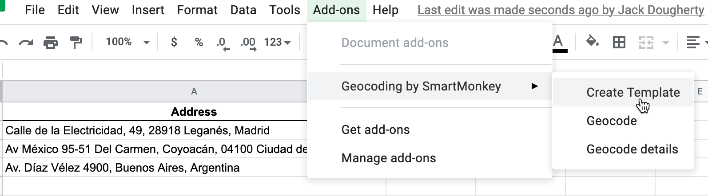
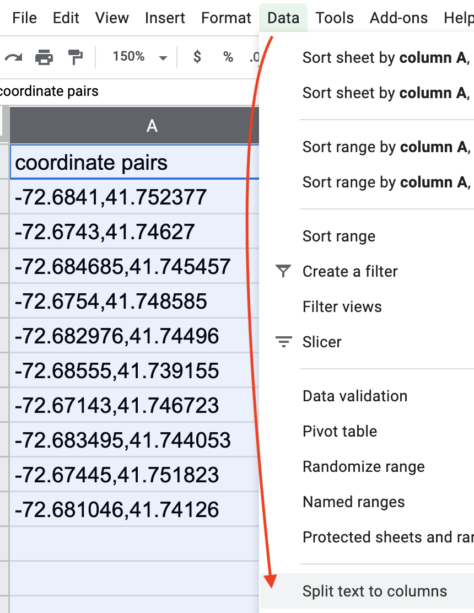
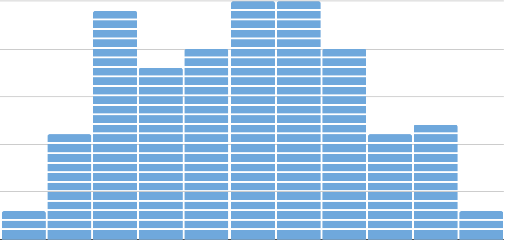
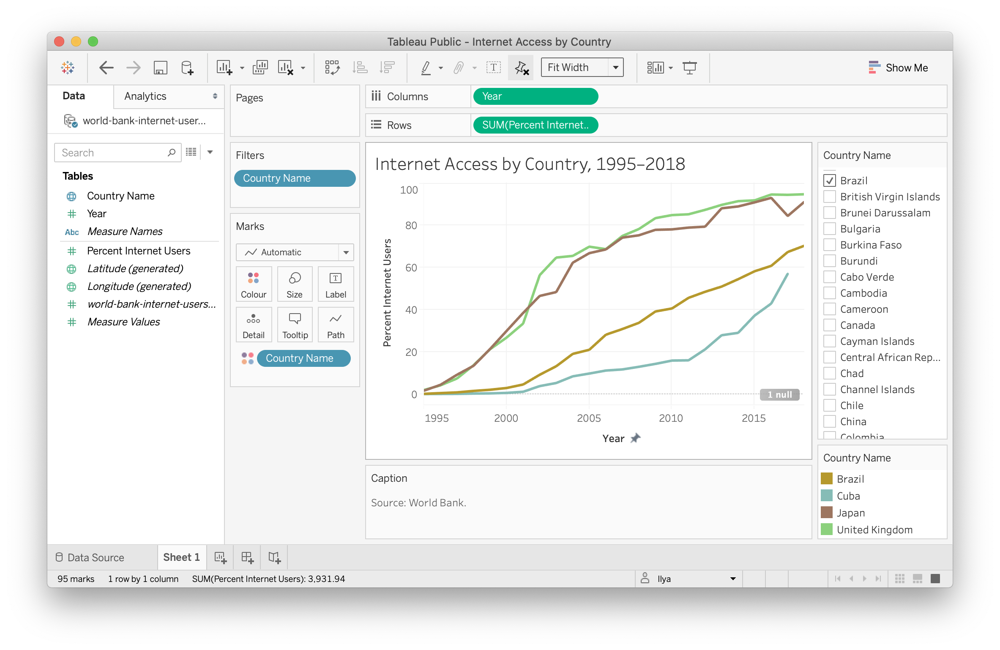
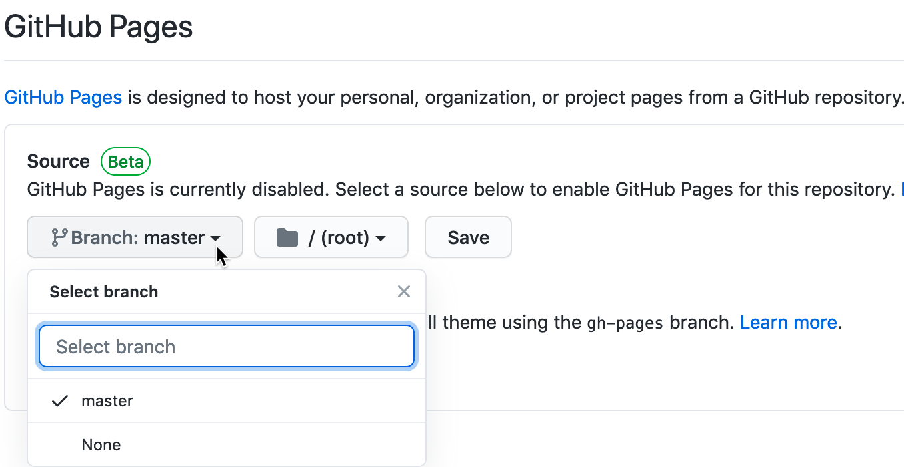

Preface
=======

<!-- R global options: R chunk images display without code (no echo); show PDF image over JPG/PNG when available in PDF output -->

](images/0-preface/cover-400wide.jpg)

**This BOOK-IN-PROGRESS was last updated on: 09 Oct 2020**.

Read the open-access web edition at
<a href="https://HandsOnDataViz.org" class="uri">https://HandsOnDataViz.org</a>.
This book is under contract with O’Reilly Media, Inc., which will sell
print and ebook versions in April 2021.

Tell your story and show it with data, using free and easy-to-learn
tools on the web. This introductory book teaches you how to design
interactive charts and customized maps for your website, beginning with
easy drag-and-drop tools, such as Google Sheets, Datawrapper, and
Tableau Public. You’ll also gradually learn how to edit open-source code
templates like Chart.js, Highcharts, and Leaflet on GitHub. Follow along
with the step-by-step tutorials, real-world examples, and online
resources. This book is ideal for students, non-profit organizations,
small business owners, local governments, journalists, academics, or
anyone who wants to tell their story and show the data. No coding
experience is required.

Send corrections for this book-in-progress to
<handsondataviz@gmail.com>, or open an issue or submit a pull request on
our [GitHub repository](https://github.com/handsondataviz/book). If you
submit a GitHub pull request, in your commit message, please add the
sentence “I assign the copyright of this contribution to authors Jack
Dougherty and Ilya Ilyankou” to give us the option to publish it, with
credit to you.

View open-source code for the book text and code templates at
<a href="https://github.com/handsondataviz" class="uri">https://github.com/handsondataviz</a>.

<strong>Hands-On Data Visualization</strong> is copyrighted by
<a href="https://handsondataviz.org/authors">Jack Dougherty and Ilya
Ilyankou</a> and distributed under a
<a rel="license" href="http://creativecommons.org/licenses/by-nc-nd/4.0/">Creative
Commons BY-NC-ND 4.0 International License</a>. You may freely share
this content for non-commercial purposes, with a source credit to
<a href="http://HandsOnDataViz.org">http://HandsOnDataViz.org</a>.

Authors & Acknowledgements
--------------------------

<!-- Images below are 200x200 at 300 resolution -->

<table>
<colgroup>
<col style="width: 50%" />
<col style="width: 50%" />
</colgroup>
<thead>
<tr class="header">
<th>Authors</th>
<th>About Us</th>
</tr>
</thead>
<tbody>
<tr class="odd">
<td></td>
<td><a href="http://jackdougherty.org">Jack Dougherty</a> is Professor of Educational Studies at Trinity College in Hartford, Connecticut, where he and his students partner with community organizations to help tell their data stories on the web. Follow him on <a href="https://twitter.com/doughertyjack">Twitter</a> and <a href="https://github/com/jackdougherty">on GitHub</a>.</td>
</tr>
<tr class="even">
<td></td>
<td><a href="https://www.linkedin.com/in/ilya-ilyankou-a64675ab">Ilya Ilyankou</a> is a Civic Technologist at Connecticut Data Collaborative. He has completed a double major in Computer Science and Studio Arts in the Class of 2018 at Trinity College. Visit <a href="http://ilyankou.com">his website</a> or follow him <a href="https://github.com/ilyankou">on GitHub</a>.</td>
</tr>
</tbody>
</table>

### Acknowledgements

We originally launched an earlier draft of this book under a different
title, *Data Visualization For All*, to accompany a [free online edX
course](https://www.edx.org/course/data-visualization-for-all) by the
same name, sponsored by Trinity College. Co-instructors Stacy Lam
(Trinity Class of 2019) and David Tatem (Instructional Technologist)
contributed valuable ideas and energy as we created content for that
course in Spring 2017, which to date has enrolled over 23,000 students,
though [only a fraction actually complete the 6-week
curriculum](https://jackdougherty.org/2017/11/21/tough-questions-to-ask-about-trinity-edx/).
Thanks also to the Trinity Information Technology staff and friends who
produced the edX course videos: Angie Wolf, Sean Donnelly, Ron Perkins,
Samuel Oyebefun, Phil Duffy, and Christopher Brown. Also, Veronica X.
Armendariz (Trinity Class of 2016) made valuable contributions to the
early version of the book while serving as a teaching assistant for the
[Data Visualization internship
seminar](http://commons.trincoll.edu/dataviz/) that brought together
Trinity undergraduates and Hartford community partners. Funding for
students who worked on the earlier draft was generously provided by the
[Office of Community
Learning](https://cher.trincoll.edu/community-learning/) and
[Information Technology Services](https://www.trincoll.edu/LITC/its/) at
Trinity College.

Thanks to many individuals and organizations who helped us to learn many
of the skills that we teach in this book, especially Alvin Chang and
Andrew Ba Tran, who previously were data journalists at *The Connecticut
Mirror*; and Michael Howser, Steve Batt, and their colleagues at the
University of Connecticut Libraries Map and Geographic Information
Center (MAGIC). Also, many people inspired us to be *code-curious* at
The Humanities and Technology Camp (THATCamp) events, sponsored by the
Roy Rosenzweig Center for History and New Media at George Mason
University, and engaged us with civic technology for the public good at
Transparency Camp events sponsored by the Sunlight Foundation. We also
appreciate Scott Gaul for inviting us to share our work-in-progress at
Hartford data workshops and discussions, sponsored by the Hartford
Foundation for Public Giving.

We thank everyone at O’Reilly Media who worked with us to bring you this
book, especially our outstanding developmental editor, Amelia Blevins,
and other members of the team: Nick Adams, Jonathan Hassel, Andy Kwan,
Katie Tozer,… We also thank O’Reilly’s support for technical reviewers
whose valuable feedback helped us to improve the manuscript, including
Carl Allchin, Derek Eder, Erica Hayes, etc…., and additional readers,
including Gared Bard, Nick Klagge….

Audience and Outline
--------------------

TODO: Intended audience

TODO: Chapter outline

TODO: what this book will not cover…

Follow Along on a Computer
--------------------------

TODO: Decide about renaming to “Follow Tutorials On A Computer”

To follow the steps in this book, we recommend either a desktop or
laptop computer, running either the Mac or Windows or Linux operating
system, with an internet connection and a modern web browser such as
Chrome, Firefox, Safari, or Edge. Another good option is a Chromebook
laptop, which enables you to complete *most* of the steps in this book,
and we’ll point out any limitations in specific chapters. While it’s
possible to use a tablet or smartphone device, we do not recommend it
because you cannot follow all of the steps, and you’ll also get
frustrated with the small screen and perhaps throw your device (or this
book) across the room, and possibly injure someone (and we will not be
held responsible!)

If you’re working on a laptop, consider buying or borrowing an external
mouse that can plug into your machine. We’ve met several people who
found it much easier to click, hover, and scroll with a mouse rather
than a laptop’s built-in trackpad.

If you’re new to working with computers—or teaching new users with this
book—consider starting with [mouse
exercises](http://www.pbclibrary.org/mousing/mousercise.htm). All of the
tools in this book assume that users already know how to click tiny
buttons, hover over links, and scroll web pages, but rarely are these
skills taught, and everyone needs to learn them at some point in our
lives.

<!-- TODO: I added the tips above because these are huge yet surmountable obstacles for many people I've worked with, especially older generations and incarcerated people. But I'm uncertain about the link to the mouse exercises. Perhaps I should tweet at public library staff and instructors to find better beginning resources? -->

#### Trademarks

TODO: Discuss with editor if this is necessary, and if so, whether to
place in the frontmatter?

Any use of a trademarked name without a trademark symbol is for
readability purposes only. We have no intention of infringing on the
trademark.

-   GitHub and the GitHub logo are registered trademarks of GitHub, Inc.
-   Google and the Google logo are registered trademarks of Google Inc.
-   WordPress is a registered trademark of the WordPress Foundation
-   TODO: Add others…

#### Disclaimer

The information is this book is provided without warranty. The authors
and publisher have neither liability nor responsibility to any person or
entity related to any loss or damages arising from the information
contained in this book.

<!--chapter:end:index.Rmd-->

Introduction: Why Data Visualization?
=====================================

In this book, you’ll learn how to create true and meaningful data
visualizations through chapters that blend design principles and
step-by-step tutorials, in order to make your information-based analysis
and arguments more insightful and compelling. Just as sentences become
more persuasive with supporting evidence and source notes, your
data-driven writing becomes more powerful when paired with appropriate
tables, charts, or maps. Words tell us stories, but visualizations show
us *data stories* by transforming quantitative, relational, or spatial
patterns into images. When visualizations are well-designed, they draw
our attention to what is most important in the data in ways that would
be difficult to communicate through text alone.

Our book features a growing number of free and easy-to-learn digital
tools for creating *data visualizations*. We broadly define this term
primarily as *charts*, which encode data as images, and *maps* which add
a spatial dimension. While *tables* do not illustrate data in the same
way, we include them in this book because of our pragmatic need to
navigate new learners through a decision-making process that often
results in building one of these three products. Furthermore, in this
digital era we define data visualizations as images that can be easily
re-used by modifying the underlying information, typically stored in a
data file, in contrast to *infographics* that are generally designed as
single-use artwork.[1]

As educators, we designed *Hands-On Data Visualization* to introduce key
concepts and provide step-by-step tutorials for new learners. You can
teach yourself, or use the book to teach others. Also, unlike many
technical books that focus solely on one tool, our book guides you on
how to choose among over twenty free and easy-to-use visualization tools
that we recommend. Finally, while some other books only focus on
*static* visualizations that can be distributed only on paper or PDF
documents, we demonstrate how to design *interactive* tables, charts,
and maps, and embed them on the web. Interactive visualizations engage
wider audiences on the internet by inviting them to interact with the
data, explore patterns that interest them, download files if desired,
and easily share your work on social media.

Data visualizations have spread widely across on the internet over the
last decade. Today in our web browsers we encounter more digital charts
and maps than we previously saw in the print-only past. But rapid growth
also raises serious problems. The “information age” now overlaps with
the “age of disinformation.” Now that nearly anyone can post online, how
do you make wise decisions about who to trust? When presented with
conflicting data stories about divisive policy issues such as social
inequality or climate change, which one do you believe? In the next
section, we’ll delve into this thorny topic by exploring what types of
evidence persuades you, and why. And we’ll share this dirty little
secret about data visualization: it illuminates our path in pursuit of
the truth, but it also empowers us to deceive and lie.

What Can You Believe?
---------------------

To begin, how do you know whether or not to believe us, the authors of
this book? Could we be lying to you? How do you determine what
information is truthful? Let’s start with a simple one-sentence
statement:

*Claim 1. Economic inequality has sharply risen in the United States
since the 1970s.*

Do you believe this claim—or not? Perhaps you’ve never thought about the
topic in this particular way before now (and if so, it’s time to wake
up). It’s possible your response depends on whether this statement
blends in with your prior beliefs, or pushes against them. Or perhaps
you’ve been taught to be skeptical of claims lacking supporting evidence
(and if so, thank your teachers).

So let’s move on to a more complex two-sentence statement that also
cites a source:

*Claim 2. In 1970, the top 10 percent of US adults received an average
income of about $135,000 in today’s dollars, compared to the bottom 50
percent who earned around $16,500. This inequality gap grew sharply over
the next five decades, as the top tier income climbed to about $350,000,
while the bottom half barely moved to about $19,000, according to the
World Inequality Database.*[2]

Is this second claim more believable than the first one? It now makes a
more precise claim by defining economic inequality in terms of average
income for the upper 10 percent versus the bottom 50 percent over time.
Also, this sentence pins its claims to a specific source, and invites us
to read further by following the footnote. But how do these factors
influence its persuasiveness? Does the sentence lead you to ask about
the trustworthiness of the source and how it defines “income”? Does the
wording make you wonder about the other 40 percent of the population
between the two extremes?

To answer some of those questions, let’s supplement the second claim
with a bit more information, as shown in Table
<a href="#tab:us-income">1</a>.

<table>
<caption>Table 1: Average US Adult Income, 1970-2019</caption>
<thead>
<tr class="header">
<th style="text-align: right;">Year</th>
<th style="text-align: right;">Top 10 Percent</th>
<th style="text-align: right;">Middle 40 Percent</th>
<th style="text-align: right;">Bottom 50 Percent</th>
</tr>
</thead>
<tbody>
<tr class="odd">
<td style="text-align: right;">1970</td>
<td style="text-align: right;">$136,308</td>
<td style="text-align: right;">$44,353</td>
<td style="text-align: right;">$16,515</td>
</tr>
<tr class="even">
<td style="text-align: right;">2019</td>
<td style="text-align: right;">$352,815</td>
<td style="text-align: right;">$76,462</td>
<td style="text-align: right;">$19,117</td>
</tr>
</tbody>
</table>

Note: Shown in constant 2019 US dollars. National income for individuals
aged 20 and over, prior to taxes and transfers, but includes pension
contributions and distributions. Source: [World Inequality Database
2020](https://wid.world/share/#0/countrytimeseries/aptinc_p50p90_z;aptinc_p90p100_z;aptinc_p0p50_z/US/2015/kk/k/x/yearly/a/false/0/400000/curve/false)

Does Table <a href="#tab:us-income">1</a> make Claim 2 more persuasive?
Since the table contains essentially the same information as the two
sentences about top and bottom income levels, it shouldn’t make any
difference. But the table communicates the evidence more effectively,
and makes a more compelling case. For many people, it’s easier to read
and grasp the relationship between numbers when they’re organized in a
grid, rather than complex sentences. As your eyes skim down the columns,
you automatically notice the huge jump in income for the top 10 percent,
which nearly tripled over time, while the bottom 50 percent barely
budged. In addition, the table fills in more information that was
missing from the text about the middle 40 percent, whose income grew
over time, but not nearly as much as the top tier. Furthermore, the note
at the bottom of the table adds a bit more context about how the data is
“shown in constant 2019 US dollars,” which means that the 1970s numbers
were adjusted to account for changes to the cost of living and
purchasing power of dollars over a half-century. The note also briefly
mentions other terms used by the World Inequality Database to calculate
income (such as taxes, transfers, and pensions), though you would need
to consult the source for clearer definitions. Social scientists use
different methods to measure income inequality, but generally report
findings similar to those shown here.[3]

Some Pictures Are More Persuasive
---------------------------------

Now let’s substitute a data visualization—specifically the line chart in
Figure <a href="#fig:us-income-chart1">1</a>—in place of the table, to
compare which one is more persuasive.

Figure 1: Explore the [interactive line
chart](https://datawrapper.dwcdn.net/LtRbj/) of US adult income
inequality over time.

Is Figure <a href="#fig:us-income-chart1">1</a> more persuasive than
Table <a href="#tab:us-income">1</a>? Since the line chart contains the
same historical start and stop points as the table, it should not make
any difference. But the line chart also communicates a powerful,
visualized data story about income gaps that grabs your attention more
effectively than the table. As your eyes follow the colored lines
horizontally across the page, the widening inequality between the top
versus the middle and bottom tiers is striking. The chart also packs so
much granular information into one image. Looking closely, you also
notice how the top-tier income level was relatively stable during the
1970s, then spiked upward from the 1980s to the present, and grew more
distant from other lines. Meanwhile, as the middle-tier income line rose
slightly over time, the lowest-tier slightly declined, meaning that the
bottom half of the population had less purchasing power in 2019 than
they did at their peak in the early 2000s. The rich got richer, and the
poor got poorer, as the saying goes. But the chart reveals how rapidly
those riches grew, and how poverty became even worse, over time.

Now let’s insert Figure <a href="#fig:us-income-chart2">2</a>, which
contains the same data as Figure <a href="#fig:us-income-chart1">1</a>,
but presented in a different format. Which chart should you believe?
Remember, we warned you to watch out people using data visualizations to
tell lies.

Figure 2: Explore the [alternative version of the interactive line
chart](https://datawrapper.dwcdn.net/JsxEp/) of US adult income
inequality over time, using the same data as the first version.

What’s going on? If Figure <a href="#fig:us-income-chart2">2</a>
contains the same data as Figure <a href="#fig:us-income-chart1">1</a>,
why do they look so different? What happened to the striking growth in
inequality gaps, which now seem to be smoothed away? Did the crisis
suddenly disappear? Was it a hoax?

Although the chart in Figure <a href="#fig:us-income-chart2">2</a> is
technically accurate, it intentionally misleads readers. Look closely at
the labels in the vertical axis. The distance between the first and
second figures ($1,000 to $10,000) is the same as the distance between
the second and the third ($10,000 to $100,000), but those jumps
represent very different amounts of money ($9,000 versus $90,000).
That’s because this chart was constructed with a [logarithmic
scale](https://en.wikipedia.org/wiki/Logarithmic_scale), which is most
appropriate for showing exponential growth. You may recall seeing
logarithmic scales during the early months of the Covid pandemic, when
they were appropriately used to illustrate very high growth rates, which
are difficult to display with a traditional linear scale. This second
chart is technically accurate, because the data points and scale labels
match up, but it’s misleading because there is no good reason to
interpret this income data using a logarithmic scale, other than to
deceive us about this crisis. People can use charts to illuminate the
truth, but also can use them to disguise it.

Different Shades of the Truth
-----------------------------

Let’s expand our analysis of income inequality beyond the borders of one
nation. Here’s a new claim that introduces comparative evidence and its
source. Unlike the prior US examples that showed historical data for
three income tiers, this global example focuses on the most current year
of data available for the top 1 percent in each nation. Also, instead of
measuring income in US dollars, this international comparison measures
the percentage share of the national income held by the top 1 percent.
In other words, how large a slice of the pie is eaten by the richest 1
percent in each nation?

*Claim 3. Income inequality is more severe in the United States, where
the richest 1 percent of the population currently receives 20 percent of
the national income. By contrast, in most European nations the richest 1
percent receives a smaller share, ranging between 6 to 15 percent of the
national income.*[4]

Following the same train of thought above, let’s supplement this claim
with a visualization to evaluate its persuasiveness. While we could
create a table or a chart, those would not be the most effective ways to
quickly display information for over 120 nations in our dataset. Since
this is spatial data, let’s transform it into an interactive map to help
us identify any geographic patterns and to encourage readers to explore
income levels around the globe, as shown in Figure
<a href="#fig:world-income-map1">3</a>.

Figure 3: Explore the [interactive
map](https://datawrapper.dwcdn.net/NLMLg/1/) of world income inequality,
measured by the share of national income held by the top 1 percent of
the population, based on the most recent data available. Source: [World
Inequality Database
2020](https://wid.world/world/#sptinc_p99p100_z/US;FR;DE;CN;ZA;GB;WO/last/eu/k/p/yearly/s/false/5.070499999999999/30/curve/false/country).

Is Figure <a href="#fig:world-income-map1">3</a> more persuasive than
Claim 3? While the map and the text present the same data about income
inequality in the US versus Europe, there should be no difference. But
the map pulls you into a powerful story that vividly illustrates gaps
between the rich and poor, similar to the chart example above. Colors in
the map signal a crisis. Income inequality in the US (along with Russia
and Brazil) stands out in dark red at the highest level of the legend,
where the top 1 percent holds 19% or more of the national income. By
contrast, as your eye floats across the Atlantic, nearly all of the
European nations appear in lighter beige and orange colors, indicating
no urgent crisis as their top-tier holds a smaller share of the national
income.

Now let’s introduce the alternative map in Figure
<a href="#fig:world-income-map2">4</a>, which contains the same data as
shown in Figure <a href="#fig:world-income-map1">3</a>, but is displayed
in a different format. Which map should you believe?

Figure 4: Explore an [alternative version of the interactive
map](https://datawrapper.dwcdn.net/o5f9Q/) of world income inequality,
using the same data as the map above.

Why does the second map in Figure <a href="#fig:world-income-map2">4</a>
look different than the first map in Figure
<a href="#fig:world-income-map1">3</a>? Instead of dark red, the US is
now colored medium-blue, closer on the spectrum to Canada and most
European nations. Did the inequality crisis simply fade away from the
US, and move to dark-blue Brazil? Which map tells the truth?

This time, neither map is misleading. Both make truthful interpretations
of the data with reasonable design choices, even though they create very
different impressions in our eyes. To understand why, look closely at
the map legends. The first map sorts nations in three categories (less
than 13%, 13-19%, 19% and above), while the second map displays the
entire range in a green-blue color gradient. Since the US share is 20.5
percent, in the first map it falls into the top bucket with the darkest
red color, but in the second map it falls somewhere closer to the middle
as medium-blue color. Yet both maps are equally valid, because neither
violates a definitive rule in map design nor intentionally disguises
data. People can mislead with maps, but it’s also possible to make more
than one portrait of the truth.

The interpretive nature of data visualization poses a serious challenge.
As the authors of this book, our goal is to guide you in creating
truthful and meaningful charts and maps. We’ll point you toward
principles of good design, encourage thoughtful habits of mind, and try
to show by example. Occasionally we’ll even tell you what *not* to do.
But data visualization is a slippery subject to teach, sometimes more
art than science. We know that charts and maps can be manipulated—just
like words—to mislead your audience, and we’ll demonstrate common
deception techniques to help you spot them in other people’s work, and
consciously avoid them in your own. But newcomers may be frustrated by
the somewhat fuzzy rules of data visualization. Often there is no
*single* correct answer to a problem, but rather *several* plausible
solutions, each with their own strengths and weaknesses. As a learner,
your job is to continually search for *better answers* without
necessarily expecting to find the *one right answer*, especially as
visualization methods and tools continue to evolve, and people invent
new ways to show the truth.

Organization of the Book
------------------------

We’ve organized the chapters of this book to serve as an introductory
hands-on guide to data visualization, from spreadsheets to code. Also,
we assume no prior skills other than general familiarity with operating
a computer, along with an innate curiosity about telling stories with
data. Imagine the book in four parts.

In part one, you’ll develop foundational skills about envisioning your
data story, along with the tools and data you’ll need to tell it. We’ll
gradually move from [Chapter 2: Choose Tools to Tell Your Data
Story](choose.html) to [Chapter 3: Improve Your Spreadsheet
Skills](spreadsheet.html) to [Chapter 4: Find and Question Your
Data](find.html) to [Chapter 5: Clean Up Messy Data](clean.html) to
[Chapter 6: Make Meaningful Comparisons](comparisons.html). These
chapters feature hands-on tutorials to enrich learning by doing.

In part two, you’ll build lots of visualizations with easy-to-learn
drag-and-drop tools, and find out which types work best with different
data stories. We’ll start with [Chapter 7: Chart Your Data](chart.html),
[Chapter 8: Map Your Data](map.html), and [Chapter 9: Table Your
Data](table.html) and develop your understanding of the interpretive
style that each one emphasizes. In [Chapter 9: Embed on the
Web](embed.html), you’ll learn how to insert all of these interactive
visualizations on common web platforms, to invite readers to explore
your data and share your work more widely.

In part three, you’ll advance to working with more powerful tools,
specifically code templates, that give you more control over customizing
the appearance of your visualizations and where you host them online.
We’ll start with [Chapter 11: Edit and Host Code with
GitHub](github.html), and walk you through the easy web interface for
this popular open-source coding platform. Then you’ll build using
[Chapter 12: Chart.js and Highcharts Templates](chartcode.html) and
[Chapter 13: Leaflet Map Templates](leaflet.html), and discover more
advanced spatial tools in [Chapter 14: Transform Your Map
Data](transform.html). At the end of the book we include an [Appendix:
How to Fix Common Problems](fix.html) to consult when you accidentally
break your code, which is also a great way to learn how it works.

In part four, we’ll wrap up all of the visualization skills you’ve
developed by returning to the central theme of this introduction:
telling true and meaningful stories with data. In [Chapter 15: Detect
Lies and Reduce Data Bias](detect.html), you’ll learn how to lie with
charts and maps in order to do a better job of telling the truth.
Finally, [Chapter 16: Tell and Show Your Data Story](story.html)
emphasizes how the goal of data visualization is not simply to make
pictures about numbers, but to craft a narrative that convinces readers
how and why your interpretation matters.

### Summary

Now you have a clearer sense of our primary goal for this book. We aim
for you to learn how to tell true and meaningful stories with
interactive data visualizations, while being mindful of the ways that
people can use them to mislead. In the next chapter, let’s get started
on clarifying the data story you wish to tell, and factors to consider
when choosing tools to do the job.

<!--chapter:end:01-introduction.Rmd-->

Choose Tools to Tell Your Story
===============================

If you feel overwhelmed by the avalanche of digital tools available
today, you’re not alone. When you’re simply trying to do your regular
work, keeping up with the latest software developments can feel like an
additional part-time job you didn’t sign up for. Digital tools are
constantly changing and evolving. That’s good news if you like to
experiment and choose among different options, but not-so-good news if
you lack the time to make complex decisions.

In this chapter, we’ll help you navigate your way through the
decision-making process. We’ll begin with the most important
step—[sketching out your data story](sketch.html)—to help identify the
types of tools you need to tell it effectively. Next, we’ll review [ten
factors to consider when choosing digital tools and the tradeoffs
involved](tool-factors.html). Finally, we’ll present our [list of
recommended data visualization tools](recommended-tools.html), plus one
extra to help you get organized: [a password
manager](password-manager.html). All of these tools are free to use, and
the book introduces them gradually, from easy-to-learn beginner tools to
more advanced and powerful ones.

Start Sketching Your Data Story
-------------------------------

Before we dive into digital tools, let’s focus on what’s most important:
our *data story*. We build visualizations to help us tell a story about
the information we’ve gathered, a narrative that draws the audience’s
attention to meaningful patterns and key insights amid all of the pieces
of data. Help them to see the forest, rather than listing every single
tree.

But in the early stage of a data visualization project, a common problem
is that we don’t yet have a clear sense of the key pieces of our data
story, or how they fit together. That’s perfectly normal. One of the
best ways to address that problem is a quick exercise that’s designed to
move partially-formed ideas from inside our heads out onto pieces of
paper, to help you and any co-workers see them more clearly.

For this exercise, push away your computer and pick up some of our
favorite old-school tools:

-   several blank sheets of paper
-   colored pencils, pens, or markers
-   your imagination

Get ready to sketch out your data story in words and pictures. No
artistic skills are required.

1.  On the first sheet of paper, *write down the problem* that motivates
    your data project. If you prefer a prompt, try filling in these
    blanks: *We need to find out \_\_\_\_\_\_ in order to
    \_\_\_\_\_\_\_\_\_.* In many cases, people come to data
    visualization with an information-driven problem, which they hope
    will lead them to achieve a broader goal. For example, when working
    on the first draft of this book, our problem statement was: *We need
    to find out our readers’ backgrounds and interests about data
    visualization, in order to write a better introductory guide that
    meets their needs.*

2.  On the second sheet of paper, *rewrite your problem statement into a
    question*. Write a question for which you genuinely do not yet know
    the answer—and punctuate it with a question mark. If your brain is
    tempted to jump ahead and try to answer the question, fight that
    urge. Instead, focus on framing the question, by using more precise
    wording than what you wrote above, without limiting the range of
    possible results. For example, when working on the first draft, our
    question was: *How do readers of our book describe their prior
    experience with data visualization, education level, and learning
    goals?* While we had some preliminary guesses, we honestly didn’t
    know the answer at that stage, which made it an authentic question.

3.  On the third sheet of paper, *draw pictures and arrows to show how
    you’ll find data* to answer your question above. Are you conducting
    door-to-door interviews with neighborhood residents, or sending an
    online survey to customers, or downloading family income and county
    maps from the US Census? Sketch a picture of your data collection
    process, to show how you plan to bring together different pieces of
    information. For example, when writing the first draft of our book,
    we asked readers to fill out a quick online survey form, and
    reminded them not to insert any private data, because we shared back
    their collected responses in a public spreadsheet.

4.  On the fourth sheet of paper, *sketch at least one type of
    visualization you plan to create* after you obtain your data above.
    Do you envision some type of chart, like a bar, line, or scatter
    chart? Or do you imagine some type of map, maybe with points or
    polygons? If your visualizations will be interactive, try to show
    the concept using buttons and more than one sheet of paper. You can
    add *imaginary data* at this stage because it’s just a preliminary
    sketch, as shown in Figure <a href="#fig:data-story-panel">5</a>.
    Have fun!

Figure 5: Sketch out your story idea on four pages: problem, question,
find data, visualize.

This exercise can help you in multiple ways, whether you do it by
yourself, or even better, with a team of co-workers, as shown in Figure
<a href="#fig:data-story-photo-combined">6</a>. First, by migrating
ideas from your mind to paper, you’ll make your thinking clearer not
only for you, but also more visible for others. When ideas are sketched
out, you can reflect on them, listen to feedback, cross-out not-so-good
ones, and replace them with better ones on new sheets of paper. If your
initial sketches are too complicated or confusing, break down those
ideas into separate pages to make them more coherent.

Figure 6: The data story sketching exercise can be done solo, but works
even better with a team of people. In our data visualization course,
college students and community partners collaborate on framing the data
story for their projects.

Second, look at your sheets like a storyboard. Spread them out on a
table, move them around to potentially reorder the sequence, start to
define the three essential stages of your story: the beginning, middle,
and end. Also, these pages can help you organize your thinking about how
you’ll communicate your data story to larger audiences, such as a
presentation slide deck, or paragraphs and pictures for your next report
or web page. Don’t throw them away, because we’ll return to this
exercise at the end of the book in [Chapter 16: Tell and Show Your Data
Story](story.html).

Finally, this sketching exercise can help you identify which chapters
you should focus on in the body of this book. If you’re puzzled about
where to search for data, check out [Chapter 4: Find and Question Your
Data](find.html). If you’re thinking about building a chart or map, but
need examples of different types, look at the beginning of [Chapter 7:
Chart Your Data](chart.html) and [Chapter 8: Map Your Data](map.html).

Now that you have a clearer sense of the story you wish to tell, and
some initial ideas about the visualizations you wish to create, in the
next two sections we’ll discuss tools to do the job, and factors you
should consider when deciding among them.

Ten Factors When Considering Tools
----------------------------------

Making decisions between the seemingly endless number of digital tools
can feel overwhelming. To help you navigate your decision-making
process, below we list ten key factors that we consider when evaluating
new visualization tools or online services. When comparing options, many
decisions involve some type of tradeoff, a balance between competing
wants and needs, such as ease-of-use versus extensive features. By
identifying key factors, we believe that each reader can make a more
informed decision about which tools offer the best tradeoff for you,
since all of us are different. Furthermore, we worded our categories
broadly, because the concepts can be applied to other areas of your
digital life, but followed up with more context about data visualization
in particular.

*1. Easy-to-learn*

How much time will be required to learn a new tool? In our busy lives,
this is often the most important factor, but also one that varies
widely, as your personal investment of time and energy depends on your
prior experience in using related tools and grasping key concepts. In
this book, we use the label *Easy Tools* to identify those best suited
for beginners (and even some advanced users prefer them, too). They
usually feature a graphical user interface, meaning you operate them
with pull-down menus or drag-and-drop steps, rather than memorizing
commands to be typed into a blank screen. The better ones also offer
user-friendly error messages that guide you in the right direction after
a wrong turn. Later in the book, we’ll introduce *Power Tools* that
provide more control and customization of your visualizations, such as
code templates that you can copy and edit, which is easier than writing
them from scratch. Overall, when deciding which tools to include in this
book, we placed easy-to-learn at the top of our list. In fact, we
removed a popular free drag-and-drop tool from an earlier draft of this
book because even *we* had difficulty following our own instructions in
how to use it. When faced with several good options, choose simplicity.

*2. Free or Affordable*

Is the tool free to use? Or is it based on a *freemium* model that
offers basic functions for free, with premium features at a price? Or
does it require paying a one-time purchase or monthly subscription fee?
Of course, the answer to what is affordable will vary for each reader.
We fully understand that the business model for many software developers
requires steady revenue, and both of us willingly pay to use specific
tools necessary for our work. If you regularly rely on a tool to do your
job, with no clear alternative, it’s in your best interest to
financially support their continued existence. But when creating this
book, we were impressed by the wide array of high-quality data
visualization tools that are available at no cost to users. To increase
access to data visualization for all readers, every tool we recommend is
free, or its core features are freely available.

*3. Powerful*

Does the tool offer all of the features you anticipate needing? For
example, does it support building sufficient types of data
visualizations for your project? Although more is usually better, some
types of charts are obscure and rarely used, such as [radar
charts](https://en.wikipedia.org/wiki/Radar_chart) and [waterfall
charts](https://en.wikipedia.org/wiki/Waterfall_chart). Also, look out
for limits on the amount of data you can upload, or restrictions on
visualizations you create. For example, we removed a freemium tool from
an earlier version of this book because the company began to require a
paid license if your map was viewed more than 100 times on the web.
Furthermore, to what extent does the tool allow you to customize the
appearance of your visualizations? Since drag-and-drop and freemium
tools commonly limit your display options, you may need to make
tradeoffs between them versus more powerful and customizable tools. In
this book, we begin with easy tools and gradually introduce more
advanced ones in each chapter, to help you identify your ideal
combination of simplicity and power.

*4. Supported*

Does the developer regularly maintain and update the tool, and respond
to questions or issues? Is there an active user community that supports
the tool and shares its knowledge about using it? If you’ve worked with
digital tools as long as we have, you’ll recognize our pain in losing
several whose developers pulled the plug. For example, the [Killed By
Google](http://killedbygoogle.com) lists nearly 200 applications and
online services that this multi-billion dollar corporation closed down.
One of these was a popular data visualization tool, [Google Fusion
Tables](https://en.wikipedia.org/wiki/Google_Fusion_Tables), which once
occupied a full chapter in an earlier version of this book, when we
removed when Google shut down the tool after a ten-year run in 2019.
Although none of us can predict which online tools will persist in
future years, we looked for signs of active support before including
them in this book, such as regular updates, stars earned on a
[GitHub](http://github.com) developer’s site, and questions answered in
the [StackOverflow](http://stackoverflow.com) user forum. But never
assume that the future will resemble the past. The continuous evolution
of digital tools means that some become extinct.

*5. Portable*

How easily can you migrate your data *into* and *out* of a tool? For
example, we stopped recommending an online story map tool created by a
well-known software company when we discovered that while users could
easily upload locations, text, and photos, but there was no way to
export all of their work! As digital technology inevitably changes, all
data will need to migrate to another platform, and it’s your job to be
prepared for this eventual transition. Think about the issue as
historical preservation, to increase the likelihood that your projects
will continue to function on some unknown platform in the future. If
your current tool developer announced that it was shutting down next
month, could you easily extract all of the underlying data in a
commonly-used file format to upload to a different tool? A key step to
future-proof your visualizations is to ensure that your data files are
easily separated from the presentation software that generates the
charts or maps. When recommending tools for this book, we favored those
that support portable data downloads for future migrations.

*6. Secure and Private*

This category combines related questions about security and privacy.
First, does the online tool or service take reasonable precautions to
protect your personal information from malicious hackers and malware?
Review a [list of major data breaches on
Wikipedia](https://en.wikipedia.org/wiki/List_of_data_breaches) to help
you make informed decisions. If your tool developer recently experienced
a malicious data hack, find out how they responded. Second, when you
access tools through your browser, does they track your web activity
across different sites? Also be aware of [internet censorship by
different governments around the
globe](https://en.wikipedia.org/wiki/Internet_censorship_and_surveillance_by_country),
as compiled by Wikipedia, unless you happen to be reading this book in
China, which has [blocked access to all of Wikipedia since April
2019](https://en.wikipedia.org/wiki/Censorship_of_Wikipedia). Finally,
does the tool clearly explain whether the data you enter or the products
you create will stay private or become public? For example, some
companies offer free access to their visualization tools, but in
exchange require you to make your data, charts, and maps publicly
accessible. That tradeoff may be acceptable if you’re working with
open-access data and already plan to freely share your visualizations,
as many journalists and scholars do. In any case, make sure the terms of
service are clearly defined before you start using a tool.

*7. Collaborative*

Does the tool allow people to work together and co-create a data
visualization? If so, does the tool allow different levels of access or
version control to help prevent team members from accidentally
overwriting each other’s contributions? Prior generations of digital
tools were designed primarily for solo users, in part to address
security and privacy issues raised above. But today, many data
visualization projects require access and input from multiple team
members. Collaboration is essential for success. As co-authors of this
book, who jointly wrote the text and co-created many of the
visualizations, we favor a newer generation of tools designed for team
work environments.

*8. Cross-Platform*

This category refers to both creating and consuming digital content.
First, does the tool work across different computer operating systems?
In this book, we highlight several tools that run inside any modern web
browser, which usually (but not always) means they will operate on all
major desktop and laptop computer platforms, such as Windows, Mac,
Chromebook, and Linux. When necessary, we specify when a tool will only
run on specific computer operating systems, and this often reduces
access for people using lower-cost computers. Second, does the tool
create visualizations that are responsive to different screen sizes? In
other words, does it produce charts and maps that display satisfactorily
on smaller devices, such as smartphones and tablets? In this book, we
favor cross-platform tools that also display content responsively on
smaller devices, but we do not necessarily expect that tools can be
operated on small devices to create visualizations. In other words, when
we say that a tool runs inside any modern web browser, we don’t
necessarily mean phone and tablet browsers, but sometimes they work
there, too.

*9. Open-Source*

Is the tool’s software code publicly viewable? Can the code be modified
and redistributed, so that other developers can suggest improvements, or
build new features or extensions? We recognize that many developers rely
on non-public proprietary code to sell their tools at a profit, and
several of those appear in the book. But we also have been impressed
with the number of high-quality data visualization tools offered under
different types of open-source licensing arrangements, by sustainable
communities of volunteer developers, non-profit organizations, and also
for-profit companies who recognize some economic benefits of open-source
code development. When recommending tools for this book, we highlight
open-source options when available.

*10. Accessible for Visually-Impaired Readers*

Does the tool create visualizations that are accessible for
visually-impaired readers? Although disability advocacy laws were passed
decades ago, digital technology still lags behind and is slowly catching
up, especially in the field of data visualization. But some tools
include [a built-in check for
colorblindness](https://blog.datawrapper.de/colorblind-check/) and offer
[chart types designed for low-vision people using screen
readers](https://www.highcharts.com/demo/accessible-line), as shown in
Figure <a href="#fig:colorblind-accessible-combined">7</a>.

Figure 7: On the left, the Datawrapper built-in check for
colorblindness. On the right, a Highcharts line chart designed for
low-vision accessibility.

Those are ten factors we consider when deciding whether to add another
item into our digital toolkit. Of course, your list may vary, and might
include other values that are vitally important yet sometimes harder to
judge, such as a software developer’s ethical business practices or
contribution to the public good. Whatever criteria you value, make them
explicit in your decision-making process, and inform others about what
influences your choices.

Also consider alternative ways to make tool decisions. When
visualization designer Lisa Charlotte Rost reflected on her [fascinating
experiment in recreating one chart with 24 different
tools](https://source.opennews.org/articles/what-i-learned-recreating-one-chart-using-24-tools/),
she concluded that “there are no perfect tools, just good tools for
people with certain goals.” On a related note, when digital historian
Lincoln Mullen offered advice on [making prudent choices about digital
tools](https://lincolnmullen.com/blog/how-to-make-prudent-choices-about-your-tools/),
his first recommendation was: “The best possible tool is the one you’re
already using to get work done.” Don’t fall into the familiar trap of
believing that your productivity will increase if only you began to use
yet another new tool. Mullen’s second piece of advice was: “Prefer the
tool that your local co-workers use.” Even if different tool is
objectively better, it may be outweighed by the benefits of mutual
support and collaboration with people using a less-awesome application
in your local setting.[5]

Now that you understand the factors driving our decisions, in the next
section you’ll see an overview of our tool recommendations, with a quick
description and link to the chapter where we introduce each of them.

Our Recommended Tools
---------------------

When creating this book, we aimed to identify the most essential data
visualization tasks that beginners are likely to face, and the digital
toolkit needed to complete those tasks. In the prior section we listed
ten factors that influenced our tool recommendations, such as being
easy-to-learn, free or affordable, with powerful capacity. In this
section, we have listed all of the tools featured in this book, with
recommended uses and references to chapters where they appear, as shown
in Table <a href="#tab:tools">2</a>. Your data visualization projects
may only require you to use only a small number of these, or perhaps
even just one tool. But it’s important to be aware of the different
types of tools, because you may not realize how they can help you if
don’t know that they exist.

<!-- TODO: See table data in Google Sheet format: https://docs.google.com/spreadsheets/d/1HHKRw_Og38lCK9eKAvQTF_6GHdrSE5YU1ioStPsvxII/edit#gid=0 -->

<table>
<caption>Table 2: Recommended Tools and Uses, with Chapter References</caption>
<thead>
<tr class="header">
<th>Tools</th>
<th>Collect</th>
<th>Clean</th>
<th>Chart</th>
<th>Geocode</th>
<th>Map</th>
<th>Table</th>
<th>Code</th>
<th>Transform</th>
</tr>
</thead>
<tbody>
<tr class="odd">
<td>Google Sheets spreadsheet/charts</td>
<td><a href="spreadsheet-tools.html">Ch3</a></td>
<td><a href="clean.html">Ch5</a></td>
<td><a href="chart-google.html">Ch7</a></td>
<td><a href="geocode.html">Ch3</a></td>
<td></td>
<td><a href="table.html">Ch9</a></td>
<td></td>
<td></td>
</tr>
<tr class="even">
<td>LibreOffice Calc spreadsheet/charts</td>
<td><a href="spreadsheet-tools.html">Ch3</a></td>
<td></td>
<td></td>
<td></td>
<td></td>
<td></td>
<td></td>
<td></td>
</tr>
<tr class="odd">
<td>Airtable relational database</td>
<td><a href="database.html">Ch3</a></td>
<td></td>
<td></td>
<td></td>
<td></td>
<td></td>
<td></td>
<td></td>
</tr>
<tr class="even">
<td>Tabula PDF table extractor</td>
<td></td>
<td><a href="tabula.html">Ch5</a></td>
<td></td>
<td></td>
<td></td>
<td></td>
<td></td>
<td></td>
</tr>
<tr class="odd">
<td>OpenRefine data cleaner</td>
<td></td>
<td><a href="open-refine.html">Ch5</a></td>
<td></td>
<td></td>
<td></td>
<td></td>
<td></td>
<td></td>
</tr>
<tr class="even">
<td>Datawrapper charts/maps/tables</td>
<td></td>
<td></td>
<td><a href="chart-datawrapper.html">Ch7</a></td>
<td><a href="map-datawrapper.html">Ch8</a></td>
<td><a href="map-datawrapper.html">Ch8</a></td>
<td><a href="table-datawrapper.html">Ch9</a></td>
<td></td>
<td></td>
</tr>
<tr class="odd">
<td>Tableau Public charts/maps/tables</td>
<td></td>
<td></td>
<td><a href="chart-tableau.html">Ch7</a></td>
<td></td>
<td><a href="map-tableau.html">Ch8</a></td>
<td><a href="table.html">Ch8</a></td>
<td></td>
<td></td>
</tr>
<tr class="even">
<td>Chart.js code templates</td>
<td></td>
<td></td>
<td><a href="chartcode.html">Ch12</a></td>
<td></td>
<td></td>
<td></td>
<td></td>
<td></td>
</tr>
<tr class="odd">
<td>Highcharts code templates</td>
<td></td>
<td></td>
<td><a href="chartcode.html">Ch12</a></td>
<td></td>
<td></td>
<td></td>
<td></td>
<td></td>
</tr>
<tr class="even">
<td>Google My Maps point map maker</td>
<td></td>
<td></td>
<td></td>
<td><a href="mymaps.html">Ch8</a></td>
<td><a href="mymaps.html">Ch8</a></td>
<td></td>
<td></td>
<td></td>
</tr>
<tr class="odd">
<td>Leaflet map code templates</td>
<td></td>
<td></td>
<td></td>
<td></td>
<td><a href="leaflet.html">Ch13</a></td>
<td></td>
<td></td>
<td></td>
</tr>
<tr class="even">
<td>GitHub edit &amp; host code</td>
<td></td>
<td></td>
<td></td>
<td></td>
<td></td>
<td></td>
<td><a href="github.html">Ch11</a></td>
<td></td>
</tr>
<tr class="odd">
<td>GitHub Desktop &amp; Atom code editor</td>
<td></td>
<td></td>
<td></td>
<td></td>
<td></td>
<td></td>
<td><a href="github-desktop-atom.html">Ch11</a></td>
<td></td>
</tr>
<tr class="even">
<td>GeoJson.io edit &amp; draw geodata</td>
<td></td>
<td></td>
<td></td>
<td></td>
<td></td>
<td></td>
<td></td>
<td><a href="geojsonio.html">Ch14</a></td>
</tr>
<tr class="odd">
<td>Mapshaper edit &amp; join geodata</td>
<td></td>
<td></td>
<td></td>
<td></td>
<td></td>
<td></td>
<td></td>
<td><a href="mapshaper.html">Ch14</a></td>
</tr>
<tr class="even">
<td>MapWarper georectify images</td>
<td></td>
<td></td>
<td></td>
<td></td>
<td></td>
<td></td>
<td></td>
<td><a href="mapwarper.html">Ch14</a></td>
</tr>
</tbody>
</table>

In addition to the tools featured in Table <a href="#tab:tools">2</a>,
you’ll find several other useful tools mentioned in the text, including
[ColorBrewer to select map colors](map-design.html), the [Geocoding by
SmartMonkey add-on for Google Sheets](geocode.html), \[US Census
Geocoder for bulk addresses and census geography\]\[bulk-geocode.html\],
and the [Socrata open-repository chart and map
tools](filtered-point-map-socrata.html). Also, consider enhancing your
web security by installing the free [Privacy Badger browser extension
from the Electronic Frontier Foundation](https://privacybadger.org/) to
view and exercise some control over who’s tracking you, and also review
the [EFF’s Surveillance Self-Defense Guide](https://ssd.eff.org/).

Of course, we recognize that digital tools are continually changing and
evolving. As time goes by, we expect that some tools will no longer be
available, and we also anticipate discovering newer ones that do a
better job in telling our data stories. If you’d like to recommend a
tool that’s not currently on our list, email us at
<handsondataviz@gmail.com> or tweet us at
[handsondataviz](https://twitter.com/handsondataviz), and tell us how it
rates on the ten factors that guide our selection process above.

Use a Password Manager
----------------------

Finally, we highly recommend a password manager: think of it as one tool
to rule them all! Password managers help you to keep track of all of the
accounts you will create when using several of the online tools above.
We recommend installing [BitWarden](https://bitwarden.com), an
open-source password manager that offers its core features for free for
Windows, Mac, and Linux computers, all major web browsers, and iOS and
Android mobile devices. When you install BitWarden, you create one
master password (be careful not to forget it) that grants you access to
all of the account usernames and passwords you catalog. You also install
the Bitwarden extension in your preferred web browsers. When you
register for a new account in your browser, the password manager
typically asks if you wish to store that information in your vault with
end-to-end encryption. Also, when you visit that site in the future, the
password manager usually recognizes it and enters your login credentials
with one click, as shown in Figure
<a href="#fig:bitwarden-annotated">8</a>.

Figure 8: The Bitwarden browser extension recognizes sites you have
previously stored, and enters your credentials with one click.

We recommend storing your passwords inside a tool like BitWarden, rather
than in a specific web browser (such as Chrome or Firefox) for two
reasons. First, you can set up BitWarden to sync and access your
passwords across *different* browsers and *multiple* devices, including
your laptop and mobile phone. Second, if your primary browser or
computer crashes, you still have online access to your secure BitWarden
vault, which means you can continue to work on a different computer.

### Summary

Now you have a better sense of the wide range of data visualization
tools we recommend in this book, and how to make wise decisions when
choosing among tools in general. Always keep the data story in the
forefront of your mind, since the tools are simply means to help you
achieve that end. The next chapter is designed to strengthen your skills
regarding the most common tool in our data visualization toolkit:
spreadsheets.

<!--chapter:end:02-choose.Rmd-->

Strengthen Your Spreadsheet Skills
==================================

Before we begin to design data visualizations, it’s important to make
sure our spreadsheet skills are up to speed. While teaching this topic,
we’ve heard many people describe how they “never really learned” how to
use spreadsheet tools as part of their official schooling or workplace
training. But spreadsheet skills are vital to learn, not only as
incredible time-savers for tedious tasks, but more importantly, to help
us discover the stories buried inside our data.

The interactive charts and maps that we’ll construct later this book are
built on data tables, which we typically open with spreadsheet tools,
such as Google Sheets, LibreOffice, or Microsoft Excel. Spreadsheets
typically contain columns and rows of numerical or textual data, as
shown in Figure <a href="#fig:spreadsheet-terms">9</a>. The first row
often contains headers, meaning labels describing the data in each
column. Also, columns are automatically labeled with letters, and rows
with numbers, so that every cell or box in the grid can be referenced,
such `C2`. When you click on a cell, it may display a formula that
automatically runs a calculation with references other cells. Formulas
always begin with an equal sign, and may simply add up other cells (such
as `=C2+C3+C4`), or may contain a function that performs a specific
operation (such as calculating the average of a range of cells:
`=average(C2:C7)`). Some spreadsheet files contain multiple sheets
(sometimes called workbooks), where each tab across the bottom opens a
specific sheet.

Figure 9: Screenshot of a typical spreadsheet, with headers, tabs, and
the active cell displaying a formula.

In this chapter, we’ll start by reviewing basic steps, such as
[sharing](share.html), [uploading](upload.html), [geocoding with add-on
tools](geocode.html), and [collecting data with online
forms](forms.html). Then we’ll move on to ways of organizing and
analyzing your data, such as [sorting and filtering](sort.html),
[calculating with formulas](calculate.html), and [summarizing with pivot
tables](pivot.html). Finally, we’ll examine ways to connect different
sheets, such as [matching columns with lookup tables](vlookup.html), and
[relational databases](database.html). We illustrate all of these
methods with beginner-level users in mind, meaning they do not require
any prior background.

We’ll practice several of these skills using sample data that may
interest you, because it includes people like you. So far over 3,000
readers of this book have responded to a quick public survey about their
general location, prior level of experience and education, and goals for
learning data visualization. If you haven’t already done so, [fill out
the quick survey form](https://forms.gle/yn5QwTzfQkYcppQn9) to
contribute your own response, and also to give you a better sense of how
the questions were posed, then see the results in the [public sample
dataset](https://docs.google.com/spreadsheets/d/1egX_akJccnCSzdk1aaDdtrEGe5HcaTrlOW-Yf6mJ3Uo).

If you want to learn ways to make your computer do more of the tedious
data preparation work for you, this chapter is definitely for you. Or if
you already feel very familiar with spreadsheets, you should at least
skim this chapter, and perhaps you’ll learn a trick or two that will
help you to create charts and maps more efficiently later in the book.

Select your Spreadsheet Tools
-----------------------------

Which spreadsheet tools should you use? As we describe in more detail in
[Chapter 2: Choose Tools to Tell Your Story](choose.html), the answer
depends on how you respond to different questions about your work.
First, is your data public or private? If private, consider using a
downloadable spreadsheet tool that runs on your computer, to reduce the
risk of an accidental data breach that might happen when using an online
spreadsheet tool that automatically stores your data in the cloud.
Second, will you be working solo or with other people? For collaborative
projects, consider using an online spreadsheet tool that’s designed to
allow other team members to simultaneously view or edit data. Third, do
you need to import or export data in any specific format (which we’ll
describe in the next section), such as Comma Separated Values (CSV)? If
yes, then choose a spreadsheet tool that supports that format. Finally,
do you prefer a free tool, or are you willing to pay for it, or donate
funds to support open-source development?

Here’s how three common spreadsheet tools compare on these questions:

-   [Google Sheets](https://www.google.com/sheets/about/) is a free
    online spreadsheet tool that works in any modern web browser, and
    automatically stores your data in the cloud. While data you upload
    is private by default, you can choose to share it with specific
    individuals or anyone on the internet, and allow them to view or
    edit for real-time collaboration, similar to Google Documents.
    Google Sheets also imports and exports data in CSV, ODS, Excel, and
    other formats. You can sign up for a free personal [Google
    Drive](https://drive.google.com) account with the same username as
    your Google Mail account, or create a separate account under a new
    username to reduce Google’s invasion into your private life. Another
    option is to pay for a [Google
    Workspace](https://workspace.google.com/) business account
    subscription (formerly known as G Suite), which offers nearly
    identical tools, but with sharing settings designed for larger
    organizations or educational institutions.
-   [LibreOffice](https://www.libreoffice.org/) is a free downloadable
    suite of tools, including its Calc spreadsheet, available for Mac,
    Windows, and Linux computers, and is an increasingly popular
    alternative to Microsoft Office. When you download LibreOffice, its
    sponsor organization, The Document Foundation, requests a donation
    to continue its open-source software development. The Calc
    spreadsheet tool imports and exports data in its native ODS format,
    as well as CSV, Excel, and others. While an online collaborative
    platform is under development, it is not yet available for broad
    usage.
-   [Microsoft Excel](https://support.microsoft.com/en-us/excel) is the
    spreadsheet tool in the Microsoft Office suite, which is available
    in different versions, though commonly confused as the company has
    changed its product names over time. A paid subscription to
    [Microsoft 365](https://www.microsoft.com/en-us/microsoft-365)
    provides you with two versions: the full-featured downloadable
    version of Excel (which is what most people mean when they simply
    say “Excel”) for Windows or Mac computers and other devices, and
    access to a simpler online Excel through your browser, including
    file sharing with collaborators through Microsoft’s online hosting
    service. If you do not wish to pay for a subscription, anyone can
    sign up for a free version of online Excel at Microsoft’s [Office on
    the Web](https://office.com), but this does *not* include the
    full-featured downloadable version. The online Excel tool has
    limitations. For example, neither the paid nor the free version of
    online Excel allows you to save files in the single-sheet generic
    Comma Separated Values (.csv) format, an important featured required
    by some data visualization tools in later chapters of this book. You
    can only export to CSV format using the downloadable Excel tool,
    which is now available only with a paid Microsoft 365 subscription.

Deciding which spreadsheet tools to use is not a simple choice.
Sometimes our decisions change from project to project, depending on
costs, data formats, privacy concerns, and the personal preferences of
any collaborators. Occasionally we’ve also had co-workers or clients
specifically request that we send them non-sensitive spreadsheet data
attached to an email, rather than sharing it through a spreadsheet tool
platform that was designed for collaboration. So it’s best to be
familiar with all three commonly-used spreadsheet tools above, and to
understand their respective strengths and weaknesses.

In this book, we primarily use Google Sheets for most of our examples.
All of the data we distribute through this book is public. Also, we
wanted a spreadsheet tool designed for collaboration, so that we can
share links to data files with readers like you, so that you can view
our original version, and either make a copy to edit in your own Google
Drive, or download in a different format to use in LibreOffice or Excel.
Most of the spreadsheet methods we teach look the same across all
spreadsheet tools, and we point out exceptions when relevant.

### Sidebar: Common data formats

Spreadsheet tools organize data in different formats. When you download
spreadsheet data to your computer, you typically see its filename,
followed by a period and a 3- or 4-character abbreviated extension,
which represents the data format, as shown in Figure
<a href="#fig:data-formats">10</a>. The most common data formats we use
in this book are:

-   `.csv` means Comma Separated Values, a generic format for a single
    sheet of simple data, which saves no formulas nor styling.
-   `.ods` means OpenDocument Spreadsheet, a standardized open format
    that saves multi-tabbed sheets, formulas, styling, etc.
-   `.xlsx` or the older `.xls` means Excel, a Microsoft format that
    supports multi-tabbed sheets, formulas, styling, etc.
-   `.gsheet` means Google Sheets, which also supports multi-tabbed
    sheets, formulas, styling, etc., but you don’t normally see these on
    your computer because they are primarily designed to exist online.

Figure 10: Three data formats commonly seen on your computer—csv, ods,
and xlsx—when displayed properly in the Mac Finder.

Warning: Several tools in this book may not work properly on a Mac
computer that does not display the filename extensions, meaning the
abbreviated file format after the period, such as `data.csv` or
`map.geojson`. The Mac operating system hides these by default, so you
need to turn them on by going to Finder &gt; Preferences &gt; Advanced,
and check the box to *Show all filename extensions*, as shown in Figure
<a href="#fig:mac-file-extensions">11</a>.

Figure 11: On a Mac, go to *Finder-Preferences-Advanced* and check the
box to *Show all filename extensions*.

Download to CSV or ODS Format
-----------------------------

In [Chapter 2: Choose Tools to Tell Your Story](choose.html), you
learned why we recommend software that supports portability, so you can
migrate data to other platforms as technology evolves. Never upload
important data into a tool that doesn’t allow you to easily get it back
out. Ideally, spreadsheet tools should allow you to export your work in
generic or open-data file formats, such as Comma Separated Values (CSV)
and OpenDocument Spreadsheet (ODS), to maximize your options to migrate
to other platforms.

Warning: If you’re working in any spreadsheet with multiple tabs and
formulas, a CSV export will save only the *active* sheet (meaning the
one you’re currently viewing), and only the *data* in that sheet
(meaning that if you inserted formulas to run calculations, only the
results would appear, not the formulas). Later in this book you may need
to create a CSV file to import into a data visualization tool, so if the
source was a multi-tabbed spreadsheet with formulas, keep track of the
original.

One reason we feature Google Sheets in this book is because it exports
data in several common formats. To try it, open this [Google Sheets
sample data
file](https://docs.google.com/spreadsheets/d/1eXWG6sSb6ZL4pKvCsCjcqeJ8l4vqbckuYEBj8T-uefo/)
in a new tab, and go to *File &gt; Download* to export in CSV format
(for only the data in the active sheet) or ODS format (which keeps data
and most formulas in multi-tab spreadsheets), or other formats such as
Excel, as shown in Figure <a href="#fig:sheets-download">12</a>.
Similarly, in the downloadable LibreOffice and its Calc spreadsheet
tool, select *File &gt; Save As* to save data in its native ODS format,
or to export to CSV, Excel, or other formats.

Figure 12: In Google Sheets, go to *File - Download As* to export data
in several common formats.

But exporting data can be trickier in Microsoft Excel. Using the online
Excel tool in your browser (either the free or paid version), you
*cannot* save files in the generic single-sheet CSV format, a step
required by some data visualization tools in later chapters of this
book. Only the downloadable Excel tool (which now requires a paid
subscription) will export in CSV format, a step required by some data
visualization tools in later chapters of this book. And when using the
downloadable Excel tool to save in CSV format, the steps sometimes
confuse people. First, if you see multiple CSV options, choose *CSV
UTF-8*, which should work best across different computer platforms.
Second, if your Excel workbook contains multiple sheets or formulas, you
may see a warning that it cannot be saved in CSV format, which only
saves data (not formulas) contained in the active sheet (not all
sheets). If you understand this, click *OK* to continue. Third, on the
next screen, Excel may warn you about “Possible data loss” when saving
an Excel file in CSV format, for reasons described above. Overall, when
working with the downloadable Excel tool, first save the full-version of
your Excel file in XLSX format before exporting a single sheet in CSV
format.

Once you’ve learned how to export your spreadsheet data into an open
format, you’re ready to migrate it into other data visualization tools
or platforms that we’ll introduce in later chapters of this book. Data
portability is key for ensuring that your charts and maps will last well
into the future.

Make a Copy of a Google Sheet
-----------------------------

In this book we provide several data files using Google Sheets. Our
links point to the online files, and we set the sharing settings to
allow anyone to view—but not edit—the original version. This allows
everyone to have access to the data, but no one can accidentally modify
the contents. In order for you to complete several exercises in this
chapter, you need to learn how to make your own copy of our Google
Sheets—which you can edit—without changing our originals.

1.  Open this [Google Sheet of Hands-On Data Visualization reader public
    survey
    responses](https://docs.google.com/spreadsheets/d/1egX_akJccnCSzdk1aaDdtrEGe5HcaTrlOW-Yf6mJ3Uo)
    in a new tab in your browser. We set it to “View only” so that
    anyone on the internet can see the contents, but not edit the
    original file. Learn more about the survey at the top of the
    chapter.

2.  Sign in to your Google account by clicking the blue button in the
    upper-right corner.

3.  Go to *File &gt; Make a Copy* to create a duplicate of this Google
    Sheet in your Google Drive, as shown in Figure
    <a href="#fig:file-make-copy">13</a>. You can rename the file to
    remove “Copy of…”.

Figure 13: Go to *File - Make a Copy* to create your own version of this
Google Sheet.

1.  To keep your Google Drive files organized, save them in folders with
    relevant names to make them easier to find. For example, you can
    click the *My Drive* button and the *New folder* button to create a
    folder for your data, before clicking *OK*, as shown in Figure
    <a href="#fig:my-drive-new-folder">14</a>.

Figure 14: Click the *My Drive* and *New folder* buttons to save your
work in a folder.

Your copy of the Google Sheet will be private to you only, by default.
In the next section we’ll learn about different options for sharing your
Google Sheet data with others.

Share Your Google Sheets
------------------------

If you’re working on a collaborative project with other people, Google
Sheets offers several ways to share your data online, even with people
who do not own a Google account. When you create a new Sheet, its
default setting is private, meaning only you can view or edit its
contents. In this section, you’ll learn how to expand those options
using the *Share* button.

1.  Log into your [Google Drive account](http://drive.google.com), click
    the *New* button, select *Google Sheets*, and create a blank
    spreadsheet. You will need to name your file to proceed with next
    steps.

2.  Click the *Share* button in the upper-right corner, and your options
    will appear on the *Share with people and groups* screen, as shown
    in Figure <a href="#fig:share-screen">15</a>.

3.  In the top half of the screen, you can share access with specific
    individuals by typing their Google usernames into the *Add people
    and groups* field. For each person or group you add, on the next
    screen select the drop-down menu to assign them to be *Viewer*,
    *Commenter*, or *Editor* of the file. Decide if you wish to notify
    them with a link to the file and optional message.

4.  In the lower half of the screen, you can share access more widely by
    clicking on *Change to anyone with the link*. On the next screen,
    the default option is to allow anyone who has the link to *View* the
    file, but you can change this to allow anyone to *Comment* on or
    *Edit* it. Also, you can click *Copy link* to paste the web address
    to your data in an email or public website.

Figure 15: Click the *Share* button to grant access to individuals (top
half) or anyone with the link (bottom half).

Tip: If you don’t want to send people a really long and ugly Google
Sheet web address such as:

`https://docs.google.com/spreadsheets/d/1egX_akJccnCSzdk1aaDdtrEGe5HcaTrlOW-Yf6mJ3Uo`

then use a free link-shortening service. For example, by using our free
[Bitly.com](http://bitly.com) account and its handy [Chrome browser
extension](https://chrome.google.com/webstore/detail/bitly-unleash-the-power-o/iabeihobmhlgpkcgjiloemdbofjbdcic)
or [Firefox browser
extension](https://addons.mozilla.org/en-US/firefox/user/13352154/), we
can paste in a long URL and customize the back-end to something shorter,
such as [bit.ly/reader-survey](https://bit.ly/reader-survey), as shown
in Figure <a href="#fig:link-shortening">16</a>. If someone else has
already claimed your preferred custom name, you’ll need to think up a
different one. Beware that `bit.ly` links are case-sensitive, so we
prefer to customize the back-end in all lower-case to match the
front-end.

Figure 16: Use a free link-shortening service, such as Bitly.com, and
customize its back-end.

Now that you have different options for sharing a Google Sheet, let’s
learn how to upload and convert data from different formats.

Upload and Convert to Google Sheets
-----------------------------------

We feature Google Sheets in this book partly because it supports data
migration, meaning the ability to import and export files in many common
formats. But imports work best when you check the *Convert uploads* box,
which is hidden inside the Google Drive Settings gear symbol as shown in
Figure <a href="#fig:drive-settings">17</a>. Checking this box
automatically transforms Microsoft Excel sheets into Google Sheets
format (and also Microsoft Word and PowerPoint files into Google
Documents and Slides formats), which allows easier editing. If you don’t
check this box, then Google will keep your files in their original
format, which makes them harder to edit. Google turns off this
conversion setting by default on new accounts, but we’ll teach you how
to turn it on, and the benefits of doing so.

1.  Find a sample Excel file you can use on your computer. If you don’t
    have one, open and save to download to your computer this [Excel
    file of a subset of the Hands-On Data Visualization reader public
    survey responses](data/subset-reader-survey.xlsx).

2.  Log into your [Google Drive](https://drive.google.com) account, and
    click the *Gear symbol* in the upper-right corner, as shown in
    Figure <a href="#fig:drive-settings">17</a>, to open the Settings
    screen. Note that this global *Gear symbol &gt; Settings* appears at
    Google Drive level, *not* inside each Google Sheet.

Figure 17: Click your Google Drive *Gear Symbol - Settings* in the
upper-right corner.

1.  On the Settings screen, check the box to *Convert uploaded files to
    Google Docs editor format*, as shown in Figure
    <a href="#fig:convert-uploads">18</a>, and click *Done*. This turns
    on the conversion setting globally, meaning it will convert all
    possible files that you upload in the future—including Microsoft
    Excel, Word, PowerPoint, and more—unless you turn it off.

Figure 18: Inside your Google Drive Settings, check the box to
automatically convert all uploads.

1.  Upload a sample Excel file from your computer to your Google Drive.
    Either drag-and-drop it to the desired folder, as shown in Figure
    <a href="#fig:upload-file">19</a>, or use the *New* button and
    select *File upload*.

Figure 19: Drag-and-drop your sample Excel file into your Google Drive
to upload it.

If you forget to check the *Convert uploads* box, Google Drive will keep
uploaded files in their original format, and display their icons and
file name extensions such as `.xlsx` or `.csv`, as shown in Figure
<a href="#fig:drive-file-icons">20</a>.

Figure 20: If you forget to convert uploads, Google Drive will keep
files in their original format with these icons.

Tip: Google Drive now allows you to edit Microsoft Office file formats,
but not all features are guaranteed to work across platforms. Also,
Google Drive now allows you to convert a specific uploaded Excel file
into its Google format by using the *File &gt; Save as Google Sheets*
menu. Finally, to convert individual files to your Google Drive, while
keeping the global conversion setting off, from inside any Google Sheet
you can select *File &gt; Import &gt; Upload*. But we recommend that
most people turn on the global conversion setting as described above,
except in cases where you intentionally use Google Drive to edit an
Excel-formatted file, and understand that some features may not work.

Now that you know how to upload and convert an existing dataset, in the
next section you’ll learn how to install and use a Google Sheets add-on
tool to geocode address data into latitude and longitude coordinates.

Geocode Addresses in Google Sheets
----------------------------------

In this section, you’ll learn how to geocode data by installing a free
Google Sheets add-on tool. This allows you to geocode addresses directly
inside your spreadsheet, which will be very useful when using [Leaflet
map code templates in Chapter 13](leaflet.html).

Geocoding means converting addresses or location names into geographic
coordinates (or x- and y-coordinates) that can be plotted on a map, as
shown in Figure <a href="#fig:transform-data">21</a>. For example, the
Statue of Liberty in the New York City area is located at *40.69,
-74.04*. The first number is the latitude and the second is the
longitude. Since the equator is 0 degrees latitude, positive latitude is
the northern hemisphere, and negative latitude is in the southern
hemisphere. Similarly, the prime meridian is 0 degrees longitude, which
passes through Greenwich, England. So positive longitude is east of the
meridian, and negative longitude is west, until you reach the opposite
side of the globe, roughly near the International Date Line in the
Pacific Ocean.

Figure 21: To map addresses, you first need to geocode them.

If you have just one or two addresses, you can quickly geocode them with
[Google Maps](https://www.google.com/maps). Search for an address,
right-click on that point, and select *What’s here?* to reveal a popup
window with its latitude and longitude, as shown in Figure
<a href="#fig:gmaps-whats-here">22</a>.

Figure 22: To geocode one address, search in Google Maps and right-click
*What’s here?* to show coordinates.

But what if you need to geocode a dozen or a hundred addresses? To
geocode multiple addresses inside your spreadsheet, install a free
Google Sheets Add-on called [Geocoding by
SmartMonkey](https://gsuite.google.com/marketplace/app/geocoding_by_smartmonkey/1033231575312),
created by Xavier Ruiz, the CEO of
[SmartMonkey](https://www.smartmonkey.io/), a geographic route-planning
company in Barcelona, Spain. Add-ons are created by third-party
companies to expand features for Google Sheets, Google Documents, and
related tools. Add-ons are verified to meet Google’s requirements and
distributed through its [G Suite
Marketplace](https://gsuite.google.com/marketplace).

1.  Sign into your Google Drive account, go to the [Geocoding by
    SmartMonkey Add-on
    page](https://gsuite.google.com/marketplace/app/geocoding_by_smartmonkey/1033231575312),
    and click the blue button to install it in your Google Sheets. The
    Add-on will ask for your permission before installing, and if you
    agree, press *Continue*. In the next window, choose your Google
    Drive account, and if you agree with the terms, click *Allow* to
    complete the installation. Google will email you to confirm that you
    have installed this third-party app with access to your account. You
    can always [review permissions and revoke
    access](https://myaccount.google.com/permissions) in the future, if
    desired.

2.  Go to your [Google Drive](https://drive.google.com) and create a new
    Google Sheet. Select the *Add-ons* menu to see the new *Geocoding by
    SmartMonkey* options, and select *Create Template*. The Add-on will
    create a new tab, named *Geocoding*, and automatically insert three
    sample addresses, as shown in Figure
    <a href="#fig:geocoding-create-template">23</a>.

Figure 23: In the Google Sheets *Add-On* menu, select *Geocoding by
SmartMonkey – Create Template*.

1.  Select the *Geocoding by SmartMonkey &gt; Geocode Details* menu. The
    Add-on will create another spreadsheet tab, called *Geocoding
    Details*, and display the results from Google services for three new
    columns—latitude, longitude, and address found—as shown in Figure
    <a href="#fig:geocode-details">24</a>. Always review the quality of
    geocoded results by comparing the *Address found* column to the
    original *Address* entered.

Figure 24: Select *Geocode Details* to view latitude, longitude, and
address found for each entry.

When you paste your own address data into the spreadsheet to geocode it,
follow these guidelines:

-   Each cell requires a full address. If your original data splits
    street, city, state, and zip code into different columns, see how to
    [Combine Data into One Column in Chapter 5: Clean Up Messy
    Data](combine-data.html).
-   The address should follow the format of the national postal service
    of the country where it is located. Separate terms with spaces.
-   Do not skip any rows in the *Address* column.
-   You can leave the *Country* column blank, but its default value is
    the United States. To specify other nations, use their [top-level
    Internet domain
    code](https://en.wikipedia.org/wiki/List_of_Internet_top-level_domains),
    such as `es` for Spain.
-   Give the tool time to work. For example, if you enter 50 addresses,
    expect to wait at least 15 seconds for your geocoded results.
-   Always inspect the quality of your results, and never assume that
    geocoding services from any provider are accurate.

If you need a faster geocoding service for US addresses, which can
handle up to 10,000 requests in one upload, see [bulk geocoding with the
US Census](bulk-geocode.html) in Chapter 14: Transform Your Map Data.

Now that you know how to use a Google Sheets Add-on to geocode
addresses, in the next section you will learn how to collect data using
an online form, and access it as a spreadsheet.

Collect Data with Google Forms
------------------------------

At the top of this chapter, we invited you and other readers of this
book to fill out a [quick online
survey](https://forms.gle/yn5QwTzfQkYcppQn9), which [publicly shares all
of the responses in a sample
dataset](https://docs.google.com/spreadsheets/d/1egX_akJccnCSzdk1aaDdtrEGe5HcaTrlOW-Yf6mJ3Uo),
so that we can learn more about people like you, and to continue to make
revisions to match your expectations. In this section, you’ll learn how
to create your own online form and link the results to a live Google
Sheet.

Inside your Google Drive account, one tool that’s often overlooked is
Google Forms, which is partially hidden under *New &gt; More &gt; Google
Forms*, as shown in Figure <a href="#fig:forms-new">25</a>.

Figure 25: The Google Forms tool is partially hidden in the Google Drive
*New - More* menu.

The Google Forms *Questions* tab allows you to design questions with
different types of responses: short- and paragraph-length answers,
multiple choice, checkboxes, file uploads, etc., as shown in Figure
<a href="#fig:forms-questions">26</a>. Furthermore, Google Forms
attempts to interpret questions you enter in order to predictively
assign them to a type.

Figure 26: The Google Forms *Questions* tab allows you to designate
different types of responses.

Give each question a very short title, since these will appear as column
headers in the linked spreadsheet you’ll create further below. If a
question needs more explanation or examples, click the three-dot kebob
menu in the bottom-right corner to *Show &gt; Description*, which opens
a text box where you can type in more details, as shown in Figure
<a href="#fig:forms-description">27</a>. Also, you can *Show &gt;
Response validation*, which requires users to follow a particular
format, such as an email address or phone number. Furthermore, you can
select the *Required* field to require users to respond to a question
before proceeding. See additional options on the [Google Forms support
page](https://support.google.com/a/users/answer/9991170).

Figure 27: Click the three-dot kebab menu to *Show - Description* to add
details for any question.

To preview how your online will appear to recipients, click the *Eyeball
symbol* near the top of the page, as shown in Figure
<a href="#fig:forms-preview">28</a>. When your form is complete, click
the *Send* button to distribute it via email, a link, or to embed the
live form as an iframe on a web page. Learn more about the latter option
in [Chapter 10: Embed on the Web](embed.html).

Figure 28: Click the *Eyeball symbol* to preview your form.

The Google Forms *Responses* tab will show individual results you
receive, and also includes a powerful button to open the data in a
linked Google Sheet, as shown in Figure
<a href="#fig:forms-responses">29</a>.

Figure 29: The Google Forms *Responses* tab includes a button to open
results in a linked Google Sheet.

Now that you’ve learned how to collect data with an online form and
linked spreadsheet, the next two sections will teach you how to sort,
filter, and pivot tables to begin analyzing their contents and the
stories they reveal.

Sort and Filter Data
--------------------

Spreadsheet tools help you to dig deeper into your data and raise the
stories you find to the surface. A basic step in organizing your data is
to *sort* a table by a particular column, to quickly view its minimum
and maximum values, and the range that lies in between. A related method
is to *filter* an entire table to display only rows that contain certain
values, to help them stand out for further study among all of the other
entries. Both of these methods become more powerful when your
spreadsheets contain hundreds or thousands of rows of data. To learn how
to sort and filter, let’s explore the reader survey sample dataset we
described at the top of the chapter.

1.  Open this [Google Sheet of Hands-On Data Visualization reader public
    survey
    responses](https://docs.google.com/spreadsheets/d/1egX_akJccnCSzdk1aaDdtrEGe5HcaTrlOW-Yf6mJ3Uo)
    in a new tab in your browser.

2.  Login to your Google Sheets account, and go to *File &gt; Make a
    Copy* to create your own version that you can edit.

3.  Before sorting, click the upper-left corner of the sheet to select
    all cells, as shown in Figure
    <a href="#fig:sheets-select-all">30</a>. When the entire sheet
    becomes light blue, and all of the alphabetical column and numerical
    row headers become dark grey, this confirms you’ve selected all
    cells.

Figure 30: Click the upper-left corner to select all cells before
sorting.

Warning: If you forget to select all cells, you might accidentally sort
one column independently of the others, which will scramble your dataset
and make it meaningless. Always select all cells before sorting!

1.  In the top menu, go to *Data &gt; Sort Range* to review all of your
    sort options. In the next screen, check the *Data has header row*
    box to view the column headers in your data. Let’s sort the
    *Experience with data visualization* column in ascending order (from
    A-Z), as shown in Figure <a href="#fig:sheets-sort-range">31</a>, to
    display the minimum at the top, the maximum at the bottom, and the
    range in between.

Figure 31: Go to *Data - Sort Range*, check the header row box, and sort
by *Experience with dataviz* in ascending order.

Scroll through your sorted data and you’ll see that over 1,000 readers
rated themselves as beginners (level 1) with data visualization.

Tip: When working with large spreadsheets, you can “freeze” the first
row so that column headers will still appear as you scroll downward. In
Google Sheets, go to *View &gt; Freeze* and select 1 row, as shown in
Figure <a href="#fig:sheets-view-freeze">32</a>. You can also freeze one
or more columns to continuously display when scrolling sideways.
LibreOffice has a same option to *View &gt; Freeze Rows and Columns*,
but Excel has a different option called *Window &gt; Split*.

Figure 32: In Google Sheets, go to *View - Freeze* to select the number
of rows to continuously display when scrolling downward.

1.  Now let’s try filtering your sheet. Go to *Data &gt; Create a
    Filter*, which inserts downward arrows in each column header. Click
    on the downward arrow-shaped toggle in the *Occupation* column, and
    see options to display or hide rows of data. For example, look under
    *Filter by values*, then click the “Clear” button to undo all
    options, then click only *educator* to display only rows with that
    response, as shown in Figure <a href="#fig:sheets-filter">33</a>.
    Click “OK”.

Figure 33: Go to *Data - Create a Filter*, click the downward arrow in
the *Occupation* column, select only *educator*.

Now your view of reader responses is sorted by experience, and filtered
to show only educators. Scroll through their one-sentence goals for
learning about data visualization. How to do they compare to your own
goals? In the next section, we’ll learn how to start analyzing your data
with simple formulas and functions.

Calculate with Formulas
-----------------------

Spreadsheet tools can save you lots of time when you insert simple
formulas and functions to automatically perform calculations across
entire rows and columns of data. Formulas always begin with an equal
sign, and may simply add up other cells (such as `=C2+C3+C4`), or may
contain a function that performs a specific operation (such as
calculating the sum of a range of cells: `=SUM(C2:C100)`). In this
section you’ll learn how to write two formulas with functions: one to
calculate an average numeric value, and another to count the frequency
of a specific text response. Once again, let’s learn this skill using
the reader survey sample dataset we described at the top of the chapter.

1.  Open this [Google Sheet of Hands-On Data Visualization reader public
    survey
    responses](https://docs.google.com/spreadsheets/d/1egX_akJccnCSzdk1aaDdtrEGe5HcaTrlOW-Yf6mJ3Uo)
    in a new tab in your browser.

2.  Log into your Google Drive account, and go to *File &gt; Make a
    Copy* to edit your own version.

3.  Add a blank row immediately below the header to make space for our
    calculations. Right-click on row number 1 and select *Insert 1
    below* to add a new row, as shown in Figure
    <a href="#fig:sheets-insert-row">34</a>.

Figure 34: Right-click on row number 1 and select *Insert 1 below*.

1.  Let’s calculate the average level of reader experience with data
    visualization. Click on cell E2 in the new blank row you just
    created, and type an equal symbol (`=`) to start a formula. Google
    Sheets will automatically suggest possible formulas based on the
    context, and you can select one that displays the average for
    current values in the column, such as `=AVERAGE(E3:E2894)`, then
    press *Return* or *Enter* on your keyboard, as shown in Figure
    <a href="#fig:sheets-average">35</a>.

Figure 35: Type `=` to start a formula and select the suggestion for
average, or type it directly in with the correct range.

Since our live spreadsheet has a growing number of survey responses, you
will have a larger number in the last cell reference to include all of
the entries in your version. Currently, the average level of reader
experience with data visualization is around 2 on a scale from 1
(beginner) to 5 (professional), but this may change as more readers fill
out the survey. Note that if any readers leave this question blank,
spreadsheet tools ignore empty cells when performing calculations.

Tip: In Google Sheets, another way to write the formula above is
`=AVERAGE(E3:E)`, which averages *all* values in column E, beginning
with cell E3, without specifying the last cell reference. Using this
syntax will keep your calculations up-to-date if more rows are added,
but it does *not* work with LibreOffice or Excel.

1.  Part of the magic of spreadsheets is that you can use the built-in
    hold-and-drag feature to copy and paste a formula across other
    columns or rows, and it will automatically update its cell
    references. Click in cell E2, and then press and hold down on the
    blue dot in the bottom-right corner of that cell, which transforms
    your cursor into a crosshair symbol. Drag your cursor to cell F2 and
    let go, and show in Figure <a href="#fig:sheets-drag-calc">36</a>.
    The formula will be automatically pasted and updated for the new
    column to `=AVERAGE(F3:F2894)` or `AVERAGE(F3:F)`, depending on
    which way you entered it above. Once again, since this is a live
    spreadsheet with a growing number of responses, your sheet will have
    a larger number in the last cell reference.

Figure 36: Click on the blue bottom-right dot in cell E2, then
hold-and-drag your crosshair cursor in cell F2, and let go to
automatically paste and update the formula.

1.  Since the *Occupation* column contains a defined set of text
    responses, let’s use a different function to count them using an *if
    statement*, such as the number of responses if a reader listed
    “educator”. Click in cell G2 and type the equal symbol (`=`) to
    start a new formula. Google Sheets will automatically suggest
    possible formulas based on the context, and you can select one that
    displays the count if the response is *educator* for current values
    in the entire column. You can directly type in the formula
    `=COUNTIF(G3:G2894,"=educator")`, where your last cell reference
    will be a larger number to reflect all of the rows in your version,
    or type in the Google Sheets syntax `=COUNTIF(G3:G,"=educator")`
    that runs the calculation on the entire column without naming a
    specific endpoint, as shown in Figure
    <a href="#fig:sheets-countif">37</a>.

Figure 37: Select or enter a formula that counts responses if the entry
is *educator*.

Spreadsheet tools contain many more functions to perform numerical
calculations and also to modify text. Read more about functions in this
support pages for [Google
Sheets](https://support.google.com/docs/topic/9054603),
[LibreOffice](https://help.libreoffice.org/Calc/Functions_by_Category),
or [Microsoft Excel support
page](https://support.microsoft.com/en-us/office/excel-functions-by-category-5f91f4e9-7b42-46d2-9bd1-63f26a86c0eb).

See additional spreadsheet skills in later chapters of the book, such as
how to [find and replace with blank](find-and-replace.html), [split data
into separate columns](split-data.html), and [combine data into one
column](combine-data.html) in [Chapter 5: Clean Up Messy
Data](clean.html). See also how to [pivot address points into
polygons](pivot-point-to-polygon.html) and [how to normalize
data](normalize.html) in [Chapter 14: Transform Your Map
Data](transform.html).

Now that you’ve learned how to count one type of survey response, the
next section will teach you how to regroup data with pivot tables that
summarize all responses by different categories.

Summarize Data with Pivot Tables
--------------------------------

Pivot tables are another powerful feature built into spreadsheet tools
to help you reorganize your data and summarize it in a new way, hence
the name “pivot.” Yet pivot tables are often overlooked by people who
were never taught about them, or have not yet discovered how to use
them. Let’s learn this skill using the reader survey sample dataset we
described at the top of the chapter. Each row represents an individual
reader, including their occupation and prior level of experience with
data visualization. You’ll learn how to “pivot” this individual-level
data into a new table that displays the total number of reader responses
by two categories: occupation and experience level.

1.  Open this [Google Sheet of Hands-On Data Visualization reader public
    survey
    responses](https://docs.google.com/spreadsheets/d/1egX_akJccnCSzdk1aaDdtrEGe5HcaTrlOW-Yf6mJ3Uo)
    in a new tab in your browser. Log into your Google Drive account,
    and go to *File &gt; Make a Copy* to edit your own version.

2.  Or, if you have already created your own copy for the prior section
    on Formulas and Functions, delete row 2 that contains our
    calculations, because we don’t want those getting mixed into our
    pivot table.

3.  Go to *Data &gt; Pivot Table*, and on the next screen, select
    *Create* in a new sheet, as shown in Figure
    <a href="#fig:sheets-pivot-create">38</a>. The new sheet will
    include a Pivot Table tab at the bottom.

Figure 38: Go to *Data - Pivot Table*, and create in a new sheet.

1.  In the *Pivot table editor* screen, you can regroup data from the
    first sheet by adding rows, columns, and values. First, click the
    Rows *Add* button and select *Occupation*, which displays the unique
    entries in that column, as shown in Figure
    <a href="#fig:sheets-pivot-rows">39</a>.

Figure 39: In the *Pivot table editor*, click the Rows *Add* button and
select *Occupation*.

1.  Next, to count the number of responses for each entry, click the
    Values *Add* button and select *Occupation* again. Google Sheets
    will automatically summarize the values by *COUNTA*, meaning it
    displays the frequency of each textual response, as shown in Figure
    <a href="#fig:sheets-pivot-values">40</a>.

Figure 40: In the *Pivot table editor*, click the Values *Add* button
and select *Occupation*.

Currently, the top three occupations listed by readers are information
technology, for-profit business, and student. Since this is a live
spreadsheet, these rankings may change as more readers respond to the
survey.

1.  Furthermore, you can create a more advanced pivot cross-tabulation
    of occupation and experience among reader responses. Click on the
    *Columns* button to add *Experience with data visualization*, as
    shown in Figure <a href="#fig:sheets-pivot-columns">41</a>.

Figure 41: In the *Pivot table editor*, click the Columns *Add* button
and select *Experience with data visualization*.

To go one step further, *Filter* the data to limit the pivot table
results by another category. For example, in the drop-down menu, you can
click the Filters *Add* button, select *Years of school*, then under
*Filter by values* select *Clear*, then check *20* to display only
readers who listed 20 or more years.

Deciding how to add *Values* in the *Pivot table editor* can be
challenging, because there are multiple options to summarize the data,
as shown in Figure <a href="#fig:sheets-pivot-summarize">42</a>. Google
Sheets will offer its automated guess based on the context, but you may
need to manually select the best option to represent your data as
desired. Three of the most common options to summarize values are:

-   SUM: the total value of numeric responses (What is the total years
    of schooling for readers?)
-   COUNT: frequency of numeric responses (How many readers listed 20
    years of schooling?)
-   COUNTA: frequency of text responses (How many readers listed
    occupation as “educator”)

Although Google Sheets pivot tables display raw numbers by default,
under the *Show as* drop-down menu you can choose to display them as
percentages of the row, of the column, or of the grand total.

Figure 42: In the *Pivot table editor*, see multiple options to
summarize *Values*.

While designing pivot tables may look differently across other
spreadsheet tools, the concept is the same. Learn more about how pivot
tables work in the [support pages for Google
Sheets](https://support.google.com/docs/topic/9054603) or
[LibreOffice](https://help.libreoffice.org/Calc/Creating_Pivot_Tables)
or [Microsoft
Excel](https://support.microsoft.com/en-us/office/create-a-pivottable-to-analyze-worksheet-data-a9a84538-bfe9-40a9-a8e9-f99134456576).
Remember that you can download the Google Sheets data and export to ODS
or Excel format to experiment with pivot tables in other tools.

Now that you’ve learned how to regroup and summarize data with pivot
tables, in the next section you’ll learn a related method to connect
matching data columns across different spreadsheets using VLOOKUP.

Match Columns with VLOOKUP
--------------------------

Spreadsheet tools also allow you to “look up” data in one sheet and
automatically find and paste matching data from another sheet. This
section introduces the VLOOKUP function, where the “V” stands for
“vertical,” meaning matches across columns, which is the most common way
to look up data. You’ll learn how to write a function in one sheet that
looks for matching cells in select columns in a second sheet, and pastes
the relevant data into a new column in the first sheet. If you’ve ever
faced the tedious task of manually looking up and matching data between
two different spreadsheets, this automated method will save you lots of
time.

Here’s a scenario that illustrates why and how to use the VLOOKUP
function. Figure <a href="#fig:vlookup-setup">43</a> shows two different
sheets with sample data about food banks that help feed hungry people in
different parts of the US, drawn from [Feeding America: Find Your Local
Food Bank](https://www.feedingamerica.org/find-your-local-foodbank). The
first sheet lists individual people at each food bank, the second sheet
lists the address for each food bank, and the two share a common column
named *organization*. Your goal is to produce one sheet that serves as a
mailing list, where each row contains one individual’s name,
organization, and full mailing address. Since we’re using a small data
sample to simplify this tutorial, it may be tempting to manually copy
and paste in the data. But imagine an actual case that includes over 200
US food banks and many more individuals, where using an automated method
to match and paste data is essential.

Figure 43: Your goal is to create one mailing list that matches
individual names and organizations on the left sheet with their
addresses on the right sheet.

1.  Open this [Google Sheet of Food Bank sample names and
    addresses](https://docs.google.com/spreadsheets/d/1bcvOJayycijIbf8e-u_cMq0kPbEp29MFQr_FXK6igs4)
    in a new browser tab. Log into your Google Drive, and go to
    *File &gt; Make a Copy* to create your own version that you can
    edit.

We simplified this two-sheet problem by placing both tables in the same
Google Sheet. Click on the first tab, called *names*, and the second
tab, called *addresses*. In the future, if you need to move two separate
Google Sheets into the same file, go to the tab of one sheet,
right-click the tab to *Copy to &gt; Existing spreadsheet*, and select
the name of the other sheet.

1.  In your editable copy of the Google Sheet, the *names* tab will be
    our destination for the mailing list we will create. Go to the
    *addresses* sheet, copy the column headers for *street - city -
    state - zip*, and paste them into cells C1 through F1 on the *names*
    sheet, as shown in Figure <a href="#fig:vlookup-headers">44</a>.
    This creates new column headers where our lookup results will be
    automatically pasted.

Figure 44: Paste the last four column headers from the *addresses* sheet
into the *names* sheet.

1.  In the *names* sheet, click in cell C2 and type `=VLOOKUP`, and
    Google Sheets will suggest that you complete the full formula in
    this format:

<!-- -->

    VLOOKUP(search_key, range, index, [is_sorted])

Here’s what each part means:

-   search\_key = The cell in 1st sheet you wish to match.
-   range = At least two columns in the 2nd sheet to search for your
    match and desired result.
-   index = The column in the 2nd sheet range that contains your desired
    result, where 1 = first column, 2 = second column, etc.
-   \[is\_sorted\] = Enter `false` to find exact matches only, which
    makes sense in this case. Otherwise, enter `true` if the first
    column of the 2nd sheet range is sorted and you will accept the
    closest match, even if not an exact one.

1.  One option is to directly type this formula into cell C2, using
    comma separators: `=VLOOKUP(B2,'addresses'!A:E,2,false)`. Another
    option is to click on the *VLOOKUP Vertical lookup* grey box that
    Google Sheets suggests, and click on the relevant cells, columns,
    and sheets for the formula to be automatically entered for you, as
    shown in Figure <a href="#fig:vlookup-solution">45</a>. What’s new
    here is that this formula in the *names* sheet refers to a range of
    columns A to E in the *addresses* sheet. Press *Return* or *Enter*
    on your keyboard.

Figure 45: The VLOOKUP formula in cell C2 of the *names* sheet (top)
searches for matches across columns A to E in the *addresses* sheet
(bottom).

Let’s break down each part of the formula you entered in cell C2 of the
*names* sheet:

-   `B2` = The search\_key: the cell in the *organization* column you
    wish to match in the *names* sheet
-   `'addresses'!A:E` = The range where you are searching for your match
    and results across columns A to E in the *addresses* sheet.
-   `2` = The index, meaning your desired result appears in the 2nd
    column (*street*) of the range above.
-   `false` = Find exact matches only.

1.  After you enter the full VLOOKUP formula, it will display the exact
    match for the first organization, the Central Texas Food Bank, whose
    address is 6500 Metropolis Dr. Click and hold down on the blue dot
    in the bottom-right corner of cell C2, and drag your crosshair
    cursor across columns D to F and let go, which will automatically
    paste and update the formula for the city, state, and zip columns,
    as shown in Figure <a href="#fig:vlookup-drag">46</a>.

Figure 46: Click on cell C2, then hold-and-drag the bottom-right blue
dot across columns D to F, which automatically pastes and updates the
formula.

1.  Finally, use the same hold-and-drag method to paste and update the
    formula downward to fill in all rows, as shown in Figure
    <a href="#fig:vlookup-final">47</a>.

Figure 47: Click on cell F2, then hold-and-drag the bottom-right blue
dot down to row 11, which automatically pastes and updates the formula.

Warning: If you save this spreadsheet in CSV format, your calculated
results will appear in the CSV sheet, but any formulas you created to
produce those results will disappear. Always keep track of your original
spreadsheet to remind yourself how you constructed formulas.

You’ve successfully created a mailing list—including each person’s name,
organization, and full mailing address—using the VLOOKUP function to
match and paste data from two sheets. Now that you understand how to use
formulas to connect different spreadsheets, the next section will teach
you how to manage multiple relationships between spreadsheets with the
help of a relational database.

Spreadsheet vs. Relational Database
-----------------------------------

In the previous section, you learned how the VLOOKUP function can search
for matching data in columns across spreadsheets and automatically paste
results. Building on that concept, let’s distinguish between a
spreadsheet and a relational database, and under what circumstances it
might be wiser to use the latter.

A spreadsheet is sometimes called a “flat-file database” because all of
the records are stored in rows and columns in a single table. For
example, if you kept a single spreadsheet of US food bank staff, every
row would list an individual person, organization, and addresses, just
like the mailing list we created in Figure
<a href="#fig:vlookup-final">47</a> in the prior section on VLOOKUP.

But keeping all of your data in a single spreadsheet can raise problems.
For example, it contains lots of duplicated entries. For people who all
work at the same food bank, each row contains a duplicate of that
organization’s address. If an organization moves to a new location, you
need to update all of the rows that contain those addresses. Or if two
organizations merge together under a new name, you need to update all of
the rows for individuals affected by that change. While keeping all of
your information organized in a single spreadsheet initially sounds like
a good idea, when your dataset grows in size and internal relationships
(such as tracking people who are connected to organizations, etc.),
continually updating every row becomes a lot of extra work.

Instead of a single spreadsheet, consider using a relational database,
which organizes information into separate sheets (also known as tables),
but continually maintains the relevant connections between them. Look
back at the two-sheet problem we presented in Figure
<a href="#fig:vlookup-setup">43</a> at the beginning of the VLOOKUP
section. The first sheet lists individual people at each food bank, the
second sheet lists the address for each food bank, and the two sheets
share a column named *organization* that shows how they are related.
Relational databases can save you time. For example, if you update an
organization’s address in one sheet, the linked sheet will automatically
reflect this change in every row for staff who work at that
organization.

Although Google Sheets is a great spreadsheet, it’s not a relational
database. Instead, consider a better tool such as
[Airtable](https://airtable.com), which allows you to create relational
databases in your web browser with up to 1,200 free records (or more
with the paid version), using existing templates or your own designs.
Airtable enables data migration by importing or exporting all records in
CSV format, and it also supports real-time editor collaboration with
co-workers.

To demonstrate, we imported both of the Google Sheets above into this
[live Airtable database called Food Banks
sample](https://airtable.com/shrOlb4XT11Xy2LP2), which anyone with the
link can view, but only we can edit. At the top are tabs to view each
sheet, named *people* and *food banks*. To transform this into a
relational database, we used Airtable settings to link the
*organization* column in the *people* sheet to the *food banks* sheet,
where the addresses are stored, as shown in Figure
<a href="#fig:airtable-link">48</a>. In our editable version, we
double-clicked on the column name, then selected *Link to another
record* in the drop-down menu, to connect it to another tab.

Figure 48: In this Airtable sample, we linked the *organization* column
in the *people* sheet to the *food banks* sheet.

In our Airtable sample, click on a linked row to expand it and view
related data. For example, if you click and expand on the first row the
*people* sheet, their organization’s full address appears from the *food
banks* sheet, as shown in Figure <a href="#fig:airtable-expand">49</a>.
In our editable version, if we update the address for one organization
in the *food banks* sheet, it’s automatically changed for all employees
linked to that organization in the *people* sheet. In addition, Airtable
allows you to sort, filter, and create different views of your data that
you can share with others, a topic we’ll cover in [Chapter 10: Embed on
the Web](embed.html). See more about its features in the [Airtable
Support page](https://support.airtable.com).

Figure 49: In this [Airtable
demo](https://airtable.com/shrOlb4XT11Xy2LP2), click on a row in one
sheet to expand and view its linked data in another sheet.

It’s important to understand the conceptual differences between a
“flat-file” spreadsheet and a relational database to help you determine
when to use one tool versus another. As you’ve learned in the sections
above, spreadsheets are your best choice to begin organizing and
analyzing your data, using methods such as sorting, filtering, pivoting,
and lookup, to help reveal the underlying stories that you may wish to
visualize. But relational databases are your best choice when
maintaining large amounts of data with internal links, like one-to-many
relationships, such as an organization with several employees.

### Summary

If you’re one of the many people who “never really learned” about
spreadsheets in school or on the job, or if you’ve taught yourself bits
and pieces along the way, we hope that this chapter has successfully
strengthened your skills. All of the subsequent chapters in this book,
especially those on designing [interactive charts in Chapter
7](chart.html) and [interactive maps in Chapter 8](map.html), require a
basic level of familiarity with spreadsheets. In addition to serving as
incredible time-savers when it comes to tedious data tasks, the
spreadsheet tools and methods featured above are designed to help you
share, sort, calculate, pivot, and lookup matching data, with the
broader goal of visualizing your data stories.

The next chapter describes strategies for finding and questioning your
data, particularly on open data sites operated by governmental and
non-profit organizations, where you’ll also need spreadsheet skills to
download and organize public information.

<!--chapter:end:03-spreadsheet.Rmd-->

Find and Question Your Data
===========================

In the early stages of a visualization project, we often start with two
interrelated issues: *Where can I find reliable data?*, and after you
find something, *What does this data truly represent?* If you leap too
quickly into constructing charts and maps without thinking deeply about
these dual issues, you run the risk of creating meaningless, or perhaps
worse, misleading visualizations. This chapter breaks down both of these
broad issues by providing concrete strategies to [guide your
search](guiding.html), understand debates about [public and private
data](public.html), [mask or aggregate sensitive
data](mask-aggregate.html), navigate a growing number of [open data
repositories](opendata.html), [source your data origins](source.html),
and [recognize bad data](bad.html). Finally, once you’ve found some
files, we propose some ways to [question and acknowledge the limitations
of your data](question.html).

Information does not magically appear out of thin air. Instead, people
collect and publish data, with explicit or implicit purposes, within the
social contexts and power structures of their times. As data
visualization advocates, we strongly favor evidence-based reasoning over
less-informed alternatives. But we caution against embracing so-called
data objectivity, since numbers and other forms of data are *not*
neutral. Therefore, when working with data, pause to inquire more deeply
about *Whose stories are told?* and *Whose perspectives remain
unspoken?* Only by asking these types of questions, according to *[Data
Feminism](https://data-feminism.mitpress.mit.edu/)* authors Catherine
D’Ignazio and Lauren Klein, will we “start to see how privilege is baked
into our data practices and our data products.”[6]

Guiding Questions for Your Search
---------------------------------

For many people, a data search is simply “Googling” some keywords on the
web. Sometimes that works, sometimes not. When that approach flounders,
we reflect on the many lessons we’ve learned about data-hunting while
working alongside talented librarians, journalists, and researchers.
Collectively, they taught us a set of guiding questions that outline a
more thoughtful process about *how to search* for data:

<!-- TODO: Manually markup as Variable List: -->

*What exactly is the question you’re seeking to answer with data?*

Literally write it down—in the form of a question, punctuated with a
question mark at the end—to clarify your own thinking, and also so that
you can clearly communicate it to others who can assist you. All too
often, our brains automatically leap ahead to try to identify the
*answer*, without reflecting on the best way frame the *question* in a
way that does not limit the range of possible outcomes.

Look back at data visualization projects that made a lasting impression
on you to identify the underlying question that motivated them. In their
coverage of the US opioid epidemic, the *Washington Post* and the West
Virginia *Charleston Gazette-Mail* successfully fought a legal battle to
obtain a US Drug Enforcement Agency database that the federal government
and the drug industry sought to keep secret. In 2019, a team of data
journalists published the database with interactive maps to answer one
of their central questions: *How many prescription opioid pills were
sent to each US county, per capita, and which companies and distributors
were responsible?* Their [maps
revealed](https://www.washingtonpost.com/graphics/2019/investigations/dea-pain-pill-database/)
high clusters in several rural Appalachian counties that received over
150 opioid pills per resident, on average, each year from 2006 to 2014.
Moreover, only six companies distributed over three-quarters of the 100
billion oxycodone and hydrocodone pills across the US during this
period: McKesson Corp., Walgreens, Cardinal Health, AmerisourceBergen,
CVS and Walmart.[7] Even if you’re not working with data as large or as
controversial as this one, the broader lesson is to clearly identify the
question you’re seeking to answer.

Also, it’s perfectly normal to revise your question as your research
evolves. For example, we once began a data project by naively asking
*What were Connecticut public school test scores in the 1960s?* Soon we
discovered that standardized state-level school testing as we know it
today did not appear in states like Connecticut until the mid-1980s
school accountability movement. Even then, results were not widely
visible to the public until newspapers began to publish them once a year
in print in the 1990s. Later, real estate firms, school-ratings
companies, and government agencies began to publish data continuously on
the web as the Internet expanded in the late 1990s and early 2000s.
Based on what we learned, we revised our research question to *When and
how did Connecticut homebuyers start to become aware of school test
scores, and how did these influence the prices they were willing to pay
for access to selected public school attendance areas?*[8] Be prepared
to refine your question when the evidence leads you in a better
direction.

*What types of organizations may have collected or published the data
you seek?*

If a governmental organization may have been involved, then at what
level: local, regional, state/provincial, national, or international?
Which branch of government: executive, legislative, judicial? Or which
particular governmental agency might have been responsible for compiling
or distributing this information? Since all of these different
structures can be overwhelming, reach out to librarians who are trained
to work with government documents and databases, often at [state
government libraries](https://libguides.ala.org/mailing-lists), or at
local institutions participating in the [US Federal Depository Library
Program](https://www.doi.gov/library/collections/federal-documents). Or
might the data you seek have been compiled by a non-governmental
organization, such as academic institutions, journalists, non-profit
groups, or for-profit corporations? Figuring out *which organizations*
might have collected and published the data can help point you to the
digital or print materials they typically publish, and most appropriate
tools to focus your search in that particular area.

*What level(s) of data are available?*

Is information disaggregated by individual cases or aggregated into
larger groups? Librarians can help us to decipher how and why different
organizations publish data in different formats. For example, US Census
seeks to collect data every ten years about each person residing in the
nation, but under the law, this individual-level data is confidential
and not released to the public for 72 years. You can look up individual
census data for 1940 and earlier decades at the [US National
Archives](https://www.archives.gov/research/genealogy/census/about) and
other websites. But the US Census publishes current data for larger
areas, such as neighborhood-level block groups, census tracts, cities,
and states, by aggregating individual records into data tables, and
suppressing small-numbered cells to protect people’s privacy. Librarians
can help us understand organization’s guidelines on when and how they
make data available at different levels

*Have prior publications drawn on similar data, and if so, how can we
trace their sources?*

Some of our best ideas began when reading an article or book that
described its source of evidence, and we imagined new ways to visualize
that data. Several times we have stumbled across a data table in a print
publication, or perhaps an old web page, which sparked our interest in
tracking down a newer version to explore. Even *outdated* data helps by
demonstrating how someone or some organization collected it at one point
in time. Follow the footnotes to track down its origins. Use [Google
Scholar](https://google.com/scholar) and more specialized research
databases (ask librarians for assistance if needed) to track down the
source of previously-published data. One bonus is that if you can locate
more current data, you may be able to design a visualization that
compares change over time.

*What if no one has collected the data you’re looking for?*

Sometimes this happens due to more than a simple oversight. In *[Data
Feminism](https://data-feminism.mitpress.mit.edu/)*, Catherine D’Ignazio
and Lauren Klein underscore how issues of data collection “are directly
connected to larger issues of power and privilege” by recounting a story
about tennis star Serena Williams. When Williams experienced
life-threatening complications while giving birth to her daughter in
2017, she called public attention to the way that she, a Black woman,
needed to advocate for herself in the hospital. After her experience,
she wrote on social media that “Black women are over 3 times more likely
than white women to die from pregnancy- or childbirth-related causes,”
citing the US Centers for Disease Control and Prevention (CDC). When
journalists followed up to investigate further, they discovered the
absence of detailed data on maternal mortality, and what a 2014 United
Nations report described as a “particularly weak” aspect of data
collection in the US healthcare system. Journalists reported that “there
was still no national system for tracking complications sustained in
pregnancy and childbirth,” despite comparable systems for other health
issues such as heart attacks or hip replacements. Power structures are
designed to count people whose lives either are highly valued, or under
a high degree of surveillance. D’Ignazio and Klein call on us critically
examine these power systems, collect data to counter their effects, and
make everyone’s labor in this process more visible.[9] If no one has
collected the data you’re looking for, perhaps you can make valuable
steps to publicly recognize the issue and contribute to positive change.
<!-- TODO: End variable list -->

Hunting for data involves much more than Googling keywords. Deepen your
search by reflecting on the types of questions that librarians,
journalists, and other researchers have taught us to ask: What types of
organizations might—or might not—have collected the data? At what
levels? At any prior point in time? And under what social and political
contexts? In the next section, you’ll learn more about related issues to
consider over public and private data.

Public and Private Data
-----------------------

When searching for data, you also need to be informed about debates
regarding public and private data. Not only do these debates influence
the kinds of data you might be able to legally use in your
visualizations, but they also raise deeper ethical issues about the
extent to which anyone should be able to collect or circulate private
information about individuals. This section offers our general
observations on these debates, based primarily on our context in the
United States. Since we are not lawyers (thank goodness!), please
consult with legal experts for advice about your specific case if
needed.

The first debate asks: *To what extent should anyone be allowed to
collect data about private individuals?* Several critics of “big data”
worry that governments are becoming more like a totalitarian “Big
Brother” as they collect more data about individual citizens in the
digital age. In the United States, concerns mounted in 2013 when
whistleblower Eric Snowden disclosed how the National Security Agency
conducted global surveillance using US citizen email and phone records
provided by telecommunications companies. Shoshana Zuboff, a Harvard
Business School professor and author of *The Age of Surveillance
Capitalism*, warns of an equal threat posed by corporations that collect
and commodify massive amounts of individually-identifiable data for
profit.[10] Due to the rise of digital commerce, powerful technology
companies own data that you and others consider to be private:

-   Google knows what words you typed into their search engine, as shown
    in aggregated form in [Google
    Trends](https://trends.google.com/trends/). Also, Google’s Chrome
    browser tracks your web activity through cookies, as [described by
    *Washington Post* technology reporter Geoffrey
    Fowler](https://www.washingtonpost.com/technology/2019/06/21/google-chrome-has-become-surveillance-software-its-time-switch/).[11]
-   Amazon eavesdrops and records your conversations around its Alexa
    home assistants, as [Fowler also
    documents](https://www.washingtonpost.com/technology/2019/05/06/alexa-has-been-eavesdropping-you-this-whole-time/).[12]
-   Facebook follows which friends and political causes you favor, and
    [Fowler also
    reports](https://www.washingtonpost.com/technology/2020/01/28/off-facebook-activity-page/)
    how it tracks your off-Facebook activity, such as purchases made at
    other businesses, to improve its targeted advertising.[13]

Some point out that “big data” collected by large corporations can offer
public benefits. For example, [Apple shared its aggregated mobility
data](https://www.apple.com/covid19/mobility) collected from iPhone
users to help public health officials compare which populations stayed
home rather than travel during the Covid pandemic. But others point out
that corporations are largely setting their own terms for how they
collect data and what they can do with it. Although California has begun
to [implement its Consumer Privacy Act in
2020](https://www.washingtonpost.com/technology/2020/01/21/ccpa-transparency/),
which promises to allow individuals the right to review and delete the
data that companies collect about them, US state and federal government
has not fully entered this policy arena. If you work with data that was
collected from individuals by public or private organizations, learn
about these controversies to help you make wise and ethical choices on
what to include in your visualizations.

The second question is: *When our government collects data, to what
extent should it be publicly available?* In the United States, the 1966
[Freedom of Information
Act](https://en.wikipedia.org/wiki/Freedom_of_Information_Act) and its
subsequent amendments have sought to open access to information in the
federal government, with the view that increased transparency would
promote public scrutiny and pressure on officials to make positive
changes. In addition, state governments operate under their own freedom
of information laws, sometimes called “open records” or “sunshine laws.”
When people say they’ve submitted a “FOIA,” it means they’ve sent a
written request to a government agency for information that they believe
should be public under the law. But federal and state FOIA laws are
complex, and courts have interpreted cases in different ways over time,
as summarized in the [Open Government
Guide](https://www.rcfp.org/open-government-guide/) by the Reporters
Committee for Freedom of the Press, and also by the [National Freedom of
Information Coalition](https://www.nfoic.org/). Sometimes government
agencies quickly agree and comply with a FOIA request, while other times
they may delay or reject it, which may pressure the requester to attempt
to resolve the issue through time-consuming litigation. Around the
world, [over 100 nations have their own version of freedom of
information
laws](https://en.wikipedia.org/wiki/Freedom_of_information_laws_by_country),
with the oldest being Sweden’s 1766 Freedom of the Press Act, but these
laws vary widely.

In most cases, individual-level data collected by US federal and state
governments is considered private, except in cases where our
governmental process has determined that a broader interest is served by
making it public. To illustrate this distinction, let’s begin with two
cases where US federal law protects the privacy of individual-level
data:

-   Patient-level health data is generally protected under the [Privacy
    Rule of the Health Insurance Portability and Accountability
    Act](https://en.wikipedia.org/wiki/Health_Insurance_Portability_and_Accountability_Act#Privacy_Rule),
    commonly known as HIPAA. In order for public health officials to
    track broad trends about illness in the population, individual
    patient data must be aggregated into larger anonymized datasets in
    ways that protect specific people’s confidentiality.

-   Similarly, student-level education data is generally protected under
    the [Family Educational Rights and Privacy
    Act](https://en.wikipedia.org/wiki/Family_Educational_Rights_and_Privacy_Act),
    commonly known as FERPA. Public education officials regularly
    aggregate individual student records into larger anonymized public
    datasets to track the broad progress of schools, districts, and
    states, without revealing individually-identifiable data.

On the other hand, here are three cases where government has ruled that
the public interest is served by making individual-level data widely
available:

-   Individual contributions to political candidates are public
    information in the [US Federal Election Commission
    database](https://www.fec.gov/data/receipts/individual-contributions/),
    and related databases by non-profit organizations, such as [Follow
    The Money](https://www.followthemoney.org/) by the National
    Institute on Money in Politics and [Open
    Secrets](http://www.opensecrets.org/) by the Center for Responsive
    Politics. The latter two sites describe more details about donations
    submitted through political action committees and controversial
    exceptions to campaign finance laws. Across the US, state-level
    political contribution laws vary widely, and these public records
    are stored in separate databases. For example, anyone can search the
    [Connecticut Campaign Reporting Information
    System](https://seec.ct.gov/Portal/eCRIS/eCrisSearch) to find
    donations made by the first author to state-level political
    campaigns.

-   Individual property ownership records are public, and increasingly
    hosted online by many local governments. A privately-funded company
    compiled this [US public records
    directory](https://publicrecords.netronline.com/) with links to
    county and municipal property records, where available. For example,
    anyone can search the [property assessment database for the Town of
    West Hartford, Connecticut](http://gis.vgsi.com/westhartfordct/) to
    find property owned by the first author, its square footage, and
    purchase price.

-   Individual salaries for officers of tax-exempt organizations are
    public, which they are required to file on Internal Revenue Service
    (IRS) 990 forms each year. For example, anyone can search 990 forms
    on ProPublica’s [Nonprofit
    Explorer](https://projects.propublica.org/nonprofits), and view the
    salary and other compensation of the top officers of the first
    author’s employer, Trinity College in Hartford, Connecticut.

Social and political pressures are continually changing the boundary
over what types of individual-level data collected by government should
be made publicly available. For example, the Black Lives Matter movement
has gradually made more individual-level data about violence by police
officers more widely available. For example, in 2001 the State of New
Jersey required local police departments to document any “use of force”
by officers, whether minor or major, such as firing their gun. But no
one could easily search these paper forms until a team of journalists
from NJ Advance Media submitted over 500 public records requests and
compiled [The Force Report digital database](https://force.nj.com/),
where anyone can look up individual officers and investigate patterns of
violent behavior. Similarly, a team of ProPublica journalists created
[The NYPD Files database](https://projects.propublica.org/nypd-ccrb/),
which now allows anyone to search closed cases of civilian complaints
against New York City police officers, by name or precinct, for patterns
of substantiated allegations.

Everyone who works with data needs to get informed about key debates
over what should be public or private, become active in policy
discussions about whose interests are being served, and contribute to
making positive change. In the next section, you’ll learn about ethical
choices you’ll need to make when working with sensitive individual-level
data.

Mask or Aggregate Sensitive Data
--------------------------------

Even if individual-level data is legally and publicly accessible, each
of us is responsible for making ethical decisions about if and how to
use it when creating data visualizations. When working with sensitive
data, some ethical questions to ask are: *What are the risks that
publicly sharing individual-level data might cause more harm than good?*
and *Is there a way to tell the same data story without publicly sharing
details that may intrude on individual privacy?* There are no simple
answers to these ethical questions, since every situation is different
and requires weighing the risks of individual harm versus the benefits
of broader knowledge about vital public issues. But this section
clarifies some of the alternatives to blindly redistributing sensitive
information, such as masking and aggregating individual-level data.

Imagine that you’re exploring crime data and wish to create an
interactive map about the frequency of different types of 911 police
calls across several neighborhoods. If you search for [public data about
police calls](http://www.opendatanetwork.com/search?q=police), as
described in the [Open Data section in this chapter](open-data.html),
you’ll see different policies and practices for sharing individual-level
data published by police call centers. In many US states, information
about victims of sexual crimes or child abuse (such as the address where
police were sent) is considered confidential and exempt from public
release, so it’s not included in the open data. But some police
departments publish open data about calls with the full address for
other types of crimes, in a format like this:

    | Date | Full Address | Category |
    | Jan 1 | 1234 Main St | Aggravated Assault |

While this information is publicly available, it’s possible that you
could cause some type of physical or emotional harm to the victims by
redistributing detailed information about a violent crime with their
full address in your data visualization.

One alternative is to *mask* details in sensitive data. For example,
some police departments hide the last few digits of street addresses in
their open data reports to protect individual privacy, while still
showing the general location, in a format like this:

    | Date | Masked Address | Category |
    | Jan 1 | 1XXX Main St | Aggravated Assault |

You can also mask individual-level data when appropriate, using methods
similar to the Find and Replace method with your spreadsheet tool as in
[Chapter 5: Clean Up Messy Data](clean.html).

Another strategy is to *aggregate* individual-level data into larger
groups, which can protect privacy while showing broader patterns. In the
example above, if you’re exploring crime data across different
neighborhoods, grouping individual 911 calls into larger geographic
areas, such as census tracts or area names, in a format like this:

    | Neighborhood | Crime Category | Frequency |
    | East Side | Aggravated Assault | 13 |
    | West Side | Aggravated Assault | 21 |

Aggregating individual-level details into larger, yet meaningful
categories, is also a better way to tell data stories about the bigger
picture. To aggregate simple spreadsheet data, see the [summarizing with
pivot tables section in Chapter 3](pivot.html). To [geocode US addresses
into census areas](bulk-geocode.html), or to [pivot address points into
a polygon map](pivot-point-to-polygon.html), or to [normalize
data](normalize.html) to create more meaningful maps, see [Chapter 14:
Transform Your Map Data](transform.html).

In the next section, you’ll learn how to explore datasets that
governments and non-governmental organizations have intentionally shared
with the public.

Open Data Repositories
----------------------

Over the past decade, an increasing number of governmental and
non-governmental organizations around the globe have begun to
pro-actively share public data through open data repositories. While
some of these datasets were previously available as individual files on
isolated websites, these growing networks have made open data easier to
find, enabled more frequent agency updates, and sometimes support live
interaction with other computers. Open data repositories often include
these features:

-   View and Export: At minimum, open data repositories allow users to
    view and export data in common spreadsheet formats, such as CSV,
    ODS, and XLSX. Some repositories also provide geographical boundary
    files for creating maps.
-   Built-in Visualization Tools: Several repositories offer built-in
    tools for users to create interactive charts or maps on the platform
    site. Some also provide code snippets for users to embed these
    built-in visualizations into their own websites, which you’ll learn
    more about in [Chapter 10: Embed on the Web](embed.html).
-   Application Program Interface (APIs): Some repositories provide
    endpoints with code instructions that allow other computers to pull
    data directly from the platform into an external site or online
    visualization. When repositories continuously update data and
    publish an API endpoint, it can be an ideal way to display live or
    “almost live” data in your visualization, which you’ll learn more
    about in [Chapter 13: Leaflet Map Templates](leaflet.html).

Due to the recent growth of open data repositories, especially in
governmental policy and scientific research, there is no single website
that lists all of them. Instead, we list just a few sites from the US
and around the globe to spark readers’ curiosity and encourage you to
dig deeper:

-   [Data.gov](https://www.data.gov/), the official repository for US
    federal government agencies.
-   [Data.census.gov](https://data.census.gov), the main platform to
    access US Census Bureau data. The Decennial Census is a full count
    of the population every ten years, while the American Community
    Survey (ACS) is an annual sample count that produces one-year,
    three-year, or five-year estimates for different census geographies,
    with margins of error.
-   [Eurostat](https://ec.europa.eu/eurostat), the statistical office of
    the European Union.
-   [Federal Reserve Economic Research](https://fred.stlouisfed.org/),
    for US and international data.
-   [Global Open Data Index](https://index.okfn.org/dataset/), by the
    Open Knowledge Foundation.
-   [Google Public Data](https://www.google.com/publicdata/directory).
-   [Google Dataset Search](https://datasetsearch.research.google.com/).
-   [IPUMS](https://www.ipums.org), Integrated Public Use Microdata
    Series, the world’s largest individual-level population database,
    with microdata samples from US and international census records and
    surveys, hosted by the University of Minnesota.
-   [openAfrica](https://africaopendata.org/), by Code for Africa.
-   [Open Data Inception](https://opendatainception.io/), a map-oriented
    global directory.
-   [Open Data Network](https://www.opendatanetwork.com/), a directory
    by Socrata, primarily of US state and municipal open data platforms.
-   [United Nations data](http://data.un.org/).
-   [World Bank Open Data](https://data.worldbank.org/), a global
    collection of economic development data.
-   [World Inequality Database](https://wid.world/), global data on
    income and wealth inequality.

For more options, see *Open Data* listings that have been organized and
maintained by staff at several libraries, including the [University of
Rochester](https://libguides.lib.rochester.edu/c.php?g=384429), [SUNY
Geneseo](https://libguides.geneseo.edu/data), [Brown
University](https://libguides.brown.edu/opendata), and many others.

In addition, better-resourced higher-education libraries and other
organizations may pay subscription fees that allow their students and
staff to access “closed” data repositories. For example, [Social
Explorer](https://www.socialexplorer.com/) offers decades of
demographic, economic, health, education, religion, and crime data for
local and national geographies, primarily for the US, Canada, and
Europe. Previously, Social Explorer made many files available to the
public, but it now requires a paid subscription or 14-day free trial.
Also, [Policy Map](https://www.policymap.com/) provides demographic,
economic, housing, and quality of life data for US areas, and makes some
publicly visible in its [Open Map view](https://www.policymap.com/maps),
but you need a subscription to download them.

Now that you’ve learned more about navigating open data repositories,
the next section will teach you ways to properly source the data that
you discover.

Source Your Data
----------------

When you find data, write the source information inside the downloaded
file or a new file you create. Add key details about its origins, so
that you—or someone else in the future—can replicate your steps. We
recommend doing this in two places: the spreadsheet file name and a
source notes tab. As a third step, make a backup sheet of your data.

The first step is to label every data file that you download or create.
All of us have experienced “bad file names” like these, which you should
avoid:

-   data.csv
-   file.ods
-   download.xlsx

Write a short but meaningful file name. While there’s no perfect system,
a good strategy is to abbreviate the source (such as `census` or
`worldbank` or `eurostat`), add topic keywords, and a date or range. If
you or co-workers will be working on different versions of a downloaded
file, include the current date in YYYY-MM-DD (year-month-date) format.
If you plan to upload files to the web, type names in all lower-case and
replace blank spaces with dashes (`-`) or underscores (`_`). Better file
names look like this:

-   town-demographics-2019-12-02.csv
-   census2010\_population\_by\_county.ods
-   eurostat-1999-2019-co2-emissions.xlsx

The second step is to save more detailed source notes about the data on
a separate tab inside the spreadsheet, which works for multi-tab
spreadsheet tools such as Google Sheets, LibreOffice, and Excel. Add a
new tab named *notes* that describes the origins of the data, a longer
description for any abbreviated labels, and when it was last updated, as
shown in Figure <a href="#fig:sheets-with-tabs">50</a>. Add your own
name and give credit to collaborators who worked with you. If you need
to create a CSV file from this data, give it a parallel name to your
multi-tabbed spreadsheet file so that you can easily find your original
source notes again in the future.

Figure 50: Create separate spreadsheet tabs for data, notes, and backup.

A third step is to make a backup of the original data before cleaning or
editing it. For a simple one-sheet file in a multi-tab spreadsheet tool,
right-click on the tab containing the data to make a duplicate copy in
another tab, also shown in Figure
<a href="#fig:sheets-with-tabs">50</a>. Clearly label the new tab as a
backup and leave it alone! For CSV files or more complex spreadsheets,
create a separate backup file. To be clear, these simple backup strategy
only helps you from making non-fixable edits to your original data. Make
sure you have a broader strategy to backup your files from your computer
or cloud account in case either of those are deleted or those systems
crash.

Make a habit of using these three sourcing strategies—filenames, notes,
and backups—to increase the credibility and replicability of your data
visualizations. In the next section, we’ll explore more ways to reduce
your chances of making “bad data” errors.

Recognize Bad Data
------------------

When your data search produces some results, another key step is to open
the file, quickly scroll through the content, and look for any warning
signs that it might contain “bad data.” If you fail to catch a problem
in your data at an early stage, it could lead to false conclusions and
diminish the credibility of all of your work. Fortunately, members of
the data visualization community have shared multiple examples of
problems we’ve previously encountered, to help save newer members from
making the same embarrassing mistakes. One popular crowd-sourced
compilation by data journalists was [The Quartz Guide to Bad
Data](https://github.com/Quartz/bad-data-guide), last updated in 2018.
Watch out for spreadsheets containing these “bad data” warning signs:

-   Missing values: If you see blank or “null” entries, does that mean
    data was not collected? Or maybe a respondent did not answer? If
    you’re unsure, find out from the data creator. Also beware when
    humans enter a `0` or `-1` to represent a missing value, without
    thinking about its consequences on running spreadsheet calculations,
    such as SUM or AVERAGE.
-   Missing leading zeros: One of the zip codes for Hartford,
    Connecticut is `06119`. If someone converts a column of zip codes to
    numerical data, it will strip out the leading zero and appear as
    `6119`. Similarly, the US Census Bureau lists every place using a
    FIPS code, and some of these also begin with a meaningful zero
    character. For example, the FIPS code for Los Angeles County,
    California is `037`, but if someone accidentally converts a column
    of text to numbers, it will strip out the leading zero and convert
    that FIPS code to `37`, which represents the state of North
    Carolina.
-   65536 rows or 255 columns: These are the maximum number of rows
    supported by older-style Excel spreadsheets, or columns supported by
    Apple Numbers spreadsheet, respectively. If your spreadsheet stops
    exactly at either of these limits, you probably have only partial
    data.
-   Inconsistent date formats: For example, November 3rd, 2020 is
    commonly entered in spreadsheets in the US as `11/3/2020`
    (month-date-year), while people in other locations around the globe
    commonly type it as `3/11/2020` (date-month-year). Check your
    source.
-   Dates such as January 1st 1900, 1904, or 1970: These are default
    timestamps in Excel spreadsheets and Unix operating systems, which
    may indicate the actual date was blank or overwritten.
-   Dates similar to `43891`: When you type `March 1` during the year
    2020 into Microsoft Excel, it automatically displays as `1-Mar`, but
    is saved using Excel’s internal date system as `43891`. If someone
    converts this column from date to text format, you’ll see Excel’s
    5-digit number, not the dates you’re expecting.

Another way to review the quality of data entry in any column in a
spreadsheet is to create [a filter](sort.html) or a [pivot
table](pivot.html) as described in Chapter 3. This allows you to quickly
inspect the range of values that appear in that column, and whether they
match what you expected to find.

TODO: Add a histogram to the list above and refer to the appropriate
chart chapter?

What should you do when you discover bad data in your project? Sometimes
small issues are relatively straightforward and do not call into
question the integrity of the entire dataset. Sometimes you can fix
these using methods we describe in [Chapter 5: Clean Up Messy
Data](clean.html). But larger issues can be more problematic. Follow the
source of your data stream to try to identify where the issue began. If
you cannot find and fix the issue on your own, contact the data provider
to ask for their input, since they should have a strong interest in
improving the quality of the data. If they cannot resolve an important
data issue, then you need to pause and think carefully. In this case, is
it wiser to continue working with problematic data and add a cautionary
note to readers, or should you stop using the dataset entirely and call
attention to its underlying problem? These are not easy decisions, and
you should ask for opinions from colleagues. In any case, never ignore
the warning signs of bad data.

Finally, you can help to prevent bad data from occurring by following
key steps we’ve outlined above. Give meaningful names to your data
files, and add source notes in a separate tab about when and where you
obtained it, along with any definitions or details about what it claims
to measure and how it was recorded. Explain what any blanks or null
values mean, and avoid replacing those with zeroes or other symbols.
Always watch out for formatting issues when entering data or running
calculations in spreadsheets.

In the next section, you’ll learn more questions to help you understand
your data at a deeper level.

Question Your Data
------------------

Now that you’ve found, sourced, and inspected some files, the next step
to *question your data* by looking more deeply than what appears at its
surface level. Read the *metadata*, which are the notes that describe
the data and its sources. Examine the contents to reflect on what is
explicitly stated—or unstated—to better understand its origin, context,
and limitations. You cannot program a computer to do this step for you,
as it requires critical-thinking skills to see beyond the characters and
numbers appearing on your screen.

One place to start is to ask: *What do the data labels really mean?* and
to consider these potential issues:

<!-- TODO: Manually mark up as Variable List: -->

*What are full definitions for abbreviated column headers?*

Spreadsheets often contain abbreviated column headers, such as
*Elevation* or *Income*. Sometimes the original software limited the
number of characters that could be entered, or the people who created
the header names preferred to keep them short. But was *Elevation*
entered in meters or feet? An abbreviated data label does not answer
that key question, so you’ll need to check the source notes, or if
that’s not available, compare elevation data for a specific point in the
dataset to a known source that includes the measurement unit. Similarly,
if you’re working with US Census data, does the *Income* abbreviation
refer to per person, per family, or per household? Also, does the value
reflect the *median* (the mid-point in a range of numbers) or the *mean*
(the average, calculated by adding up the sum and dividing by the number
of values). Check definitions in the source notes.

*How exactly was the data collected?*

For example, was *Elevation* for a specific location measured by a GPS
unit on the ground? Or was the location geocoded on a digital map that
contains elevation data? In most cases the two methods will yield
different results, and whether that matters depends on the degree of
precision required in your work. Similarly, when the US Census reports
data from its annual American Community Survey (ACS) estimates for
*Income* and other variables, these are drawn from small samples of
respondents for lower levels of geography, such as a census tract with
roughly 4,000 residents, which can generate very high margins of error.
For example, it’s [not uncommon to see ACS
estimates](data/ct-tract-income-moe-acs2018.xlsx) for a census tract
with a mean family income of $50,000—but also with a $25,000 margin of
error—which tells you that the actual value is somewhere between $25,000
and $75,000. As a result, some ACS estimates for small geographic units
are effectively meaningless. Check how data was recorded, and note any
reported margins of error, in the source notes. See also [how to create
error bars in Chapter 7: Chart Your Data](chart.html).

TODO: Merge in potential reporting bias: on surveys, people may
over-report positive behavior, or under-report attitudes deemed negative
by broader society.

*To what extent is the data socially constructed?*

What do the data labels reveal or hide about how people defined
categories in different social and political contexts, which differ
across place and time? For example, we designed an [interactive
historical map of racial
change](https://ontheline.github.io/otl-racial-change/index-caption.html#10/41.7900/-72.6000/1900/100)
for Hartford County, Connecticut using over 100 years of US Census data.
But Census categories for race and ethnicity changed dramatically during
those decades because people in power redefined these contested terms
and moved who belonged in which group.

Into the 1930s, the US Census separated “Native White” and “Foreign-born
White” in its official reports, then combined and generally reported
these as “White” in later decades. Also, the Census classified “Mexican”
as “Other races” in 1930, then moved this group back to “White” in 1940,
then began to report “Puerto Rican or Spanish surname” data in 1960,
followed by “Hispanic or Latino” in later decades, as an ethnic category
that was distinct from race. The Census finally replaced “Negro” with
“Black” in 1980, and in 2000 allow people to select more than one racial
category, such as both “White” and “Black,” unlike prior decades when
these terms were mutually exclusive and people could choose only one. As
a result, historical changes in the social construction of race and
ethnicity influenced how we designed our map to display “White” or
“White alone” over time, with additional census categories relevant to
each decade shown in the pop-up window, with our explanation of our
decisions in the caption and source notes. There is no single definitive
way to visualize socially-constructed data when definitions change
across decades. But when you make choices about data, describe your
thought process in the notes. <!-- TODO: End variable list -->

<!-- TODO: Read and insert Margo Anderson's American Census 2nd edition 2015 here as background -->

Here’s a paradox about working with data: some of these deep questions
may not be fully answerable if the data was collected by someone other
than yourself, especially if that person came from a distant place, or
time period, or a different position in a social hierarchy. But even if
you cannot fully answer these questions, don’t let that stop you from
asking good questions about the origins, context, and underlying meaning
of your data. Only by clarifying what we know—and what we don’t know—can
we begin to recognize the limitations of the data. When you create
visualizations, your job is also to *acknowledge the limitations of the
data* by making thoughtful decisions about its design, and how you
describe what it does—and does not—tell us. We’ll return to these topics
when discussing [chart design in Chapter 7](chart-design.html) as well
as [telling and showing your data story in Chapter 16](story.html).

### Summary

This chapter reviewed two broad questions that everyone should ask
during the early stages of their visualization project: *Where can I
find data?* and *What do I really know about it?* We broke down both
questions into more specific parts to develop your knowledge and skills
in guiding questions for your search, engaging with debates over public
and private data, masking and aggregating sensitive data, navigating
open data repositories, sourcing data origins, recognizing bad data, and
questioning your data more deeply than its surface level. Remember these
lessons as you leap into the next few chapters on cleaning data and
creating interactive charts and maps.

<!--chapter:end:04-find.Rmd-->

Clean Up Messy Data
===================

More often than not, datasets will be messy and hard to visualize right
away. They will have missing values, dates in different formats, text in
numeric-only columns, multiple items in the same columns, various
spellings of the same name, and other unexpected things. See Figure
<a href="#fig:clean-up-messy-data">51</a> for inspiration. Don’t be
surprised if you find yourself spending more time cleaning up data than
you do analyzing and visualizing it.

Figure 51: More often than not, raw data looks messy.

In this chapter you’ll learn about different tools, in order to help you
make decisions about which one to use to clean up your data efficiently.
First, we’ll start with basic cleanup methods using spreadsheets, such
as [find and replace with a blank](find-and-replace.html), [tranpose
rows and columns of data](transpose.html), [split data into separate
columns](split-data.html), and [combine columns into
one](combine-data.html). While we feature Google Sheets in our examples,
the same principles (and in most cases the same formulas) can be use in
Microsoft Excel, LibreOffice Calc, Mac’s Numbers, or other spreadsheet
packages. Next, you will learn how to [extract table data from
text-based PDF documents with Tabula](tabula.html), a free tool used by
data journalists and researchers worldwide to analyze spending data,
health reports, and all sorts of other datasets that get trapped in
PDFs. Finally, we will [introduce OpenRefine, a powerful and versatile
tool to clean up the messiest spreadsheets](open-refine.html), such as
those containing dozens of different spellings of the same name.

Find and Replace with Blank
---------------------------

One of the simplest and most powerful cleanup tools inside your
spreadsheet is the *Find and Replace* command. You can also use it to
bulk-change different spellings of the same name, such as shortening a
country’s name (from *Republic of India* to *India*), or expanding a
name (from *US* to *United States*), or translating names (from *Italy*
to *Italia*). Also, you can use find and replace with a blank entry to
remove units of measurement that sometimes reside in the same cells as
the numbers (such as changing *321 kg* to *321*).

Let’s look at *Find and Replace* in practice. A common problem with US
Census data is that geographic names contain unnecessary words. For
example, when you download data on the population of Connecticut towns,
the location column will contain the word “town” after every name:

    Hartford town
    New Haven town
    Stamford town

But usually you want a clean list of towns, either to display in a chart
or to merge with another dataset, like this:

    Hartford
    New Haven
    Stamford

Let’s use *Find and Replace* on a sample US Census file we downloaded
with 169 Connecticut town names and their populations, to remove the
unwanted “town” label after each place name.

1.  Open the [CT Town Geonames file in Google
    Sheets](https://docs.google.com/spreadsheets/d/1kJI0xFedPUQBRfT9CEMAfIsggOmJv4wz_AdenraFDP4/edit#gid=1055822816),
    sign in with your account, and go to *File &gt; Make a Copy* to
    create a version you can edit in your Google Drive.
2.  Select the column you want to modify by clicking its header. If you
    don’t select a column, you will be searching and replacing in the
    entire spreadsheet.
3.  In the *Edit* menu, choose *Find and replace*. You will see the
    window like is shown in Figure
    <a href="#fig:sheets-find-replace">52</a>.
4.  In the *Find* field, type `town`, and be sure to *insert a blank
    space* before the word. If you do not insert a space, you will
    accidentally remove *town* from places such as *Newtown*. Also,
    you’ll accidentally create trailing spaces, or whitespace at the end
    of a line without any other characters following it, which can cause
    troubles in the future.
5.  Leave the *Replace with* field blank. Do not insert a space. Just
    leave it empty.
6.  The *Search* field should be set to the range you selected in step
    2, or *All sheets* if you didn’t select anything.
7.  You have the option to *match case*. If checked, `town` and `Town`
    and `tOwN` will be treated differently. For our purpose, you can
    leave *match case* unchecked.
8.  Press the *Replace all* button. Since this sample file contains 169
    towns, the window will state that 169 instances of “town” have been
    replaced.
9.  Inspect the resulting sheet. Make sure that places that include
    *town* in their name, such as *Newtown*, remained untouched.

Figure 52: Find and Replace window in Google Sheets.

Transpose Rows and Columns
--------------------------

Sometimes you download good data, but your visualization tool requires
you to transpose, or swap the rows and the columns, in order to create
the chart or map you desire. This problem often comes up when working
with longitudinal or historical data. For example, you often find the
data organized with years placed horizontally as column headers, as
shown in Figure <a href="#fig:sheets-years-row">53</a>.

Figure 53: We often find data with years placed in horizontal column
headers.

But if you wish to create a line chart, which you’ll learn in [Chapter
7: Chart Your Data](chart.html), you need to transpose the data above,
so that the years run down the first vertical column, as shown in Figure
<a href="#fig:sheets-years-column">54</a>.

Figure 54: But we need to transpose the data to place years in the first
vertical column.

Let’s transpose rows and columns in our sample data:

1.  Open the [Transpose sample data file in Google
    Sheets](https://docs.google.com/spreadsheets/d/1s7MwJMY_vNkvNNJDAl0HJMO6fzxCNj4eMA5fBZ1pZgU/edit#gid=0),
    sign in with your account, and go to *File &gt; Make a Copy* to
    create a version you can edit in your Google Drive.

2.  Select all of the rows and columns you wish to transpose, and go to
    *Edit &gt; Copy*.

3.  Scroll further down the spreadsheet and click on a cell, or open a
    new spreadsheet tab, and go to *Edit &gt; Paste Special &gt; Paste
    Transposed*, as shown in Figure
    <a href="#fig:sheets-transpose">55</a>.

Figure 55: Go to *Edit - Paste Special - Paste Transposed* to swap rows
and columns.

Now that you know how to clean up data by transposing rows and columns,
in the next section you’ll learn how to split data into separate
columns.

Split Data into Separate Columns
--------------------------------

Sometimes multiple pieces of data appear in a single cell, such as first
and last names (`John Doe`), geographic coordinates (`40.12,-72.12`), or
addresses (`300 Summit St, Hartford, CT, 06106`). For your analysis, you
might want to split them into separate entities, so that your *FullName*
column (with `John Doe` in it) becomes *FirstName* (`John`) and
*LastName* (`Doe`) columns, coordinates become *Latitude* and
*Longitude* columns, and your *FullAddress* column becomes 4 columns,
*Street*, *City*, *State*, and *Zip* (postcode).

### Example 1: Simple Splitting

Let’s begin with a simple example of splitting pairs of geographic
coordinates, separated by commas, into separate columns.

1.  Open the [Split Coordinate Pairs sample data in Google
    Sheets](https://docs.google.com/spreadsheets/d/1VmY9aS7I7UstXeI2xsJ-Ep2Q0CW8tnFHWTCga4EaJRk/edit#gid=1670822958),
    sign in with your account, and go to *File &gt; Make a Copy* to
    create a version you can edit in your Google Drive.
2.  Select the data you wish to split, either the full column or just
    several rows. Note that you can only split data from one column at a
    time.
3.  Make sure there is no data in the column to the right of the one
    you’re splitting, because all data there will be written over.
4.  Go to *Data* and select *Split text to columns*, as in Figure
    <a href="#fig:sheets-split">56</a>.
5.  Google Sheets will automatically try to guess your separator. You
    will see that your coordinates are now split with the comma, and the
    Separator is set to *Detect automatically* in the dropdown. You can
    manually change it to a comma (`,`), a semicolon (`;`), a period
    (`.`), a space character, or any other custom character (or even a
    sequence of characters, which we’ll discuss in Example 2 of this
    section).
6.  You can rename the new columns into *Longitude* (first number) and
    *Latitude* (second number).

Figure 56: Select *Data - Split text to columns* to automatically
separate data.

### Example 2: Complex Splitting

Now, let’s look at a slightly more complicated example. Each cell
contains a full address, which you want to split into four columns:
street, city, state, and zipcode (postcode). But notice how the
separators differ: a comma between street and city, a space between city
and state, and two dashes between state and the zipcode. In this case,
you’ll need to manually add some instructions to properly split the text
into four columns.

    | Location                          |
    | --------------------------------- |
    | 300 Summit St, Hartford CT--06106 |
    | 1012 Broad St, Hartford CT--06106 |
    | 37 Alden St, Hartford CT--06114   |

1.  Open the [Split Complex Address sample file in Google
    Sheets](https://docs.google.com/spreadsheets/d/1XkWrHBCK5HedAWskkb5lligWoozBVXc6w7_FRuYebPI/edit#gid=0),
    sign in to your account, and go to *File &gt; Make a Copy* to save a
    version in your Google Drive that you can edit.
2.  Select the column and go to *Data* &gt; *Split text to columns* to
    start splitting from left to right.
3.  Google Sheets will automatically split your cell into two parts,
    `300 Summit St` and `Hartford CT--06106`, using comma as a
    separator. (If it didn’t, just select *Comma* from the dropdown menu
    that appeared).
4.  Now select only the second column and perform *Split text to
    columns* again. Google Sheets will automatically separate the city
    from the state and zip code, because it automatically chose a space
    as the separator. (If it did not, choose *Space* from the dropdown
    menu).
5.  Finally, select only the third column and perform *Split text to
    columns* again. Google Sheets won’t recognize the two dashes as a
    separator, so you need to manually select *Custom*, type those two
    dashes (`--`) in the *Custom separator* field, as shown in Figure
    <a href="#fig:sheets-split-complex">57</a>, and press Enter. Now you
    have successfully split the full address into four columns.

Figure 57: To split the last column, select a *Custom* separator and
manually type in two dashes.

Tip: Google Sheets will treat zip codes as numbers and will delete
leading zeros (so 06106 will become 6106). To fix that, select the
column, and go to *Format &gt; Number &gt; Plain text*. Now you can
manually re-add zeros. If your dataset is large, consider adding zeros
using the formula introduced in the [following
section](#combine-separate-columns).

Combine Data into One Column
----------------------------

Let’s perform the reverse action by combining data into one column with
a spreadsheet formula, also called concatenation, using the ampersand
symbol (`&`). Imagine you receive address data in four separate columns:
street address, city, state, and zip code.

    | Street        | City       | State  | Zip   |
    | ------------- | ---------- | ------ | ----- |
    | 300 Summit St | Hartford   | CT     | 06106 |

But imagine you need to [geocode the addresses using a tool like the one
we introduced in Chapter 3](geocode.html), which requires all of the
data to be combined into one column like this:

    | Location                          |
    | --------------------------------- |
    | 300 Summit St, Hartford, CT 06106 |

Using any spreadsheet, you can write a simple formula to combine (or
concatenate) terms using the ampersand (`&`) symbol. Also, you can add
separators into your formula, such as quoted space (`" "`), or spaces
with commas (`", "`), or any combination of characters. Let’s try it
with some sample data.

1.  Open the [Combine Separate Columns sample data in Google
    Sheets](https://docs.google.com/spreadsheets/d/1DGKYquQ0nKiBCE_KbQk24Zvjrxb0zKk8gC-FpObY7LM/edit#gid=0),
    sign in with your account, and go to *File &gt; Make a Copy* to
    create a version you can edit in your Google Drive. The sheet
    contains addresses that are separated into four columns: street,
    city, state, and zip.
2.  In column E, type a new header named *location*.
3.  In cell E2, type in the following formula, which combines the four
    items using ampersands, and separates them with quoted commas and
    spaces, as shown in Figure <a href="#fig:sheets-combine">58</a>, and
    press *Enter*. `=A2 & ", " & B2 & ", " & C2 & " " & D2`
4.  Click cell E2 and drag the bottom-right corner cross-hair downward
    to fill in the rest of the column.

Figure 58: Use ampersands to combine items, and insert quoted spaces
with commas as separators.

Now that you have successfully combined the terms into one location
column, you can use the [Geocoding by SmartMonkey Google Sheets Add-on
we described in Chapter 3](geocode.html) to find the latitude and
longitude coordinates, in order to [map your data as we’ll discuss in
Chapter 8](map.html)

Note: Lisa Charlotte Rost from Datawrapper has written a brilliant [blog
post](https://blog.datawrapper.de/prepare-and-clean-up-data-for-data-visualization/)
about cleaning and preparing your spreadsheet data for analysis and
visualization, which we recommend for further reading.[14]

Spreadsheets are great tools to find and replace data, split data into
separate columns, or combine data into one column. But what if your data
table is trapped inside a PDF? In the next section, we will introduce
Tabula and show you how to convert tables from text-based PDF documents
into tables that you can analyze in spreadsheets.

Extract Tables from PDFs with Tabula
------------------------------------

It sometimes happens that the dataset you are interested in is only
available as a PDF document. Don’t despair, you can *likely* use Tabula
to extract tables and save them as CSV files. Keep in mind that PDFs
generally come in two flavors: text-based and image-based. If you can
use cursor to select and copy-paste text in your PDF, then it’s
text-based, which is great because you can process it with Tabula. But
if you cannot select and copy-paste items inside a PDF, then it’s
image-based, meaning it was probably created as a scanned version of the
original document. You need to use optical character recognition (OCR)
software, such as Adobe Acrobat Pro or another OCR tool, to convert an
image-based PDF into a text-based PDF. Furthermore, Tabula can only
extract data from tables, not charts or other types of visualizations.

Tabula is a free tool that runs on Java in your browser, and is
available for Mac, Windows, and Linux computers. It runs on your local
machine and does not send your data to the cloud, so you can also use it
for sensitive documents.

To get started, [download the newest version of
Tabula](https://tabula.technology/). You can use download buttons on the
left-hand side, or scroll down to the *Download & Install Tabula*
section to download a copy for your platform. Unlike most other
programs, Tabula does not require installation. Just unzip the
downloaded archive, and double-click the icon. If you work on a Mac, you
may see a warning that states, “Tabula is an app downloaded from the
internet. Are you sure you want to open it?” If so, click *Open*. Or you
may have to go to *System Preferences &gt; Security & Privacy &gt;
General tab*, and click the *Open Anyway* button in the lower half of
the window to open the app the first time.

When you start up Tabula, the default system browser will open, as shown
in Figure <a href="#fig:tabula-welcome">59</a>. Tabula runs on your
local computer, not the internet. The URL in the browser will be
something like `http://127.0.0.1:8080/`. The first portion is the
localhost or hostname for your computer, and `8080` refers to the port
number. If you see a different port number, that’s fine, and just means
that the initial number is already in use by some other program on your
computer. If for any reason you decide to use a different browser, just
copy-and-paste the URL.

Figure 59: Tabula welcome page.

Now let’s upload a sample text-based PDF and detect any tables we wish
to extract. In the beginning of the Covid-19 pandemic, the Department of
Public Health in Connecticut issued data on cases and deaths only in PDF
document format. For this demonstration, you can use [our sample
text-based PDF](data/ct-dph-covid-2020-05-31.pdf) from May 31, 2020, or
provide your own.

1.  Select the PDF you want to extract data from by clicking the blue
    *Browse…* button.
2.  Click *Import*. Tabula will begin analyzing the file.
3.  As soon as Tabula finishes loading the PDF, you will see a PDF
    viewer with individual pages. The interface is fairly clean, with
    only four buttons in the header.
4.  Click the *Autodetect Tables* button to let Tabula look for relevant
    data. The tool highlights each table it detects in red, as shown in
    Figure <a href="#fig:tabula-autodetect">60</a>.

Figure 60: Click *Autodetect Tables*, which Tabula will highlight in
red.

Now let’s manually adjust our selected tables and export the data.

1.  Click *Preview & Export Extracted Data* green button to see how
    Tabula thinks the data should be exported.
2.  If the preview tables don’t contain the data you want, try switching
    between *Stream* and *Lattice* extraction methods in the
    left-hand-side bar.
3.  If the tables still don’t look right, or you with to remove some
    tables that Tabula auto-detected, hit *Revise selection* button.
    That will bring you back to the PDF viewer.
4.  Now you can *Clear All Selections* and manually select tables of
    interest. Use drag-and-drop movements to select tables of interest
    (or parts of tables).
5.  If you want to “copy” selection to some or all pages, you can use
    *Repeat this Selection* dropdown, which appears in the lower-right
    corner of your selections, to propagate changes. This is extremely
    useful if your PDF consists of many similarly-formatted pages.
6.  Once you are happy with the result, you can export it. If you have
    only one table, we recommend using CSV as export format. If you have
    more than one table, consider switching export format in the
    drop-down menu to *zip of CSVs*.This way each table will be saved as
    an individual file, rather than all tables inside one CSV file.

Once you exported your data, you can find it in the Downloads folder on
your computer (or wherever you chose to save it), where it is ready to
open with a spreadsheet tool to analyze and visualize.

In the following section, we are going to look how to clean up messy
datasets with OpenRefine.

Clean Data with OpenRefine
--------------------------

Look at the [sample US Foreign Aid
dataset](https://docs.google.com/spreadsheets/d/19BilYJxd0fgi7MTAa2y9NUF65Xqf2_y_dVr1jPbmWeg/edit#gid=1983762503)
shown in Figure <a href="#fig:openrefine-dataset">61</a>. Can you spot
any problems with it?

Figure 61: Can you spot any problems with this sample data?

Notice how the *Country* column various spellings of North and South
Korea. Also note how the *FundingAmount* column is not standardized.
Some amounts use commas to separate thousands, while some uses spaces.
Some amounts start with a dollar sign, and some do not. Datasets like
this can be an absolute nightmare to analyze. Luckily, OpenRefine
provides powerful tools to clean up and standardize data.

Note: This data excerpt is from [US Overseas Loans and Grants
(Greenbook)
dataset](https://catalog.data.gov/dataset/u-s-overseas-loans-and-grants-greenbook),
which shows US economic and military assistance to various countries. We
chose to only include assistance to South Korea and North Korea for the
years between 2000 and 2018. We added deliberate misspellings and
formatting issues for demonstration purposes, but we did not alter
values.

### Set up OpenRefine

Let’s use OpenRefine to clean up this messy data. Download
[OpenRefine](https://openrefine.org/download.html) for Windows, Mac, or
Linux. Just like Tabula, it runs in your browser and no data leaves your
local machine, which is great for confidentiality.

If you work on a Mac, the downloaded file will be a .dmg file. You will
likely encounter a security message that will prevent OpenRefine from
launching because Apple cannot identify the developer. Go to *System
Preferences &gt; Security and Privacy &gt; General tab*, and click the
*Open Anyway* button in the lower half of the window. If prompted with
another window, click *Open*.

If you use Windows, unzip the downloaded file. Double-click the .exe
file, and OpenRefine should open in your default browser.

Once launched, you should see OpenRefine in your browser with
`127.0.0.1:3333` address (localhost, port 3333), as shown in Figure
<a href="#fig:openrefine-welcome">62</a>.

Figure 62: OpenRefine starting page.

### Load Data and Start a New Project

To start cleaning up messy dataset, we need to load it into a new
project. OpenRefine lets you upload a dataset from your local machine,
or a remote web address (such as a Google Sheet). OpenRefine also can
extract data directly from SQL databases, but this is beyond the scope
of this book.

1.  Download the [sample messy data on US Foreign Aid in CSV
    format](data/sample-messy-us-foreign-aid.csv) to your computer.
2.  Under *Get data from: This computer*, click *Browse…* and select the
    CSV file you downloaded above. Click *Next*.
3.  Before you can start cleaning up data, OpenRefine allows you to make
    sure data is *parsed* properly. In our case, parsing means the way
    the data is split into columns. Make sure OpenRefine assigned values
    to the right columns, or change setting in *Parse data as* block at
    the bottom of the page until it starts looking meaningful, like
    shown in Figure <a href="#fig:openrefine-parse">63</a>.
4.  Hit *Create Project* in the upper-right corner.

Figure 63: OpenRefine parsing options.

Now when you’ve successfully read the data into a new project, let’s
start the fun part: converting text into numbers, removing unnecessary
characters, and fixing the spellings for North and South Koreas.

### Convert Dollar Amounts from Text to Numbers

Once your project is created, you will see the first 10 rows of the
dataset. You can change it to 5, 10, 25, or 50 by clicking the
appropriate number in the header

Each column header has its own menu (callable by clicking the arrow-down
button). Left-aligned numbers in a column are likely represented as text
(as is the case with FundingAmount column in our example), and they need
to be transformed into numeric format.

1.  To transform text into numbers, open the column menu, and go to
    *Edit cells* &gt; *Common transforms* &gt; *To number*.
2.  You will see that some numbers became green and right-aligned
    (success!), but most did not change. That is because dollar sign
    (`$`) and commas (`,`) confuse OpenRefine and prevent values to be
    converted into numbers.
3.  Let’s remove `$` and `,` from the FundingAmount column. In the
    column menu, choose *Edit cells* &gt; *Transform*. In the Expression
    window, type `value.replace(',', '')` and notice how commas
    disappear in the preview window. When you confirm your formula
    works, click *OK*.
4.  Now, repeat the previous step, but instead of a comma, remove the
    `$` character. (Your expression will become
    `value.replace('$', '')`).
5.  In steps 3 and 4, we replaced text (string) values with other string
    values, making OpenRefine think this column is no longer numeric. As
    a result, all values are once again left-aligned and in black.
    Perform step 1 again to see that all but three cells turning green
    (successfully converting to numeric). Now we need to remove spaces
    and an `a` character at the end of one number. Fix those manually by
    hovering over cells, and clicking the `edit` button (in the new
    popup window, make sure to change *Data type* to *number*, and hit
    *Apply*, like in Figure
    <a href="#fig:openrefine-manual-edit">64</a>).

Figure 64: Manually remove spaces and extra characters, and change data
type to number.

At this point, all funding amounts should be clean numbers,
right-aligned and colored in green. We’re ready to move on to the
Country column and fix different spellings of Koreas.

### Cluster Similar Spellings

When you combine different data sources, or process survey data where
respondents wrote down their answers as opposed to selecting them from a
dropdown menu, you might end up with multiple spellings of the same word
(town name, education level – you name it!). One of the most powerful
features of OpenRefine is the ability to cluster similar responses.

If you use our original sample file, take a look at the *Country* column
and all variations of North and South Korea spellings. From *Country*
column’s dropdown menu, go to *Facet* &gt; *Text facet*. This will open
up a window in the left-hand side with all spellings (and counts) of
column values. 26 choices for a column that should have just two
distinct values, North Korea and South Korea!

1.  To begin standardizing spellings, click on the arrow-down button of
    Country column header, and choose *Edit cells* &gt; *Cluster and
    edit*. You will see a window like the one shown in Figure
    <a href="#fig:openrefine-cluster">65</a>.
2.  You will have a choice of two clustering methods, *key collision* or
    *nearest neighbor*. Key collision clustering is a much faster
    technique that is appropriate for larger datasets, but it is less
    flexible. Nearest neighbor is a more computationally expensive
    approach and will be slow on larger datasets, but it allows for
    greater fine-tuning and precision. Both methods can be powered by
    different functions, which you can read about [on the project’s Wiki
    page](https://github.com/OpenRefine/OpenRefine/wiki/Clustering-In-Depth).
    For the purpose of this exercise, let’s leave the default *key
    collision* method with *fingerprint* function.
3.  OpenRefine will calculate a list of clusters. *Values in Cluster*
    column contains grouped spellings that OpenRefine considers the
    same. If you agree with a grouping, check the *Merge?* box, and
    assign the “true” value to the *New Cell Value* input box (see first
    cluster in Figure <a href="#fig:openrefine-cluster">65</a>). In our
    example, this would be either `North Korea` or `South Korea`.
4.  You can go through all groupings, or stop after one or two and click
    *Merge Selected & Re-Cluster* button. The clusters you chose to
    merge will be merged, and grouping will be re-calculated (don’t
    worry, the window won’t go anywhere). Keep regrouping until you are
    happy with the result.

Spend some time playing with *Keying function* parameters, and notice
how they produce clusters of different sizes and accuracy.

Figure 65: Cluster similar text values.

### Export

Once you are done cleaning up and clustering data, save the clean
dataset by clicking *Export* button in the upper-right corner of
OpenRefine window. You can choose your format (we recommend CSV, or
comma-separated value). Now you have a clean dataset that is ready to be
processed and visualized.

### Summary

In this chapter, we looked at cleaning up tables in Google Sheets,
liberating tabular data trapped in PDFs using Tabula, and using
OpenRefine to clean up very messy datasets. You will often find yourself
using several of these tools on the same dataset before it becomes good
enough for your analysis. We encourage you to learn more formulas in
Google Sheets, and explore extra functionality of OpenRefine in your
spare time. The more clean-up tools and techniques you know, the more
able and adaptable you become to tackle more complex cases.

You now know how to clean up your data, so let’s proceed to visualizing
it. In the following chapter, we will introduce you to a range of free
data visualization tools that you can use to build interactive charts
and embed them in your website.

<!--chapter:end:05-clean.Rmd-->

Make Meaningful Comparisons
===========================

TODO: Write this chapter; also considered titles “Compare Meaningful
Data” or “Compare Appropriate Data.”

“At the heart of quantitative reasoning is a single question: Compared
to what?”[15]

Now that you’ve found data and cleaned it up, this chapter focuses on
making meaningful data comparisons prior to communicating results in any
format: text, tables, charts, or maps. Although this book does not claim
to cover statistical data analysis (as many textbooks are already
devoted to this topic), we do offer several common-sense guidelines to
help make sure you’re presenting appropriate data in your
visualizations…

Whenever someone explains something by showing you data, the correct
response is to ask “compared to what?” (Cairo cites Tufte). In order to
make meaningful data comparisons, you need to avoid common problems with
making meaningless ones.

Imagine the topic is traffic safety, and comparisons across US states.
What kind of data would you find most meaningful? (Cairo uses this
example, and we can cite and simplify, or create parallel version with
other data)

1.  Total traffic deaths by state (show bar chart of 5 most deadly):
    Good start, but these absolute numbers (aka raw numbers) ignore the
    fact that states have different populations. Far more people live in
    CA and TX than VT and WY. Simply comparing total deaths does not
    take into account the different denominators…

2.  Traffic deaths per capita by state (show bar chart of 5 most
    deadly): Better, because it shows a relative number, rather than an
    absolute. Show how we arrived at this by dividing the total traffic
    deaths by total population. Since those numbers are small, we
    multiply them by 100,000 (or other figure) to express them per
    capita. Out of 100,000 people residents in the state, about X die in
    highway deaths. But is the most meaningful way to compare states? In
    large cities with public transit, fewer people drive. In rural
    areas, people who drive often spend more time in the

3.  Traffic deaths per capita per mile-hours driven (show bar chart of 5
    most deadly): Explain how we arrived…

Cairo argues that when we make more appropriate data comparisons, we get
closer to the truth….

After finding and cleaning your data, you often need to “normalize” or
“adjust” your data before making meaningful claims in text, tables,
charts, or maps…

Normalize Your Data
-------------------

At first glance, “normalizing” or “adjusting” your data may sound like
your fudging the numbers, or bending the truth. But we often cannot get
closer to the truth without adjusting data to make more meaningful
comparisons. Normalization is defined as adjust data collected using
different scales into a common scale, in order to make more meaningful
comparisons. Here are common ways to normalize:

-   Adjust Absolute into Relative Numbers: as you saw above, raw numbers
    can be less meaningful than percentages or per capita…

-   Adjust for Change over Time: We cannot compare median household
    income in 1960 versus 2019 without adjustment, because dollars had
    different levels of purchasing power over time, due to price
    inflation and related factors. If you need to make economic
    comparisons over time, look for data that has already been converted
    into “constant dollars,” such as median household income “in 2019
    dollars.” Economists often refer to this difference as “nominal”
    data (un-adjusted) versus “real” data (adjusted). See example about
    real wages over time, which adjusts the dollar figures for each year
    into constant dollars, consumer price index…
    <a href="https://fredblog.stlouisfed.org/2018/02/are-wages-increasing-or-decreasing" class="uri">https://fredblog.stlouisfed.org/2018/02/are-wages-increasing-or-decreasing</a>
    It’s also common for economic data to have “seasonal adjustments”
    because…\[TODO move relevant sentences from Detect Bias chapter to
    here, and cross-ref back\]

-   Adjust by Creating an Index… explain

See books on statistical data analysis for more advanced techniques,
such as comparing data through z-scores

-   TODO: Explain how map designers face several issues with
    normalization… cross-ref to Normalize Map Data in Map chapter
-   Adjust for Geographic Area?

TODO: DECIDE if any of this prior text should be integrated into above

Different ways to normalize data: You can normalize data in many ways,
and there is not necessarily one acceptable way of doing it.

One of the most common ways of normalization is deriving “per capita”,
or “per person” values. If values are small, such as rare disease cases
or lottery winners, they can be presented as “per 1,000” or “per
100,000” people. Divide your quantity by population in that area to
derive per capita values.

Choropleth maps work well with percentages. The good news is, humans
like percentages too. It is quite natural for us to understand that a 9%
unemployment rate means that of 100 people who were willing to work,
nine were unable to find a job. To derive a percentage for unemployment,
divide the number of unemployed people by labor force size (adult
population who are willing and able to work), and multiply by 100.

Unlike counts, most *measured* variables do not need normalization
because they belong to a scale. For example, median age (the age of the
“middle” person in a population, when sorted from youngest to oldest)
can be directly compared among populations. We know that humans live
anywhere between 0 and 120 years or so, and we wouldn’t expect median
ages to be vastly different from one country to another (maybe twice,
but not tenfold). Median incomes, if measured in the same currency, also
belong to the same scale and can be compared directly.

How not to normalize values: Absolute values are very important for
context. Saying that “20% of blond men living in in town X won the
lottery” may sound like a catchy headline, but in reality the town has
450 residents, of those 200 are men, and of those only 5 have light hair
color. One of those five (and here comes the 20%) was lucky to win the
lottery, so technically the headline didn’t lie.

This is, of course, an extreme and comic example, but exaggerations in
this spirit are not uncommon. If you want readers to trust you, make
sure you are open about total counts when reporting normalized values
(such as percentages or per capita values).

Absolute values are important for another reason: behind numbers there
are often people, and smaller, normalized values may hide the scale of
the problem. Saying that “the unemployment rate is only 5%” is valid,
but the 5% of, say, Indian labor force (around 522 million) is about 26
million, which is pretty much the total population of Australia.

Exercise your best judgement when you normalize values. Make sure you
don’t blow numbers out of proportion by normalizing values in smaller
populations. But also don’t hide large counts behind smaller percentages
for larger populations.

At this point, you should have enough geocoding and spreadsheet skills
to aid you with map making. In the following section, we will talk about
geographical data in general and will introduce different geospatial
file formats to ensure you are ready to create, use, and share map data.

Clarify Averages and Percentages
--------------------------------

Sometimes we make poor comparisons because we communicate poorly about
common terms, such as averages and percentages

Briefly explain average, mean, median, and percentiles

-   use resistant statistics (median and percentile) vs non-resistant
    ones that fluctuate with outliers (average mean and standard
    deviation). To update old joke, when a billionaire walks into a
    room, everyone becomes a millionaire, on average. But the median
    income barely changes.

Also explain “percent change” with “percentage point difference” …
explain the difference between the two with clear examples.

Comparing Smaller versus Larger Units
-------------------------------------

Beware of comparisons between smaller versus larger groups of data.
Example from Cairo: voting data about entire US states will vary from
voting data for smaller geographic units within those states, such as
counties, cities, or neighborhood-level voting precincts, for at least
two reasons. First, voting patterns vary across smaller geographic
units… Second, not all residents vote….

In most cases, use the smallest unit of data you can obtain to allow you
to produce more granular visualizations. While you cannot obtain data
about how each individual voted, you can obtain data at the precinct,
city, or county level inside each state.

But there are other cases when using a larger unit of data makes more
sense than a smaller unit. For example, US presidential elections are
determined by state-level electoral votes (except for Maine and
Nebraska?). So if you wish to emphasize patterns in electoral votes,
compare data for larger geographic units

Avoid Selection Bias
--------------------

TODO: Decide whether to keep section title as-is or broaden to “Beware
of Biased Comparisons”

Everyone should avoid cherry-picking data, which means selecting only
the evidence that arrives at a pre-determined conclusion.

Also avoid statistically biased processes, such as sampling methods that
regularly yields inaccurate results…. example of opinion data about
socially inappropriate topics… Sometimes bias arises due to a
combination of human behavior and poor numerical reasoning.

But sometimes we compare different groups of data without realizing that
that they are inappropriate comparisons; they seem like random samples,
but due to underlying processes they are not random. Selection bias:
comparing samples as if they were truly representative of the broader
population, but in fact are not: common to mistakenly compare student
academic performance in different types of schools, such as public
versus private, or traditional public versus charter school, without
recognizing how pools of applicants may differ…. how to address:
carefully examine the underlying selection processes, and make
appropriate comparisons between groups, and clarify problems in text
that accompanies visualization

Also be aware of algorithmic biases that we sometimes build into our
software…Cairo’s example about IP data thru VPN converted to geographic
center of US, near Kansas…

Correlation, Causation, and Confounding Variables
-------------------------------------------------

Be cautious…

-   do not let association drift into causation…

-   identify and isolate confounding variables that may influence
    relationships within your data…

TODO: choose illustrative examples for above

See books on data analysis to understand the logic and use of
statistical tests

### Summary

<!--chapter:end:06-comparisons.Rmd-->

Chart Your Data
===============

Charts pull readers deeper into your story. Even if your data contains
geographical information, sometimes a chart tells your story better than
a map. But designing meaningful, interactive charts requires careful
thought about how to communicate your data story with your audience.

In this chapter, we will look at main [principles of chart
design](chart-design.html), and learn to identify good charts from bad
ones. You will learn important rules that apply to all charts, and also
some aesthetic guidelines to follow when customizing your own designs.
While all of the tools we describe allow you to create *static* charts
that you can download as PNG or JPG files, this book focuses on creating
*interactive* charts that reveal more details about your data when you
float your cursor over them in your web browser. Later you’ll learn how
to [embed interactive charts on your website in Chapter 10](embed.html).

To begin, decide which type of chart you wish to create in Table
<a href="#tab:chart-types">3</a>. Your decision will be based on the
format of your data, and the story you wish to tell, such as the type of
data comparison you wish to draw to your reader’s attention. Once you
choose your chart type, follow our tool recommendations and step-by-step
tutorials. This chapter features easy drag-and-drop tools such as
[Google Sheets](chart-google.html),
[Datawrapper](chart-datawrapper.html), and [Tableau
Public](chart-tableau.html). But Table <a href="#tab:chart-types">3</a>
also refers to more powerful and customizable chart code templates, such
as [Chart.js and Highcharts templates in Chapter 12](chartcode.html),
which give you ever more control over customizing your design and
storing your data, but request you to learn how to [edit and host code
templates with GitHub in Chapter 11](github.html).

Note that we blend our tutorials for *bar and column charts* because
they’re essentially the same, except that bars are oriented horizontally
and columns vertically. Look at your data labels when deciding which
type to create. If you need to display long labels, such as “Mocha
Frappuccino 24-ounce” and “Double Quarter Pounder with cheese,” make a
horizontal bar chart to create sufficient space to make them readable.
Or if you have short labels, such as “Starbucks” and “McDonald’s,” you
can create either a bar or column chart.

<table>
<caption>Table 3: Basic Chart Types and Tutorials</caption>
<colgroup>
<col style="width: 50%" />
<col style="width: 50%" />
</colgroup>
<thead>
<tr class="header">
<th>Chart</th>
<th>Best use and tutorials in this book</th>
</tr>
</thead>
<tbody>
<tr class="odd">
<td>Grouped bar or column chart  </td>
<td>Best to compare categories side-by-side. If labels are long, use horizontal bars instead of vertical columns.  Easy tools: <a href="bar-column-google.html">Bar and Column Charts in Google Sheets tutorial</a> Power tool: <a href="chartcode.html">Chart.js and Highcharts templates</a></td>
</tr>
<tr class="even">
<td>Split bar or column chart  </td>
<td>Best to compare categories in separate clusters. If labels are long, use horizontal bars instead of vertical columns. Easy tools: <a href="bar-column-google.html">Bar and Column Charts in Google Sheets tutorial</a> Power tool: <a href="chartcode.html">Chart.js and Highcharts templates</a></td>
</tr>
<tr class="odd">
<td>Stacked bar or column chart  </td>
<td>Best to compare sub-categories, or parts of a whole. If labels are long, use horizontal bars instead of vertical columns. Easy tools: <a href="bar-column-google.html">Bar and Column Charts in Google Sheets tutorial</a> Power tool: <a href="chartcode.html">Chart.js and Highcharts templates</a></td>
</tr>
<tr class="even">
<td>Histogram  </td>
<td>Best to show distribution of raw data, with number of values in each bucket. If labels are long, use horizontal bars instead of vertical columns.. Easy tools: <a href="bar-column-google.html">Bar and Column Charts in Google Sheets tutorial</a> Power tool: <a href="chartcode.html">Chart.js and Highcharts templates</a></td>
</tr>
<tr class="odd">
<td>Error bars in bar or column chart  </td>
<td>Best to show margin of error bars when comparing categories side-by-side. If labels are long, use horizontal bars instead of vertical columns. Easy tool: TODO DECIDE  Power tool: <a href="chartcode.html">Chart.js and Highcharts templates</a></td>
</tr>
<tr class="even">
<td>Pie chart  </td>
<td>Best to show parts of a whole, but hard to estimate size of slices. Easy tools: <a href="pie-line-area-google.html">Pie Chart in Google Sheets tutorial</a> Power tool: <a href="chartcode.html">Chart.js and Highcharts templates</a></td>
</tr>
<tr class="odd">
<td>Line chart  </td>
<td>Best to show continuous data, such as change over time. Easy tools: <a href="pie-line-area-google.html">Line Chart in Google Sheets tutorial</a> Power tool: <a href="chartcode.html">Chart.js and Highcharts templates</a></td>
</tr>
<tr class="even">
<td>Annotated line chart  </td>
<td>Best to add notes or highlight data inside a chart, such as historical context in a line chart. Easy tools: <a href="annotated-datawrapper.html">Annotated Chart in Datawrapper tutorial</a> Power tool: <a href="chartcode.html">Chart.js and Highcharts templates</a></td>
</tr>
<tr class="odd">
<td>Filtered line chart   </td>
<td>Best to show multiple lines of continuous data, which users can toggle on and off.  Easy tool: <a href="filtered-line-tableau.html">Filtered Line Chart in Tableau Public tutorial</a></td>
</tr>
<tr class="even">
<td>Stacked area chart  </td>
<td>Best to show parts of a whole, with continuous data such as change over time.  Easy tools: <a href="pie-line-area-google.html">Stacked Area Chart in Google Sheets tutorial</a> Power tool: TODO DECIDE</td>
</tr>
<tr class="odd">
<td>Range chart  </td>
<td>Best to show gaps between data points, such as inequalities. Easy tools: <a href="annotated-datawrapper.html">Range Chart in Datawrapper tutorial</a> Power tool: TODO DECIDE</td>
</tr>
<tr class="even">
<td>Scatter chart   </td>
<td>Best to show the relationship between two datasets as XY coordinates to reveal possible correlations.  Easy tool: <a href="scatter-bubble-datawrapper.html">Scatter and Bubble Chart in Datawrapper tutorial</a> or <a href="scatter-tableau.html">Scatter Chart in Tableau Public tutorial</a>.  Power tool: <a href="chartcode.html">Chart.js and Highcharts templates</a></td>
</tr>
<tr class="odd">
<td>Bubble chart   </td>
<td>Best to show the relationship between three or four sets of data, with XY coordinates, bubble size, and color. Easy tool: <a href="scatter-bubble-datawrapper.html">Scatter and Bubble Chart in Datawrapper tutorial</a> Power tool: <a href="chartcode.html">Chart.js and Highcharts templates</a></td>
</tr>
<tr class="even">
<td>Sparklines  </td>
<td>Best to compare data trends with tiny line or bar charts, aligned in a table column. Easy tool: <a href="table-datawrapper.html">Interactive Table with Sparklines in Datawrapper tutorial</a></td>
</tr>
</tbody>
</table>

TODO above: - REDO range chart example? - DECIDE on power tools in cases
noted above? - If showing gaps between data matters most to your story,
then choose a chart type that emphasizes the gaps, such as range chart.

Chart Design Principles
-----------------------

Although not a science, data visualization comes with a set of rules,
principles, and best practices that create a basis for clear and
eloquent charts. Some of those rules are less rigid than others, but
prior to “breaking” them, it is important to establish why they are
important.

Before you begin, ask yourself: Do I really need a chart to tell this
data story? Or would a table or text alone do a better job? Making a
good chart takes time and effort, so make sure it enhances your story.

### Deconstructing a Chart

Let’s take a look at Figure
<a href="#fig:design-principles-chart-components">66</a>. It shows basic
chart components that are shared among most chart types.

Figure 66: Common chart components.

A *title* is perhaps the most important element of any chart. A good
title is short, clear, and tells a story on its own. For example,
“Pandemic Hits Black and Latino Population Hardest”, or “Millions of
Tons of Plastic Enter the Ocean Every Year” are both clear titles that
quickly convey a larger story.

Sometimes your editor or audience will prefer a more technical title for
your chart. If so, the two titles above could be changed, respectively,
to “Covid-19 Deaths by Race in New York City, Spring 2020” and “Tons of
Plastic Entering the Ocean, 1950–2020.”

A hybrid strategy is to combine a story-oriented title with a more
technical subtitle, such as: “Pandemic Hits Black and Latino Population
Hardest: Covid-19 Deaths by Race in New York City, Spring 2020.” If you
follow this model, make your subtitle less prominent than your title by
decreasing its font size, or changing its font style or color, or both.

Horizontal (x) and vertical (y) *axes* define the scale and units of
measure.

A *data series* is a collection of observations, which is usually a row
or a column of numbers, or *data points*, in your dataset.

*Labels* and *annotations* are often used across the chart to give more
context. For example, a line chart showing US unemployment levels
between 1900 and 2020 can have a “Great Depression” annotation around
1930s, and “Covid-19 Impact” annotation for 2020, both representing
spikes in unemployment. You might also choose to label items directly
instead of relying on axes, which is common with bar charts. In that
case, a relevant axis can be hidden and the chart will look less
cluttered.

A *legend* shows symbology, such as colors and shapes used in the chart,
and their meaning (usually values that they represent).

You should add *Notes*, *Data Sources*, and *Credits* underneath the
chart to give more context about where the data came from, how it was
processed and analyzed, and who created the visualization. Remember that
being open about these things helps build credibility and
accountability.

If your data comes with uncertainty (or margins of error), use *error
bars* to show it, if possible. If not, accompany your chart with a
statement like “the data comes with uncertainty of up to 20% of the
value”, or “for geographies X and Y, margins of error exceed 10%”. This
will help readers assess the reliability of the data source.

In interactive charts, a *tooltip* is often used to provide more data or
context once a user clicks or hovers over a data point or a data series.
Tooltips are great for complex visualizations with multiple layers of
data, because they declutter the chart. But because tooltips are harder
to interact with on smaller screens, such as phones and tablets, and are
invisible when the chart is printed, only rely on them to convey
additional, nice-to-have information. Make sure all essential
information is visible without any user interaction.

### Some Rules are More Important than Others

Although the vast majority of rules in data visualization are open to
interpretation, there are some that are hard to bend.

#### Bar and Column Charts Must Begin at Zero

Bar and column charts use *length* and *height* to represent value,
therefore their value axis *must start at the zero baseline*. This
ensures that a bar twice the length of another bar represents twice its
value. Figure <a href="#fig:design-principles-start-at-zero">67</a>
contrasts a good and a bad example. The same rule applies to area
charts, which display filled-in area underneath the line to represent
value. Starting the baseline at a number other than zero is a trick
commonly used to exaggerate differences in opinion polls and election
results, as we describe later in [Chapter 15: Detect Lies and Reduce
Data Bias](detect.html)

Figure 67: Start your bar chart at zero.

But the zero-baseline rule does not apply to line charts, which
represent values through the *position* and *angle* of the line, not its
height. Visualization expert Alberto Cairo demonstrates that starting a
line chart at a number other than zero does not necessarily distort its
encoded information because we rely on its shape, not its height, to
determine its meaning.[16]

TODO: Confirm revision with Ilya; Add visual here of line chart baseline
at zero versus higher number to illustrate the argument?

#### Pie Charts Represent 100%

Pie charts is one of the most contentious issues in data visualization.
Most dataviz practitioners will recommend avoiding them entirely, saying
that people are bad at accurately estimating sizes of different slices.
We take a less dramatic stance, as long as you adhere to the
recommendations we give in the next section.

But the one and only thing in data visualization that every single
professional will agree on is that *pie charts represent 100% of the
quantity*. If slices sum up to anything other than 100%, it is a crime.
If you design a survey titled *Are you a cat or a dog person?* and
include *I am both* as the third option, forget about putting the
results into a pie chart.

### Chart Aesthetics

Remember that you create a chart to help the reader understand the
story, not to confuse them. Decide if you want to show absolute numbers,
percentages, or percent changes, and do the math for your readers.

#### Avoid chart junk

Start with a white background and add elements as you see appropriate.
You should be able to justify each element you add. To do so, ask
yourself: Does this element improve the chart, or can I drop it without
decreasing readability? This way you won’t end up with so-called “chart
junk” as shown in Figure <a href="#fig:design-principles-junk">68</a>,
which includes 3D perspectives, shadows, and unnecessary elements. They
might have looked cool in early versions of Microsoft Office, but let’s
stay away from them today. Chart junk distracts the viewer and reduces
chart readability and comprehension. It also looks unprofessional and
doesn’t add credibility to you as a storyteller.

Figure 68: Chart junk distracts the viewer, so stay away from shadows,
3D perspectives, unnecessary colors and other fancy elements.

Do not use shadows or thick outlines with bar charts, because the reader
might think that decorative elements are part of the chart, and thus
misread the values that bars represent.

The only justification for using three dimensions is to plot
three-dimensional data, which has x, y, and z values. For example, you
can build a [three-dimensional map of population
density](https://blog.mapbox.com/3d-mapping-global-population-density-how-i-built-it-141785c91107),
where x and y values represent latitude and longitude. In most cases,
however, three dimensions are best represented in a bubble chart, or a
scatterplot with varying shapes and/or colors.

#### Beware of pie charts

Remember that pie charts only show part-to-whole relationship, so all
slices need to add up to 100%. Generally, the fewer slices—the better.
Arrange slices from largest to smallest, clockwise, and put the largest
slice at 12 o’clock. Figure <a href="#fig:design-principles-pie">69</a>
illustrates that.

Figure 69: Sort slices in pie charts from largest to smallest, and start
at 12 o’clock.

If your pie chart has more than five slices, consider showing your data
in a bar chart, either stacked or split, like Figure
<a href="#fig:design-principles-pie-to-bar">70</a> shows.

Figure 70: Consider using bar charts instead of pies.

#### Don’t make people turn their heads to read labels

When your column chart has long x-axis labels that have to be rotated
(often 90 degrees) to fit, consider turning the chart 90 degrees so that
it becomes a horizontal bar chart. Take a look at Figure
<a href="#fig:design-principles-turn-bar">71</a> to see how much easier
it is to read horizontally-oriented labels.

Figure 71: For long labels, use horizontal bar charts.

#### Arrange elements logically

If your bar chart shows different categories, consider ordering them,
like is shown in Figure
<a href="#fig:design-principles-order-categories">72</a>. You might want
to sort them alphabetically, which can be useful if you want the reader
to be able to quickly look up an item, such as their town. Ordering
categories by value is another common technique that makes comparisons
possible. If your columns represent a value of something at a particular
time, they have to be ordered sequentially, of course.

Figure 72: For long labels, use horizontal bar charts.

#### Do not overload your chart

When labelling axes, choose natural increments that space equally, such
as \[0, 20, 40, 60, 80, 100\], or \[1, 10, 100, 1000\] for a logarithmic
scale. Do not overload your scales. Keep your typography simple, and use
(but do not overuse) **bold type** to highlight major insights. Consider
using commas as thousands separators for readability (`1,000,000` is
much easier to read than `1000000`).

#### Be careful with the colors

The use of color is a complex topic, and there are plenty of books and
research devoted to it. For an excellent overview, see Lisa Charlotte
Rost’s “[A Friendly Guide to Colors in Data
Visualization](https://blog.datawrapper.de/colorguide/)” blog post for
Datawrapper.[17] But some principles are fairly universal. First, do not
use colors just for the sake of it, most charts are fine being
monochromatic. Second, remember that colors come with some meaning
attached, which can vary among cultures. In the world of business, red
is conventionally used to represent loss, and it would be unwise to use
this color to show profit. Make sure you avoid random colors.

Whatever colors you end up choosing, they need to be distinguishable
(otherwise what is the point?). Do not use colors that are too similar
in hue (for example, various shades of green––leave them for choropleth
maps). Certain color combinations are hard to interpret for color-blind
people, like green/red or yellow/blue, so be very careful with those.
Figure <a href="#fig:design-principles-color">73</a> shows some good and
bad examples of color use.

Figure 73: Don’t use colors just for the sake of it.

If you follow the advice, you should end up with a de-cluttered chart as
shown in Figure <a href="#fig:design-principles-decluttered">74</a>.
Notice how your eyes are drawn to the bars and their corresponding
values, not bright colors or secondary components like the axes lines.

Figure 74: Make sure important things catch the eye first.

Google Sheets Charts
--------------------

In this section, you’ll learn about the pros and cons of creating
interactive charts in [Google Sheets](https://sheets.google.com), the
powerful [spreadsheet tool we introduced in Chapter
3](spreadsheet.html). Google Sheets has many advantages for newcomers to
data visualization. First, Google Sheets allows you to clean, analyze,
share, and publish charts, all in the same platform. One tool does it
all, which makes it easier to organize your work by keeping it all
together in one place. Second, Google Sheets is familiar and easy to
learn to many users, so it will help you to *quickly* create
good-looking interactive charts. See all of the [types of charts you can
create with Google
Sheets](https://support.google.com/docs/answer/190718). Although some
people export charts as static images in *JPG* or *PNG* format, this
chapter focuses on creating interactive charts that display more info
about your data when you hover over them in your browser. Later, you’ll
learn [how to embed an interactive chart on your website in Chapter
10](embed.html).

But Google Sheets also has limitations. First, there is no easy way to
cite or link to your source data inside a Google Sheets chart, so you
will need to add this key information to the text of a web page that
contains your embedded interactive chart. Second, you cannot add text
annotations or highlight specific items inside your charts. Finally, you
are limited in customizing your chart design, especially tooltips when
hovering over data visualizations. If Google Sheets does not meet your
needs, refer back to Table <a href="#tab:chart-types">3</a> for other
tools and tutorials, such as [Datawrapper](chart-datawrapper.html),
[Tableau Public](chart-tableau.html), and [Chart.js and Highcharts code
templates](chartcode.html).

In the next two sections, we’ll review the most appropriate cases to use
[bar and column charts](bar-column-google.html), followed by [pie, line,
and area charts](pie-line-area-google.html). Each section features
hands-on examples and step-by-step instructions with sample datasets to
help you learn.

- Bar and Column Charts
-----------------------

Before you begin, be sure to review the [pros and cons of designing
charts with Google Sheets in the prior section](chart-google.html). In
this section, you’ll learn how to create bar and column charts, the most
common visualization methods to compare values across categories. We’ll
focus on why and how to create four different types: grouped, split,
stacked, and histograms. For all of these, we blend the instructions for
bar and column charts because they’re essentially the same, though
oriented in different directions. If your data contains long labels,
create a horizontal bar chart, instead of a vertical column chart, to
give them more space for readability.

### Grouped Bar and Column Charts

A grouped bar or column chart is best to compare categories
side-by-side. For example, if you wish to emphasize gender differences
in obesity across age brackets, then format the male and female data
series together in vertical columns in your Google Sheet, as shown in
Figure <a href="#fig:column-grouped-data">75</a>. Now you can easily
create a grouped column chart to displays these data series
side-by-side, as shown in Figure <a href="#fig:column-grouped">76</a>.

Figure 75: To create a grouped bar or column chart, format each data
series vertically in Google Sheets.

Figure 76: Grouped Column chart: Explore the [interactive
version](https://docs.google.com/spreadsheets/d/e/2PACX-1vSkvNNrgYCpNtsaCRxn7g5o4UR8OJXSxBWvUK531t5vYubt39gecV9yLIfic89DCeJnGNvpRttFfKzn/pubchart?oid=787918829&format=interactive).
Data from
[StateOfObesity.org](http://stateofobesity.org/files/stateofobesity2016.pdf).

To create your own interactive grouped column (or bar) chart, use our
template and follow these steps.

1.  Open our [Grouped Column chart template in Google
    Sheets](https://docs.google.com/spreadsheets/d/1ltA9siijVSDkTE3fzB3UaWHO7dotBIrGH4R9wI_Qyqw/)
    with US obesity data by gender and age. Sign in to your account, and
    go to *File &gt; Make a Copy* to save a version you can edit to your
    own Google Drive, as shown in Figure
    <a href="#fig:file-make-copy2">77</a>.

Figure 77: Make your own copy of the Google Sheet template.

1.  To remove the current chart from your copy of the spreadsheet, float
    your cursor to the top-right corner of the chart to make the 3-dot
    kebab menu appear, and select *Delete*, as shown in Figure
    <a href="#fig:delete-chart">78</a>.

Figure 78: Float cursor in top-right corner of the chart to make the
3-dot kebab menu appear, and select Delete.

Note: Another name for the 3-dot menu symbol is the “kebab menu” because
it resembles Middle Eastern food cooked on a skewer, in contrast to the
three-line “hamburger menu” on many mobile devices, as shown in Figure
<a href="#fig:menu-hamburger-kebab">79</a>. Software developers must be
hungry.

Figure 79: Distinguish between the hamburger verus kebab menu icons.

1.  Format your data to make each column a data series (such as male and
    female), as shown in Figure
    <a href="#fig:column-grouped-data">75</a>, which means it will
    display as a separate color in the chart. Feel free to add more than
    two columns.

2.  Use your cursor to select only the data you wish to chart, then go
    to the *Insert* menu and select *Chart*, as shown in Figure
    <a href="#fig:column-grouped-insert">80</a>.

Figure 80: Select your data and Insert the Chart.

1.  In the Chart Editor, change the default selection to *Column chart*,
    with *Stacking none*, to display Grouped Columns, as shown in Figure
    <a href="#fig:column-grouped-editor">81</a>. Or select *Horizontal
    bar chart* if you have longer labels.

Figure 81: Change the default to Column chart, with Stacking none.

1.  To customize title, labels, and more, in the Chart Editor select
    *Customize*, as shown in Figure
    <a href="#fig:chart-editor-customize">82</a>. Also, you can select
    the chart and axis titles to edit them.

Figure 82: Select Customize to edit title, labels, and more.

1.  To make your data public, go to the upper-right corner of your sheet
    to click the Share button, and in the next screen, click the words
    “Change to anyone with the link,” as shown in Figure
    <a href="#fig:share-button-sheet">83</a>. This means your sheet is
    no longer Restricted to only you, but can be viewed by anyone with
    the link. See additional options.

Figure 83: Click the Share button and then click *Change to anyone with
the link* to make your data public.

1.  To embed an interactive version of your chart in another web page,
    click the kebab menu in the upper-right corner of your chart, and
    select Publish Chart, as shown in Figure
    <a href="#fig:chart-publish">84</a>. In the next screen, select
    Embed and press the Publish button. See [Chapter 10: Embed on the
    Web](embed.html) to learn what to do with the iframe code.

Figure 84: Select Publish Chart to embed an interactive chart on another
web page.

Unfortunately Google Sheets functionality is very limited when it comes
to displaying error bars, or uncertainty. You can only assign either
constant numbers or percent values as error bar values to individual
series (not data points). To do so, in *Chart editor*, select
*Customize* tab, scroll down to *Series* and select a series from the
dropdown. Check *Error bars*, and customize its value as either percent
or a constant value, as shown in Figure
@ref(fig:images/07-chart/chart-error-bar.png). This setting will then be
applied to all data points from that series.

Figure 85: Google Sheets is very limited when it comes to setting error
bars.

Since there is no easy way to cite or link to your source data inside a
Google Sheets chart, you will need to add this information to the text
of the web page that contains your interactive chart. Remember that
citing your data sources adds credibility to your work.

### Split Bar and Column Charts

A split column (or bar) chart is best to compare categories in separate
clusters. For example, imagine you wish to emphasize calorie counts for
selected foods offered at two different restaurants, Starbucks and
McDonalds. Format the restaurant data in vertical columns in your Google
Sheet, as shown in Figure <a href="#fig:bar-split-data">86</a>. Since
food items are unique to each restaurant, only enter calorie data in the
appropriate column, and leave other cells blank. Now you can easily
create a split bar (or column) chart that displays the restaurant data
in different clusters, as shown in Figure
<a href="#fig:bar-split">87</a>. Unlike the grouped column chart
previously shown in Figure <a href="#fig:column-grouped">76</a>, here
the bars are separated from each other, because we do not wish to draw
comparisons between food items that are unique to each restaurant. Also,
our chart displays horizontal bars (not columns) because our some data
labels are long.

Figure 86: To create a split bar (or column) chart, format each data
series vertically, and leave cells blank where appropriate.

Figure 87: Split bar chart: Explore the [full-screen interactive
version](https://docs.google.com/spreadsheets/d/e/2PACX-1vSkvNNrgYCpNtsaCRxn7g5o4UR8OJXSxBWvUK531t5vYubt39gecV9yLIfic89DCeJnGNvpRttFfKzn/pubchart?oid=787918829&format=interactive).
Data from [Starbucks and
McDonalds](https://docs.google.com/spreadsheets/d/1LGUYaVLoRcOiB8KcXb3Rn7LRj0exnUQYOy58LrkGPAk/edit#gid=956322126).

Create your own version using our [Split Bar Chart in Google Sheets
template](https://docs.google.com/spreadsheets/d/1LGUYaVLoRcOiB8KcXb3Rn7LRj0exnUQYOy58LrkGPAk/)
with Starbucks and McDonalds data. Organize each data series vertically
so that it becomes its own color in the chart. Leave cells blank when no
direct comparisons are appropriate. The remainder of the steps are
similar to the grouped column chart tutorial above.

### Stacked Bar and Column Charts

Stacked column (or bar) charts are best to compare subcategories, or
parts of a whole. For example, if you wish to compare the percentage of
overweight residents across nations, format each weight-level data
series in vertical columns in your Google Sheet, as shown in Figure
<a href="#fig:column-stacked-data">88</a>. Now you can easily create a
stacked column (or bar) chart that displays comparisons of weight-level
subcategories across nations, as shown in Figure
<a href="#fig:column-stacked">89</a>. Often it’s better to use a stacked
chart instead of multiple pie charts, because people can see differences
more precisely in rectangular stacks than in circular pie slices.

Figure 88: To create a stacked column (or bar) chart, format each data
series vertically in Google Sheets.

Figure 89: Stacked column chart: Explore the [interactive
version](https://docs.google.com/spreadsheets/d/e/2PACX-1vSZrCP99EDqmpYc3VxFF5-Fpryh7KOU3GZ39Gl33OmDw4ecWKXxjrfzHDeQKfandKiUwvDkyF6kwK6L/pubchart?oid=307057605&format=interactive).
Data from [WHO and
CDC](https://docs.google.com/spreadsheets/d/1WS11EK33JCmvCRzSDh9UpP6R7Z2sHglF7ve5iJL6eZk/edit#gid=735710691).

Create your own version using our [Stacked Column Chart in Google Sheets
template](https://docs.google.com/spreadsheets/d/1WS11EK33JCmvCRzSDh9UpP6R7Z2sHglF7ve5iJL6eZk/)
with international weight-level data. Organize each data series
vertically so that it becomes its own color in the chart. In the Chart
Editor window, choose *Chart Type &gt; Stacked column chart* (or choose
*Stacked bar chart* if you have long data labels). The rest of the steps
are similar to the ones above.

To change the color of a data series (for example, to show Overweight
category in red), click the kebab menu in the top-right corner of the
chart, then go to *Edit Chart &gt; Customize &gt; Series*. Then choose
the appropriate series from the dropdown menu, and set its color in the
dropdown menu, as shown in Figure
<a href="#fig:column-stacked-edit-series">90</a>.

Figure 90: To edit a column color, select *Edit Chart - Customize -
Series*.

### Histograms

TODO: Rewrite this section on histograms to use data that is not
automatically sorted into buckets (such as my coffee shop customer data
by hour). Find other food-related data that is not already sorted, such
as average daily calorie consumption across nations:
<a href="https://en.wikipedia.org/wiki/List_of_countries_by_food_energy_intake" class="uri">https://en.wikipedia.org/wiki/List_of_countries_by_food_energy_intake</a>.
Use default Google histogram (rather than column chart). Walk thru steps
to modify bucket sizes in Chart Editor &gt; Histogram &gt; Show item
dividers

A histogram is a specific type of bar or column chart that is best for
showing the distribution of raw data, with the number of values in each
bucket (or bin). To build a histogram, you need to assign each data
point, whether numerical or categorical, into one of the non-overlapping
buckets. For example, imagine that you wish to track the number of
customers each hour in a local coffee shop. Format the raw customer data
series in a vertical column in your Google Sheet, as shown in Figure
<a href="#fig:histogram-data">91</a>. Now you can easily create a
histogram column chart that displays the number of customers per hour,
as shown in Figure <a href="#fig:histogram">92</a>, which resembles the
“popular times” format for businesses in Google Maps. This coffee shop
experiences a morning rush and an afternoon rush, but the middle of the
day and late evenings are relatively quiet.

Figure 91: To create a histogram, format the raw data series vertically
in Google Sheets.

Figure 92: Histogram: Explore the [interactive
version](https://docs.google.com/spreadsheets/d/e/2PACX-1vRyg09UZgGWVHPk3oOKAZ-zlqtDF_RpvOLdAsM-k-ZW5NavcxAyHbErgr-7dt7U_AFSVZONSTZ9sVII/pubchart?oid=509234663&format=interactive).
Fictitious data on coffee shop customers.

Create your own version using our [Histogram Chart in Google Sheets
template](https://docs.google.com/spreadsheets/d/1V-r1bOWpvyCRhmJa0gRZ1TEchXvrr7UTZ97rKOU1WRo)
with coffee shop customer data. Google Sheets considers histograms to be
regular column charts, so in the Chart Editor window, choose *Chart Type
&gt; Column chart* and follow the rest of the directions in the Bar and
Column Chart tutorial above. Alternatively, you could choose to sort
customers into larger bins, such as time of day (morning, afternoon,
evening), as shown in the second tab of the template.

Tip: We set a custom number format to display *8 AM* and other times as
desired in the *Hour* column. In Google Sheets, select a column, then go
to *Format &gt; Number &gt; More Formats &gt; Custom Number Formats* to
define your preferred format.

- Pie, Line, and Area Charts
----------------------------

Before starting this section, be sure to review the [pros and cons of
designing charts with Google Sheets](chart-google.html), as well as
[beginner-level step-by-step instructions for creating bar and column
charts](bar-column-google.html), in the previous sections of this
chapter. In this section, you’ll learn why and how to use Google Sheets
to build three more types of interactive visualizations: pie charts (to
show parts of a whole), line charts (to show change over time), and
stacked area charts (to combine showing parts of a whole, with change
over time). If Google Sheets or these chart types do not meet your
needs, refer back to Table <a href="#tab:chart-types">3</a> for other
tools and tutorials.

### Pie Charts

Some people use pie charts to show parts of a whole, but we urge caution
with this type of chart for reasons explained further below. For
example, if you wish to show the number of different fruits sold by a
store in one day, as a proportion of total fruit sold, then format the
labels and values in vertical columns in your Google Sheet, as shown in
Figure <a href="#fig:pie-data">93</a>. Values can be expressed as either
raw numbers or percentages. Now you can easily create a pie chart that
displays these values as colored slices of a circle, as shown in Figure
<a href="#fig:pie">94</a>. Viewers can see that bananas made up slightly
over half of the fruit sold, followed by apples and oranges.

Figure 93: To create a pie chart, format the data values vertically in
Google Sheets.

Figure 94: Pie chart: Explore the [interactive
version](https://docs.google.com/spreadsheets/d/e/2PACX-1vQai8YWkqMOHsiwWXpe1jyhBKy5wW6zcMaEIklkF-598h1QaVBrRR0F9JVrsX2Zo5ihXWP-HlnY-KlE/pubchart?oid=760990456&format=interactive).
Data is fictitious.

But you need to be careful when using pie charts, as we described in the
[Chart Design section](chart-design.html) of this chapter. First, make
sure your data adds up to 100 percent. If you created a pie chart that
displayed *some* but *not all* of the fruits sold, it would not make
sense. Second, avoid creating too many slices, since people cannot
easily distinguish smaller ones. Ideally, use no more than 5 slices in a
pie chart. Finally, start the pie at the top of the circle (12 o’clock)
and arrange the slices clockwise, from largest to smallest.

Create your own version using our [Pie Chart in Google Sheets
template](https://docs.google.com/spreadsheets/d/11cn0eysXqXIwhcTKmGuzMDw_RmpDpYLKZN3TeevT-Vg/).
The steps are similar to those in prior Google Sheets chart tutorials in
this chapter. Go to *File &gt; Make a Copy* to create a version you can
edit in your Google Drive. Select all of the cells and go to *Insert
&gt; Chart*. If Google Sheets does not correctly guess that you wish to
create a pie chart, then in the Chart editor window, in the Setup tab,
select *Pie chart* from the *Chart type* dropdown list.

Note that slices are ordered the same way they appear in the
spreadsheet. Select the entire sheet and *Sort* the values column from
largest to smallest, or from Z to A. In *Customize* tab of the Chart
editor, you can change colors and add borders to slices. Then add a
meaningful title and labels as desired.

### Line Charts

A line chart is the best way to represent continuous data, such as
change over time. For example, imagine you wish to compare the
availability of different meats per capita in the US over the past
century. In your Google Sheet, organize the time units (such as years)
into the first column, since these will appear on the horizontal X-axis.
Also, place each data series (such as beef, pork, chicken) alongside the
vertical time-unit column, and each series will become its own line, as
shown in Figure <a href="#fig:line-data">95</a>. Now you can easily
create a line chart that emphasizes each data series changed over time,
as shown in Figure <a href="#fig:line">96</a>. In the US, the amount of
chicken per capita steadily rose and surpassed pork and beef around
2000.

Figure 95: To create a line chart, format the time units and each data
series in vertical columns.

Figure 96: Line chart: Explore the [interactive
version](https://docs.google.com/spreadsheets/d/e/2PACX-1vS38EC_34L8gKK9NStS8S322BzvBRbnRNpu9KXQ4oHHpaDmVMBAhEu4SXtCC6CD2yv_V6brX8s386Nf/pubchart?oid=2073830845&format=interactive).
Data from [US Department of
Agriculture](https://docs.google.com/spreadsheets/d/1wkWxxZ2-N5hqkcp7in8bxwdEcT1-XMnt1A8qUXxUSjw/edit?usp=sharing).

Create your own version using our [Line Chart in Google Sheets
template](https://docs.google.com/spreadsheets/d/1wkWxxZ2-N5hqkcp7in8bxwdEcT1-XMnt1A8qUXxUSjw/).
The steps are similar to those in prior Google Sheets chart tutorials in
this chapter. Go to *File &gt; Make a Copy* to create a version you can
edit in your Google Drive. Select the data, and choose *Insert &gt;
Chart*. If Google Sheets does not correctly guess that you wish to
create a line chart, in the Chart editor, Setup tab, select *Line chart*
from the Chart type dropdown list.

### Stacked Area Charts

Area charts resemble line charts with filled space underneath. The most
useful type is a stacked area chart, which is best for combining two
concepts from above: showing parts of the whole (like a pie chart) and
continuous data over time (like a line chart). For example, the line
chart above shows how the availability of three different meats changed
over time. However, if you also wish to show how the total availability
of these combined meats went up or down over time, it’s hard to see this
in a line chart. Instead, use a stacked line chart to visualize the
availability of each meat *and* the total combined availability per
capita over time. Stacked line charts show both aspects of your data
simultaneously.

To create a stacked area chart, organize the data in the same way as you
did for the line chart in Figure <a href="#fig:line-data">95</a>. Now
you can easily create a stacked line chart that displays the
availability of each meat—and their combined total—over time, as shown
in Figure <a href="#fig:stacked-area">97</a>. Overall, we can see that
total available meat per capita increased after the 1930s Depression,
and chicken steadily became a larger portion of the total after 1970.

Figure 97: Stacked area chart: Explore the [interactive
version](https://docs.google.com/spreadsheets/d/e/2PACX-1vSotrM_zZDo0MT--JgXwA3nBQudzIwmt8TGwmZxvUxNUzPrfBgqso5glLn05ObJxdTTmKoT_fQWQMx-/pubchart?oid=1976471326&format=interactive).
Data from [US Department of
Agriculture](https://docs.google.com/spreadsheets/d/16QR4prVUoztW6bFVyj_q0n8GjNWqkcW6sgAkIyHQIJc/edit?usp=sharing).

Create your own version using our [Stacked Area Chart in Google Sheets
template](https://docs.google.com/spreadsheets/d/16QR4prVUoztW6bFVyj_q0n8GjNWqkcW6sgAkIyHQIJc/).
The steps are similar to those in prior Google Sheets chart tutorials in
this chapter. Go to *File &gt; Make a Copy* to create a version you can
edit in your Google Drive. Set up the data exactly as you would for a
line chart, with the first column for time units in the X-axis, and
place each data series in its own column. Select the data, and choose
*Insert &gt; Chart*. In the Chart editor, in tab Setup, select *Stacked
area chart* from the Chart type dropdown list.

Now that you’ve built several basic charts in Google Sheets, in the next
section we’ll build some slightly more advanced charts in a different
tool, Datawrapper.

Datawrapper Charts
------------------

Another free and collaborative tool for creating interactive charts is
[Datawrapper](https://www.datawrapper.de/), which has several advantages
over Google Sheets. First, you can start creating in Datawrapper right
away in your browser, even without creating an account, and its
four-step process is intuitive for many new users. Second, you can add
credit bylines, data sources, and even allow visitors to download your
data from links inside your Datawrapper visualizations that you publish
online, which makes your work more credible and accessible. Third,
Datawrapper supports a wider array of interactive chart types than
Google Sheets, as well as [maps](map.html) and [tables](table.html),
which we’ll discuss later in chapters 6 and 7. You can build all of the
basic charts we’ve constructed so far in this chapter, as well as three
new types where Datawrapper stands out: [annotated
charts](annotated-datawrapper.html), [range
charts](range-datawrapper.html), and [scatter and bubble
charts](scatter-bubble-datawrapper.html). Later, you’ll learn [how to
embed interactive Datawrapper charts on your website in Chapter
10](embed.html). Finally, we highly recommend the [Datawrapper Academy
support pages](https://academy.datawrapper.de/), the extensive [gallery
of examples](https://www.datawrapper.de/tables/), and well-designed
[training materials](https://www.datawrapper.de/training-materials/) to
help you and others learn beyond the basics covered here.

While Datawrapper is fabulous, it cannot fulfill all of your data
visualization needs. You’ll still need a spreadsheet tool, such as
Google Sheets, to [organize and analyze your data as described in
Chapter 3](spreadsheet.html), [record your detailed source notes and
save raw data files as described in Chapter 4](find.html), and [clean up
your data as described in Chapter 5](clean.html). While Datawrapper can
transpose data (swap the rows and columns), it cannot create pivot
tables or lookup and merge data from different columns, which Google
Sheets and other spreadsheet tools can do. The main reason we start this
chapter with Google Sheets is because it’s simpler for newcomers to use
one tool for both spreadsheets and basic charts.

Now you’re ready to use Datawrapper to create new types of charts that
step beyond the basics. But if Datawrapper or the chart types in this
section do not meet your needs, refer back to Table
<a href="#tab:chart-types">3</a> for other tools and tutorials, or prior
chapters on spreadsheets, sourcing, and cleaning up data.

- Annotated Charts
------------------

An annotated chart is best to highlight specific data or add contextual
notes inside the visualization. Well-designed annotations can help
answer the “so what?” question by briefly noting the significance of
data in the chart, with greater detail in the sentences or paragraphs
that follow. Be cautious with annotations, because it’s important to
avoid adding unnecessary “chart junk,” as described in [Chart Design
Principles section of this chapter](chart-design.html).

You can add annotations to any chart created with Datawrapper, and we’ll
illustrate how with a line chart about US unemployment data from
2000-2020, since adding a bit of historical context often helps readers
to better understand data stories about change over time. To create a
line chart in Datawrapper, organize your data the same way you did in
the [Google Sheets line chart tutorial](pie-line-area-google.html)
above. Place units of time (such as months-years) in the first column,
and numerical data values (such as the unemployment rate) in the second
column. Now you’re ready to create an interactive line chart with
annotations, as shown in Figure
<a href="#fig:datawrapper-annotated">98</a>. Since 2000, the
unemployment rate has peaked three times, but the tallest peak occured
during the 2020 economic crisis during the Covid pandemic.

Figure 98: Line chart with annotation: Explore the [interactive
version](https://datawrapper.dwcdn.net/vHuob/1/). Data from [US Federal
Reserve Open
Data](https://docs.google.com/spreadsheets/d/1mjUu4OfMjWfFP-miPiObi6vXzJUIMi1TSuoaT61FU6U/edit#gid=821851972).

Create your own annotated line chart in Datawrapper by following this
tutorial:

1.  Open the [US Unemployment Seasonally Adjusted 2000-2020 sample data
    in Google
    Sheets](https://docs.google.com/spreadsheets/d/1mjUu4OfMjWfFP-miPiObi6vXzJUIMi1TSuoaT61FU6U/edit#gid=821851972)
    and go to *File &gt; Make a Copy* to create your own version in your
    Google Drive. Or download the [sample data in Excel
    format](data/us-unemployment-adj-2000-2020.xlsx) to your computer.

2.  Open [Datawrapper](https://www.datawrapper.de) in your browser and
    click *Start Creating*. We recommend that you create a free account
    to better manage your visualizations, but it’s not required.

3.  In the *Upload Data* screen, click *Import Google Spreadsheet* and
    paste the link to the data in the shared Google Sheet above, as
    shown in Figure <a href="#fig:datawrapper-annotated-upload">99</a>,
    then click *Proceed*. To upload a Google Sheet, the Share setting
    must be changed from *Private*, the default setting, to *Anyone with
    the link can view* at minimum. Also, if you update cells in your
    Google Sheet, they will be updated automatically in a linked
    Datawrapper chart, but not after your chart is published online.
    Alternatively, you can upload data by copying and pasting it into
    the data table window, or uploading an Excel or CSV file.

Figure 99: To upload data from a shared Google Sheet, click the button
and paste the link.

1.  In the *Check and Describe* screen, inspect your data to make sure
    that numbers appear in blue, dates in green, and text in black type,
    and click *Proceed*.

Tip: If needed, at the bottom of the *Check and Describe* screen there
is a button that will transpose your data (swap rows and columns), which
is useful in cases where the data you receive is organized in the
opposite direction from what Datawrapper expects. But our sample data
does not need to be transposed, since it’s organized correctly.

1.  In the *Visualize* screen, Datawrapper will attempt to guess the
    chart type you desire, based on the data format. If you entered our
    sample data correctly, it will correctly display a line chart. But
    if not, you can select a different chart type.

2.  Click the *Annotate* tab near the top-left of the *Visualize*
    screen. Type in a meaningful title, such as “US Unemployment Rate,
    Seasonally Adjusted, 2000-2020.” Also, add a data source, such as
    “US Federal Reserve Open Data”, and a link to the source, such as
    the [shared Google
    Sheet](https://docs.google.com/spreadsheets/d/1mjUu4OfMjWfFP-miPiObi6vXzJUIMi1TSuoaT61FU6U/edit#gid=821851972)
    or the [Federal Reserve Open Data web
    page](https://fred.stlouisfed.org/series/UNRATE). Finally, in the
    byline line, add your name or organization to credit the people who
    created this chart. You’ll see all of these details and links appear
    automatically at the bottom of your chart, to add credibility to
    your work.

3.  Scroll down further in the *Annotate* tab to the *Text annotations*
    section, and click the button to add one to the chart. Type “Great
    Recession” into the text field of your first annotation, and move
    your cursor to place it around the unemployment peak in 2009, as
    shown in Figure <a href="#fig:datawrapper-annotated-text">100</a>.
    This helps readers to place the [Great
    Recession](https://en.wikipedia.org/wiki/Great_Recession_in_the_United_States)
    in historical context. Click to add another text annotation, type
    “Covid Pandemic” into the text field, and place it around the second
    unemployment peak in early 2000 for comparison. You can fine-tune
    the positioning of a label by typing its year-month code into the
    x-axis coordinate text field, or its unemployment rate into the
    y-axis text field. To change the appearance or delete an annotation,
    click its downward arrow symbol for options.

Figure 100: Add text annotations by typing a label and positioning it on
the chart.

1.  Scroll down further in the *Annotate* tab to the *Highlight value
    ranges* section, and click the button to add one to the chart. Click
    inside the chart to “draw” a bar from December 2007 to June 2009, as
    shown in Figure <a href="#fig:datawrapper-annotated-range">101</a>.
    This period represents the official beginning and ending of the US
    Great Recession in the eyes of economists, although unemployment
    continued to grow for the population at large. When you finish
    “drawing” on the chart, the red bar will become light gray. Once
    again, you can fine-tune the positioning of a highlighted range by
    typing its year-month codes into the date fields, and change its
    appearance or delete it by clicking the downward arrow symbol for
    more options. To highlight other official recession periods, draw
    two more ranges: March–November 2001 and February–August 2020 (the
    most current data as we write this).

&lt;img src=“images/07-chart/datawrapper-annotated-range.png” alt=“Add a
range highlight by”drawing" a rectangular bar on the chart." width=“600”
/&gt;

Figure 101: Add a range highlight by “drawing” a rectangular bar on the
chart.

1.  Click *Proceed* or advance to the *Publish & Embed* screen to share
    your chart with others. If you are logged into your free Datawrapper
    account, click the blue *Publish chart* button to generate the code
    to embed the interactive chart on your website, and read more in
    [Chapter 10: Embed on the Web](embed.html). Also, click the *add
    your chart to River* if you wish to share your work more widely by
    allowing other Datawrapper users to adapt and reuse your chart.
    Finally, scroll all the way down and click the *Download PNG* button
    to export a static image of your chart. Additional exporting and
    publishing options require a paid Datawrapper account.

Congratulations on creating your first interactive Datawrapper chart. If
you logged into your free Datawrapper account, all of your charts are
stored in the *My Charts* menu in the top-right corner of the screen.
Now let’s use Datawrapper to create a new type of chart, called a range
chart.

- Range Charts
--------------

A range chart (also known as a specific type of dot chart) is best to
show gaps between data points, such as inequalities. The line chart
above illustrated how the overall US unemployment rate changed over
time. But if we wish to look at differences in gender and race/ethnicity
for a specific point in time, a range chart will highlight any gaps.
Organize the data for a range chart into rows and columns, as shown in
Figure <a href="#fig:datawrapper-range-data">102</a>. The column headers
contain data labels you wish to highlight, such *Men* and *Women*. The
first column contains your categories, such as racial/ethnic groups,
followed by the numerical values under each header. Now you can easily
create an interactive range chart as shown in Figure
<a href="#fig:datawrapper-range">103</a>. The employment gender gap is
visible in all three racial/ethnic groups, but the gap was widest
between Hispanic men and women in May 2020.

Figure 102: Organize your range chart data labels into column headers,
with categories and values in each row.

Figure 103: Range chart: Explore the [interactive
version](https://datawrapper.dwcdn.net/v8D2z/1/). Data from [US Federal
Reserve Open
Data](https://docs.google.com/spreadsheets/d/1qAfMHBegOz1-ZlN9UurZ_wsesmLGYlu_ch7M3Anwdsg/edit#gid=0).

To create your own range chart with our sample data, follow this
tutorial. Since we assume that you’re already familiar with Datawrapper
from the previous tutorial on annotated line charts, these steps are
abbreviated. So if you get lost, see more details and images above.

1.  Open the [US Unemployment by Gender and Race/Ethnicity May 2020
    sample data in Google
    Sheets](https://docs.google.com/spreadsheets/d/1qAfMHBegOz1-ZlN9UurZ_wsesmLGYlu_ch7M3Anwdsg/edit#gid=0)
    and go to *File &gt; Make a Copy* to create your own version in your
    Google Drive. Or download the [sample data in Excel
    format](data/us-unemployment-gender-race-ethnicity-may2020.xlsx) to
    your computer.

2.  Open [Datawrapper](https://www.datawrapper.de) in your browser and
    click *Start Creating*. We recommend that you create a free account
    to better manage your visualizations, but it’s not required.

3.  In the *Upload Data* screen, click *Import Google Spreadsheet* and
    paste the link to the data in the shared Google Sheet above, then
    click *Proceed*. Alternatively, you can upload data by copying and
    pasting it into the data table window, or uploading an Excel or CSV
    file.

4.  In the *Check and Describe* screen, inspect your data, then click
    *Proceed*.

5.  In the *Visualize* screen, Datawrapper will attempt to guess the
    chart type you desire, based on the data format, but you will need
    to select *Range Plot*.

6.  Click the *Annotate* tab near the top-left of the *Visualize* screen
    to add a meaningful title, data source, and byline credits.

7.  Click the *Refine* tab of the *Visualize* screen to modify the range
    chart appearance. You have several options, but here’s the most
    important ones in this case. First, in the *Labels* section, change
    the visibility of the values from *start* to *both*, which places
    numbers at both ends of each range. Second, push the slider to
    *Label first range*, which places the word *Men* and *Women* above
    the first range, as shown in Figure
    <a href="#fig:datawrapper-range-labels">104</a>.

Figure 104: Modify the labels settings to show values at both ends of
each range, and to place your data labels on your first range.

1.  Still in the *Refine* tab, scroll down to the *Appearance* section
    to improve the colors. Select the *Range end* drop-down menu to
    select a better color, such as red. Also, change the *Range color*
    setting to *gradient* to emphasize the range, as shown in Figure
    <a href="#fig:datawrapper-range-appearance">105</a>.

Figure 105: Modify the appearance settings to improve the color and add
a gradient.

Tip: The *Refine* tab also includes options to resort or group data
rows, change the chart size for different devices, and check visibility
for colorblind readers.

1.  After modifying your visualization, proceed to the *Publish and
    Embed* screen, and follow the prompts or refer to the more detailed
    tutorial above.

Now that you’ve completed a range chart, let’s create another new chart
type, scatter and bubble charts, which are relatively easy to design in
Datawrapper.

- Scatter and Bubble Charts
---------------------------

Scatter charts (also known as scatter plots) are best to show the
relationship between two datasets by displaying their XY coordinates as
dots to reveal possible correlations. In the scatter chart example
below, each dot represents a nation, with its life expectancy on the
horizontal X axis and its fertility rate (births per woman) on the
vertical Y axis. The overall dot pattern illustrates a correlation
between these two datasets: life expectancy tends to increase as
fertility decreases.

Bubble charts go further than scatter charts by adding two more visual
elements—dot size and color—to represent a third or fourth dataset. The
bubble chart example further below begins with the same life expectancy
and fertility data for each nation that we previously saw in the scatter
chart, but the size of each circular dot represents a third dataset
(population) and its color indicates a fourth dataset (region of the
world). As a result, bubble charts are scatter charts on steroids,
because they pack even more information into the visualization.

Fancier bubble charts introduce one more visual element—animation—to
represent a fifth dataset, such as change over time. Although creating
an animated bubble chart is beyond the scope of this book, watch a
famous [TED talk by Hans
Rosling](https://www.ted.com/talks/hans_rosling_the_best_stats_you_ve_ever_seen),
a renowned Swedish professor of global health, to see animated bubble
charts in action, and learn more about his work at the [Gapminder
Foundation](https://www.gapminder.org/).

In this section, you’ll learn why and how to create a scatter chart and
a bubble chart in Datawrapper. Be sure to read about the [pros and cons
of designing charts with Datawrapper in the prior
section](chart-datawrapper.html).

### Scatter Charts

A scatter chart is best to show the relationship between two sets of
data as XY coordinates on a grid. Imagine you wish to compare life
expectancy and fertility data for different nations. Organize your data
in three columns, as shown in Figure
<a href="#fig:scatter-data">106</a>. The first column contains the
*Country* labels, and the second column, *Life Expectancy*, will appear
on the horizontal x-axis, while the third column, *Fertility*, will
appear on the vertical y-axis. Now you can easily create a scatter chart
that displays a relationship between these datasets, as shown in Figure
<a href="#fig:scatter">107</a>. One way to summarize the chart is that
nations with lower fertility rates (or fewer births per woman) tend to
have high life expectancy rates. But another way to phrase it is that
nations with higher life expectancy at birth have lower fertility.
Remember that correlation is not causation, so you cannot use this chart
to argue that fewer births produce longer lives, or that longer-living
females create fewer children.

Figure 106: To create a scatter chart in Datawrapper, format data in
three columns: labels, x-values, and y-values.

Figure 107: Scatter chart: Explore the [interactive
version](https://datawrapper.dwcdn.net/8OQz7/1/). Data from the [World
Bank](https://docs.google.com/spreadsheets/d/1LJCj3RaVgaQsAZriV_JDQhBrIBSvnH_N1LBCkZK1bqs/).

Create your own interactive scatter chart in Datawrapper, and edit the
tooltips to properly display your data:

1.  Open our [Scatter Chart sample data in Google
    Sheets](https://docs.google.com/spreadsheets/d/1bKY6RSNOXnwUMbLclEwHC_E9meLmwlfTcnxOF85wUjA/edit#gid=0),
    or use your own data in a similar format.

2.  Open [Datawrapper](https://datawrapper.de) and click to start a new
    chart.

3.  In the Datawrapper *Upload Data* screen, either copy and paste the
    link to the data tab of the Google Sheet above, or copy and directly
    paste in the data. Click *Proceed*.

4.  In the *Check and Describe* screen, inspect your data and make sure
    that the *Life Expectancy* and *Fertility* columns are blue, which
    indicates numeric data. Click *Proceed*.

5.  In the *Visualize* screen, under the *Chart type* tab, select
    *Scatter Plot*. Float your cursor over the scatter chart that
    appears in the right-hand window, and you’ll notice that we still
    need to edit the tooltips to properly display data for each point.

6.  In the *Visualize* screen, under the *Annotate* tab, scroll down to
    *Customize tooltip*, and click *edit tooltip template*. In the
    *Customize tooltip HTML* window, click inside the *Title* field and
    click on the blue column name *Country* to add it there. The *Title*
    field now appears as `{{ Country }}`, which means that the proper
    country name will appear in the tooltip when you hover over each
    point. In addition, click inside the *Body* field, type
    `Life expectancy:`, then click the blue column with the same name to
    add it, so that `{{ Life_expectancy }}` appears after it. Press
    *return* twice on your keyboard, then type `Fertility:` and click on
    the blue column with the same name to add it, so that
    `{{ Fertility }}` appears right after it, as shown in Figure
    <a href="#fig:scatter-tooltip-editor">108</a>. Press *Save* to close
    the tooltip editor window.

Figure 108: In the tooltip editor window, type and click column headers
to customize the display.

1.  Back in the *Visualize* screen, when you hover your cursor over a
    point, the tooltip will properly display its data according to your
    editor settings above, as shown in Figure Figure
    <a href="#fig:scatter-tooltip">109</a>.

Figure 109: Hover over a data point to inspect the edited tooltip
display.

1.  Finish the annotations to add your title and data source, then
    proceed to publish and embed your chart, as described in [Chapter
    10: Embed on the Web](embed.html).

### Bubble Charts

In your scatter chart above, you learned how to visualize the
relationship between two datasets: life expectancy (the X-axis
coordinate) and fertility (the Y-axis coordinate). Now let’s expand on
this concept by creating a bubble chart that adds two more datasets:
population (shown by the size of each point, or bubble) and region of
the world (shown by the color of each bubble). We’ll use similar World
Bank data as before, with two additional columns, as shown in Figure
<a href="#fig:bubble-data">110</a>. Note that we’re using numeric data
(population) for bubble size, but categorical data (regions) for color.
Now you can easily create a bubble chart that displays a relationship
between these four datasets, as shown in Figure
<a href="#fig:bubble">111</a>.

Figure 110: To create a bubble chart in Datawrapper, organize the data
into five columns: labels, x-axis, y-axis, bubble size, bubble color.

Figure 111: Bubble chart: Explore the [interactive
version](https://datawrapper.dwcdn.net/ZX9QR/2/). Data from the [World
Bank](https://docs.google.com/spreadsheets/d/1yiZ975_uXOTOd0OCAdrR_s-bQFs7za3dar69IXPo6Xg).

Create your own interactive bubble chart in Datawrapper, and edit the
tooltips, bubble sizes, and colors to display your data:

1.  Open our [Scatter Chart sample data in Google
    Sheets](https://docs.google.com/spreadsheets/d/1yiZ975_uXOTOd0OCAdrR_s-bQFs7za3dar69IXPo6Xg/edit#gid=0),
    or use your own data in a similar format.

2.  Open [Datawrapper](https://datawrapper.de) and click to start a new
    chart.

3.  Follow steps 3-5 above to upload, check, and visualize the data as a
    *Scatter Plot* chart type.

4.  In the *Visualize* screen, under the *Annotate* tab, scroll down to
    *Customize tooltip*, and click *edit tooltip template*. In the
    *Customize tooltip HTML* window, type in the fields and click on the
    blue column names to customize your tooltips to display country,
    life expectancy, fertility, and population, as shown in Figure
    <a href="#fig:bubble-tooltip-editor">112</a>. Press *Save* to close
    the tooltip editor window.

Figure 112: In the tooltip editor window, type and click column headers
to customize the display.

1.  Back in the *Visualize* screen, under the *Refine* tab, scroll down
    to *Color*, select column for *Region*, and click the *customize
    colors* button to assign a unique color to each. Then scroll down to
    *Size*, check the box to change size to *variable*, select column
    for *Population*, and increase the max size slider, as shown in
    Figure <a href="#fig:bubble-color-size">113</a>. Click *Proceed*.

Figure 113: In the *Visualize* screen, modify the bubble colors and set
size to variable.

1.  Test your visualization tooltips. Then finish the annotations to add
    your title and data source, and proceed to publish and embed your
    chart, as described in [Chapter 10: Embed on the Web](embed.html).

For more information about creating scatter and bubble charts, see the
[Datawrapper Academy support site](https://academy.datawrapper.de/).

Now that you’ve learned how to create a scatter chart in Datawrapper, in
the next section you’ll learn how to create the same chart type with a
different tool, Tableau Public, to build up your skills so that you can
make more complex charts with this powerful tool.

Tableau Public Charts
---------------------

Tableau is a powerful data visualization tool used by many professionals
and organizations to analyze and present data. Our book focuses on the
free version, [Tableau Public](https://public.tableau.com), a desktop
application for Mac or Windows computers, which you can download at no
cost by providing an email address. The free Tableau Public tool is very
similar to the pricier Tableau versions sold by the company, with one
important constraint. Everyon data visualization you publish becomes
public, as the product name suggests, so do not use Tableau Public for
any sensitive or confidential data that you do not wish to share with
others.

Tableau Public has several features that make it stand out from other
drag-and-drop tools in this book. First, you can prepare, pivot, and
join data inside Tableau Public, similar to some of the [spreadsheet
skills in Chapter 3](spreadsheet.html), [data cleaning methods in
Chapter 5](clean.html), and tools to [transform map data coming up in
Chapter 14](transform.html). Second, Tableau Public offers a wider array
of chart types than other free tools. Finally, with Tableau Public you
can combine multiple visualizations (including tables, charts, and maps)
into interactive dashboards or stories, which you can publish and embed
on your website. Learn more about all of these features in the [Tableau
Public resources page](https://public.tableau.com/en-us/s/resources).

But Tableau Public also has some drawbacks. First, it may take several
minutes to install and start up the application the first time. Second,
if you feel overwhelmed by its design interface, you’re not alone. Its
drag-and-drop layout to build charts and maps initially can be confusing
at first glance, and its internal vocabulary of data terms may seem
unfamiliar. While Tableau Public is a powerful tool, perhaps it offers
too many options.

In the next section we’ll keep things simple by starting with the basics
of Tableau Public, with step-by-step tutorials to create two different
types of charts. First, you’ll build on skills you already learned in
the section above by building a [scatter chart in Tableau
Public](scatter-tableau.html). Second, you’ll learn how to create a
[filtered line chart](filtered-line-tableau.html), which demonstrates
more of the tool’s strengths in interactive visualization design.

- Scatter Chart
---------------

Scatter charts are best to show the relationship between two datasets,
placed on the x- and y-axis, to reveal possible correlations. With
Tableau Public, you can create an interactive scatter chart, where you
can hover your cursor over points to view more details about the data.
Organize your data in three columns, the same way as the [Datawrapper
scatter chart tutorial](scatter-datawrapper.html): the first column for
data labels, the second column for the x-axis, and the third column for
the y-axis. Then you can create an interactive scatter chart as shown in
Figure <a href="#fig:tableau-scatter">114</a>, which illustrates a
strong relationship between household income and test scores (above or
below the national average for 6th grade math and English) in
Connecticut public school districts. To learn more about the data and
related visualizations, see Sean Reardon et al. at the [Stanford
Education Data Archive](http://purl.stanford.edu/db586ns4974), Motoko
Rich et al. at [The New York
Times](http://www.nytimes.com/interactive/2016/04/29/upshot/money-race-and-success-how-your-school-district-compares.html),
Andrew Ba Tran at [CT
Mirror/TrendCT](https://web.archive.org/web/20190129101923/http://trendct.org/2016/05/06/wealth-and-grades-compare-connecticuts-school-districts/),
and this [TrendCT GitHub
repo](https://github.com/trendct-data/stanford-cepa).

<!-- TODO: Reminder: this Tableau Public visualization is stored in Jack.Dougherty@trincoll.edu account -->

Figure 114: Scatter chart in Tableau Public: Explore the [interactive
version](https://public.tableau.com/profile/jackdougherty#!/vizhome/CTSchoolDistrictsbyIncomeandGradeLevels2009-13/Sheet1).
Data by [CT Mirror/TrendCT and Stanford
CEPA](https://github.com/trendct-data/stanford-cepa).

To create your own scatter chart using this sample data in Tableau
Public, follow this tutorial.

#### Install Tableau Public and Connect Data

1.  Download the [CT Districts-Income-Grades sample data in Excel
    format](data/ct-districts-income-grades-2009-13.xlsx), or [view and
    download the Google Sheets
    version](https://docs.google.com/spreadsheets/d/1mfZymUnbEQ8I1YUzqXWeiqA5JS1PIhnX7zdhwwvMmsk/edit#gid=840790465).
    The data file consists of three columns: district, median household
    income, and test score levels.

2.  Install and start up the free [Tableau
    Public](https://public.tableau.com) desktop application for Mac or
    Windows. It may require several minutes to complete this process.
    Tableau Public’s welcome page includes three sections: Connect,
    Open, and Discover.

3.  Under *Connect*, you can choose to upload a Microsoft Excel file, or
    choose *Text file* to upload a CSV file, or other options. Or to
    connect to a server, such as Google Sheets, click *More…* to connect
    to your account. After you successfully connect to your data source,
    you will see it under *Connections* in the *Data Source* tab. Under
    *Sheets*, you will see two tables, `data` and `notes`.

4.  Drag the `data` sheet into *Drag tables here* area, as shown in
    Figure <a href="#fig:tableau-connect">115</a>. You will see the
    preview of the table under the drag-and-drop area. You have
    successfully connected one data source to Tableau Public, and you
    are ready to build your first chart.

Figure 115: Drag `data` sheet into *Drag tables here* area.

#### Create Scatter Chart in the Worksheet

1.  In the *Data source* screen, click on the orange *Sheet 1* tab (in
    the lower-left corner) to go to your worksheet, where you will build
    the chart.

Although it may feel overwhelming at first, the key is learning where to
drag items from the Data pane (left) into the main worksheet. Tableau
marks all data fields in blue (for discrete values, mostly text fields
or numeric labels) or green (for continuous values, mostly numbers).

1.  In your worksheet, drag the *Grade Levels* field into the *Rows*
    field above the charting area, which for now is just empty space.
    See Figure <a href="#fig:tableau-scatter-dragging">116</a> for this
    dragging step and the following two steps. Tableau will apply a
    summation function to it, and you will see `SUM(Grade Levels)`
    appear in the *Rows* row, and a blue bar in the charting area. It
    makes little sense so far, so let’s plot another data field.

2.  Drag *Median Household Income* to the *Columns* field, just above
    the *Rows* field. In general, choosing between Rows and Columns
    shelves can be challenging, but it is convenient to think of
    *Columns* shelf as representing your x-axis, and *Rows* as y-axis.
    Once again, Tableau will apply the summation function, so you will
    see `SUM(Median Household Income)` in the *Columns* shelf. The bar
    chart will automatically transform into a scatter chart with just
    one data point in the upper-right corner, because the data for both
    is aggregated (remember the `SUM` function).

3.  We want to tell Tableau to disaggregate the household and grade
    levels variables. In other words, we want to introduce an extra
    level of granuality, or *deatil* to our visualization. To do so,
    drag the *District* dimension into the *Detail* shelf of the *Marks*
    card. Now a real scatter chart will appear in the charting area. If
    you hover over points, you will see all three values associated with
    these points.

Figure 116: Drag data fields to the right locations in Tableau Public.

#### Add Title and Caption, and Publish

Give your scatter chart a meaningful title by double-clicking on the
default *Sheet 1* title above the charting area. Add more information
about the chart, such as source of the data, who built the visualization
and when, and other details to add credibility to your work. You can do
so inside a *Caption*, a text block that accompanies your Tableau chart.
In the menu, go to *Worksheet &gt; Show Caption*. Double-click the
Caption block that appears, and edit the text. As a result, your final
worksheet will look like shown in Figure
<a href="#fig:tableau-scatter-final">117</a>.

Figure 117: This scatter chart is ready to be published.

Tip: In the dropdown above the *Columns* shelf, change *Standard* to
*Fit Width* to ensure your chart occupies 100 percent of available
horizontal space.

1.  To publish your interactive chart on the public web, go to
    *File &gt; Save to Tableau Public As…*. A window to sign in to your
    account will pop up. If you don’t have an account, click *Create one
    now for free* at the bottom, and save the login details in your
    password manager.

2.  After signing in, a window to set the workbook title will appear.
    Change the default *Book1* title to something meaningful, as this
    name will appear in the public web address for your published work.
    Click *Save*.

3.  After saving your workbook on the public web, Tableau Public will
    open up a window in your default browser with the visualization. In
    the green banner above the chart, click *Edit Details* to edit the
    title or description. Under *Toolbar Settings*, see the checkbox to
    *Allow others to download or explore and copy this workbook and its
    data*, and select the setting you wish, as shown in Figure
    @ref(fig:tableau-toolbar-settings. If you are publishing your
    visualization on the web, we also recommend that you keep this box
    checked so that others can download your data and see how you
    constructed it, to improve data accessibility for all.

Figure 118: This scatter chart is ready to be published.

Tip: Your entire portfolio of Tableau Public visualizations is online at
`https://public.tableau.com/profile/USERNAME`, where `USERNAME` is your
unique username.

See the [Embed Tableau Public on Your Website](embed-tableau.html)
section of this book to insert the interactive version of your chart on
a web page that you control.

- Filtered Line Chart
---------------------

Now that you’ve learned how to create a scatter chart in Tableau Public,
let’s move on to a new type of chart that highlights the tool’s
strengths. Instead of *static* charts, such as those found in print or
PDFs, this book features *interactive* charts for their ability to
display more data. But you can also design interactive charts to show
only the amount of data you desire. In other words, your interactive
visualization can become a data-exploration tool that allows users to
“dig” and find specific data points and patterns, without overwhelming
them with too much information at once.

In this tutorial, we will build an interactive filtered line chart with
Tableau Public, to visualize how internet access has changed in
different nations over time. Organize the data in three columns, as
shown in Figure <a href="#fig:tableau-filtered-data">119</a>. The first
column, *Country Name*, are the data labels that become the colored
lines. The second column, *Year*, will appear on the horizontal x-axis.
The third column, *Percent Internet Users*, are numeric values that
appear on the vertical y-axis. Now you can create a filtered line chart
with checkboxes, to show only selected lines on startup to avoid
overwhelming users, while allowing them to toggle on other lines, and
hover over each one for more details, as shown in Figure
<a href="#fig:tableau-filtered">120</a>.

Figure 119: In a filtered line chart, organize the data in three
columns, data labels, year, and numeric values.

<!-- TODO: Reminder that this Tableau Public chart is created in the ilya7257 account -->

Figure 120: Filtered Line chart: Explore the [interactive
version](https://public.tableau.com/profile/ilya7257#!/vizhome/InternetAccessbyCountry/Sheet1).
Data from [World
Bank](https://docs.google.com/spreadsheets/d/1nrfd8Cr-wpm5N9WGA2YO6d1XLuwk-VK8kCvDwoTdeWM/edit#gid=600173793).

To create your own filtered line chart using this sample data in Tableau
Public, follow this tutorial. We assume that you have already installed
the free [Tableau Public](https://public.tableau.com) desktop
application for Mac or Windows, and have already become familiar with
the tool by completing the previous [Scatter Chart with Tableau Public
tutorial](scatter-tableau.html), since the steps below are abbreviated.

#### Connect Data to Tableau Public

1.  Download the [World Bank Internet Users 1995-2018 sample data in
    Excel format](data/world-bank-internet-users-1995-2018.xlsx), or
    [view and download the Google Sheets
    version](https://docs.google.com/spreadsheets/d/1nrfd8Cr-wpm5N9WGA2YO6d1XLuwk-VK8kCvDwoTdeWM/edit#gid=600173793).
    The file consists of three columns: data labels, year, and numeric
    values.

2.  Open Tableau Public, and under the *Connect* menu, you can upload
    your data as a Microsoft Excel file, or choose *Text file* to upload
    a CSV file, or click *More…* to connect to a server and upload a
    Google Sheet from your account. After you successfully connect to
    your data source, you will see it under *Connections* in the *Data
    Source* tab. Under *Sheets*, you will see two tables, `data` and
    `notes`. Drag the `data` sheet into *Drag tables here* area to
    preview it.

3.  In the *Data source* screen, click on the orange *Sheet 1* tab (in
    the lower-left corner) to go to your worksheet, where you will build
    the chart.

In your worksheet, your variables will be listed under *Tables* in the
left-hand side. The original variables are displayed in normal font, the
*generated* variables will be shown in *italics* (such as *Latitude* and
*Longitude*, which Tableau guessed from the country names). Now you are
ready to begin building your interactive chart.

#### Build and Publish a Filtered Line Chart

1.  Drag the *Year* variable to *Columns* shelf. This will place years
    along the x-axis.
2.  Drag the *Percent Internet Users* variable to *Rows* shelf to place
    them on the y-axis. The value in the shelf will change to
    `SUM(Percent Internet Users)`. You should see a single line chart
    that sums up percentages for each year. That is completely
    incorrect, so let’s fix it.
3.  In order to “break” aggregation, drag-and-drop *Country Name* to the
    *Color* shelf of the *Marks* card. Tableau will warn you that the
    recommended number of colors should not exceed 20. Since we will be
    adding checkbox filtering, ignore this warning, and go ahead and
    press the *Add all members* button.
4.  At first, everything will look like a spaghetti plate of lines and
    colors! To add filtering, drag *Country Name* to the *Filters* card.
    In the Filter window, make sure all countries are checked, and click
    *OK*.
5.  In the *Filters* card, click the dropdown arrow of the **Country
    Name** symbol, then scroll down and select Show Filter, as shown in
    Figure <a href="#fig:tableau-filtered-show-filter">121</a>.
6.  You will see a list of options with all checkboxes to appear on the
    right side of the chart. Click *(All)* to add/remove all options,
    and select a few countries to see how the interactive filtering
    works. The checkboxes you select at this stage will appear “on” in
    the published map. You may notice that some countries from your “on”
    selection got assigned the same value. The good news is, Tableau
    lets you change colors of individual datapoints (in our case,
    countries). From the *Marks* card, click *Color* shelf, and then
    *Edit Colors…*. Double-click a country from the *Select Data Item:*
    list to bring up a color picker window, pick your favorite color,
    and click OK. Although you can ensure that your pre-selected
    countries are painted in unique colors, there will be repetitions
    among other countries as your palette is limited to 20 colors.
    Unfortunately, there is little you can do to go around this.

Figure 121: After you drag Country Name to the Filters card, make sure
the Filter is displayed.

1.  Double-click on the *Sheet 1* title (above the chart) and replace it
    with a more meaningful title, such as “Internet Access by Country,
    1995–2018.” In the menu, go to *Worksheet &gt; Show Caption* to add
    a Caption block under the chart. Use this space to add source of
    your data (World Bank), and perhaps credit yourself as the author of
    this visualization.

2.  Change *Standard* to *Fit Width* in the drop-down menu above the
    *Columns* shelf.

3.  You may notice that the x-axis (Year) starts with 1994 and ends with
    2020, although our data is for 1995–2018. Double-click on the
    x-axis, and change *Range* from *Automatic* to *Fixed*, with the
    Fixed start of `1995`, and the Fixed end of `2018`. Close the window
    and see that the empty space on the edges has disappeared.

4.  Once your filtered line chart looks like the one shown in Figure
    <a href="#fig:tableau-filtered-ready">122</a>, you are ready to
    publish. Go to *File &gt; Save to Tableau Public As…*, and log into
    your account, or create one if you haven’t yet done so. Follow the
    prompts to publish your chart on the public web, or see the previous
    [Scatter Chart in Tableau Public tutorial](scatter-tableau.html) for
    more details.

Figure 122: This workbook is ready to be published.

See the [Embed Tableau Public on Your Website](embed-tableau.html)
section of this book to insert the interactive version of your chart on
a web page that you control.

### Summary

Congratulations on creating interactive charts that pull readers deeper
into your story, and encourage them to explore the underlying data! As
you continue to create more, always match the chart type to your data
format and the story you wish to emphasize. Also, design your charts
based on the principles and aesthetic guidelines outlined near the top
of this chapter. While anyone can click a few buttons to quickly create
a chart nowadays, your audiences will greatly appreciate well-designed
charts that thoughtfully call their attention to meaningful patterns in
the data.

In this chapter you learned how to create different types of interactive
charts with Google Sheets, Datawrapper, and Tableau Public. For more
advanced chart design with open-source code, see [Chapter 12: Chart.js
and Highcharts templates](chartcode.html), which give you ever more
control over how your design and display your data, but also requires
learning how to [edit and host code templates with GitHub](github.html)
in Chapter 11.

The next chapter on [Map Your Data](map.html) follows a similar format
to introduce different map types, design principles, and hands-on
tutorials to create interactive visualizations with spatial data. Later
you’ll learn how to [embed interactive charts on your web](embed.html)
in Chapter 10.

<!--chapter:end:07-chart.Rmd-->

Map Your Data
=============

TODO: Expand intro

Maps entice readers to explore your data story and develop a stronger
sense of place. But good maps require careful thought about how to
clearly communicate spatial concepts with your audience.

We will begin this chapter by introducing key principles and definitions
related to maps. We will then practice making interactive maps using
free online tools, including Google My Maps, Socrata, Tableau, and
Datawrapper. We will build two point maps and two choropleth maps. By
the end of this chapter, you will be able to use four powerful tools to
map your data.

<table>
<caption>Table 4: Basic Map Types and Tutorials</caption>
<colgroup>
<col style="width: 50%" />
<col style="width: 50%" />
</colgroup>
<thead>
<tr class="header">
<th>Map</th>
<th>Best use and tutorials in this book</th>
</tr>
</thead>
<tbody>
<tr class="odd">
<td>Point map   </td>
<td>Best to show specific locations, such as addresses with geocoded coordinates, with colors for different categories.  Easy tool: <a href="mymaps.html">Google My Maps tutorial</a> Power tool: <a href="leaflet-maps-with-google-sheets.html">Leaflet Maps with Google Sheets</a> and other <a href="leaflet.html">Leaflet templates</a></td>
</tr>
<tr class="even">
<td>Polygon or Choropleth map   </td>
<td>Best to show regions (such as nations or neighborhoods), with colors or shading to represent data values.  Easy tool: <a href="map-datawrapper.html">Datawrapper</a>  Power tools: <a href="map-tableau.html">Tableau Public</a> or <a href="leaflet-maps-with-google-sheets.html">Leaflet Maps with Google Sheets</a> and other <a href="leaflet.html">Leaflet templates</a></td>
</tr>
<tr class="odd">
<td>Polyline map   </td>
<td>Best to show routes (such as trails or transit), with colors for different categories.  Easy tool: n/a  Power tool: <a href="leaflet-maps-with-google-sheets.html">Leaflet Maps with Google Sheets</a> and other <a href="leaflet.html">Leaflet templates</a></td>
</tr>
<tr class="even">
<td>Heat map   </td>
<td>Used to show hotspots or clusters of events, such as high-crime areas.  Easy tool: n/a  Power tool: <a href="leaflet-heatmap.html">Leaflet Heatmap template</a></td>
</tr>
<tr class="odd">
<td>Combination map   </td>
<td>Best to show any combination of points, polygons, or polylines.  Easy tool: n/a  Power tool: <a href="leaflet-maps-with-google-sheets.html">Leaflet Maps with Google Sheets</a> and other <a href="leaflet.html">Leaflet templates</a></td>
</tr>
<tr class="even">
<td>Storymap   </td>
<td>Best for guided point-by-point journey through a historical narrative, with optional photos, audio, or video on an interactive map.   Power tool: <a href="leaflet-storymaps-with-google-sheets.html">Leaflet Storymaps with Google Sheets</a></td>
</tr>
</tbody>
</table>

TODO ABOVE:

-   UPDATE table text and images to match chapter contents, and
    reorganize to feature easier tools at top.
-   DECIDE on consistent language for Colored Polygon and/or Choropleth
    map
-   DECIDE if Socrata point map really needs to be featured here
-   Confirm removing Storymap “easy tools” because neither allow you to
    export data you enter: [Knight Lab’s
    StoryMap](https://storymap.knightlab.com/), [ESRI Story
    Maps](https://storymaps.arcgis.com/en/) OR mention (but do not
    recommend) Storymap.js as an easy tool, but cannot easily migrate
    data out, then Leaflet Storymaps with GS as a power tool
-   mention HistoryPin.org as another storytelling type of map?
-   Add tab-view map for historical change template?
-   Add synchronized side-by-side map template?
-   Remind readers to see GitHub chapter before using code templates

Map Design Principles
---------------------

Most of the data collected today comes with some sort of geospatial
component. People’s home and places of business have addresses
associated with them, such as `1012 Broad St, Hartford, CT`. When we
track our runs or bike journeys on Strava, they come with latitude and
longitude components. National statistical agencies across the world
collect data about regions and territories, such as average income or
population counts, making it possible to compare countries and other
geographical entities.

However, just because data *can* be mapped does not mean it *should* be
mapped. Before you decide to create a map, ask yourself: Does location
really matter to your story? If precise values are more important to
your story than spatial patterns, consider using a simple table to show
values. Most people are familiar with the table, and can easily retrieve
information from it as long as you arrange it logically (for example,
alphabetically or sorted by value). If you want to show change over time
for various geographies, consider using a line chart instead. Sometimes
even a simple bar chart can be a much better alternative to a map.

An effective map should show interesting geospatial patterns and should
be easy to read in both black-and-white (as is often the case with
printed materials) and color.

### Understand the Vocabulary

Take a look at Figure <a href="#fig:map-principles-map">123</a> to get
familiar with main basic elements of an interactive map. Similar to a
chart, a good maps should have a title and a description that gives a
bit of context about what the map is showing.

Figure 123: Map elements.

The data in the map is presented as layers. A base layer is often
satellite imagery of the earth or vector representations of buildings
and streets (also known as vector tiles). A base layer provides the
foundation of the map. The data displayed on the maps can be generally
described as points (such as marker locations of nearby restaurants),
polylines (connected points, such as roads or trails), and polygons
(polylines where the final point is connected with the initial one).
Polygons represent areas, such as building footprints or country
boundaries.

The legend provides the mapping between shapes and colors and the values
they represent. For example, you may wish to use blue markers to
represent restaurants, and orange markers to represent bars, and legend
will be the right place to explain that difference.

Interactive maps often “hide” data inside popups or tooltips – boxes
with information that appear when you click or hover over map elements.

Interactive web maps often have zoom controls (`+` and `-` buttons) to
allow users to inspect data from various “distances”.

### Normalize Your Map Data

TODO: cross-ref back to Normalize data section in Compare chapter, then
build on it here

TODO: The rest of this map design section is really about choropleth
maps, so consider labeling it this way. Also, incorporate more design
guidelines from
<a href="https://academy.datawrapper.de/article/134-what-to-consider-when-creating-choropleth-maps" class="uri">https://academy.datawrapper.de/article/134-what-to-consider-when-creating-choropleth-maps</a>

Choropleth maps are best when they represent relative values (such as
percentages or per capita rates), not absolute values (such as the raw
number of people). Consider two maps shown in Figure
<a href="#fig:normalize-map-data">124</a>. They both are about Covid-19
cases in the US states (excluding Alaska and Hawaii) as of June 26,
2020. Figure <a href="#fig:normalize-map-data">124</a>a shows total
number of recorded cases per state, and Figure
<a href="#fig:normalize-map-data">124</a>b shows Covid-19 cases adjusted
by the state’s population. Darker colors represent higher values. Do you
notice any differences in spatial patterns?

Figure 124: Choropleth maps work best with normalized values.

Both maps show Covid-19 data collected by the New York Times and
published [on GitHub](https://github.com/nytimes/covid-19-data). In the
map in Figure <a href="#fig:normalize-map-data">124</a>b, we normalized
(divided) values by population in each state, according to the 2018 US
Census American Community Survey, the most recent data available on the
day of writing. We didn’t add legends and other important cartographic
elements so that you can better focus on interpreting spatial patterns.
In both cases, we used Jenks natural breaks for classification.

What are the worst-hit states according to the map showing total
Covid-19 counts (shown in Figure
<a href="#fig:normalize-map-data">124</a>a)? If you are familiar with
the US geography, you can quickly tell that these are New York, New
Jersey, Massachusetts, Florida, Illinois, Texas, and California. But
five of these happen to be some of the most populous states in the US,
so it makes sense that they will also have higher Covid-19 cases.

Now, how about the map in Figure
<a href="#fig:normalize-map-data">124</a>b? You can see that New York
and its neighbors, including New Jersey and Massachusetts, have by far
the highest rates per capita (per person), which we saw in the first
map. But you can also see that in fact California, Texas, and Florida
were impacted to a lesser extent than the map on the left had suggested.
So the map with per-capita values is a much better illustration to the
story about New York being the *first* epicenter of the Covid-19 crisis
in the United States.

### Color Palettes: Sequential, Diverging, and Qualitative

If you build a choropleth map, the choice of colors is very important as
color is the main way to represent values. So let’s talk about color
palettes.

Color palettes can be grouped into sequential, diverging, and
qualitative. The examples are shown in Figure
<a href="#fig:map-principles-color-schemes">125</a>.

Figure 125: Examples of sequential, diverging, and qualitative color
schemes from [ColorBrewer](https://colorbrewer2.org/).

Sequential palettes are used to represent continuous numeric values, in
other words, anything that can be placed on a scale. For example,
average income, population counts, percent unemployed, etc. Usually such
palettes are single-hue (for example, different shades of blue), and
typically darker colors represent higher values (but not always).

Note: See [Normalize Data to Create Meaningful Choropleth
Maps](normalize.html) section to see an example of sequential palette
use, and learn why representing normalized instead of absolute values
may be a better idea.

Diverging palettes also represent continuous values. Unlike sequential
palettes, however, diverging colors represent “direction” from some
reference value, such as below or above zero, or below or above the
average value. Diverging palettes typically have two distinct hues for
“positive” and “negative” values, with a neutral color in the middle.

Qualitative palettes typically consist of distinct hues that represent
distinct classes. For example, the US Department of State issues travel
advisory to foreign destinations ranging from “exercise normal
precautions” to “do not travel” relying on a series of qualitative and
quantitative measures, such as the likelihood of terror attacks,
political and criminal situation, etc. But classes can also be derived
from numerical values, as is the case with the World Bank’s
classification of countries by income. The organization groups countries
and territories into “low”, “lower-middle”, “higher-middle”, and “high”
income categories based on gross national income per capita.

It is important you choose an appropriate classification for your
choropleth map. While the nature of certain datasets will make the
choice of a color palette obvious, most of the time you will have to
actively choose *how* to display your data.

In Figure <a href="#fig:map-principles-classification">126</a>a, we
presented the same dataset using three different color palettes. The map
in Figure <a href="#fig:map-principles-classification">126</a>a
represents per capita income for the contiguous US states using a
sequential color scheme consisting of five shades of blue. The darker
the color, the higher the income. You can quickly see that states in the
north-east, such as Connecticut, Massachusetts, New Jersey, and Maryland
have the highest per capita income.

In Figure <a href="#fig:map-principles-classification">126</a>b, we used
a divergent color scheme to show whether states have higher or lower per
capita incomes than the United States as a whole. We subtracted the US
per capita income value of $33,831 from each state’s value. This new
relative measure is positive for states with higher per capita income,
and negative for the states whose per capita income is lower than in the
US. In the map, sub-zero values are painted in orange, and above-zero
values are in purple. Such color palette could be appropriate for a
story about the north-south divide.

You can also split the 48 states into three groups of 16 based on their
per capita income, and group them in three thirds, as “low”, “middle”,
and “top” third. This is what we did in the map shown in Figure
<a href="#fig:map-principles-classification">126</a>c.

Figure 126: Representing per capita income in US states using three
different classifications.

### ColorBrewer

One of the most useful color picking tools for meaningful choropleth
maps is [ColorBrewer](https://colorbrewer2.org/), created by Cynthia
Brewer and Mark Harrower. You can see ColorBrewer’s interface in Figure
<a href="#fig:map-principles-colorbrewer">127</a>.

Figure 127: ColorBrewer interface.

ColorBrewer can generate color palettes for a specified number of
classes - between three and nine for sequential, three and elevel for
diverging, and three and twelve for qualitative. You can also choose
palettes that are colorblind safe and print friendly.

Remember that more colors (or “buckets”) does not equal better maps.
People are quite bad at distinguishing hues, and an excessive number of
buckets will make it harder for reader to compare map values with the
legend. If you build a sequential color palette, we recommend you start
with *five* buckets, then try four and six and decide what is
appropriate for your data *and* your story.

Fewer colors create a *coarse* map with differences in colored ranges
becoming more visible. More colors create a more *granular* map, but
differences in colored ranges become less visible.

At this point, you should have some understanding of how maps work. So
let’s move to the first practical exercise of creating a point map with
Google My Maps.

Point Map with Google My Maps
-----------------------------

[My Maps](https://www.google.com/maps/about/mymaps/) is Google’s service
that allows users to create custom maps using Google Maps platform. It
is perhaps the fastest ways of building point and basic polygon maps,
although it limits your styling options.

My Maps is most powerful when it comes to collaboration. The platform
functions within Google Drive, and so allows you to invite other users
with Google accounts to work on the map.

In this section, we will look at building a point map of airports in
Nigeria, as is shown in Figure <a href="#fig:mymaps-final">128</a>. We
will create a map, change a baselayer, import point data, style points,
and share the map.

Figure 128: A map of airports in Nigeria built using Google My Maps.

### Create a New Map in My Maps

Navigate to [Google My Maps](https://www.google.com/mymaps/). In the
upper-right corner, click `+ Create a New Map` button, as shown in
Figure <a href="#fig:mymaps-create-new">129</a>.

Figure 129: A map of airports in Nigeria built using Google My Maps.

You will see a typical Google Maps with no data. Click on the current
title (`Untitled map`), and add appropriate title and description in the
modal window that appeared (see Figure
<a href="#fig:mymaps-edit-title">130</a> for inspiration).

Figure 130: Add title and description to your map.

Before we add any points, let’s change the basemap to something less
boring. At the bottom of the control window, open *Base map* dropdown,
and pick one of nine available basemaps. For this tutorial, we chose
*Dark Landmass*.

Let’s now proceed to the most important step—adding data. You can
[download](data/nigeria-airports.csv) a dataset of Nigerian airports
that we got [from the World
Bank](https://datacatalog.worldbank.org/dataset/nigeria-airports) as a
Shapefile and then converted to a CSV.

Under *Untitled layer* item, click *Import* button, and drag-and-drop
the CSV file. Once the data file is uploaded, My Maps will ask which
columns contain location data. In our case, these are *LATITUDE* and
*LONGITUDE* columns, as shown in Figure
<a href="#fig:mymaps-lat-lon">131</a>.

Figure 131: Check LATITUDE and LONGITUDE as your location columns.

Once the two boxes are checked, click *Continue*. Another window will
pop up, asking which column to use to annotate points. Choose *City*, as
shown in Figure <a href="#fig:mymaps-column-title">132</a>, and then
*Finish*.

Figure 132: Choose City as the title for your markers.

It will take a few moments for My Maps to create a new layer, which will
be added to the layer menu as *nigeria-airports.csv*. Once the layer is
created, My Maps will center the map to fit the points.

Let’s replace the original blue markers to orange airport symbols. In
layers menu, hover over *All items* and click the paint bucket symbol on
the right. Change “All items” text to “Airports”, choose orange color,
and click on *More icons* to find an airport symbol (we recommend using
Filter to search for “airport”, or simply scroll down to Transportation
section). The marker in the layers menu will change to an orange
airplane, as shown in Figure <a href="#fig:mymaps-color">133</a>.

Figure 133: In My Maps, you can change marker colors and icons.

Click on the layer name, which by default is set to the name of imported
file (`nigeria-airports.csv`), and change it to *Nigerian Airports*.
Alternatively open a kebab menu to the right of the layer name, and
choose *Rename this layer*.

You can accompany each marker with a label. Click *Uniform style* under
the layer, and choose *Alt\_name* in the *Set labels* dropdown menu. You
will see alternative airport names, such as *BENIN*, displayed to the
right of the markers.

Click *Preview* to see how the map looks like outside of the My Maps
editing studio.

### Share Your Google Map

If you are happy with the result, click *Share*, and click *Change to
anyone with the link* (see Figure <a href="#fig:mymaps-share">134</a>),
just as you would with any other Google Drive document.

Figure 134: Make sure anyone with the link can view your map before you
share it.

You can now generate a code snippet to embed the map as an iframe. From
the main kebab menu to the right of the map title, choose *Embed on my
site* (Figure <a href="#fig:mymaps-embed">135</a>). You can use now use
this iframe code to embed your map to your Wordpress, Squarespace, or
any other website.

Figure 135: My Maps can generate an iframe code to include the map on
your own website.

### Going Beyond Points

Google My Maps has more powerful features for map making. Instead of
uploading datasets with latitude/longitude pairs, you can use simple
addresses (and My Maps will take care of geocoding), or add markers by
clicking on the map using *Add marker* feature. You can classify points
based on a property, and use different colors to represent them.

You are not limited to just point maps. You can also draw your own
shapes, including lines and polygons. You can add data to multiple
layers. Unfortunately, Google My Maps has no comprehensive
documentation, so you have to explore the studio yourself if you want to
create more complex projects.

Polygon Choropleth Map with Datawrapper
---------------------------------------

TODO: Review steps due to recent Datawrapper updates: see their new
Academy pages on Choropleth interpolation (ranges) and colors

In addition to creating wonderful interactive charts, Datawrapper lets
you create stylish and interactive point and polygon maps. In this
section, we will create a choropleth map of average home values in US
states in 2019 according to [Zillow
data](https://www.zillow.com/research/data/), as shown in Figure
<a href="#fig:datawrapper-map-final">136</a>.

We calculated average 2019 prices for 50 US states and DC, and put them
in a spreadsheet, which [you can
download](data/us-states-home-values-zillow-2019.csv) for this tutorial.

TODO: Move this here? Note: See [Normalize Data to Create Meaningful
Choropleth Maps](normalize.html) section to learn why you should avoid
displaying absolute values or counts in choropleth maps.

Figure 136: This choropleth map is created in Datawrapper

### Create a New Choropleth Map

Sign in to your [Datawrapper account](https://app.datawrapper.de/signin)
and click *New Map* in the header. Datawrapper will offer a choice of a
*Choropleth*, *Symbol*, and *Locator* maps, as shown in Figure
<a href="#fig:datawrapper-map-choose">137</a>. Go ahead and choose
*choropleth*.

Figure 137: Sign in to Datawrapper, click *New Map*, and choose
*Choropleth*.

Datawrapper splits the process of creating a map into four steps. In
step one, you need to choose your map boundaries. Datawrapper has a wide
collection of most common geographical boundaries, including states and
counties and municipalities for most countries in the world, and zip
code and census tract areas for the United States. But you are not
limited to the boundaries that Datawrapper already has. You can also
upload your own custom geographies as a TopoJSON or GeoJSON file, and
you will learn more about that in the [Convert to GeoJSON section of
Chapter 14](convert-geojson.html). Because we are mapping average home
prices by US state, choose *United States &gt; States*, as shown in
Figure <a href="#fig:datawrapper-map-us-states">138</a>, and hit *Next*
to go to step 2.

Figure 138: To map home prices by US state, choose appropriate
boundaries.

In the second step, you can attach data to the chosen boundaries. You
can set values manually in the interactive table that Datawrapper
offers. This is fine for several values, but is too time-consuming for
all 50 values (District of Columbia is not a US state, so is not present
in the boundaries). Instead, click *Import your dataset* button under
the table.

Datawrapper will warn you that you need either *Names* (full state
names, such as `Connecticut`), or *ISO-Codes* (the standardized
two-letter codes for the state, such as `CT` for Connecticut) columns in
order to perform merging. Since the dataset that we prepared contains
both columns (titled *State* and *StateAbbr*), you can confidently press
the *Start import* button.

TODO: convert this CSV file into a Google Sheet with data and notes
tabs, which requires users to look at the data (even briefly) before
downloading it

In the following window, you can either copy/paste values from the
spreadsheet, or upload a CSV file. We recommend uploading a file, so
click the link and choose the file
`us-states-home-values-zillow-2019.csv`. The table will then get
populated, and Datawrapper will ask for help identifying the relevant
column with geographical names. Make sure your *Matched as ISO-Codes*
tooltip is blue above the *StateAbbr* column, scroll down and click
*Next*, as shown in Figure <a href="#fig:datawrapper-map-match">139</a>.

Figure 139: Tell Datawrapper which column contains geography names
(ISO-Codes of states).

In a similar fashion, you will then be asked to identify a column that
contains *values* to be mapped. Make sure it is *HomeValue2019* that is
*Matched As Values*.

### Select the color range

TODO: Update and expand this section to match recent changes to
Datawrapper

-   Color palette: explain difference and best cases for using
    sequential, diverging, categorical colors, and refer back to
    ColorBrewer section above.
-   Color type: steps vs continuous
-   Interpolation (see below)
-   see also Data Academy choropleth map design page

When finished uploading data, go to step 3 to begin visualizing. Start
with the *Refine* tab and choose a diverging color palette, from reds to
blues. Make sure your “middle” color value corresponds to the state with
the median home price by choosing *min/median/max* value from the Stops
dropdown, as shown in Figure
<a href="#fig:datawrapper-map-color">140</a>.

Figure 140: Choose red/blues divergent color scheme, and make sure to
match median with the neutral (middle) value.

In the *Visualize* screen, next to *Select palette*, click the *wrench
symbol* to open up the color settings, as shown in FIG TODO.

INSERT wide screenshot here

Below the color palette, experiment with the two *Types* of color
ranges, as shown in FIG TODO. Click *Steps* to display values in the
same range with the same color, like a staircase of steps at different
heights. Now click *Continuous* to assign each value a color on the
gradient, like a ramp that gradually goes up. Notice how the map menu
and coloring changes according to type. For now, we’ll use the default
*Continuous* setting.

datawrapper-color-type.png

Experiment with the *Interpolation* menu, which refers to the method of
assigning values along the color range you selected above.

TODO: consider using a simple dataset or histogram to illustrate the
concepts below, similar to this Data Academy post
<a href="https://academy.datawrapper.de/article/294-how-to-customize-stepped-color-scales" class="uri">https://academy.datawrapper.de/article/294-how-to-customize-stepped-color-scales</a>

-   *Linear* means that the values are placed in a straight line, from
    lowest to highest. This method is best when the data are evenly
    distributed, because the colors draw attention to the outliers at
    the low and high ends.
-   *Quantiles* means that the values are divided into equal-count
    groups. More specifically, *quartiles*, *quintiles*, and *deciles*
    means dividing the values into four, five, or ten groups, where each
    group has an equal count. This method is best when the data are not
    evenly distributed, because the colors draw more attention to the
    diversity of groups inside the range, not just those at the ends.
-   *Rounded values* are similar to quantiles, but decimals in the color
    range are replaced with nicer-looking rounded numbers.
-   *Natural breaks (Jenks)* offers a compromise between linear (which
    emphasizes the extreme ends of the range) and quantiles (which
    emphasizes diversity inside the range).
-   *Custom* allows you to manually place stops where you wish in the
    color range.

Notice how the menu options change depending on whether you select the
*Type* to be *Steps* or *Continuous*, as shown in FIG TODO

BLEND or SIDE-BY-SIDE: datawrapper-continuous-interpolation.png and
datawrapper-steps-interpolation.png

### Style and publish your map

When finished with colors, scroll down to **Tooltips** section and click
*Customize tooltips* button. In a popup window, set Title to the state
name and Body to the average home value, as shown in Figure
<a href="#fig:datawrapper-map-tooltip">141</a>. The easiest way to do
this is to click on column names in the upper-right corner of the popup
window, where all available names are listed, which is circled in Figure
<a href="#fig:datawrapper-map-tooltip">141</a>. Note that references to
variables are put in double curly brackets (`{{ ColumnNameGoesHere }}`).
Make sure your dollar symbol (`$`) in outside of the curly brackets.
Click *Save*, and hover over the map to make sure your tooltip displays
the state name and the average home price.

Figure 141: To reference values from the spreadsheet, add column names
in double curly brackets.

You can now move to the *Annotate* tab and set values for the map’s
title and description, which is the line just below the title. Make sure
you reference *Zillow Data* as data source. Being transparent about your
sources and methods adds credibility to your work.

In the final, fourth step, you can publish the chart and copy the iframe
code that Datawrapper generated for you.

Learn more about [choropleth map design in this excellent series of
posts by the Datawrapper
Academy](https://academy.datawrapper.de/category/93-maps).

In the following section, we will create a point map inside Socrata data
platform.

Filtered Point Map with Socrata
-------------------------------

[Socrata](https://www.tylertech.com/products/socrata) is a database
service that is used by government agencies, cities and countries to
make open data available to the public. It offers user-friendly ways to
view, filter, and export data. In addition, the Socrata platform
includes built-in support to create interactive charts and maps, which
can be embedded in other websites (including your own).

One advantage of creating data visualizations directly on an open data
platform is that the chart or map is linked to the data repository. For
example, if the Socrata platform administrator updates the data table,
then a Socrata dataviz based on that data will be automatically updated,
too. This may be especially useful for “live” data that is continuously
updated by agency administrators such as fires, crimes, and property
data.

In this section, we will build an interactive point map of hospitals in
Texas using [General Hospital
Information](https://data.medicare.gov/Hospital-Compare/Hospital-General-Information/xubh-q36u/data)
dataset by Medicare, which you can see in Figure
<a href="#fig:socrata-final">142</a>.

Figure 142: In this tutorial, we will build a point map of hospitals in
Texas using Socrata.

Generally, in order to create a map in Socrata, you need to be a
registered user, and the dataset you wish to visualize has to contain a
column with location data. This is not just an address column (such as
`3500 Gaston Avenue, Dallas, TX`), but a geocoded column that contains
latitude and longitude values.

### Sign Up for Socrata Account

Navigate to [Data.Medicare.gov](https://data.medicare.gov/) click *Sign
In* button in the upper-right corner. Scroll down to *Sign Up* link.
Follow the instructions, including setting up two-step authentication,
to create a free account.

Note: You can still practice creating a map in Socrata without being
logged in. You won’t be able to save or share it, however.

Once you have an account, log in using your credentials. Navigate to
your profile by clicking your username in the upper-right corner and
make sure you **Accept Terms and Conditions**, otherwise you won’t be
able to save your draft map.

This username and password are only valid for Data.Medicare.gov, not
other websites that use Socrata.

### Create Your First Socrata Point Map

Navigate to the [Hospital General
Dataset](https://data.medicare.gov/Hospital-Compare/Hospital-General-Information/xubh-q36u/data),
and in the menu on the right-hand side choose *Visualize &gt; Launch New
Visualization*, as shown in Figure
<a href="#fig:socrata-launch-new-viz">143</a>. This will open up a
*Configure Visualization* studio where you can create the map.

Launch New Visualization." width=“300” /&gt;

Figure 143: Go to Visualize &gt; Launch New Visualization.

In the top menu, click *Map* (globe icon between a scatter chart icon
and a calendar). You will see an updated layout of the studio, with the
map in the middle, and *Map Layers* and *Map Settings* items in the side
menu on the left.

Socrata was able to determine which column contains geospatial value,
and automatically set Geo Column value to *Location* in the *Layer List*
menu. By default, points are clustered (grouped together), so instead of
seeing individual hospital locations, you see bubbles with numbers (such
as `12` in Alaska).

Let’s first select only hospitals that are located in the southern state
of Texas. To do so, go to *Filters &gt; Add filter*. The dropdown menu
lists all columns (or fields) of the dataset, where we should choose
*State*. In the newly appeared State dropdown, choose TX (for Texas) as
shown in Figure <a href="#fig:socrata-filter">144</a>, and scroll down
and click Apply. Socrata should zoom in on the map and center on Texas.
Close *Filters* window to free screen space.

Figure 144: Select Texas as the only value for State field.

Let’s now **disaggregate** the map so that we can see individual
hospitals instead of clusters. Go to *Map Settings &gt; Cluster*, and
bring the *Stop Clustering at Zoom Level* slider to 1, as shown in
Figure <a href="#fig:socrata-uncluster">145</a>. You will see the map
now shows individual points.

Figure 145: To show individual points instead of clusters, set Stop
Clustering at Zoom Level to 1.

In the same accordion menu, change *Basemap &gt; Type* to *Dark* to
bring the map a fashionable 2020 look. In *General*, set Title to *Texas
Hospitals*, and hide data table below the map by unchecking the *Show
data table below visualization* box. Under *Map Controls*, uncheck *Show
Search Bar* and *Show Locate Button* to get rid of unnecessary elements.
Feel free to experiment with other settings as well.

Now, let’s return back to **Map Layers** menu and choose our *Hospitals
General Information* point layer. You can notice that in *Data
Selection* accordion menu, *Resize Points by Value* is grayed out. That
is because the dataset doesn’t contain columns with continuous variables
that can be transformed to point sizes. Instead, we can use *Style by
Value* option to classify categorical points. The dataset contains
multiple variables that can be effectively visualized, such as *Hospital
Type*, *Emergency Services* (a yes/no category), *Mortality national
comparison* and others. Let’s stick with *Hospital Type*, as is
illustrated in Figure <a href="#fig:socrata-style">146</a>.

Figure 146: Let’s display different types of hospitals in different
colors.

If you look at the bottom-right corner of the map, you should notice a
minimized *Legend* control. Click on it to see what each color
represents.

Change the color palette (in *Color* menu) from *Categorical 1* to
*Categorical 2*, which includes a wider range of unique colors. You can
also use *Custom…* item to set individual colors, as well as change the
order of categories in the legend.

To change what is shown in tooltips when you hover or click on points,
go to **Flyout Details**, and set Flyout Title to *Facility Name*,
adding city and phone number as additional flyout values, as is shown in
Figure <a href="#fig:socrata-flyout">147</a>.

Figure 147: To edit tooltip information, use Flyout Details menu item.

At this point you should have a fully-functional interactive map showing
all hospitals in Texas, colored according to their type. Before you can
share it, you need to save it as a draft, and publish.

#### Save Draft and Publish

In the lower-right corner, click *Save Draft* button. Give your map a
name, and hit *Save*. The gray ribbon at the top will tell you it is
still a draft, and you can go ahead and *Publish…* it.

Now you can embed the map on your website as an iframe. To do so, click
the *Share* button in the upper-right side of your map (see Figure
<a href="#fig:socrata-share">148</a>), and copy the generated code from
*Embed Code* text area (Figure
<a href="#fig:socrata-share-embed">149</a>). Learn more in [Chapter 10:
Embed on the Web](embed.html).

Figure 148: Click *Share* button to bring up *Share and Embed* window.

Figure 149: Copy iframe code to embed this map in another website.

### Limitations of Socrata

But there are limitations to creating your chart or map on an open data
repository platform. First, if the agency stops using the platform, or
changes the structure of the underlying data, your online map (or chart)
may stop functioning. Second, you are generally limited to using
datasets and geographic boundaries that already exist on that platform.

If these limitations concern you, a simple alternative is to export data
from the open repository (which means that any “live” data would become
“static”), and import it into your preferred dataviz tool, such as
Tableau.

A second, more advanced alternative, is to learn to pull live data from
Socrata using an API (Application Programming Interface). That requires
coding skills that are beyond the scope of this book. Visit the
[official documentation](https://dev.socrata.com/) to learn more about
Socrata API.

Polygon Choropleth Map with Tableau Public
------------------------------------------

TODO: revise to make polygon/choropleth map vocab more consistent in
this chapter; also emphasize how Tableau is not ideal for point maps
because you cannot geocode addresses

In the previous chapter, we looked at using Tableau Public to build
[scatterplots](#scatter-chart-tableau) and [filtered line
charts](#filtered-line-chart-tableau). Tableau can also be used to
create point and polygon maps.

In this tutorial, we will create a choropleth map of military spending
per country as percentage of gross dometic product as shown in Figure
<a href="#fig:tableau-polygon-final">150</a>. Remember that choropleth
maps work best when they show relative, not absolute numbers. Displaying
total spending per country is a bad idea, as bigger countries tend to
have larger populations and as a result larger values for a lot of
measures, including military spending.

<!-- TODO: reminder that this Tableau visualization is stored in Ilya's account at https://public.tableau.com/profile/ilya7257#!/vizhome/MilitarySpending_15965362101320/Sheet1 -->

Figure 150: Filled Polygon (Choropleth) map: Explore the [interactive
version](https://public.tableau.com/profile/ilya7257#!/vizhome/MilitarySpending_15965362101320/Sheet1).
Data from TODO.

To create maps in Tableau, you do not always need geospatial files.
Tableau can recognize of a lot of locations, including boundaries for
countries and territories, counties within countries, states, US zip
codes, airport codes, city locations, and some others. A simple
spreadsheet that references these locations can suffice. In this
tutorial, we will rely on Tableau to automatically recognize country
names. If you require custom boundaries or points (such as town names in
your local language), take a look at [Create Tableau Maps from Spatial
Files](https://help.tableau.com/current/pro/desktop/en-us/maps_shapefiles.htm)
article from the official Tableau documentation.

Before we begin, [download the 2018
data](data/military-spending-2018.csv) that we obtained from the World
Bank.

### Create a Choropleth Map in Tableau

Launch Tableau. In **Connect** section on start up, choose *Text file*,
and select `military-spending-2018.csv`. From Data Source tab, inspect
the dataset contents. It contains four columns: Country Name, which
includes countries and territories defined by the World Bank, the
three-digit Country Code, Indicator Name (same for all rows), and
percent value, as shown in Figure
<a href="#fig:tableau-polygon-connect">151</a>. Notice that some values
are set to *null* (not available).

Figure 151: When finished inspecting the connected file, go to Sheet 1.

In the variables list on the left, notice how Tableau generated
*Latitude* and *Longitude* fields based on country names and country
codes (by the way, you only need one or the other, not both).

Drag and drop Longitude to **Columns**, and *Latitude* to **Rows**, as
shown in Figure <a href="#fig:tableau-polygon-drag">152</a>. You should
see that the chart area shows an empty map of the world (if not,
double-check that Latitude is indeed in Rows, not Columns). In Marks
box, change *Automatic* to *Map*, and drag *Country Name* variable to
the **Size** box of the Marks card. You will see that country outlines
turned blue.

Figure 152: Drag and drop variables to the right places.

We want colors to represent military spending values, so drag *Value*
variable to the **Color** box of the Marks card. You should now see a
proper choropleth map.

Places like Greenland and Libya do not have available values, but they
are still painted with the lightest color, which is misleading. To
remove countries with *null* values from the map, drag *Values* to the
*Filters* card. A popup window will ask you how you want to filter, just
leave everything unchanged. This will leave the whole range of values,
and exclude *null* values (see the checkbox in the lower-right corner of
the Filter window in Figure
<a href="#fig:tableau-polygon-filter">153</a>).

Figure 153: Filter values to remove countries with no data from display.

You can change the color scheme by clicking the Color box of the Marks
card, and then *Edit colors*. Change the palette to *Reds*, and make it
stepped rather than continuous, as shown in Figure
<a href="#fig:tableau-polygon-color">154</a>.

Figure 154: Change the color scheme to Reds with 5 steps.

You may notice the tooltip calls values *Value* when hovering over
countries. Click the Tooltip box of the Marks card to change text to
*Military spending*, and add a percentage sign after the value itself,
as shown in Figure <a href="#fig:tableau-polygon-tooltip">155</a>. Make
sure not to change values between `<` and `>`, as these are references
to variables.

Figure 155: Change tooltip text to make it more user-friendly.

And finally, let’s add a proper title to the map. Double-click the
default *Sheet 1* name to bring up the *Edit Title* window, and change
the name of your chart to a more meaningful *Military Spending as % of
GDP (2018)*.

### Publish Your Tableau Map

Once you are ready to publish and share the map, go to *File &gt; Save
to Tableau Public*. In the pop-up window, log in to your account if
requested. Give it a title, such as *Military Spending*, and click Save.

### Summary

In this chapter, we looked at free mapping platforms to create simple
point and polygon maps. Google My Maps is a good choice for point maps
that can be created in collaboration with others. If the data you are
interested in lives on Socrata platform, you might be able to create a
point map within the platform itself, and embed it as an iframe in your
own website. Tableau is another very powerful tool to build and share
polygon and point maps.

In reviewing all these tools, we only scratched the surface and showed
simple examples to get you started quickly. All platforms allow layering
data to create powerful exploration mapping visualizations.

None of the platforms required special geospatial data, as all were
smart enough to perform geocoding and know the boundaries and
coordinates of objects given to them. In [Chapter 14](transform.html),
we will talk more about geospatial data, how it can be obtained, stored,
modified, and shared.

<!--chapter:end:08-map.Rmd-->

Table Your Data
===============

You might be surprised that a data visualization book which emphasizes
charts and maps also includes a chapter on creating tables. We don’t
normally think about data tables as a type of visualization. But
depending on your data and the story you wish to tell about it,
sometimes a table is the most appropriate way to present information,
especially when it’s an interactive table on the web. Tables make sense
when readers want to look up a specific row of data that’s highly
relevant to them, such as their local community or an organization they
belong to, which can be too hard to identify inside a large chart or
map. Also, tables work best when readers wish to precisely compare
individual values to one another, but not necessarily to the rest of the
dataset. Finally, tables work better than charts when there is no broad
visual pattern to emphasize, and work better than maps when there is no
particular spatial pattern. Before you start designing a chart or map,
consider whether it makes more sense to create a table instead.
Sometimes the best visualization is simply a good table.

TODO: Break this out into two separate sections and place in the body of
the chapter, before Datawrapper?

Of course, you can create tables with spreadsheet tools. For example,
with Google Sheets you can format rows and columns of data, and download
the table as a static PDF image that you can place in a document, or
convert into a PNG or JPG image to easily insert on a web page.
Sometimes this simple approach makes sense. Also, you can use the
[spreadsheet pivot table feature in Chapter 3](pivot.html) to create a
more sophisticated cross-tabulation, and export it as an image to insert
in a document or website. With Google Sheets, you can can also publish
any of your tables online, and [embed them on a web page as we’ll
discuss in Chapter 10](embed.html), so that whenever you update your
Google Sheet, the current data will automatically appear on the web
page. Furthermore, you can also use Tableau Public, a tool we previously
introduced in [Chapter 7](chart-tableau.html) and [Chapter
8](map-tableau.html) to create a highlight table, which automatically
colors the backgrounds of cells to draw your eye to higher versus lower
values.

In this chapter, we’ll focus on creating interactive tables, which have
many advantages over static tables when publishing your information
online, rather than only in print. First, interactive tables allow
readers to search by keyword for specific details that interest them,
which is vital when you present long tables with lots of rows. Second,
readers can sort interactive tables in ascending or descending order for
any column, which enables them to quickly scan those near the top or
bottom of a long list. Finally, you’ll also learn how to insert
*sparklines*, or tiny charts that visually summarize data trends in each
row, and automatically place them inside your interactive table.
Sparklines blend the best qualities of tables and charts by making it
easier for readers to visually scan for patterns while skimming down the
rows and columns of your data table. Later in [Chapter 10: Embed on the
Web](embed.html), you’ll learn how to integrate your interactive table
into your website.

In this chapter, you’ll learn about table design principles and how to
use [Datawrapper](http://datawrapper.de), a tool we introduced in
[Chapter 7: Chart Your Data](chart.html) and [Chapter 8: Map Your
Data](map.html) to create an interactive table with sparklines.

Table Design Principles
-----------------------

Let’s begin with some principles of good table design, similar to how we
learned about [chart design in Chapter 7](chart-design.html) and [map
design in Chapter 8](map-design.html). Jonathan Schwabish, an economist
who specializes in creating policy-relevant data visualizations, offers
his advice in recent publications about creating tables that communicate
well with multiple audiences.[18]. Here’s a summary of several of his
key points, which also appear in Figure
<a href="#fig:table-design">156</a>.

1.  Make column headers stand out above the data.
2.  Use light shading to separate rows or columns.
3.  Left-align text and right-align numbers for easier reading.
4.  Avoid repetition by placing labels only in the first row.
5.  Group and sort data to highlight meaningful patterns.

Figure 156: A sample table that illustrates selected design principles.

In addition, Schwabish and others recommend using color to highlight key
items or outliers in your data, a topic we’ll discuss later in [Chapter
16: Tell and Show Your Data Story](story.html).

Overall, the core principles of table design reflect similar concepts we
previously discussed in chart and map design. Organize your presentation
of the data with the readers’ eyes in mind, to focus their attention on
the most important elements of the story, so that they “take away” the
most meaningful interpretation of the information. Do the visualization
work for them, so that you don’t have to rely on them to draw the same
mental connections in their own minds. Remove any clutter or unnecessary
repetition that stands in the way of these goals.

Now that you understand key principles of table design, see how several
of them are built directly into the Datawrapper tool featured in the
next section.

Datawrapper Table with Sparklines
---------------------------------

In this section, you’ll learn how to create an interactive table with
[Datawrapper](https://datawrapper.de), the free online drag-and-drop
visualization tool we previously introduced [to create charts in Chapter
7](chart-design.html) and [maps in Chapter 8](map-design.html). You can
start creating in Datawrapper right away in your browser, even without
an account, but signing up for a free one will help you to keep your
visualizations organized. Remember that you’ll probably still need a
spreadsheet tool, such as Google Sheets, to compile and clean up data
for large tables, but Datawrapper is the best tool to create and publish
the interactive table online.

You’ll also learn how to create sparklines, or tiny line charts that
quickly summarize data trends. This chart type was refined by Edward
Tufte, a Yale professor and data visualization pioneer, who described
sparklines as “datawords… intense, simple, word-sized graphics.”[19]
While Tufte envisioned sparklines on a static sheet of paper or PDF
document, you’ll create them inside an interactive table, as shown in
Figure <a href="#fig:datawrapper-table">157</a>. Readers can search by
keyword, sort columns in ascending or descending order, and scroll
through pages of sparklines to quickly identify data trends that would
be difficult to spot in a traditional numbers-only table.

Figure 157: Table with sparklines. Explore the [interactive
version](https://datawrapper.dwcdn.net/0HK4f/2/).

In this tutorial, you’ll create an interactive table with sparklines to
visualize differences in life expectancy at birth from 1960 to 2018 for
over 195 nations around the world. Overall, life expectancy gradually
rises in most nations, but a few display “dips” that stand out in the
tiny line charts. For example, Cambodia and Vietnam both experienced a
significant decrease in life expectancy, which corresponds with the
deadly wars and refugee crises in both nations from the late 1960s to
the mid-1970s. Sparklines help us to visually detect patterns like
these, which anyone can investigate further by downloading the raw data
through the link at the bottom of the interactive table.

While it’s possible to present the same data in a [filtered line chart
as shown in Chapter 7](filtered-line-chart-tableau.html), it would be
difficult for readers to spot differences when shown over 180 lines at
the same time. Likewise, it’s also possible to present this data in a
[choropleth map as shown in Chapter 8](map-datawrapper.html), though it
would be hard for readers to identify data for nations with smaller
geographies compared to larger ones. In this particular case, when we
want readers to be able to search, sort, or scroll through sparklines
for all nations, the best visualization is a good table.

To create your own interactive table with sparklines, follow this
tutorial, which we adapted from [Datawrapper training
materials](https://www.datawrapper.de/training-materials/) and their
[gallery of examples](https://www.datawrapper.de/tables/):

1.  Open our [cleaned-up World Bank data on life expectancy at birth,
    1960 to 2018 in Google
    Sheets](https://docs.google.com/spreadsheets/d/1Wev14VaXyq7d7yuYo-7FwRoAjyyaY1v6z_qBoo_4VSo/edit#gid=3466257).

To simplify this tutorial, we downloaded [life expectancy at birth from
1960 to 2018 by nation, in CSV format, from the World
Bank](https://data.worldbank.org/indicator/SP.DYN.LE00.IN), one of the
open data repositories we listed in [Chapter 4: Find and Question Your
Data](find.html). In our spreadsheet, we cleaned up the data, such as
removing nations with 5 or fewer years of data reported over a
half-century, as described in the Notes tab in the Google Sheet. Using
the [VLookup spreadsheet method from Chapter 3](vlookup.html), we merged
in columns of [two-letter nation codes and continents from
Datawrapper](https://github.com/datawrapper/datawrapper/wiki/Country-flag-icons).
We also created two new columns: one named *Life Expectancy 1960*
(intentionally blank for the sparkline to come) and *Difference* (which
calculates the difference between the earliest and the most recent year
of data available, in most cases from 1960 to 2018). See the Notes tab
in the Google Sheet for more details.

1.  Go to [Datawrapper](https://datawrapper.de) and select *New Table*.
    You are not required to sign in, but if you wish to save your work,
    we recommend that you create a free account.

2.  In the *Upload Data* screen, select that you wish to import your
    data from a Google Spreadsheet. Paste in the web address of our
    cleaned-up Google Sheet and click *Proceed.*

3.  Inspect the data in the *Check and Describe* screen. Make sure that
    the *First row as label* box is checked, then click *Proceed*.

4.  In the *Visualize* screen, under *Customize Table*, check two
    additional boxes: *Make Searchable* (so that users can search for
    nations by keyword) and *Stripe Table* (to make lines more
    readable).

5.  Let’s use a special Datawrapper code to display tiny flags before
    each country’s name. In the *Nation* column, each entry begins with
    a two-letter country code, surrounded by colons, followed by the
    country name, such as `:af: Afghanistan`. We created the *Nation*
    column according to the [Combine Data into One Column section of
    Chapter 5: Clean Up Messy Data](combine-data.html).

Note: To learn more about flag icons, read the [Datawrapper post on this
topic](https://academy.datawrapper.de/article/144-how-to-insert-flag-icons-in-tables)
and their [list of country codes and flags on
GitHub](https://github.com/datawrapper/datawrapper/wiki/Country-flag-icons).

1.  In the *Visualize* screen, under *Customize columns*, select the
    third line named *Nation*. Then scroll down and push the slider to
    *Replace country codes with flags*, as shown in Figure
    <a href="#fig:datawrapper-flag">158</a>.

Figure 158: Customize the *Nation* column and push slider to replace
codes with flags.

1.  Let’s hide the first two columns, since they’re no longer necessary
    to display. In the *Visualize* screen under *Customize columns*,
    select the *Name* column, then scroll down and un-check the boxes to
    *Show on desktop and mobile*. Repeat this step for the *Code*
    column. A “not visible” symbol (an eye with a slash through it)
    appears next to each customized column to remind us that we’ve
    hidden it.

2.  Now let’s color-code the *Continent* column to make it easier for
    readers to sort by category it in the interactive table. In the
    *Visualize* screen under *Customize columns*, select the *Continent*
    column, then scroll down and push the slider to select *Color cells
    based on categories*. In the drop-down menu, select the column
    *Continent*, and click on the *Background: customize colors* button.
    Select each continent and assign them different colors, as shown in
    Figure <a href="#fig:datawrapper-colors">159</a>.

Figure 159: Customize the *Continent* column and push slider to color
cells based on categories.

1.  Now let’s prepare our data to add sparklines, or tiny line charts,
    to visually represent change in the *Life expectancy 1960* column,
    which we intentionally left blank for this step. Before you begin,
    you must change this column from textual data (represented by the A
    symbol in the *Customize columns* window) to numerical data
    (represented by the \# symbol). At the top of the screen, click on
    the *2. Check and Describe* arrow to go back a step. (Datawrapper
    will save your work.) Now click on the table header to edit the
    properties for *column E: Life Expectancy 1960*. On the left side,
    use the drop-down menu to change its properties from *auto (text)*
    to *Number*, as shown in Figure
    <a href="#fig:datawrapper-edit-column">160</a>. Then click *Proceed*
    to return to the *Visualize* window.

Figure 160: Go back to *Check & Describe* to change the properties of
column E from textual to numerical data.

1.  To create the sparklines, in the *Visualize* screen under *Customize
    columns*, select *all* of the columns from *Life expectancy 1960*
    down to *2018*. To select all at once, click on one column, then
    scroll down and shift-click on the next-to-last column. Then scroll
    down the page and click the *Show selected columns as tiny chart*
    button, as shown in Figure
    <a href="#fig:datawrapper-tiny-chart">161</a>. These steps will
    create the sparklines in the column, renamed *Life expectancy
    1960–2018*, as shown in Figure
    <a href="#fig:datawrapper-bar-chart">162</a>.

Tip: By design, we initially named this column *Life expectancy 1960*,
because when we selected several columns to create sparklines, the tool
added *–2018* to the end of the new column name.

Figure 161: Shift-click to select all columns from *Life expectancy
1960–2018* down to *2018*, then click on *Show selected columns as tiny
chart*.

1.  Let’s add one more visual element: a bar chart to visually represent
    the *Difference* column in the table. In the *Visualize* screen
    under *Customize columns*, select *Difference*. Then scroll down and
    push the slider to select *Show as bar chart*, as shown in Figure
    <a href="#fig:datawrapper-bar-chart">162</a>.

Figure 162: Select the *Difference* column and *Show as bar chart*.

1.  In the *Visualize* screen, click the *Annotate* tab to add a title,
    data source, and byline.

2.  Click on *Publish & Embed* to share the link to your [interactive
    table](https://datawrapper.dwcdn.net/0HK4f/2/), as previously shown
    in Figure <a href="#fig:datawrapper-table">157</a>. Click the blue
    *Publish chart* button to obtain the embed code to place your
    visualization on the web, which you’ll learn about in [Chapter 10:
    Embed on the Web](embed.html).

To learn more, we highly recommend the [Datawrapper Academy support
pages](https://academy.datawrapper.de/), the extensive [gallery of
examples](https://www.datawrapper.de/tables/), and well-designed
[training materials](https://www.datawrapper.de/training-materials/).

### Summary

In this chapter, we reviewed principles about table design, and how to
create an interactive table with sparklines using Datawrapper. In the
next chapter, you’ll learn how to embed interactive charts, maps, and
tables on your website so that readers can explore your data and engage
with your stories.

<!--chapter:end:09-table.Rmd-->

Embed On the Web
================

TODO: Reorganize and rewrite chapter; change all datawrapper iframe refs
from specific (/\#) to general (/)
<a href="https://datawrapper.dwcdn.net" class="uri">https://datawrapper.dwcdn.net</a>

TODO: What if you don’t yet have a website? Previously, I taught people
to start with GitHub index.html, but that’s too complex. Also
WordPress.com does not work for iframes. Consider other user-friendly
platforms: SquareSpace, etc? Or even something weird but quick, like
Blocks? Or even W3Schools Tryit for iframe? Or is there some type of
Google Drive thingy?

After you create a chart or map, how do display it inside your website
as an *interactive* visualization? Our goal is not a static picture, but
a live chart or map that users can explore. This is an important
question for beginners, since data visualizations are not valuable
unless you can control where and how your work appears. This chapter
walks you through the key steps.

First, you need to own a website that supports iframe codes (which we’ll
explain below). If you do not have a website that supports this, then
follow this quick tutorial to [Create a simple web page with GitHub
Pages](github-pages.html). Even if you already have a website, still do
this tutorial, because it introduces a tool used many times in this
book.

Second, you need to copy or create an iframe code from your chart or
map. An iframe is one line of HTML code with instructions on how to
display a web page from a specific address (called a URL). A simple
iframe looks like this:

`<iframe src="https://handsondataviz.org/embed/index.html"></iframe>`

No coding skills are necessary. See these easy-to-follow examples:

\-[Copy iframe from a Google Sheets chart](iframe-google-sheets.html)
-[Convert a link into an iframe](link-to-iframe.html)

Finally, you need to paste (or embed) the iframe code inside your
website. Like a picture frame, an iframe allows you to display one web
page (your data visualization) inside another web page (your personal
website). But unlike a picture frame, where the image is static, an
iframe makes content interactive, so visitors can explore the chart or
map on your site, even though it may actually be hosted on an entirely
different website. Go to this third tutorial, which combines the two
steps above, called [Embed Iframe in GitHub Pages](iframe-github.html).

See more tutorials in this chapter to copy iframes from other
visualization tools (such as [Tableau Public](iframe-tableau.html) and
embed them in other common websites (such as
[WordPress](iframe-wordpress.html), etc.) \*\* TO DO: add more tutorials
and links \*\*

Create a Simple Web Page with GitHub Pages
------------------------------------------

Question: After you create an interactive chart or map, how do you embed
the live version in a website that you control?

The full answer requires three steps:

-   1.  Create a web page that supports iframe codes

-   1.  Copy or create an iframe code from your visualization

-   1.  Embed (or paste) the iframe code into your web page

This tutorial focuses on the **first step**. If you don’t already have
your own website, or if you are not sure whether your site supports
iframe codes, then follow the steps below. We will create a simple web
page with a free and friendly tool called GitHub
<a href="http://github.com" class="uri">http://github.com</a>, and host
it on the public web with the built-in GitHub Pages feature. For **steps
2 and 3**, see the [Copy iframe from Google
Sheets](iframe-google-sheets.html) tutorial and the [Embed iframe in
GitHub Pages](iframe-github.html) tutorial in this chapter.

Tool review: GitHub
<a href="http://github.com" class="uri">http://github.com</a> is a
versatile tool that can be used to create simple web pages.

-   Pros:
    -   Free and easy-to-learn tool to edit and host simple pages on the
        public web.
    -   All steps below can be completed in your web browser.
-   Cons:
    -   All work on GitHub is public by default. Private repositories
        (folders) require payment.
    -   New users sometimes confuse the links for code repositories
        versus published web pages.

[Video](https://youtube.be/AFdogZFyN0c)

1.  Sign up for free GitHub account, then sign in, at
    <a href="http://github.com" class="uri">http://github.com</a>.

2.  Create a new repository (also called a “project” or similar to a
    “folder”).

3.  Name your repository (or “repo”), and select Initialize with a
    README file. Optional steps: add a description and select a license.

4.  Scroll down and click the green button to Create your repo, which
    will appear in a new browser tab, with this URL format:

`https://github.com/YOUR-USERNAME/YOUR-REPO-NAME`

1.  In your GitHub repo, click on Settings, scroll down to GitHub Pages,
    select Master branch as your source, then Save. This publishes the
    code from your repo to the public web.

Hint: Do NOT select Theme Chooser for this exercise. It will create
additional files that will interfere with displaying an iframe in your
README.md file.

1.  When the Settings page refreshes, scroll back down to GitHub Pages
    to see the new link to your published website, which will appear in
    this format:

`https://YOUR-USERNAME.github.io/YOUR-REPO-NAME`

1.  Right-click and Copy the link to your published web site.

2.  At the top of the page, click on the repo name to return to the main
    level.

3.  Click the README.md file to open it in your browser, and click the
    pencil symbol to edit it.

4.  Inside your README.md file, paste the link to your published web
    site, and type any text you wish to appear. The .md extension refers
    to Markdown, an easy-to-read computer language that GitHub Pages can
    process.

5.  Scroll down and click the green Commit button to save your edits.

6.  When your GitHub repo page refreshes, click on the new link to go to
    your published web site. **BE PATIENT!** Your new site may not
    appear instantly. Refresh the browser every 10 seconds. You may need
    to wait up to 1 minute for a new site to appear the first time, but
    later changes will be much faster.

Remember that GitHub Pages is designed to create simple web pages and
sites. See other web publishing tools mentioned in this chapter to
create more sophisticated web sites.

Copy an iframe code from a Google Sheets interactive chart
----------------------------------------------------------

Question: After you create an interactive chart or map, how do you embed
the live version in a website that you control?

The full answer requires three steps:

1.  Create a web page that supports iframe codes
2.  Copy the iframe code from your visualization
3.  Embed (or paste) the iframe code into your web page

This tutorial focuses on the **second step**, and shows how to publish a
Google Sheets interactive chart, and copy its iframe code. Details may
differ for other visualization tools, but the general iframe concept
will be similar to most cases. For **steps 1 and 3**, see the [Create a
Simple Web Page with GitHub Pages](github-pages.html) tutorial and the
[Embed iframe in GitHub Pages](iframe-github.html) tutorial in this
chapter.

#### Tutorial

1.  Create a Google Sheets chart, which requires a free Google Drive
    account. Learn more in the [Google Sheets Charts
    tutorial](chart-google.html) in this book.

2.  Click the drop-down menu in the upper-right corner of the
    interactive chart and select Publish chart. Click OK on next screen.

1.  Select the Embed tab, select the Interactive version, and click the
    blue Publish button. If you make changes to the chart, they will
    continue to be published to the web automatically, unless you click
    the Stop button or checkbox at the bottom.

1.  Copy the iframe embed code.

No coding skills are necessary, but it helps to be code-curious. This
iframe is a line of HTML code that contains these instructions:

-   iframe tags to mark the beginning and end
-   width and height: to display your chart in a second site, in pixels
-   seamless frameborder: “0” means no border will appear around the
    chart in the second site
-   scrolling: “no” means the chart will not include its own web
    scrolling feature
-   src: the web address (or URL) of the visualization to be displayed
    in the second site

See the next tutorial in this chapter, [Embed iframe in GitHub
Pages](iframe-github.html), to learn how to paste the iframe into a
simple web page. Or see related tutorials in this chapter to embed an
iframe in other common web sites.

Convert a Weblink into an Iframe
--------------------------------

After you publish your data visualization to the web, how do you convert
its weblink (or URL) into an iframe, to embed in your personal website?

The answer depends: did you publish your visualization as a code
template on GitHub Pages? Or did you publish it using a drop-and-drag
tool such as Google Sheets or Tableau Public?

#### Published with a code template on GitHub Pages

If you published your visualization from a code template (such as
Leaflet or Chart.js) with GitHub Pages, follow these easy steps:

1.  Copy the URL of your published visualization on GitHub, which will
    be in this format:

<!-- -->

    https://USERNAME.github.io/REPOSITORY

1.  Add `iframe` tags to the beginning and end, insert `src=` and
    enclose the URL inside quotation marks, like this:

`<iframe src="https://USERNAME.github.io/RESPOSITORY"></iframe>`

1.  Optional: Insert preferred width and height (in pixels by default,
    or percentages), like this:

`<iframe src="https://USERNAME.github.io/RESPOSITORY" width="90%" height="400"></iframe>`

1.  Go to the appropriate tutorial to embed your iframe in your personal
    website:

-   [Embed an iframe in GitHub Pages](iframe-github.html)
-   [Embed an iframe in WordPress.org](iframe-wordpress.html)

#### Published with Google Sheets or Tableau Public

Or, if you published your visualization using a drop-and-drag tool, see
these tutorials:

-   [Copy an iframe code from a Google Sheets interactive
    chart](iframe-google-sheets.html)
-   [Embed Tableau Public on your Website](iframe-tableau.html)

Embed an Iframe in GitHub Pages
-------------------------------

Question: After you create an interactive chart or map, how do you embed
the live version in a website that you control?

Here’s the full three-step answer that combines lessons from the [Embed
on the Web chapter introduction](embed.html) and the two previous
tutorials:

1.  First, create a web page that supports iframe embed codes. If you
    don’t know what that means or don’t yet have a personal website, go
    back to the previous tutorial, [Create a Simple Web Page with GitHub
    Pages](github-pages.html), or see the video and step-by-step
    instructions below.

2.  Second, copy or create an iframe code from your data visualization.
    Go back to the previous tutorial, [Copy an iframe code from a Google
    Sheets interactive chart](iframe-google-sheets.html), or see the
    video and step-by-step instructions below.

3.  Third, embed (or paste) the iframe code into your website. The video
    and instructions below show how to paste an iframe from a Google
    Sheets interactive chart into a simple web page with GitHub Pages.

Try it:

The goal is to embed the iframe code from a Google Sheets interactive
chart, which resides on a Google web server, into your GitHub Pages web
site. The result will be similar to the one below:

TODO: Convert to code-chunk iframe:
<a href="https://docs.google.com/spreadsheets/d/1YgBWYm9nTGlCuyqSwU3SDb7xk-SMSPgjfYq5iLqL0nQ/pubchart?oid=200651442&amp;format=interactive" class="uri">https://docs.google.com/spreadsheets/d/1YgBWYm9nTGlCuyqSwU3SDb7xk-SMSPgjfYq5iLqL0nQ/pubchart?oid=200651442&amp;format=interactive</a>

\[Video\](<a href="https://youtube.be/enjhlnqaXOE" class="uri">https://youtube.be/enjhlnqaXOE</a>\]

1.  Sign up for free GitHub account, then sign in, at
    <a href="https://github.com" class="uri">https://github.com</a>.

2.  Create a **new repository** (think of it as a folder that contains
    your project).

3.  Name your repository (or “repo”), and select *Initialize this
    repository with a README*. Optional steps: add a description and
    select a license.

4.  Scroll down and click the green button to Create your repo, which
    will appear in a new browser tab, with this URL format:

`https://github.com/YOUR-USERNAME/YOUR-REPO-NAME`

1.  In your GitHub repo, click on Settings tab, scroll down to *GitHub
    Pages*, select **master branch** as your Source, then Save. This
    publishes the code from your repo to the public web.

2.  When the Settings page refreshes, scroll back down to GitHub Pages
    to see the new link to your published website, which will appear in
    this format:

`https://YOUR-USERNAME.github.io/YOUR-REPO-NAME`

1.  Right-click and Copy this link to your published web site.

2.  At the top of the page, click on the repo name to return to the main
    level.

3.  Click the README.md file to open it in your browser, and click the
    pencil symbol in the upper right corner to edit it.

4.  Inside your README.md file, paste the link to your published web
    site, and type any text you wish to appear. The .md extension refers
    to Markdown, an easy-to-read markup language that GitHub Pages can
    process and display as HTML.

5.  Go to a data visualization you have created, such as a Google Sheets
    chart, select Publish &gt; Embed, and copy the iframe code. This
    line of HTML code displays the interactive visualization website
    inside your personal website.

6.  Scroll down and click Commit to save your edits.

7.  When your GitHub repo page refreshes, click on the new link to go to
    your published web site. **BE PATIENT!** Your new site may not
    appear instantly. Refresh the browser every 10 seconds. You may need
    to wait for a few minutes for a new site to appear the first time,
    but later changes will be much faster.

Important:

-   A published README.md file will display an HTML iframe code, unless
    you add other HTML files (such as index.html) to your repository.

Remember that GitHub Pages is designed to create simple web pages and
sites. See other web publishing tools mentioned in this chapter to
create more sophisticated web sites.

Embed an Iframe on WordPress.org
--------------------------------

TODO:

-   rewrite this tutorial to merge the two versions (top and bottom)
-   then update all links and check all `code` tags

To embed one web page (the data visualization) inside a second web page
(the organization’s website), we use a simple HTML code known as
**iframe**. (Read more about the
<a href="http://www.w3schools.com/tags/tag_iframe.asp">iframe</a><a href="http://www.w3schools.com/tags/tag_iframe.asp">tag
at W3Schools</a>.)

The **general iframe concept** works across many data visualization
tools and many websites: - Copy the embed code or URL from your dataviz
website - Paste (and modify) the code as an iframe in your destination
website

To embed your dataviz in a self-hosted Wordpress.org site, the \[iframe
plugin\]
(<a href="http://wordpress.org/plugins/iframe/" class="uri">http://wordpress.org/plugins/iframe/</a>)
must be installed and activated. This plugin allows authors to embed
iframe codes inside posts/pages, in a modified “shortcode” format
surrounded by square brackets. Without the plugin, self-hosted
WordPress.org sites will usually “strip out” iframe codes for all users
except the site administrator. **I have already installed and
activated** the iframe plugin on my site, and the Dashboard view looks
like this:

Note that most WordPress.com sites do NOT support an iframe embed code.

But details vary, so read and experiment with the examples that follow.

1.  To embed the iframe in a WordPress.org site, the iframe plugin must
    be installed, as explained in the [Embed with iframe on
    WordPress.org](iframe-wordpress.html) chapter. **TO DO** fix
    self-reference

2.  Log into your Wordpress.org site and create a new post. In the
    editor window, switch from the Visual to the Text tab, which allows
    users to modify the code behind your post. Paste the iframe code
    from your interactive dataviz.

1.  Initially, the code you pasted includes HTML iframe tags at the
    front `<iframe...` and the end `...></iframe>`, which looks like
    this:

`<iframe width="600" height="371" seamless frameborder="0" scrolling="no" src="https://docs.google.com/spreadsheets/d/1fwnl5hvkkwz-YDZrogyGnx274BqmozGlIeXyjJ2TKmE/pubchart?oid=462316012&amp;format=interactive"></iframe>`

1.  Modify the front end of the iframe code by replacing the less-than
    symbol ( &lt; ) with a square opening bracket ( \[ ). Modify the
    back end by erasing the greater-than symbol ( &gt; ) and the end tag
    ( </iframe> ). Replace the back end with a square closing bracket (
    \] ).

Your modified code should look like this:

`[iframe width="600" height="371" seamless frameborder="0" scrolling="no" src="https://docs.google.com/spreadsheets/d/1fwnl5hvkkwz-YDZrogyGnx274BqmozGlIeXyjJ2TKmE/pubchart?oid=462316012&amp;format=interactive"]`

1.  Click Preview or Publish/View Post to see how it appears on the web.

2.  If desired, continue to modify the iframe code to improve the
    display of your dataviz on your website. For example, the initial
    code was 600 pixels wide (width=“600”). To display the dataviz
    across the full width of your website, change this part of the code
    to 100% (width=“100%”).

The goal is to embed an interactive chart inside your website, so that
users can explore the data. This tutorial displays a *very basic chart*
to simplify the process, and the end result will appear like the one
below. Try it.

TODO: Convert to code-chunk iframe:
<a href="https://docs.google.com/spreadsheets/d/1fwnl5hvkkwz-YDZrogyGnx274BqmozGlIeXyjJ2TKmE/pubchart?oid=462316012&amp;format=interactive" class="uri">https://docs.google.com/spreadsheets/d/1fwnl5hvkkwz-YDZrogyGnx274BqmozGlIeXyjJ2TKmE/pubchart?oid=462316012&amp;format=interactive</a>

Embed Tableau Public on your Website
------------------------------------

Question: After learning [how to create an interactive data
visualization with Tableau Public](tableau-public.html) in this book,
how do I embed it on my website?

Answer: Tableau Public supports two embedding methods, and your choice
depends on your type of website.

-   1.  Embed code: if you can paste directly into an HTML web page

-   1.  Convert Link to iframe: to paste into WordPress.org, Wix,
        SquareSpace, Weebly, and many other web platforms

Try it:

Both methods produce an embedded visualization like the one below. Float
your cursor over points to view data details.

TODO: convert to code-chunk iframe:
<a href="https://public.tableau.com/views/CTSchoolDistrictsbyIncomeandGradeLevels2009-13/Sheet1" class="uri">https://public.tableau.com/views/CTSchoolDistrictsbyIncomeandGradeLevels2009-13/Sheet1</a>?:showVizHome=no&:embed=true

#### A) Embed code method for HTML web pages

1.  Use this method if you can paste HTML and JavaScript code directly
    into a website with HTML pages.

2.  Go to the public web page of any Tableau Public visualization, such
    as this sample:
    <a href="https://public.tableau.com/profile/jackdougherty#!/vizhome/CTSchoolDistrictsbyIncomeandGradeLevels2009-13/Sheet1" class="uri">https://public.tableau.com/profile/jackdougherty#!/vizhome/CTSchoolDistrictsbyIncomeandGradeLevels2009-13/Sheet1</a>

3.  Before you begin the embed process, click the upper-right Edit
    Details button to make any final modifications to the title or
    toolbar settings.

4.  Click the bottom-right Share button, click inside the **Embed Code**
    field, and copy its contents. A typical embed code is a long string
    of HTML and JavaScript instructions to display the visualization.

1.  Open an HTML page on your website and paste the embed code in the
    body section. Below is an example of a sample Tableau Public embed
    code pasted between the body tags of a simple HTML page.

TODO: find a way to replace this triple backtic code snippet, since it
may throw errors into Markdown output.

    <!DOCTYPE html>
    <html>
    <head>
      <title>sample web page</title>
      <meta name="viewport" content="width=device-width, initial-scale=1.0">
      <meta charset="utf-8">
    </head>
    <body>
      
<noscript></noscript><object class='tableauViz'  style='display:none;'><param name='host_url' value='https%3A%2F%2Fpublic.tableau.com%2F' /> <param name='site_root' value='' /><param name='name' value='CTSchoolDistrictsbyIncomeandGradeLevels2009-13&#47;Sheet1' /><param name='tabs' value='no' /><param name='toolbar' value='yes' /><param name='static_image' value='https:&#47;&#47;public.tableau.com&#47;static&#47;images&#47;CT&#47;CTSchoolDistrictsbyIncomeandGradeLevels2009-13&#47;Sheet1&#47;1.png' /> <param name='animate_transition' value='yes' /><param name='display_static_image' value='yes' /><param name='display_spinner' value='yes' /><param name='display_overlay' value='yes' /><param name='display_count' value='yes' /></object>
                
    </body>
    </html>

#### B) Convert Link to iframe method

1.  Use this method if you need to paste an iframe into common web
    authoring platforms (such as WordPress.org, Squarespace, Wix,
    Weebly, etc.), since these platforms typically do not support HTML
    and JavaScript code pasted directly into content.

2.  Go to the public web page of any Tableau Public visualization, such
    as this sample:
    <a href="https://public.tableau.com/profile/jackdougherty#!/vizhome/CTSchoolDistrictsbyIncomeandGradeLevels2009-13/Sheet1" class="uri">https://public.tableau.com/profile/jackdougherty#!/vizhome/CTSchoolDistrictsbyIncomeandGradeLevels2009-13/Sheet1</a>

3.  Before you begin the embed process, click the upper-right Edit
    Details button to make any final modifications to the title or
    toolbar settings.

4.  Click the bottom-right Share button, click inside the **Link** field
    (NOT the Embed Code field), and copy its contents.

1.  A typical link will look similar to this example (scroll to right to
    see all):

`https://public.tableau.com/views/CTSchoolDistrictsbyIncomeandGradeLevels2009-13/Sheet1?:embed=y&:display_count=yes`

1.  We need to edit the link to convert it into an iframe format. First,
    delete any code that appears after the question mark, to make it
    look like this (scroll to right to see all):

`https://public.tableau.com/views/CTSchoolDistrictsbyIncomeandGradeLevels2009-13/Sheet1?`

1.  Add this snippet of code to the end, to replace what you deleted
    above:

`:showVizHome=no&:embed=true`

1.  Now your edited link should look similar to this (scroll to right to
    see all):

`https://public.tableau.com/views/CTSchoolDistrictsbyIncomeandGradeLevels2009-13/Sheet1?:showVizHome=no&:embed=true`

1.  Enclose the link inside an iframe source tag `src=` with quotes, to
    make it look similar to this (scroll to right to see all):

`src="https://public.tableau.com/views/CTSchoolDistrictsbyIncomeandGradeLevels2009-13/Sheet1?:showVizHome=no&:embed=true"`

1.  Add iframe tags for `width` and `height` in percentages or pixels
    (default), to make it look similar to this (scroll to right to see
    all):

`src="https://public.tableau.com/views/CTSchoolDistrictsbyIncomeandGradeLevels2009-13/Sheet1?:showVizHome=no&:embed=true" width="90%" height="500"`

Hint: Insert 90% width, rather than 100, to help readers easily scroll
down your web page

1.  Add iframe tags at the beginning and end, to make it look similar to
    this (scroll to right to see all):

`<iframe src="https://public.tableau.com/views/CTSchoolDistrictsbyIncomeandGradeLevels2009-13/Sheet1?:showVizHome=no&:embed=true" width="90%" height="500"></iframe>`

Exceptions to the last step above. As described in the [Embed iframe on
WordPress](embed.html#iframe-wordpress) chapter in this book, in a
self-hosted WordPress.org site, with the iframe plugin, insert iframe
brackets rather than HTML tags to make a shortcode like this (scroll to
right to see all):

`[iframe src="https://public.tableau.com/views/CTSchoolDistrictsbyIncomeandGradeLevels2009-13/Sheet1?:showVizHome=no&:embed=true" width="90%" height="500"]`

Learn more: Embedding Tableau Public Views in iframe, Tableau Support
page
<a href="http://kb.tableau.com/articles/howto/embedding-tableau-public-views-in-iframes" class="uri">http://kb.tableau.com/articles/howto/embedding-tableau-public-views-in-iframes</a>

### Summary

TODO

<!--chapter:end:10-embed.Rmd-->

Edit and Host Code with GitHub
==============================

In the first half of this book, you created interactive charts and maps
on free drag-and-drop tool platforms created by companies such as Google
and Tableau. These platforms are great for beginners, but their pre-set
tools limit your options for designing and customizing your
visualizations, and they also require you to depend upon their web
servers and terms of service to host your data and work products. If
these companies change their tools or terms, you have little choice in
the matter, other than deleting your account and switching services,
which means that your online charts and maps would appear to audiences
as dead links.

In the second half of this book, get ready to make a big leap—and we’ll
help you through every step—by learning how to copy, edit, and host code
templates. These templates are pre-written software instructions that
allow you to upload your data, customize its appearance, and display
your interactive charts and maps on a web site that you control. No
prior coding experience is required, but it helps if you’re
*code-curious* and willing to experiment with your computer.

Code templates are similar to cookbook recipes. Imagine you’re in your
kitchen, looking at our favorite recipe we’ve publicly shared to make
brownies (yum!), which begins with these three steps:
`Melt butter, Add sugar, Mix in cocoa.` Recipes are templates, meaning
that you can follow them precisely, or modify them to suit your tastes.
Imagine that you copy our recipe (or “fork” it, as coders say) and
insert a new step: `Add walnuts`. If you also publicly share your
recipe, now there will be two versions of instructions, to suit both
those who strongly prefer or dislike nuts in their brownies. (We do not
take sides in this deeply polarizing dispute.)

Currently, the most popular cookbook among coders is
[GitHub](https://github.com), with more than 40 million users and over
100 million recipes (or “code repositories” or “repos”). You can sign up
for a free account and choose to make your repos private (like Grandma’s
secret recipes) or public (like the ones we share below). Since GitHub
was designed to be public, think twice before uploading any confidential
or sensitive information that should not be shared with others. GitHub
encourages sharing *open-source code*, meaning the creator grants
permission for others to freely distribute and modify it, based on the
conditions of the type of license they have selected.

When you create a brand-new repo, GitHub invites you to [Choose a
License](https://choosealicense.com/). Two of the most popular
open-source software licenses are the [MIT
License](https://choosealicense.com/licenses/mit/), which is very
permissive, and the [GNU General Public License version
3](https://choosealicense.com/licenses/gpl-3.0/), which mandates that
any modifications be shared under the same license. The latter version
is often described as a *copyleft* license that requires any derivatives
of the original code to remain publicly accessible, in contrast to
traditional *copyright* that favors private ownership. When you fork a
copy of someone’s open-source code on GitHub, look at the type of
license they’ve chosen (if any), keep it in your version, and respect
its terms.

To be clear, the GitHub platform is also owned by a large company
(Microsoft purchased it in 2018), and when using it to share or host
code, you’re also dependent on its tools and terms. But the magic of
code templates is that you can migrate and host your work anywhere on
the web. You could move to a competing repository-hosting service such
as [GitLab](http://gitlab.com), or purchase your own domain name and
server space through one of many web hosting services. Or you can choose
a hybrid option, such as hosting your code on GitHub and choosing its
custom domain option, to display it under a domain name that you’ve
purchased, just like the web version of this book is hosted on GitHub
under our domain name,
<a href="https://HandsOnDataViz.org" class="uri">https://HandsOnDataViz.org</a>.
If we choose to move the code away from GitHub, we have the option to
repoint our domain to a different web host.

In the next section of this chapter, we will introduce basic steps to
[copy, edit, and host a simple Leaflet map code template on
GitHub](copy-leaflet.html). Later you’ll learn how to [create a new
GitHub repo and upload code files](create-repo.html).

This chapter introduces GitHub using its web browser interface, which
works best for beginners. Later you’ll learn about intermediate-level
tools, such as [GitHub Desktop and Atom
Editor](github-desktop-atom.html), to work more efficiently with code
repos on your personal computer.

If problems arise, turn to the [Fix Common Mistakes](fix.html) section
in the appendix. All of us make mistakes and accidentally “break our
code” from time to time, and it’s a great way to learn how things
work—and what to do when it doesn’t work!

Copy, Edit, and Host a Simple Leaflet Map Template
--------------------------------------------------

Now that you understand how [GitHub](http://github.com) code
repositories are like a public cookbook of recipes, which anyone can
copy and modify, let’s get into the kitchen and start baking! In this
section, we’ll introduce you to a very simple code template based on
[Leaflet](http://leafletjs.com), an open-source code library for
creating interactive maps that are very popular in journalism, business,
government, and higher education. Many people choose Leaflet because the
code is freely available to everyone, relatively easy to use, and has an
active community of supporters who regularly update it. But unlike
drag-and-drop tools that we previously covered in [Chapter 8: Map Your
Data](map.html), working with our Leaflet templates requires you to copy
and edit a few lines of code before hosting it on the web. While no
prior coding experience is necessary, it’s helpful to know that these
code templates as based on the three core languages that communicate
with browsers: HyperText Markup Language (HTML), Cascading Style Sheets
(CSS), and JavaScript. Furthermore, we can edit these code templates
using the GitHub web interface, which means you can do this on any type
of computer (Mac, Windows, Chromebook, etc.) with any modern web
browser.

Here’s an overview of the key steps you’ll learn about GitHub in this
section:

-   Make a copy of our simple Leaflet map code template
-   Edit the map title, start position, background layer, and marker
-   Host a live online version of your modified map code on the public
    web

Your goal is to create your own version of this simple interactive map,
with your edits, as shown in Figure
<a href="#fig:leaflet-simple">163</a>.

Figure 163: Create your own version of this [simple interactive Leaflet
map](https://handsondataviz.github.io/leaflet-map-simple/).

1.  Create your own free account on [GitHub](http://github.com). It may
    ask you to do a simple quiz to prove you’re a human! If you don’t
    see a confirmation message in your email, check your spam folder.

Tip: Choose a GitHub username that’s relatively short, and one that
you’ll be happy seeing in the web address of charts and maps you’ll
publish online. In other words, `DrunkBrownieChef6789` may not be the
wisest choice for a username, if `BrownieChef` is also available.

1.  After you log into your GitHub account in your browser, go to our
    simple Leaflet map template at
    <a href="https://github.com/HandsOnDataViz/leaflet-map-simple" class="uri">https://github.com/HandsOnDataViz/leaflet-map-simple</a>

2.  Click the green *Use this template* button to make your own copy of
    our repo, as shown in Figure
    <a href="#fig:leaflet-simple-template">164</a>.

Figure 164: Click *Use this template* to make your own copy.

1.  On the next screen, your account will appear as the owner. Name your
    copy of the repo `leaflet-map-simple`, the same as ours, as shown in
    Figure <a href="#fig:leaflet-simple-name">165</a>. Click the green
    *Create repository from template* button.

Figure 165: Name your copied repo `leaflet-map-simple`.

Note: We set up our repo using GitHub’s template feature to make it
easier for users to create their own copies. If you’re trying to copy
someone else’s GitHub repo and don’t see a *Template* button, then click
the *Fork* button, which makes a copy a different way. Here’s the
difference: *Template* allows you to make *multiple* copies of the same
repo by giving them different names, while *Fork* allows you to create
*only one copy* of a repo because it uses the same name as the original,
and GitHub prevents you from creating two repos with the same name. If
you need to create a second fork of a GitHub repo, go to the [Create a
New Repo and Upload Files on GitHub](create-repo.html) section of this
chapter.

The upper-left corner of the next screen will say
`USERNAME/leaflet-map-simple` generated from
`HandsOnDataViz/leaflet-map-simple`, where `USERNAME` refers to your
GitHub account username. This confirms that you copied our template into
your GitHub account, and it contains only three files:

-   `LICENSE` shows that we’ve selected the MIT License, which allows
    anyone to copy and modify the code as they wish.
-   `README.md` provides a simple description and link to the live demo,
    which we’ll come back to later.
-   `index.html` is the key file in this particular, because it contains
    the map code.

1.  Click on the `index.html` file to view the code, as shown in Figure
    <a href="#fig:leaflet-simple-index">166</a>.

Figure 166: Click the index.html file to view the code.

If this is the first time you’re looking at computer code, it may feel
overwhelming, but relax! We’ve inserted several “code comments” to
explain what’s happening. The first block tells web browsers the
formatting to read the rest of the page of code. The second block
instructs the browser to load the [Leaflet](http://leafletjs.com) code
library, the open-source software that constructs the interactive map.
The third block describes where the map and title should be positioned
on the screen. The good news is that you don’t need to touch any of
those blocks of code, so leave them as-is. But you do want to modify a
few lines further below.

1.  To edit the code, click on the the pencil symbol in the upper-right
    corner, as shown in Figure
    <a href="#fig:leaflet-simple-edit">167</a>.

Figure 167: Click the pencil button to edit the code.

Let’s start by making one simple change to prove to everyone that you’re
now editing *your* map, by modifying the map title, which appears in the
HTML division tag block around lines 21-23.

1.  In this line `
EDIT your map title
`, type
    your new map title in place of the words `EDIT your map title`. Be
    careful not to erase the HTML tags that appear on both ends inside
    the `< >` symbols.

2.  To save your edit, scroll to the bottom of the page and click the
    green *Commit Changes* button, as shown in Figure
    <a href="#fig:leaflet-simple-commit">168</a>.

Figure 168: Click the green *Commit Changes* button to save your edits.

In the language of coders, we “commit” our changes in the same way that
most people “save” a document, and later you’ll see how GitHub tracks
each code commit so that you can roll them back if needed. By default,
GitHub inserts a short description of your commit as “Update
index.html”, and you have the option to customize that description when
you start making lots of commits to keep track of your work. Also,
GitHub commits your changes directly to the default branch of your code,
which we’ll explain later.

Now let’s publish your edited map to the public web to see how it looks
in a web browser. GitHub not only stores open-source code, but its
built-in [GitHub Pages](https://pages.github.com/) feature allows you to
host a live online version of your HTML-based code, which anyone with
the web address can view in their browser. While GitHub Pages is free to
use, there are [some restrictions on usage, file size, and
content](https://help.github.com/en/github/working-with-github-pages/about-github-pages)
and it is not intended for running an online business or commercial
transactions. But one advantage of code templates is that you can host
them on any web server you control. Since we’re already using GitHub to
store and edit our code template, it’s easy to turn on GitHub Pages to
host it online.

1.  To access GitHub Pages, scroll to the top of your repo page and
    click the *Settings* button as shown in Figure
    <a href="#fig:leaflet-simple-settings">169</a>.

Figure 169: Click the *Settings* button to access GitHub Pages and
publish your work on the web.

1.  In the Settings screen, scroll way down to the GitHub Pages area. In
    the drop-down menu, change *Source* from *None* to *Master*, keep
    the default */(root)* option in the middle, and press *Save* as
    shown in Figure <a href="#fig:leaflet-github-pages">170</a>. This
    step tells GitHub to publish a live version of your map on the
    public web, where anyone can access it in their browser, if they
    have the web address.

Figure 170: In *Settings*, go to *GitHub Pages*, and switch the source
from *None* to *Master*.

Note: **TODO:** GitHub recently announced it plans to change the default
branch from *Master* to *Main* to eliminate its master-slave metaphor.
GitHub recommends waiting until later in 2020 for their system to
support this change. When that happens, we need to update repos, text,
and screenshots. See more at
<a href="https://github.com/github/renaming" class="uri">https://github.com/github/renaming</a>

1.  Scroll back down to *Settings &gt; GitHub Pages* to see the web
    address where your live map has been published online, and
    right-click it to open in a new browser tab, as shown in Figure
    <a href="#fig:leaflet-github-pages-link">171</a>.

Figure 171: In *Settings* for *GitHub Pages*, right-click your published
map link to open in a new tab.

Now you should have at least two tabs open in your browser. The first
tab contains your GitHub repo, where you edit your code, with a web
address in this format, and replace `USERNAME` and `REPOSITORY` with
your own:

`https://github.com/USERNAME/REPOSITORY`

The second tab contains your GitHub Pages live website, where your
edited code appears online. GitHub Pages automatically generates a
public web address in this format:

`https://USERNAME.github.io/REPOSITORY`

Remember how we told you not to create your account with a username like
`DrunkBrownieChef6789`? GitHub automatically places your username
automatically in the public web address.

Keep both tabs open so you can easily go back and forth between editing
your code and viewing the live results online.

Note: The live version of your code points to the `index.html` page by
default, so it’s not necessary to include it in the web address. Also,
web addresses are *not* case sensitive, meaning you can save time by
typing all of it in lower-case.

Tip: If your live map does *not* appear right away, wait up to 30
seconds for GitHub Pages to finish processing your edits. Then give your
browser a “hard refresh” to [bypass any saved content in your
cache](https://en.wikipedia.org/wiki/Wikipedia:Bypass_your_cache) and
re-download the entire web page from the server, using one of these key
combinations:

-   Ctrl + F5 (most browsers for Windows or Linux)
-   Command + Shift + R (Chrome or Firefox for Mac)
-   Shift + Reload button toolbar (Safari for Mac)
-   Ctrl + Shift + Backspace (on Chromebook)

Now let’s edit your the GitHub repo so that the link points to *your*
live map, instead of *our* live map.

1.  Copy the web address of your live map from your second browser tab.

2.  Go back to your first browser tab with your GitHub repo, and click
    on the repo title to return to its home page, as shown in Figure
    <a href="#fig:leaflet-click-title">172</a>.

Figure 172: On your first browser tab, click the repo title.

1.  On your repo page, click to open the `README.md` file, and click the
    pencil again to edit it, as shown in Figure
    <a href="#fig:leaflet-paste-link">173</a>. Paste your live web link
    under the label *(replace with link to your site)* and scroll down
    to commit the change.

Figure 173: Open and edit the `README` file to paste the link to your
live map.

Now that you’ve successfully made simple edits and published your live
map, let’s make more edits to jazz it up and help you learn more about
how Leaflet code works.

1.  On your repo home page, click to open the `index.html` file, and
    click the pencil symbol to edit more code.

Wherever you see the `EDIT` code comment, this points out a line that
you can easily modify. For example, look for the code block shown below
that sets up the initial center point of the map and its zoom level.
Insert a new latitude and longitude coordinate to set a new center
point. To find coordinates, right-click on any point in [Google
Maps](https://google.com/maps) and select *What’s here?*, as described
in the [geocoding section in Chapter 3](geocode.html).

      var map = L.map('map', {
        center: [41.77, -72.69], // EDIT latitude, longitude to re-center map
        zoom: 12,  // EDIT from 1 to 18 -- decrease to zoom out, increase to zoom in
        scrollWheelZoom: false
      });

The next code block displays the basemap tile layer that serve as the
map background. Our template uses a light map with all labels, publicly
provided by CARTO, with credit to OpenStreetMap. One simple edit is to
change `light_all` to `dark_all`, which will substitute a different
CARTO basemap with inverted coloring. Or see many other Leaflet basemap
code options that you can paste in at
<a href="https://leaflet-extras.github.io/leaflet-providers/preview/" class="uri">https://leaflet-extras.github.io/leaflet-providers/preview/</a>.
Make sure to attribute the source, and also keep `}).addTo(map);` at the
end of this code block, which displays the basemap.

     L.tileLayer('https://{s}.basemaps.cartocdn.com/light_all/{z}/{x}/{y}{r}.png', {
       attribution: '&copy; <a href="http://www.openstreetmap.org/copyright">OpenStreetMap</a>,
       &copy; <a href="https://carto.com/attribution">CARTO</a>'
     }).addTo(map);

The last code block displays a single point marker on the map, colored
blue by default in Leaflet, with a pop-up message when users click it.
You can edit the marker coordinates, insert the pop-up text, or copy and
paste the code block to create a second marker.

    L.marker([41.77, -72.69]).addTo(map) // EDIT latitude, longitude to re-position marker
    .bindPopup("Insert pop-up text here"); // EDIT pop-up text message

Warning: Be careful when editing your code. Accidentally removing or
adding extra punctuation (such as quotation marks, commas, or
semicolons) can stop your map from working. But breaking your code—and
fixing it—can also be a great way to learn.

1.  After making edits, remember to scroll down and press the *Commit*
    button to save changes. Then go to your browser tab with the live
    map, and do a hard-refresh to view changes. If your map edits do not
    appear right away, remember that GitHub Pages sometimes requires up
    to 30 seconds to process code edits. If you have problems, see the
    [Fix Common Mistakes](fix.html) section in the appendix.

Congratulations! If this is the first time that you’ve edited computer
code and hosted it online, you can now call yourself a “coder”. The
process is similar to following and modifying a cookbook recipe, just
like you also can call yourself a “chef” after baking your first batch
of brownies! Although no one is likely to hire you as a full-time paid
coder (or chef) at this early stage, you now understand several of the
basic skills needed to copy, edit, and host code online, and you’re
ready to dive into the more advanced versions, such as [Chart.js and
Highcharts templates in Chapter 12](chartcode.html) and [Leaflet map
templates in Chapter 13](leaflet.html).

The next section describes how to enhance your GitHub skills by creating
new repos and uploading your files. These are essential steps to create
a second copy of a code template or to work with more advanced templates
in the next two chapters.

Create a New Repo and Upload Files on GitHub
--------------------------------------------

Now that you’ve made a copy of our GitHub template, the next step is to
learn how to create a brand-new repo and upload files. These skills will
be helpful for several scenarios. First, if you have to fork a repo,
which GitHub allows you to do only one time, this method will allow you
to create additional copies. Second, you’ll need to upload some of your
own files when creating data visualizations using [Chart.js and
Highcharts templates in Chapter 12](chartcode.html) and [Leaflet map
templates in Chapter 13](leaflet.html). Once again, we’ll demonstrate
how to do all of these steps in GitHub’s beginner-level browser
interface, but see the next section on [GitHub
Desktop](github-desktop-atom.html) for an intermediate-level interface
that’s more efficient for working with code templates.

In the previous section, you created a copy of our GitHub repo with the
*Use this template* button, and we intentionally set up our repos with
this newer feature because it allows the user to make *multiple* copies
and assign each one a different name. Many other GitHub repos do not
include a *Template* button, so to copy those you’ll need to click the
*Fork* button, which automatically generates a copy with the same repo
name as the original. But what if you wish to fork someone’s repo a
second time? GitHub prevents you from creating a second fork to avoid
violating one of its important rules: every repo in your account must
have a unique name, to avoid overwriting and erasing your work.

So how do you make a second fork of a GitHub repo, if there’s no *Use
this template* button? Follow our recommended workaround that’s
summarized in these three steps:

-   Download the existing GitHub repo to your local computer
-   Create a brand-new GitHub repo with a new name
-   Upload the existing code repo files to your brand-new repo

1.  Click on the *Code &gt; Download Zip* drop-down menu button on any
    repo, as shown in Figure <a href="#fig:repo-code-download">174</a>.
    Your browser will download a zipped compressed folder with the
    contents of the repo to your local computer, and it may ask you
    where you wish to save it. Decide on a location and click OK.

Figure 174: Click *Code* and select *Download Zip* to create a
compressed folder of a repo on your computer.

1.  Navigate to the location on your computer where you saved the
    folder. Its file name should end with `.zip`, which means you need
    to double-click to “unzip” or de-compress the folder. After you
    unzip it, a new folder will appear named in this format,
    `REPOSITORY-BRANCH`, which refers to the repository name (such as
    `leaflet-map-simple`) and the branch name (such as `master` or
    `main`), and it will contain the repo files. One of those files is
    named `index.html`, which you’ll use in a few steps below.

2.  Go back to your GitHub account in your web browser, click on the
    plus (+) symbol in the upper-right corner of your account, and
    select *New repository*, as shown in Figure
    <a href="#fig:repo-create-new">175</a>.

Figure 175: Click the plus (+) symbol in upper-right corner to create a
new repo.

1.  On the next screen, GitHub will ask you to enter a new repo name.
    Choose a short one, preferably all lower-case, and separate words
    with hyphens if needed. Let’s name it `practice` because we’ll
    delete it at the end of this tutorial.

Check the box to *Initialize this repository with a README* to simplify
the next steps.

Also, select *Add a license* that matches the code you plan to upload,
which in this case is *MIT License*. Other fields are optional. Click
the green *Create Repository* button at the bottom when done, as shown
in Figure <a href="#fig:repo-create-options">176</a>.

Figure 176: Name your new repo *practice*, check the box to *Initialize
this repo with a README*, and *Add a license* (select *MIT*) to match
any code you plan to upload.

Your new repo will have a web address similar to
`https://github.com/USERNAME/practice`.

1.  On your new repo home page, click the *Add File &gt; Upload Files*
    drop-down menu button, near the middle of the screen, as shown in
    Figure <a href="#fig:repo-upload-files">177</a>.

Figure 177: Click the *Upload Files* button.

1.  Inside the repo folder that you previously downloaded and unzipped
    on your local computer, drag-and-drop the `index.html` file to the
    upload screen of your GitHub repo in your browser, as shown in
    Figure <a href="#fig:repo-drag-index">178</a>. Do not upload
    `LICENSE` or `README.md` because your new repo already contains
    those two files. Scroll down to click the green *Commit Changes*
    button.

Figure 178: Drag-and-drop the `index.html` file to the upload screen.

When the upload is complete, your repo should contain three files, now
including a copy of the `index.html` code that you previously downloaded
from the `leaflet-map-simple` template. This achieved our goal of
working around GitHub’s one-fork rule, by creating a new repo and
manually uploading a second copy of the code.

Optionally, you could use GitHub Pages to publish a live version of the
code online, and paste the links to the live version at the top of your
repo and your README.md file, as described in the [Copy, Edit, and Host
a Simple Leaflet Map Template](copy-leaflet.html) section of this
chapter.

1.  Since this was only a `practice` repo, let’s delete it from GitHub.
    In the repo screen of your browser, click the top-right *Settings*
    button, scroll all the way down to the *Danger Zone*, and click
    *Delete this repository*, as shown in Figure
    <a href="#fig:repo-delete">179</a>. GitHub will ask you to type in
    your username and repo name to ensure that you really want to delete
    the repo, to prove you are not a drunken brownie chef.

Figure 179: After clicking the Delete Repository button, GitHub will ask
you to type your username and repo name to confirm.

So far, you’ve learned how to copy, edit, and host code using the GitHub
web interface, which is a great introduction for beginners. Now you’re
ready to move up to tools that will allow you to work more efficiently
with GitHub, such as GitHub Desktop and Atom Editor, to quickly move
entire repos to your local computer, edit the code, and move them back
online.

GitHub Desktop and Atom Editor to Code Efficiently
--------------------------------------------------

Editing your code through the GitHub web interface is a good way to
start, especially if you only need to make a few edits or upload a
couple of files to your repo. But the web interface will feel very slow
if you edit or upload multiple files in your repo. To speed up your
work, we recommend that you download two free tools—[GitHub
Desktop](https://desktop.github.com) and [Atom Text
Editor](https://atom.io)—which run on Mac or Windows computers. When you
connect your GitHub web account to GitHub Desktop, it allows you to
“pull” the most recent version of the code to your local computer’s hard
drive, make and test your edits, and “push” your commits back to your
GitHub web account. Atom Text Editor, which is also created by the
makers of GitHub, allows you to view and edit code repos on your local
computer more easily than the GitHub web interface. While there are many
text editors for coders, Atom is designed to work well with GitHub
Desktop.

Tip: Currently, neither GitHub Desktop nor Atom Editor are supported for
Chromebooks, but [Google’s Web
Store](https://chrome.google.com/webstore) offers several text editors,
such as Text and Caret, which offer some of the functionality described
below.

Let’s use GitHub Desktop to pull a copy of your `leaflet-map-simple`
template to your local computer, make some edits in Atom Editor, and
push your commits back up to GitHub.

1.  Go to the GitHub web repo you wish to copy to your local computer.
    In your browser, navigate to
    `https://github.com/USERNAME/leaflet-map-simple`, using your GitHub
    username, to access the repo you created in the [Copy, Edit, and
    Host a Simple Leaflet Map Template](copy-leaflet.html) section of
    this chapter. Click the *Code &gt; Open with GitHub Desktop*
    drop-down menu button near the middle of your screen, as shown in
    Figure <a href="#fig:desktop-open">180</a>. The next screen will
    show a link to the GitHub Desktop web page, and you should download
    and install the application.

Figure 180: In your GitHub repo on the web, click *Code* to *Open with
GitHub Desktop* to download and install GitHub Desktop.

1.  When you open GitHub Desktop for the first time, you’ll need to
    connect it to the GitHub web account you previously created in this
    chapter. On the welcome screen, click the blue *Sign in to
    GitHub.com* button, as shown in Figure
    <a href="#fig:desktop-signin">181</a>, and login with your GitHub
    username and password. On the next screen, GitHub will ask you to
    click the green *Authorize desktop* button to confirm that you wish
    to connect to your account.

Figure 181: Click the blue *Sign in to GitHub.com* button to link GitHub
Desktop to your GitHub account.

1.  In the next setup screen, GitHub Desktop asks you to configure Git,
    the underlying software that runs GitHub. Confirm that it displays
    your username and click *Continue*, as shown in Figure
    <a href="#fig:desktop-configure">182</a>.

Figure 182: Click the *Continue* button to authorize GitHub Desktop to
send commits to your GitHub account.

1.  On the “Let’s Get Started” with GitHub Desktop screen, click on
    *Your Repositories* on the right side to select your
    `leaflet-map-sample`, and further below click the blue button to
    *Clone* it to your local computer, as shown in Figure
    <a href="#fig:desktop-start">183</a>.

Figure 183: Select your *leaflet-map-simple* repo and click the *Clone*
button to copy it to your local computer.

1.  When you clone a repo, GitHub Desktop asks you to select the Local
    Path, meaning the location where you wish to store a copy of your
    GitHub repo on your local computer, as shown in Figure
    <a href="#fig:desktop-clone-path">184</a>. Before you click the
    *Clone* button, remember the path to this location, since you’ll
    need to find it later.

Figure 184: Select the Local Path where your repo will be stored on your
computer, then click *Clone*.

1.  On the next screen, GitHub Desktop may ask, “How are you planning to
    use this fork?” Select the default entry “To contribute to the
    parent project,” which means you plan to send your edits back to
    your GitHub web account, and click *Continue*, as shown in Figure
    <a href="#fig:desktop-fork">185</a>.

Figure 185: If asked how you plan to use this fork, select the default
*To contribute to the parent project* and click *Continue*.

1.  Now you have copies of your GitHub repo in two places—in your GitHub
    web account and on your local computer—as shown in Figure
    <a href="#fig:desktop-finder">186</a>. Your screen may look
    different, depending on whether you use Windows or Mac, and the
    Local Path you selected to store your files.

Figure 186: Now you have two copies of your repo: in your GitHub online
account (on the left) and on your local computer (on the right, as shown
in the Mac Finder). Windows screens will look different.

1.  Before we can edit the code in your local computer, [download and
    install the Atom Editor application](https://atom.io). Then go to
    your GitHub Desktop screen, confirm that the Current Repository is
    `leaflet-map-simple`, and click the *Open in Atom* button as shown
    in Figure <a href="#fig:desktop-atom">187</a>.

Figure 187: In GitHub Desktop, confirm the Current Repo and click the
*Open in Atom* button to edit the code.

1.  Since Atom Editor is integrated with GitHub Desktop, it opens up
    your entire repo as a “project,” where you can click files in the
    left window to open as new tabs to view and edit code, as shown in
    Figure <a href="#fig:atom-project">188</a>. Open your `index.html`
    file and edit the title of your map, around line 22, then save your
    work.

Figure 188: Atom Editor opens your repo as a *project*, where you can
click files to view code. Edit your map title.

1.  After saving your code edit, it’s a good habit to clean up your Atom
    Editor workspace. Right-click on the current Project and select
    *Remove Project Folder* in the menu, as shown in Figure
    <a href="#fig:atom-remove-project">189</a>. Next time you open up
    Atom Editor, you can right-click to *Add Project Folder*, and choose
    any GitHub repo that you have copied to your local computer.

Figure 189: To clean up your Atom Editor workspace, right-click to
*Remove Project Folder*.

1.  Now that you’ve edited the code for your map on your local computer,
    let’s test how it looks before uploading it to GitHub. Go to the
    location where you saved the repo on your local computer, and
    right-click the `index.html` file, select Open With, and choose your
    preferred web browser, as shown in Figure
    <a href="#fig:finder-open-with">190</a>.

Figure 190: Right-click the index.html file on your local computer and
open with a browser to check your edits.

Note: Since your browser is displaying only the *local computer* version
of your code, the web address will begin with `file:///...` rather than
`https://...`, as appears in your GitHub Pages online map. Also, if your
code depends on online elements, those features may not function when
viewing it locally. But for this simple Leaflet map template, your
updated map title should appear, allowing you to check its appearance
before pushing your edits to the web.

Now let’s transfer your edits from your local computer to your GitHub
web account, which you previously connected when you set up GitHub
Desktop.

1.  Go to GitHub Desktop, confirm that your Current Repo is
    `leaflet-map-simple`, and you will see your code edits summarized on
    the screen. In this two-step process, first click the blue *Commit
    to Master* button at the bottom of the page to save your edits to
    your local copy of your repo. (If you edit multiple files, GitHub
    Desktop will ask you write a summary of your edit, to help you keep
    track of your work.) Second, click the blue *Push origin* button to
    transfer those edits to the parent copy of your repo on your GitHub
    web account. Both steps are shown in Figure
    <a href="#fig:desktop-commit-push">191</a>.

Figure 191: In this two-step process, click *Commit to Master*, then
click *Push origin* to save and copy your edits from your local computer
to your GitHub web account, as shown in this [animated
GIF](https://handsondataviz.org/images/11-github/desktop-commit-push.gif).

Congratulations! You’ve successfully navigated a round-trip journey of
code, from your GitHub account to your local computer, and back again to
GitHub. Since you previously used the GitHub Pages settings to create an
online version of your code, go see if your edited map title now appears
on the public web. The web address you set up earlier follows this
format `https://USERNAME.github.io/REPOSITORY`, substituting your GitHub
username and repo name.

While you could have made the tiny code edit above in the GitHub web
interface, hopefully you’ve begun to see many advantages of using GitHub
Desktop and Atom Editor to edit code and push commits from your local
computer. First, you can make more complex code modifications with Atom
Editor, which includes search, find-and-replace, and other features to
work more efficiently. Second, when you copy the repo to your local
computer, you can quickly drag-and-drop multiple files and subfolders
for complex visualizations, such as data, geography, and images. Third,
depending on the type of code, you may be able to test how it works
locally with your browser, before uploading your commits to the public
web.

Tip: Atom Editor has many built-in features that recognize and help you
edit code, plus the option to install more
[packages](https://atom.io/packages) in the Preferences menu. One
helpful built-in tool is *Edit &gt; Toggle Comments*, which
automatically detects the coding language and converts the selected text
from executable code to non-executed code comments. Another built-in
tool is *Edit &gt; Lines &gt; Auto Indent*, which automatically cleans
up selected text or an entire page of code for easier reading.

GitHub also offers a powerful platform for collaborative projects, such
as *Hands-On Data Visualization*. As co-authors, we composed the text of
these book chapters and all of the sample code templates on GitHub. Jack
started each day by “pulling” the most recent version of the book from
our shared GitHub account to his local computer using GitHub Desktop,
where he worked on sections and “pushed” his commits (aka edits) back to
GitHub. At the same time, Ilya “pulled” the latest version and “pushed”
his commits back to GitHub as well. Both of us see the commits that each
other made, line-by-line in green and red (showing additions and
deletions), by selecting the GitHub repo *Code* tab and clicking on one
of our commits, as shown in Figure
<a href="#fig:compare-commits">192</a>.

Figure 192: Drag-and-drop the file to the upload screen.

Although GitHub does not operate like Google Documents, which displays
live edits, the platform has several advantages when working
collaboratively with code. First, since GitHub tracks every commit we
make, it allows us to go back and restore a very specific past version
of the code if needed. Second, when GitHub repos are public, anyone can
view your code and submit an “issue” to notify the owner about an idea
or problem, or send a “pull request” of suggested code edits, which the
owner can accept or reject. Third, GitHub allows collaborators to create
different “branches” of a repo in order to make edits, and then “merge”
the branches back together if desired. Occasionally, if two or more
coders attempt to push incompatible commits to the same repo, GitHub
will warn about a “Merge Conflict,” and ask you to resolve these
conflicts in order to preserve everyone’s work.

Many coders prefer to work on GitHub using its Command Line Interface
(CLI), which means memorizing and typing specific commands directly into
the Terminal application on Mac or Windows, but this is beyond the scope
of this introductory book.

### Summary

If this is the first time you’ve forked, edited, and hosted live code on
the public web, welcome to the coding family! We hope you agree that
GitHub is a powerful platform for engaging in this work and sharing with
others. While beginners will appreciate the web interface, you’ll find
that the GitHub Desktop and Atom Editor tools makes it much easier to
work with [Chart.js and Highcharts code templates in Chapter
12](chartcode.html) and the [Leaflet map code templates in Chapter
13](leaflet.html). Let’s build on your brand-new coding skills to create
more customized charts and maps in the next two chapters.

<!--chapter:end:11-github.Rmd-->

Chart.js and Highcharts Templates
=================================

We recommend that you start creating interactive charts with easy
drag-and-drop tools we described in [Chapter 7: Chart Your
Data](chart.html), such as [Google Sheets](chart-google.html),
[Datawrapper](chart-tableau-public.html) and [Tableau
Public](chart-tableau-public.html). But when you’re ready to explore
more powerful tools, this chapter features Chart.js and Highcharts code
templates, which offer many benefits for more advanced users. By copying
and modifying our templates, you can customize the appearance and
interactivity of your visualizations, upload your data in CSV format,
and freely publish it with your code on GitHub Pages or any server you
choose, without relying on a drag-and-drop tool platform to continue its
service into the future. But in order to work with our templates, you
first need to learn how to [edit and host code with GitHub in Chapter
11](github.html).

Most of the templates we feature are designed with
[Chart.js](https://www.chartjs.org/), an open-source code library that
is freely distributed under an MIT license, which anyone can use and
modify. This means that the code library is extensible by other users,
who have created [awesome Chart.js
resources](https://github.com/chartjs/awesome), such as additional chart
types and plugins that provide more features. Also, we include some
templates designed with [Highcharts](https://highcharts.com) to expand
the range of chart types and features not fully covered by Chart.js.
Although Highcharts code is open-source, its licensing terms differ.
[Highcharts is free for non-commerical
use](https://www.highcharts.com/products/highcharts/#non-commercial),
such as a personal, school, or non-profit organization website. But if
you create charts for commercial or governmental use, you’ll need to
purchase a [Highcharts license](https://shop.highsoft.com/). In either
case, we designed our Chart.js and Highcharts code templates to make
them easier for beginners to understand. See the various types of charts
and follow the links to the templates and tutorials in Table
<a href="#tab:chart-templates">5</a>.

<table>
<caption>Table 5: Chart Code Templates and Tutorials</caption>
<colgroup>
<col style="width: 50%" />
<col style="width: 50%" />
</colgroup>
<thead>
<tr class="header">
<th>Chart</th>
<th>Best use and tutorials in this book</th>
</tr>
</thead>
<tbody>
<tr class="odd">
<td>Bar or Column Chart  </td>
<td>Best to compare categories side-by-side. If labels are long, use horizontal bars instead of vertical columns.  Power tool: <a href="chartjs-bar-column.html">Bar or Column Chart with CSV data in Chart.js code template and tutorial</a></td>
</tr>
<tr class="even">
<td>Error Bars in a Bar/Column Chart  </td>
<td>Best to show margin of error bars when comparing categories side-by-side. If labels are long, use horizontal bars instead of vertical columns.  Power tool: <a href="chartjs-error-bars.html">Error Bars in Bar/Column Chart with CSV data in Chart.js code template and tutorial</a></td>
</tr>
<tr class="odd">
<td>Line Chart  </td>
<td>Best to show continuous data, such as change over time. Power tool: <a href="chartjs-line.html">Line Chart with CSV data in Chart.js code template and tutorial</a></td>
</tr>
<tr class="even">
<td>Annotated Line Chart  </td>
<td>Best to add contextual notes inside chart of continuous data, such as change over time. Power tool: <a href="highcharts-annotated-line.html">Annotated Line Chart with CSV data in Highcharts code template and tutorial</a></td>
</tr>
<tr class="odd">
<td>Scatter Chart  </td>
<td>Best to show the relationship between two datasets as XY coordinates to reveal possible correlations. Power tool: <a href="chartjs-scatter.html">Scatter Chart with CSV data in Chart.js code template and tutorial</a></td>
</tr>
<tr class="even">
<td>Bubble Chart  </td>
<td>Best to show the relationship between three or four sets of data, with XY coordinates, bubble size, and color.  Power tool: <a href="chartjs-bubble.html">Bubble Chart with CSV data in Chart.js code template and tutorial</a></td>
</tr>
</tbody>
</table>

For additional chart types, see [Chart.js
samples](https://www.chartjs.org/samples/latest/) and [Highcharts
Demos](https://www.highcharts.com/demo).

These code templates vary from simple to complex, but all of them rely
on four basic pillars:

-   HTML: language to structure content on the web (example: index.html)
-   CSS, or Cascading Style Sheet: to shape how content appears on the
    web (example: style.css)
-   JavaScript: code to create the chart and interactivity (example:
    script.js)
-   CSV: data that powers the visualization that is expressed in
    comma-separated format (example: data.csv)

Also, these templates refer to other code elements:

-   library: link to online instructions to complete routine tasks
    (example: Chart.js)
-   data: content to appear in chart, typically in CSV format (example:
    data.csv)

Bar or Column Chart with Chart.js
---------------------------------

Bar or column charts are best to compare categories side-by-side. If
labels are long, use horizontal bars instead of vertical columns. Always
start the x-axis (for a horizontal bar chart) or y-axis (for a vertical
column chart) at zero. This interactive Chart.js code template pulls the
data from a CSV file, as shown in Figure
<a href="#fig:chartjs-demo-bar">193</a>.

Figure 193: Bar chart with Chart.js: explore the [interactive
version](https://handsondataviz.github.io/chartjs-bar/index.html).

To create your own bar or column chart with CSV data using our Chart.js
template:

1.  Go to [our GitHub repo for Chart.js
    template](https://github.com/HandsOnDataViz/chartjs-templates) that
    contains the code for the chart in Figure
    <a href="#fig:chartjs-demo-bar">193</a>, log into your GitHub
    account, and click *Use this template* to create a copy that you can
    edit, as described in [Chapter 11: Edit and Host Code with
    GitHub](github.html).

2.  Prepare your data in CSV format and upload into a `data.csv` file.
    Place labels that will appear along the axis in the first column,
    and each data series in its own column. Your CSV must contain at
    least two columns (labels and one data series). You can add as many
    data series columns as you wish.

<!-- -->

    | district  | nonlearner | learner |
    | Hartford  | 15656      | 4111    |
    | New Haven | 17730      | 3534    |

1.  In `script.js`, customize the values of variables shown in the code
    snippet below:

<!-- -->

    var TITLE = 'English Learners by Select School Districts in CT, 2018-19';

    // `false` for vertical column chart, `true` for horizontal bar chart
    var HORIZONTAL = false;

    // `false` for individual bars, `true` for stacked bars
    var STACKED = false;  

    // Which column defines 'bucket' names?
    var LABELS = 'district';  

    // For each column representing a data series, define its name and color
    var SERIES = [  
      {
        column: 'nonlearner',
        name: 'Non-Learners',
        color: 'grey'
      },
      {
        column: 'learner',
        name: 'Learners',
        color: 'blue'
      }
    ];

    // x-axis label and label in tooltip
    var X_AXIS = 'School Districts';

    // y-axis label, label in tooltip
    var Y_AXIS = 'Number of Enrolled Students';

    // `true` to show the grid, `false` to hide
    var SHOW_GRID = true;

    // `true` to show the legend, `false` to hide
    var SHOW_LEGEND = true;

For more customization, see [Chart.js
documentation](https://www.chartjs.org/docs/latest/).

Error Bars with Chart.js
------------------------

If your data comes with uncertainty (margins of error), we recommend you
show it in your visualizations. The bar chart template shown in Figure
<a href="#fig:chartjs-demo-error-bars">194</a> shows median and mean
(average) income for different-sized geographies: the US state of
Colorado, Boulder County, Boulder city, and a census tract in the city.

Figure 194: Interactive bar chart with error bars in Chart.js. Explore
the [interactive
version](https://handsondataviz.github.io/chartjs-error-bars/index.html).

To create your own bar or column chart with error bars, with data loaded
from a CSV file, using our Chart.js template:

1.  Go to [our GitHub repo for this Chart.js
    template](https://github.com/HandsOnDataViz/chartjs-error-bars) that
    contains the code for the chart in Figure
    <a href="#fig:chartjs-demo-error-bars">194</a>, log into your GitHub
    account, and click *Use this template* to create a copy that you can
    edit, as described in [Chapter 11: Edit and Host Code with
    GitHub](github.html).

2.  Prepare your data in CSV format and upload into a `data.csv` file.
    Place labels that will appear along the axis in the first column,
    and each data series in its own column (accompanied by a column with
    uncertainty values). Your CSV must contain at least three columns
    (labels and one data series with associated uncertainty values). You
    can add as many data series columns as you wish.

<!-- -->

    | geo            | median | median_moe | mean   | mean_moe |
    | Colorado       | 68811  | 364        | 92520  | 416      |
    | Boulder County | 78642  | 1583       | 109466 | 2061     |
    | Boulder city   | 66117  | 2590       | 102803 | 3614     |
    | Tract 121.02   | 73396  | 10696      | 120588 | 19322    |

1.  In `script.js`, customize the values of variables shown in the code
    snippet below:

<!-- -->

    var TITLE = 'Household Income for Select US Geographies, 2018';

    // `false` for vertical (column) chart, `true` for horizontal bar
    var HORIZONTAL = false;

    // `false` for individual bars, `true` for stacked bars
    var STACKED = false;  

    // Which column defines "bucket" names?
    var LABELS = 'geo';

    // For each column representing a series, define its name and color
    var SERIES = [
      {
        column: 'median',
        name: 'Median Income',
        color: 'grey',
        errorColumn: 'median_moe'
      },
      {
        column: 'mean',
        name: 'Mean Income',
        color: '#cc9999',
        errorColumn: 'mean_moe'
      }
    ];

    // x-axis label and label in tooltip
    var X_AXIS = 'Geography';

    // y-axis label and label in tooltip
    var Y_AXIS = 'US Dollars';

    // `true` to show the grid, `false` to hide
    var SHOW_GRID = true;

    // `true` to show the legend, `false` to hide
    var SHOW_LEGEND = true;

For more customization, see [Chart.js
documentation](https://www.chartjs.org/docs/latest/).

Line Chart with Chart.js
------------------------

Line charts are often used to show temporal data, or change of values
over time. The x-axis represents time intervals, and the y-axis
represents observed values. Note that unlike column or bar charts,
y-axes of line charts do not have to start at zero. The line chart in
Figure <a href="#fig:chartjs-demo-line">195</a> shows the number of
students in select school districts in Connecticut from 2012-2013 to
2018-19 academic years. Each line has a distinct color, and the legend
helps establish the color-district relations.

Figure 195: Interactive line chart with Chart.js. Explore the
[interactive version](https://handsondataviz.github.io/chartjs-line/).

To create your own line chart with Chart.js, with data loaded from a CSV
file, you can:

1.  Go to [our GitHub repo for the Chart.js
    template](https://github.com/HandsOnDataViz/chartjs-line) that
    contains the code of the line chart shown in Figure
    <a href="#fig:chartjs-demo-line">195</a>, log into your GitHub
    account, and click *Use this template* to create a copy that you can
    edit, as described in [Chapter 11: Edit and Host Code with
    GitHub](github.html).

2.  Prepare your data in CSV format and upload into a `data.csv` file.
    Place labels that will appear along the axis in the first column,
    and each data series in its own column. Your CSV must contain at
    least two columns (labels and one data series). You can add as many
    data series columns as you wish, but do not overload your chart with
    lines as humans can distinguish a limited number of colors.

<!-- -->

    | year    | Hartford | New Haven | Bridgeport | Stamford | Waterbury |
    | 2013-14 | 21820    | 21420     | 20929      | 15927    | 18706     |
    | 2014-15 | 21953    | 21711     | 21244      | 16085    | 18878     |
    | 2015-16 | 21463    | 21725     | 21191      | 15946    | 18862     |
    | 2016-17 | 20891    | 21981     | 21222      | 16100    | 19001     |
    | 2017-18 | 20142    | 21518     | 20896      | 15931    | 19007     |
    | 2018-19 | 19767    | 21264     | 20572      | 16053    | 18847     |

1.  In `script.js`, customize the values of variables shown in the code
    snippet below:

<!-- -->

    var TITLE = 'Hartford School District is No Longer Largest in Connecticut';

    // x-axis label and label in tooltip
    var X_AXIS = 'Academic Year';

    // y-axis label and label in tooltip
    var Y_AXIS = 'Number of Students';

    // Should y-axis start from 0? `true` or `false`
    var BEGIN_AT_ZERO = false;

    // `true` to show the grid, `false` to hide
    var SHOW_GRID = true;

     // `true` to show the legend, `false` to hide
    var SHOW_LEGEND = true;

For more customization, see [Chart.js
documentation](https://www.chartjs.org/docs/latest/).

Annotated Line Chart with Highcharts
------------------------------------

Although annotations are common elements of various type charts, they
are especially important in line charts. Annotations help give historic
context to the lines, explain sudden dips or raises in values. Figure
<a href="#fig:highcharts-demo-annotated-line">196</a> shows change in
air passenger traffic for Australia and Canada between 1970 and 2018
(according to the World Bank). You can notice that both countries
experienced a dip in 2009, the year after the 2008 financial crisis as
suggested by the annotation.

Figure 196: Interactive annotated chart with Highcharts. Explore the
[interactive
version](https://handsondataviz.github.io/highcharts-line-annotated/).

To create your own annotated line chart with Highcharts, with data
loaded from a CSV file, you can:

1.  Go to [our GitHub
    repo](https://github.com/HandsOnDataViz/highcharts-line-annotated)
    that contains code for the chart shown in Figure
    <a href="#fig:highcharts-demo-annotated-line">196</a>, log into your
    GitHub account, and click *Use this template* to create a copy that
    you can edit, as described in [Chapter 11: Edit and Host Code with
    GitHub](github.html).

2.  Prepare your data in CSV format and upload into a `data.csv` file.
    Place labels that will appear along the axis in the first column,
    and each data series in its own column. Your CSV must contain at
    least three columns (labels, one data series, and notes). You can
    add as many data series columns as you wish, but you can only have
    one annotation (final column) per row.

<!-- -->

    | Year | Canada   | Australia | Note                  |
    | 1980 | 22453000 | 13648800  |                       |
    | 1981 | 22097100 | 13219500  |                       |
    | 1982 | 19653800 | 13187900  | Early 1980s recession |

1.  In `script.js`, customize the values of variables shown in the code
    snippet below:

<!-- -->

    var TITLE = 'Air Transport, Passengers Carried (1970–2018)';

    // Caption underneath the chart
    var CAPTION = 'Source: The World Bank';

    // x-axis label and label in tooltip
    var X_AXIS = 'Year';

    // y-axis label and label in tooltip
    var Y_AXIS = 'Passengers';

    // Should y-axis start from 0? `true` or `false`
    var BEGIN_AT_ZERO = true;

    // `true` to show the legend, `false` to hide
    var SHOW_LEGEND = true;

For additional customization, see [Highcharts API
reference](https://api.highcharts.com/highcharts/).

Scatter Chart with Chart.js
---------------------------

Scatter charts (also *scatterplots*) are used to display data of 2 or
more dimensions. The scatter chart in Figure
<a href="#fig:chartjs-demo-scatter">197</a> shows the relationship
between household income and test performance for school districts in
Connecticut. Using x- and y-axes to show two dimensions, it is easy to
see that test performance improves as household income goes up.

Figure 197: Interactive scatter chart with Chart.js. Explore the
[interactive
version](https://handsondataviz.github.io/chartjs-scatter/).

To create your own scatter plot with Chart.js, with data loaded from a
CSV file, you can:

1.  Go to [our GitHub
    repo](https://github.com/HandsOnDataViz/chartjs-scatter) that
    contains the code for the chart shown in Figure
    <a href="#fig:chartjs-demo-scatter">197</a>, log into your GitHub
    account, and click *Use this template* to create a copy that you can
    edit, as described in [Chapter 11: Edit and Host Code with
    GitHub](github.html).

2.  Prepare your data in CSV format and upload into a `data.csv` file.
    The first two columns should contain x- and y-values respectively,
    and the third column should contain the point name that will appear
    on mouse hover.

<!-- -->

    | income | grades | district |
    | 88438  | 1.7    | Andover  |
    | 45505  | -0.4   | Ansonia  |
    | 75127  | 0.5    | Ashford  |
    | 115571 | 2.6    | Avon     |

1.  In `script.js`, customize the values of variables shown in the code
    snippet below:

<!-- -->

    var TITLE = 'Income and Test Scores in Connecticut School Districts, 2009-13';

    var POINT_X = 'income'; // column name for x values in data.csv
    var POINT_X_PREFIX = '$'; // prefix for x values, eg '$'
    var POINT_X_POSTFIX = ''; // postfix for x values, eg '%'

    var POINT_Y = 'grades'; // column name for y values in data.csv
    var POINT_Y_PREFIX = ''; // prefix for x values, eg 'USD '
    var POINT_Y_POSTFIX = ''; // postfix for x values, eg ' kg'

    var POINT_NAME = 'district'; // point names that appear in tooltip
    var POINT_COLOR = 'rgba(0,0,255,0.7)'; // eg `black` or `rgba(10,100,44,0.8)`
    var POINT_RADIUS = 5; // radius of each data point

    var X_AXIS = 'Median Household Income, USD'; // x-axis label, label in tooltip
    var Y_AXIS = 'Grade, Relative to Average'; // y-axis label, label in tooltip

    var SHOW_GRID = true; // `true` to show the grid, `false` to hide

For more customization, see [Chart.js
documentation](https://www.chartjs.org/docs/latest/).

#### Going beyond two dimensions

To show more than two dimensions in scatter charts, one can:

-   **color** each data point differently to show third dimension, eg
    use shades of red and green to show 5-year trend in test
    performance;
-   **resize** each data point to display fourth dimension, eg number of
    students in each school district;
-   use different **icons or glyphs** to display fifth dimension, eg
    circles for male students and squares for female students.

Remember not to overwhelm the viewer and communicate only the data that
are necessary to prove or illustrate your idea.

Bubble Chart with Chart.js
--------------------------

Bubble charts are similar to [scatter plots](chartjs-scatter-csv.html),
but it adds one more dimension: the size of each point (marker) also
represents a value.

The bubble chart in Figure <a href="#fig:chartjs-demo-bubble">198</a>
shows how median household income (x-axis) and test performance (y-axis)
in 6 school districts in Connecticut are related. The size of data point
corresponds to the number of students enrolled in the school district:
bigger circles represent larger school districts.

Figure 198: Interactive bubble chart with Chart.js. Explore the
[interactive version](https://handsondataviz.github.io/chartjs-bubble/).

To create your own bubble chart with Chart.js, with data loaded from a
CSV file, you can:

1.  Go to [our GitHub repo for this
    template](https://github.com/HandsOnDataViz/chartjs-bubble), log
    into your GitHub account, and click *Use this template* to create a
    copy that you can edit, as described in [Chapter 11: Edit and Host
    Code with GitHub](github.html).

2.  Prepare your data in CSV format and upload into a `data.csv` file.
    The first two columns should contain x- and y-values respectively.
    The third column should contain bubble names that will appear on
    mouse hover. The final, fourth column, represents the size of your
    bubble.

<!-- -->

    | income | grades | district      | enrollment |
    | 29430  | -1.7   | Hartford      | 21965      |
    | 82322  | 1.5    | West Hartford | 10078      |
    | 50400  | -1.4   | East Hartford | 7053       |

1.  In `script.js`, customize the values of variables shown in the code
    snippet below:

<!-- -->

    var TITLE = 'Income, Test Scores, and Enrollment in Select \
      Connecticut School Districts, 2009-13';

    var POINT_X = 'income'; // column name for x values in data.csv
    var POINT_X_PREFIX = '$'; // prefix for x values, eg '$'
    var POINT_X_POSTFIX = ''; // postfix for x values, eg '%'

    var POINT_Y = 'grades'; // column name for y values in data.csv
    var POINT_Y_PREFIX = ''; // prefix for x values, eg 'USD '
    var POINT_Y_POSTFIX = ''; // postfix for x values, eg ' kg'

    var POINT_R = 'enrollment'; // column name for radius in data.csv
    var POINT_R_DESCRIPTION = 'Enrollment'; // description of radius value
    var POINT_R_PREFIX = ''; // prefix for radius values, eg 'USD '
    var POINT_R_POSTFIX = ' students'; // postfix for radius values, eg ' kg'
    var R_DENOMINATOR = 800;  // use this to scale the dot sizes, or set to 1
                              // if your dataset contains precise radius values

    var POINT_NAME = 'district'; // point names that appear in tooltip
    var POINT_COLOR = 'rgba(0,0,255,0.7)'; // eg `black` or `rgba(10,100,44,0.8)`

    var X_AXIS = 'Median Household Income, USD'; // x-axis label, label in tooltip
    var Y_AXIS = 'Grade, Relative to Average'; // y-axis label, label in tooltip

    var SHOW_GRID = true; // `true` to show the grid, `false` to hide

Tip: To display smaller data points that may be hidden behind larger
neighbors, use semi-transparent circles with RGBA color codes. The first
three characters represent red, green, and blue, while the `a` stands
for `alpha` and represents the level of transparency on a scale from 0.0
(full transparent) to 1.0 (fully opaque). For example,
`rgba(160, 0, 0, 0.5)` creates a red color that is semi-transparent.
Learn more by playing with [RGBA color values at
W3Schools](https://www.w3schools.com/css/css_colors_rgb.asp).

#### Going beyond three dimensions

To show more than three dimensions in bubble charts, one can:

-   **color** each data point differently to show fourth dimension, eg
    use shades of red and green to show 5-year trend in test
    performance;
-   use different **icons or glyphs** to display fifth dimension, eg
    circles for male students and squares for female students.

Remember not to overwhelm the viewer and communicate only the data that
are necessary to prove or illustrate your idea.

### Summary

In this chapter, we introduced Chart.js and Highcharts templates for
basic chart types. You can use them as a base to kickstart your
interactive visualization. Both Chart.js and Highcharts have many more
customizations than we suggested in code snippets. Look at the
additional documentation

In the next chapter, we will introduce Leaflet.js map templates that you
can as easily copy from GitHub to develop your own.

<!--chapter:end:12-chartcode.Rmd-->

Leaflet Map Templates
=====================

In [Chapter 8: Map Your Data](map.html), we described several
drag-and-drop tools designed for beginners, such as [Google My
Maps](mymaps.html) and [Datawrapper](map-datawrapper.html). In this
chapter, we offer more advanced map tutorials using our open-source code
templates, which you can copy and modify with skills you learned in
[Chapter 11: Edit and Host Code with GitHub](github.html). We built all
of the templates in this chapter with [Leaflet](https://leafletjs.com),
a powerful open-source code library for creating interactive maps on
desktop or mobile devices.

No coding skills are required to use our first two easy-to-use templates
because they pull your map data from a linked Google Sheet. The first
template, [Leaflet Maps with Google
Sheets](leaflet-maps-with-google-sheets), is a general-purpose tool that
can display points, polygons, or polylines, using your choice of colors,
icons, and images, based on data uploaded into your linked Google Sheet
and GitHub repository. It also includes the option to display a table of
point markers next to your map. The second template, [Leaflet Storymaps
with Google Sheets](leaflet-storymaps-with-google-sheets), displays your
map as a scrolling narrative of chapters to guide readers through a
storyline, with the option to display paragraphs of text, images, audio
or video clips, and historical map backgrounds loaded into your linked
Google Sheet and GitHub repo. If you wish to add some of these extra
features, look back at Chapter 3 to [geocode addresses with a Google
Sheets Add-on](geocode.html), or jump ahead to [Chapter 14: Transform
Your Map Data](transform.html) to learn how to create and edit polygons
and polylines [with the GeoJson.io tool](geojsonio.html), edit or join
data with polygons [using the MapShaper tool](mapshaper.html), or
georectify a scanned map to use as a background overlay [with the
MapWarper tool](mapwarper.html).

<!-- TODO: ask Amelia if it's okay to leave this out of the chapter intro: Also, if you create your own copy of either template above and invite people to visit your map, learn how to [Get Your Own Free Google Sheets API Key](google-sheets-api-key.html) to insert into the code, so that our key is not overused. -->

Our remaining Leaflet templates are designed to help users develop their
map coding skills. Even if you have no prior coding experience, but can
follow instructions and are *code-curious* about how things work on your
computer, start with the [Leaflet Maps with CSV Data
tutorial](leaflet-maps-with-csv.html), which walks you through the steps
of creating a point map that pulls data from a CSV file, a [generic
spreadsheet format we discussed in Chapter 3](spreadsheet.html). Then
move on to the [Leaflet Maps with Open Data API
tutorial](leaflet-maps-with-api.html), to learn how to code using an
application program interface to pull information directly from [open
data repositories as we described in Chapter 4](opendata.html). In both
of these templates, you’ll learn how Leaflet maps are written using
three coding languages:

-   HTML: to structure content on the web page, typically in a file
    named `index.html`.
-   CSS or Cascading Style Sheet: to shape how content appears on the
    page, either inside `index.html` or in a separate file such as
    `style.css`.
-   JavaScript: to create the interactive map using instructions from
    the Leaflet code library, either inside `index.html` on in a
    separate file, such as `script.js`.

Explore our Leaflet map templates and you’ll also see how they refer to
different code components, such as basemap tiles from [various
open-access online
providers](https://leaflet-extras.github.io/leaflet-providers/preview/),
such as Carto, Esri, Stamen, and Open Street Map, that allow you to zoom
into background maps. You’ll also see data files to place information
about points, polygons, or polylines on top of the map, usually in CSV
or [GeoJSON format—see Chapter 14](convert-geojson.html), with names
similar to `data.csv` or `map.geojson`. If you’re new to coding,
creating Leaflet maps can be a great place to start and quickly see the
results of what you’ve learned. To help you solve problems that may
arise, see [Fix Common Mistakes](fix.html) in the appendix.

<table>
<caption>Table 6: Map Templates and Tutorials</caption>
<colgroup>
<col style="width: 50%" />
<col style="width: 50%" />
</colgroup>
<thead>
<tr class="header">
<th>Map Templates</th>
<th>Best use and tutorials in this book</th>
</tr>
</thead>
<tbody>
<tr class="odd">
<td>Leaflet Maps with Google Sheets  </td>
<td>Best to show interactive points, polygons, or polylines, using your choice of colors, styles, and icons, based on data loaded into your linked Google Sheet (or CSV file) and GitHub repository. Includes option to display a table of point map markers next to your map.  Template with tutorial: <a href="leaflet-maps-with-google-sheets.html">Leaflet Maps with Google Sheets</a></td>
</tr>
<tr class="even">
<td>Leaflet Storymaps with Google Sheets  </td>
<td>Best to display your map as a scrolling narrative of chapters to guide readers through a storyline, with the option to include paragraphs of text, images, audio or video clips, and historical map backgrounds loaded into your linked Google Sheet (or CSV) and GitHub repo.  Template with tutorial: <a href="leaflet-storymaps-with-google-sheets.html">Leaflet Storymaps with Google Sheets</a></td>
</tr>
<tr class="odd">
<td>Leaflet Point Map with CSV Data  </td>
<td>Learn how to code your own Leaflet point map that pulls data from a CSV file in your GitHub repo. Template with tutorial: <a href="leaflet-maps-with-csv.html">Leaflet Maps with CSV Data</a></td>
</tr>
<tr class="even">
<td>Leaflet Maps with Open Data API  </td>
<td>Learn how to code your own Leaflet map with an application program interface (API) that pulls content directly from open data repositories, such as Socrata and others. Template with tutorial: <a href="leaflet-maps-with-api.html">Leaflet Maps with Open Data API</a></td>
</tr>
<tr class="odd">
<td>Leaflet Heatmap with CSV Point Data   </td>
<td>Heatmaps transform individual points into hotspots or clusters, to display the spatial distribution of events. Template with tutorial: <a href="leaflet-heatmap.html">Leaflet Heatmap</a></td>
</tr>
<tr class="even">
<td>Leaflet Searchable Map with CSV Point Data  </td>
<td>Searchable and filterable point map using CSV data, with optional list view, developed by <a href="https://derekeder.com/">Derek Eder</a> from DataMade. Template with tutorial: <a href="leaflet-searchable-map.html">Leaflet Searchable Map with CSV</a></td>
</tr>
</tbody>
</table>

Leaflet Maps with Google Sheets
-------------------------------

Sometimes you need to create a map that cannot be made easily with
drag-and-drop tools, because you need to customize its appearance or add
new layers of point, polygon, or polyline data. In these cases, consider
making a copy of our Leaflet Maps with Google Sheets template on GitHub.
It gives you more control over choosing colors, icons, and images, and
also the option to display a data table of point markers. To customize
your interactive map, you enter data into a Google Sheet template, which
you link directly to your copy of the Leaflet code repository, as shown
in Figure <a href="#fig:lmwgs-map">199</a> and Figure
<a href="#fig:lmwgs-sheet">200</a>.

TODO: Create and insert a new version of the demo, featuring ECGreenway
route thru CT, points with photos, and pop density of towns to highlight
how this bike route connects cities.

Figure 199: Explore a [live demonstration of Leaflet Maps with Google
Sheets](https://handsondataviz.github.io/leaflet-maps-with-google-sheets/).

Figure 200: Explore the [live Google Sheet
template](https://docs.google.com/spreadsheets/d/1ZxvU8eGyuN9M8GxTU9acKVJv70iC3px_m3EVFsOHN9g)
that feeds data into the Leaflet map above.

### Tutorial Outline

Make sure you meet these requirements, and read this overview to prepare
yourself for this multi-step tutorial.

Before you begin, you must:

-   Have a [Google Drive account](http://drive.google.com).
-   Know how to [File &gt; Make a Copy in Google Sheets](copy.html), as
    described in Chapter 3.
-   Have a [GitHub account](http://github.com).
-   Know how to [Edit and Host Code with GitHub](github.html), as
    described in Chapter 11.

In the first part of the tutorial, you will create and publish your
copies of our GitHub and Google Sheets templates:

-   1.  Copy the GitHub template and publish your version with GitHub
        Pages

-   1.  File &gt; Make a Copy of Google Sheet template, Share, and
        Publish

-   1.  Paste your Google Sheet browser address in two places in your
        GitHub repo

-   1.  Update your Google Sheet *Options* tab info and refresh your
        live map

In the second half, you will learn how to upload and display different
types of map data, such as points, polygons, and polylines, and to edit
colors, icons, and images, based on information you enter into the
linked Google Sheet and upload to your GitHub repo.

-   1.  Geocode locations and customize new markers in the Points tab

-   1.  Remove or display point, polygon, or polylines data and legends

Then you will finalize your map by following either step G *OR* step H:

-   1.  Save each Google Sheets tab as a CSV file and upload to GitHub

-   OR

-   1.  Get your own Google Sheets API Key to insert into the code

If any problems arise, see the [Fix Common Mistakes](fix.html) section
of the appendix.

#### A) Copy the GitHub template and publish your version with GitHub Pages

1.  Right-click to open this GitHub code template in a new tab:
    <a href="https://github.com/handsondataviz/leaflet-maps-with-google-sheets" class="uri">https://github.com/handsondataviz/leaflet-maps-with-google-sheets</a>

2.  In the upper-right corner of the code template, sign in to your free
    GitHub account.

3.  In the upper-right corner, click the green *Use this template*
    button to make a copy of the repository in your GitHub account. On
    the next screen, name your repo `leaflet-maps-with-google-sheets` or
    choose a different meaningful name in all lower-case. Click the
    *Create repository from template* button. Your copy of the repo will
    follow this format:

`https://github.com/USERNAME/leaflet-maps-with-google-sheets`

1.  In your new copy of the code repo, click the upper-right *Settings*
    button and scroll way down to the GitHub Pages area. In the
    drop-down menu, change *Source* from *None* to *Master*, keep the
    default */(root)* setting, and press *Save* as shown in Figure
    <a href="#fig:leaflet-github-pages2">201</a>. This step tells GitHub
    to publish a live version of your map on the public web, where
    anyone can access it in their browser, if they have the web address.

Figure 201: In *Settings*, go to *GitHub Pages*, and switch the source
from *None* to *Master*.

Note: **TODO:** GitHub recently announced it plans to change the default
branch from *Master* to *Main* to eliminate its master-slave metaphor.
GitHub recommends waiting until later in 2020 for their system to
support this change. When that happens, we need to update repos, text,
and screenshots. See more at
<a href="https://github.com/github/renaming" class="uri">https://github.com/github/renaming</a>

1.  Scroll down to GitHub Pages section again, and copy the link to your
    published web site, which will appear in this format:

`https://USERNAME.github.io/leaflet-maps-with-google-sheets`

1.  Scroll up to the top, and click on your repo name to go back to its
    main page.

2.  At the top level of your repo main page, click on README.md, and
    click the pencil icon to edit this file.

3.  Delete the link to the *our* live site, and paste in the link to
    *your* published site. Scroll down and *Commit* to save your edits.

TODO: Insert image here

1.  On your repo main page, right-click the link to open your live map
    in a new tab. *Be patient* during busy periods on GitHub, when your
    website may take up to 1 minute to appear for the first time.

#### B) File &gt; Make a Copy of Google Sheet template, Share, and Publish

1.  Open this [Google Sheets
    template](https://docs.google.com/spreadsheets/d/1ZxvU8eGyuN9M8GxTU9acKVJv70iC3px_m3EVFsOHN9g)
    in a new tab

2.  Sign into your Google account, and select *File &gt; Make a Copy* to
    save your own version of this Google Sheet on your Google Drive

3.  Click the blue Share button, and click *Change to anyone with the
    link*, then click *Done*. This publicly shares your map data, which
    is required to make this template work.

4.  Go to *File &gt; Publish to the Web*, and click the green *Publish*
    button to publish the entire document, so that the Leaflet code can
    read it. Then click the upper-right *X* symbol to close this window.

5.  At the top of your browser, copy your Google Sheet address or URL
    (which usually ends in `...XYZ/edit#gid=0`). Do *NOT* copy the
    *Published to the web* address (which usually ends in
    `...XYZ/pubhtml`), as shown in Figure
    <a href="#fig:sheets-publish">202</a>.

Figure 202: Copy the Google Sheet address at the top of the browser, NOT
the *Publish to the web* address.

#### C) Paste your Google Sheet browser address in two places in your GitHub repo

Our next task is to link your Google Sheet to your Leaflet code in
GitHub, so that content from your Sheet will appear in your map.

1.  At the top of your GitHub repo, click to open the file named
    `google-doc-url.js`, and click the pencil symbol to edit it.

2.  Paste *your* Google Sheet address or URL (which usually ends in
    `...XYZ/edit#gid=0`) to replace the existing URL, as shown in Figure
    <a href="#fig:google-doc-url">203</a>. Be careful *NOT* to erase the
    single quotation marks or the semicolon at the end. See separate
    instructions about the Google API key further below.

Figure 203: Paste in *your* Google Sheet URL to replace *our* URL.

<!-- TODO: Update image when new code is done -->

1.  Scroll to bottom of page and press *Commit* to save your changes.
    Now your published Google Sheet is linked to your published Leaflet
    map code.

2.  Also, let’s paste your Google Sheets browser address in a second
    place to keep track of it. In your GitHub repo, click to open the
    README.md file, click the pencil symbol to edit it, and paste *your*
    Google Sheet browser address to replace the existing address. Scroll
    down and commit to save your changes.

TODO: Insert image here

#### D) Update your Google Sheet *Options* tab info and refresh your live map

Now that your published Google Sheet is linked to your live map, go to
the *Options* tab and update any of these items:

-   Map Title
-   Map Subtitle
-   Author Name
-   Author Email or Website
-   Author Code Repo

Open the browser tab that displays your live map and refresh the page to
see your changes. If your changes do not appear within a few seconds,
see the [Fix Common Problems](fix.html) section of the appendix.

#### E) Geocode locations and customize new markers in the Points tab

In the *Points* tab of your Google Sheet, you’ll see column headers to
organize and display interactive markers on your map. Replace the
demonstration data with your own, but do *not* delete or rename the
column headers, since the Leaflet code looks for these specific names.

-   Group: Create any labels to categorize groups of markers in your
    legend.
-   Marker Icon: Search [Font Awesome
    Icons](http://fontawesome.io/icons) and insert any standard icon
    name such as `school` or `bus`, or leave blank for no icon inside
    the marker. To create your own custom icon, see further below.
-   Marker Color: Search [W3Schools Color
    Names](https://www.w3schools.com/colors/colors_names.asp) and insert
    any standard name such as `blue` or `darkblue`. Or insert a web
    color code such as `#775307` or `rgba(200,100,0,0.5)`.
-   Icon Color: Set the color of the icon inside the marker. The default
    is `white`, which looks good inside darker-colored markers.
-   Custom Size: Leave blank, unless you are creating your own custom
    icon further below.

The next set of columns include items that appear when users click on
point markers: - Name: Add a title to display in the marker pop-up
window. - Image: Insert link to an external image link, or upload a
small image to the *media* folder in your GitHub repo and add its
pathname, such as `media/trinity-college.jpg`. TODO: add this to GSheet
after code update - Description: Add text to appear in the marker pop-up
window. You may include HTML web links in this format:
`<a href="url">link text</a>`. If a map link should open in a new
browser tab, set the *target* attribute to `_blank`. Learn about HTML
syntax at [W3Schools](https://www.w3schools.com/html/html_links.asp).

The next three columns—Location, Latitude, and Longitude—help to place
your marker on the map. Although the Leaflet code only requires Latitude
and Longitude, it’s wise to paste an address or place name into the
Location column as a reminder to correspond with the numerical
coordinates. Use the [Geocoding by SmartMonkey Add-on](geocode.html)
that we introduced in Chapter 3 to convert addresses to x- and
y-coordinates in a separate tab of your Google Sheet, and paste the
results of those three columns into Location, Latitude, and Longitude.

Optional: You can display a table of viewable markers at the bottom of
your map, as shown in Figure
<a href="#fig:leaflet-map-with-table">204</a>. In the *Options* tab, set
*Display Table* (cell B30) to *On*. You can also adjust the *Table
Height*, and modify the display of *Table Columns* by entering the
column headers, separated with commas.

Figure 204: One option is to display a table of viewable markers at the
bottom of your map.

Optional: You can create your own custom marker, such as the Trinity
College Bantam mascot in the demo. Use an image editing tool to create a
square image, 64 x 64 pixels or smaller, with a transparent background.
Save it in PNG format with a filename using all lower-case letters with
no spaces. Upload the image to the *markers* folder in your GitHub repo.
In the Marker Icon column, set the pathname in this format:
`markers/custom-trinity-64.png`. In the Custom Size column, set to
`64x64` or similar.

Open the browser tab that displays your live map and refresh the page to
see your changes. If your changes do not appear within a few seconds,
see the [Fix Common Problems](fix.html) section of the appendix.

#### F) Remove or display point, polygon, or polylines data and legends

By default, the demo map displays three types of data—points, polygons,
and polylines—and their legends. You can remove any of these from your
map by modifying your linked Google Sheet:

To remove points:

-   In the *Options* tab, set *Point Legend Position* (cell B27) to
    *Off* to hide it.
-   In the *Points* tab, delete all rows of point data.

To remove polylines:

-   In the *Options* tab, set *Polyline Legend Position* (cell B36) to
    *Off* to hide it.
-   In the *Polylines* tab, delete all rows of polyline data.

To remove polygons:

-   In the *Polygons* tab, set *Polygon Legend Position* (cell B4) to
    *Off* to hide it.
-   Also in the *Polygons* tab, set *Polygon GeoJSON URL* (cell B6) to
    remove that data from your map.
-   In the next tab *Polygons1*, use the tab drop-down menu to select
    *Delete* to remove the entire sheet.

You’ve already learned how to add more markers in the *Points* tab as
described above. But if you wish to add new polygon or polyline data,
you’ll need to prepare those files in GeoJSON format using either the
[GeoJson.io tool tutorial](geojsonio.html) or the [MapShaper tool
tutorial](mapshaper.html) in Chapter 14.

After you’ve prepared your GeoJSON data, name the files using all
lower-case characters and no spaces, and upload them into the `geometry`
subfolder of your GitHub repo. Then update these settings in your linked
Google Sheet:

To display polylines:

-   In the *Options* tab, make sure *Polyline Legend Position* (cell
    B36) is visible by selecting *topleft* or a similar position.
-   In the *Polylines* tab, enter the GeoJSON URL pathname to the file
    you uploaded to your GitHub repo, such as
    `geometry/polylines-bike-lanes.geojson`. Then insert a Display Name,
    Description, and Color.

To display polygons:

-   In the *Polygons* tab, make sure *Polygon Legend Position* (cell B4)
    is visible by selecting *topleft* or a similar position.
-   Also, in *Polygon GeoJSON URL* (cell B6) enter the pathname to the
    file you uploaded to your GitHub repo, such as
    `geometry/polygons-town-population.geojson`.
-   Also, you can change the *Polygon Legend Title* (cell B3) and add an
    optional *Polygon Legend Icon* (cell B5).
-   Also, edit the *Polygon Data* and *Color Settings* sections to
    modify the labels and ranges to align with the properties of your
    GeoJSON file. In the *Property Range Color Palette*, you can
    automatically select a color scheme from the ColorBrewer tool we
    described in the [Map Design section of Chapter 8](map-design.html),
    or manually insert colors of your choice in the cell below.
-   Read the *Hints* column in the *Polygons* sheet for tips on how to
    enter data.
-   If you wish to display multiple polygon layers, use the *Polygons*
    tab drop-down menu to *Duplicate* the sheet, and name additional
    sheets in this format: *Polygons1*, *Polygons2*, etc.

#### Finalize Your Map

Now you’re ready to finalize your map. Read the options below and choose
either step G *OR* step H.

#### G) Save each Google Sheets tab as a CSV file and upload to GitHub

If you have finished entering most of your data into your Google Sheets,
save each tab as a CSV file and upload them to GitHub. The Leaflet map
code will pull data directly from your CSV files, rather than your
Google Sheets. And you can *still* edit your CSV files in GitHub. Moving
your data from Google Sheets to CSV format is the *best* long-term
preservation strategy, because it keeps your map and data together in
the same GitHub folder, and removes the risk that your map will break
due to an interruption to Google services, as described in Step H.

To move your map data from Google Sheets to CSV format, go to each tab
and select *File &gt; Download As* into CSV format, as shown in Figure
<a href="#fig:sheets-download-csv">205</a>, using these file names:
**TODO: should we warn to keep the first letter upper-case?**

-   Options.csv
-   Points.csv
-   Polylines.csv
-   Polygons.csv (if needed, also use: Polygons1.csv, Polygons2.csv,
    etc.)
-   Notes.csv (or .txt)

Upload all of these CSV files into the main level (or root level) of
your GitHub repository. The Leaflet code looks here first for the data,
and when it locates them, will pull the data directly from the CSV files
into your map, skipping over the Google Sheets. TODO: Confirm this code
request is working

Figure 205: One way to finalize your map is to download each Google
Sheets tab as a CSV file.

#### H) Get your own Google Sheets API Key to insert into the code

If you wish to keep using your Google Sheets to store your data, go to
the chapter section named [Get Your Own Google Sheets API
Key](google-sheets-api-key.html), and insert it into the Leaflet map
code as described, to avoid overusing our key. Google Sheets requires an
API key to maintain reasonable [usage
limits](https://developers.google.com/sheets/api/limits) on its service.
You can get a free Google Sheets API key if you have a personal Google
account, but *not* a Google Suite account provided by your school or
business. TODO: confirm this detail

Warning: We reserve the right to change *our* Google Sheets API key at
any time, especially if other people overuse or abuse it. This means
that you *must* finalize your map using either step J or K above, since
it will stop working if we change our key.

If problems arise, see the [Fix Common Mistakes](fix.html) section of
the appendix.

**TODO: Start again here**

Leaflet Storymaps with Google Sheets
------------------------------------

TODO: Add intro text

Try it: Explore the map or right-click to [view full-screen map in a new
tab](https://handsondataviz.github.io/leaflet-storymaps-with-google-sheets/)
<iframe src="https://handsondataviz.github.io/leaflet-storymaps-with-google-sheets/" width="90%" height=500></iframe>

The map pulls the point data and settings from a linked Google Sheet,
which you can explore below or right-click to [view full-screen Sheet in
a new
tab](https://docs.google.com/spreadsheets/d/1AO6XHL_0JafWZF4KEejkdDNqfuZWUk3SlNlQ6MjlRFM/)
<iframe src="https://docs.google.com/spreadsheets/d/e/2PACX-1vSqxGs67j80rAPDZdQaS5jI0avn1qs2y5N8fOaeHUGvyrnIwBmWomlfAuujtvPrxtF-5FBZxi_KdTUm/pubhtml?widget=true&amp;headers=false" width="90%" height=500></iframe>

#### Features

-   Show map points, text, images, and links with scrolling narrative
-   Free and open-source code template, built on Leaflet and linked to
    Google Sheets
-   Fork the code and host your live map on the web for free with GitHub
    Pages
-   Geocode location data with US Census or Google, using script inside
    the Google Sheet
-   Easy-to-modify data and map options in Google Sheet tabs or uploaded
    CSV files
-   Responsive design resizes your maps to display inside most mobile
    devices

#### Create Your Own

-   1.  Fork (copy) the code template and publish your version with
        GitHub Pages

-   1.  File &gt; Make a Copy of Google Sheet template, Share, and
        File &gt; Publish

-   1.  Paste your Google Sheet URL in two places in your GitHub repo

-   C2) NEW: Create a free Google Sheets API key to paste into the code

-   1.  Modify your map settings in the Options tab and test your live
        map

-   1.  Geocode locations in the Points tab

To solve problems, see the [Fix Common Mistakes](fix.html) section of
the appendix.

#### A) Fork (copy) the code template and publish your version with GitHub Pages

**Before you begin**, this tutorial assumes that you:

-   have a [free Google Drive account](http://drive.google.com), and
    learned the [File &gt; Make a Copy in Google Sheets](copy.html)
    tutorial in this book
-   have a [free GitHub account](http://github.com), and understand
    concepts from the [Edit and Host Code with GitHub](github.html)
    chapter in this book

1.  Right-click to open this GitHub code template in a new tab:
    <a href="https://github.com/handsondataviz/leaflet-storymaps-with-google-sheets" class="uri">https://github.com/handsondataviz/leaflet-storymaps-with-google-sheets</a>

2.  In the upper-right corner of the code template, sign in to your free
    GitHub account

3.  In the upper-right corner, click Fork to copy the template (also
    called a code repository, or repo) into your own account. The web
    address (URL) of the new copy in your account will follow this
    format:

<!-- -->

    https://github.com/USERNAME/leaflet-storymaps-with-google-sheets

Reminder: You can only fork a GitHub repo **one time**. If needed, see
how to make a second copy in the [Create a New Repo in
GitHub](create-repo.html) chapter in this book.

1.  In your new copy of the code repo, click on Settings, scroll down to
    the GitHub Pages area, select Master, and Save. This publishes your
    code to a live map on a public website that you control.

2.  Scroll down to GitHub Pages section again, and copy the link to your
    published web site, which will follow this format:

<!-- -->

    https://USERNAME.github.io/leaflet-storymaps-with-google-sheets

1.  Scroll up to the top, and click on your repo name to go back to its
    main page.

2.  At the top level of your repo main page, click on README.md, and
    click the pencil icon to edit this file, written in easy-to-read
    Markdown code.

3.  Delete the link to the current live site, and paste in the link to
    YOUR site. Scroll down and Commit to save your edits.

4.  On your repo main page, right-click the link to your live map to
    open in a new tab. **Be patient** during busy periods on GitHub,
    when your website may take up to 1 minute to appear the first time.

#### B) File &gt; Make a Copy of Google Sheet template, Share, and File &gt; Publish

1.  Right-click to open this Google Sheets template in a new tab:
    <a href="https://docs.google.com/spreadsheets/d/1AO6XHL_0JafWZF4KEejkdDNqfuZWUk3SlNlQ6MjlRFM/" class="uri">https://docs.google.com/spreadsheets/d/1AO6XHL_0JafWZF4KEejkdDNqfuZWUk3SlNlQ6MjlRFM/</a>

2.  Sign into your Google account

3.  File &gt; Make a Copy of the Google Sheet template to your Google
    Drive

4.  Click the blue Share button, click Advanced, click to change Private
    to Anyone with the link &gt; Can View the Sheet. This will make your
    public data easier to view in your map.

5.  File &gt; Publish the Link to your Google Sheet to the public web,
    so the Leaflet map code can read it.

1.  At the top of your browser, copy your Google Sheet web address or
    URL (which usually ends in `...XYZ/edit#gid=0`). Do NOT copy the
    published URL (which usually ends in `...XYZ/pubhtml`).

#### C) Paste your Google Sheet URL in two places in your GitHub repo

1.  First, connect your Google Sheet directly to your Leaflet Map code.
    In your Github code repo, click to open this file:
    `google-doc-url.js`

2.  Click the pencil symbol to edit the file.

3.  Paste your Google Sheet URL into the code to replace the current
    URL. Do not delete the single-quotation marks or semicolon.

4.  Scroll to bottom of page and press Commit to save your changes. Now
    the Leaflet Map code can locate your published Google Sheet.

5.  Next, let’s paste your Google Sheet URL in a second place to keep
    track of it. Go to the README.md file in your GitHub repo, click to
    open and edit, and paste your Google Sheet web address to replace
    the existing link near the top. Commit to save your changes.

#### D) Modify your map settings in the Options tab and test your live map

In the top-level of your GitHub repo, test the new links to your map and
your Google Sheet to make sure they work and point to your versions.

\*\* TO DO - redo GIF \*\*

In your linked Google Sheet, go to the Options Tab and modify these
items:

1.  Map Title – insert your own title

2.  Map Subtitle – insert your own version

3.  Author Name – insert your own name, or first name, or initials (will
    be public)

4.  Author Email or Website – insert your own (will be public), or
    delete the current name to make it blank

Open the link to your live map in a new browser tab and refresh to see
your changes.

#### E) Geocode locations and customize new markers in the Points tab

In your new map, our next goal is to add and modify the appearance of a
new set of point markers, based on new addresses that you will enter and
geocode.

In the Points tab of your Google Sheet:

1.  Do NOT delete or rename any column headers. However, you have the
    option to add new column headers to display in your map table.

2.  Geocode your new data inside your Google Sheet by dragging your
    cursor to select 6 columns of data: Location - Latitude -
    Longitude - Found - Quality - Source

3.  In the Geocoder menu that appears in this Google Sheet template,
    select one of the geocoding services. If one service cannot locate
    your data, try the other. Always inspect the accuracy of the Found
    column.

Open the link to your live map in a new browser tab and refresh to see
your changes. If your new markers appear correctly, then delete the
existing rows that came with this template.

#### TODO

Add documentation for new features added in 2020

Add links to your text in the Google Sheet

Add line breaks to your text in the Google Sheet

TODO to code: Add Scroll Down text and symbol after the subtitle

Markers

I added a new column to the Chapter tab called “Marker”. It has a
dropdown with currently three options: Numerated (defaults to that, even
if empty value), Plain (with no number), and No marker. The latter is
what you want. It can be potentially extended to colours, types of
markers, etc.
<a href="https://github.com/handsondataviz/leaflet-storymaps-with-google-sheets/blob/master/scripts/storymap.js#L121-L131" class="uri">https://github.com/handsondataviz/leaflet-storymaps-with-google-sheets/blob/master/scripts/storymap.js#L121-L131</a>

Overlay GeoJSONs

I added two columns, GeoJSON Overlay with the URL to the GeoJSON, and
GeoJSON Feature Properties, which is CSS that defines style of features.
List the styles separated by semicolon, and no quotation marks required.
Eg fillColor: orange; weight:2, opacity: 0.5, color: red, fillOpacity:
0.1 In the code, you will see two vertical lines: they mean “or”. If the
value of the left-most expression is not undefined, it uses it. If not,
it keeps moving to the right until there is a value that is not an empty
string. For example,
<a href="https://github.com/handsondataviz/leaflet-storymaps-with-google-sheets/blob/master/scripts/storymap.js#L310" class="uri">https://github.com/handsondataviz/leaflet-storymaps-with-google-sheets/blob/master/scripts/storymap.js#L310</a>
color: feature.properties.COLOR || props.color || ‘silver’,

Will first attempt to extract the color from the COLOR property of each
geoJson feature (useful for choropleth). If not found, it tries the
GeoJSON Feature Properties “color”. If that is not set, it uses silver.
<a href="https://github.com/handsondataviz/leaflet-storymaps-with-google-sheets/blob/master/scripts/storymap.js#L288-L316" class="uri">https://github.com/handsondataviz/leaflet-storymaps-with-google-sheets/blob/master/scripts/storymap.js#L288-L316</a>

Data in local CSV files

If googleDocURL variable does not exist (eg you delete the file) or is
an empty string, it reads two spreadsheets: Options.csv and Chapters.csv
from the /csv folder. Otherwise, it reads from the google sheet.
<a href="https://github.com/handsondataviz/leaflet-storymaps-with-google-sheets/blob/master/scripts/storymap.js#L13-L35" class="uri">https://github.com/handsondataviz/leaflet-storymaps-with-google-sheets/blob/master/scripts/storymap.js#L13-L35</a>
When data is read from a .CSV, it links that in the attribution
(<a href="https://github.com/handsondataviz/leaflet-storymaps-with-google-sheets/blob/master/scripts/storymap.js#L393-L396" class="uri">https://github.com/handsondataviz/leaflet-storymaps-with-google-sheets/blob/master/scripts/storymap.js#L393-L396</a>)

Modify your Style Sheet

To adjust title size: In GitHub, go to css/styles.css file, scroll all
the way to the bottom, and adjust font-size values (or just use the
links below). See your title around line 170, and change font-size up or
down….

To add a horizontal line, you need to be a bit creative (see screenshot
attached)! Break down text in your Description with the following code
for the horizontal line:

``

When you copy-paste this snippet, the straight quotation marks do not
turn into curly marks, otherwise it won’t work.

Learn more: To solve problems, see [Fix Common Mistakes](fix.html)
section of the appendix.

Get Your Google Sheets API Key
------------------------------

After you’ve created your own version of [Leaflet Maps with Google
Sheets](leaflet-maps-with-google-sheets.html) or [Leaflet Storymaps with
Google Sheets](leaflet-storymaps-with-google-sheets.html), there are two
ways to finalize your map, as described above: either save your Google
Sheet tabs in CSV format, or get your own Google Sheets API key and
paste it into your Leaflet code on GitHub. You’ll learn about the latter
method in this section.

Google requires a API (application program interface) key to allow your
computer code to read data from your Google Sheets, beginning with
version 4 in September 2020. (If you created your own Leaflet Maps or
Storymaps with Google Sheets using our template prior to September 2020,
and you want to continue to pull data from your Google Sheet, you’ll
need to update your code to make sure it keeps working **TODO: explain
pull request**.) Google requires this API key to [maintain reasonable
limits](https://developers.google.com/sheets/api/limits) on use of its
services. For Google Sheets, the limit is 500 requests per 100 seconds
per project, and 100 requests per 100 seconds per user. There is no
daily usage limit.

You can get your own API key for free by following the steps below.
Overall, you will create and name your Google Cloud project, enable the
Google Sheets API to allow a computer to read data from your Google
Sheet, copy your new API key, and paste it into the Leaflet code in
place of our key.

Before you begin:

-   You need a personal Google account, *not* a Google Suite account
    issued by your school or business.
-   This tutorial presumes that you have already have completed the
    [Leaflet Maps with Google
    Sheets](leaflet-maps-with-google-sheets.html) or [Leaflet Storymaps
    with Google Sheets](leaflet-storymaps-with-google-sheets.html)
    template above, and wish to finalize your map.
-   If you already created a Google Sheets API key for one template
    above, you can also use that key for another template.

1.  Go to the Google Developers Console at
    <a href="https://console.developers.google.com/" class="uri">https://console.developers.google.com/</a>
    and log in to your Google account. Google may ask you to identify
    your country and agree to its terms of service.

2.  Click on *Create a Project* on the opening screen, as shown in
    Figure <a href="#fig:google-api-create">206</a>. Or alternatively,
    go to the upper-left drop-down menu to *Select a project &gt; New
    project*.

Figure 206: Select *Create a Project* or use the menu to select a new
project.

1.  In the next screen, give your new project a meaningful short name to
    remind you of its purpose, such as `handsondataviz`. You do not need
    to create an organization or parent folder. Then click *Create*, as
    shown in Figure <a href="#fig:google-api-name">207</a>.

Figure 207: Give your project a meaningful short name.

1.  In the next screen, press the *+ Enable APIs and Services* at the
    top of the menu, as shown in Figure
    <a href="#fig:google-api-enable">208</a>. Make sure that your new
    project name appears near the top.

Figure 208: Press the *+ Enable APIs and Services* button.

1.  In the next screen, enter *Google Sheets* into the search bar, and
    select this result, as shown in Figure
    <a href="#fig:google-api-search">209</a>.

Figure 209: Search for *Google Sheets* and select this result.

1.  In the next screen, select the *Enable* button to turn on the Google
    Sheets API for your project, as shown in Figure
    <a href="#fig:google-api-select">210</a>.

Figure 210: Select the *Enable* button for Google Sheets API.

1.  In the left sidebar menu, click *Credentials*, then click *+ Create
    Credentials* and select *API key*, as shown in Figure
    <a href="#fig:google-api-credentials">211</a>.

Figure 211: Select *Credentials - Create Credentials - API key*.

1.  In the next screen, the console will generate your API key. Copy it,
    then press *Restrict key*, as shown in Figure
    <a href="#fig:google-api-key">212</a>.

Figure 212: Copy your API key and press *Restrict key*.

1.  In the new window, under *API restrictions*, choose the *Restrict
    key* radio button. In the dropdown that appears, choose *Google
    Sheets API*, then click *Save*, as shown in Figure
    <a href="#fig:google-api-restrict">213</a>.

Figure 213: Choose *API restrictions - Restrict key - Google Sheets API*

1.  In your Leaflet map code on your GitHub repo, open the
    `google-doc-url.js` file, click the pencil symbol to edit it, and
    paste in *your* Google Sheets API key to replace *our* key, as shown
    in Figure <a href="#fig:google-api-paste">214</a>. Be careful not to
    erase the single-quote marks or the semicolon. Scroll down to
    *Commit* your changes.

Figure 214: Paste in *your* Google Sheets API key to replace *our* key.

You might receive a notification from GitHub stating that you have an
exposed API key, but don’t worry. This key can only be used with Google
Sheets, you received it for free, and you did not attach any billing
information to it, so Google cannot charge you for its use.

Now that you’ve learned how to create a Google Sheets API key to use
with Leaflet Maps with Google Sheets or Leaflet Storymaps with Google
Sheets, in the next sections you’ll learn more about other types of
Leaflet map templates.

Leaflet Maps with CSV Data
--------------------------

Figure <a href="#fig:leaflet-map-csv">215</a> shows a simple point map
of some colleges and universities in Connecticut. But instead of
individually creating markers in JavaScript using Leaflet’s `L.marker()`
function, the point data is stored in a local CSV file (`data.csv`) that
is easy to modify in Excel or any text editor. Each time the map is
loaded by the browser, point data from the CSV file is read and markers
are generated “on the fly”.

Figure 215: Explore a [live demonstration of Leaflet point map with CSV
data](https://handsondataviz.github.io/leaflet-map-csv/).

You can adapt this template to create your own point map. To do so,

1.  Visit the [GitHub
    repo](https://github.com/HandsOnDataViz/leaflet-map-csv) that stores
    the code for this template. Make sure you are logged in, and press
    *Use this template button* to create a copy of this repository in
    your own GitHub account.
2.  Put your point data data inside `data.csv`. The only relevant
    columns that will be read by the template are *Latitude*,
    *Longitude*, and *Title*. The first two determine the location of
    the marker, and the last one is displayed in a popup. The order of
    columns does not matter. There can be other columns in the dataset,
    but they will be ignored.

Your data can look like the following:

    Title,Latitude,Longitude
    Trinity College,41.745167,-72.69263
    Wesleyan University,41.55709,-72.65691

1.  Depending on the geography of your points, you will want to change
    the default position of the map on start. In `index.html`, find the
    ``
2.  Upload this map and all the supporting files and folders to your
    site. This map requires no back-end code, so any host will work,
    including GitHub pages, Netlify or your own web server.

### Summary

In this chapter, we introduced Leaflet map templates for common map
problems, such as telling stories about places using scrollable
interface, showing point data from databases like Socrata, and creating
heatmaps to visualize areas of high event density.

You can use these templates as a base to kickstart your own mapping
projects. Leaflet.js is
[well-documented](https://leafletjs.com/reference), and we recommend
looking at [their tutorials](https://leafletjs.com/examples.html) for
more inspiration.

In the next chapter, we will talk about geospatial data and introduce
several tools that can convert, create, and edit geospatial files.

<!--chapter:end:13-leaflet.Rmd-->

Transform Your Map Data
=======================

TODO: clean up intro

All maps, including interactive web maps, are made up of different
layers. These are background basemaps, colored or shaded polygons (also
known as *choropleth* layers), lines, and point data that are often
represented as markers.

In this chapter, we will look at multiple ways to convert and edit
geospatial data to create layers (files) that you can use in your
favorite mapping tools.

We will begin by looking at strategies to geocode large datasets, such
as 10,000 addresses, with US Census tools. Before you can dive into
creating shapes and dealing with boundaries in the map, we will
introduce various file formats (most notably GeoJSON) and talk about
geospatial data in general. You will learn that map data can be raster
and vector, that geospatial data consists of location and attribute
components, and how GeoJSON is different from Shapefiles and other
geographical data formats.

With our tutorials, you will learn how to convert or draw your own layer
of map polygons or polylines on top of satellite imagery using [the
GeoJson.io tool](geojsonio.html), and also how to edit geospatial data
and join it with spreadsheet data using [the Mapshaper
tool](mapshaper.html). Both are powerful, web-based open-source geodata
tools that for common tasks can substitute for more complex geographic
information system tools, such as ArcGIS, a Windows-only de-facto
industry standard in geospatial software, or QGIS, a free and
open-source alternative available for Mac, Linux, and Windows. Finally,
you’ll also learn how to georectify a digitized map to display as a
background overlay using [the MapWarper tool](mapwarper.html).

By the end of this chapter, you should feel much more confident
navigating the overwhelming world of geospatial data.

Bulk Geocode with US Census
---------------------------

In Chapter 3: Strengthen Your Spreadsheet Skills, you learned [how to
geocode addresses with a Google Sheets Add-On](geocode.html) called
[Geocoding by
SmartMonkey](https://gsuite.google.com/marketplace/app/geocoding_by_smartmonkey/1033231575312).
Geocoding converts street addresses to latitude-longitude coordinates
(such as *300 Summit St, Hartford CT, USA* to *41.75, -72.69*) that can
be placed on maps. While the Geocoding by SmartMonkey Add-On for Google
Sheets works well for medium-sized batches of addresses, sometimes you
need a faster geocoding service for larger jobs.

One of the fastest ways to geocode up to 10,000 US addresses at a time
is to use the [US Census
Geocoder](https://geocoding.geo.census.gov/geocoder/locations/addressbatch?form).
First, create a CSV file with 5 columns. Your file must *not* contain a
header row, and needs to be formatted the following way:

    | 1 | 300 Summit St | Hartford | CT | 06106 |
    | 2 | 1012 Broad St | Hartford | CT | 06106 |

-   Column 1: Unique IDs for each address, such as 1, 2, 3, etc. While
    it does not necessarily have to start at 1 or be in consecutive
    order, this is the easiest. To quickly create a column of
    consecutive numbers in most spreadsheets, enter `1`, select the
    bottom-right corner of the cell, hold down the Option or Control key
    and drag your mouse downward.
-   Column 2: Street address.
-   Column 3: City.
-   Column 4: State.
-   Column 5: Zip Code.

Although some of your data, such as zipcodes or states, may be missing
and the geocoder may still be able to recognize and geocode the
location, unique IDs are absolutely necessary to include for each row
(address).

Tip: If your original data combines address, city, state, and zip into
one cell, then see how to [Split Data into Separate Columns in Chapter
5: Clean Up Messy Data](split-data.html). But if your street addresses
contain apartment numbers, you can leave them in.

Second, upload your CSV file to the [US Census Geocoder address batch
form](https://geocoding.geo.census.gov/geocoder/locations/addressbatch?form).
Select *Find Locations Using… &gt; Address Batch*, then choose your file
to upload. Select *Public\_AR\_Current* as the benchmark, and click *Get
Results*.

Note: In left-side menu, you can switch from *Find Locations* to *Find
Geographies* if you wish to obtain additional information, such as the
GeoID for each address. The US Census assigns a unique 15-digit GeoID to
every place, and a sample (such as `090035245022001`) consists of the
state (09), followed by the county (003), the census tract (524502, or
more conventional 5245.02), the census block group (2), and finally the
census block (001).

In a few moments the tool will return a file named *GeocodeResults.csv*
with geocoded results. It usually takes longer for larger files. Save
it, and inspect it in your favorite spreadsheet tool. The resulting file
is an eight-column CSV file with the original ID and address, match type
(exact, non-exact, tie, or no match), and latitude-longitude
coordinates. A *tie* means there are multiple possible results for your
address. To see all possible matches of an address that received a
*tie*, use *One Line* or *Address* tools in the left-side menu and
search for that address.

Tip: If you see some unmatched addresses, use a filtering functionality
of your spreadsheet to filter for unmatched addresses, then manually
correct them, save as a separate CSV file, and re-upload. You can use
the US Census Geocoder as many times as you want, as long as a single
file doesn’t exceed 10,000 records.

To learn more about this service, read the [Overview and Documentation
section of the US Census
Geocoder](https://www.census.gov/programs-surveys/geography/technical-documentation/complete-technical-documentation/census-geocoder.html).

If for some reason you cannot geocode address-level data, but you need
to produce some mapping output, you can use pivot tables to get counts
of points for specific areas, such as towns or states. In the next
section, we will look at hospital addresses in the US and how we can
count them by state using pivot tables.

Pivot Points into Polygon Data
------------------------------

If you deal with geographical data, you may find yourself in a situation
where you have a list of addresses which need to be counted
(*aggregated*) by area and displayed as a polygon map. In this case, a
simple pivot table in a spreadsheet software can solve the problem.

Note: A special case of a polygon map is a *choropleth* map, which
represents polygons that are colored in a particular way to represent
underlying values. A lot of polygon maps end up being *choropleth* maps,
so we will be using this term a lot in this book.

Let’s take a look at a [list of all
hospitals](https://data.medicare.gov/Hospital-Compare/Hospital-General-Information/xubh-q36u/data)
that are registered with the Medicare program in the United States. The
dataset is stored and displayed by Socrata, a web database popular among
government agencies and city administrations. This particular dataset
has information on each hospital’s name, location (nicely divided into
Address, City, State, and ZIP Code columns), a phone number and some
other indicators, such as mortality and patient experience.

Now, imagine you are given a task to create a choropleth map of total
hospitals by US state. Instead of showing individual hospitals as points
(as in Figuere <a href="#fig:pivot-address">219</a>a ), you want darker
shades of blue to represent states with more hospitals (as in Figure
<a href="#fig:pivot-address">219</a>b).

or choropleth, maps instead of point maps.

Figure 219: You can count addresses by state (or other area) to produce
polygon,

First, save the database to your local machine by going to *Export &gt;
Download &gt; CSV* of Socrata interface. Figure
<a href="#fig:pivot-address-export">220</a> shows where you can find the
Export button.

Figure 220: In Socrata, you can export the entire dataset as a CSV.

Next, open the file in your favorite spreadsheet tool. If you use Google
Sheets, use *File &gt; Import &gt; Upload* to import CSV data. Make sure
your address columns are present, and move on to creating a pivot table
(in Google Sheets, go to *Data &gt; Pivot table*, make sure the entire
data range is selected, and click *Create*). In the pivot table, set
*Rows* to *State*, because we want to get counts by state. Next, set
pivot table’s *Values* to *State*—or really any other column that has no
missing values—and choose *Summarize by: COUNTA*. Voila!

Figure 221: Use pivot tables in any spreadsheet software to count
addresses per area (such as state, county, of zip code).

Your aggregated dataset is ready, so save it as a CSV. If you use Google
Sheets, go to *File &gt; Download &gt; Comma-separated values (.csv,
current sheet)*. You can now merge this dataset with your polygons
manually using editing capabilities of [GeoJson.io](geojsonio.html), or
merge it all in one go using powerful [Mapshaper](mapshaper.html).

We will introduce both tools in the next few sections. But before we do
that, let’s talk about geographical data in general, introduce different
geospatial file formats to ensure you are ready to create, use, and
share map data.

Convert to GeoJSON format
-------------------------

Geospatial data comes in an overwhelming number of file formats. We will
tell you about a few most common ones so that you have a general idea of
what tools you can use to work with them. But before we do that, let’s
talk about the basics of geospatial (map) data.

#### About geospatial data

The first thing to know about geospatial data is that it consists of two
components, *location* and *attribute*. When you use Google Maps to
search for a restaurant, you get a red marker on the screen that points
to the latitude and longitude of the physical location of the restaurant
in the real world. These latitude and longitude (two numbers) are your
location component. The name of the restaurant, its human-friendly
address, and guest reviews are the attributes, which bring value to your
location data.

Second, geospatial data can be *raster* or *vector*, as illustrated in
Figure <a href="#fig:geospatial-raster-vector">222</a>. Raster data, as
shown in Figure <a href="#fig:geospatial-raster-vector">222</a>a, is a
grid of cells (“pixels”) of a certain size (for example, 1 meter by 1
meter). For example, satellite images of the Earth that you see on
Google Maps are raster geospatial data. Each pixel contains the color of
Earth that satellite cameras were able to capture. People and algorithms
can then use raster data (images) to create outlines of buildings,
lakes, roads, and other objects. These outlines become vector data. For
example, most of [OpenStreetMap](https://www.openstreetmap.org) was
built by volunteers tracing outlines of objects from satellite images.

Figure 222: Geospatial data can be raster or vector.

In this book, we will focus on vector data, which is based on features,
which can be points, lines, and polygons, as shown in Figure
<a href="#fig:geospatial-raster-vector">222</a>b. Vector data can be
much more precise than raster data, because point coordinates can be
expressed with precise decimals. In addition, vector data can contain as
much extra *attribute* information about each object as desired, whereas
raster data is generally limited to 1 value per cell, whether it is the
surface color (as is the case with satellite imagery), temperature, or
altitude. Moreover, vector map files tend to be smaller in size than
raster ones, which is important if you share files on the web.

Let’s take a look at some of the most common vector file formats.

#### GeoJSON

[GeoJSON](https://geojson.org) is a newer, popular open format for map
data that comes in `.geojson` or `.json` files. It was first developed
in 2008, and then standardized in 2016 by the Internet Engineering Task
Force (IETF). The code snippet below represents a single point with
latitude of 41.76 and longitude of -72.67 in GeoJSON format. That point
has a *name* attribute (property) whose value is *Hartford*.

    {
      "type": "Feature",
      "geometry": {
        "type": "Point",
        "coordinates": [-72.67, 41.76]
      },
      "properties": {
        "name": "Hartford"
      }
    }

Other feature types in GeoJSON can be polygons (`Polygon`) and line
strings (`LineString`, also known as polylines), which are represented
as arrays of points.

The simplicity and readability of GeoJSON allows you to edit it even in
the most simple text editor. We strongly recommend you use and share
your map data in GeoJSON. Web-based maps, such as those built with
Leaflet, Mapbox, Google Maps JS API, and Carto, as well as ArcGIS and
QGIS all support GeoJSON. By having your geospatial data stored and
shared in GeoJSON, you ensure you can use it on the web with nearly any
mapping tool. You can also be confident that other people will be able
to use and extract data from the file without bulky and often expensive
GIS software installed.

Also, your GitHub repository will automatically display any GeoJSON
files in a map view, like is shown in Figure
<a href="#fig:geojson-github">223</a>.

Figure 223: GitHub can show previews of GeoJSON files stored in
repositories.

Warning: In GeoJSON, coordinates are ordered in *longitude-latitude*
format, the same as X-Y coordinates in mathematics. This is the opposite
of Google Maps and some other web map tools, which order values as
*latitude-longitude*. For example, *Hartford, Conn.* is located at
(-72.67, 41.76) according to GeoJSON, but at (41.76, -72.67) in Google
Maps. Neither notation is right or wrong, just make sure you know which
one you are dealing with. Tom MacWright created a great summary table
[showing lat/lon order of different geospatial formats and
technologies](https://macwright.com/lonlat/).

#### Shapefiles

The shapefile format was created in the 1990s by Esri, the company that
develops ArcGIS software. Shapefiles typically appear as a folder of
subfiles with suffixes such as `.shp`, `.shx`, and `.dbf`. The folder
with shapefiles is often compressed in a `.zip` file.

Although government agencies commonly distribute map data in shapefile
format, the standard tools for editing these files—ArcGIS and its free
and open-source cousin, QGIS—are not as easy to learn as other tools in
this book. For this reason, we recommend converting shapefiles into
GeoJSON files if possible. [Mapshaper](mapshaper.html), discussed a bit
later in the chapter, can perform such conversion.

#### GPS Exchange Format (GPX)

If you ever exported your Strava run or a bike ride from a GPS device,
chances are you ended up with a `.gpx` file. GPX is an open standard and
is based on XML markup language. Like GeoJSON, you can inspect a GPX
file in any simple text editor to see its contents. Most likely, you
will see a collection timestamps and latitude/longitude coordinates of
the recording GPS device at that particular time. You should be able to
convert GPX to GeoJSON with [GeoJson.io](geojsonio.html) utility
discussed later in this chapter.

#### Keyhole Markup Language (or KML)

The KML format rose in popularity during the late 2000s. It was
developed for Google Earth, a free and user-friendly tool that allowed
many people to view and edit two- and three-dimensional geographic data.
KML files were often used with maps powered by Google Fusion Tables, but
that [became history in late 2019](https://killedbygoogle.com/).
[GeoJson.io](geojsonio.html) should be able to convert your KML file
into a GeoJSON.

Sometimes `.kml` files are distributed in a compressed `.kmz` format.
See [Converting from KMZ to KML format](convert-kmz) section of this
book to learn to convert.

#### MapInfo TAB

Similar to Esri’s shapefiles, MapInfo’s TAB format comes as a folder
with `.tab`, `.dat`, `.ind`, and some other files. It is a proprietary
format created and supported by MapInfo, Esri’s competitor, and is
designed to work well with MapInfo Pro GIS software. Unfortunately, you
will most likely need MapInfo Pro, QGIS, or ArcGIS to re-save these as
GeoJSON or a Shapefile.

We’ve mentioned only a handful of the most common geospatial file
formats. There is a myriad of other, less known formats for both raster
and vector data. Remember that GeoJSON is one of the best, most
universal formats for your *vector* data, and we strongly recommend to
store and share your map data in GeoJSON. In the next section, we will
look at free online tools to create, convert, join, crop, and in other
ways manipulate GeoJSON files.

Draw and Edit with GeoJson.io
-----------------------------

[GeoJson.io](https://geojson.io) is a popular open-source web tool to
convert, edit, and create GeoJSON files. The tool was originally
developed by [Tom MacWright](https://macwright.org/about/) in 2013 and
quickly became a go-to tool for geospatial practitioners.

In this tutorial, we will show you how to convert existing KML, GPX,
TopoJSON, and even CSV files with lat/lon data into GeoJSON files. We
will also look at editing attribute data and adding new features to
GeoJSON files, and creating them from scratch by tracing satellite
imagery.

#### Convert KML, GPX, and other formats into GeoJSON

Navigate to [GeoJson.io](https://geojson.io). You will see a map on the
left, and a Table/JSON attribute view area on the right. At the start,
it represents an empty feature collection. Remember that features are
your points, polylines, and polygons.

Drag and drop your geospatial data file into the map area on the left.
Alternatively, you can also import a file from *Open &gt; File* menu. If
you don’t have a geospatial file, download [Hartford
parks](data/hartford-parks.kml) in KML format. If GeoJson.io was able to
recognize and import the file, you will see a green popup message in the
upper-left corner saying how many features (in case of Hartford parks,
only polygons) were imported. Figure
<a href="#fig:geojson-io-import">224</a> shows us that 62 features were
imported from the sample Hartford parks file. You can see that the
polygons appeared on top of the Mapbox world layer.

Note: If GeoJson.io couldn’t import your file, you will see a red popup
saying it “Could not detect file type”. You will need to use a different
tool, such as Mapshaper or QGIS, to convert your file to GeoJSON.

Figure 224: GeoJson.io successfully imported Hartford parks KML file.

You can now save your file to GeoJSON. Go to *Save &gt; GeoJSON* to
download a converted GeoJSON file to your computer.

#### Create GeoJSON from a CSV file

GeoJson.io can transform a spreadsheet with *latitude* (or *lat*) and
*longitude* (or *lon*) columns into a GeoJSON file of point features.
Each row in the spreadsheet becomes its own point, and all columns other
than *lat* and *lon* become *attributes* (or *properties*) of point
features. An example of such spreadsheet is shown in Figure
<a href="#fig:geojson-io-csv-data">225</a>. You can [download
it](data/hartford-and-suburbs.csv) for the exercise.

Figure 225: A spreadsheet with lat/lon columns can be transformed into a
GeoJSON with point features.

1.  Save your spreadsheet as a CSV file, and drag-and-drop it to the map
    area of GeoJson.io. You should see a green popup in the upper-left
    corner notifying you how many features were imported.

Note: If you had some data on the map already, GeoJson.io wouldn’t erase
anything but instead would add point features to the existing map.

1.  Click on a marker to see a popup with point properties. If you used
    the sample file with towns around Hartford, you will see *town*,
    *community\_type*, and *wiki\_link* features in addition to the
    tool’s default *marker-color*, *marker-size*, and *marker-symbol*
    fields.

Tip: The popup is interactive, and you can click and edit each property
(including property names). You can also add a new property by clicking
the *Add row* button. You can delete the marker by clicking *Delete
feature* button.

1.  Click *Save* to record all marker changes to the GeoJSON. This will
    close the popup window, and you will see updated markers in the JSON
    tab to the right of the map.
2.  It may be quicker to view all data as a table instead of dealing
    with individual marker popups. In the *Table* tab to the right of
    the map, you can add, rename, and remove columns from *all* features
    (markers) at once. Table cells are also modifiable, so you can edit
    your data there.
3.  Once you are happy with your map data, go to *Save &gt; GeoJSON* to
    download the result to your computer. You can also log into
    GeoJson.io with your GitHub account and save directly to your
    repository.

#### Create a GeoJSON from scratch using drawing tools

GeoJson.io lets you create geospatial files from scratch, using simple
drawing tools to put markers (points), lines, and polygons to
appropriate locations. These are useful when you have no original file
to work with. The following steps will show you how to create a new
GeoJSON file and add markers, lines, and polygons to it.

1.  Open GeoJson.io and in the lower-left corner switch from Mapbox
    (vector tiles) to Satellite.
2.  In the upper-right corner of the map, use the Search tool to find
    the area you’re interested in mapping. For this exercise, we will
    use tennis courts at Trinity College, Hartford, as shown in Figure
    <a href="#fig:geojson-io-draw">226</a>.

Figure 226: Use drawing tools to create points, lines, and polygons in
GeoJson.io.

1.  In the toolbar, you have a choice of four drawing tools: a polyline
    (which is a series of points connected by lines, but not closed like
    a polygon), a polygon, a rectangle (which is just an instance of a
    polygon), and a marker (point). Let’s start by creating a marker.
2.  Click on the *Draw a marker* button, and click anywhere on the map
    to place it. You will see a gray marker that is now part of your
    map. You can modify its properties, or delete it in the interactive
    pop-up.
3.  Next, choose *Draw a polyline* and click on multiple locations in
    the map to see connected lines appearing. To finish and create a
    feature, click again on the final point. Polylines are generally
    used for roads and paths.
4.  Drawing a polygon is similar to drawing a polyline, except that you
    need to complete the feature by making your final point at the same
    location as your initial point. Polygons are used to define object
    boundaries, from continents to buildings, cars, and anything that
    has significant dimensions.
5.  Use *Edit layers* tool (the one above *Delete*) to move a marker to
    a better position, or adjust the shapes of your features.

Once you are done creating features and their physical boundaries, it is
time to add meaningful attribution data. Use the interactive popups or
the Table view to give objects names and other qualities. When finished,
save the GeoJSON to your computer.

Drawing tools can be used to correct your existing GeoJSON files. For
example, if you created a GeoJSON from a CSV file, you might decide to
move some markers with *Edit layers* tool instead of modifying their
latitude and longitude values. Or you might decide that your polygons
(eg those representing Hartford parks) are too “simplified”, and make
them more precise with the satellite imagery.

In the next section, we will introduce Mapshaper, another free online
tool to convert and modify geospatial files.

Edit and Join with Mapshaper
----------------------------

Like [GeoJson.io](geojsonio.html), [Mapshaper](https://mapshaper.org) is
a free, open-source editor that can convert geospatial files, edit
attribute data, filter and dissolve features, simplify boundaries to
make files smaller, and many more. Unlike GeoJson.io, Mapshaper doesn’t
have drawing tools, so you won’t be able to create geospatial files from
scratch.

Mapshaper is developed and maintained by Matthew Bloch [on
GitHub](https://github.com/mbloch/mapshaper). It is written in
JavaScript, so we recommend you use a recent version of Firefox or
Chrome.

This free and easy-to-learn Mapshaper web tool has replaced *many* of
our map preparation tasks that previously required expensive and
hard-to-learn ArcGIS software, or its free but
still-challenging-to-learn cousin, QGIS. Even advanced GIS users may
discover Mapshaper to be a quick alternative for some common but
time-consuming tasks.

#### Import, convert, and export map boundary files

You can use Mapshaper to convert between geospatial file formats. Unlike
GeoJson.io, Mapshaper also supports Esri Shapefiles (which is a folder
of individual files with the same name, but different file extensions),
so you can easily convert a Shapefile into a web-friendly GeoJSON. In
the following steps, we will convert a geospatial file by import it to
Mapshaper, and then export it as a different file type.

1.  Navigate to [Mapshaper.org](https://mapshaper.org). The start page
    is two large drag-and-drop zones which you can use to import your
    file. The smaller area at the bottom, *Quick import*, uses default
    import settings and is a good way to begin.
2.  Drag and drop your geospatial file to the *Quick import* area, or
    use our sample Shapefile of [US state
    boundaries](data/us-states.zip). This is a `.zip` archive which
    contains a folder with all necessary files.

Note: If you want to import a folder, you need to either select all
files inside that folder and drop them all together to the import area,
or create a `.zip` archive.

1.  Each imported file becomes a layer, and is accessible from the
    dropdown menu in the top-middle of the browser window. There, you
    can see how many features each layer has, toggle their visibility,
    or delete them.
2.  To export, go to *Export* in the upper-right corner, and select a
    desired file format. The choice of export formats is shown in Figure
    <a href="#fig:mapshaper-export">227</a>. As of July 2020, these are
    Shapefile, GeoJSON, TopoJSON (similar to GeoJSON, but with
    topographical data), JSON records, CSV, or SVG (Scalable Vector
    Graphics, for web and print). If you export more than one layer at a
    time, Mapshaper will archive them first, and you will download an
    `output.zip` that contains all exported layers.

Figure 227: You can use Mapshaper to quickly convert between geospatial
file formats.

Tip: Mapshaper doesn’t work with KML or KMZ files, but you can use
[GeoJson.io](#geojson.html) to convert these.

#### Edit data for specific polygons

You can edit attribute data of individual polygons (and also points and
lines) in Mapshaper. Figure <a href="#fig:mapshaper-edit">228</a> shows
you how.

1.  Import the file whose polygon attributes you want to edit.
2.  Under the cursor tool, select *edit attributes*.
3.  Click on the polygon you want to edit. A pop-up will appear in the
    upper-left corner listing all attributes and values of the polygon.
4.  Click on any value (underlined, in blue) and edit it.
5.  When you are done, export your geospatial file by clicking *Export*
    and choosing the desired file format.

Figure 228: Use *edit attributes* tool (under Cursor tool) to edit
attributes of polygons, lines, and points.

#### Simplify map boundaries to reduce file size

You may not need precise and detailed map boundaries for data
visualization projects where zoomed-out geographies are shown. Detailed
boundaries are heavy, and may slow down your web maps.

Consider two maps of the contiguous US states (also known as *the lower
48*, the term Ilya learned in 2018 while travelling in Alaska), shown in
Figure <a href="#fig:mapshaper-simplify-demo">229</a>. The map in Figure
<a href="#fig:mapshaper-simplify-demo">229</a>a is more detailed and is
about 230 kilobytes, but the map in Figure
<a href="#fig:mapshaper-simplify-demo">229</a>b is only 37 kilobytes, 6
times smaller!

Figure 229: Consider simplifying geometries with Mapshaper to make your
web maps faster.

To simplify map boundaries in Mapshaper, follow the steps below.

1.  Import your geo file to Mapshaper. You can use the [sample
    contiguous US states GeoJSON](data/lower-48.geojson).
2.  Click the *Simplify* button in the upper-right corner. The
    Simplification menu will appear, where you can choose one of three
    methods. We recommend checking *prevent shape removal*, and leaving
    the default *Visvalingam / weighted area*. Click *Apply*.
3.  You will see a slider with `100%` appear on top (Figure
    <a href="#fig:mapshaper-simplify">230</a>), replacing the layer
    selection dropdown. Move the slider to the right and see the map
    simplify its shape as you go. Stop when you think the map looks
    appropriate (when the shapes are still recognizable).
4.  Mapshaper may suggest to repair line intersections in the upper-left
    corner. Click *Repair*.
5.  You can now export your file using the *Export* feature.

Figure 230: Use Simplify & Repair tools in Mapshaper.

Tip: You may find the US shape a bit unusual and vertically “shrunk”. In
**Console**, type `-proj EPSG:3857` to change projection to Web
Mercator, which is more common.

#### Dissolve internal polygons to create an outline map

Mapshaper’s most powerful tools are available through the *Console*,
which allows you to type commands for common map editing tasks. One of
such tasks is to create an outline map by removing the internal
boundaries. For example, you can dissolve state boundaries of the US map
in the previous exercise to get the outline of the country, like is
shown in Figure <a href="#fig:mapshaper-dissolve">231</a>.

Figure 231: Mapshaper lets you dissolve boundaries to create an outline
shape.

Click the Console button, which opens a window to type in commands.
Enter the command below, then press return (Enter).

    -dissolve

You will see that internal boundaries became lighter color, and that’s
Mapshaper’s way of saying they no longer exist. You can now export your
outline shape.

#### Clip a map to match an outline layer

The state of Connecticut consists of 8 counties, which in turn are
divided into towns. There are a total of 169 towns in Connecticut.
Imagine you are given a [boundary file of all 169
towns](data/ct-towns.geojson), and [the outline of Hartford
county](data/hartfordcounty-outline.geojson). You need to “cut” the
original towns map to only include those towns that fall within Hartford
county.

Mapshaper allows you to do just that using one simple `-clip` command.

1.  Import two boundary files into Mapshaper. One is the larger one that
    is being clipped (if you use sample files, *ct-towns*), and one is
    the desired final shape (*hartfordcounty-outline*). The latter is
    what ArcGIS calls the “clip feature”.
2.  Make sure your active layer is set to the map you are clipping
    (*ct-towns*).
3.  In the *Console*, type `-clip` followed by the name of your clip
    layer, like that:

<!-- -->

    -clip hartfordcounty-outline

1.  You should see your active layer got clipped. Sometimes you end up
    with tiny “slivers” of clipped areas that remain alongside the
    borders. If that is the case, use the `-filter-slivers` command to
    remove them, like that:

<!-- -->

    -clip hartfordcounty-outline -filter-slivers

1.  Your Mapshaper state should look like pictured in Figure
    <a href="#fig:mapshaper-clip">232</a>. You can now save the file on
    your computer using the *Export* button.

Figure 232: When clipping, make sure your active layer is the one being
clipped (with many features), not the clipping feature iteslf.

#### Remove unwanted data fields

Sometimes map features, such as polygons, lines, and points, contain
unwanted *attributes* (or fields, or columns) that you may want to
remove. In the *Console*, type the `-filter-fields` editing command to
remove unnecessary fields.

For example, remove all fields except *town*:

    -filter-fields town

If you want to leave more than one field, separate them by a comma, but
without spaces, like that:

    -filter-fields town,state

Warning: If you leave a space after comma, you will get a *Command
expects a single value* error.

#### Join spreadsheet data with polygon map

Combining spreadsheet data with geographical boundaries is a common task
for geospatial practitioners. Imagine you have a file with [Connecticut
town boundaries](data/ct-towns.geojson), and you want to add [population
data](data/ct-towns-popdensity.csv) to each of them in order to build a
choropleth map.

Mapshaper provides a powerful `-join` command to join such files.
Remember that you need some common keys in both datasets (such as *town
name*, or *state*, or *country*) in order to join files. Otherwise
Mapshaper has no way of knowing which numbers belong to which polygons.

1.  Import both geospatial file and a CSV dataset into Mapshaper using
    Quick import box.
2.  Make sure both files appear in the drop-down list of layers. Your
    CSV data will be shown as something that resembles a table. Use the
    *Cursor &gt; inspect attributes* tool to make sure the data is
    imported correctly. If you use the sample CT files, note that the
    *ct-towns* layer has *name* attribute with the name of the town, and
    *ct-towns-popdensity* has town names in the *town* column.
3.  Make your geospatial layer (*ct-towns*) is the one active.
4.  Open the *Console*, and use the `-join` command, like this:

<!-- -->

    -join ct-towns-popdensity keys=name,town

where `ct-towns-popdensity` is the CSV layer you are merging with, and
`keys` are the attributes that contain values to join by. In case with
our sample files, these would be town names which are stored in `name`
attribute of the map file, and `town` column of the CSV file.

1.  You will see a message in the console notifying you if join was
    performed successfully, or if Mapshaper encountered any errors.
2.  Use the *Cursor &gt; inspect attributes* tool to make sure you see
    CSV columns as fields of your polygons, like is shown in Figure
    <a href="#fig:mapshaper-join">233</a>.
3.  You can now save the file to your computer by clicking the *Export*
    button.

Figure 233: Mapshaper lets you join spatial and CSV files using common
keys (for example, town names).

Tip: To avoid confusion, it may be useful to re-name your CSV column
that contains key values to match the key attribute name of your map. In
our example, you would rename *town* column to *name* column in the CSV,
and your command would end with `keys=name,name`.

Do you remember aggregating address-level point records of hospitals
into [hospital counts per state](pivot-point-to-polygon.html) discussed
earlier in this chapter? Now is a good time to find that .CSV file and
practice your merging skills.

#### Count points in polygons with Mapshaper

Mapshaper lets you count points in polygons, and record that number in
polygon attributes using `-join` command.

1.  Import two geospatial files, one containing polygon boundaries (for
    example, [US state boundaries](data/us-states.geojson)), and another
    containing points that you want to aggregate (for example,
    [hospitals in the US](data/hospitals-points.geojson)).

2.  Make sure your polygons (not points) layer is active by selecting it
    from the dropdown menu.

3.  In the *Console*, perform `-join` using a `count()` function, like
    this:

<!-- -->

    -join hospitals-points calc='hospitals = count()' fields=

This command tells Mapshaper to count points inside *hospitals-points*
layer and record them as *hospitals* attribute of the polygons. The
`fields=` part tells Mapshaper to not copy any fields from the points,
because we are performing many-to-one matching (many hospitals per
state, in our case).

1.  Use the *Cursor &gt; inspect attributes* tool to make sure polygons
    obtained a new field with the recorded count of points, like is
    shown in Figure <a href="#fig:mapshaper-count-points">234</a>.

2.  Save the new file using *Export* button and choosing the desired
    output format. In the section below, we will talk about what happens
    to objects that don’t join.

Figure 234: Mapshaper’s -join can count points in polygons.

#### More about joins

From the “Count points in polygons with Mapshaper” section of this
chapter, you should recall that you do not need to specify *keys* if you
want to perform join based on geographical locations between two
geospatial layers (one being points, the other is polygons). If one of
your files is a CSV, you need *keys*.

If you don’t have a CSV table that matches the columns in your boundary
map data, you can easily create one. Upload the boundary map to
Mapshaper, and export in CSV format. Open the downloaded file in any
spreadsheet tool. To match data columns in the CSV spreadsheet, use the
[VLOOKUP](vlookup.html) function.

In real life, you will rarely have perfect files with one-to-one
matches, so you might want to have more information about which features
didn’t get matched so that you can fix your data. Mapshaper helps you
keep track of data that is not properly joined or matched. For example,
if the polygon map contains 169 features (one for each town in
Connecticut), but the CSV table contains only 168 rows of data,
Mapshaper will join all of those with matching keys, and then display
this message:

    [join] Joined data from 168 source records to 168 target records
    [join] 1/169 target records received no data
    [join] 1/169 source records could not be joined

To get more details on which values were not joined, add
`unjoined unmatched -info` flags to your join command, like this:

    -join ct-towns-popdensity keys=name,town unjoined unmatched -info

The `unjoined` flag saves a copy of each unjoined record from the source
table into another layer named *unjoined*. The `unmatched` flag saves a
copy of each unmatched record from the target table to a new layer named
*unmatched*. And the `-info` flag outputs some additional information
about the joining procedure to the console.

#### Merge selected polygons with join and dissolve commands

In Mapshaper, you can merge selected polygons into larger “clusters”
using `-join` and `-dissolve` commands.

Imagine that you are employed by the CT Department of Public Health, and
your task is to divide 169 towns into 20 so-called Health Districts and
produce a new geospatial file. By the way, health districts [are a real
thing in
Connecticut](https://portal.ct.gov/DPH/Local-Health-Admin/LHA/Local-Health-Administration---Site-Map).

You should begin by creating a *crosswalk* of towns and their health
districts. Computer scientists and those working with data often use the
term *crosswalk* to describe some kind of matching between two sets of
data, such as zipcodes and towns where they are located. In our case,
the crosswalk can be as simple as a two-column CSV list of a town and
its district, each on a new line. Because your boss didn’t give you a
list of towns in a spreadsheet format, but instead a GeoJSON file with
town boundaries, let’s extract a list of towns from it.

1.  Import [ct-towns.geojson](data/ct-towns.geojson) to Mapshaper using
    Quick import box.
2.  You can use the *Cursor &gt; inspect attributes* tool to see that
    each polygon has a *name* attribute with the name of the town.
3.  Save attribute data as a CSV file using *Export* button. Open the
    file in any spreadsheet tool. You will see that your data is a
    one-column file with a \*name& column that lists 169 towns.
4.  Create a second column titled *merged* and copy-paste values from
    the first, *name* column. At this point your spreadsheet contains
    two columns with the same values.
5.  Pick a few towns, for example *West Hartford* and *Bloomfield*, and
    assign “Bloomfield-West Hartford” to their *merged* column, like is
    shown in Figure <a href="#fig:mapshaper-merge-csv">235</a>. You may
    stop right here and move to the next step, or keep assigning
    district names to a few other neighboring towns.

Figure 235: Create a two-column crosswalk of towns and which districts
they should be merged to.

1.  Save this new file as *ct-towns-merged.csv*, and drag-and-drop it to
    Mapshaper on top of your *ct-towns* layer. Click *Import*.
2.  This new CSV layer will be added as *ct-towns-merged* and will
    appear as a series of table cells. From the dropdown menu, select
    *ct-towns* to get back to your map.
3.  Now you are ready to merge certain towns into districts according to
    your uploaded CSV file. Open the *Console*, and type:

<!-- -->

    -join ct-towns-merged keys=name,name

to join the CSV layer with the boundaries layer that you see on the
screen, followed by

    -dissolve merged

to dissolve polygons of towns according to the *merged* column of the
CSV file.

In our example, only Bloomfield and West Hartford are dissolved into a
combined “Bloomfield-West Hartford” regional health district (with the
shared boundary between towns becoming grayed out), and all of the other
polygons remain the same. Figure <a href="#fig:mapshaper-merge">236</a>
shows the final result.

Figure 236: Merge polygons based on a predefined crosswalk.

You can inspect attribute data of polygons using *Cursor &gt; inspect
attributes* tool, and save the resulting file using the *Export* button.

#### Learn more advanced MapShaper methods

There are many more commands within Mapshaper that are worth exploring
if you are serious about GIS, such as changing projections, filtering
features using JavaScript expressions, assigning colors to polygons
based on values, and many more. Explore the
[Wiki](https://github.com/mbloch/mapshaper/wiki/Command-Reference) of
Mapshaper project on GitHub for more commands and examples.

Georectify with MapWarper
-------------------------

TODO: write this section about using [MapWarper](http://mapwarper.net),
a tool created and hosted by Tim Waters, to upload and georectify a
scanned map. This means to properly position a scanned map based on
standard coordinates, so that you can place it as an overlay on an
interactive map, such as [Leaflet Storymaps with Google
Sheets](leaflet-storymaps-with-google-sheets.html).

Anyone can upload and georectify a map on the developer’s public site at
<a href="http://mapwarper.net" class="uri">http://mapwarper.net</a>, and
also see how it’s used by organizations such as the New York Public
Library at
<a href="http://maps.nypl.org" class="uri">http://maps.nypl.org</a>.

Warning: MapWarper is a wonderful open-source tool and platform, but
service may be interrupted. As of July 2020, the site warns: “Ran out of
disk space. Maps older than 2 years will need re-warping to work.
Downtime will happen again.”

Convert Compressed KMZ to KML
-----------------------------

In the previous sections, we looked at using Geojson.io and Mapshaper to
convert geospatial files. However, not all file types can be converted
with these tools. This chapter shows a particular example of a commonly
requested `.kmz` &lt;-&gt; `.kml` pair conversion with Google Earth Pro.

KMZ is a compressed version of a KML file, and the easiest way to
convert between the two is to use free Google Earth Pro (if you remember
from *Convert to GeoJSON format* section, KML is a native format of
Google Earth).

1.  Download and install [Google Earth
    Pro](https://www.google.com/earth/versions/) for desktop.
2.  Double-click on any .kmz file to open it in Google Earth Pro.
    Alternatively, open Google Earth Pro first, and go to *File &gt;
    Open* and choose your KMZ file.
3.  Right-click (or control-click) on the KMZ layer under Places menu,
    and select *Save Place As…*, like is shown in Figure
    <a href="#fig:kmz-earth">237</a>.

Figure 237: In Google Earth Pro, right-click the KMZ layer and choose
*Save Place As*.

1.  In the dropdown menu of *Save file…* window, choose KML format, like
    is shown in Figure <a href="#fig:kmz-save-as">238</a>.

Figure 238: Save as KML, not KMZ.

Alternatively, you can use any zip-utility to extract a KML file from
KMZ. KMZ is simply a ‘zipped’ version of a KML file!

### Summary

In this chapter, you learned to use pivot tables to count addresses
(points) by geographical area, such as states or cities (polygons). You
lerned that geospatial data can be vector or raster. The best file
format to store, share, and use vector data is GeoJSON. You can use
GeoJson.io to create, edit, or convert geospatial files inside your
browser. Mapshaper is another online tool to convert, simplify, join or
crop geospatial data.

In the following chapter, we will talk detecting bias in charts and
maps. so that you become a better storyteller and a more critical
reader.

<!--chapter:end:14-transform.Rmd-->

Detect Lies and Reduce Data Bias
================================

The goal of data visualization is to encode information into images that
capture true and insightful stories. But we’ve warned you to watch out
for people who lie with charts and maps. In fact, in the
[Introduction](introduction.html) we intentionally manipulated
visualizations about income inequality to demonstrate how the same data
can be rearranged to paint very different pictures of reality. Does that
mean all data visualizations are right? Definitely not. On closer
examination, we declared that one of the two charts about US income
inequality to be *misleading* because it intentionally used an
inappropriate scale to hide the truth. But we also confided that the two
world maps were *equally truthful*, even though the US appeared in a
darker color (signaling a higher level of inequality) than the other.

How can two different visualizations be equally right? Our response may
conflict with those who prefer to call their work *data science*, a
label that suggests an objective world with only one right answer.
Instead, we argue that data visualization is best understood as
*interpretative skill* that still depends on evidence, but more than one
portrayal of reality may be valid. As you recall, our field has only a
few definitive rules about how *not* to visualize data, which we
introduced in [Chapter 7 on chart design](chart-design.html) and
[Chapter 8 on map design](map-design.html). Rather than a binary world,
we argue that visualizations fall into three categories.

First, visualizations may be *wrong* because they violate one of these
firm rules \[TODO ADD: or they clearly misstate the evidence\]. For
example, if a bar or column chart begins at a number other than zero, we
say it’s *wrong* because those types of charts represent values through
*length* or *height*, which readers cannot determine if the baseline has
been truncated. Also, if the slices of a pie chart adds up to more than
100 percent, we declare it to be *wrong* because that violates the
fundamental design rules.

Second, visualizations may be *misleading* if they technically follow
the design rules, yet unreasonably hide or twist the appearance of
relevant data. We acknowledge that the word “unreasonably” can be
subject to debate here. But the category is essential to point out how
charts and map can follow the rules, yet misdirect readers, and you’ll
see many examples in this chapter.

Third, visualizations may be *truthful* if they follow the design rules
and provide insightful interpretations of the data. This is our goal,
but we acknowledge that there’s a wide spectrum within this category.
Sometimes when looking at two valid interpretations, we say that one is
*better* than the other because it illuminates meaningful patterns that
we did not yet recognize in the data. Or perhaps one is better because
it portrays these patterns more beautifully than other visualizations.

In this chapter, you’ll learn to sort out differences between the three
categories. The best way to improve your lie detector skills is through
hands-on tutorials in the art of data deception, to better understand
[how to lie with charts](how-to-lie-with-charts.html) and [how to lie
with maps](how-to-lie-with-maps.html). As the saying goes, it takes a
thief to catch a thief. Learning *how to lie* not only make it harder
for people to mislead you, but also educates you more deeply about the
ethical decisions we make when designing visualizations that *tell the
truth*, while recognizing there’s more than one path to that
destination. Also, just like we can be wrong, misleading, or truthful
with our data, the same concepts apply to language, as we’ll discuss in
a similar section on [how to lie with
words](how-to-lie-with-words.html). Finally, we’ll reflect on ways to
[recognize and reduce data bias](data-bias.html), such as privileged
majority bias that has historically favored Whites, men, and other
groups, as well as other types. While we may not be able to stop bias
entirely, in this chapter you’ll learn ways to identify it and
strategies for reducing it our own visualizations.[20]

How to Lie with Charts
----------------------

In this section, you’ll learn how to avoid being fooled by misleading
charts, and also how to make your own charts more honest, by
intentionally manipulating the same data to tell opposing stories. In
the first half, you will *exaggerate* small differences in a column
chart to make them seem larger. In the second, half, you will *diminish*
the rate of growth in a line chart to make it appear more gradual.
Together, these tutorials will teach you to watch out for key details
when reading other people’s charts, such as the vertical axis and aspect
ratio. Paradoxically, by demonstrating *how to lie*, our goal is to
teach you to *tell the truth* and to think more carefully about the
ethics of designing your data stories.

In the first half of this tutorial, we’ll examine data about the
economy, a topic that’s often twisted by politicians to portray it more
favorably for their perspective. The Gross Domestic Product (GDP)
measures the market value of the final goods and services produced in a
nation, which many economists consider to be the primary indicator of
economic health. (Interestingly, not everyone agrees because GDP does
not count unpaid household labor such as caring for one’s children, nor
does it consider the distribution of wealth across a nation’s
population.) We downloaded US GDP data from the [US Federal Reserve
open-data repository](https://fred.stlouisfed.org/series/GDP), which is
measured in billions of dollars and published quarterly, with seasonal
adjustments to allow for better comparisons across industries that vary
during the year, such as summer-time farming and tourism versus
Christmas-time gift shopping. Your task is create a *misleading* column
chart that *exaggerates* small differences to make them appear larger in
the reader’s eye.

1.  Open the [US GDP mid-2019 data in Google
    Sheets](https://docs.google.com/spreadsheets/d/1teB2Pw2lNpFjE_GCNmeqVNURSid36IMrWUROpPZMScA/edit#gid=0),
    and go to *File &gt; Save As* to create a copy that you can edit in
    your own Google Drive. We’ll create charts in Google Sheets, but you
    can also download the data to use in a different chart tool if you
    prefer.

2.  Examine the data and read the notes. To simplify this example, we
    show only two figures: the US GDP for the 2nd quarter (April-June)
    and the 3rd quarter (July-September) in 2019. The 2nd quarter was
    about $21.5 trillion, and the third quarter was slightly higher at
    $21.7 trillion. TODO: DECIDE whether to add this: If we calculated
    the percent change, or (21747 - 21540)/21540 = 0.0096 = 0.96%,
    that’s a growth rate of just under 1 percent.

3.  Create a Google Sheets column chart in the same sheet using the
    *default* settings, although we never automatically accept them as
    the best representation of the truth. In the *data* tab, select the
    two columns, and go to *Insert &gt; Chart*, as you learned when we
    introduced [charts with Google Sheets in Chapter
    7](chart-google.html). The tool should recognize your data and
    automatically produce a column chart, as shown in the left side of
    Figure <a href="#fig:gdp-baseline-merged">239</a>. In this default
    view, with the zero baseline for the vertical axis, the difference
    between $21.5 versus $21.7 trillion looks relatively small to the
    reader.

4.  *Reduce the vertical axis.* Click on the three-dot kebab menu to
    open the *Chart editor* and select the *Customize* tab. Scroll down
    to the vertical axis settings, and change the minimum to 21500 and
    the maximum to 21800, as shown in the right side of Figure
    <a href="#fig:gdp-baseline-merged">239</a>. Although the data
    remains the same, those small differences now appear much larger in
    our eyes because you’ve manipulated the vertical scale. Only people
    who read charts closely will notice this trick. The political
    candidate who’s campaigning on rising economic growth will thank
    you!

Figure 239: The default GDP line chart on the left, and the reduced-axis
chart on the right.

TODO: Placed images above side-by-side to allow for easier comparison.
Rethink if “zero baseline” and “truncated baseline” are best titles.

However, your chart is clearly *wrong* because you’ve violated one of
the [cardinal rules about chart design in Chapter 7](chart-design.html).
Column (and bar) charts *must* start at the zero baseline, because they
represent value using *height* (and *length*). Readers cannot determine
if a column is twice as high as another column unless both begin at the
zero baseline. By contrast, the default chart with the zero baseline is
truthful. But let’s move on to a different example where the rules are
not as clear.

In the second half of this tutorial, we’ll examine data about climate
change, one of the most pressing issues we face on our planet, yet
deniers continue to resist the new reality, and some of them twist the
facts.\[TODO: Cite Cairo examples\]. In this tutorial, we’ll examine
global temperature data from 1880 to the present, [downloaded from the
NASA, the US National Aeronautics and Space
Administration](https://climate.nasa.gov/vital-signs/global-temperature/).
It shows that the mean global temperature has risen about 1 degree
Celsius (or about 2 degrees Fahrenheit) during the past fifty years, and
this warming has already begun to cause glacial melt and rising sea
levels. Your task is to create *misleading* line charts that *diminish*
the appearance of rising global temperature change in the reader’s
eye.[21]

1.  Open the [global temperature change 1880-2019 data in Google
    Sheets](https://docs.google.com/spreadsheets/d/1Npc7ozRjlsgRLLEV_B5zBvqyRqL6akE2qrEIGegHfGU/edit#gid=0),
    and go to *File &gt; Save As* to create a copy that you can edit in
    your own Google Drive.

2.  Examine the data and read the notes. Temperature change refers to
    the mean global land-ocean surface temperature in degrees Celsius,
    estimated from many samples around the earth, relative to the
    temperature in 1951-1980, about 14°C (or 57°F). In other words, the
    0.98 value for 2019 means that global temperatures were about 1°C
    above normal that year. Scientists define the 1951-80 period as
    “normal” based on standards from NASA and the US National Weather
    Service, and also because it’s a familiar reference for many of
    today’s adults who grew up during those decades. While there’s other
    ways to measure temperature change, this data from NASA’s Goddard
    Institute for Space Studies (NASA/GISS) is generally consistent with
    data compiled by other scientists at the [Climatic Research
    Unit](http://www.cru.uea.ac.uk/) and the [National Oceanic and
    Atmospheric
    Administration](https://www.ncdc.noaa.gov/cag/global/time-series)
    (NOAA).

3.  Create a Google Sheets line chart in the *data* tab by selecting the
    two columns in the *data* tab, then *Insert &gt; Chart*. The tool
    should recognize your time-series data and produce a *default* line
    chart, though we never automatically accept it as the best
    representation of the truth. Click on the three-dot kebab menu to
    open the *Chart editor* and select the *Customize* tab. Add a better
    title and vertical axis label, using the notes to clarify the source
    and how temperature change is measured, as shown in Figure
    <a href="#fig:temperature-default">240</a>.

Figure 240: Default line chart of global temperature change. Explore the
[interactive
version](https://docs.google.com/spreadsheets/d/e/2PACX-1vRBJy0vWBN1z49hE8c7vxF_ZiTNKF5RjQ2vpJ-aVfsdNpNYgcMu1cH2zAh90v713vcMmrs6kVlSgQkV/pubchart?oid=557710802&format=interactive).

Now let’s create three more charts using the same data but different
methods, and discuss why they are *not wrong* from a technical
perspective, but nevertheless *very misleading*.

### Lengthen the vertical axis to flatten the line

We’ll use the same method as shown in the first half of this tutorial,
but in the opposite direction. In the Google Sheets chart editor,
customize the vertical axis by changing the minimum value to negative 5
and the maximum to positive 5, as shown in Figure
<a href="#fig:temperature-axis-annotated">241</a>. By increasing the
length of the vertical scale, you flattened our perception of the rising
line, and cancelled our climate emergency…but not really.

Figure 241: Misleading chart with a lengthened vertical axis.

What makes this flattened line chart *misleading* rather than *wrong*?
In the first half of the tutorial, when you reduced the vertical axis of
the US GDP chart, you violated the zero-baseline rule, because column
and bar charts *must* begin at zero since they require readers to judge
*height* and *length*, as described in the [chart design section of
Chapter 7](chart-design.html). But you may be surprised to learn that
the zero-baseline rule does *not* apply to line charts. Visualization
expert Albert Cairo reminds us that line charts represent values in the
*position* and *angle* of the line. Readers interpret the meaning of
line charts by their shape, rather than their height, so the baseline is
irrelevant. Therefore, flattening the line chart for temperature change
may mislead readers, but it’s technically not wrong, as long as it is
labelled correctly.[22]

TODO: While the text asks “wrong or misleading?” the chart and caption
are clearly labeled “misleading” to avoid confusion among readers who
just skim the text. Maybe rephrase the question: What makes this chart

### Widen the chart to warp its aspect ratio

In your Google Sheet, click the chart and drag the sides to make it very
short and wide, as shown in Figure
<a href="#fig:temperature-aspect-annotated">242</a>. Image measurements
as listed in width by height, and we calculate the aspect ratio as width
divided by height. Since the default chart is 600 x 370 pixels, its
aspect ratio is about 1.6 to 1. But the stretched-out chart is 1090 x
191 pixels, and its ratio is about 5.7 to 1. By increasing the aspect
ratio, you have flattened our perception of the rising line, and
cancelled our climate crisis once again…but not really.

Figure 242: Misleading chart with a stretched aspect ratio.

What makes this warped line chart *misleading* rather than *wrong*? Once
again, since changing the aspect ratio of a line chart does not violate
a clearly-defined rule of data visualization, it’s not technically
wrong, as long as it’s accurately labeled. But it’s definitely
misleading. This is a case of designer preference. Alberto Cairo prefers
to set the aspect ratio to be similar to the rate of change shown in the
line chart….\[TODO describe and cite passage about this… but it’s not a
clearly-defined rule, as publications often require visualizations to
fit into specific spaces….\]

### Add more data and a dual vertical axis

Let’s add more data to make your chart even more misleading! In the
Google Sheet, go to the tab named *temp+GDP*, where you will see
temperature change plus a new column: US Gross Domestic Product (GDP) in
billions of dollars from 1929 to 2019, downloaded from the [US Federal
Reserve](https://fred.stlouisfed.org/series/GDPA). We deleted
temperature rows prior to 1929 to make them match with available GDP
data.

1.  Select all three columns and *Insert &gt; Chart* to produce a
    default line chart with two data series: temperature (in blue) and
    US GDP (in red).

2.  In the *Chart editor*, select *Customize* and scroll down to
    *Series*. Change the drop-down menu from *Apply to all series* to
    *US GDP*. Just below that in the *Format* area, change the *Axis*
    menu from *Left axis* to *Right Axis*, which creates another
    vertical axis on the right side of the chart, connected only to the
    US GDP data, as shown in Figure
    <a href="#fig:temperature-gdp-axis-setup">243</a>.

Figure 243: Add another vertical axis to the right side of the chart.

1.  In the *Chart editor &gt; Customize* tab, scroll down and you will
    now see separate controls for *Vertical Axis* (the left side, for
    temperature change only), and a brand-new menu for the *Right Axis*
    (for US GDP only), as shown in Figure
    <a href="#fig:temperature-right-axis">244</a>.

Figure 244: Brand-new menu for the right axis.

1.  Finish your chart by adjusting *Vertical Axis* for temperature
    change, but with even more exaggeration than you did in step 5
    above. This time, change the minimum value to 0 (to match the
    right-axis baseline for US GDP) and the maximum to 10, to flatten
    the temperature line even further. Add a title, source, and labels
    to make it look more authoritative, as shown in Figure
    <a href="#fig:temperature-gdp-final-annotated">245</a>. By lowering
    our perception of the temperature line in comparison to the steadily
    rising GDP line, you’ve misled us into ignoring the consequences of
    climate change while we enjoy a long-term economic boom!
    Furthermore, the GDP data is *not* adjusted for inflation, so you’ve
    double-misled us by comparing 1929 dollars to 2019 dollars. Finally,
    since you accepted the default colors assigned by Google Sheets, the
    climate data is displayed in a “cool” blue, which sends our brain
    the opposite message of rising temperatures and glacial melt. So
    we’ll count this as a triple! TODO: Decide whether to break
    non-comparable data and color into separate paragraphs.

Figure 245: Misleading dual-axis chart of US GDP and global temperature
change.

Is this dual axis chart *misleading* rather than *wrong*? Once again,
since it does not violate a clearly-defined visualization design rule,
the chart is not wrong, but very misleading. In fact, many visualization
experts strongly discourage using dual-axis charts because they confuse
most readers and create mischief. Even though both axes began at zero,
the left-side temperature scale has a top level of 10 degrees Celsius,
which is not reasonable given the context of the data. \[TODO: ADD THIS?
Perhaps a better way to plot global temperature change and US GDP over
time would be a scatter or bubble chart, which are designed to compare
two or more variables. TODO: Should we show a scatter of this here?\]
Furthermore, a better chart would compare appropriate data, such as real
GDP that has been adjusted into constant dollars.

To sum up, in this tutorial you created four charts about global
temperature change. None of them were technically wrong, but only the
default chart was truthful, while the other three charts were
unreasonably manipulated to mislead readers by hiding relevant patterns
in the data. Although we never accept automatically accept the default
chart generated by a visualization tool, in this case it was the best
representation of the truth among the four candidates.

TODO: FINISH There are many other ways to lie with charts…. for example,
lie with 3D and perspective (see Cairo 2019 p58)… Now that you’ve
learned about how to lie with charts, you’ll build on these skills in
the next section about lying with maps.

How to Lie with Maps
--------------------

One of the best ways to learn how to detect lies is to intentionally
manipulate a map, and tell two (or more) opposing stories with the same
data. You’ll learn what to watch out for when viewing other people’s
maps, and think more carefully about the ethical issues when you design
your own. We’ll focus our attention on choropleth maps that use shading
or color to represent values in geographic areas, because they are a
topic of considerable mischief. This exercise was inspired by geographer
Mark Monmonier’s classic book by the same name, *How to Lie with Maps*,
originally published in 1991, now in its third edition.[23]

Before we get started, review the [map design principles in Chapter
8](map-design.html) to avoid common mistakes when designing colored
polygon (or choropleth) maps. For example, in most cases you want to
avoid mapping absolute numbers (such as the total number of people in a
group), and instead show relative data (such as the percentage of people
in a group). Mapping absolute numbers of voters would simply show you
where most people live, rather than how rates vary across geographic
areas, which is usually what map makers wish to emphasize. Also, this
section assumes that you’re already familiar with the steps for creating
a [Colored Polygon or Choropleth map with Datawrapper in Chapter
8](map-datawrapper.html).

Let’s return to the two maps in the [Introduction](introduction.html) of
this book, which presented two different interpretations of world income
inequality. In particular, the first map colored the US in medium blue
which suggested its level of inequality was similar to other nations,
while the second map made the US stand out in dark blue at the highest
tier of inequality. We argued that both were *truthful* interpretations.
You’ll understand the concepts more clearly by follow this hands-on
tutorial to recreate both maps, plus one more. First, let’s examine the
data and upload it to Datawrapper to start making our choropleth maps.

1.  Open the [world income top 1 percent data in Google
    Sheets](https://docs.google.com/spreadsheets/d/1IomO4pyGziTZnQrlSnlO11zqgdohwwTm2olR2-tGPfI/edit#gid=1463939565),
    and go to *File &gt; Save As* to create a copy that you can edit in
    your own Google Drive.

2.  Examine the data and read the notes. Overall, this data offers one
    way to make international comparisons about income distribution by
    showing “how big a slice of the pie” is held by the richest 1
    percent in each nation. Each row lists a nation and its three-letter
    code, along with the percent share of pre-tax national income held
    by the top 1 percent of the population, and the most recent year
    when this data was collected by the World Inequality Database. For
    example, in Brazil, the top 1 percent of the population held 28.3
    percent of the nation’s income in 2015, while in the United States,
    the top 1 percent held 20.5 percent in 2018. To be clear, there are
    other ways to compare the distribution of income or wealth across
    nations, but this is one of the better datasets available that
    capture this concept using one easy-to-understand variable.

3.  Since we cannot directly import this Google Sheet into our
    Datawrapper mapping tool, go to *File &gt; Download* to export the
    first tab in *CSV format* to your computer.

4.  Open the [Datawrapper visualization tool](https://datawrapper.de) in
    your browser and upload your CSV map data. Select *New Map*, select
    *Choropleth map*, and select *World*, then *Proceed*. In the *Add
    your data* screen, scroll down below the table and select the
    *Import your dataset* button, then the *Start Import* button, then
    *click here to upload a CSV file*, and upload the CSV file you
    created in the step above. Click to confirm that the first column is
    *Matched as ISO code*, click *Continue*, then click to confirm that
    the *Percent Share* column is *Matched as Values*, then click *Go*
    and *Proceed* to visualize your map.

5.  In the *Visualize* screen, in the *Colors* section of the *Refine*
    tab *Select palette*, click the *wrench symbol* to open up the color
    settings, as shown in Figure
    <a href="#fig:map-color-settings">246</a>. Let’s skip past the
    light-green-to-blue color palette, which you can modify later, and
    let’s focus on settings for color ranges.

Figure 246: Click the *wrench symbol* to open the color settings.

### Modify the map color ranges

While we never automatically accept the default visualization, it’s a
good place to begin. The default map displays a *continuous* type of
range, with a *linear* interpolation of data values. This means that the
map places all of the values in a straight line, from the minimum of 5%
to the maximum of 31%, and assigns each value to a color along the
gradient, as shown in Figure
<a href="#fig:map-continuous-linear">247</a>. Notice that the US (20.5%)
blends in with a medium blue color, just above the midpoint in this
range.

Figure 247: Income inequality map with continuous range and linear
interpolation. Explore the [interactive
version](https://datawrapper.dwcdn.net/aetEM/).

Create a second map with the same data but different settings. Change
the *Type* setting to *steps*, and adjust to *3* steps, using *Natural
breaks (Jenks)* interpolation, as shown in Figure
<a href="#fig:map-3steps-naturalbreaks">248</a>. This means that the map
now places all of the values in three ascending groups. Natural breaks
offers a compromise between using colors to highlight the outliers
versus diversity inside the range. Notice that the US (still 20.5%) now
stands out in a dark blue color at the top third of this range (19% or
above).

Figure 248: Income inequality map with 3 steps and natural breaks
interpolation. Explore the [interactive
version](https://datawrapper.dwcdn.net/VSfdZ/).

The first map portrays US income inequality to be similar to most
nations, while the second map places the US at the higher end of the
color scale. Which map is misleading? Which one is truthful? If you
prefer clear and definitive rules in map design, this answer may
frustrate you. Although the two maps generate very different impressions
in our eyes, both maps offer reasonable and truthful interpretations of
the data.

To understand what’s happening behind the scenes with your choropleth
map, visualization expert Alberto Cairo recommends creating a histogram
to better understand the data distribution. \[Cite Cairo; add that he
recommends multiple histograms with different bucket sizes?\] Go back to
the original Google Sheet \[link again?\] and create a [histogram, as we
described in chapter 7](chart-histogram.html) to view the frequency of
nations when sorted into “buckets” by percent share, as shown in Figure
<a href="#fig:map-data-histogram">249</a>. This is not a normal
distribution curve, because a handful of nations are outliers around the
30 percent mark. In the first map, which used continuous type and linear
interpolation, the US appears closer to the midpoint of the range and
blended in with a medium blue. In the second map, which used 3 steps and
natural breaks, the US appears in the top range was stood out with a
dark blue. Since both maps are consistently labeled…(more?), there is no
definitive answer that makes one map more correct than the other.
\[TODO: check wording\]

Figure 249: Histogram of income inequality map data.

So how *should* you make decisions when designing choropleth maps? Can
you simply place the cutoffs anywhere you choose? Absolutely not.
Mapmakers offer guidelines about ways to make *better* visualizations.
For example, Datawrapper Academy recommends finding “a compromise
between honesty and usefulness” when designing maps \[TODO cite
<a href="https://academy.datawrapper.de/article/117-color-palette-for-your-map" class="uri">https://academy.datawrapper.de/article/117-color-palette-for-your-map</a>\].
“Useful” means that it’s acceptable to use design choices to communicate
different interpretations of the data. For example, a linear
interpolation is best for emphasizing the extreme lows and highs, while
quantiles are best for identifying geographic patterns in the middle
ranges. “Honesty” means telling the truth, and not intentionally
creating misleading impressions of the data. For example, increasing the
number of steps in your color range will increase the level of contrast
in the map, but it can also mistakenly give the impression that light-
and dark-colored regions are very different, while their numbers may
vary only slightly. In general, Datawrapper recommends choosing ranges
to make sure readers “see all the differences in the data,” rather than
hiding them out of sight.\[TODO cite
<a href="https://academy.datawrapper.de/article/134-what-to-consider-when-creating-choropleth-maps" class="uri">https://academy.datawrapper.de/article/134-what-to-consider-when-creating-choropleth-maps</a>\]
They also recommend using a continuous color range to show nuances in
the data, unless your data story has a compelling reason to display
discrete color steps \[TODO add “such as…example” and cite
<a href="https://academy.datawrapper.de/article/134-what-to-consider-when-creating-choropleth-maps" class="uri">https://academy.datawrapper.de/article/134-what-to-consider-when-creating-choropleth-maps</a>\].
Finally, Datawrapper Academy strongly warns against using the manual
custom settings to manipulate a map’s appearance to fit a preconceived
point of view.\[Cite
<a href="https://academy.datawrapper.de/article/132-how-to-use-the-color-palette-tool" class="uri">https://academy.datawrapper.de/article/132-how-to-use-the-color-palette-tool</a>\].
Show readers the story and tell the truth.

TODO: map-colorbrewer.png, map-import-colors.png

\[TODO: Where to insert this?\] Based on these general guidelines, some
may argue that the first map is *better* because it displays a
continuous color range, but that does *not* make the second map wrong
nor misleading.

### Modify the map area

Another way that choropleth maps mislead readers is because larger
regions draw too much attention and divert the focus from *population
size* to *geographic area*. In the United States, this problem arises
during every national election. Typical maps of US electoral votes
exaggerate the influence of rural states with larger geographic areas
(such as enormous Wyoming, with about 590,000 people), and diminish the
influence of urban states with small areas (such as tiny Rhode Island,
with over 1,000,000 people).

TODO: DECIDE whether to include US electoral vote map, with standard
projection vs cartogram side-by-side?

This problem is related to the larger issue of map projection bias. Some
projections create the appearance of larger sizes for nations in the
North hemisphere than those in the South hemisphere. \[TODO give
examples and illustrate difference…\]

One solution to this problem is to replace standard map outlines with
*cartograms* OR *population squares*, which \[TODO: add precise
definitions of the two\]. One drawback is that both alternatives require
readers to be familiar with the general geographic outline of the region
shown, since the visualizations do not match standard maps.

To create a population square map in Datawrapper:

1.  Create a new map and go to *Select your map* …. or if you saved
    world inequality maps in your Datawrapper account, go to My Charts,
    select and duplicate one of them, and edit it.

2.  Under type of map to create, type “hexagons” to see all of the
    cartograms available (including US States) or type “squares” to see
    all of those available (including World population squares). Select
    your preferred map and data, and proceed to visualize in the same
    way as above, as shown in Figure
    <a href="#fig:map-world-pop-square">250</a>.

Figure 250: World population square map with income inequality data.
Explore the [interactive version](https://datawrapper.dwcdn.net/YfNDe/).

TODO: mention other types of map bias? Interactive maps such as Google
Maps change borders and data depending on the internet address of the
user (eg China). Also map color bias….

Now that you have a clearer idea of how to lie with charts and maps,
let’s look at the related problem of lying about data using words.

How to Lie with Words
---------------------

Now that we’ve focused on charts and maps, think more carefully about
the words we choose when designing our visualizations…

Framing Bias: Watch for negative versus positive framing and how it
affects readers. For example, British statistician David Spiegelhalter
notes that US hospitals report *mortality rates*, while UK hospitals
report *survival* rates. When considering the risks of a surgical
procedure for member of your family, a 5 percent mortality rate sounds
worse than a 95 percent survival rate, even they’re mathematically
identical. Furthermore, augmenting the rate with raw numbers (such as 20
deaths out of 400 patients) raises the impression of risk even higher,
because we begin to imagine real people’s lives, not abstract
percentages.[24]

Recognize and Reduce Data Bias
------------------------------

Bias occurs when we unfairly favor one view over another. Different
types of bias….(we already mentioned statistical biases in the Compare
Appropriate Data chapter…)

We use the term to refer to biased people who prejudge something before
evaluating the evidence. While some forms of bias are clearer to
recognize, such as racial or gender bias,….Some biases are baked into
human cognition and hard to avoid in data viz, unless you call it out

-   Privileged majority biases… such as whiteness bias, male bias,
    heterosexual bias….
-   Example: Map with “empty” land ignoring indigenous people
    <a href="https://twitter.com/indigenia/status/1308406887231246337?s=12" class="uri">https://twitter.com/indigenia/status/1308406887231246337?s=12</a>
-   sidenote: that wasn’t how the original map creator designed or
    labeled the map, but others interpreted it this way
-   how to address: clarify map biases….
-   See also John Schwabish, avoid whiteness bias…
    <a href="https://medium.com/@urban_institute/applying-racial-equity-awareness-in-data-visualization-bd359bf7a7ff" class="uri">https://medium.com/@urban_institute/applying-racial-equity-awareness-in-data-visualization-bd359bf7a7ff</a>
-   Reduce by calling out white superiority or privilege, and changing
    how we design….

Think also about the simple act of mapping data for the “United States”:
How does your data and map represent the District of Columbia, where X
people live but is not counted as a state? Similarly, how does it
represent Puerto Rico….? Or other US territories in the Pacific, such
as….? If you’re trying to create a map of all US data, seek to include
people rather than ignoring their existence. If it’s hard to include
non-contiguous areas in your US map, find better basemaps. If you don’t
have data, mention this in the notes and/or text

We also refer to biases that are baked into the software that humans
create. - Algorithm or machine learning bias: human-written code, or
machine-learning that follows inductive reasoning standards set up by
humans, can lead to biased results, especially in facial recognition
across racial groups, or discrimination in home lending. examples:
<a href="https://www.nytimes.com/2019/08/20/upshot/housing-discrimination-algorithms-hud.html" class="uri">https://www.nytimes.com/2019/08/20/upshot/housing-discrimination-algorithms-hud.html</a>;
<a href="https://www.brookings.edu/blog/techtank/2020/04/16/why-a-proposed-hud-rule-could-worsen-algorithm-driven-housing-discrimination/" class="uri">https://www.brookings.edu/blog/techtank/2020/04/16/why-a-proposed-hud-rule-could-worsen-algorithm-driven-housing-discrimination/</a>
- Reduce by calling it out, and not simply equating “digital” as
“authoritative”…

-   Confirmation Bias: accept claims that fit our preconceived
    notions…(see dataviz experiments in Cario book, Thaler?). Avoid it
    by looking at data with open eyes, and search out competing
    interpretations

-   Pattern Bias: tendency to see patterns in random data. Avoid it by
    remind readers that data is noisy and use statistical tests to
    determine likelihood of results due to change, covered in many books
    on statistical analysis.

### Summary

TODO

<!--chapter:end:15-detect.Rmd-->

Tell and Show Your Data Story
=============================

TODO: Write this chapter: Tell the story about your data, including its
most meaningful insights and limitations Write compelling titles,
labels, and sentences to accompany your visualization. Call attention to
the most meaningful insights in your chart, and explain any data
limitations.

TODO; Start with old saying about “show, don’t just tell…”

TODO: Return to the “Sketch Your Data Story” exercise from the
introduction….These three simple steps will help you start sketching out
your data story. To be sure, there’s much more work to be done, such as
finding, cleaning, and visualizing data, which we’ll cover in the
chapters to come. But transferring ideas from your brain onto paper is
the big first step, because making your thoughts visible enables you to
act on them more easily. Scribbling words and sketching pictures not
only helps *you* to see your thoughts more clearly, but it also allows
you to share what’s been inside your head more concretely with friends
and colleagues. After reflecting on your sheets of paper and listening
to feedback, you can cross out not-so-good ideas, replace them with
better ones, and add new sheets of paper with more ideas. Finally, you
can spread out the sheets on a table, move them around to reorder the
sequence, and begin to define the three essential stages of your data
story: the beginning, middle, and end. Start to imagine these sheets of
paper as preliminary slides for your presentation desk, or paragraphs
and pictures for your written report or website. We’ll come back to this
exercise near the end of the book in [Chapter 16: Tell and Show Your
Data Story](story.html)

Write down what your eyes see in your visualization….. and tell us what
it matters….. Despite what you may have been told, tables and charts and
maps alone do not tell a story. You need to interpret what the viewers
see….

Who’s your audience?

What’s your storytelling format?

-   Many visualization books and workshops assume that you will hand a
    sheet of paper to people sitting around a board room, or a static
    PDF document sent via email…. Those formats are fine, but do not
    reflect the wider range of ways to communicate with people
-   a “data walk” to engage community stakeholders
    <a href="https://www.urban.org/sites/default/files/publication/72906/2000510-data-walks-an-innovative-way-to-share-data-with-communities.pdf" class="uri">https://www.urban.org/sites/default/files/publication/72906/2000510-data-walks-an-innovative-way-to-share-data-with-communities.pdf</a>
-   presentation slides with live web connection for interactivity (or
    video screencast)
-   website with textual narrative and interactive visualizations

This chapter draws inspiration from Cole Nussbaumer Knaflic,
*Storytelling with Data: A Data Visualization Guide for Business
Professionals* (Wiley, 2015),
<a href="http://www.storytellingwithdata.com/book/" class="uri">http://www.storytellingwithdata.com/book/</a>

Also Alberto Cairo 2019

-   Beginning, Middle, and End
-   Draw Attention to Meaning
-   Integrate Story with Your Data
-   Decide on Best Mix of Text and Visualization – text, table, chart,
    map
-   Try Different Visualizations and Test Them – Cairo 2016, p125, 145
-   Verbalize What Visualization Tells You (Cairo 2019, p89)
-   Write Clearly about What You Visualize
-   Acknowledge Limitations of the Data – Disclose Uncertainty (cite
    Cairo), visualize it in bar/column and line charts
-   Credit Data Sources and Collaborators

Credit sources and collaborators on dataviz products and readme files

Under US law, you cannot copyright data, such as the raw information in
the rows and columns of a spreadsheet. But you can copy, but
representations of data can be protected by copyright. … explain… In the
spirit of openness, we encourage you to share your data visualizations
under a Creative Commons license… explain… in fact, this book is
copyrighted, and the source text is publicly available under a Creative
Commons TODO: TYPE license…

using color to highlight key items or outliers in your data

### Summary

TODO

<!--chapter:end:16-story.Rmd-->

Appendix
========

Fix Common Mistakes
===================

TODO: Rewrite appendix to focus more broadly on “common mistakes” not
just “code errors”

Creating your data visualizations through code templates hosted on
GitHub has multiple advantages over drag-and-drop tools. Coding gives
you more power to customize their appearance and interactive features,
and to control where your data and products reside online. But there’s
also a trade-off. Code can “break” and leave you staring at a blank
screen. Sometimes problems happens through no fault of your own, such as
when a “code dependency” to an online background map or code library is
unexpectedly interrupted. But more often it seems that problems arise
because we make simple mistakes that break our own code. Whatever the
cause, one big drawback of working with code is that you’re also
responsible for fixing it.

We designed this section as a guide to help new coders diagnose and
solve common errors when working with code templates on GitHub. We
understand the feeling you experience when a simple typo—such as a
misplaced semicolon (;)—makes your data visualization disappear from the
screen. Finding the source of the problem can be very frustrating. But
breaking your code—and figuring out how to fix it—also can be a great
way to learn, because trial-and-error on a computer often provides
immediate feedback that supports the learning process and develops our
thinking.

TODO: Reorganize contents, perhaps using this outline?

-   Problems with Mac computers
-   Problems with data tables
-   Problems with iframes (since this chapter appears before code
    templates)
-   Problems with GitHub forking and hosting
-   Problems with code templates

#### Problems with Mac computers: cannot see filename extension

Several tools in this book will not work properly if your computer does
not display the filename extensions, meaning the abbreviated file format
that appears after the period, such as `data.csv` or `map.geojson`. The
Mac computer operating system hides these by default, so you need to
turn them on by going to Finder &gt; Preferences &gt; Advanced, and
check the box to *Show all filename extensions*, as shown in Figure
<a href="#fig:mac-file-extensions2">251</a>.

Figure 251: On a Mac, go to *Finder* then *Preferences* then *Advanced*
and check the box to *Show all filename extensions*.

#### Problems with data tables

Avoid typing blank spaces after column headers—or any spreadsheet
entries—since some data visualization tools will not match them with
headers lacking a blank character.

#### Problems with iframes

##### My iframe does not appear in my web page

-   Go back to the [Embed tutorials in this book](embed.html) to
    double-check the directions

-   Items listed in your iframe (such as the URL, width, or height)
    should be enclosed inside straight quotation marks (single or
    double)

    -   BROKEN iframe (missing quotation marks for width and height)

    `<iframe src="https://handsondataviz.github.io/leaflet-map-simple" width=90% height=350></iframe>`

    -   FIXED iframe (with correct quotation marks)

    `<iframe src="https://handsondataviz.github.io/leaflet-map-simple" width="90%" height="350"></iframe>`

-   Use only `https` (the extra ‘s’ means ‘secure’), not `http`. Some
    web browsers will block content if it mixes http and https
    resources, and some code templates in this book require https.

-   Use only straight quotes, not curly quotes. Avoid pasting text from
    a word-processor into GitHub, which can accidentally carry over
    curly quotes. Typing directly into the GitHub editor will create
    straight quotes.

TODO: Test one way to fix GitHub errors by going into the commits and
going back to a previous version of the code. Is this possible in the
web version?

#### Safely Delete your GitHub Repo and Start Over

If you need to delete your GitHub repo and start over, here’s a simple
way to safely save your work:

-   Go to the top-level of your GitHub repository, similar to
    `https://github.com/USERNAME/REPOSITORY`
-   Click the green “Clone or Download” button, and select Download Zip
    to receive a compressed folder of your repo contents on your
    computer.
-   In your GitHub repo, click on Settings (upper-right area) and scroll
    down to Delete This Repository.
-   To prevent accidental deletions, GitHub requires you to type in the
    REPOSITORY name.
-   Now you can start over in one of these ways:
    -   If you wish to [Create a Simple Web Page with GitHub
        Pages](github-pages.html), follow that tutorial again.
    -   OR
    -   Fork another copy of the original GitHub repository to your
        account. After you create your copy, if you wish to add selected
        files that you previously downloaded to your computer, follow
        directions to [Upload Code with GitHub](create-repo) in the
        second half of this tutorial in this book

#### Problems with Creating a Simple Web Page with GitHub Pages

If you followed the [Create a Simple Web Page with GitHub Pages
tutorial](github-pages.html), it should have created two web links (or
URLs):

-   your code repository, in this format:
    `https://github.com/USERNAME/REPOSITORY`
-   your published web page, in this format:
    `https://USERNAME.github.io/REPOSITORY`

Be sure to insert your GitHub username, and your GitHub repository name,
in the general formats above.

These URLs are NOT case-sensitive, which means that
`https://github.com/USERNAME` and `https://gitub.com/username` point to
the same location.

##### My simple GitHub web page does not appear

-   Make sure that you are pointing to the correct URL for your
    published web page, in the format shown above.

-   Be patient. During busy periods on GitHub, it may take up to 1
    minute for new content to appear in your browser.

-   **MOVE UP** If your map does *not* appear right away, wait up to 30
    seconds for GitHub Pages to finish processing your edits. Then give
    your browser a “hard refresh” to [bypass any saved content in your
    cache](https://en.wikipedia.org/wiki/Wikipedia:Bypass_your_cache)
    and re-download the entire web page from the server, using one of
    these key combinations:

    -   Ctrl + F5 (most browsers for Windows or Linux)
    -   Command + Shift + R (Chrome or Firefox for Mac)
    -   Shift + Reload button toolbar (Safari for Mac)
    -   Ctrl + Shift + Backspace (on Chromebook)

-   Test the link to your published web page in a different browser. If
    you normally use Chrome, try Firefox.

-   On rare occasions, the GitHub service or GitHub Pages feature may be
    down. Check
    <a href="https://status.github.com" class="uri">https://status.github.com</a>.

##### My simple GitHub web page does not display my iframe

-   If you followed the [Create a Simple Web Page with GitHub Pages
    tutorial](github-pages) and inserted an iframe in the README.md
    file, it will appear in your published web page, under these
    conditions:
    -   Ideally, your README.md should be the ONLY file in this GitHub
        repository
    -   Any other files in your repo (such as index.html, default.html,
        or index.md) will block the iframe HTML code in your README.md
        from being published on the web. If you accidentally selected a
        GitHub Pages Theme, you need to delete any extra files it
        created: click each file, select trash can to delete it, and
        commit changes.

#### Problems with Leaflet Maps with Google Sheets template

##### My map does not appear

1.  Confirm that you have completed all of the key steps in the [Leaflet
    Maps with Google Sheets](leaflet-with-google-sheets) tutorial in
    this book, especially these:

-   Sign in to Google and File &gt; Make a Copy of the Google Sheet to
    your Google Drive.
-   File &gt; Publish your Google Sheet (Jack often forgets this key
    step!)
-   Copy your Google Sheet web address from top of your browser (usually
    ends with `...XYZ/edit#gid=0`) and paste into your
    `google-doc-url.js` file in your GitHub repo. Do NOT copy the
    *Published* web address (which usually ends with `...XYZ/pubhtml`)
-   When you paste your Google Sheet web address into
    `google-doc-url.js`, be careful not to erase single-quote marks or
    semicolon
-   Go to your live map link, which should follow this format:
    `https://USERNAME.github.io/REPOSITORY`, refresh the browser, and
    wait at least 30 seconds.

1.  Check your Google Sheet for errors:

-   Do NOT rename column headers (in row 1) of any sheet, because the
    Leaflet Map code looks for these exact words.

-   Do NOT rename row labels (in column A) of any sheet, due to the same
    reason above.

-   In your Points tab, DO NOT leave any blank rows

1.  Confirm on GitHub Status
    (<a href="https://status.github.com/" class="uri">https://status.github.com/</a>)
    that all systems are operational.

2.  If you cannot find the problem, go to the top of this page to Safely
    Delete Your GitHub Repo and Start Over. Also, make a new copy of the
    Google Sheet template, give it a new name, and copy data from your
    old sheet using File &gt; Paste Special &gt; Values Only.

#### Problems with Chart.js code templates

##### Chart displays old data

If you upload new data to your Chart.js code template on GitHub Pages,
and it does not appear in your browser after refreshing and waiting up
to one minute, then GitHub Pages is probably not the cause of the
problem. Instead, some browsers continue to show “old” Chart.js in the
web cache. The simplest solution is to File &gt; Quit your browser and
re-open the link to your Chart.js

TODO: Our Chart.js templates appear blank (just text, no chart) when
viewed in the local browser. But Leaflet maps appear mostly or partially
complete. Why is this, and how should we inform readers about this?
Discuss with Ilya

#### Solve Problems with Browser Developer Tools

Peek inside any website and view the web code under the hood with the
browser developer tools.

In Chrome for Mac, go to View &gt; Developer &gt; Developer Tools

In Firefox for Mac, go to Tools &gt; Web Developer &gt; Inspector

<!--chapter:end:17-fix.Rmd-->
<!-- Automated list of references generated by Bookdown + Zotero citation keys below. PDF output will appear without "References" at the top, but this seems to be the best solution. See https://bookdown.org/yihui/bookdown/citations.html -->

References
==========

<!--chapter:end:21-references.Rmd-->

Cairo, Alberto. *How Charts Lie: Getting Smarter About Visual
Information*. W. W. Norton & Company, 2019.
<https://www.google.com/books/edition/How_Charts_Lie_Getting_Smarter_about_Vis/qP2KDwAAQBAJ>.

———. *The Truthful Art: Data, Charts, and Maps for Communication*.
Pearson Education, 2016.
<https://www.google.com/books/edition/The_Truthful_Art/8dKKCwAAQBAJ>.

D’Ignazio, Catherine, and Lauren F. Klein. *Data Feminism*. MIT Press,
2020. <https://data-feminism.mitpress.mit.edu/>.

Dougherty, Jack, Jeffrey Harrelson, Laura Maloney, Drew Murphy, Russell
Smith, Michael Snow, and Diane Zannoni. “School Choice in Suburbia: Test
Scores, Race, and Housing Markets.” *American Journal of Education* 115,
no. 4 (August 2009): 523–48.
<http://digitalrepository.trincoll.edu/cssp_papers/1>.

“Drilling into the DEA’s Pain Pill Database.” Washington Post, July 16,
2019.
<https://www.washingtonpost.com/graphics/2019/investigations/dea-pain-pill-database/>.

Fowler, Geoffrey A. “Alexa Has Been Eavesdropping on You This Whole
Time.” *Washington Post*, May 6, 2019.
<https://www.washingtonpost.com/technology/2019/05/06/alexa-has-been-eavesdropping-you-this-whole-time/>.

———. “Facebook Will Now Show You Exactly How It Stalks You — Even When
You’re Not Using Facebook.” *Washington Post*, January 28, 2020.
<https://www.washingtonpost.com/technology/2020/01/28/off-facebook-activity-page/>.

———. “Goodbye, Chrome: Google’s Web Browser Has Become Spy Software.”
*Washington Post*, June 21, 2019.
<https://www.washingtonpost.com/technology/2019/06/21/google-chrome-has-become-surveillance-software-its-time-switch/>.

Huff, Darrell. *How to Lie with Statistics*. W. W. Norton & Company,
1954. <http://books.google.com/books?isbn=0393070875>.

Menasce Horowitz, Julia, Ruth Igielnik, and Rakesh Kochhar. “Trends in
U.S. Income and Wealth Inequality.” Pew Research Center’s Social &
Demographic Trends Project, January 9, 2020.
<https://www.pewsocialtrends.org/2020/01/09/trends-in-income-and-wealth-inequality/>.

Monmonier, Mark. *How to Lie with Maps, Third Edition*. University of
Chicago Press, 2018.
<https://www.google.com/books/edition/How_to_Lie_with_Maps_Third_Edition/MwdRDwAAQBAJ>.

Mullen, Lincoln. “How to Make Prudent Choices About Your Tools.”
ProfHacker, August 14, 2013.
<https://lincolnmullen.com/blog/how-to-make-prudent-choices-about-your-tools/>.

NASA JPL. “Educator Guide: Graphing Global Temperature Trends,” 2017.
<https://www.jpl.nasa.gov/edu/teach/activity/graphing-global-temperature-trends/>.

Rost, Lisa Charlotte. “How to Prepare Your Data for Analysis and
Charting in Excel & Google Sheets.” Chartable: A Blog by Datawrapper.
Accessed August 28, 2020.
<https://blog.datawrapper.de/prepare-and-clean-up-data-for-data-visualization/index.html>.

———. “What I Learned Recreating One Chart Using 24 Tools.” Source,
December 8, 2016.
<https://source.opennews.org/en-US/articles/what-i-learned-recreating-one-chart-using-24-tools/>.

———. “Your Friendly Guide to Colors in Data Visualisation.” Chartable: A
Blog by Datawrapper, July 31, 2018.
<https://blog.datawrapper.de/colorguide/>.

Schwabish, Jon. “Thread Summarizing ’Ten Guidelines for Better Tables’.”
Twitter, August 3, 2020.
<https://twitter.com/jschwabish/status/1290323581881266177>.

Schwabish, Jonathan. *Better Data Visualizations: A Guide for Scholars,
Researchers, and Wonks*. Columbia University Press, 2021.
<https://cup.columbia.edu/book/better-data-visualizations/9780231193115>.

Schwabish, Jonathan A. “Ten Guidelines for Better Tables.” *Journal of
Benefit-Cost Analysis* 11, no. 2: 151–78. Accessed August 25, 2020.
<https://doi.org/10.1017/bca.2020.11>.

Spiegelhalter, David. *The Art of Statistics: Learning from Data*.
Penguin UK, 2019.
<https://www.google.com/books/edition/The_Art_of_Statistics/CiZeDwAAQBAJ>.

Stone, Chad, Danilo Trisi, Arloc Sherman, and Jennifer Beltrán. “A Guide
to Statistics on Historical Trends in Income Inequality.” Center on
Budget and Policy Priorities, January 13, 2020.
<https://www.cbpp.org/research/poverty-and-inequality/a-guide-to-statistics-on-historical-trends-in-income-inequality>.

Tufte, Edward R. *Envisioning Information*. Cheshire, CT: Graphics
Press, 1990.
<https://www.google.com/books/edition/Envisioning_Information/_EZiAAAAMAAJ>.

Tufte, Edward R. *Beautiful Evidence*. Graphics Press, 2006.
<http://books.google.com/books?isbn=0961392177>.

Watters, Audrey. “’The Audrey Test’: Or, What Should Every Techie Know
About Education?” Hack Education, March 17, 2012.
<http://hackeducation.com/2012/03/17/what-every-techie-should-know-about-education>.

World Inequality Database. “Income Inequality, USA, 1913-2019,” 2020.
<https://wid.world/share/#0/countrytimeseries/aptinc_p50p90_z;aptinc_p90p100_z;aptinc_p0p50_z/US/2015/kk/k/x/yearly/a/false/0/400000/curve/false>.

———. “Methodology.” WID - World Inequality Database, 2020.
<https://wid.world/methodology/>.

———. “Top 1% National Income Share,” 2020.
<https://wid.world/world/#sptinc_p99p100_z/US;FR;DE;CN;ZA;GB;WO/last/eu/k/p/yearly/s/false/5.070499999999999/30/curve/false/country>.

Yau, Nathan. “How to Spot Visualization Lies.” FlowingData, February 9,
2017.
<http://flowingdata.com/2017/02/09/how-to-spot-visualization-lies/>.

Zuboff, Shoshana. *The Age of Surveillance Capitalism: The Fight for a
Human Future at the New Frontier of Power*. PublicAffairs, 2019.
<https://www.google.com/books/edition/The_Age_of_Surveillance_Capitalism/lRqrDQAAQBAJ>.

[1] Note that other data visualization books may use these terms
differently. For example, all visualizations are defined as “charts” in
Alberto Cairo, *How Charts Lie: Getting Smarter About Visual
Information* (W. W. Norton & Company, 2019),
<https://www.google.com/books/edition/How_Charts_Lie_Getting_Smarter_about_Vis/qP2KDwAAQBAJ>,
p. 23.

[2] World Inequality Database, “Income Inequality, USA, 1913-2019,”
2020,
<https://wid.world/share/#0/countrytimeseries/aptinc_p50p90_z;aptinc_p90p100_z;aptinc_p0p50_z/US/2015/kk/k/x/yearly/a/false/0/400000/curve/false>.

[3] The World Inequality Database builds on the work of economists
Thomas Piketty, Emmanuel Saez, and their colleagues, who have
constructed US historical income data based not only on self-reported
surveys, but also large samples of tax returns submitted to the Internal
Revenue Service. See WID methods at World Inequality Database,
“Methodology,” WID - World Inequality Database, 2020,
<https://wid.world/methodology/>. See overview of methodological
approaches in Chad Stone et al., “A Guide to Statistics on Historical
Trends in Income Inequality,” Center on Budget and Policy Priorities,
January 13, 2020,
<https://www.cbpp.org/research/poverty-and-inequality/a-guide-to-statistics-on-historical-trends-in-income-inequality>.
See comparable findings on US income inequality by the Pew Charitable
Trust in Julia Menasce Horowitz, Ruth Igielnik, and Rakesh Kochhar,
“Trends in U.S. Income and Wealth Inequality,” Pew Research Center’s
Social & Demographic Trends Project, January 9, 2020,
<https://www.pewsocialtrends.org/2020/01/09/trends-in-income-and-wealth-inequality/>

[4] World Inequality Database, “Top 1% National Income Share,” 2020,
<https://wid.world/world/#sptinc_p99p100_z/US;FR;DE;CN;ZA;GB;WO/last/eu/k/p/yearly/s/false/5.070499999999999/30/curve/false/country>.

[5] Lisa Charlotte Rost, “What I Learned Recreating One Chart Using 24
Tools,” Source, December 8, 2016,
<https://source.opennews.org/en-US/articles/what-i-learned-recreating-one-chart-using-24-tools/>;
Lincoln Mullen, “How to Make Prudent Choices About Your Tools,”
ProfHacker, August 14, 2013,
<https://lincolnmullen.com/blog/how-to-make-prudent-choices-about-your-tools/>.
See also criteria for educational tools by Audrey Watters, “’The Audrey
Test’: Or, What Should Every Techie Know About Education?” Hack
Education, March 17, 2012,
<http://hackeducation.com/2012/03/17/what-every-techie-should-know-about-education>

[6] Catherine D’Ignazio and Lauren F. Klein, *Data Feminism* (MIT Press,
2020), <https://data-feminism.mitpress.mit.edu/>.

[7] “Drilling into the DEA’s Pain Pill Database,” Washington Post, July
16, 2019,
<https://www.washingtonpost.com/graphics/2019/investigations/dea-pain-pill-database/>

[8] Jack Dougherty et al., “School Choice in Suburbia: Test Scores,
Race, and Housing Markets,” *American Journal of Education* 115, no. 4
(August 2009): 523–48,
<http://digitalrepository.trincoll.edu/cssp_papers/1>.

[9] D’Ignazio and Klein, *Data Feminism*, chap. 1.

[10] Shoshana Zuboff, *The Age of Surveillance Capitalism: The Fight for
a Human Future at the New Frontier of Power* (PublicAffairs, 2019),
<https://www.google.com/books/edition/The_Age_of_Surveillance_Capitalism/lRqrDQAAQBAJ>.

[11] Geoffrey A. Fowler, “Goodbye, Chrome: Google’s Web Browser Has
Become Spy Software,” *Washington Post*, June 21, 2019,
<https://www.washingtonpost.com/technology/2019/06/21/google-chrome-has-become-surveillance-software-its-time-switch/>

[12] Geoffrey A. Fowler, “Alexa Has Been Eavesdropping on You This Whole
Time,” *Washington Post*, May 6, 2019,
<https://www.washingtonpost.com/technology/2019/05/06/alexa-has-been-eavesdropping-you-this-whole-time/>

[13] Geoffrey A. Fowler, “Facebook Will Now Show You Exactly How It
Stalks You — Even When You’re Not Using Facebook,” *Washington Post*,
January 28, 2020,
<https://www.washingtonpost.com/technology/2020/01/28/off-facebook-activity-page/>

[14] Lisa Charlotte Rost, “How to Prepare Your Data for Analysis and
Charting in Excel & Google Sheets,” Chartable: A Blog by Datawrapper,
accessed August 28, 2020,
<https://blog.datawrapper.de/prepare-and-clean-up-data-for-data-visualization/index.html>

[15] Edward R Tufte, *Envisioning Information* (Cheshire, CT: Graphics
Press, 1990), 67,
<https://www.google.com/books/edition/Envisioning_Information/_EZiAAAAMAAJ>.

[16] Cairo, *How Charts Lie*, p. 61.

[17] Lisa Charlotte Rost, “Your Friendly Guide to Colors in Data
Visualisation,” Chartable: A Blog by Datawrapper, July 31, 2018,
<https://blog.datawrapper.de/colorguide/>

[18] Jon Schwabish, “Thread Summarizing ’Ten Guidelines for Better
Tables’,” Twitter, August 3, 2020,
<https://twitter.com/jschwabish/status/1290323581881266177>; Jonathan A.
Schwabish, “Ten Guidelines for Better Tables,” *Journal of Benefit-Cost
Analysis* 11, no. 2: 151–78, accessed August 25, 2020,
<https://doi.org/10.1017/bca.2020.11>; Jonathan Schwabish, *Better Data
Visualizations: A Guide for Scholars, Researchers, and Wonks* (Columbia
University Press, 2021),
<https://cup.columbia.edu/book/better-data-visualizations/9780231193115>

[19] Edward R. Tufte, *Beautiful Evidence* (Graphics Press, 2006),
<http://books.google.com/books?isbn=0961392177>, pp. 46-63.

[20] The “how to lie” tutorials were inspired by several excellent works
in data visualization: Alberto Cairo, *The Truthful Art: Data, Charts,
and Maps for Communication* (Pearson Education, 2016),
<https://www.google.com/books/edition/The_Truthful_Art/8dKKCwAAQBAJ>;
Cairo, *How Charts Lie*; Darrell Huff, *How to Lie with Statistics* (W.
W. Norton & Company, 1954),
<http://books.google.com/books?isbn=0393070875>; Mark Monmonier, *How to
Lie with Maps, Third Edition* (University of Chicago Press, 2018),
<https://www.google.com/books/edition/How_to_Lie_with_Maps_Third_Edition/MwdRDwAAQBAJ>;
Nathan Yau, “How to Spot Visualization Lies,” FlowingData, February 9,
2017,
<http://flowingdata.com/2017/02/09/how-to-spot-visualization-lies/>;
NASA JPL, “Educator Guide: Graphing Global Temperature Trends,” 2017,
<https://www.jpl.nasa.gov/edu/teach/activity/graphing-global-temperature-trends/>

[21] The inspiration for this specific tutorial came from a high school
classroom activity created by the NASA Jet Propulsion Laboratory (JPL),
as well as visualization expert Alberto Cairo’s analysis of charts by
climate change deniers. NASA JPL; Cairo, *How Charts Lie*, pp. 65-67,
135-141.

[22] Cairo, p. 61.

[23] Monmonier, *How to Lie with Maps, Third Edition*.

[24] David Spiegelhalter, *The Art of Statistics: Learning from Data*
(Penguin UK, 2019),
<https://www.google.com/books/edition/The_Art_of_Statistics/CiZeDwAAQBAJ>,
pp. 22-5
