Introduction
============

<!-- R global options: R chunk images display without code (no echo); show PDF image over JPG/PNG when available in PDF output -->

This open-access **book-in-progress**, by Jack Dougherty and Ilya
Ilyankou, is under contract with O’Reilly Media, Inc., and was last
updated on: 09 Jul 2020

Tell your story and show it with data, using free and easy-to-learn
tools on the web. This introductory book teaches you how to design
interactive charts and customized maps for your website, beginning with
easy drag-and-drop tools, such as Google Sheets and Tableau Public, then
gradually working up to editing open-source Chart.js and Leaflet code
templates on GitHub. Follow along with the step-by-step tutorials,
real-world examples, and online resources. This book is ideal for
students, non-profit organizations, small business owners, local
governments, journalists, academics, or anyone who wants to tell their
story and show the data. No coding experience is required.

Read for free online at
<a href="https://HandsOnDataViz.org" class="uri">https://HandsOnDataViz.org</a>
or purchase print/eBook editions, to come from the publisher.

Please send corrections or suggestions for this book-in-progress to
<handsondataviz@gmail.com>, or open an issue or submit a pull request on
its [GitHub repository](https://github.com/handsondataviz/book). If you
submit a GitHub pull request, in your commit message, please add the
sentence “I assign the copyright of this contribution to Jack Dougherty
and Ilya Ilyankou,” so that we can maintain the option of publishing
this book in other forms.

View open-source code for source text and templates at
<a href="https://github.com/handsondataviz" class="uri">https://github.com/handsondataviz</a>.

<strong>Hands-On Data Visualization</strong> is copyrighted by
<a href="https://handsondataviz.org/authors">Jack Dougherty and Ilya
Ilyankou</a> and distributed under a
<a rel="license" href="http://creativecommons.org/licenses/by-nc-nd/4.0/">Creative
Commons BY-NC-ND 4.0 International License</a>. You may freely share
this content for non-commercial purposes, with a source credit to
<a href="http://HandsOnDataViz.org">http://HandsOnDataViz.org</a>.

#### Trademarks

Any use of a trademarked name without a trademark symbol is for
readability purposes only. We have no intention of infringing on the
trademark.

-   GitHub and the GitHub logo are registered trademarks of GitHub, Inc.
-   Google and the Google logo are registered trademarks of Google Inc.
-   WordPress is a registered trademark of the WordPress Foundation

#### Disclaimer

The information is this book is provided without warranty. The lead
author, contributors, and publisher have neither liability nor
responsibility to any person or entity related to any loss or damages
arising from the information contained in this book.

Authors
-------

<!-- Images below are 200x200 at 300 resolution -->

<table>
<colgroup>
<col style="width: 50%" />
<col style="width: 50%" />
</colgroup>
<thead>
<tr class="header">
<th>Authors</th>
<th>About Us</th>
</tr>
</thead>
<tbody>
<tr class="odd">
<td></td>
<td><a href="http://jackdougherty.org">Jack Dougherty</a> is Professor of Educational Studies at Trinity College in Hartford, Connecticut, where he and his students partner with community organizations to help tell their data stories on the web. Follow him on <a href="https://twitter.com/doughertyjack">Twitter</a> and <a href="https://github/com/jackdougherty">on GitHub</a>.</td>
</tr>
<tr class="even">
<td></td>
<td><a href="https://www.linkedin.com/in/ilya-ilyankou-a64675ab">Ilya Ilyankou</a> is a Civic Technologist at Connecticut Data Collaborative. He has completed a double major in Computer Science and Studio Arts in the Class of 2018 at Trinity College. Visit <a href="http://ilyankou.com">his website</a> or follow him <a href="https://github.com/ilyankou">on GitHub</a>.</td>
</tr>
</tbody>
</table>

Acknowledgements
----------------

An earlier version of this book was titled *Data Visualization For All*
and designed to accompany a [free online edX
course](https://www.edx.org/course/data-visualization-for-all) by the
same name at Trinity College. Two co-instructors for this edX course
contributed valuable ideas and co-created videos: Stacy Lam, Trinity
Class of 2019, and David Tatem, Instructional Technologist at Trinity
College. Veronica X. Armendariz, Trinity Class of 2016, also made
valuable contributions to an earlier version of the book while she was a
Teaching Assistant for the DataViz internship seminar.

Videos for the edX course were produced with Trinity College Information
Technology staff and friends: Angie Wolf, Sean Donnelly, Ron Perkins,
Samuel Oyebefun, Phil Duffy, and Christopher Brown.

Funding for student contributors to an earlier version of this book was
generously provided by the [Community Learning
Initiative](https://cher.trincoll.edu/community-learning/) and
[Information Technology Services](https://www.trincoll.edu/LITC/its/) at
[Trinity College in Hartford, Connecticut](http://www.trincoll.edu).

Thanks to many individuals and organizations for generously making time
to help us learn many of the skills that we teach in this book: Alvin
Chang and Andrew Ba Tran, who tutored and shared their Leaflet map
templates while at *The Connecticut Mirror*; Patrick Murray-John,
formerly at the Roy Rosenzweig Center for History and New Media, who
clued us into being *code-curious*, and many others at The Humanities
and Technology Camp (THATCamp) conference series…

What is Data Visualization?
---------------------------

Data visualization is broadly defined as a method of encoding
quantitative, relational, or spatial information into images. Classic
examples include [Charles Menard’s figurative
map](https://en.wikipedia.org/wiki/Charles_Joseph_Minard) of Napoleon’s
defeat and retreat during the Russian campaign of 1812, and [John Snow’s
dot map](https://en.wikipedia.org/wiki/John_Snow) of cholera cases
during the London epidemic of 1854.

This free online introductory book focuses on selected topics in data
visualization:

**Charts and maps** Despite the growing variety of visualization types,
this book features chapters on creating [charts](chart) and [maps](map),
and a wide range of ways to communicate with these classic models.

**Reusable tools and templates:** Unlike infographics created for
one-time use, all of the tools and templates in this book are
recyclable, and allow you to upload a new dataset to display your story.

**Free and easy-to-learn:** We have selected data visualization tools
that are free to use (or work on a freemium model, where advanced
features or higher usage requires payment), and searched for those that
we believe are easy-to-learn, based on our teaching experience with
undergraduate students and non-profit community organizations.

**Interactive on the open web:** Many books assume that you will deliver
your data visualizations to in-person audiences on printed paper or
presentation slides. But in this book, we show how to [embed interactive
charts and maps on your website](embed), to share with the wider public.

**Storytelling:** Data visualization is more than pretty pictures. In
this book, the best visualizations are those that [tell your data
story](story) – and pull readers’ attention to what really matters – by
combining images and text, and offering exploration with explanation.

#### Learn more

-   Michael Friendly and Daniel J. Denis, “Milestones in the History of
    Thematic Cartography, Statistical Graphics, and Data Visualization,”
    2001,
    <a href="http://www.datavis.ca/milestones/" class="uri">http://www.datavis.ca/milestones/</a>
-   Isabel Meirelles, Design for Information: An Introduction to the
    Histories, Theories, and Best Practices Behind Effective Information
    Visualizations (Rockport Publishers, 2013),
    <a href="http://isabelmeirelles.com/book-design-for-information/" class="uri">http://isabelmeirelles.com/book-design-for-information/</a>
-   Edward Tufte, The Visual Display of Quantitative Information
    (Graphics Press, 1983), and subsequent works at
    <a href="https://www.edwardtufte.com" class="uri">https://www.edwardtufte.com</a>

Why this book?
--------------

*Hands-On Data Visualization*, an open-access online textbook, seeks to
help you tell your story—and show your data—through the power of the
public web.

This open-access book reflects what I’ve learned while teaching data
visualization [to undergraduate students at Trinity
College](http://commons.trincoll.edu/dataviz), and now [to a global
online class on the Trinity edX
platform](https://www.edx.org/school/trinityx). Over the past few years,
Trinity students and I have built interactive charts and maps in
partnership with non-profit organizations in Hartford, Connecticut, to
help them share their stories with data on the public web. Also, my
students and colleagues have used these tools to create [On The Line:
How Schooling, Housing, and Civil Rights Shaped Hartford and its
Suburbs](http://ontheline.trincoll.edu), an open-access book-in-progress
that features interactive historical maps of urban-suburban change.
Students and colleagues who wrote tutorials, designed learning
exercises, or developed code templates for *Hands-On Data Visualization*
are listed as [authors and contributors](authors).

Although my outstanding colleagues have professional training, do not
confuse them with me, the proverbial “Jack of all trades, master of
none.” I do not consider myself an expert in data visualization, nor
should anyone mistake me for a computer scientist or data scientist.
Inspect my higher education transcripts and you’ll see only one computer
science class (something called FORTRAN77 back in 1982), and not a
single course in statistics, sadly. Instead, my desire to learn data
visualization was driven by my need as an historian to tell stories
about urban-suburban places and change over time. If you’ve ever watched
me teach a class or deliver a presentation on these topics – always
talking with my hands in the air – you’ll understand my primal need to
create charts and maps. Stories become more persuasive when supported
with data, especially well-crafted images that convey data relationships
more clearly than words. Furthermore, these data stories become more
powerful when we share them online, where they reach broader audiences
who can interact with and evaluate our evidence.

In the early 2000s, when I began to dabble in data visualization, our
tools were expensive, not easy to learn, and not designed to share our
stories on the public web. (One of my well-worn jokes is point to the
bald spot on my head, and claim that it was caused while tearing out my
hair in frustration while using ArcGIS.) But everything began to change
around 2005 when Google Maps publicly released its application
programming interface (API) that allowed people with some coding skills
to show data points on an interactive web map. Gradually, between
2008-11, I began learning what was possible by working on map projects
with talented programmers and geographers, such as Jean-Pierre Haeberly
at Trinity, and Michael Howser at the [University of Connecticut
Libraries Map and Geographic Information
Center](http://magic.lib.uconn.edu/) (MAGIC, my favorite acronym),
thanks to a grant from the [National Endowment for the
Humanities](http://www.neh.gov). Free and low-cost workshops sponsored
by [The Humanities and Technology Camp](http://thatcamp.org) (THATCamp)
at the Center for History and New Media at George Mason University, and
[Transparency Camp](https://sunlightfoundation.com/transparency-camp/)
by the Sunlight Foundation, introduced me to many people (especially
Mano Marks and Derek Eder) who demonstrated easier-to-use tools and
templates, such as Google Fusion Tables and GitHub. Closer to home,
Alvin Chang and other data journalists at the [Connecticut
Mirror](http://ctmirror.org) showed me how to tell stories on the web
with more flexible open-source tools, such as Leaflet and Highcharts.

All of these data visualization lessons I learned have been so
valuable—to me, my students, our community partners, and thousands of
readers on the web—that my co-authors and I have agreed to share our
knowledge with everyone for free. This open-access book is guided by the
principle of democratization of knowledge for the public good, hence the
book’s title: *Hands-On Data Visualization*. Not everyone can afford to
make this choice, I realize. But the [mission of Trinity
College](http://www.trincoll.edu/AboutTrinity/mission/Pages/default.aspx)
is to engage, connect, and transform, with both our local city of
Hartford and the world at large. Since Trinity already pays my salary as
a tenured professor, the right thing to do with the knowledge my
students and I have gained is to pay it forward. That’s why we created
*Hands-On Data Visualization.*

If this free book is valuable for your education, then join us by
sharing and supporting it for future readers:

-   Tell your friends about the book and share the link via social
    media, text, or email
-   Improve the book by adding comments or suggesting new chapters on
    our GitBook platform

Try out the tutorials, explore the online examples, share what you’ve
learned with others, and dream about better ways to tell your data
stories.

Warning: To follow the steps in this book, we recommend either a desktop
or laptop computer, running either the Mac or Windows or Linux operating
system, with an internet connection and a modern web browser such as
Chrome, Firefox, Safari, or Edge. Another good option is a Chromebook
laptop, which enables you to complete *most* of the steps in this book,
and we’ll point out any limitations in specific chapters. While it’s
possible to use a tablet or smartphone device, we do not recommend it
because you cannot follow all of the steps, and you’ll also get
frustrated with the small screen and perhaps throw your device (or this
book) across the room, and possibly hit someone else in the head. Ouch!
We are not responsible for injuries caused by flying objects.

Tip: If you’re working on a laptop, consider buying or borrowing an
external mouse that can plug into your machine. We’ve met several people
who found it much easier to click, hover, and scroll with a mouse rather
than a laptop’s built-in trackpad.

Tip: If you’re new to working with computers—or teaching new users with
this book—consider starting with [mouse
exercises](http://www.pbclibrary.org/mousing/mousercise.htm). All of the
tools in this book assume that users already know how to click tiny
buttons, hover over links, and scroll web pages, but rarely are these
skills taught, and everyone needs to learn them at some point in our
lives.

<!-- TODO: I added the tips above because these are huge yet surmountable obstacles for many people I've worked with, especially older generations and incarcerated people. But I'm uncertain about the link to the mouse exercises. Perhaps I should tweet at public library staff and instructors to find better beginning resources? -->

How to Read
-----------

This open-access book-in-progress is free to read online at
<a href="http://HandsOnDataViz.org" class="uri">http://HandsOnDataViz.org</a>
to fully experience the interactive charts, maps, and video clips. Any
modern web browser will display the book, but readers may prefer larger
screens (desktop, laptop, tablet) over smaller screens (such as
smartphones). In your web browser, try these toolbar features near the
top of the page:

-   Menu
-   Search
-   Font to adjust text size and display
-   View source code on GitHub
-   Shortcuts (arrow keys to navigate; `s` to toggle sidebar; `f` to
    toggle search)
-   Social Media
-   Share

#### Open links in new tabs

Keep your place when reading online and moving between pages.

-   Two-finger trackpad click
-   or Control + click (Mac)
-   or Alt + click (Chromebook)
-   or right-click (Windows and others)

#### Use a second monitor

If you have a small screen, consider connecting a second monitor, or
work next to a second computer or tablet. This allows you to view
tutorials in one screen and build visualizations in the other screen.

#### Refresh browser

To view the most up-to-date content in your web browser, do a “hard
refresh” to [bypass any saved content in your browser
cache](https://en.wikipedia.org/wiki/Wikipedia:Bypass_your_cache).

-   Ctrl + F5 (most Windows-Linux browsers)
-   Command + Shift + R (Chrome or Firefox for Mac)
-   Shift + Reload button toolbar (Safari for Mac)

<!--chapter:end:index.Rmd-->

Choose Tools to Tell Your Data Story
====================================

TODO: Reorganize and rewrite chapter

Do you feel overwhelmed by the enormous range of data visualization
tools? There’s been so many different tools released in recent years
that anyone would have a hard time deciding which ones to use. Even if
you limit your choices to the dozen or so tools specifically mentioned
in this book, how do you make wise decisions?

-   [Draw and Write Your Data Story](draw.html) reminds us to start with
    the most important item in your toolkit: ***your story***. Begin by
    drawing pictures and writing questions or sentences to capture your
    ideas on paper, and then choose the most appropriate tools to create
    your vision.
-   [Ask Questions When Choosing Tools](ask.html) lists several criteria
    to consider when making software decisions. Many of us look for free
    or affordable tools in the perfect sweet spot—easy-to-learn, yet
    powerful—and that’s the focus of this book.
-   [Rate Three Simple Map Tools](rate.html) invites readers to create a
    basic interactive point map using three different online tools, and
    to evaluate each one using selected criteria from the chapter above.

TODO: add password manager tutorial to keep track of your accounts for
the online tools you’ll use in this book. The free and open-source
BitWarden.com tool nicely integrates with most browsers and even
smartphones.

Enroll in our free online course **TO DO add link**, which introduces
these topics in the brief video below, and offers more exercises and
opportunities to interact with instructors and other learners.

#### Watch the YouTube Video

<iframe width="560" height="315" src="https://www.youtube.com/embed/SS1BGp_lxnU?rel=0" frameborder="0" allow="autoplay; encrypted-media" allowfullscreen>
</iframe>

Draw and Write Your Data Story
------------------------------

Before you dive deeply into software, think about the most important
item in your toolkit: **your story**. The primary reason we’re designing
visualizations is to improve how we communicate our data story to other
people, so let’s begin there.

Push away the computer and pick up some old-school tools:

-   colored markers or pencils
-   lots of blank paper
-   your imagination

First, at the top of the page, write down your data story.

-   Is it in the form of a question? If so, figure out how to pose the
    question.
-   Or maybe it’s in the form of an answer to that question? If so,
    spell out your clearest statement.
-   If you’re lucky, perhaps you already can envision a full story, with
    a beginning, middle, and end.
-   Whatever form it takes in your head, write out the words that come
    to mind.

Further down the page (or on a separate sheet), draw quick pictures of
the visualizations that comes to your mind, even if you don’t yet have
any data. No artistic skills are required. Just use your imagination. -
Do you envision some type of chart? Sketch a picture. - Or do you
imagine some type of map? Show what it might look like. - Will your
visualization be interactive? Insert arrows, buttons, whatever.

Finally, share your data story with someone else and talk through your
preliminary ideas. Does your sketch and sentences help to convey the
broader idea that you’re trying to communicate? If so, this is one good
sign that your data story is worth pursuing, with the visualization
tools, templates, and techniques in other chapters of this book.

Ask Questions When Choosing Tools
---------------------------------

When each of us decides which digital tools best fit our needs, we often
face trade-offs. On one hand, many of us prefer easy-to-learn tools,
especially those with a drag-and-drop interface, but they often force us
to settle for limited options. On the other hand, we also favor powerful
tools that allow us to control and customize our work, yet most of these
require higher-level coding skills. The goal of this book is to find the
best of both worlds: that “sweet spot” where tools are both friendly and
flexible.

Before testing out new tools, try listing the criteria that guide your
decision-making process. What are the most important factors that
influence whether or not you add another item to your digital toolkit?
Here’s the list that came to our minds:

1.  Price: Is the tool free, or is there a “freemium” model to pay for
    more features or higher usage?
2.  Easy-to-learn: Is the tool relatively simple for new users without
    coding skills?
3.  Power: Does the tool support large amounts of data, and various
    types of visualizations?
4.  Customization: Can I modify details about how my work appears?
5.  Data Migration: Can I easily move my data in and out, in case I
    switch to a different tool? Hint for historians: Future-proof your
    digital history projects! Choose tools that allow you to easily
    export and migrate data to other platforms. Design projects to keep
    your data separate from its digital presentation.
6.  Hosting: Can I decide exactly where my data and visualizations will
    be stored online?
7.  Support: Is the tool actively maintained by its creators, and do
    they answer questions?
8.  Open Source: Is the tool’s software visible, can it be modified, and
    redistributed?
9.  Security: Is the tool and my data protected from malicious hackers
    and malware?
10. Collaborative: Does the tool allow several people to work together
    on one shared product?
11. Privacy: Under the terms of service, is my data and work private or
    public?
12. Error-friendly: When something fails, does the tool point out
    possible problems and solutions?
13. Cross-platform: Does this tool work across different computer
    operating systems?
14. Mobile-friendly: Will it correctly display my work on various mobile
    devices and browsers?

That’s a long list! It’s even longer than the number of tools we’ll
mention in this book. But don’t let it overwhelm you. The diagram at the
top of the page illustrates the two most important criteria for the many
free tools that are currently available: easy-to-learn and powerful
features.

TODO: expand on privacy to review sample “terms of service” to use free
tools such as Google Drive -
<a href="https://support.google.com/drive/answer/2450387?hl=en#" class="uri">https://support.google.com/drive/answer/2450387?hl=en#</a>:~:text=As%20our%20Terms%20of%20Service,store%20in%20your%20Drive%20account.
- See alimSpyingStudentsSchool2017 - Many of the free web-based tools in
this book require that your publicly share your data. Check each tool
and decide whether it is appropriate for your data, which may have some
privacy restrictions.

#### Learn more about choosing tools

Carl V. Lewis, Dataviz.tools: A curated guide to the best tools,
resources and technologies for data visualization,
<a href="http://dataviz.tools" class="uri">http://dataviz.tools</a>

Lincoln Mullen, “How to Make Prudent Choices About Your Tools,”
ProfHacker blog, Chronicle of Higher Education, August 14, 2013,
<a href="http://www.chronicle.com/blogs/profhacker/how-to-make-prudent-choices-about-your-tools" class="uri">http://www.chronicle.com/blogs/profhacker/how-to-make-prudent-choices-about-your-tools</a>

Lisa Charlotte Rost, “What I Learned Recreating One Chart Using 24
Tools,” Source, December 8, 2016,
<a href="https://source.opennews.org/en-US/articles/what-i-learned-recreating-one-chart-using-24-tools/" class="uri">https://source.opennews.org/en-US/articles/what-i-learned-recreating-one-chart-using-24-tools/</a>

Lisa Spiro and colleagues, DiRT: Digital Research Tools Directory
(formerly Bamboo),
<a href="http://dirtdirectory.org" class="uri">http://dirtdirectory.org</a>

Audrey Watters, “‘The Audrey Test’: Or, What Should Every Techie Know
About Education?,” Hack Education, March 17, 2012,
<a href="http://hackeducation.com/2012/03/17/what-every-techie-should-know-about-education" class="uri">http://hackeducation.com/2012/03/17/what-every-techie-should-know-about-education</a>

Rate Three Simple Map Tools
---------------------------

Let’s explore criteria from the previous chapter by comparing three
different tools, and reflecting on which factors you feel are most
important when making decisions about your toolkit. We’ll test three
drag-and-drop tools to transform sample address data into a simple
interactive point map.

Each tool can **geocode** address data by looking up a location (such as
500 Main Street, Hartford CT) in a large database, deciding on the best
match, and converting this data into latitude and longitude coordinates
(such as 41.762, -72.674).

For our sample data, we’ll use this table of 9 locations in North
America, with 3 intentional mistakes to test for geocoding errors.

First, click this link and Save to download the sample file to your
computer: [sample-address-data in CSV
format](data/sample-address-data.csv). CSV means comma-separated-values,
a generic spreadsheet format that many tools can easily open. If you
need help with downloading, see this [short video
tutorial](https://www.youtube.com/watch?v=-04PQldP9HQ).

Next, build a point map with the sample data, by following the tutorials
for the three tools below.

<table>
<thead>
<tr class="header">
<th style="text-align: left;">Tool</th>
<th style="text-align: left;">Step-by-step tutorial in this book</th>
</tr>
</thead>
<tbody>
<tr class="odd">
<td style="text-align: left;"><a href="https://www.google.com/maps/d/">Google My Maps</a></td>
<td style="text-align: left;"><a href="mymaps">My Maps tutorial</a></td>
</tr>
<tr class="even">
<td style="text-align: left;"><a href="http://carto.com">Carto Builder</a></td>
<td style="text-align: left;"><a href="carto">Carto tutorial</a></td>
</tr>
</tbody>
</table>

Finally, rate your experience using each tool with these selected
criteria:

-   Easy-to-learn: Which tool was the simplest for creating a basic
    point map?
-   Price: Which of these free tools provided the most services at no
    cost?
-   Customization: Which tool enabled you to modify the most details
    about your map?
-   Data Migration: Which tool most easily allowed you to import and
    export your data?
-   Error-friendly: Which tool geocoded most accurately or signaled
    possible errors?

Recommended: Enroll in our free online course **LINK TO DO** to compare
your ratings to other students.

<!--chapter:end:01-choose.Rmd-->

Improve Your Spreadsheet Skills
===============================

Before we begin to design data visualizations, let’s bring our
spreadsheet skills up to speed. While teaching this topic, we’ve heard
many people describe how they “never really learned” how to use
spreadsheet tools as part of their official schooling or workplace
training. But spreadsheet skills are vital to learn, not only as
incredible time-savers for tedious tasks, but more importantly, to help
us discover the stories buried inside our data.

To fill this gap, we added this chapter to introduce or refresh your
spreadsheet skills. The interactive charts and maps that we’ll construct
later this book are built on data tables, which we typically open with
spreadsheet tools to reveal rows and columns of numbers and text, where
each box in the grid is called a “cell.” In this chapter, we’ll start by
reviewing basic steps, such as [sharing data](share.html), [sorting and
filtering](sort.html), and [calculating with formulas and
functions](calculate.html). Then we’ll step up to the next level of
skills, such as [regrouping data with pivot tables](pivot.html),
[matching columns with lookup tables](vlookup.html), [connecting sheets
with a relational database](database.html), and [collecting data with
online forms](forms.html). All of the methods we illustrate are intended
for introductory users, and do not require any background in statistics.

If you can add up numbers—or better said, if you want your computer to
add up numbers and do even more work for you—then this chapter is right
for you. Even if you *think* you know something about using
spreadsheets, skim these sections and you might learn a trick or two
that will help you to design charts and maps more efficiently in later
chapters.

About spreadsheet tools:

-   Free online [Google Sheets](https://www.google.com/sheets/about/)
    offers an easy-to-learn yet powerful spreadsheet tool that works in
    any modern web browser. Since it’s designed for collaboration and
    exports data into multiple open formats, we feature it in several
    examples in this book. You can sign up for a free personal [Google
    Drive](https://drive.google.com) account with the same username as
    your Google Mail account, or create a separate account to reduce
    Google’s invasion into your personal life. Another option is to pay
    for a [Google Suite](https://gsuite.google.com/) business account,
    with nearly identical tools, but designed for larger teams and
    organizations.  
-   Free downloadable [LibreOffice and its Calc
    spreadsheet](https://www.libreoffice.org/) is a powerful and
    increasingly popular open-source alternative to Microsoft Office,
    available for Mac, Windows, and Linux desktop and laptop computers.
    When downloading, a donation is requested to continue support for
    open-source software development.
-   Free online [Microsoft Excel for
    OneDrive](https://onedrive.live.com) and the paid online [Microsoft
    Excel for Office
    365](https://www.microsoft.com/en-us/microsoft-365/microsoft-office)
    offer limited Office tools in your web browser. For example, these
    online versions of Excel do *not* allow you to easily save or
    download files into the Comma Separated Values (.csv) generic data
    format, a very important feature required by other data
    visualization tools in later chapters of this book. Exporting to CSV
    format requires the downloadable version of Excel below. TODO:
    Further fact-checking needed because I investigated for 15 minutes
    and cannot find an easy way to export to CSV in the online Excel
    using the free OneDrive or paid Office 365 account, contrary to this
    Microsoft Support page:
    <a href="https://support.microsoft.com/en-us/office/import-or-export-text-txt-or-csv-files-5250ac4c-663c-47ce-937b-339e391393ba" class="uri">https://support.microsoft.com/en-us/office/import-or-export-text-txt-or-csv-files-5250ac4c-663c-47ce-937b-339e391393ba</a>
-   Paid downloadable [Microsoft Excel](https://www.microsoft.com/) is
    available for Windows and Mac desktops and laptops, and other
    devices. When people simply say “Excel” they usually mean this
    powerful yet pricey version. It offers the most complete set of
    spreadsheet tools (including the simple task of exporting to CSV
    that its online cousins lack), but was not originally designed for
    online collaboration.

Which spreadsheet tool should you use? As we describe in more detail in
[Chapter 1: Choose Tools to Tell Your Data Story](choose.html), that
answer depends on multiple factors. Is your data public or private? If
private, consider using downloadable spreadsheet tool that runs on your
personal computer, to reduce the risk of an accidental data breach with
an online spreadsheet tool. Also, will you be working solo or with other
people? For collaborative projects, consider using an online spreadsheet
tool that’s designed to allow other team members to simultaneously view
or edit data. In this book, we emphasize public, shared datasets, so our
examples feature Google Sheets. But most of the spreadsheet methods we
teach are common across other spreadsheet tools, and we point out
exceptions where relevant.

About data formats:

Spreadsheet tools organize data in different formats. When you download
spreadsheet data to your personal computer, you typically see its
filename, followed by a period and a 3- or 4-character abbreviated
extension, which represents the data format, as shown in Figure
<a href="#fig:data-formats">1</a>. The most common data formats we use
in this chapter are:

-   `.csv` means Comma Separated Values, a generic format for a single
    sheet of simple data, with no formulas or styling.
-   `.ods` means OpenDocument Spreadsheet, a standardized open format
    that supports multi-tabbed data sheets, formulas, styling, etc.
-   `.xlsx` or the older `.xls` means Microsoft Excel, a proprietary
    format that supports multi-tabbed sheets, formulas, styling, etc.

Figure 1: Three common data formats—csv, ods, and xlsx—displayed as
icons in the Mac Finder. TODO: Expand screenshot to show data formats as
displayed in Chromebook for comparison?

Warning: Several tools in this book may not work properly on a Mac
computer that does not display the filename extensions, meaning the
abbreviated file format after the period, such as `data.csv` or
`map.geojson`. The Mac operating system hides these by default, so you
need to turn them on by going to Finder &gt; Preferences &gt; Advanced,
and check the box to *Show all filename extensions*, as shown in Figure
<a href="#fig:mac-file-extensions">2</a>.

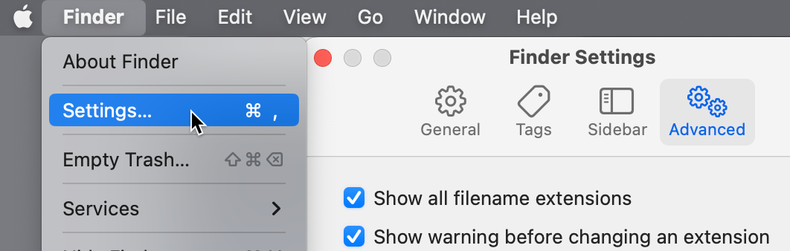
Preferences &gt; Advanced and check the box to *Show all filename
extensions*." /&gt;

Figure 2: On a Mac, go to Finder &gt; Preferences &gt; Advanced and
check the box to *Show all filename extensions*.

Make Your Own Copy of a Google Sheet
------------------------------------

In several chapters of this book, we share sample data with links to
Google Sheets, using settings that allow you to view—but not edit—the
original file. We want everyone to have access to the data, but do not
want anyone to accidentally modify the contents. Follow these simple
steps to make your own copy of a Google Sheet that you can edit, without
changing our version.

1.  Right-click on this [sample-students Google Sheets
    file](https://docs.google.com/spreadsheets/d/1FYTiLHfOI2caT2lkI4i8fGbhA-oKT_MSOP1vQWWC9MA)
    to open in a new tab. We set it to “View only” so that anyone on the
    internet can see the contents, but not edit them.

2.  Sign in to your Google account by clicking the blue button in the
    upper-right corner.

3.  Go to *File &gt; Make a Copy* to create a duplicate of this Google
    Sheet in your Google Drive, as shown in Figure
    <a href="#fig:file-make-copy">3</a>. You can rename the file to
    remove “Copy of…”.

Make a Copy\* to create your own version of this Google Sheet." /&gt;

Figure 3: Go to *File &gt; Make a Copy* to create your own version of
this Google Sheet.

1.  To keep your Google Drive files organized, click the *My Drive*
    button and the *New folder* button to create a folder for your data,
    before clicking *OK*, as shown in Figure
    <a href="#fig:my-drive-new-folder">4</a>. If you make a habit of
    saving every file in a folder, you’ll save a lot of time later when
    searching for the correct file.

Figure 4: Click the *My Drive* and *New folder* buttons to save your
work in a folder.

Your copy of the Google Sheet will be private to you only, by default.
In the next section we’ll learn about different options for sharing your
Google Sheet data with others.

Share Your Google Sheets
------------------------

If you’re working on a collaborative project with other people, Google
Sheets offers several ways to share your data online, even with people
who do not own a Google account. When you create a new Sheet, its
default setting is private, meaning only you can view or edit its
contents. In this section, you’ll learn how to expand those options
using the *Share* button.

1.  Log into your [Google Drive account](http://drive.google.com), click
    the *New* button, select *Google Sheets*, and create a blank
    spreadsheet. By default, a new Sheet will be private to you. You
    will need to name your file to proceed with next steps.

2.  Click the *Share* button in the upper-right corner, and your options
    will appear on the *Share with people and groups* screen, as shown
    in Figure <a href="#fig:share-screen">5</a>.

3.  In the top half of the screen, you can share access with specific
    individuals by typing their Google usernames into the *Add people
    and groups* field. For each person or group you add, on the next
    screen select the drop-down menu to choose if they can *View*,
    *Comment* on, or *Edit* the file. Decide if you wish to notify them
    with a link to the file and optional message.

4.  In the lower half of the screen, you can share access more widely by
    clicking on *Change to anyone with the link*. On the next screen,
    the default option is to allow anyone who has the link to *View* the
    file, but you can change this to allow anyone to *Comment* on or
    *Edit* it. Also, you can click *Copy link* to paste the web address
    to your data in an email or public website.

Figure 5: Click the *Share* button to grant access to individuals (top
half) or anyone with the link (bottom half).

Tip: If you don’t want to send people a really long and ugly Google
Sheet web address such as
`https://docs.google.com/spreadsheets/d/1FYTiLHfOI2caT2lkI4i8fGbhA-oKT_MSOP1vQWWC9MA`,
use a free link-shortening service. For example, by using our free
[Bitly.com](http://bitly.com) account and its handy [Chrome browser
extension](https://chrome.google.com/webstore/detail/bitly-unleash-the-power-o/iabeihobmhlgpkcgjiloemdbofjbdcic)
or [Firefox browser
extension](https://addons.mozilla.org/en-US/firefox/user/13352154/), we
can paste in a long URL and customize the back-end to something shorter,
such as [bit.ly/sample-students](https://bit.ly/sample-students), as
shown in Figure <a href="#fig:link-shortening">6</a>. If someone else
has already claimed your preferred custom name, you’ll need to think up
a different one. Beware that `bit.ly` links are case-sensitive, so we
prefer to customize the back-end in all lower-case to match the
front-end.

Figure 6: Use a free link-shortening service, such as Bitly.com, and
customize its back-end.

Now that you have different options for sharing a Google Sheet, let’s
learn how to upload and convert data from different formats.

Upload and Convert Data to Google Sheets
----------------------------------------

A common mistake to avoid when using Google Drive is failing to check
the hidden *Convert uploads* box. Checking this box automatically
transforms files such as Microsoft Excel sheets or Word documents into
Google Sheets or Google Docs format, which allows easier editing. Google
turns off this option by default on new accounts, and hides it inside
its Settings screen. But if you’re reading this page, you’ll learn how
to turn it on, and the benefits of doing so. Share this tip with your
family, friends, and co-workers—they’ll thank you!

1.  Find an Excel file you can use on your personal computer. If you
    don’t have one, click this [sample Excel data
    file](https://handsondataviz.org/data/data.xlsx) and save to
    download to your computer.

2.  Log into your [Google Drive](https://drive.google.com) account, and
    click the *Gear* symbol in the upper-right corner to open the
    Settings screen. Note that this global *Gear symbol &gt; Settings*
    appears at Google Drive level, *not* inside each Google Sheet.

3.  Check the box to *Convert uploaded files to Google Docs editor
    format*, as shown in Figure <a href="#fig:convert-uploads">7</a>,
    and click *Done*. This turns on the conversion setting globally,
    meaning it will convert all possible files that you upload in the
    future—including Microsoft Excel, Word, PowerPoint, and more—unless
    you turn it off.

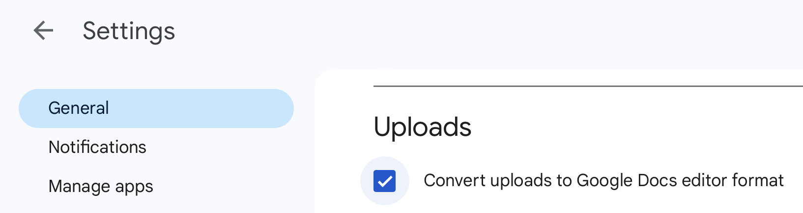

Figure 7: Inside your Google Drive settings (the gear symbol), check the
box to convert uploads.

1.  Upload a sample Excel file from your computer to your Google Drive.
    Either drag-and-drop it to the desired folder, as shown in Figure
    <a href="#fig:upload-file">8</a>, or use the *New* button and select
    *File upload*.

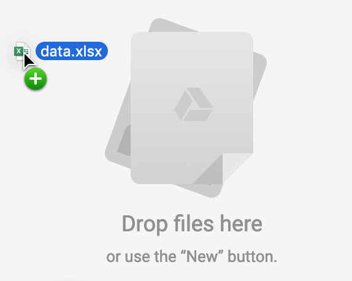

Figure 8: Drag-and-drop your sample Excel file into your Google Drive to
upload it.

If you forget to check the *Convert uploads* box, Google Drive will keep
uploaded files in their original format, and display their icons and
file name extensions such as `.xlsx` or `.csv`, as shown in Figure
<a href="#fig:drive-file-icons">9</a>.

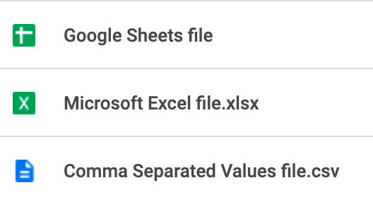

Figure 9: If you forget to convert uploads, Google Drive will keep files
in their original format with these icons.

Tip: Google Drive now allows you to edit Microsoft Office file formats,
but not all features are guaranteed to work across platforms. Also,
Google Drive now allows you to convert an uploaded Excel file into its
Google format by using the *File &gt; Save as Google Sheets* menu.

Tip: To convert individual files to your Google Drive, while keeping the
global conversion setting off, from inside any Google Sheet you can
select *File &gt; Import &gt; Upload*. But we recommend that most people
turn on the global conversion setting as described above, except in
cases where you intentionally use Google Drive to edit an
Excel-formatted file, and understand that some features may not work.

Download and Export to CSV or ODS formats
-----------------------------------------

In [Chapter 1: Choose Tools to Tell Your Data Story](choose.html), we
learned the advantages of selecting software tools that support data
migration, so that you can export your work to other platforms. Digital
technology always changes. Never upload important data into a tool if
you can’t easily get it out! In addition, better tools allow you to
export your work in open-data or generic file formats, not just
proprietary formats created primarily for a specific company’s software
platform.

When choosing a spreadsheet tool, test if and how it exports into these
two open data formats:

-   Comma Separated Values (.csv) export only one sheet of data, with no
    formulas or formatting, into a wide range of spreadsheet and
    visualization tools, including several featured in later chapters of
    this book.
-   OpenDocument Spreadsheet (.ods) exports a spreadsheet with multiple
    tabs of data, including basic formulas and formatting, into multiple
    spreadsheet tools, including Google Sheets, Microsoft Excel, and
    LibreOffice

In Google Sheets, go to *File &gt; Download As* to export in CSV format
(for only the current sheet) or ODS format (for a multi-tabbed
spreadsheet with most formulas and formatting), or other formats, as
shown in Figure <a href="#fig:sheets-download">10</a>.

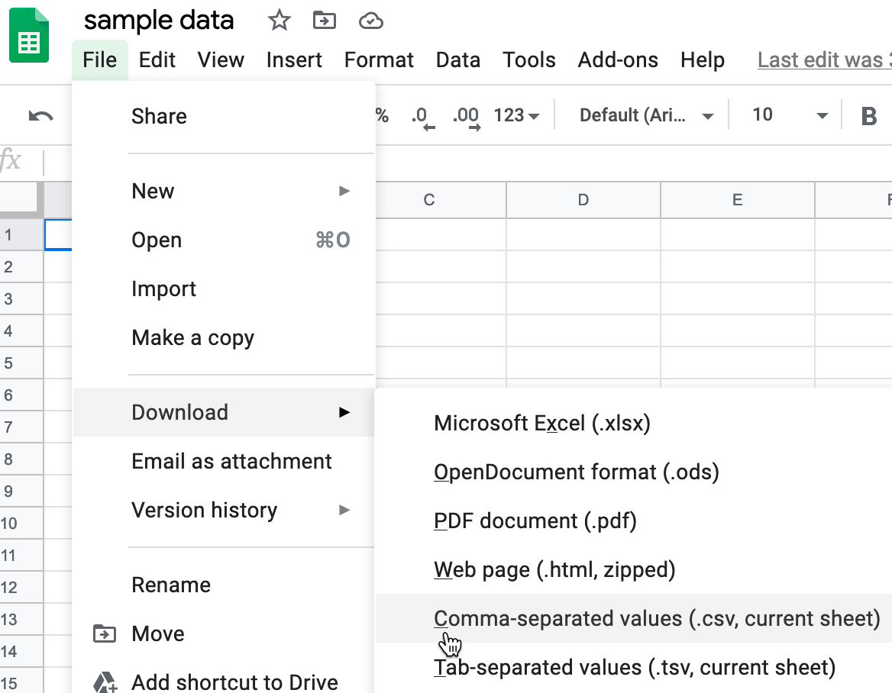
Download As\* to export data to other common formats." /&gt;

Figure 10: In Google Sheets, go to *File &gt; Download As* to export
data to other common formats.

In the downloadable LibreOffice and its Calc spreadsheet tool, select
*File &gt; Save As* to save in its native ODS format, or export in CSV,
XLSX, and other formats.

In the online Excel for free OneDrive or paid Office 365, the *File &gt;
Save As* menu allows you to save a file in its native XLSX format, or
export in ODS format, as shown in Figure
<a href="#fig:excel-online-save-as">11</a>. But online Excel lacks an
easy way to export data in CSV format.

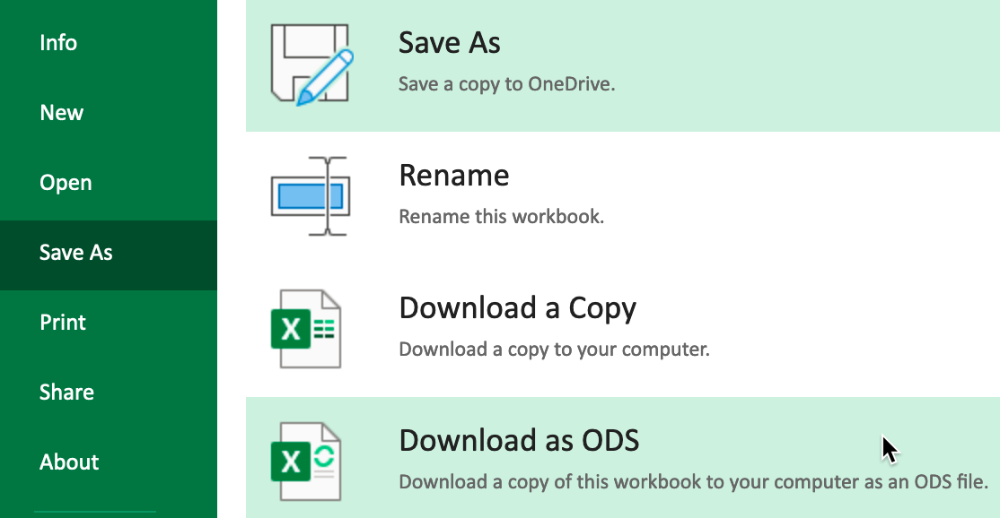

Figure 11: Online versions of Excel export into ODS format, but not CSV.

In the downloadable Excel for Windows and Mac, the *File &gt; Save As*
menu allows you to save a file in its native XLSX format, or export in
CSV, ODS, or other formats. But saving from Excel into CSV format
requires thinking through a few steps that sometimes confuse people.

1.  Remember that if you have an Excel workbook with multiple sheets and
    formulas, the CSV export will only save the *active* sheet (meaning
    the one you’re currently viewing), and only the *data* in that sheet
    (meaning none of the formulas you may have used for calculations).
    If you need to create a CSV version for other data visualization
    tools in this book, we advise that you first save a full-version of
    your Excel file, and then save a CSV file, using parallel file
    names:

-   data.csv
-   data.xlsx

1.  In the downloadable version of Excel, click on *File &gt; Save As*
    and select *CSV* format. If you see multiple CSV options, choose
    *CSV UTF-8*, which should work best across different computer
    platforms.

2.  If your Excel workbook contains multiple sheets, you may see a
    warning that it cannot be saved in CSV format, which only saves data
    contained in the active sheet. If you understand this, click *OK* to
    continue. On the next screen, Excel may warn you about “Possible
    data loss” when saving an Excel file in CSV format, which is true.
    That’s why we recommended that you first save the full-version of
    your Excel file before saving a CSV file.

TODO: I can add screenshots of any of the downloadable Excel steps
above, but I don’t think it’s necessary. Thoughts?

Once you’ve learned how to export your spreadsheet data into an open
format, you’re ready to migrate it into other data visualization tools
or platforms that we’ll introduce in later chapters of this book. Data
portability is key for ensuring that your charts and maps will last well
into the future.

Sort and Filter Data
--------------------

Spreadsheet tools help you delve into your data and lift its stories to
the surface. One of the most basic steps in organizing your data is to
*sort* the contents of an entire table by one column, such as
alphabetical order in a column of text, or highest-to-lowest order in a
column of numbers. A related method is to *filter* an entire table to
display only rows that contain certain values, such as a specific text
or numerical value among all of the other entries. While you could
manually sort or filter small datasets, spreadsheets become more
powerful when you work with hundreds or thousands of rows of data.

Let’s use a large sample file to learn how to sort and filter data.

1.  Open this [Google Sheet of New York City restaurant health
    inspection
    data](https://docs.google.com/spreadsheets/d/1WvEa46w8en5uWiMX7Jq6o02Q--wMHN2jGFOjD4sr73A/).
    It contains over 13,000 rows of data for inspections conducted in
    January 2020, where each row is a health violation. This is just a
    fraction of the full dataset available from the original source,
    [NYC Open
    Data](https://nycopendata.socrata.com/Health/DOHMH-New-York-City-Restaurant-Inspection-Results/43nn-pn8j).

2.  Login to your Google Sheets account, and go to *File &gt; Make a
    Copy* to create your own version that you can edit.

3.  Before sorting, click the upper-left corner of the sheet to select
    all cells, as shown in Figure
    <a href="#fig:sheets-select-all">12</a>. The entire sheet should
    become light blue to show you’ve selected all cells.

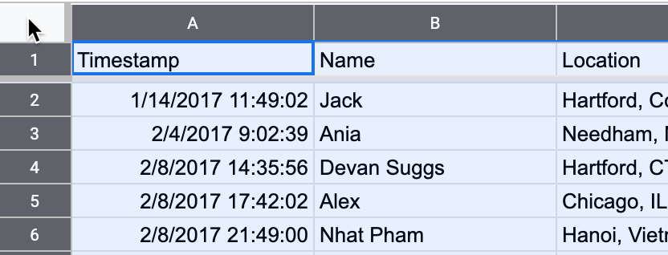

Figure 12: Click the upper-left corner to select all cells before
sorting.

Warning: If you forget to select all cells, you might accidentally sort
one column independently of the others, which would scramble your entire
dataset and make it meaningless. Always select all cells before sorting!

1.  Go to *Data &gt; Sort Range* to review all of your sort options. In
    the next screen, check the *Data has header row* box to view the
    column headers in your data. Let’s sort the *SCORE* column in
    ascending order (from A-Z), as shown in Figure
    <a href="#fig:sheets-sort-range">13</a>, to display the
    lowest-scoring restaurants at the top of the sheet.

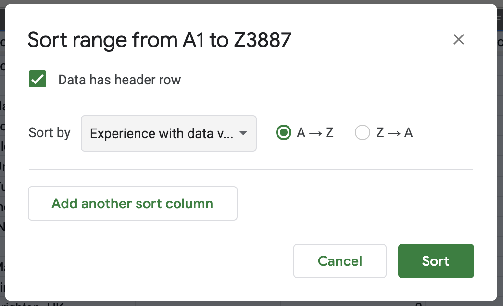
Sort Range*, check the header row box, and sort by *SCORE\* in ascending
order." /&gt;

Figure 13: Go to *Data &gt; Sort Range*, check the header row box, and
sort by *SCORE* in ascending order.

1.  Now let’s try filtering your sheet. Go to *Data &gt; Create a
    Filter*, which inserts downward arrows in each column header. Click
    on the downward arrow in the *BORO* column, and see options to
    display or hide rows of data. For example, click only the
    *Manhattan* boro, and unclick all of the other options, to display
    only rows with that name, as shown in Figure
    <a href="#fig:sheets-filter">14</a>.

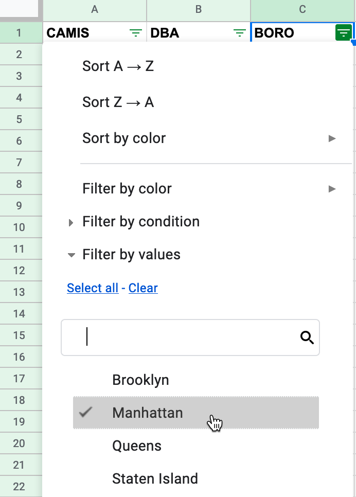
Create a Filter*, and in the *BORO\* column, select only *Manhattan*."
/&gt;

Figure 14: Go to *Data &gt; Create a Filter*, and in the *BORO* column,
select only *Manhattan*.

By sorting and filtering large spreadsheets, you can begin to focus on
key details in your data. Where should we *not* go out for lunch?

Calculate with Formulas and Functions
-------------------------------------

Spreadsheet tools can save you lots of time when you insert simple
formulas and functions to automatically perform calculations across
entire rows and columns of data. In this section you’ll learn how to
write a simple formula that adds up a column of numbers, then you’ll
insert built-in functions to show the sum and average.

1.  Open this Google Sheet of [Measles cases in three nations
    2010-18](https://docs.google.com/spreadsheets/d/15Q16jcgoIcoQ-UkAJ3nfQpU-4d_Hk6tJqEYoobmnxY0/),
    a subset of [data from the World Health
    Organization](https://www.who.int/data/gho/data/indicators/indicator-details/GHO/measles---number-of-reported-cases).
    Log into your Google Drive account, and go to *File &gt; Make a
    Copy* to edit your own version.

2.  Let’s calculate the total number of reported cases in 2010 by
    inserting a simple formula that adds up the cells for Canada,
    Mexico, and the US that year. Spreadsheet formulas begin with an `=`
    equal sign, and refer to specific cells and operations. Click on
    cell B5 and type in `= B2 + B3 + B4` then press *Return* or *Enter*.
    A total of 162 cases in 2010 will appear in the cell where you
    entered the formula.

3.  Now let’s speed up our work using the built-in `SUM` function to
    total up numbers for us. Click on column C5 and type in
    `=SUM(C2:C4)`, which calculates the sum of all of the cells between
    C2 and C4. then press *Return*. A total of 1,026 cases in 2011 will
    appear.

4.  Now let’s speed up our work even more by using the built-in
    click-and-drag tool to extend the `SUM` calculation across the row
    for each remaining year. Click in cell C5, and float your cursor
    over the dot in the bottom-right corner, which transforms your
    cursor into a crosshair symbol. Then click-and-drag your crosshair
    cursor from cell C5 to J5, which automatically copies and pastes the
    formula in each cell, and let go, as shown in Figure
    <a href="#fig:drag-calculation">15</a>.

<iframe src="images/02-spreadsheet/drag-calculation.gif" width="100%" height="300px">
</iframe>

Figure 15: Click on the bottom-right dot to transform your cursor into a
crosshair, then drag to paste the formula, as shown in this [animated
GIF](https://handsondataviz.org/images/02-spreadsheet/drag-calculation.gif).

1.  We can use another built-in function to calculate the average number
    of reported cases for each nation over time. Click in cell K2 and
    type in `=AVERAGE(B2:J2)` or select it if the tool suggests it. Then
    click the right-corner dot in cell K2 and drag downward to extend
    the calculation for the other rows.

Tip: Spreadsheet tools ignore empty cells when performing calculations.
In this example, the World Health Organization did not list any data for
the US in 2018.

Warning: When you save a spreadsheet in CSV format, your calculated
results will remain, but any formulas that created those results will
disappear from the CSV sheet. Keep the original in a spreadsheet format
as a reminder about how you constructed the formulas.

Spreadsheet tools contain many more functions to perform numerical
calculations and also to modify text. See more examples in the “Split
data into two or more columns” and “Combine columns into one” sections
in [Chapter 4: Clean Up Messy Data](clean.html). In the next section,
you’ll learn a more advanced spreadsheet method to regroup data with a
pivot table.

Regroup Data with Pivot Tables
------------------------------

Pivot tables are another powerful feature built into spreadsheet tools
to help you regroup or rearrange your data, hence the name “pivot.” In
this section we’ll start with a sheet that contains an anonymous partial
class roster for an online data visualization class we previously
taught. Each row represents an individual student, including their birth
year, gender, and country of origin. You’ll learn how to “pivot” this
individual-level data into a new sheet that cross-tabulates the number
of students by birth year and gender.

1.  Open this [Google Sheet of Sample
    Students](https://docs.google.com/spreadsheets/d/1FYTiLHfOI2caT2lkI4i8fGbhA-oKT_MSOP1vQWWC9MA),
    log into your Google Drive, and go to *File &gt; Make a Copy* to
    edit your own version.

2.  Go to *Data &gt; Pivot Table*, and on the next screen, select
    *Create* in a new sheet, as shown in Figure
    <a href="#fig:sheets-pivot-create">16</a>.

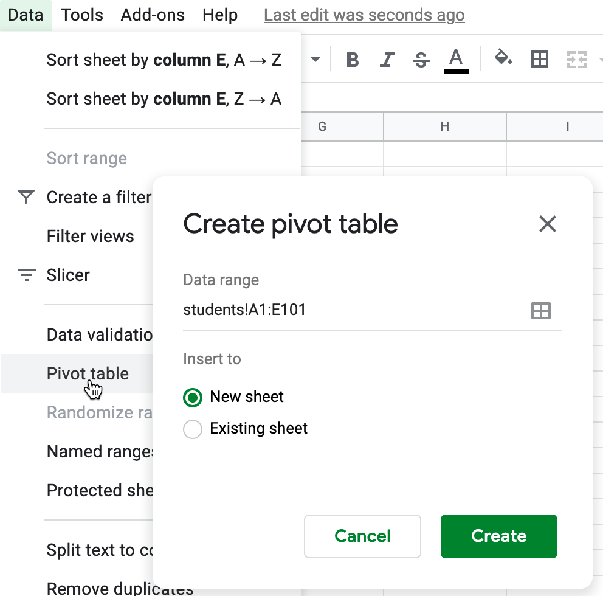
Pivot Table\*, and create in a new sheet." /&gt;

Figure 16: Go to *Data &gt; Pivot Table*, and create in a new sheet.

1.  In the *Pivot table editor* screen, you can regroup data from the
    first sheet by adding rows, columns, and values. First, click the
    Rows *Add* button and select *year*, which shows each of the unique
    entries for birth year in column A.

2.  Next, to count the number of students for each birth year, click the
    Values *Add* button and select *year* again. Initially, the pivot
    table will summarize by adding up the total of all birth years, but
    you don’t want that. Instead, change the *Summarize by* drop-down
    menu to *COUNT*, which shows the frequency for each row, as shown in
    Figure <a href="#fig:sheets-pivot-editor">17</a>.

<iframe src="images/02-spreadsheet/sheets-pivot-editor.gif" width="100%" height="1080px">
</iframe>

Figure 17: In the Google Sheets pivot editor, add *year* as a Row, and
add *year* again as a Value, but change *Summarize by* to *Count*, as
shown in this [animated
GIF](https://handsondataviz.org/images/02-spreadsheet/sheets-pivot-editor.gif).

Tip: *COUNT* summarizes numerical values, and *COUNTA* summarizes text
values.

1.  You can create more advanced pivot tables by adding a *Column*
    header, such as *gender*, to display a cross-tabulation of students
    by birth year and gender. Furthermore, you can also *Filter* the
    data, for example, to show only students who listed *US* as their
    country of origin.

While pivot tables may look a bit different across other spreadsheet
tools, the concept is similar. Learn more about how pivot tables work in
the [support pages for
LibreOffice](https://help.libreoffice.org/Calc/Creating_Pivot_Tables)
and [Microsoft
Excel](https://support.microsoft.com/en-us/office/create-a-pivottable-to-analyze-worksheet-data-a9a84538-bfe9-40a9-a8e9-f99134456576).
Click to download and save this [sample student data in CSV
format](https://handsondataviz.org/data/sample-students.csv) to your
computer to upload into either tool.

Now that you’ve learned how to regroup data with pivot tables, let’s
move on to another common task of matching data columns from different
sheets.

Match Columns with VLOOKUP
--------------------------

Spreadsheet tools also allow you to “look up” matching data from one
sheet and automatically paste it into another sheet, using the “VLOOKUP”
function. The “V” stands for “vertical” lookup, which means making
matches across columns, the most typical way to lookup data. In this
section you’ll learn how to write a function in one sheet that looks for
matching data in a second sheet, and pastes it into a new column in the
first sheet.

Here’s a common problem where “VLOOKUP” can save you lots of time.
Imagine two spreadsheets. The first sheet, which we saw in the previous
section, contains a list of students enrolled in a class, where each row
includes a two-letter code for their country of origin. But some
abbreviations may not be familiar to everyone. A second sheet contains a
list of all of the two-letter abbreviated codes, plus the full name of
each country, as shown in Figure <a href="#fig:vlookup-setup">18</a>.
Your goal is to “lookup” each student’s two-letter code in the second
sheet, and paste the full name of each country for each row in the first
sheet. Doing this manually would require lots of your time, but learning
how to use the VLOOKUP function will do the work for you automatically.

Figure 18: The problem: match each two-letter code in the left sheet
with the full country name in the right sheet.

1.  In one browser tab, open this [Google Sheet of Sample
    Students](https://docs.google.com/spreadsheets/d/1FYTiLHfOI2caT2lkI4i8fGbhA-oKT_MSOP1vQWWC9MA).
    In another tab, open this [Google Sheet of Country Codes
    2-letter](https://docs.google.com/spreadsheets/d/1iuImHkn2Aotf-0g6pcKv6e65QLWICjVHNUrcGfPxQNE).
    Log into your Google Drive, and go to *File &gt; Make a Copy* to
    create your own version of both sheets, so that you can edit them.

2.  Let’s simplify this two-file problem by copying all of the data into
    one Google Sheet. Go to the Country Codes sheet, select the
    *countries* tab, and go to *Copy to &gt; Existing spreadsheet*, and
    select *Sample Students,* as shown in Figure
    <a href="#fig:vlookup-copy">19</a>. Go back to the *Sample Students*
    sheet and you’ll see a new tab named *Copy of countries*.

Figure 19: Copy the *countries* data into the existing *Sample Students*
sheet.

1.  In the Sample Students sheet, in the *students* tab, click in cell
    E1 and type `country name.` This creates a new column header where
    lookup results will be automatically pasted.

2.  Click in cell E2 and type `=VLOOKUP` and Google Sheets will suggest
    that you complete the full formula in this format:

<!-- -->

    VLOOKUP(search_key, range, index, [is_sorted])

Here’s what each part means:

-   search\_key = The cell in Sheet 1 you wish to match.
-   range = At least two columns in Sheet 2 to search for your match and
    desired result.
-   index = The column in the Sheet 2 range that contains your desired
    result, where 1 = first column, 2 = second column, etc.
-   \[is\_sorted\] = Enter `false` to find exact matches only, which
    makes sense in this case. Otherwise, enter `true` if the first
    column of the Sheet 2 range is sorted and you will accept the
    closest match, even if not an exact one.

1.  Type in the full VLOOKUP formula or click on the relevant cells and
    columns to automatically enter it. Your formula should look similar
    to `=VLOOKUP(D2,'Copy of countries'!A:B,2,false)`, as shown in
    Figure <a href="#fig:vlookup-solution">20</a>, but may differ if you
    have different tab names.

Figure 20: Your VLOOKUP formula should look similar to this, depending
on your tab names.

Let’s break down each part of that formula, separated by commas:

-   D2 = The search\_key, the cell you want to match in the *students*
    tab.
-   *‘Copy of countries’!A:B* = The range, meaning you are searching for
    matches and results in all of columns A and B in the *Copy of
    countries* tab.
-   2 = The index, meaning your desired result appears in the 2nd column
    of the range above.
-   *false* = Display exact matches only.

1.  After you enter the full VLOOKUP formula, press *Enter* on your
    keyboard, and the result should display an exact match, if found. In
    this example, the student with country code `KR` should also display
    its full country name, `Korea, Republic of`. Float your cursor over
    the dot in the bottom-right corner of that cell to drag down the
    results.

While we used Google Sheets to demonstrate how to “lookup” matching data
in another spreadsheet column, the

Now that you understand how to use the VLOOKUP function to match columns
data columns across spreadsheets, the next section will introduce you to
the concept of a relational database, and when you might want to use
one.

Connect Sheets with Relational Database
---------------------------------------

In the previous section, you learned how the VLOOKUP function can search
for matching data in columns across spreadsheets and automatically paste
results. Building on that concept, let’s distinguish between a
spreadsheet and a relational database, and in what cases you might want
to use the latter.

A spreadsheet is sometimes called a “flat-file database” because all of
the records are stored in rows and columns in a single table. For
example, if your company kept track of all of your orders and customers
in a spreadsheet, the entries would appear like this:

    Order   Customer    Location
    1       Janice      New York
    2       Jean        Seattle
    3       Jim         Dallas
    4       Joe         Los Angeles
    5       Julius      Chicago
    6       Janice      New York
    7       Julius      Chicago

In a spreadsheet, every time a customer placed an order, their location
would need to be entered separately, which would mean lots of duplicated
information. Also, updates would requiring changing the same information
in multiple places in your spreadsheet.

By contrast, if your company used a relational database, you would
maintain two tables—one for orders and one for customers—with links
between them, like this:

    Order       Customer
    1           Janice  
    2           Jean
    3           Jim
    4           Joe    
    5           Julius
    6           Janice
    7           Julius

    Customer    Location
    Janice      New York
    Jean        Seattle
    Jim         Dallas
    Joe         Los Angeles
    Julius      Chicago

When someone’s address changed, in a relational database it would only
need to be updated in one place—the customer table—and only one time.
Also, by separating data into different tables, it would be easier to
add up your total customers without counting duplicates.

If you’re responsible for managing data tables with relationships
between them, especially one-to-many relationships (such as where Janice
and Julius each place multiple orders), consider the pros and cons of
working with a relational database. Years ago, relational databases
required complex software that was not easy to set up. But a newer
generation of tools such as [AirTable](http://airtable.com) enable you
to create relational databases in your web browser with up to 1,200 free
records (and more with the paid version), using existing templates (or
design your own), and collaborative editing with your co-workers.
Furthermore, Airtable supports data migration by allowing you to export
all of your records in CSV format.

While the details of setting up a relational database are beyond the
scope of this chapter, it’s important to understand the conceptual
difference between a “flat-file” spreadsheet and a collection of data
tables with linked relationships. In the next section, we’ll describe
how to collect data using online forms, a feature found in Google
Sheets, Airtable, and several other tools.

Collect Data with Online Forms
------------------------------

No doubt, everyone with an email address has been asked to fill out at
least one online form. We promise *not* to send you another! But if you
need to collect simple data from people who communicate digitally with
you, sometimes the easiest solution is to send them an online form that
compiles their responses in a data table, which can be much faster than
re-entering information from paper forms.

If you already have a Google Drive account, one tool that many people
overlook is Google Forms, which is partially hidden under *New &gt; More
&gt; Google Forms*, as shown in Figure <a href="#fig:forms-new">21</a>.

More\* menu." /&gt;

Figure 21: The Google Forms tool is partially hidden in the Google Drive
*New &gt; More* menu.

The Google Forms *Questions* tab allows you to request different types
of responses: short- and paragraph-length answers, multiple choice,
checkboxes, file uploads, etc., as shown in Figure
<a href="#fig:forms-questions">22</a>. Click the *Preview* (eyeball)
button to see how your form will appear to users, then click the *Send*
button to distribute via email, a link, or an iframe. You can learn more
about how to use the latter in [Chapter 7: Embed On Your
Web](embed.html).

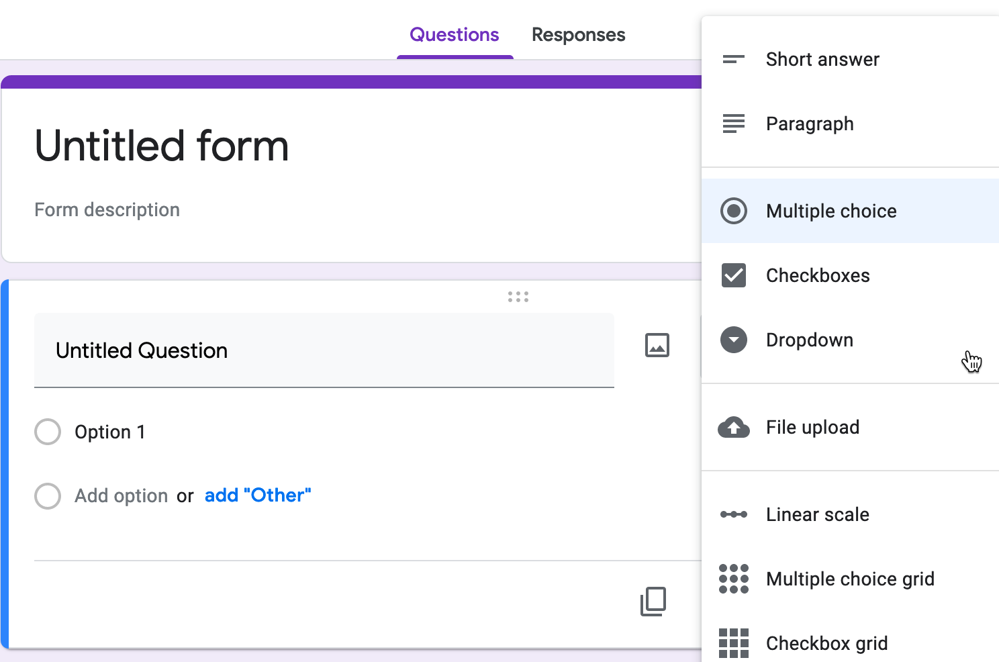

Figure 22: The Google Forms *Questions* tab allows you to request
different types of responses.

The Google Forms *Responses* tab includes a button to open answers you
receive in a linked Google Sheet, as shown in Figure
<a href="#fig:forms-responses">23</a>. As you’ve learned in this
chapter, data becomes more powerful when you can share, organize, and
analyze it using spreadsheet tools to help reveal and tell its
underlying stories.

Figure 23: The Google Forms *Responses* tab includes a button to open
answers in a linked Google Sheet.

**Summary** If you’re one of the many people who “never really learned”
about spreadsheets in school or on the job, or if you’ve taught yourself
bits and pieces along the way, we hope that this chapter has
successfully introduced or refreshed your skills. All of the subsequent
chapters in this book, especially those on designing interactive charts
and maps, require a basic level of familiarity with spreadsheets. In
addition to serving as incredible time-savers when it comes to tedious
data tasks, the spreadsheet tools and methods featured above are
designed to help you share, sort, calculate, as well as more advanced
skills in pivoting tables and matching with lookup tables, with the
broader goal of telling your data stories.

The next chapter describes strategies for finding data, particularly on
open data sites operated by governmental and non-profit organizations,
where you’ll also need spreadsheet skills to download information in an
organized way. See additional spreadsheet skills in later chapters of
the book. [Chapter 4: Clean Up Messy Data](clean.html) demonstrates how
to find and replace, split data into columns, and combine columns of
data (such as when you need the street address, city, and postal code
all in one line). [Chapter 11: Transform Your Map Data](transform.html)
also features more advanced spreadsheet skills and tools, such as how to
geocode addresses, pivot address points into polygons, and how to
normalize data to create more meaningful polygon maps.

<!--chapter:end:02-spreadsheet.Rmd-->

Find and Know Your Data
=======================

In the early stages of a visualization project, you will likely ask two
important and related questions: *Where can I find data?* and when I do,
*How do I know what it really means?* If you skip over these questions
and leap too quickly into constructing charts and maps, you run the risk
of creating meaningless, or perhaps worse, misleading visualizations.
This chapter breaks down both of these broad questions in greater
detail, and provides concrete strategies to [recognize bad
data](bad.html), [source your data](source.html), navigate [public
versus private data](public.html), and search a growing number of [open
data repositories](opendata.html).

When searching for data, your newest best friend may be a librarian.
Sometimes a data-smart librarian happens to know exactly where to locate
a dataset that you’ve been seeking for day. But their more valuable
skill is guiding us on *how to search* by reflecting on the types of
questions librarians commonly ask:

1.  What types of organizations may have collected or published the data
    you seek? If a governmental organization may have been involved,
    then at what level (national, state/provincial, regional, or
    municipal), and which branch or agency? Or might data have been
    compiled by a non-governmental organization, such as academic
    institutions, journalists, for-profit corporations, or non-profit
    groups? Figuring out which organizations might have collected the
    data can help point you to the digital or print materials they
    typically publish, and most appropriate tools to focus your search
    in that particular area.

2.  Have any prior publications drawn on similar datasets, and if so,
    how can we trace their sources? Some of our best data visualization
    ideas began while reading textual evidence or noticing a table in a
    print publication or outdated web page, which convinced us that the
    data existed *somewhere*. With these valuable leads, librarians can
    help you track down source notes on where the data originated, or
    sometimes find more up-to-date versions of the data.

3.  What level(s) of data are available? Is information disaggregated by
    individual cases or aggregated into larger groups? Librarians can
    help us to decipher how and why different organizations publish data
    in different formats. For example, US Census seeks to collect data
    every ten years about each person residing in the nation, but under
    the law, this individual-level data is confidential and not released
    to the public for 72 years. You can look up individual census data
    for 1940 and earlier decades at the [US National
    Archives](https://www.archives.gov/research/genealogy/census/about)
    and other websites. But the US Census publishes current data for
    larger areas, such as neighborhood-level block groups, census
    tracts, cities, and states, by aggregating individual records into
    data tables, and suppressing small-numbered cells to protect
    people’s privacy. Librarians can help us understand organization’s
    guidelines on when and how they make data available at different
    levels.

If your search has produced some results, the next step is to get to
know your data. Closely examine your files and ask questions about their
origin, meaning, and limitations:

1.  Who collected and published this data, and for what purpose? Since
    individuals and organizations require time and resources to do this
    work, seek to clarify their motivations and assumptions, both
    explicit and implicit ones. Who was the intended audience of the
    work? Whose perspectives does the data privilege? Whose stories
    remain untold? As practitioners of data visualization, we strongly
    favor evidence-based reasoning over its less-informed alternatives.
    But we also caution against embracing so-called data objectivity.
    Numbers are *not* neutral, and we always need to consider the
    broader contexts in which people created them.

2.  What do the data labels *really* mean? Most spreadsheets contain
    abbreviated column headers, particularly due to software character
    limits, but some questions of data interpretation run much deeper.
    For example, socially-constructed labels such as “race” or “gender”
    may not clarify how the creators defined their terms, or what role
    respondents played in the collection process. Even seemingly
    objective labels such as “income” or “population” or “elevation” may
    not adequately describe exactly what was counted, how it was
    measured, and the margins of error. Better-quality datasets include
    detailed definitions of the collection process to help you to
    understand the decisions made by its creators. If not, then your
    next best option may be to go out into the field, if feasible, and
    directly observe how the data is measured and collected.

To be clear, you may never *truly know* your data if it was collected by
someone else, particularly a different person in a distant place or
time. But don’t let that philosophical obstacles stop you from asking
good questions about the origins and limitations of your data. Only by
clarifying what we know—and what we don’t know—can we create meaningful
data visualizations that bring their inner-stories to life.

Recognize Bad Data
------------------

A vital skill needed by all data visualization creators is the ability
to recognize bad data. If you fail to catch a problem in your data at an
early stage, someone else may discover it later, which could diminish
the credibility of all of your work. Fortunately, members of the data
visualization community have shared multiple examples of issues we’ve
encountered in our work, and newer members will benefit from our
embarrassing mistakes. One popular crowd-sourced compilation by data
journalists was [The Quartz Guide to Bad
Data](https://github.com/Quartz/bad-data-guide), last updated in 2018,
which includes several of these helpful warning signs:

Watch out for spreadsheets with “bad data”:

-   Missing values: If you see blank or “null” entries, does that mean
    data was not collected? Or maybe a respondent did not answer? If
    you’re unsure, find out from the data creator. Also beware when
    humans enter a `0` or `-1` to represent a missing value, without
    thinking about the consequences of running calculations.
-   Missing leading zeros: The US Census Bureau lists every place using
    a FIPS code, and some spreadsheet users may accidentally convert
    text to numbers and strip out the leading zeroes. For example, the
    FIPS code for Los Angeles County is `037`, but someone might
    accidentally strip out the leading zero and convert it to `37`,
    which represents North Carolina.
-   65536 rows or 255 columns: These are the maximum number of rows
    supported by older-style Excel spreadsheets, or columns supported by
    Apple Numbers spreadsheet, respectively. If your spreadsheet stops
    exactly at either of these limits, you probably have only partial
    data.
-   Inconsistent date formats: For example, November 3rd, 2020 is
    commonly entered in spreadsheets by Americans as `11/3/2020`
    (month-date-year), while many others around the globe type
    `3/11/2020` (date-month-year). Check your source.
-   Dates such as January 1st 1900, 1904, or 1970: These are default
    timestamps in Excel spreadsheets and Unix operating systems, which
    may indicate the actual date was blank or overwritten.
-   Dates similar to `43891`: When you type `March 1` during the year
    2020 into Microsoft Excel, it automatically displays as `1-Mar`, but
    is saved using Excel’s internal date system as `43891`. If someone
    converts this column from date to text format, you’ll see Excel’s
    5-digit number, not the dates you’re expecting. According to a [2016
    report in the Washington
    Post](https://www.washingtonpost.com/news/wonk/wp/2016/08/26/an-alarming-number-of-scientific-papers-contain-excel-errors/),
    a team of geneticists detected a surprisingly high number of related
    Excel errors in papers published in leading scientific journals.

Source Your Data
----------------

Another way to reduce “bad data” issues is to clarify the source every
time you download or create a new spreadsheet file. Add details about
where the data came from, so that someone other than you, several years
in the future, has sufficient information to understand its origin and
limitations.

The first step is to label every data file that you download or create.
All of us have experienced bad file names like these:

-   data.csv
-   download.xls
-   data2020.xlsx

Write a short but meaningful file name. While there’s no perfect system,
a good strategy is to abbreviate the source (such as `census` or
`worldbank` or `eurostat`), with topic keywords, and a date or range. If
you or co-workers will be working on different versions of a downloaded
file, include the current date in YYYY-MM-DD (year-month-date) format.
Replace blank spaces with dashes (`-`) or underscores (`_`). Better file
names look like this:

-   town-demographics-2019-12-02.xls
-   census2010\_population\_by\_county.csv
-   eurostat-1999-2019-CO2-emissions.xlsx

The second step is to save more detailed source notes about the data on
a separate tab inside the spreadsheet (which works for multi-tab
spreadsheet tools such as Google Sheets, LibreOffice, and Excel). Add a
new tab named *notes* that describes the origins of the data, a longer
description for any abbreviated labels, and when it was last updated, as
shown in Figure <a href="#fig:sheets-with-tabs">24</a>. Add your own
name and give credit to collaborators who worked with you. For CSV
files, which do not support multi-tabs sheets, create a text file using
a parallel file name.

Figure 24: Create separate spreadsheet tabs for data, notes, and backup.

A third step is to make a backup of the original data before cleaning or
editing it. For a simple one-sheet file in a multi-tab spreadsheet tool,
right-click on the tab containing the data to make a duplicate copy in
another tab, also shown in the preceding figure. Clearly label the new
tab as a backup and leave it alone! For CSV files or more complex
spreadsheets, create a separate backup file.

Make a habit of using these three sourcing strategies—filenames, notes,
and backups—to reduce your chances of making “bad data” errors and to
increase the credibility of your data visualizations. In the next
section, we’ll address a related set of questions you should ask
yourself regarding public versus private data.

Public versus Private Data
--------------------------

In addition to asking questions about the origins and limitations of
your data, it’s also important for you to be aware of important
distinctions between public versus private data, and their implications
for designing your visualizations. This section offers some general
observations about data privacy based on our context in the United
States. Since we are not lawyers (thank goodness!), please consult with
legal experts for advice about your specific case.

Here’s what’s most important—and confusing—about access to data in the
US. Individual-level data is often considered private, except in certain
areas where our governmental process has determined that broader
interests are served by making it public. First, here are two examples
where individual-level data generally remains private:

-   Patient-level health data is generally protected under the [Privacy
    Rule of the Health Insurance Portability and Accountability
    Act](https://en.wikipedia.org/wiki/Health_Insurance_Portability_and_Accountability_Act#Privacy_Rule),
    commonly known as HIPAA. But public health officials regularly
    aggregate individual patient records into larger anonymized public
    datasets to track progress about various illnesses.
-   Student-level education data is generally protected under the
    [Family Educational Rights and Privacy
    Act](https://en.wikipedia.org/wiki/Family_Educational_Rights_and_Privacy_Act),
    commonly known as FERPA. But education officials regularly aggregate
    individual student records into larger anonymized public datasets to
    track the progress of schools, districts, and states.

But here are other examples where our government has determined that a
broader interest is served by making individual-level data available to
the public:

-   Individual contributions to political candidates are public. You can
    search donors by name and address in this [US Federal Election
    Commission public
    database](https://www.fec.gov/data/receipts/individual-contributions/),
    as well as other state-level sites.
-   Individual salaries for officers of tax-exempt organizations are
    public. You can search by name across a digitized database of
    Internal Revenue Service (IRS) 990 forms that tax-exempt
    organizations are required to submit on several platforms, such as
    ProPublica’s [Nonprofit
    Explorer](https://projects.propublica.org/nonprofits).
-   Individual property ownership records are public, and increasingly
    online in many locations. For example, one company provides a [US
    public records directory](https://publicrecords.netronline.com/)
    with links to local government property records, where available.
    Follow the links to search the value of the home owned by the first
    author in West Hartford, Connecticut, how much he and his spouse
    paid for it, the number of bathrooms, and so forth.
-   Individual police officer reports regarding “use of force” are
    public by New Jersey state law. But no one could easily search these
    local police department records until a team of journalists from NJ
    Advance Media created a public database, [The Force
    Report](https://force.nj.com/), where anyone can look up individual
    officers and investigate patterns of violence.

Also, the US federal government is subject to the [Freedom of
Information
Act](https://en.wikipedia.org/wiki/Freedom_of_Information_Act), which
enables people to submit a “FOIA” request to obtain certain types of
public records to improve government transparency. Many states and their
municipalities are subject to related FOIA laws, which are listed by
non-profit organizations such as the [National Freedom of Information
Coalition](https://www.nfoic.org/). While some government agencies
routinely delay or reject FOIA requests, others have learned that
fighting against public information can be expensive, and have begun to
pro-actively share more information on open data repositories.

Open Data Repositories
----------------------

Over the past decade, an increasing number of governmental and
non-governmental organizations have begun to publicly share data through
open data repositories. While some of these datasets were previously
available as individual files on isolated websites, these growing
networks have made open data easier to find, enabled more frequent
updates, and sometimes have allowed live interaction. Open data
repositories often include these features:

-   View and Export: At minimum, open data repositories allow users to
    view and export data in common spreadsheet formats, such as CSV,
    ODS, and XLSX. Some repositories also provide geographical boundary
    files for creating maps.
-   Built-in Visualization Tools: Several repositories offer built-in
    tools for users to create interactive charts or maps on the platform
    site. Some also provide code snippets for users to embed these
    built-in visualizations into their own websites, which you’ll learn
    more about in [Chapter 7: Embed on Your Web](embed.html).
-   Application Programming Interface (APIs): Some repositories provide
    endpoints with code instructions that allow users to pull data
    directly from the platform into an external site or online
    visualization. When repositories continuously update data and
    publish an API endpoint, it can be an ideal way to display “nearly
    live” data in your visualization, which you’ll learn more about in
    [Chapter 10: Leaflet Map Templates](leaflet.html).

Due to the recent growth of open data repositories, especially in
governmental policy and scientific research, there is no single website
that lists all of them. Instead, we briefly mention just a few of the
sites we turn to when hunting for types of data that may interest our
readers, while acknowledging that we could have added many others:

TODO: Decide which links to include, remove, or others to add below….

United States open data:

-   [Data.gov](https://www.data.gov/), the official repository for US
    federal government agencies.
-   [Data.census.gov](https://data.census.gov), the main platform to
    access US Census Bureau data. The Decennial Census is a full count
    of the population every ten years, while the American Community
    Survey (ACS) is an annual sample count that produces one-year,
    three-year, or five-year estimates for different census geographies,
    with margins of error.
-   [Open Data Network](https://www.opendatanetwork.com/) directory of
    primarily US state and municipal open data platforms by Socrata

International open data:

-   [Eurostat](https://ec.europa.eu/eurostat), the statistical office of
    the European Union
-   [Global Open Data Index](https://index.okfn.org/dataset/) by the
    Open Knowledge Foundation
-   [Google Public Data](https://www.google.com/publicdata/directory)
-   [openAfrica](https://africaopendata.org/) by Code for Africa
-   [Open Data Inception](https://opendatainception.io/) a map-oriented
    global directory
-   [World Bank Open Data](https://data.worldbank.org/)

In addition, students, staff, and faculty at better-resourced
institutions of higher education also may have access to a paid library
subscription to “closed” data repositories:

-   [Social Explorer](https://www.socialexplorer.com/) includes decades
    of demographic, economic, health, education, religion, and crime
    data for local and national geographies, primarily for the US,
    Canada, and Europe. Previously, some access was public, but now
    requires paid subscription or 14-day free trial.
-   IPUMS NHGIS?
-   more?

**Summary**

This chapter reviewed two broad questions that everyone should ask
during the early stages of their visualization project: *Where can I
find data?* and *How do I know what it really means?* We broke down both
questions into more specific parts to develop your knowledge and skills
in recognizing bad data, sourcing the origins of your data,
distinguishing between public versus private data, and navigating the
growing number of open data repositories. As you leap into the next few
chapters on cleaning data and creating interactive charts and maps,
remember these lessons as you strive to create meaningful
visualizations.

<!--chapter:end:03-find.Rmd-->

Clean Up Messy Data
===================

More often than not, datasets will be messy and hard to visualize right
away. They will have missing values, various spelling of the same
categories, dates in different formats, text in numeric-only columns,
multiple things in the same columns, and other unexpected things (see
Figure <a href="#fig:clean-up-messy-data">25</a> for inspiration). Don’t
be surprised if you find yourself spending longer cleaning up data than
actually analyzing and visualizing it—it is often the case for data
analysts.

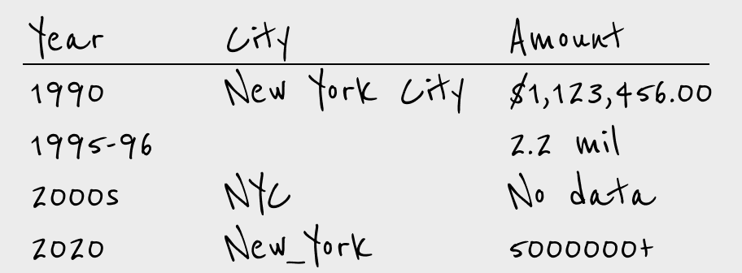

Figure 25: More often than not, raw data looks like this.

It is important to learn several tools in order to know which one to use
to clean your data efficiently. We will start by looking at fairly basic
data cleanup using Google Sheets. Keep in mind that the same principles
(and in most cases even the same formulas) can be use in Microsoft
Excel, LibreOffice Calc, Mac’s Numbers, or other spreadsheet packages.

We will then show you how to extract table data from PDF documents using
a free tool called Tabula. Tabula is used by data journalists and
researchers worldwide to analyze government spendings, procurement
records and all sorts of other datasets that get trapped in PDFs.

At the end, we will introduce OpenRefine, an extremely powerful and
versatile tool to clean up the messiest spreadsheets, such as those
containing dozens of misspelled versions of universities or town names.

Clean Data with Spreadsheets
----------------------------

Let’s take a look at some techniques to clean up data directly in your
favorite spreadsheet tool. We will use Google Sheets as an example, but
the same principles will apply to most other software packages, such as
Excel, Calc, or Numbers.

#### Find and Replace with a blank

A common problem with census data is that geographic names contain
unnecessary words. For example, your data can look something like that:

    Hartford town
    New Haven town
    Stamford town

But you want a clean list of towns, either to display in a chart, or to
merge with a different dataset:

    Hartford
    New Haven
    Stamford

Here’s one quick solution: In any spreadsheet tool, use the Find and
Replace command to remove unwanted characters. You can download our
[sample file](data/find-replace-town-geonames.csv), which contains 169
Connecticut towns and their population, for the exercise.

1.  Select the column you want to modify by clicking on the column
    header. If you don’t, you will be searching and replacing in the
    entire spreadsheet.
2.  From *Edit* menu, choose *Find and replace* item. You will see the
    window like is shown in Figure
    <a href="#fig:sheets-find-replace">26</a>.
3.  In the *Find* field, type `town`, without quotation marks and
    leaving a space before the word. If you don’t leave the space, you
    will accidentally remove *town* from *Newtown*, and you will end up
    with trailing spaces which can cause troubles in the future.
4.  Leave the *Replace with* field blank.
5.  *Search* field should be set to the range you selected in step 1, or
    *All sheets* if you didn’t select anything.
6.  You have the option to *match case*. If checked, `town` and `Town`
    and `tOwN` will be treated differently. For our purpose, you can
    leave *match case* unchecked.
7.  Press the *Replace all* button. Since this sample file contains 169
    towns, the window will state that 169 instances of “town” have been
    replaced.

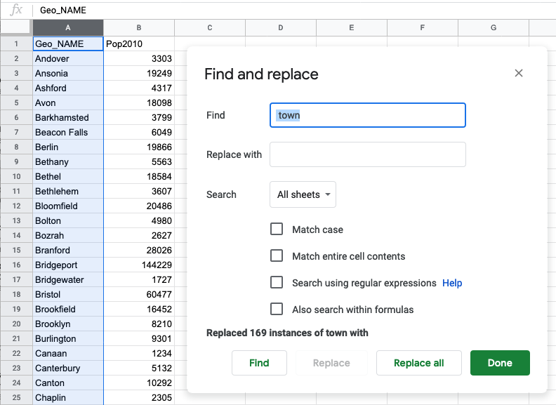

Figure 26: Find and Replace window in Google Sheets.

#### Split data into two or more columns

Sometimes multiple pieces of data appear in a single cell, such as names
(`John Doe`), coordinate pairs (`40.12,-72.12`), or addresses
(`300 Summit St, Hartford, CT, 06106`). For your analysis, you might
want to split them into separate entities, so that your *FullName*
column (with `John Doe` in it) becomes *FirstName* (`John`) and
*LastName* (`Doe`) columns, coordinates become *Latitude* and
*Longitude* columns, and your *FullAddress* column becomes 4 columns,
*Street*, *City*, *State*, and *Zip* (postcode).

##### Example 1

Let’s begin with a simple example of coordinate pairs. You can use our
[sample file](data/split-coordinate-pairs.csv), which is a collection of
latitude-longitude pairs separated by a comma, with each pair on a new
line.

1.  Select the data you wish to split, either the full column or just
    several rows. Note that you can only split data from one column at a
    time.
2.  Make sure there is no data in the column to the right of the one
    you’re splitting, because all data there will be written over.
3.  Go to *Data* and select *Split text to columns*, as in Figure
    <a href="#fig:sheets-split">27</a>.
4.  Google Sheets will try to guess your separator automatically. You
    will see that your coordinates are now split with the comma, and the
    Separator is set to *Detect automatically* in the dropdown. You can
    manually change it to a comma (`,`), a semicolon (`;`), a period
    (`.`), a space character, or any other custom character (or even a
    sequence of characters — more about that in Example 2 of this
    section).
5.  You can rename columns into *Longitude* (first number) and
    *Latitude* (second number).

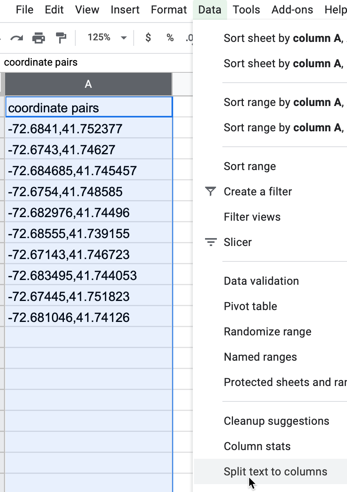 Split
text to columns to automatically separate data." /&gt;

Figure 27: Select Data &gt; Split text to columns to automatically
separate data.

##### Example 2

Now, let’s look at a slightly more complicated example. Imagine your
dataset is structured as follows:

    | Location                           |
    | 300 Summit St, Hartford CT--06106  |
    | 1012 Broad St, Hartford CT--06106  |
    | 37 Alden St, Hartford CT--06114    |

Each cell contains a full address, but you want to split it into four
cells: street address (300 Summit St), city (Hartford), state (CT), and
zipcode (06106). Notice that the separator between the street and the
rest of the address is a comma, a separator between the city and state
is a space, and there are two dash lines between state and zipcode.

1.  Start splitting left to right. So your first separator will be a
    comma. Select your column (or one or more cells within that column),
    and go to *Data* &gt; *Split text to columns*.
2.  Google Sheets should automatically split your cell into two parts,
    `300 Summit St` and `Hartford CT--06106`, using comma as a
    separator. (If it didn’t, just select *Comma* from the dropdown menu
    that appeared).
3.  Now, select only the second column and perform *Split text to
    columns*. You will see that the city is now separate from the state
    and zipcode, and Google Sheets chose space as a separator (if it
    didn’t, choose *Space* from the dropdown menu).
4.  Next, select only the third column and perform *Split text to
    columns* again. Google Sheets won’t recognize `--` as a separator,
    so you will have to manually select *Custom*, type `--` in the text
    field, and hit Enter. You should now have four columns.

Tip: Google Sheets will treat zipcodes as numbers and will delete
leading zeros (so 06106 will become 6106). To fix that, select the
column, and go to *Format &gt; Number &gt; Plain text*. Now you can
manually re-add zeros. If your dataset is large, consider concatenating
0s using the formula introduced in [Combine separate columns into
one](#combine-separate-columns-into-one).

#### Combine separate columns into one

Now, let’s see how to perform the reverse action. Imagine you receive
address data in separate columns, formatted like this:

    | Street        | City        | State      | Zip        |
    | 300 Summit St | Hartford    | CT         | 06106      |

The data comes is four columns: street address, city, state, and
zipcode. Let’s say your mapping tool requires you to combine all of this
terms into one location column, like that:

    | Location                            |
    | 300 Summit St, Hartford, CT 06106   |

You can write a simple formula to combine (or concatenate) terms using
ampersands (`&`) as cells values connectors, and quoted spaces (`" "`),
or spaces with commas (`", "`), or a dash with spaces on both sides
(`" - "`), or anything else as term separators.

For example, imagine that a spreadsheet contains an address that is
separated into four columns—*Address, City, State,* and *Zip*—as shown
in columns A-D in Figure <a href="#fig:sheets-combine">28</a>. In column
E, you can add new header named *Location* and insert a formula in this
format, to combine the items using ampersands (`&`) and separating them
with quoted spaces (`" "`), like this: `=A2&" "&B2&" "&C2&" "&D2`

Figure 28: Use ampersands to combine items and separate them with
spaces.

You are now able to split data to columns using custom separators, and
concatenate values from different cells into one. But what if your table
is trapped inside a PDF? In the next section, we will introduce Tabula
and show you how to convert tables from PDF documents into tables that
you can analyze in Google Sheets, Microsoft Excel, or similar packages.

Extract Tables from PDFs with Tabula
------------------------------------

It sometimes happens that the dataset you are interested in is only
available as a PDF document. Don’t despair, you can *likely* use Tabula
to extract tables and save them as CSV files.

Tabula is a free tool that runs on Java, and is available for Mac,
Windows, and Linux computers. It runs on your local machine and does not
send your data to the cloud, so you can also use it for sensitive
documents.

Note: Keep in mind that PDFs generally come in two flavors, image-based
and text-based. You know your PDF is text-based if you can use cursor to
select and copy-paste text. These are great for Tabula. Image-based PDFs
are those that were created from scanning documents. Before they can be
processed with Tabula, you will need to use an optical character
recognition (OCR) software, such as Adobe Acrobat, to create a
text-based PDF.

### Set Up Tabula

[Download the newest version of Tabula](https://tabula.technology/). You
can use download buttons on the left-hand side, or scroll down to the
*Download & Install Tabula* section to download a copy for your
platform.

Unlike most other programs, Tabula does not require installation. Just
unzip the downloaded archive, and double-click the icon. If prompted
with a security message (such as “Tabula is an app downloaded from the
internet. Are you sure you want to open it?”), follow the instruction to
proceed (on a Mac, click *Open*; you might have to go to System
Preferences &gt; Security & Privacy, and resolve the issue there).

Your default system browser should open, like shown in Figure
<a href="#fig:tabula-welcome">29</a>. The URL will be something like
`http://127.0.0.1:8080/`, meaning Tabula is running on your local
machine. 127.0.0.1, also known as `localhost`, is the hostname for your
machine. `8080` is called port (it’s okay if you see a different
port—most likely because 8080 was taken by some other program running on
your computer). If for any reason you decide to use a different browser,
just copy-paste the URL.

Figure 29: Tabula welcome page.

### Load a PDF and Autodetect Tables

Since the beginning of the Covid-19 pandemic, the Department of Public
Health in Connecticut has been issuing daily PDFs with case and death
count by town. For the demonstration, we will use [one of those
PDFs](data/ct-dph-covid-2020-05-31.pdf) from May 31, 2020.

1.  Select the PDF you want to extract data from by clicking the blue
    *Browse…* button.
2.  Click *Import*. Tabula will begin analyzing the file.
3.  As soon as Tabula finishes loading the PDF, you will see a PDF
    viewer with individual pages. The interface is fairly clean, with
    only four buttons in the header.
4.  The easiest first step is to let Tabula autodetect tables. Click the
    relevant button in the header. You will see that each table is
    highlighted in red, like shown in Figure
    <a href="#fig:tabula-autodetect">30</a>.

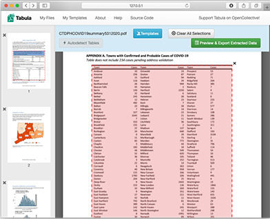

Figure 30: Selected tables are highlighted in red.

### Manually Adjust Selections and Export 

1.  Click *Preview & Export Extracted Data* green button to see how
    Tabula thinks the data should be exported.
2.  If the preview tables don’t contain the data you want, try switching
    between *Stream* and *Lattice* extraction methods in the
    left-hand-side bar.
3.  If the tables still don’t look right, or you with to remove some
    tables that Tabula auto-detected, hit *Revise selection* button.
    That will bring you back to the PDF viewer.
4.  Now you can *Clear All Selections* and manually select tables of
    interest. Use drag-and-drop movements to select tables of interest
    (or parts of tables).
5.  If you want to “copy” selection to some or all pages, you can use
    *Repeat this Selection* dropdown, which appears in the lower-right
    corner of your selections, to propagate changes. This is extremely
    useful if your PDF consists of many similarly-formatted pages.
6.  Once you are happy with the result, you can export it. If you have
    only one table, we recommend using CSV as export format. If you have
    more than one table, consider switching export format to *zip of
    CSVs*. This way each table will be saved as an individual file,
    rather than all tables inside one CSV file.

Once you exported your data, you can find it in a Downloads folder on
your computer (or wherever you chose to save it). It is ready to be
opened in Google Sheets or Microsoft Excel, analyzed, and visualized! In
the following section, we are going to look how to clean up messy
datasets with OpenRefine.

Clean Data with OpenRefine
--------------------------

Consider a dataset that looks like the one in Figure
<a href="#fig:openrefine-dataset">31</a>. Can you spot any problems with
it?

Figure 31: First 20 rows of the sample dataset. Can you spot any
problems with it?

Notice how the funding amounts (last column) are not standardized. Some
amounts have commas as thousands separators, some have spaces, and some
start with a dollar character. Notice also how the Country column
includes various spellings of North and South Korea. Datasets like this
can be an absolute nightmare to analyze. Luckily, OpenRefine provides
powerful tools to clean up and standardize such data.

Note: This data exerpt is from [US Overseas Loans and Grants (Greenbook)
dataset](https://catalog.data.gov/dataset/u-s-overseas-loans-and-grants-greenbook),
which shows US economic and military assistance to various countries. We
chose to only include assistance to South Korea and North Korea for the
years between 2000 and 2018. We added deliberate misspellings and
formatting issues for demonstration purposes (although we did not alter
values).

Download this [sample dataset](data/us-foreignaid-greenbook-koreas.csv)
or use your own file with messy data. Inspect the file in any
spreadsheet software. You can see that the dataset has four columns:
year (between 2000 and 2018, inclusive), country (North or South Korea),
a US funding agency, and funding amount (in 2018 US dollars). Let’s now
use OpenRefine to clean it up.

### Set up OpenRefine

You can download a copy of OpenRefine for Linux, Mac, or Windows from
the [official download page](https://openrefine.org/download.html). Just
like Tabula, it runs in your browser and no data leaves your local
machine, which is great for confidentiality.

If you work on a **Mac**, the downloaded file will be a .dmg file. You
will likely encounter a security message that will prevent OpenRefine
from launching. Go to System Preferences -&gt; Security and Privacy, and
hit *Open Anyway* button in the lower half of the window. If prompted
with another window, click *Open*.

If you use **Windows**, unzip the downloaded file. Double-click the .exe
file, and OpenRefine should open in your default browser.

Once launched, you should see OpenRefine in your browser with
`127.0.0.1:3333` address (localhost, port 3333), like shown in Figure
<a href="#fig:openrefine-welcome">32</a>.

Figure 32: OpenRefine starting page.

### Load Data and Start a New Project

To begin cleaning up your messy dataset, you should load it into a new
project. OpenRefine lets you upload a dataset from your local machine,
or a remote URL on the web (including a Google Spreadsheet), or
copy/paste data into a text field. OpenRefine is able to extract data
directly from SQL databases, but this is beyond the scope of this book.
We assume that you downloaded the sample dataset we provided (or you are
using your own file), so let’s load it from your computer.

1.  Under *Get data from: This computer*, click *Browse…* and select the
    file. Click Next.
2.  Before you can start cleaning up data, OpenRefine allows you to make
    sure data is **parsed** properly. In our case, parsing means the way
    the data is split into columns. Make sure OpenRefine assigned values
    to the right columns, or change setting in *Parse data as* block at
    the bottom of the page until it starts looking meaningful, like
    shown in Figure <a href="#fig:openrefine-parse">33</a>.
3.  Hit *Create Project* in the upper-right corner.

Figure 33: OpenRefine parsing options.

Now when you’ve successfully read the data into a new project, let’s
start the fun part: converting text into numbers, removing unnecessary
characters, and fixing the spellings for North and South Koreas.

### Convert Dollar Amounts from Text to Numbers

Once your project is created, you will see the first 10 rows of the
dataset. You can change it to 5, 10, 25, or 50 by clicking the
appropriate number in the header

Each column header has its own menu (callable by clicking the arrow-down
button). Left-aligned numbers in a column are likely represented as text
(as is the case with FundingAmount column in our example), and they need
to be transformed into numeric format.

1.  To transform text into numbers, open the column menu, and go to
    *Edit cells* &gt; *Common transforms* &gt; *To number*.
2.  You will see that some numbers became green and right-aligned
    (success!), but most did not change. That is because dollar sign
    (`$`) and commas (`,`) confuse OpenRefine and prevent values to be
    converted into numbers.
3.  Let’s remove `$` and `,` from the FundingAmount column. In the
    column menu, choose *Edit cells* &gt; *Transform*. In the Expression
    window, type `value.replace(',', '')` and notice how commas
    disappear in the preview window. When you confirm your formula
    works, click *OK*.
4.  Now, repeat the previous step, but instead of a comma, remove the
    `$` character. (Your expression will become
    `value.replace('$', '')`).
5.  Perform Step 1 again. You will see that all but three cells turned
    green. That is because we have spaces and an `a` character at the
    end of one number. Fix those manually by hovering over cells, and
    clicking the `edit` button (in the new popup window, make sure to
    change *Data type* to *number*, and hit *Apply*, like in Figure
    <a href="#fig:openrefine-manual-edit">34</a>).

Figure 34: Manually remove spaces and extra characters, and change data
type to number.

At this point, all funding amounts should be clean numbers,
right-aligned and colored in green. We’re ready to move on to the
Country column and fix different spellings of Koreas.

### Cluster Similar Spellings

When you combine different data sources, or process survey data where
respondents wrote down their answers as opposed to selecting them from a
dropdown menu, you might end up with multiple spellings of the same word
(town name, education level – you name it!). One of the most powerful
features of OpenRefine is the ability to cluster similar responses.

If you use our original sample file, take a look at the *Country* column
and all variations of North and South Korea spellings. From *Country*
column’s dropdown menu, go to *Facet* &gt; *Text facet*. This will open
up a window in the left-hand side with all spellings (and counts) of
column values. 26 choices for a column that should have just two
distinct values, North Korea and South Korea!

1.  To begin standardizing spellings, click on the arrow-down button of
    Country column header, and choose *Edit cells* &gt; *Cluster and
    edit*. You will see a window like the one shown in Figure
    <a href="#fig:openrefine-cluster">35</a>.
2.  You will have a choice of two clustering methods, *key collision* or
    *nearest neighbor*. Both methods can be powered by different
    functions, but let’s leave the default *key collision* with
    *fingerprint* function.
3.  OpenRefine will calculate a list of clusters. *Values in Cluster*
    column contains grouped spellings that OpenRefine considers the
    same. If you agree with a grouping, check the *Merge?* box, and
    assign the “true” value to the *New Cell Value* input box. In our
    example, this would be either `North Korea` or `South Korea`.
4.  You can go through all groupings, **or** stop after one or two and
    click **Merge Selected & Re-Cluster** button. The clusters you chose
    to merge will be merged, and grouping will be re-calculated (don’t
    worry, the window won’t go anywhere). Keep regrouping until you are
    happy with the result.

Spend some time playing with *Keying function* parameters, and notice
how they produce clusters of different sizes and accuracy.

Figure 35: Cluster similar text values.

### Export

Once you are done cleaning up and clustering data, save the clean
dataset by clicking *Export* button in the upper-right corner of
OpenRefine window. You can choose your format (we recommend CSV, or
comma-separated value). Now you have a clean dataset that is ready to be
processed and visualized.

**Summary**

In this chapter, we looked at cleaning up tables in Google Sheets,
liberating tabular data trapped in PDFs using Tabula, and using
OpenRefine to clean up very messy datasets. You will often find yourself
using several of these tools on the same dataset before it becomes good
enough for your analysis. We encourage you to learn more formulas in
Google Sheets, and explore extra functionality of OpenRefine in your
spare time.

You now know how to clean up your data, so let’s proceed to visualizing
it. In the following chapter, we will introduce you to a range of free
data visualization tools that you can use to build interactive charts
and embed them in your website.

<!--chapter:end:04-clean.Rmd-->

Chart Your Data
===============

Charts pull readers deeper into your story. Even if your data contains
geographical information, sometimes a chart tells your story better than
a map. But designing meaningful, interactive charts requires careful
thought about how to communicate your data story with your audience.

In this chapter, we will look at main [principles of chart
design](chart-design.html), and learn to identify good charts from bad
ones. You will learn important rules that apply to all charts, and also
some aesthetic guidelines to follow when customizing your own designs.
In addition to static chart images, this book focuses on interactive
charts that display more data when you float your cursor over them in
your web browser. Later you’ll learn how to [embed interactive charts on
your web](embed.html) in chapter 7.

To begin, this grid of basic chart types will help you decide which type
you wish to create. Your decision will be based on the format of your
data, and story you wish to tell, such as the type of data comparison
you wish to draw to your reader’s attention. Once you choose your chart
type, follow our tool recommendations to create it. This chapter
features easy-to-learn drag-and-drop tools, such as the [Google Sheets
chart tool](chart-google-sheets.html), and for more advanced charts,
[Tableau Public](tableau-public.html), the free version of the powerful
software used by many data analysts and visualization practitioners. The
grid also refers to more powerful chart tools, such as [Chart.js code
templates](chartjs.html) in chapter 9, which give you ever more control
over how your design and display your data, but also require learning
how to [edit and host code templates with GitHub](github.html) in
chapter 8.

<table>
<colgroup>
<col style="width: 50%" />
<col style="width: 50%" />
</colgroup>
<thead>
<tr class="header">
<th>Basic chart types</th>
<th>Best use and tutorial chapters</th>
</tr>
</thead>
<tbody>
<tr class="odd">
<td>Grouped column or bar  </td>
<td>Best to compare categories side-by-side. Vertical columns, or horizontal bars for long labels.  Easy tool: <a href="column-bar-google.html">Google Sheets bar and column tutorial</a> Power tool: <a href="chartjs.html">Chart.js templates</a></td>
</tr>
<tr class="even">
<td>Separated column or bar  </td>
<td>Best to compare categories in separate clusters. Vertical columns, or horizontal bars for long labels. Easy tool: <a href="column-bar-google.html">Google Sheets bar and column tutorial</a> Power tool: <a href="chartjs.html">Chart.js templates</a></td>
</tr>
<tr class="odd">
<td>Stacked column or bar  </td>
<td>Best to compare sub-categories, or parts of a whole. Vertical columns, or horizontal bars for long labels. Easy tool: <a href="column-bar-google.html">Google Sheets bar and column tutorial</a> Power tool: <a href="chartjs.html">Chart.js templates</a></td>
</tr>
<tr class="even">
<td>Histogram  </td>
<td>Best to show distribution of raw data, with number of values in each bucket. Easy tool: <a href="column-bar-google.html">Google Sheets bar and column tutorial</a> Power tool: <a href="chartjs.html">Chart.js templates</a></td>
</tr>
<tr class="odd">
<td>Pie chart  </td>
<td>Best to show parts of a whole, but hard to estimate size of slices. Easy tool: <a href="pie-line-area-google.html">Google Sheets pie chart tutorial</a> Power tool: <a href="chartjs.html">Chart.js templates</a></td>
</tr>
<tr class="even">
<td>Line chart  </td>
<td>Best to show continuous data, such as change over time. Easy tool: <a href="pie-line-area-google.html">Google Sheets line chart tutorial</a> Power tool: <a href="chartjs.html">Chart.js templates</a></td>
</tr>
<tr class="odd">
<td>Filtered line chart   </td>
<td>Best to show multiple lines of continuous data, with on-off toggle buttons.  Easy tool: <a href="filtered-line-chart-tableau.html">Tableau Public filtered line chart tutorial</a></td>
</tr>
<tr class="even">
<td>Stacked area chart  </td>
<td>Best to show parts of a whole, with change over time.  Easy tool: <a href="pie-line-area-google.html">Google Sheets stacked area tutorial</a> Power tool: <a href="chartjs.html">Chart.js templates</a></td>
</tr>
<tr class="odd">
<td>XY Scatter chart   </td>
<td>Best to show relationship between two sets of data.  Easy tool: <a href="scatter-bubble-google.html">Google Sheets scatter chart tutorial</a> or <a href="scatter-chart-tableau.html">Tableau Public scatter chart tutorial</a> Power tool: <a href="chartjs.html">Chart.js templates</a></td>
</tr>
<tr class="even">
<td>Bubble chart   </td>
<td>Best to show relationship between three or four sets of data, using bubble size and color. Easy tool: <a href="scatter-bubble-google.html">Google Sheets bubble chart tutorial</a> Power tool: <a href="chartjs.html">Chart.js templates</a></td>
</tr>
</tbody>
</table>

Chart Design Principles
-----------------------

Although not a science, data visualization comes with a set of rules,
principles, and best practices that create a basis for clear and
eloquent charts. Some of those rules are less rigid than others, but
prior to “breaking” them, it is important to establish why they are
important.

Before you begin, ask yourself: Do I really need a chart to tell this
data story? Or would a table or text alone do a better job? Making a
good chart takes time and effort, so make sure it enhances your story.

### Deconstructing a Chart

Let’s take a look at Figure
<a href="#fig:design-principles-chart-components">36</a>. It shows basic
chart components that are shared among most chart types.

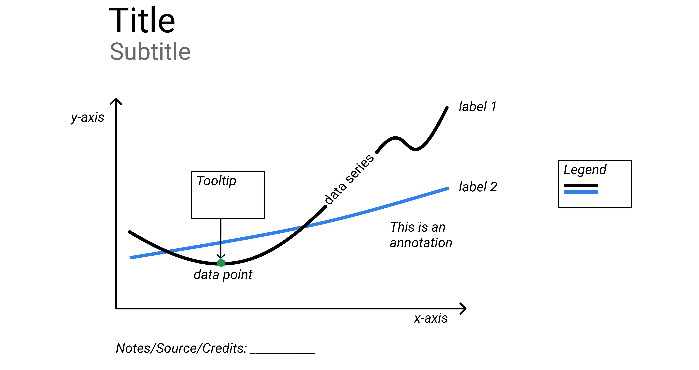

Figure 36: Common chart components.

A *title* is perhaps the most important element of any chart. A good
title is short, clear, and tells a story on its own. For example, “Black
and Asian Population More Likely to Die of Covid-19”, or “Millions of
Tons of Plastic Enter the Ocean Every Year” are both clear titles.

Sometimes a more “dry” and “technical” title is preferred. Our two
titles can then be changed to “Covid-19 Deaths by Race in New York City,
March 2020” and “Tons of Plastic Entering the Ocean, 1950–2020”,
respectively.

Often these two styles are combined into a title (“story”) and a
subtitle (“technical”), like that:

    Black and Asian Population More Likely to Die of Covid-19
    Covid-19 Deaths by Race in New York City, March 2020

Make sure your subtitle is less prominent than the title. You can
achieve this by decreasing font size, or changing font color (or both).

Horizontal (x) and vertical (y) *axes* define the scale and units of
measure.

A *data series* is a collection of observations, which is usually a row
or a column of numbers, or *data points*, in your dataset.

*Labels* and *annotations* are often used across the chart to give more
context. For example, a line chart showing US unemployment levels
between 1900 and 2020 can have a “Great Depression” annotation around
1930s, and “Covid-19 Impact” annotation for 2020, both representing
spikes in unemployment. You might also choose to label items directly
instead of relying on axes, which is common with bar charts. In that
case, a relevant axis can be hidden and the chart will look less
cluttered.

A *legend* shows symbology, such as colors and shapes used in the chart,
and their meaning (usually values that they represent).

You should add any *Notes*, *Data Sources*, and *Credits* underneath the
chart to give more context about where the data came from, how it was
processed and analyzed, and who created the visualization. Remember that
being open about these things helps build credibility and
accountability.

In interactive charts, a *tooltip* is often used to provide more data or
context once a user clicks or hovers over a data point or a data series.
Tooltips are great for complex visualizations with multiple layers of
data, because they de-clutter the chart. But because tooltips are harder
to interact with on smaller screens, such as phones and tablets, and are
invisible when the chart is printed, only rely on them to convey
additional, nice-to-have information. Make sure all essential
information is visible without any user interaction.

### Some Rules are More Important than Others

Although the vast majority of rules in data visualization are open to
interpretation, there are some that are hard to bend.

#### Bar chars must start at zero

Unlike line charts, bar or column charts need to have their value axis
start at zero. This is to ensure that a bar twice the length of another
bar represents twice its value. The Figure
<a href="#fig:design-principles-start-at-zero">37</a> shows a good and a
bad example.

Figure 37: Start your bar chart at zero.

Starting y-axis at anything other than zero is a common trick used by
some media and politicians to exaggerate differences in surveys and
election results. Learn more about how to [detect bias in data
stories](detect.html) in chapter 12.

#### Pie Charts Represent 100%

Pie charts is one of the most contentious issues in data visualization.
Most dataviz practitioners will recommend avoiding them entirely, saying
that people are bad at accurately estimating sizes of different slices.
We take a less dramatic stance, as long as you adhere to the
recommendations we give in the next section.

But the one and only thing in data visualization that every single
professional will agree on is that *pie charts represent 100% of the
quantity*. If slices sum up to anything other than 100%, it is a crime.
If you design a survey titled *Are you a cat or a dog person?* and
include *I am both* as the third option, forget about putting the
results into a pie chart.

### Chart Aesthetics

Remember that you create a chart to help the reader understand the
story, not to confuse them. Decide if you want to show absolute numbers,
percentages, or percent changes, and do the math for your readers.

#### Avoid chart junk

Start with a white background and add elements as you see appropriate.
You should be able to justify each element you add. To do so, ask
yourself: Does this element improve the chart, or can I drop it without
decreasing readability? This way you won’t end up with so-called “chart
junk” as shown in Figure <a href="#fig:design-principles-junk">38</a>,
which includes 3D perspectives, shadows, and unnecessary elements. They
might have looked cool in early versions of Microsoft Office, but let’s
stay away from them today.

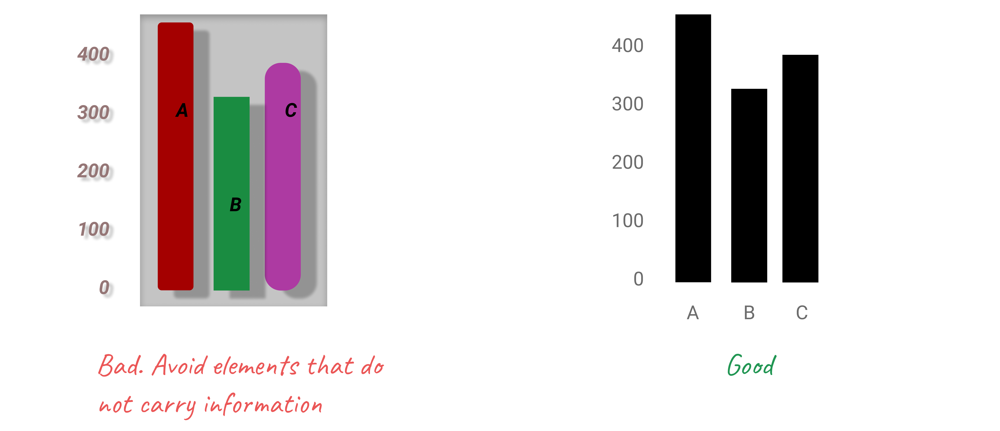

Figure 38: Avoid chart junk.

Do not use shadows or thick outlines with bar charts, because the reader
might think that decorative elements are part of the chart, and thus
misread the values that bars represent.

The only justification for using three dimensions is to plot
three-dimensional data, which has x, y, and z values. And don’t let
anyone tell you otherwise.

#### Beware of pie charts

Remember that pie charts only show part-to-whole relationship, so all
slices need to add up to 100%. Generally, the fewer slices—the better.
Arrange slices from largest to smallest, clockwise, and put the largest
slice at 12 o’clock. Figure <a href="#fig:design-principles-pie">39</a>
illustrates that.

Figure 39: Sort slices in pie charts from largest to smallest, and start
at 12 o’clock.

If your pie chart has more than five slices, consider showing your data
in a bar chart, either stacked or separated, like Figure
<a href="#fig:design-principles-pie-to-bar">40</a> shows.

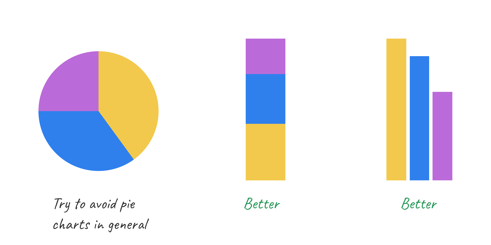

Figure 40: Consider using bar charts instead of pies.

#### Don’t make people turn their heads to read labels

When your column chart has long x-axis labels that have to be rotated
(often 90 degrees) to fit, consider turning the chart 90 degrees so that
it becomes a horizontal bar chart. Take a look at Figure
<a href="#fig:design-principles-turn-bar">41</a> to see how much easier
it is to read horizontally-oriented labels.

Figure 41: For long labels, use horizontal bar charts.

#### Arrange elements logically

If your bar chart shows different categories, consider ordering them,
like is shown in Figure
<a href="#fig:design-principles-order-categories">42</a>. You might want
to sort them alphabetically, which can be useful if you want the reader
to be able to quickly look up an item, such as their town. Ordering
categories by value is another common technique that makes comparisons
possible. If your columns represent a value of something at a particular
time, they have to be ordered sequentially, of course.

Figure 42: For long labels, use horizontal bar charts.

#### Do not overload your chart

When labelling axes, choose natural increments that space equally, such
as \[0, 20, 40, 60, 80, 100\], or \[1, 10, 100, 1000\] for a logarithmic
scale. Do not overload your scales. Keep your typography simple, use
(but do not overuse) **bolding** to highlight major insights. Consider
using commas as thousands separators for readability (`1,000,000` is
much easier to read than `1000000`).

#### Be careful with the colors

The use of color is a complex topic, and there are plenty of books and
research devoted to it. But some principles are fairly universal. First,
do not use colors just for the sake of it, most charts are fine being
monochromatic. Second, remember that colors come with some meaning
attached, which can vary among cultures. In the world of business, red
is conventionally used to represent loss, and it would be unwise to use
this color to show profit. Make sure you avoid random colors.

Whatever colors you end up choosing, they need to be distinguishable
(otherwise what is the point?). Do not use colors that are too similar
in hue (for example, various shades of green––leave them for choropleth
maps). Certain color combinations are hard to interpret for color-blind
people, like green/red or yellow/blue, so be very careful with those.
Figure <a href="#fig:design-principles-color">43</a> shows some good and
bad examples of color use.

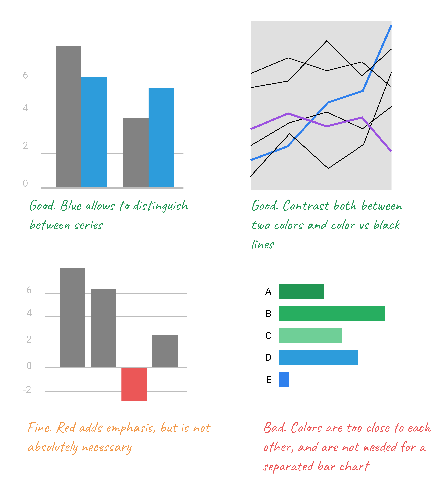

Figure 43: Don’t use colors just for the sake of it.

If you follow the advice, you should end up with a de-cluttered chart as
shown in Figure <a href="#fig:design-principles-decluttered">44</a>.
Notice how your eyes are drawn to the bars and their corresponding
values, not bright colors or secondary components like the axes lines.

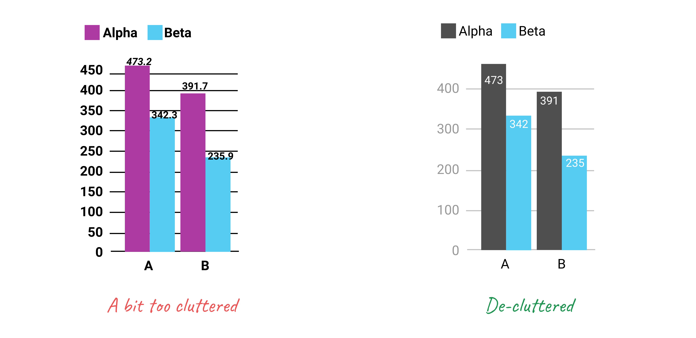

Figure 44: Make sure important things catch the eye first.

Google Sheets Charts
--------------------

[Google Sheets](https://sheets.google.com) is a well-known spreadsheet
program that allows you to create basic charts using its intuitive
drag-and-drop interface. Most people who create charts with Google
Sheets export them as static *png* images. But in fact these interactive
charts can be easily [embedded on your website](embed.html), as you’ll
learn in chapter 7.

In this section, we will look at creating column and bar charts that are
separated, grouped, and stacked. We will also look at making pie, line,
area, and scatter charts, and learn to visualize three-dimensional data
using bubble charts.

As most easy-to-use tools, Google Sheets has its shortcomings. You won’t
be able to control tooltips of scatterplot tooltips, or cite or link to
source data inside charts. You won’t be able to annotate or highlight
items. But you *will* be able to *quickly* make good-looking interactive
charts *quickly*.

Tip: Visit [Types of charts & graphs in Google
Sheets](https://support.google.com/docs/answer/190718) for an overview
of the various chart types supported by this tool.

Column and Bar Charts with Google Sheets
----------------------------------------

Column and bar charts are some of the most common types of charts in
data visualization (column charts are just vertical bar charts). They
are used to compare values across categories.

In this tutorial, we will use three small datasets to build interactive
separated, grouped, and stacked bar charts in Google Sheets:

-   Obesity in the US (by US CDC and StateOfObesity.org project)
-   High-Calorie Fast-Food Items
-   Global Database on Body Mass Index by World Health Organization

Before you begin, you will need to create a free [Google Drive
account](https://www.google.com/drive/). If you already Google Mail, you
can use the same username for your Google Drive account.

### Grouped Column and Bar Charts

Figure <a href="#fig:column-grouped">45</a> shows differences in obesity
between men and women, grouped together in three age brackets to allow
for easier gender comparisons across the same ages. In the interactive
web version, hover over columns and see tooltips with data.

<iframe src="https://docs.google.com/spreadsheets/d/e/2PACX-1vSkvNNrgYCpNtsaCRxn7g5o4UR8OJXSxBWvUK531t5vYubt39gecV9yLIfic89DCeJnGNvpRttFfKzn/pubchart?oid=787918829&amp;amp;format=interactive" width="100%" height="400px">
</iframe>

Figure 45: Grouped column chart with data from
[StateOfObesity.org](http://stateofobesity.org/files/stateofobesity2016.pdf).
Explore the [full-screen interactive
version](https://docs.google.com/spreadsheets/d/e/2PACX-1vSkvNNrgYCpNtsaCRxn7g5o4UR8OJXSxBWvUK531t5vYubt39gecV9yLIfic89DCeJnGNvpRttFfKzn/pubchart?oid=787918829&format=interactive).

The following steps will help you recreate an interactive grouped column
(or horizontal bar) chart.

1.  Right-click to open link in new tab: [Google Sheet Column chart with
    grouped data
    template](https://docs.google.com/spreadsheets/d/1ltA9siijVSDkTE3fzB3UaWHO7dotBIrGH4R9wI_Qyqw/)

2.  Sign in to continue to Google Sheets (which is part of Google
    Drive). If you don’t already have a Google account, you can create
    one.

3.  Select File &gt; Make a Copy to save your own version to your Google
    Drive, as shown in Figure <a href="#fig:file-make-copy2">46</a>.

Figure 46: Make your own copy of the Google Sheet template.

1.  To remove the current chart from your copy of the spreadsheet, float
    your cursor to the top-right corner of the chart to make the 3-dot
    menu appear, and select Delete, as shown in Figure
    <a href="#fig:delete-chart">47</a>.

Figure 47: Float cursor in top-right corner of the chart to make the
3-dot menu appear, and select Delete.

1.  Format your data to make each column a data series, as shown in
    Figure <a href="#fig:column-grouped-data">48</a>, which means it
    will display as a separate color in the chart.

Figure 48: Format data in columns to make colored grouped columns in
your chart.

1.  Use your cursor to select only the data you wish to chart, then go
    to the Insert menu and select Chart, as shown in Figure
    <a href="#fig:column-grouped-insert">49</a>.

Chart." /&gt;

Figure 49: Select your data and then Insert &gt; Chart.

1.  In the Chart Editor, change the default selection to Column chart,
    with Stacking none, to display Grouped Columns, as shown in Figure
    <a href="#fig:column-grouped-editor">50</a>. Or select horizontal
    Bar chart if you have longer labels.

Figure 50: Change the default to Column chart, with Stacking none.

1.  To customize title, labels, and more, in the Chart Editor select
    Customize, as shown in Figure
    <a href="#fig:chart-editor-customize">51</a>.

Figure 51: Select Customize to edit title, labels, and more.

1.  To make your data public, go to the upper-right corner of your sheet
    to click the Share button, and in the next screen, click the words
    “Change to anyone with the link,” as shown in Figure
    <a href="#fig:share-button-sheet">52</a>. This means your sheet is
    no longer Restricted to only you, but can be viewed by anyone with
    the link. See additional options.

&lt;img src=“images/05-chart/share-button-sheet.png” alt=“Click the
Share button and then click”Change to anyone with the link." to make
your data public." /&gt;

Figure 52: Click the Share button and then click “Change to anyone with
the link.” to make your data public.

1.  To embed an interactive version of your chart in another web page,
    click the 3-dot menu in the upper-right corner of your chart, and
    select Publish Chart, as shown in Figure
    <a href="#fig:chart-publish">53</a>. In the next screen, select
    Embed and press the Publish button. See [Chapter 7 Embed on the
    Web](embed.html) to learn what to do with the iframe code.

Figure 53: Select Publish Chart to embed an interactive chart on another
web page, as described in Chapter 7.

Note: Currently, there is no easy way to cite or link to your source
data inside a Google Sheets chart. Instead, cite and link to your source
data in the text of the web page. Remember that citing your sources adds
credibility to your work.

### Separated Column and Bar Charts

When you visualize independent categories of data, and you don’t want
them to appear grouped together, then create a chart with separated
columns (or horizontal bars, if you have long data labels). For example,
Figure <a href="#fig:bar-separated">54</a> is a separated bar chart of
calorie counts of fast food items for two restaurant chains, Starbucks
and McDonald’s. Unlike the grouped column chart in Figure
<a href="#fig:column-grouped">45</a>, here the bars are separated from
each other, because we do not need to make comparisons between
sub-groups.

<iframe src="https://docs.google.com/spreadsheets/d/1LGUYaVLoRcOiB8KcXb3Rn7LRj0exnUQYOy58LrkGPAk/pubchart?oid=1270431574&amp;amp;format=interactive" width="100%" height="400px">
</iframe>

Figure 54: Separated bar chart with data from [Starbucks and
McDonalds](https://docs.google.com/spreadsheets/d/1LGUYaVLoRcOiB8KcXb3Rn7LRj0exnUQYOy58LrkGPAk/edit#gid=956322126).
Explore the [full-screen interactive
version](https://docs.google.com/spreadsheets/d/e/2PACX-1vSkvNNrgYCpNtsaCRxn7g5o4UR8OJXSxBWvUK531t5vYubt39gecV9yLIfic89DCeJnGNvpRttFfKzn/pubchart?oid=787918829&format=interactive).

The only difference between making a grouped versus a separated chart is
how you structure your data. To make Google Sheets separate columns or
bars, you need to leave some cells blank, as shown in Figure
<a href="#fig:bar-separated-data">55</a>. The rest of the steps remain
the same as above.

Figure 55: Create a separated column or bar chart by leaving some cells
blank.

To create your own separated column or bar chart using the fast-food
example, right-click to open this link in a new tab: [Google Sheet
Separated Bar Chart
template](https://docs.google.com/spreadsheets/d/1LGUYaVLoRcOiB8KcXb3Rn7LRj0exnUQYOy58LrkGPAk/).

### Stacked Column and Bar Charts

Stacked column and bar charts can be used to compare subcategories. They
can also be used to represents parts of a whole instead of pie charts.
For example, the stacked column chart in Figure
<a href="#fig:column-stacked">56</a> compares the percentage of
overweight residents across nations, where colors allow for easy
comparisons of weight-group subcategories across nations.

<iframe src="https://docs.google.com/spreadsheets/d/e/2PACX-1vSZrCP99EDqmpYc3VxFF5-Fpryh7KOU3GZ39Gl33OmDw4ecWKXxjrfzHDeQKfandKiUwvDkyF6kwK6L/pubchart?oid=307057605&amp;amp;format=interactive" width="100%" height="400px">
</iframe>

Figure 56: Stacked column chart with data from [WHO and
CDC](https://docs.google.com/spreadsheets/d/1WS11EK33JCmvCRzSDh9UpP6R7Z2sHglF7ve5iJL6eZk/edit#gid=735710691).
Explore the [full-screen interactive
version](https://docs.google.com/spreadsheets/d/e/2PACX-1vSZrCP99EDqmpYc3VxFF5-Fpryh7KOU3GZ39Gl33OmDw4ecWKXxjrfzHDeQKfandKiUwvDkyF6kwK6L/pubchart?oid=307057605&format=interactive).

To create a stacked column or bar chart, structure your data so that
each column will become a new series with its own color, as shown in
Figure <a href="#fig:column-stacked-data">57</a>. Then in the Chart
Editor window, choose Chart Type &gt; Stacked column chart (or Stacked
bar chart). The rest of the steps are similar to the ones above.

Figure 57: Create a stacked column or bar chart by structuring your data
as shown.

To create your own stacked column or bar chart using the international
weight level example, right-click to open this link in a new tab:
[Google Sheets Stacked Column Chart
template](https://docs.google.com/spreadsheets/d/1WS11EK33JCmvCRzSDh9UpP6R7Z2sHglF7ve5iJL6eZk/).

### Histograms

Histogram is a type of bar chart that represents distribution of items,
whether numerical or categorical. To bulid a histogram, you need to
assign each data point to one of the non-overlapping *buckets* (or
*bins*).

Let’s say you want to know what time of day are you more likely to get
an email. One approach would be to download metadata about all emails
you received in 2020, and assign them to a bucket between 0 and 23
according to the email hour. Hours will become your bins, and email
counts will be your frequency data. Then your final dataset would look
something like this:

    Hour  Emails
    0	    12
    1	    11
    2	    7
    ...
    21    24
    22    34
    23	  22

You can now make a histogram. The good news is, Google Sheets considers
histograms to be regular column charts, so you should be able to use a
previous tutorial to make one.

Select two columns with the data you want to visualize, and go to Insert
&gt; Chart. In the Chart editor window, in the Setup tab, select Chart
type &gt; Column chart. See the result in Figure
<a href="#fig:histogram">58</a>

<iframe src="https://docs.google.com/spreadsheets/d/e/2PACX-1vRyg09UZgGWVHPk3oOKAZ-zlqtDF_RpvOLdAsM-k-ZW5NavcxAyHbErgr-7dt7U_AFSVZONSTZ9sVII/pubchart?oid=509234663&amp;amp;format=interactive" width="100%" height="400px">
</iframe>

Figure 58: Histogram chart with [fictitious source
data](https://docs.google.com/spreadsheets/d/1V-r1bOWpvyCRhmJa0gRZ1TEchXvrr7UTZ97rKOU1WRo/edit#gid=0).
Explore the [full-screen interactive
version](https://docs.google.com/spreadsheets/d/e/2PACX-1vRyg09UZgGWVHPk3oOKAZ-zlqtDF_RpvOLdAsM-k-ZW5NavcxAyHbErgr-7dt7U_AFSVZONSTZ9sVII/pubchart?oid=509234663&format=interactive).

To create your own histogram chart using our fictional email dataset,
right-click to open this link in a new tab: [Histogram Chart
template](https://docs.google.com/spreadsheets/d/1V-r1bOWpvyCRhmJa0gRZ1TEchXvrr7UTZ97rKOU1WRo/edit?usp=sharing).

Bins in a histogram should span (in other words, “cover”) the entire
range of values of your dataset. This way you don’t leave out any data.
We recommend you use bins of the same size (like 24 1-hour bins, or four
6-hour bins) to ensure readers can compare across bars. For example, if
you want to create a less detailed histogram, you can combine hours into
larger bins, such as *Morning*, *Afternoon*, *Evening*, and *Night* to
cover the hours of 6–11, 12–17, 18–23, and 0–5, respectively. Then your
dataset will look like:

    Time of Day,Emails
    Morning,353
    Afternoon,497
    Evening,279
    Night,37

Pie, Line, and Area Charts with Google Sheets
---------------------------------------------

#### Pie Chart

As we mentioned in the [Chart Aesthetics section](chart-design.html),
you need to be careful when using pie charts. First, remember to not
have too many slices (ideally you should limit slices to 5). They should
be arranged from largest to smallest and start at 12 o’clock. To
separate slices, you can use different slice colors, or lines.

Make sure your data adds up to 100%. For example, if you want to show a
pie chart with the number of fruit your store had sold in a day—–21
apples, 5 oranges, and 32 bananas—–the sum of all fruit, 58, is your
100%. Then a reader can figure out that of all fruits sold,
approximately 55% were bananas. This example is illustrated in Figure
<a href="#fig:pie">59</a>. If you decided to include *some*, but *not
all* other items that your store has sold (for example, you include
pizzas but exclude ice cream), your pie chart would not make sense.

<iframe src="https://docs.google.com/spreadsheets/d/e/2PACX-1vQai8YWkqMOHsiwWXpe1jyhBKy5wW6zcMaEIklkF-598h1QaVBrRR0F9JVrsX2Zo5ihXWP-HlnY-KlE/pubchart?oid=760990456&amp;amp;format=interactive" width="100%" height="400px">
</iframe>

Figure 59: Pie chart with [fictitious source
data](https://docs.google.com/spreadsheets/d/11cn0eysXqXIwhcTKmGuzMDw_RmpDpYLKZN3TeevT-Vg/edit?usp=sharing).
Explore the [full-screen interactive
version](https://docs.google.com/spreadsheets/d/e/2PACX-1vQai8YWkqMOHsiwWXpe1jyhBKy5wW6zcMaEIklkF-598h1QaVBrRR0F9JVrsX2Zo5ihXWP-HlnY-KlE/pubchart?oid=760990456&format=interactive).

To make a pie chart with Google Sheets, arrange your data in two
columns, *Label* and *Value*. Values can be expressed as either
percentages or counts. For example,

    | Apple  |  21 |
    | Orange |   5 |
    | Banana |  32 |

Select all cells and go to *Insert &gt; Chart*. Google Sheets is good at
guessing chart types, so it is possible the chart you will see right
away will be a pie. If not, in Chart editor in tab Setup, select *Pie
chart* from the Chart type dropdown list.

Notice that slices are ordered the same way they appear in the
spreadsheet. We highly recommend you sort values from largest to
smallest: right-click the header of your values column, and click
`Sort sheet Z-A`. You will see that the chart updates automatically.

Right-click on the chart, and choose *Chart & axis titles &gt; Chart
title* to add a meaningful title. In *Customize* tab of the Chart
editor, you can also change colors and add borders to slices.

#### Line Chart

The most common use of line charts is to represent values at different
points in time, in other words to show change over time. The line chart
in Figure <a href="#fig:line">60</a> shows per-capita meat availability
in the US for the past 110 years. You can see that the level of chicken
(shown in orange) rises steadily and surpasses beef (red) and pork
(blue).

<iframe src="https://docs.google.com/spreadsheets/d/e/2PACX-1vS38EC_34L8gKK9NStS8S322BzvBRbnRNpu9KXQ4oHHpaDmVMBAhEu4SXtCC6CD2yv_V6brX8s386Nf/pubchart?oid=2073830845&amp;amp;format=interactive" width="100%" height="400px">
</iframe>

Figure 60: Line chart showing meat availability per capita in the US,
according to the [US Department of
Agriculture](https://docs.google.com/spreadsheets/d/1wkWxxZ2-N5hqkcp7in8bxwdEcT1-XMnt1A8qUXxUSjw/edit?usp=sharing).
Explore the [full-screen interactive
version](https://docs.google.com/spreadsheets/d/e/2PACX-1vS38EC_34L8gKK9NStS8S322BzvBRbnRNpu9KXQ4oHHpaDmVMBAhEu4SXtCC6CD2yv_V6brX8s386Nf/pubchart?oid=2073830845&format=interactive).

The simplest way to organize your data is to use the first column as
x-axis labels, and each additional column as a new series (which will
become its own line). For example, the meat data from the line chart is
structured as shown in Figure <a href="#fig:line-data">61</a>.

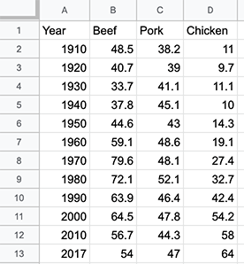

Figure 61: Data for the line chart shown in Figure
<a href="#fig:line">60</a>.

The data is available in the [Google Sheet Line chart
template](https://docs.google.com/spreadsheets/d/1wkWxxZ2-N5hqkcp7in8bxwdEcT1-XMnt1A8qUXxUSjw/).
If you wish to use it, just make a copy to your own Google Drive from
the File menu.

Select the data, and choose *Insert &gt; Chart*. It is possible Google
Sheets will create a line chart right away. If not, in Chart editor in
tab Setup, select *Line chart* from the Chart type dropdown list.

#### Stacked Area Chart

The line chart in the previous example made it possible to see how
individual meat availability changed over time. It was hard, however, to
estimate if the overall meat availability went up or down. (That is, of
course, if we assume that beef, pork, and chicken are the only meats we
eat).

We can see how availability of individual meat types, *and* the total
meat availability over time using a stacked area chart, like shown in
Figure <a href="#fig:stacked-area">62</a>. Here, we can still see that
chicken has been on the rise since 1970s. We can also see that the total
availability was on the rise between 1910 and 1970 with a small dip
around 1930s, and it didn’t change much between 1970 and 2017.

<iframe src="https://docs.google.com/spreadsheets/d/e/2PACX-1vSotrM_zZDo0MT--JgXwA3nBQudzIwmt8TGwmZxvUxNUzPrfBgqso5glLn05ObJxdTTmKoT_fQWQMx-/pubchart?oid=1976471326&amp;amp;format=interactive" width="100%" height="400px">
</iframe>

Figure 62: In addition to individual meat availability, stacked area
charts show the overall availability. See data by [US Department of
Agriculture](https://docs.google.com/spreadsheets/d/16QR4prVUoztW6bFVyj_q0n8GjNWqkcW6sgAkIyHQIJc/edit?usp=sharing).
Explore the [full-screen interactive
version](https://docs.google.com/spreadsheets/d/e/2PACX-1vSotrM_zZDo0MT--JgXwA3nBQudzIwmt8TGwmZxvUxNUzPrfBgqso5glLn05ObJxdTTmKoT_fQWQMx-/pubchart?oid=1976471326&format=interactive).

The data for the stacked area chart is available from the [Google Sheet
Stacked area chart
template](https://docs.google.com/spreadsheets/d/16QR4prVUoztW6bFVyj_q0n8GjNWqkcW6sgAkIyHQIJc/),
which you copy to your own Drive.

Set up the data exactly as you would with a line chart (first column is
labels for the x-axis, second and following columns are series, or
lines). Select it, and choose *Insert &gt; Chart*. In the Chart editor,
in tab Setup, select *Stacked area chart* from the Chart type dropdown
list.

XY Scatter and Bubble Charts with Google Sheets
-----------------------------------------------

Consider using XY scatter charts, also known as scatterplots, to display
data coordinates to show the relationship between two variables. The
first example below compares the relationships between life expectancy
(shown on the X axis) and fertility (shown on the Y axis), which each
nation is represented as a dot (an X-Y coordinate). Bubble charts are
basically scatter charts on steroids, meaning that they can display the
relationship of up to five variables. Further below you’ll build a
bubble chart based on the same XY life expectancy-fertility dataset,
with added variables for population (displayed as circle size) and
region of the world (displayed as circle color). Fancier bubble charts
animate the circles to represent one more variable: change over time.

<!-- TODO: Ilya - please review the conversational section intro I added above and feel free to revise. Should we add a link to an animated bubble chart, or not? -->

#### XY Scatter chart

The scatter chart in Figure <a href="#fig:scatter">63</a> uses World
Bank data to reveal a downward slope: nations with lower fertility
(births per woman) tend to have higher life expectancy. You can also
phrase is the other way, nations with higher life expectancy at birth
have lower fertility. Remember that correlation does not mean causation,
so you cannot use this chart to argue that fewer births result in longer
lives, or that longer-living females give birth to fewer children.

<iframe src="https://docs.google.com/spreadsheets/d/e/2PACX-1vSyKSe_dy3FURPuTllvmGBvI1b-J5_7Q3hR_6bdP20olDFA79OqoGOKEqtxfhv796NMXJO5vzhs_d0f/pubchart?oid=386475448&amp;amp;format=interactive" width="100%" height="400px">
</iframe>

Figure 63: This scatter chart shows that nations with lower fertility
tend to have higher life expectancy. [See
data](https://docs.google.com/spreadsheets/d/1LJCj3RaVgaQsAZriV_JDQhBrIBSvnH_N1LBCkZK1bqs/)
by World Bank. Explore the [full-screen interactive
version](https://docs.google.com/spreadsheets/d/e/2PACX-1vSyKSe_dy3FURPuTllvmGBvI1b-J5_7Q3hR_6bdP20olDFA79OqoGOKEqtxfhv796NMXJO5vzhs_d0f/pubchart?oid=386475448&format=interactive).

The data used in Figure <a href="#fig:scatter">63</a> is available from
our [Google Sheets Scatter chart
template](https://docs.google.com/spreadsheets/d/1LJCj3RaVgaQsAZriV_JDQhBrIBSvnH_N1LBCkZK1bqs/edit?usp=sharing).
You can copy it to your own Google Drive so that you’re able to edit it
(go to *File &gt; Make a copy*).

Figure <a href="#fig:scatter-data">64</a> shows the first few rows of
the dataset. Notice that the data is structured in three columns. The
first column, *Life Expectancy*, is plotted on the x-axis (horizontal).
The second column, *Fertility*, is plotted on the y-axis (vertical). The
third column contains *Country* labels.

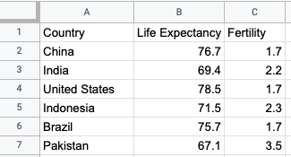

Figure 64: Data for a scatterplot is usually represented in 3 columns:
x-values, y-values, and labels.

To build a scatter chart, select the **two** columns that contain your
numeric data, and go to *Insert &gt; Chart*. Google Sheets will likely
to guess the chart type and you will see a scatterplot, but if not, you
can always manually pick Scatter chart from the *Chart type* dropdown.
Make sure your x-axis is set to Life Expectancy, and your Series shows
Fertility. Note that both Life Expectancy and Fertility have `123` icon,
meaning they are numeric.

You will see a lot of scatter charts out there that do not label data
points, and that’s okay. Some scatter plots are designed to show whether
or not there is a correlation, and knowing which points are which is not
important. But sometimes labels are important for your storytelling.

In Chart editor, click on the 3-dot menu for your Series dataset
(Fertility), and then *Add labels* (see Figure
<a href="#fig:scatter-labels">65</a>). The labels added by default will
be the x-values of points. To make Google Sheets read labels from the
third column (*Country*), click the name of your label dataset (Life
Expectancy), then *Select a data range* button in the upper-right corner
of the dropdown, and choose cells in the relevant columns. Make sure to
include the header (first row) if all other data ranges include it.

Figure 65: In the chart’s Setup window, choose *Add labels* to the
Series.

Tip: You may notice that some data points are too close to edges, and
their labels are cut off. To fix this, go to Customize tab of the Chart
editor. There, you can set minimum and maximum values for both
horizontal and vertical axes. Unlike in bar charts, axes in scatter
plots do not have to start at zero. You can set your minimum and maximum
values to be a few units below and above the extreme points of your data
range.

Note: Another name for the 3-dot menu symbol is the “kebab menu” because
it resembles Middle Eastern food cooked on a skewer, in contrast to the
three-line “burger menu” on many mobile devices. TODO: Add picture of
each icon?

#### Bubble chart with 3 columns

In this tutorial, we will show you a little trick that you can use if
you want a scatter chart with both data values displayed in a tooltip.
We will use the same World Bank dataset as we did for the scatter plot.

The bubble chart (more about the *proper* use of bubble charts in the
next section) in Figure <a href="#fig:bubble-3">66</a> shows the same
data as our scatterplot on life expectancy vs fertility.

In the interactive version of the chart, hover your cursor over each
bubble (dot) to reveal a tooltip with the country name and the two data
points.

<iframe src="https://docs.google.com/spreadsheets/d/1CL7joH_3wvMYo9HIiSuFP0Ykv_Nl5DK6DYYcd3_gFnU/pubchart?oid=2105121864&amp;amp;format=interactive" width="100%" height="400px">
</iframe>

Figure 66: This bubble chart is essentially a scatter chart, because no
other dimensions (colors, sizes) are used. [See
data](https://docs.google.com/spreadsheets/d/1CL7joH_3wvMYo9HIiSuFP0Ykv_Nl5DK6DYYcd3_gFnU/edit?usp=sharing)
by World Bank. Explore the [full-screen interactive
version](https://docs.google.com/spreadsheets/u/3/d/e/2PACX-1vQtMosshgyX6YoPpHo9QhSPk-ckOw1_yRryTF_vYJooBeWF13RaPv2IrGffcpaiqHPwfKFJAWY0HwA3/pubchart?oid=2105121864&format=interactive).

The data for this example is available in [Google Sheets Bubble chart
with 3 columns
template](https://docs.google.com/spreadsheets/d/1CL7joH_3wvMYo9HIiSuFP0Ykv_Nl5DK6DYYcd3_gFnU/).

Notice that we moved the labels column (*Country*) to be the first one
in the dataset, but the order shouldn’t matter in this case. So our
first column is the label for each bubble, the second column is the data
to be plotted on horizontal x-axis, and the third column (fertility)
will be place on the y-axis.

Select all three columns, and go to *Insert &gt; Chart*. Google Sheets
will likely create a stacked column chart by default, so choose *Bubble*
from the Chart type dropdown window.

If you want to remove labels from the bubbles, remove the **ID** series
(click on the kebab menu &gt; Remove).

Unfortunately, there is no easy way to reduce all bubbles to a uniformly
smaller size. In the following section, we will introduce you to the
proper way of using bubble charts.

#### Bubble chart with 5 columns

Bubble charts are a good alternative to scatter charts if you need to
include one or two extra series in addition to your x- and
y-coordinates. One of those can be expressed through bubble size (bigger
bubbles represent larger values). Another one can make use of color
(best for categorical data).

The bubble chart in Figure <a href="#fig:bubble-5">67</a> shows
fertility and life expectancy for a subset of the nations, with
population (shown by bubble size) and region (shown by bubble color).
Float your cursor over bubbles to view data details in the interactive
version of the chart.

<iframe src="https://docs.google.com/spreadsheets/d/e/2PACX-1vQV0lrK1Lomxg-2IJJAYrB8Dvb9uc9mu5bKM2S8sWHzY9-E6ajoZwU4fRSghe2kXIHcmK4SfZO2NG4B/pubchart?oid=200651442&amp;amp;format=interactive" width="100%" height="400px">
</iframe>

Figure 67: This bubble chart shows fertility and life expectancy for
several countries, including their population (shown by bubble size) and
region (shown by bubble color). [See
data](https://docs.google.com/spreadsheets/d/1YgBWYm9nTGlCuyqSwU3SDb7xk-SMSPgjfYq5iLqL0nQ/)
by World Bank. Explore the [full-screen interactive
version](https://docs.google.com/spreadsheets/d/e/2PACX-1vQV0lrK1Lomxg-2IJJAYrB8Dvb9uc9mu5bKM2S8sWHzY9-E6ajoZwU4fRSghe2kXIHcmK4SfZO2NG4B/pubchart?oid=200651442&format=interactive).

The five-column dataset is available in this [Google Sheets Bubble chart
with 5 columns
template](https://docs.google.com/spreadsheets/d/1YgBWYm9nTGlCuyqSwU3SDb7xk-SMSPgjfYq5iLqL0nQ/).
The columns are arranged in the following order: country label, x-axis
value, y-axis value, color, and bubble size.

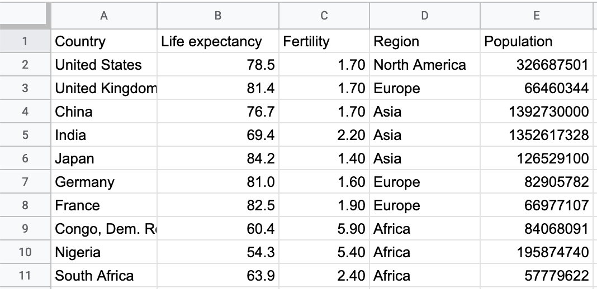

Figure 68: Bubble chart data. Bubble size represents population, color –
region.

Select all data and go to *Insert &gt; Chart*, and choose Bubble as the
Chart type. Make sure your **ID**, **X-axis**, **Y-axis**, **Series**,
and **Size** fields contains the series you want to display, and make
sure to have *Use row 1 as headers* option checked.

To change labels color, go to Customize tab of the Chart editor, and set
Text color under the Bubble menu. Make it gray or black, so that it
won’t interfere with the bubble colors themselves.

Tip: If some of your bubbles are too close to the borders, set Min and
Max values for the axis manually under Horizontal axis and Vertical axis
menus.

Create Charts with Tableau Public
---------------------------------

Tableau is powerful data visualization software used by many
professionals and organizations to analyze and present data. Tableau can
combine multiple datasets to show in a single chart (or a map), and
allows to create dashboards with multiple visualizations. Individual
visualizations and dashboards can be published and embedded on your
website through an iframe.

This book focuses on the free [Tableau Public
tool](https://public.tableau.com), available to download for Mac or
Windows. This free version of Tableau Public is very similar to the
pricier versions that the company sells, but one constraint is that the
data visualizations you create will be public, as the name suggests, so
do not use it for any sensitive or confidential data that should not be
shared with others.

You might be overwhelmed by the amount of options and features Tableau
provides through its interface. We will show you the very basics enough
to get started, and if you want to dive further, there are many great
books on Tableau available.

In this book, we will show you how to add datasets to Tableau Public,
and how to [create a scatterplot](scatter-chart-tableau.html) and a
[filtered line chart](filtered-line-chart-tableau.html).

Create XY Scatter Chart with Tableau Public
-------------------------------------------

Just to remind you, scatter charts plot two variables against each
other, on x- and y-axis, revealing possible correlations. With Tableau
Public, you can create an interactive scatter chart, letting users hover
over points to view specific details.

Figure <a href="#fig:tableau-xy-demo">69</a> illustrates a strong
relationship between Connecticut school district income and test scores.

<iframe src="https://public.tableau.com/views/CTSchoolDistrictsbyIncomeandGradeLevels2009-13/Sheet1?:showVizHome=no&amp;:embed=true" width="100%" height="500px">
</iframe>

Figure 69: Household income vs test scores in Connecticut school
districts. Made with Tableau Public.

#### Install Tableau and Get Data

You can download Tableau Public for Windows or Mac from Tableau’s
[official website](https://public.tableau.com). You will need to provide
your email address.

If you wish to use the dataset from the scatter plot in Figure
<a href="#fig:tableau-xy-demo">69</a>, you can [download the sample
Excel file](data/ct-districts-income-grades-2009-13.xlsx). This data
file consists of three columns: district, median household income, and
grade levels (above/below national average for 6th grade Math and
English test scores). The Notes tab explains how this data is based on
the work of Sean Reardon et al. at the [Stanford Education Data
Archive](http://purl.stanford.edu/db586ns4974), Motoko Rich et al. at
[The New York
Times](http://www.nytimes.com/interactive/2016/04/29/upshot/money-race-and-success-how-your-school-district-compares.html),
Andrew Ba Tran at
[TrendCT](http://trendct.org/2016/05/06/wealth-and-grades-compare-connecticuts-school-districts/),
and the American Community Survey 2009-13 via [Social
Explorer](http://socialexplorer.com).

#### Connect Data and Create a Scatterplot

Tableau Public’s welcome page includes three sections: Connect, Open,
and Discover.

1.  Under Connect, choose Microsoft Excel if you decided to use the
    sample dataset or your own Excel file. To load a CSV file, choose
    *Text file*. If your data is in Google Sheets, click *More…* and
    choose Google Sheets. Once you successfully connect to your data
    source, you will see it under Connections in the Data Source tab.
    Under Sheets, you will see two tables, `data` and `notes`.

2.  Drag `data` sheet into *Drag tables here* area, like is shown in
    Figure <a href="#fig:tableau-connect">70</a>. You will see the
    preview of the table under the drag-and-drop area. You have
    successfully connected one data source to Tableau Public, and you
    are ready to build your first chart.

Figure 70: Drag `data` sheet into *Drag tables here* area.

<!-- TODO: Let's find out whether real first-time users can follow these steps! -->

1.  Go to *Sheet 1* tab (in the lower-left corner of the window) to view
    your worksheet. Although it may feel overwhelming at first, the key
    is learning where to drag items from the Data pane (left) into the
    main worksheet. **Dimensions** are any information that is
    qualitative or categorical, and are shown in blue with *Abc* tables.
    **Measures** are quantitative information about the dimensions,
    shown in green with *\#* icons.

2.  Drag the *Grade Levels* measure into the **Rows** field above the
    charting area, which for now is just empty space. You can consult
    Figure <a href="#fig:tableau-xy-dragging">71</a> for this and two
    following steps. Tableau will apply a summation function to it, and
    you will see the `SUM(Grade Levels)` appearing in the Rows row, and
    a blue bar in the charting area. It makes little sense so far, so
    let’s plot another measure (variable).

3.  Drag *Median Household Income* to the **Columns** field (just above
    the Rows field). Tableau will once again apply the summation
    function, so you will see `SUM(Median Household Income)` in the
    Columns. The bar chart will transform into a scatter chart with just
    one data point in the upper-right corner. That is because the data
    for both is aggregated (remember the `SUM` function).

4.  We want to tell Tableau to disaggregate the household and grade
    levels variables. To do so, drag *District* dimention into the lower
    portion of the Marks area. You will now see a real scatter chart in
    the charting area. If you hover over points, you will see all three
    values associated with it.

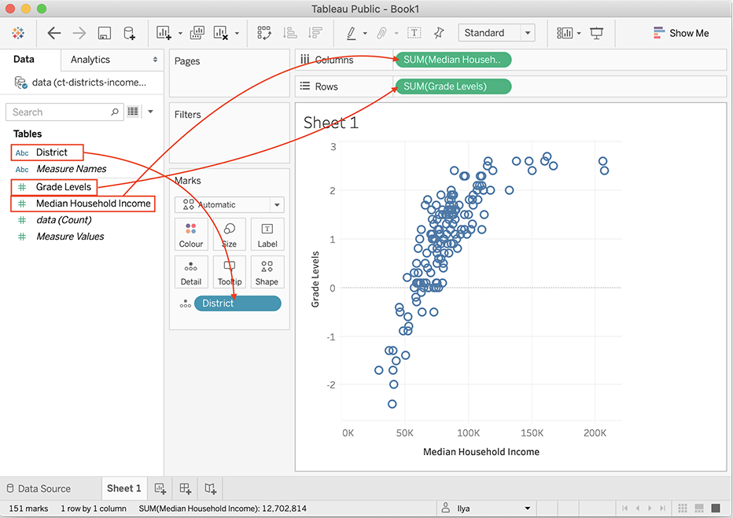

Figure 71: Drag measures and dimensions to the right places in Tableau.

#### Add Title and Caption, and Publish

Give your scatter chart a meaningful title by double-clicking on default
*Sheet 1* title above the charting area.

You will normally need to provide additional information about the
chart, such as source of the data, who built the visualization and when,
and other important things. You can do so inside a Caption, a text block
that accompanies your Tableau visualization. In the menu, go to
*Worksheet &gt; Show Caption*. Double-click the Caption block that
appeared, and edit the text.

As a result, your final worksheet will look like shown in Figure
<a href="#fig:tableau-xy-final">72</a>.

Figure 72: This scatter chart is ready to be published.

Tip: In the dropdown above Columns section, change *Standard* to *Fit
Width* to ensure your chart occupies 100% of available horizontal space.

To publish the chart to the web,

1.  Go to *File &gt; Save to Tableau Public As…*. A window to sign in to
    your account will pop up. If you don’t have an account, click
    *Create one now for free* at the bottom.

2.  Once signed in, a window to set the workbook title will appear.
    Change the deafult *Book1* title to something meaningful, as this
    name will appear in the URL for your published work. Click Save.

3.  Once the dashboard is saved, Tableau Public will open up a window in
    your default browser with the visualization. In the green ribbon
    above the chart, click *Edit Details* to edit chart’s title or
    description. Under *Toolbar Settings*, see checkbox to *Allow others
    to download or explore and copy this workbook and its data* (Figure
    <a href="#fig:tableau-toolbar-settings">73</a>), and enable/disable
    it as you think is appropriate. As advocates for open and accessible
    data, we recommend leaving the box checked.

Figure 73: This scatter chart is ready to be published.

See the [Embed Tableau Public on Your Website](embed-tableau.html)
section of this book to insert the interactive version of your chart on
a web page that you control.

Tip: Your entire portfolio of Tableau Public visualizations is online at
`https://public.tableau.com/profile/USERNAME`, where `USERNAME` is your
unique username.

To learn more, see [Tableau Public resources
page](https://public.tableau.com/en-us/s/resources).

Create Filtered Line Chart with Tableau Public
----------------------------------------------

One of the advantages of interactive visualizations over static
(including printed) is the ability to store a lot more data, and show it
only when required. In other words, an interactive visualization can be
made into a data-exploration tool that won’t overwhelm the viewer at
first sight, but will allow the viewer to “dig” and find specific data
points and patterns.

In this tutorial, we will build an interactive filtered line chart with
Tableau Public like is shown in Figure
<a href="#fig:tableau-filtered-demo">74</a>. The filter will be a
collection of checkboxes that allow to add/remove lines from the chart.
Viewers can hover over each line to identify the school name and data
attached to it.

We will use % Population with Internet Access by the World Bank. You can
download the dataset
[here](data/world-bank-internet-users-1995-2018.csv).

<iframe src="https://public.tableau.com/views/InternetAccessbyCountry/Sheet1?:showVizHome=no&amp;:embed=true" width="100%" height="500px">
</iframe>

Figure 74: Internet Access by Country, 1995–2018.

We assume that you have Tableau installed. If not, see the previous
tutorial, [Create XY Scatter Chart with Tableau
Public](scatter-chart-tableau.html).

### Connect Text File and Build a Line Chart

Open Tableau Public, and under Connect menu, choose *Text file*. Tableau
may or may not have imported the table automatically. If you see the
preview of the table with three columns: *Country Name*, *Year*, and
*Percent Internet Users*, you can proceed to Sheet 1.

If not, drag and drop the file (under Files section in the left) to the
*Drag tables here* area. Once you see the preview, go to Sheet 1.

Your variables will be listed under Tables in the left-hand side. The
original variables are displayed in normal font, the *generated*
variables will be shown in *italics* (such as *Latitude* and *Longitude*
that Tableau guessed from the country names).

To build a line chart,

1.  Drag Year variable to **Columns**.
2.  Drag Percent Internet Users variable to **Rows**. The variable will
    change to `SUM(Percent Internet Users)`. You should see a single
    line chart that sums up percentages for each year. That is
    completely incorrect, so let’s fix it.
3.  In order to “break” aggregation, drag and drop Country Name to the
    Color box of the Marks card. Tableau will warn you that the
    recommended number of colors should not exceed 20. Since we will be
    adding filtering, we don’t care about it much. So go ahead and press
    *Add all members* button.
4.  Now you should see an absolute spaghetti plate of lines and colors.
    To add filtering, drag *Country Name* to the Filters card. In the
    Filter window, make sure all countries are checked, and click *OK*.
5.  Right-click on *Country Name* pill in Filters card, and check Show
    Filter (see Figure @ref(fig:tableau-filtered-show-filter.png))
6.  You will see a list of options with all checkboxes on have appeared
    to the right of the visualization. Click *(All)* to add/remove all
    options, and add a few of your favorite countries to see how the
    interactive filtering works.

Figure 75: Once you dragged Country Name to the Filters card, make sure
the Filter is displayed.

### Add Title and Caption, and Publish

Replace *Sheet 1* title (above the chart) with “Internet Access by
Country, 1995–2018” by double-clicking on it. In the menu, go to
*Worksheet &gt; Show Caption* to add a Caption block under the chart.
Use this space to add source of your data (World Bank), and perhaps
credit yourself as the author of this visualization.

Change *Standard* to *Fit Width* in the dropdown above the Columns
field.

You may notice that the x-axis (Year) starts with 1994 and ends with
2020, although our data is for 1995–2018. Double-click on the x-axis,
and change **Range** from *Automatic* to *Fixed*, with the Fixed start
of `1995`, and the Fixed end of `2018`. Close the window and see that
the empty space on the edges has disappeared.

Once your filtered line chart looks like the one shown in Figure
<a href="#fig:tableau-filtered-ready">76</a>, you are ready to publish.

Figure 76: This workbook is ready to be published.

To publish the filtered line chart to the web, go to *File &gt; Save to
Tableau Public As…*. You may be prompted with the window to log in to
your account (or create one if you don’t have it yet). The next steps
are fairly self-explanatory, and you can consult [the previous
tutorial](scatter-chart-tableau.html) for more information on
publishing.

See the [Embed Tableau Public on Your Website](embed-tableau.html)
section of this book to insert the interactive version of your chart on
a web page that you control.

To learn more, see [Tableau Public resources
page](https://public.tableau.com/en-us/s/resources).

**Summary**

Congratulations on creating interactive charts that pull readers deeper
into your story, and encourage them to explore the underlying data! As
you continue to create more, always match the chart type to your data
format and the story you wish to emphasize. Also, design your charts
based on the principles and aesthetic guidelines in this chapter. While
anyone can click a few buttons to quickly create a chart nowadays, your
audiences will greatly appreciate well-designed charts that thoughtfully
call their attention to meaningful patterns in the data.

The next chapter on [Map Your Data](map.html) follows a similar format
to introduce different map types, design principles, and hands-on
tutorials to create interactive visualizations with spatial data. Later
you’ll learn how to [embed interactive charts on your web](embed.html)
in chapter 7.

To learn about more powerful charting tools, see [Chart.js code
templates](chartjs.html) in chapter 9, which give you ever more control
over how your design and display your data, but also require learning
how to [edit and host code templates with GitHub](github.html) in
chapter 8.

<!--chapter:end:05-chart.Rmd-->

Map Your Data
=============

Maps entice readers to explore your data story and develop a stronger
sense of place. But good maps require careful thought about how to
clearly communicate spatial concepts with your audience. This book
features free tools to create interactive maps that you can embed in
your website. In this chapter, you will learn how to:

-   Practice key [principles of map design](map-design.html).
-   Choose a map type that matches your data story and format, with
    tutorial links in the table below. Beginners may start with
    easy-to-learn tools such as [Google My Maps](mymaps.html), then move
    up to more powerful tools, such as [Leaflet](leaflet.html), which
    require you to [Edit and Host Code with GitHub](github.html) or
    other web servers.

See also related chapters in this book:

-   [Draw and write your data story](draw.html) to capture your ideas on
    paper
-   [Improve spreadsheet skills](spreadsheet.html), [Find and know your
    data](find.html), and [Clean your data](clean.html)
-   [Transform your map data](transform.html)
-   [Embed your interactive chart on your website](embed.html)
-   [Detect bias in data stories](detect.html), including [How to lie
    with maps](how-to-lie-with-maps.html)
-   [Tell your data story](story.html), including its most meaningful
    insights and limitations

<table>
<colgroup>
<col style="width: 50%" />
<col style="width: 50%" />
</colgroup>
<thead>
<tr class="header">
<th>Basic map types</th>
<th>Best use and tutorial chapters</th>
</tr>
</thead>
<tbody>
<tr class="odd">
<td>Point map   </td>
<td>Best to show specific locations, such as addresses with geocoded coordinates, with colors for different categories.  Easy tool: <a href="mymaps.html">Google My Maps tutorial</a> Power tool: <a href="leaflet-maps-with-google-sheets.html">Leaflet Maps with Google Sheets</a> and other <a href="leaflet.html">Leaflet templates</a></td>
</tr>
<tr class="even">
<td>Polygon map   </td>
<td>Best to show regions (such as nations or neighborhoods), with colors or shading to represent data values. Also known as choropleth map.  Easy tool: n/a  Power tools: <a href="tableau-polygon.html">Tableau Public</a> or <a href="leaflet-maps-with-google-sheets.html">Leaflet Maps with Google Sheets</a> and other <a href="leaflet.html">Leaflet templates</a></td>
</tr>
<tr class="odd">
<td>Polyline map   </td>
<td>Best to show routes (such as trails or transit), with colors for different categories.  Easy tool: n/a  Power tool: <a href="leaflet-maps-with-google-sheets.html">Leaflet Maps with Google Sheets</a> and other <a href="leaflet.html">Leaflet templates</a></td>
</tr>
<tr class="even">
<td>Combination map   </td>
<td>Best to show any combination of points, polygons, or polylines.  Easy tool: n/a  Power tool: <a href="leaflet-maps-with-google-sheets.html">Leaflet Maps with Google Sheets</a> and other <a href="leaflet.html">Leaflet templates</a></td>
</tr>
<tr class="odd">
<td>Storymap   </td>
<td>Best for guided point-by-point journey through a historical narrative, with optional photos, audio, or video on an interactive map.   Easy tool: <a href="https://storymap.knightlab.com/">Knight Lab’s StoryMap</a>, <a href="https://storymaps.arcgis.com/en/">ESRI Story Maps</a>   Power tool: <a href="leaflet-storymaps-with-google-sheets.html">Leaflet Storymaps with Google Sheets</a></td>
</tr>
</tbody>
</table>

TODO:

-   heat map
-   tab-view map for historical change
-   synchronized side-by-side map

Map Design Principles
---------------------

Ask Before You Map: Before you leap into a mapping project, consider
these questions:

**Does your data contain geographic information?** Common examples:

-   Specific locations or addresses (examples: *Trinity College*, or
    *300 Summit St, Hartford, CT*)
-   Latitude and longitude coordinates (example: *41.756, -72.675*)
-   Regions that are legally recognized (such as nations, states,
    counties, census tracts) or that correspond to a boundary map in
    your possession (such as designated neighborhoods or health
    districts)

While there are many more types of geographic information, these
examples above are the most common. If your data lacks geographic
information, or if you do not possess the corresponding boundary
information, it may not be possible to map it.

**Does location really matter to your data story?**

Sometimes a well-designed chart, rather than a map, may be the best way
to visualize your data story. Consider these alternatives:

-   to show change over time across different locations, consider a line
    chart

<iframe src="https://ourworldindata.org/grapher/projected-population-by-country" style="width: 100%; height: 450px; border: 0 none;">
</iframe>

-   to show the relationship between two or more datasets across
    different locations, consider an XY scatter chart or bubble chart

<iframe src="https://ourworldindata.org/grapher/learning-outcomes-vs-gdp-per-capita" style="width: 100%; height: 450px; border: 0 none;">
</iframe>

If a map is the best way to tell your data story, then choose an
appropriate type. See [table of basic map types](map) in this book.

#### Map Design Principles

1.  Understand basic map vocabulary: title, legend, baselayer, marker,
    popup, tooltip, zoom level, polygon, polyline, source.

2.  Add source credits and bylines—with links to view data tables and
    details—to build credibility and accountability.

3.  Choose colors wisely.

    -   Use color to logically organize your data. Avoid random colors
        (Wong pp. 40, 44).
    -   Avoid bad combinations from opposite sides of color wheel, such
        as red/green or yellow/blue (Wong pp. 40, 44).
    -   Use contrast (such as color vs gray) to call attention to your
        data story (Knaflic pp. 87-88)

4.  Choose basemaps wisely. Basemaps themselves may contain a lot of
    information, such as terrain, roads, parks, town names, buildings,
    etc. They may also use colors that can be distracting to the viewer.
    Think about the minimum number of elements required in the basemap
    to tell your story.

#### Design polygon maps with ColorBrewer

One of the most useful tools for creating meaningful polygon (or
choropleth) maps is ColorBrewer
<a href="http://colorbrewer2.org" class="uri">http://colorbrewer2.org</a>
created by Cynthia Brewer, Mark Harrower and the Pennsylvania State
University.

1.  Think about the **number of data classes** (or “dividers” or
    “buckets”). More does not necessarily mean better. Try different
    numbers and color schemes, and decide if you (and your audience) can
    easily distinguish between them.
    -   A smaller number sorts your data into fewer buckets, and shows a
        more **coarse map**, but differences in colored ranges become
        **more visible**.
    -   A larger number sorts your data into more buckets, and shows a
        more **granular map**, but differences in colored ranges become
        **less visible**.

1.  Think about the **nature of data** you are going to display.

-   Sequential: best to show steps from lower values (light color) to
    higher values (dark color)
    -   Example: a scale that increases from 1 to 100
-   Diverging: best to show extremes (dark colors) around a neutral
    middle (light color)
    -   Example: a scale that highlights extremes from -100 to 0 to 100
-   Qualitative: best to show different categories, represented by their
    own color
    -   Example: a map legend of the dominant crop in each area: apples,
        oranges, bananas

1.  Pick a **color scheme**, with options for colorblind-safe and
    print-friendly.
    -   Think about the ideal format for your audiences. Are readers
        more likely to view your visualization on a computer screen, or
        in print, or both?
2.  Click the Export tab to view all options. Some Leaflet map templates
    in this book use specific color names (such as “red” or “darkgreen”)
    and some use hexadecimal codes, abbreviated as “hex codes” (such as
    \#ff0000 or \#336600). To learn more, use a Color Picker tool, such
    as
    <a href="https://www.w3schools.com/colors/colors_picker.asp" class="uri">https://www.w3schools.com/colors/colors_picker.asp</a>

Beware that polygon map design choices about data classes and colors
reflect the biases of the author and the software. Read the [Detect Bias
in Data Stories](detect.html) chapter in this book, especially [How to
Lie with Maps](detect.html#how-to-lie-with-maps)

#### Learn more

-   Axis Maps, “The Basics of Data Classification,” 2010,
    <a href="http://axismaps.github.io/thematic-cartography/articles/classification.html" class="uri">http://axismaps.github.io/thematic-cartography/articles/classification.html</a>
-   Lisa Charlotte Rost, “Your Friendly Guide to Colors in Data
    Visualisation,” Lisa Charlotte Rost, April 22, 2016,
    <a href="https://lisacharlotterost.github.io/2016/04/22/Colors-for-DataVis/" class="uri">https://lisacharlotterost.github.io/2016/04/22/Colors-for-DataVis/</a>.
-   Josh Stevens, “Bivariate Choropleth Maps: A How-To Guide,” February
    18, 2015,
    <a href="http://www.joshuastevens.net/cartography/make-a-bivariate-choropleth-map/" class="uri">http://www.joshuastevens.net/cartography/make-a-bivariate-choropleth-map/</a>.

Point Map with Google My Maps
-----------------------------

TODO: add text, check current documentation and features at
<a href="https://www.google.com/maps/about/mymaps/" class="uri">https://www.google.com/maps/about/mymaps/</a>

#### Try It

Explore the interactive point map below, or [view the full-screen
version](https://drive.google.com/open?id=1OPrulm2ISYUb990DJOCoYlt_sWc),
created with Google My Maps
<a href="https://www.google.com/maps/d/" class="uri">https://www.google.com/maps/d/</a>.

<iframe src="https://www.google.com/maps/d/u/0/embed?mid=1OPrulm2ISYUb990DJOCoYlt_sWc" width="90%" height="480">
</iframe>

#### Tool Review

-   Pros
    -   Easy-to learn free mapping tool to import and style point,
        polyline, and polygon layers and basemap layers
    -   Share and collaborate through the Google Drive platform
    -   Geocoding error warning
-   Cons
    -   Limited options to customize map markers
    -   Cannot easily create colored polygon maps from data values
    -   Cannot extract geocoded data to migrate to another tool

#### Video with Step-by-Step Tutorial

<iframe width="560" height="315" src="https://www.youtube.com/embed/ZVIPn8dJeYM?rel=0" frameborder="0" allow="autoplay; encrypted-media" allowfullscreen>
</iframe>

Let’s build a simple point map with sample data, using Google My Maps
<a href="https://www.google.com/maps/d/" class="uri">https://www.google.com/maps/d/</a>.
Requires signing up for a free Google Drive account.

1.  Click this link and Save to download to your computer:
    [sample-address-data in CSV format](data/sample-address-data.csv).
    CSV means comma-separated values, a generic spreadsheet format that
    most tools can easily open. For help with downloading, see this
    [short video tutorial](https://www.youtube.com/watch?v=-04PQldP9HQ).

2.  Open and sign in to Google My Maps
    <a href="https://www.google.com/maps/d/" class="uri">https://www.google.com/maps/d/</a>

3.  Click the red + symbol to create a new map, which will be saved
    automatically to your Google Drive folder.

1.  In the map layers area, click the blue Import link. Drag-and-drop
    the CSV address data file into the web interface to import it.

1.  Choose columns to position your placements. Select “Address” for
    this sample data, then Continue.

1.  Choose a column to title your markers. Select “Description” for this
    sample data, then Finish.

1.  After My Maps uploads and geocodes your sample data, click Open Data
    Table to inspect the results.

1.  To style the map markers, click Individual Styles. In this sample
    data, you can select Group Places By &gt; Style By &gt; Group. This
    will color markers according to the three categories.

<iframe src="images/06-map/mymaps-style-groups-640w.gif" width="100%" height="400px">
</iframe>

1.  To publish your map on the web, click Share, add a map title, change
    from Private to Public on the Web, so that anyone can view your map.
    Click Save and Done.

1.  To embed the map on your own website, click the three vertical dots
    next to the map title for more options, and select Embed On My Site.
    The tool will generate an iframe code for you to copy. For next
    steps, go to the [Embed on Your Web](embed.html) chapters in this
    book.

#### Learn more

-   Google My Maps Help Page
    <a href="https://support.google.com/mymaps/answer/3024396" class="uri">https://support.google.com/mymaps/answer/3024396</a>

Point Map with Carto Builder
----------------------------

TODO:

-   Test this tool and decide if it still warrants inclusion in this
    book
-   See note about old versus newer Cartobuilder – still relevant?
-   if this tool stays in the book, check the iframe below to see if
    update is needed

#### Try It

Explore the interactive point map below, or [view the full-screen
version](https://jackdougherty.carto.com/builder/1abbb430-ec89-11e6-a661-0e05a8b3e3d7/embed)
,created with Carto Builder
<a href="https://carto.com" class="uri">https://carto.com</a>.

<iframe width="90%" height="500" frameborder="0" src="https://jackdougherty.carto.com/builder/1abbb430-ec89-11e6-a661-0e05a8b3e3d7/embed" allowfullscreen webkitallowfullscreen mozallowfullscreen oallowfullscreen msallowfullscreen>
</iframe>

#### Tool Review

-   Pros:
    -   Free and powerful drag-and-drop map tool in the browser
    -   Customize point markers and polygon colors by data values
    -   Additional features include geographic analysis tools
-   Cons:
    -   Several steps required to create simple point or polygon map
    -   New users may get lost when moving through multiple screens
    -   Free account allows only 400 geocodes per month

#### Video with Step-By-Step Tutorial

<iframe width="560" height="315" src="https://www.youtube.com/embed/lto7Z5wC2hQ?rel=0" frameborder="0" allow="autoplay; encrypted-media" allowfullscreen>
</iframe>

***Before you begin:*** This tutorial uses the newer Carto Builder,
rather than older Carto Editor tool. Learn more at
<a href="https://carto.com/learn/guides/intro/migrating-from-carto-editor-to-carto-builder" class="uri">https://carto.com/learn/guides/intro/migrating-from-carto-editor-to-carto-builder</a>.
If you have an old Carto account that has not automatically updated to
the new Builder tool, you may need to create a brand-new account to use
this tutorial.

Let’s build a simple point map with sample data, using Carto Builder
<a href="https:/carto.com" class="uri">https:/carto.com</a>. Requires
signing up for a free account.

1.  Click this link and Save to download to your computer:
    [sample-address-data in CSV format](data/sample-address-data.csv).
    CSV means comma-separated-values, a generic spreadsheet format that
    many tools can easily open.

2.  Open Carto in your browser
    <a href="https://carto.com" class="uri">https://carto.com</a>.

3.  The Carto Dashboard displays two views: Maps and Datasets. Always
    begin with Datasets, then move to Maps. (Hint: If your dashboard
    looks very different than mine, then you might still be using the
    older Carto Editor, rather than the newer Carto Builder.)

1.  First, connect your dataset, and soon we’ll turn it into a map.
    Click blue button to add New Dataset.

2.  Drag-and-drop the CSV sample address data to upload it, and select
    Connect Dataset. (Be patient. Sometimes this takes more than 30
    seconds.)

3.  Inspect your connected dataset.

4.  Click the blue Create Map button.

5.  Click the Edit Your Map button.

6.  In your map data layer, click Add Analysis.

7.  In the next screen of Analysis options, select Georeference, then
    click the Add Analysis button.

8.  Back in your map data layer, under Georeference options, select
    Type &gt; Street Addresses (scroll down to the bottom) for this
    sample data.

9.  Under Parameters, for Column Street Address (abbreviated as Col.
    Street Ad.), select the “address” field for this sample data. Press
    the Apply button.

10. After Carto has attempted to geocode your address data, click Style
    This Analysis. Or, go to the map data layer and click the Style tab.

11. In Style options, for Aggregation select none (the default).

12. Under Style options:

-   select Fill Number to change circle sizes
-   enter a larger size, such as 13, to make our sample points more
    visible
-   select Fill Color to change circle color
-   switch from Solid (all points are same color) to By Value, and
    scroll down to Group (at the bottom) to automatically color by
    categories for this sample data. (Hint: If you don’t see Group in
    the menu, click somewhere else and try it again.)

1.  In the Pop-up tab, select a Window Style, then select boxes in Show
    Items to display.

2.  In the Legend tab, click Select a Style to display information, and
    your color-coded groups from above should automatically appear on
    your map. (Hint: A legend may automatically appear after styling
    your markers by color.)

3.  Before publishing your map: If you wish to rename it, do it now by
    selecting the three vertical dots next to the file name, and select
    Rename.

4.  To publish your map on the web: Next to your map file name, click
    the blue “back” arrow (NOT your browser back button) to return to
    the data layer. Click the green Public button, and on the next
    screen, click the blue Publish button.

1.  On the next screen, Get The Link generates a weblink to your map,
    and Embed It generates an iframe code to insert the live map in your
    website. For next steps, go to the [Embed on Your Web](../../embed)
    chapters in this book.

2.  If you make edits to your map, you must click the blue Update button
    to republish your map to the web.

#### Learn more

-   Getting Started with Carto Builder
    <a href="https://carto.com/learn/guides/intro/getting-started-with-carto-builder" class="uri">https://carto.com/learn/guides/intro/getting-started-with-carto-builder</a>

Filtered Point Map with Socrata Open Data
-----------------------------------------

TODO: decide whether to keep or not; originally co-authored with
Veronica.

Open data repositories recently launched by [the State of
Connecticut](http://data.ct.gov) and [the City of
Hartford](http://data.hartford.gov) both use [the Socrata
platform](http://www.socrata.com), which offer user-friendly ways to
view, filter, and export data. Also, the Socrata platform includes
built-in support to create interactive charts and maps, and to embed
them on your own websites. This tutorial demonstrates these features by
creating an interactive point map of selected schools from the
Connecticut Education Directory in the state data portal. The final
product looks like this:

<iframe width="100%" title="CT Schools Map 2015" height="425px" src="https://data.ct.gov/w/qzq5-hbms/wqz6-rhce?cur=xi3jnhM8SI_&amp;from=root" frameborder="0" scrolling="no">
<a href="https://data.ct.gov/Education/CT-Schools-Map-2015/qzq5-hbms" title="CT Schools Map 2015">CT
Schools Map 2015</a>
</iframe>

<a href="http://www.socrata.com/">Powered by Socrata</a>

One advantage of creating data visualizations directly on an open data
platform is that the chart or map is linked to the data repository. For
example, if the Socrata platform administrator updates the data table,
then a Socrata dataviz based on that data will be automatically updated,
too. This may be especially useful for “live” data that is continuously
updated by agency administrators, such as fire, crime, and property data
repositories.

But there are limitations to creating your chart or map on an open data
repository platform. First, if the agency stops using the platform, or
changes the structure of the underlying data, your online chart or map
may stop functioning. Second, you are usually limited to using data
tables and geographic boundaries that already exist on that platform,
since importing your own may not be an option.

If these limitations concern you, a simple alternative is to export data
from the open repository (which means that any “live” data would become
“static” data), and import it into your preferred dataviz tool, such as
those described in other chapters of this book. A second, more advanced
alternative, is to learn how to pull live data from the repository
directly into your dataviz, using an Application Programming Interface
(API), which requires coding skills that are beyond the scope of this
tutorial. To learn more about the Socrata API:
<a href="https://dev.socrata.com/" class="uri">https://dev.socrata.com/</a>.

#### Steps to create a filtered point map

Sign up for a free account ID on any Socrata platform, such as
<a href="https://data.ct.gov/signup" class="uri">https://data.ct.gov/signup</a>.
One account will work on all Socrata sites.

Select your desired dataset in Socrata. In this tutorial, we will use CT
Open Data &gt; Education &gt; [CT Education
Directory](https://data.ct.gov/Education/Education-Directory/9k2y-kqxn).
The data table must include a location column that includes
geocoordinates. If there is address data but no geocoordinates, then
post a suggestion to the Socrata site administrator to add a geocoded
column.

Filter the data to display only the desired rows. The CT Education
Directory lists both district offices and school addresses, but for this
map we only wish to display the latter. On the top-right corner of the
table, click the Filter tab.

Add a New Filter Condition, which displays only the rows you select. In
this tutorial, select “Organization Type” and “is”, then type the exact
name from the table, such as “Public Schools.” Be sure to type it
correctly or the filter may not work. If you wish to select multiple
types, add a new filter condition for each. In this tutorial, we also
will filter for other types: Public Charter Schools, CT Technical High
Schools, Regional Schools, State Agency Facilities, Endowed and
Incorporated Academies Schools, and Regional Education Service Center
Schools.

Select the Visualize tab and choose Map, which will display several
options. First, under Config for Education Direction, select Point Map
as the Plot Style, and choose the Location column to identify the
geocoordinates.

Further below in the Visualize &gt; Map options, select the checkbox for
Advanced Config for the Education Directory to edit the Flyout Details
(similar to a pop-up information window) that displays details when
users click on a map point. Select data items you wish to display, such
as Title: Name, and additional Flyout Details: Organization Type,
Location I, and Website. Further down, select the “w/o labels” checkbox
to avoid displaying the column headers in your flyout details.

In Visualize &gt; Map &gt; Base Maps, select your desired background
map, such as Google Roadmap.

Add a legend to display once you build the map. In the Advanced
Configuration area, select the Legend Configuration checkbox and mark
its position. After selecting all of these map options, click Apply.
Socrata will generate your map with default point colors. Double-check
to make sure your data appear, and that your Visualize settings are
correct, before moving to the next step.

Assign point colors and legend labels by returning to the Filter tab,
and select Conditional Formatting. Understand the difference between
these two features. Previously, we used Filter to display only selected
types of data (in this case, school buildings, rather than district
administrative offices). Now, we will use Conditional Formatting to
assign color codes and labels to our filtered data.

In the Conditional Formatting section, type a name into the Description
that you wish to display in the legend. You may type a shorter name than
the longer name that appears in the data table, such as “Charter
Schools” instead of the longer “Public Charter Schools.” Also, select a
color for each Description.

Continue to add Conditional Formatting by defining the data columns. In
this example, select “All Conditions Apply,” choose “Organization Type”
and “Is”, then type the category exactly as it appears in the data table
(such as Public Charter Schools). For this map of schools in the CT
Education Directory data table, we added several more types (Regional
Schools, CT Technical High Schools, etc.) and also added a second rule
to identify Magnet Schools (where Organization Type is Public Schools,
and Interdistrict Schools is 1).

After setting all of your Conditional Formatting, press Apply at the
bottom of the tab. Double-check that your visualization appears exactly
as you wish, then Save As under an appropriate name. Note that your
visualization will become **publicly visible** to other users on the
Socrata open data platform, though you have the option to remove it via
your individual profile view.

Visualizations created in the Socrata platform produce HTML iframe
codes, which allows you to embed the dataviz in your own website. Select
the Embed tab to view and copy the code. Then go to the [Embed on the
Web](embed.html) chapters in this book.

Polygon Maps and Storyboards with Social Explorer
-------------------------------------------------

TODO: decide whether to keep or not, since free license terms changed

The Social Explorer free edition
<a href="http://socialexplorer.com" class="uri">http://socialexplorer.com</a>
offers one solution to creating colored polygon maps with US Census
demographic data. Explore the embedded sample map below.

<iframe frameborder="0" scrolling="no" marginheight="0" marginwidth="0" src="https://www.socialexplorer.com/0889800f4d/embed" width="640" height="480" allowfullscreen="true" webkitallowfullscreen="true" mozallowfullscreen="true">
</iframe>

#### Advantages

-   Quick and easy-to-learn
-   Free edition includes basic census data
-   Export your static maps into presentation slides
-   Share link or embed iframe to your interactive map

#### Limitations

-   Maps are limited to the demographic data inside the tool.
-   Polygon map boundaries are limited to state, county, census tract.
    The tool does not display municipal data for cities, towns, etc.
-   Full census and historical data requires professional subscription.
-   Pro subscription available through several academic libraries, but
    few public libraries.

#### Quick overview of features

Start at the Social Explorer website
<a href="http://socialexplorer.com" class="uri">http://socialexplorer.com</a>
and click on Maps. This tutorial demonstrates features available on the
free edition.

The default map view shows US population density, based on the American
Community Survey (ACS) 5-year estimates. Click the Change Data button to
explore other options.

Geographic boundaries automatically change with the zoom level. As you
zoom in, the data levels automatically shift from state, to county, to
census tract.

Click the Share button to copy the link to your map, or the iframe code
to embed it inside your own website.

Create a free account to save your online map views. Click the Tell a
Story button, add a series of interactive map views, and show change
over time.

TODO: Is this still true? All of the steps above can be done with the
free version, but data is limited. Check if an academic library near you
has a professional subscription.

Polygon Map with Tableau Public
-------------------------------

Tableau Public is freely-available software that contains powerful tools
to quickly create interactive polygon maps for common boundaries (such
as US States, or World Nations.) If you need to create customized maps
for less-common boundaries, see our chapter on [Leaflet Maps with Google
Sheets](leaflet-maps-with-google-sheets.html) in this volume.

Important: Tableau Public is designed to publicly display your data,
which makes this free tool very appropriate for educators, journalists,
non-profit organizations, or other users who wish to openly share their
map. If you desire a private tool to restrict your data, Tableau offers
other tools that require payment.

See also the Tableau Public support page
<a href="https://www.tableau.com/support/public" class="uri">https://www.tableau.com/support/public</a>
for additional resources, including video tutorials.

1.  Download and install the free Tableau Public tool, available for Mac
    or Windows, at
    <a href="https://public.tableau.com/en-us/s/download" class="uri">https://public.tableau.com/en-us/s/download</a>.
    Do not confuse with other Tableau products that require payment.
    Installation may require up to 5-10 minutes.

2.  Click this link and Save to download to your computer:
    [us-sample-data in CSV format](data/us-sample-data.csv). CSV means
    comma-separated values, a generic spreadsheet format that most tools
    can easily open. For help with downloading, see this [short video
    tutorial](https://www.youtube.com/watch?v=-04PQldP9HQ).

3.  Open the us-sample-data.csv file with any spreadsheet tool to view
    its contents.

4.  Launch Tableau Public. In the Connect column of the first screen,
    click “Text file” to connect to the CSV file you downloaded above.
    (If you had an Excel file in .xlsx format, you would click that
    instead.) Navigate to select the us-sample.data.csv file on your
    computer.

5.  At first, Tableau Public does **NOT** recognize the names of US
    areas, which initially appear simply as “text” values (with the
    “Abc” symbol). Click and hold down the mouse directly on the “Abc”
    symbol, and use the drop-down menu to convert to Geographic
    role &gt; State/Province. A tiny globe symbol will appear to show
    that Tableau Public now recognizes this column as geographic data,
    which is essential in order to make a map.

1.  Go to the Worksheet view, by clicking on “Sheet 1” in the
    bottom-left corner. The goal is to build a polygon map, based on the
    dimensions and variables provided by Tableau Public.

Step A - Drag the “Area” dimension to the middle of the worksheet to
create the geographic areas

Step B - In the “Marks” panel, change the drop-down menu from
“Automatic” to “Map”

Step C - Drag the “Type” dimension into the “Color” box of the Marks
panel to show polygon colors according to type

Optional: Add more items, such as “Abbreviation” dimension to “Label”
box to display state abbreviations, or “Area” dimension to “tooltips” to
display on mouseover.

1.  To display your map online, click “Dashboard” tab in the bottom-left
    corner.

2.  Drag “Sheet 1” (the default name of your map) into your dashboard.
    Also, drag the map legend from the corner into the lower body of the
    map (or choose other legend options).

3.  To publish your map online, go to File &gt; Save to Tableau Public
    As… This will require you to create a free Tableau Public Account.

4.  Modify your final online product as desired, and see options to
    embed elsewhere on the web.

<!--chapter:end:06-map.Rmd-->

Embed On Your Web
=================

After you create a chart or map, how do display it inside your website
as an *interactive* visualization? Our goal is not a static picture, but
a live chart or map that users can explore. This is an important
question for beginners, since data visualizations are not valuable
unless you can control where and how your work appears. This chapter
walks you through the key steps.

First, you need to own a website that supports iframe codes (which we’ll
explain below). If you do not have a website that supports this, then
follow this quick tutorial to [Create a simple web page with GitHub
Pages](github-pages.html). Even if you already have a website, still do
this tutorial, because it introduces a tool used many times in this
book.

Second, you need to copy or create an iframe code from your chart or
map. An iframe is one line of HTML code with instructions on how to
display a web page from a specific address (called a URL). A simple
iframe looks like this:

    <iframe src="https://handsondataviz.org/embed/index.html"></iframe>

No coding skills are necessary. See these easy-to-follow examples:

\-[Copy iframe from a Google Sheets chart](iframe-google-sheets.html)
-[Convert a link into an iframe](link-to-iframe.html)

Finally, you need to paste (or embed) the iframe code inside your
website. Like a picture frame, an iframe allows you to display one web
page (your data visualization) inside another web page (your personal
website). But unlike a picture frame, where the image is static, an
iframe makes content interactive, so visitors can explore the chart or
map on your site, even though it may actually be hosted on an entirely
different website. Go to this third tutorial, which combines the two
steps above, called [Embed Iframe in GitHub Pages](iframe-github.html).

See more tutorials in this chapter to copy iframes from other
visualization tools (such as [Tableau Public](iframe-tableau.html) and
embed them in other common websites (such as
[WordPress](iframe-wordpress.html), etc.) \*\* TO DO: add more tutorials
and links \*\*

Enroll in our free online course **link to do**, which introduces these
topics in the brief video below, and offers more exercises and
opportunities to interact with instructors and other learners.

<iframe width="560" height="315" src="https://www.youtube.com/embed/RP1Zg_kbVGQ?rel=0" frameborder="0" allow="autoplay; encrypted-media" allowfullscreen>
</iframe>

Create a Simple Web Page with GitHub Pages
------------------------------------------

Question: After you create an interactive chart or map, how do you embed
the live version in a website that you control?

The full answer requires three steps:

-   1.  Create a web page that supports iframe codes

-   1.  Copy or create an iframe code from your visualization

-   1.  Embed (or paste) the iframe code into your web page

This tutorial focuses on the **first step**. If you don’t already have
your own website, or if you are not sure whether your site supports
iframe codes, then follow the steps below. We will create a simple web
page with a free and friendly tool called GitHub
<a href="http://github.com" class="uri">http://github.com</a>, and host
it on the public web with the built-in GitHub Pages feature. For **steps
2 and 3**, see the [Copy iframe from Google
Sheets](iframe-google-sheets.html) tutorial and the [Embed iframe in
GitHub Pages](iframe-github.html) tutorial in this chapter.

#### Tool Review

GitHub <a href="http://github.com" class="uri">http://github.com</a> is
a versatile tool that can be used to create simple web pages.

-   Pros:
    -   Free and easy-to-learn tool to edit and host simple pages on the
        public web.
    -   All steps below can be completed in your web browser.
-   Cons:
    -   All work on GitHub is public by default. Private repositories
        (folders) require payment.
    -   New users sometimes confuse the links for code repositories
        versus published web pages.

#### Video with step-by-step tutorial

<iframe width="560" height="315" src="https://www.youtube.com/embed/AFdogZFyN0c?rel=0" frameborder="0" allow="autoplay; encrypted-media" allowfullscreen>
</iframe>

1.  Sign up for free GitHub account, then sign in, at
    <a href="http://github.com" class="uri">http://github.com</a>.

2.  Create a new repository (also called a “project” or similar to a
    “folder”).

3.  Name your repository (or “repo”), and select Initialize with a
    README file. Optional steps: add a description and select a license.

4.  Scroll down and click the green button to Create your repo, which
    will appear in a new browser tab, with this URL format:

<!-- -->

    https://github.com/YOUR-USERNAME/YOUR-REPO-NAME

1.  In your GitHub repo, click on Settings, scroll down to GitHub Pages,
    select Master branch as your source, then Save. This publishes the
    code from your repo to the public web.

Hint: Do NOT select Theme Chooser for this exercise. It will create
additional files that will interfere with displaying an iframe in your
README.md file.

1.  When the Settings page refreshes, scroll back down to GitHub Pages
    to see the new link to your published website, which will appear in
    this format:

<!-- -->

    https://YOUR-USERNAME.github.io/YOUR-REPO-NAME

1.  Right-click and Copy the link to your published web site.

2.  At the top of the page, click on the repo name to return to the main
    level.

3.  Click the README.md file to open it in your browser, and click the
    pencil symbol to edit it.

4.  Inside your README.md file, paste the link to your published web
    site, and type any text you wish to appear. The .md extension refers
    to Markdown, an easy-to-read computer language that GitHub Pages can
    process.

5.  Scroll down and click the green Commit button to save your edits.

6.  When your GitHub repo page refreshes, click on the new link to go to
    your published web site. **BE PATIENT!** Your new site may not
    appear instantly. Refresh the browser every 10 seconds. You may need
    to wait up to 1 minute for a new site to appear the first time, but
    later changes will be much faster.

Remember that GitHub Pages is designed to create simple web pages and
sites. See other web publishing tools mentioned in this chapter to
create more sophisticated web sites.

Copy an iframe code from a Google Sheets interactive chart
----------------------------------------------------------

Question: After you create an interactive chart or map, how do you embed
the live version in a website that you control?

The full answer requires three steps:

1.  Create a web page that supports iframe codes
2.  Copy the iframe code from your visualization
3.  Embed (or paste) the iframe code into your web page

This tutorial focuses on the **second step**, and shows how to publish a
Google Sheets interactive chart, and copy its iframe code. Details may
differ for other visualization tools, but the general iframe concept
will be similar to most cases. For **steps 1 and 3**, see the [Create a
Simple Web Page with GitHub Pages](github-pages.html) tutorial and the
[Embed iframe in GitHub Pages](iframe-github.html) tutorial in this
chapter.

#### Tutorial

1.  Create a Google Sheets chart, which requires a free Google Drive
    account. Learn more in the [Google Sheets Charts
    tutorial](charts-google-sheets.html) in this book.

2.  Click the drop-down menu in the upper-right corner of the
    interactive chart and select Publish chart. Click OK on next screen.

1.  Select the Embed tab, select the Interactive version, and click the
    blue Publish button. If you make changes to the chart, they will
    continue to be published to the web automatically, unless you click
    the Stop button or checkbox at the bottom.

1.  Copy the iframe embed code.

No coding skills are necessary, but it helps to be code-curious. This
iframe is a line of HTML code that contains these instructions:

-   iframe tags to mark the beginning and end
-   width and height: to display your chart in a second site, in pixels
-   seamless frameborder: “0” means no border will appear around the
    chart in the second site
-   scrolling: “no” means the chart will not include its own web
    scrolling feature
-   src: the web address (or URL) of the visualization to be displayed
    in the second site

See the next tutorial in this chapter, [Embed iframe in GitHub
Pages](iframe-github.html), to learn how to paste the iframe into a
simple web page. Or see related tutorials in this chapter to embed an
iframe in other common web sites.

Convert a Weblink into an Iframe
--------------------------------

After you publish your data visualization to the web, how do you convert
its weblink (or URL) into an iframe, to embed in your personal website?

The answer depends: did you publish your visualization as a code
template on GitHub Pages? Or did you publish it using a drop-and-drag
tool such as Google Sheets or Tableau Public?

#### Published with a code template on GitHub Pages

If you published your visualization from a code template (such as
Leaflet or Chart.js) with GitHub Pages, follow these easy steps:

1.  Copy the URL of your published visualization on GitHub, which will
    be in this format:

<!-- -->

    https://USERNAME.github.io/REPOSITORY

1.  Add `iframe` tags to the beginning and end, insert `src=` and
    enclose the URL inside quotation marks, like this:

<!-- -->

    <iframe src="https://USERNAME.github.io/RESPOSITORY"></iframe>

1.  Optional: Insert preferred width and height (in pixels by default,
    or percentages), like this:

<!-- -->

    <iframe src="https://USERNAME.github.io/RESPOSITORY" width="90%" height="400"></iframe>

1.  Go to the appropriate tutorial to embed your iframe in your personal
    website:

-   [Embed an iframe in GitHub Pages](iframe-github.html)
-   [Embed an iframe in WordPress.org](iframe-wordpress.html)

#### Published with Google Sheets or Tableau Public

Or, if you published your visualization using a drop-and-drag tool, see
these tutorials:

-   [Copy an iframe code from a Google Sheets interactive
    chart](iframe-google-sheets.html)
-   [Embed Tableau Public on your Website](iframe-tableau.html)

Embed an Iframe in GitHub Pages
-------------------------------

Question: After you create an interactive chart or map, how do you embed
the live version in a website that you control?

Here’s the full three-step answer that combines lessons from the [Embed
on the Web chapter introduction](embed.html) and the two previous
tutorials:

1.  First, create a web page that supports iframe embed codes. If you
    don’t know what that means or don’t yet have a personal website, go
    back to the previous tutorial, [Create a Simple Web Page with GitHub
    Pages](github-pages.html), or see the video and step-by-step
    instructions below.

2.  Second, copy or create an iframe code from your data visualization.
    Go back to the previous tutorial, [Copy an iframe code from a Google
    Sheets interactive chart](iframe-google-sheets.html), or see the
    video and step-by-step instructions below.

3.  Third, embed (or paste) the iframe code into your website. The video
    and instructions below show how to paste an iframe from a Google
    Sheets interactive chart into a simple web page with GitHub Pages.

#### Try it

The goal is to embed the iframe code from a Google Sheets interactive
chart, which resides on a Google web server, into your GitHub Pages web
site. The result will be similar to the one below:

<iframe width="644" height="398" seamless frameborder="0" scrolling="no" src="https://docs.google.com/spreadsheets/d/1YgBWYm9nTGlCuyqSwU3SDb7xk-SMSPgjfYq5iLqL0nQ/pubchart?oid=200651442&amp;format=interactive">
</iframe>

#### Video tutorial and step-by-step instructions

<iframe width="560" height="315" src="https://www.youtube.com/embed/enjhlnqaXOE?rel=0" frameborder="0" allow="autoplay; encrypted-media" allowfullscreen>
</iframe>

1.  Sign up for free GitHub account, then sign in, at
    <a href="https://github.com" class="uri">https://github.com</a>.

2.  Create a **new repository** (think of it as a folder that contains
    your project).

3.  Name your repository (or “repo”), and select *Initialize this
    repository with a README*. Optional steps: add a description and
    select a license.

4.  Scroll down and click the green button to Create your repo, which
    will appear in a new browser tab, with this URL format:

<!-- -->

    https://github.com/YOUR-USERNAME/YOUR-REPO-NAME

1.  In your GitHub repo, click on Settings tab, scroll down to *GitHub
    Pages*, select **master branch** as your Source, then Save. This
    publishes the code from your repo to the public web.

2.  When the Settings page refreshes, scroll back down to GitHub Pages
    to see the new link to your published website, which will appear in
    this format:

<!-- -->

    https://YOUR-USERNAME.github.io/YOUR-REPO-NAME

1.  Right-click and Copy this link to your published web site.

2.  At the top of the page, click on the repo name to return to the main
    level.

3.  Click the README.md file to open it in your browser, and click the
    pencil symbol in the upper right corner to edit it.

4.  Inside your README.md file, paste the link to your published web
    site, and type any text you wish to appear. The .md extension refers
    to Markdown, an easy-to-read markup language that GitHub Pages can
    process and display as HTML.

5.  Go to a data visualization you have created, such as a Google Sheets
    chart, select Publish &gt; Embed, and copy the iframe code. This
    line of HTML code displays the interactive visualization website
    inside your personal website.

6.  Scroll down and click Commit to save your edits.

7.  When your GitHub repo page refreshes, click on the new link to go to
    your published web site. **BE PATIENT!** Your new site may not
    appear instantly. Refresh the browser every 10 seconds. You may need
    to wait for a few minutes for a new site to appear the first time,
    but later changes will be much faster.

Important:

-   A published README.md file will display an HTML iframe code, unless
    you add other HTML files (such as index.html) to your repository.

Remember that GitHub Pages is designed to create simple web pages and
sites. See other web publishing tools mentioned in this chapter to
create more sophisticated web sites.

Embed an Iframe on WordPress.org
--------------------------------

TODO:

-   rewrite this tutorial to merge the two versions (top and bottom)
-   then update all links and check all `code` tags

To embed one web page (the data visualization) inside a second web page
(the organization’s website), we use a simple HTML code known as
**iframe**. (Read more about the
<a href="http://www.w3schools.com/tags/tag_iframe.asp">iframe</a><a href="http://www.w3schools.com/tags/tag_iframe.asp">tag
at W3Schools</a>.)

The **general iframe concept** works across many data visualization
tools and many websites: - Copy the embed code or URL from your dataviz
website - Paste (and modify) the code as an iframe in your destination
website

To embed your dataviz in a self-hosted Wordpress.org site, the \[iframe
plugin\]
(<a href="http://wordpress.org/plugins/iframe/" class="uri">http://wordpress.org/plugins/iframe/</a>)
must be installed and activated. This plugin allows authors to embed
iframe codes inside posts/pages, in a modified “shortcode” format
surrounded by square brackets. Without the plugin, self-hosted
WordPress.org sites will usually “strip out” iframe codes for all users
except the site administrator. **I have already installed and
activated** the iframe plugin on my site, and the Dashboard view looks
like this:

Note that most WordPress.com sites do NOT support an iframe embed code.

But details vary, so read and experiment with the examples that follow.

1.  To embed the iframe in a WordPress.org site, the iframe plugin must
    be installed, as explained in the [Embed with iframe on
    WordPress.org](iframe-wordpress.html) chapter. **TO DO** fix
    self-reference

2.  Log into your Wordpress.org site and create a new post. In the
    editor window, switch from the Visual to the Text tab, which allows
    users to modify the code behind your post. Paste the iframe code
    from your interactive dataviz.

1.  Initially, the code you pasted includes HTML iframe tags at the
    front `<iframe...` and the end `...></iframe>`, which looks like
    this:

<!-- -->

    <iframe width="600" height="371" seamless frameborder="0" scrolling="no" src="https://docs.google.com/spreadsheets/d/1fwnl5hvkkwz-YDZrogyGnx274BqmozGlIeXyjJ2TKmE/pubchart?oid=462316012&amp;format=interactive"></iframe>

1.  Modify the front end of the iframe code by replacing the less-than
    symbol ( &lt; ) with a square opening bracket ( \[ ). Modify the
    back end by erasing the greater-than symbol ( &gt; ) and the end tag
    ( </iframe> ). Replace the back end with a square closing bracket (
    \] ).

Your modified code should look like this:

    [iframe width="600" height="371" seamless frameborder="0" scrolling="no" src="https://docs.google.com/spreadsheets/d/1fwnl5hvkkwz-YDZrogyGnx274BqmozGlIeXyjJ2TKmE/pubchart?oid=462316012&amp;format=interactive"]

1.  Click Preview or Publish/View Post to see how it appears on the web.

2.  If desired, continue to modify the iframe code to improve the
    display of your dataviz on your website. For example, the initial
    code was 600 pixels wide (width=“600”). To display the dataviz
    across the full width of your website, change this part of the code
    to 100% (width=“100%”).

The goal is to embed an interactive chart inside your website, so that
users can explore the data. This tutorial displays a *very basic chart*
to simplify the process, and the end result will appear like the one
below. Try it.

<iframe width="600" height="371" seamless frameborder="0" scrolling="no" src="https://docs.google.com/spreadsheets/d/1fwnl5hvkkwz-YDZrogyGnx274BqmozGlIeXyjJ2TKmE/pubchart?oid=462316012&amp;format=interactive">
</iframe>

Embed Tableau Public on your Website
------------------------------------

Question: After learning [how to create an interactive data
visualization with Tableau Public](tableau-public.html) in this book,
how do I embed it on my website?

Answer: Tableau Public supports two embedding methods, and your choice
depends on your type of website.

-   1.  Embed code: if you can paste directly into an HTML web page

-   1.  Convert Link to iframe: to paste into WordPress.org, Wix,
        SquareSpace, Weebly, and many other web platforms

#### Try it

Both methods produce an embedded visualization like the one below. Float
your cursor over points to view data details.

<iframe src="https://public.tableau.com/views/CTSchoolDistrictsbyIncomeandGradeLevels2009-13/Sheet1?:showVizHome=no&amp;:embed=true" width="90%" height="500">
</iframe>

#### A) Embed code method for HTML web pages

1.  Use this method if you can paste HTML and JavaScript code directly
    into a website with HTML pages.

2.  Go to the public web page of any Tableau Public visualization, such
    as this sample:
    <a href="https://public.tableau.com/profile/jackdougherty#!/vizhome/CTSchoolDistrictsbyIncomeandGradeLevels2009-13/Sheet1" class="uri">https://public.tableau.com/profile/jackdougherty#!/vizhome/CTSchoolDistrictsbyIncomeandGradeLevels2009-13/Sheet1</a>

3.  Before you begin the embed process, click the upper-right Edit
    Details button to make any final modifications to the title or
    toolbar settings.

4.  Click the bottom-right Share button, click inside the **Embed Code**
    field, and copy its contents. A typical embed code is a long string
    of HTML and JavaScript instructions to display the visualization.

1.  Open an HTML page on your website and paste the embed code in the
    body section. Below is an example of a sample Tableau Public embed
    code pasted between the body tags of a simple HTML page.

<!-- -->

    <!DOCTYPE html>
    <html>
    <head>
      <title>sample web page</title>
      <meta name="viewport" content="width=device-width, initial-scale=1.0">
      <meta charset="utf-8">
    </head>
    <body>
      
<noscript></noscript><object class='tableauViz'  style='display:none;'><param name='host_url' value='https%3A%2F%2Fpublic.tableau.com%2F' /> <param name='site_root' value='' /><param name='name' value='CTSchoolDistrictsbyIncomeandGradeLevels2009-13&#47;Sheet1' /><param name='tabs' value='no' /><param name='toolbar' value='yes' /><param name='static_image' value='https:&#47;&#47;public.tableau.com&#47;static&#47;images&#47;CT&#47;CTSchoolDistrictsbyIncomeandGradeLevels2009-13&#47;Sheet1&#47;1.png' /> <param name='animate_transition' value='yes' /><param name='display_static_image' value='yes' /><param name='display_spinner' value='yes' /><param name='display_overlay' value='yes' /><param name='display_count' value='yes' /></object>
                
    </body>
    </html>

#### B) Convert Link to iframe method

1.  Use this method if you need to paste an iframe into common web
    authoring platforms (such as WordPress.org, Squarespace, Wix,
    Weebly, etc.), since these platforms typically do not support HTML
    and JavaScript code pasted directly into content.

2.  Go to the public web page of any Tableau Public visualization, such
    as this sample:
    <a href="https://public.tableau.com/profile/jackdougherty#!/vizhome/CTSchoolDistrictsbyIncomeandGradeLevels2009-13/Sheet1" class="uri">https://public.tableau.com/profile/jackdougherty#!/vizhome/CTSchoolDistrictsbyIncomeandGradeLevels2009-13/Sheet1</a>

3.  Before you begin the embed process, click the upper-right Edit
    Details button to make any final modifications to the title or
    toolbar settings.

4.  Click the bottom-right Share button, click inside the **Link** field
    (NOT the Embed Code field), and copy its contents.

1.  A typical link will look similar to this example (scroll to right to
    see all):

<!-- -->

    https://public.tableau.com/views/CTSchoolDistrictsbyIncomeandGradeLevels2009-13/Sheet1?:embed=y&:display_count=yes

1.  We need to edit the link to convert it into an iframe format. First,
    delete any code that appears after the question mark, to make it
    look like this (scroll to right to see all):

<!-- -->

    https://public.tableau.com/views/CTSchoolDistrictsbyIncomeandGradeLevels2009-13/Sheet1?

1.  Add this snippet of code to the end, to replace what you deleted
    above:

<!-- -->

    :showVizHome=no&:embed=true

1.  Now your edited link should look similar to this (scroll to right to
    see all):

<!-- -->

    https://public.tableau.com/views/CTSchoolDistrictsbyIncomeandGradeLevels2009-13/Sheet1?:showVizHome=no&:embed=true

1.  Enclose the link inside an iframe source tag `src=` with quotes, to
    make it look similar to this (scroll to right to see all):

<!-- -->

    src="https://public.tableau.com/views/CTSchoolDistrictsbyIncomeandGradeLevels2009-13/Sheet1?:showVizHome=no&:embed=true"

1.  Add iframe tags for `width` and `height` in percentages or pixels
    (default), to make it look similar to this (scroll to right to see
    all):

<!-- -->

    src="https://public.tableau.com/views/CTSchoolDistrictsbyIncomeandGradeLevels2009-13/Sheet1?:showVizHome=no&:embed=true" width="90%" height="500"

Hint: Insert 90% width, rather than 100, to help readers easily scroll
down your web page

1.  Add iframe tags at the beginning and end, to make it look similar to
    this (scroll to right to see all):

<!-- -->

    <iframe src="https://public.tableau.com/views/CTSchoolDistrictsbyIncomeandGradeLevels2009-13/Sheet1?:showVizHome=no&:embed=true" width="90%" height="500"></iframe>

Exceptions to the last step above. As described in the [Embed iframe on
WordPress](embed.html#iframe-wordpress) chapter in this book, in a
self-hosted WordPress.org site, with the iframe plugin, insert iframe
brackets rather than HTML tags to make a shortcode like this (scroll to
right to see all):

    [iframe src="https://public.tableau.com/views/CTSchoolDistrictsbyIncomeandGradeLevels2009-13/Sheet1?:showVizHome=no&:embed=true" width="90%" height="500"]

#### Learn more

Embedding Tableau Public Views in iframe, Tableau Support page
<a href="http://kb.tableau.com/articles/howto/embedding-tableau-public-views-in-iframes" class="uri">http://kb.tableau.com/articles/howto/embedding-tableau-public-views-in-iframes</a>

<!--chapter:end:07-embed.Rmd-->

Edit and Host Code with GitHub
==============================

**TODO:** GitHub recently updated its web interface, so need to redo
selected screenshots. Also, GitHub announced that it will change the
default branch from “master” to “main,” so update text and images when
done.

In the first half of this book, you created interactive charts and maps
on free drag-and-drop tool platforms created by companies such as Google
and Tableau. These platforms are great for beginners, but their pre-set
tools limit your options for designing and customizing your
visualizations, and they also require you to depend upon their web
servers and terms of service to host your data and work products. If
these companies change their tools or terms, you have little choice in
the matter, other than deleting your account and switching services,
which means that your online charts and maps would appear to audiences
as dead links.

In the second half of this book, get ready to make a big leap—and we’ll
help you through every step—by learning how to copy, edit, and host code
templates. These templates are pre-written software instructions that
allow you to upload your data, customize its appearance, and display
your interactive charts and maps on a web site that you control. No
prior coding experience is required, but it helps if you’re
*code-curious* and willing to experiment with your computer.

Code templates are similar to cookbook recipes. Imagine you’re in your
kitchen, looking at our favorite recipe we’ve publicly shared to make
brownies (yum!), which begins with these three steps:
`Melt butter, Add sugar, Mix in cocoa.` Recipes are templates, meaning
that you can follow them precisely, or modify them to suit your tastes.
Imagine that you copy our recipe (or “fork” it, as coders say) and
insert a new step: `Add walnuts`. If you also publicly share your
recipe, now there will be two versions of instructions, to suit both
those who strongly prefer or dislike nuts in their brownies. (We do not
take sides in this deeply polarizing dispute.)

Currently, the most popular cookbook among coders is
[GitHub](https://github.com), with more than 40 million users and over
100 million recipes (or “code repositories” or “repos”). You can sign up
for a free account and choose to make your repos private (like Grandma’s
secret recipes) or public (like the ones we share below). Since GitHub
was designed to be public, think twice before uploading any confidential
or sensitive information that should not be shared with others. GitHub
encourages sharing *open-source code*, meaning the creator grants
permission for others to freely distribute and modify it, based on the
conditions of the type of license they have selected.

When you create a brand-new repo, GitHub invites you to [Choose a
License](https://choosealicense.com/). Two of the most popular
open-source software licenses are the [MIT
License](https://choosealicense.com/licenses/mit/), which is very
permissive, and the [GNU General Public License version
3](https://choosealicense.com/licenses/gpl-3.0/), which mandates that
any modifications be shared under the same license. The latter version
is often described as a *copyleft* license that requires any derivatives
of the original code to remain publicly accessible, in contrast to
traditional *copyright* that favors private ownership. When you fork a
copy of someone’s open-source code on GitHub, look at the type of
license they’ve chosen (if any), keep it in your version, and respect
its terms.

To be clear, the GitHub platform is also owned by a large company
(Microsoft purchased it in 2018), and when using it to share or host
code, you’re also dependent on its tools and terms. But the magic of
code templates is that you can migrate and host your work anywhere on
the web. You could move to a competing repository-hosting service such
as [GitLab](http://gitlab.com), or purchase your own domain name and
server space through one of many web hosting services. Or you can choose
a hybrid option, such as hosting your code on GitHub and choosing its
custom domain option, to display it under a domain name that you’ve
purchased, just like the web version of this book is hosted on GitHub
under our domain name,
<a href="https://HandsOnDataViz.org" class="uri">https://HandsOnDataViz.org</a>.
If we choose to move the code away from GitHub, we have the option to
repoint our domain to a different web host.

In the next section of this chapter, we will introduce basic steps to
[fork, edit, and host a simple Leaflet map code template on
GitHub](fork-leaflet.html).

Later you’ll learn how to [create a new GitHub repo and upload code
files](create-repo.html).

This chapter introduces GitHub using its web browser interface, which
works best for beginners. Later you’ll learn about more advanced tools,
such as [GitHub Desktop and Atom Editor to work more
efficiently](github-desktop-atom.html) on your personal computer.

If problems arise, turn to the [Fix Common Mistakes](fix.html) section
in the appendix. All of us make mistakes and accidentally “break our
code” from time to time, and it’s a great way to learn how things
work—and what to do when it doesn’t work!

Fork, Edit, and Host a Simple Leaflet Map Template
--------------------------------------------------

Now that you understand how [GitHub](http://github.com) code
repositories are like a public cookbook of recipes, which anyone can
copy and modify, let’s get into the kitchen and start baking! In this
section, we’ll introduce you to a very simple code template that creates
an interactive map using [Leaflet](http://leafletjs.com), an open-source
code library that’s very popular with coders, journalists, businesses,
and government agencies. Many people chose Leaflet because the code is
freely available to everyone, relatively easy to use, and has an active
community of supporters who regularly update it. But unlike
drag-and-drop tools that we covered in previous chapters, such as Google
My Maps or Tableau Public, Leaflet requires you to write (or copy and
paste) several lines of code, which need to be hosted on a web server so
that other people can view your map in their web browser. Fortunately,
we can do all of these steps in our web browser on GitHub. This means
you can do this on any type of computer: Mac, Windows, Chromebook, etc.

Here’s an overview of the key steps we’ll cover in this section:

-   Get a free GitHub account and fork your copy of a simple Leaflet map
    code template
-   Edit the Leaflet map title, starting position, background layer, and
    marker
-   Host a live online version of your modified map code on the public
    web

Your goal is to create your own version of this simple interactive map,
with your edits, as shown in Figure
<a href="#fig:leaflet-simple">77</a>.

<iframe src="https://handsondataviz.github.io/leaflet-map-simple/" width="100%" height="400px">
</iframe>

Figure 77: Create your own version of this [simple interactive Leaflet
map](https://handsondataviz.github.io/leaflet-map-simple/).

Before you begin, create your own free account on
[GitHub](http://github.com). It may ask you to do a simple quiz to prove
you’re a human! If you don’t see a confirmation message in your email,
check your spam folder.

Tip: Choose a GitHub username that’s relatively short, and one that
you’ll be happy seeing in the web address of charts and maps you’ll
publish online. In other words, `DrunkBrownieChef6789` may not be the
wisest choice for a username, if `BrownieChef` is also available.

1.  After you log into your GitHub account in your browser, go to our
    simple Leaflet map template at
    <a href="https://github.com/HandsOnDataViz/leaflet-map-simple" class="uri">https://github.com/HandsOnDataViz/leaflet-map-simple</a>

2.  To create your own copy of our template, click the Fork button as
    shown in Figure <a href="#fig:leaflet-simple-fork">78</a>.

Figure 78: Click the Fork button to make your own copy of the code
template.

When you fork someone else’s repo, in the upper-right corner of your
browser you should see something like `USERNAME/leaflet-map-simple`
forked from `HandsOnDataViz/leaflet-map-simple`, where `USERNAME` refers
to your GitHub account username. This proves that you copied our
template into your GitHub account. This very simple repo includes only
three files: `LICENSE` shows that we’ve selected the MIT License, which
allows anyone to copy and modify the code as they wish; `README.md`
provides a simple description and link to the live demo, which we’ll
come back to later; `index.html` is the key file that contains the map
code.

Tip: By design, GitHub allows you to fork a repo *one time*, so that you
don’t accidentally create two versions with the same name. If you wish
to create a second version, go to the [Create a New Repo and Upload
Files on GitHub](create-repo.html) section of this chapter.

1.  Click on the `index.html` file to view the code, as shown in Figure
    <a href="#fig:leaflet-simple-index">79</a>.

Figure 79: Click the Index file to view the code.

In case this is the first time you’re looking at computer code, we’ve
inserted several “code comments” to explain what’s happening. The first
block you see is written in HyperText Markup Language (HTML) that tells
web browsers the formatting to read the rest of the page of code. The
second block instructs the browser to load the
[Leaflet](http://leafletjs.com) code library, the open-source software
that constructs the interactive map. The third block describes where the
map and title should be positioned on the screen, written in a language
called Cascading Style Sheet (CSS). The good news is that you don’t need
to touch any of those blocks of code, so leave them as-is. But you do
want to modify a few lines further below.

1.  To edit the code, click on the the pencil symbol in the upper-right
    corner, as shown in Figure
    <a href="#fig:leaflet-simple-edit">80</a>.

Figure 80: Click the pencil button to edit the code.

Let’s start by making one simple change to prove to everyone that you’re
now editing *your* map, by modifying the map title, which appears in the
HTML division tag block around lines 21-23.

1.  In this line `
EDIT your map title
`, type
    your new map title in place of the words `EDIT your map title`. Be
    careful not to erase the HTML tags which appear on both ends inside
    the `< >` symbols.

2.  To save your edit, scroll to the bottom of the page and click the
    green *Commit Changes* button, as shown in Figure
    <a href="#fig:leaflet-simple-commit">81</a>.

Figure 81: Click the green *Commit Changes* button to save your edits.

In the language of coders, we “commit” our changes in the same way that
most people “save” a document, and later you’ll see how GitHub tracks
each code commit so that you can roll them back if needed. By default,
GitHub inserts a short description of your commit as “Update
index.html”, and you have the option to customize that description when
you start making lots of commits to keep track of your work. Also by
default, GitHub commits your changes directly to the `master` branch of
your code, which we’ll explain later.

Now let’s publish your edited map to the public web to see how it looks
in a web browser. GitHub not only stores open-source code, but its
built-in [GitHub Pages](https://pages.github.com/) feature allows you to
host a live online version of your HTML-based code, which anyone with
the web address can view in their browser. While GitHub Pages is free to
use, there are [some restrictions on size and
content](https://help.github.com/en/github/working-with-github-pages/about-github-pages)
and it is not intended for running an online business or commercial
transactions. But one advantage of code templates is that you can host
them on any web server you control. Since we’re already using GitHub to
store and edit our code template, it’s easy to turn on GitHub Pages to
host it online.

1.  To access GitHub Pages, scroll to the top of your repo page and
    click the *Settings* button as shown in Figure
    <a href="#fig:leaflet-simple-settings">82</a>.

Figure 82: Click the *Settings* button to access GitHub Pages and
publish your work on the web.

1.  In the Settings screen, scroll down to the GitHub Pages area, and
    use the drop-down menu to change *Source* from *None* to *Master
    Branch*, as shown in Figure
    <a href="#fig:leaflet-github-pages">83</a>. There is no *commit* or
    *save* button here, and the change will happen automatically. This
    step tells GitHub to publish a live version of your map on the
    public web, where anyone can access it in their browser, if they
    have the web address.

<iframe src="images/08-github/leaflet-github-pages.gif" width="100%" height="325px">
</iframe>

Figure 83: Under GitHub Pages, switch the source from *None* to *Master*
as shown in this [animated
GIF](https://handsondataviz.org/images/08-github/leaflet-github-pages.gif).

<!-- TODO: for the Web edition, Jack can redo the animated GIFs above and below in Camtasia, and insert a fade-out to clearly define its ending. -->

1.  Scroll back down to the GitHub Pages area to see the web address
    where your live map has been published online, and right-click it to
    open in a new browser tab, as shown in Figure
    <a href="#fig:leaflet-github-pages2">84</a>.

<iframe src="images/08-github/leaflet-github-pages2.gif" width="100%" height="250px">
</iframe>

Figure 84: Under GitHub Pages, double-click your published map link as
shown in this [animated
GIF](https://handsondataviz.org/images/08-github/leaflet-github-pages2.gif).

1.  Click on the new tab to view your live map, with your new title at
    the top. GitHub Pages automatically generates a public web address
    for your repo in this format,
    `https://USERNAME.github.io/leaflet-map-simple`, where `USERNAME` is
    your GitHub account username. Remember why we told you not to create
    your account with a username like `DrunkBrownieChef6789`? Here’s
    why.

<!-- TODO: Check final draft to ensure that this long Tip + Note + Tip appears correctly. -->

Tip: If your map does *not* appear right away, wait up to 30 seconds for
GitHub Pages to finish processing your edits. Then do a “hard refresh”
to [bypass any saved content in your browser
cache](https://en.wikipedia.org/wiki/Wikipedia:Bypass_your_cache) and
re-download the entire web page from the server, using one of these key
combinations:

-   Ctrl + F5 (most browsers for Windows or Linux)
-   Command + Shift + R (Chrome or Firefox for Mac)
-   Shift + Reload button toolbar (Safari for Mac)
-   Ctrl + Shift + Backspace (on Chromebook)

Note: GitHub creates two different types of web addresses, where you
should replace `USERNAME` and `REPOSITORY` with your own:

-   The GitHub repo address, where you can edit your code:
    -   `https://github.com/USERNAME/REPOSITORY`
-   The GitHub Pages address, which publishes a live version of your
    code:
    -   `https://USERNAME.github.io/REPOSITORY`

The live version of your code points to the `index.html` page by
default, so you do not need to include it in the web address.

Finally, web addresses are *not* case sensitive, meaning that you can
type all of it in lower-case to save time!

Tip: When working with the GitHub web interface, keep two browser tabs
open. The first tab contains your GitHub repo, where you can edit your
code. The second tab contains your GitHub Pages live version, where you
can view the results of your edits. By opening your live map in a new
tab, you can easily go back to edit your code repo in the first tab, and
flip back to view the live results in the second tab.

Let’s go back to your GitHub repo and edit the GitHub Pages links so
that they point to *your* live map, in place of *our* live map.

1.  Go back to your first browser tab with your GitHub repo, and click
    on the repo title to return to its home page, as shown in Figure
    <a href="#fig:leaflet-click-title">85</a>.

Figure 85: On your first browser tab, click the repo title.

If you can’t find your first browser tab, you can retype your repo home
page address in this format, and insert your GitHub username:
`https://github.com/USERNAME/leaflet-map-simple`.

1.  Copy the web address of your live map (in your second browser tab)
    and paste it into two places on your repo home page (in your first
    tab). First, click the *Edit* button near the top-right corner of
    your repo, paste your link there, and save. Second, open the
    `README.md` file or scroll down to the bottom of the repo home page,
    click the pencil symbol to edit it, paste your link under the label
    *(replace with link to your site)*, and scroll down to commit the
    change. See both steps in Figure
    <a href="#fig:leaflet-paste-links">86</a>.

Figure 86: Paste the link to your live map at the top of your repo page,
and also in your README page.

Pasting both of these links helps point people who discover your GitHub
repo to *your* live map, rather than *our* version for this book.

Now that you’ve successfully made simple edits and published your live
map, let’s make more edits to jazz it up and help you learn more about
how Leaflet code works.

1.  On your repo home page, click to open the `index.html` file, and
    click the pencil symbol to edit more code.

Wherever you see the `EDIT` code comment, this points out a line that
you can easily modify. For example, look for the code block shown below
that sets up the initial center point of the map and its zoom level.
Insert a new latitude and longitude coordinate to set a new center
point, and find your coordinates with online tools such as
[LatLong.net](https://www.latlong.net/) or Google Maps. **TODO:** Show
how to find coords in GMaps here, or link if it appears earlier in the
book.

      var map = L.map('map', {
        center: [41.77, -72.69], // EDIT latitude, longitude to re-center map
        zoom: 12,  // EDIT from 1 to 18 -- decrease to zoom out, increase to zoom in
        scrollWheelZoom: false
      });

The next code block displays the basemap tile layer that serve as the
map background. Our template uses a light map with all labels, publicly
provided by CARTO, with credit to OpenStreetMap. One simple edit is to
change `light_all` to `dark_all`, which will substitute a different
CARTO basemap with inverted coloring. Or see many other Leaflet basemap
code options that you can paste in at
<a href="https://leaflet-extras.github.io/leaflet-providers/preview/" class="uri">https://leaflet-extras.github.io/leaflet-providers/preview/</a>.
Make sure to attribute the source, and also keep `}).addTo(map);` at the
end of this code block, which displays the basemap.

     L.tileLayer('https://{s}.basemaps.cartocdn.com/light_all/{z}/{x}/{y}{r}.png', {
       attribution: '&copy; <a href="http://www.openstreetmap.org/copyright">OpenStreetMap</a>,
       &copy; <a href="https://carto.com/attribution">CARTO</a>'
     }).addTo(map);

The last code block displays a single point marker on the map, colored
blue by default in Leaflet, with a pop-up message when users click it.
You can edit the marker coordinates, insert the pop-up text, or copy and
paste the code block to create a second marker.

    L.marker([41.77, -72.69]).addTo(map) // EDIT latitude, longitude to re-position marker
    .bindPopup("Insert pop-up text here"); // EDIT pop-up text message

1.  After making edits, remember to scroll down and press the *Commit*
    button to save changes. Then go to your browser tab with the live
    map, and do a hard-refresh to view changes. If your map edits do not
    appear right away, remember that GitHub Pages sometimes requires up
    to 30 seconds to process code edits. If you have problems, see the
    [Fix Common Mistakes](fix.html) section in the appendix.

Congratulations! If this is the first time that you’ve edited computer
code and hosted it online, you can now call yourself a “coder”. The
process is similar to following and modifying a cookbook recipe, just
like you also can call yourself a “chef” after baking your first batch
of brownies! Although no one is likely to hire you as a full-time paid
coder (or chef) at this early stage, you now understand several of the
basic skills needed to copy, edit, and host code online, and you’re
ready to dive into the more advanced versions, such as [Chart.js code
templates in chapter 9](chartjs.html) and [Leaflet map code templates in
chapter 10](leaflet.html).

The next section describes how to enhance your GitHub skills by creating
new repos and uploading your files. These are essential steps to create
a second copy of a code template or to work with more advanced templates
in the next two chapters.

Create a New Repo and Upload Files on GitHub
--------------------------------------------

Now that you’ve forked an existing repo on GitHub, the next step is to
learn how to create a brand-new repo and upload different types of
files. These skills will be helpful for several scenarios later in this
book. First, since GitHub allows you to create only *one fork* of an
existing repository, if you wish to make a *second* copy, you’ll need to
download the code and upload it into a new repo. Second, [Chapter 9 on
Chart.js code templates](chartjs.html) and [chapter 10 on Leaflet map
code templates](leaflet.html) allow you to upload your own files to
create data visualizations. Once again, we’ll demonstrate how to do all
of these steps in GitHub’s beginner-level browser interface.

Let’s start with GitHub’s *one fork* rule. Imagine that you wish to
create a second copy of the [leaflet-map-simple
template](https://github.com/HandsOnDataViz/leaflet-map-simple)
described in the prior section. If you attempt to create a second fork,
GitHub will “gray out” the Fork button and display an error message
stating that you “Cannot fork because you own this repository…” as shown
in Figure <a href="#fig:repo-cannot-fork">87</a>. There’s a good reason
for GitHub’s one-fork rule: it’s designed to prevent you from
accidentally creating a second copy, with the same name as your first
fork, which would overwrite and erase your previous work.

Figure 87: GitHub’s one-fork rule prevents you from creating a second
fork of a repo.

So how do you create a second copy of a GitHub repo? We’ll show you two
solutions. The first solution, if it exists in your case, is easy. Look
for a green “Use this template” button in the upper-right screen, as
shown in Figure <a href="#fig:repo-template-download">88</a>, and if you
see it, click it. GitHub will ask you to create a brand-new repository
name for the second copy of this template, to avoid confusing it with
the first copy you made. The “Use this template” button will appear only
if the people who created the GitHub repo set it up as a template, and
that’s exactly what we, the authors of this book, did to make it
super-simple for all of you to create multiple copies of our GitHub
repos.

Figure 88: If a green *Use this template* button appears, click it to
work around GitHub’s one-fork rule.

But what if you’re trying to make a second copy of a GitHub repo where
the *Fork* button is grayed-out and there’s no green *Use this template*
button? Here’s a recommended workaround that follows three general
steps:

-   Download the existing GitHub repo to your local computer
-   Create a brand-new GitHub repo, with a new name
-   Upload the existing code repo files to your brand-new repo

Imagine that you’ve already created one fork of the
[leaflet-map-simple](https://github.com/HandsOnDataViz/leaflet-map-simple)
repo, as we did in the prior section. You wish to create a second copy,
but the *Use this template* green button does not appear, either because
the repo was created before that feature existed, or the people who
created the repo didn’t set it up that way.

1.  Click on the gray *Clone or download* drop-down menu button on the
    right-side of the screen, as shown in Figure
    <a href="#fig:repo-template-download">88</a>, and select *Download
    ZIP*. Your browser will download a zipped compressed folder with the
    contents of the repo to your local computer, and it may ask you
    where you wish to save it. Decide on a location and click OK.

2.  Navigate to the location on your computer where you saved the
    folder. Its file name should end with `.zip`, which means you need
    to double-click to “unzip” or de-compress the folder. After you
    unzip it, a new folder will appear named `leaflet-map-simple-master`
    with three files: `index.html` and `LICENSE` and `README.md`. The
    word `master` refers to the master branch of your repo.

3.  Go back to your GitHub account in your web browser, click on the
    plus (+) symbol in the upper-right corner of your account, and
    select *New repository*, as shown in Figure
    <a href="#fig:repo-create-new">89</a>.

Figure 89: Click the plus (+) symbol in upper-right corner to create a
new repo.

1.  On the next screen, GitHub will ask you to create a new repo name.
    Choose a short one, preferably all lower-case, and separate words
    with hyphens if needed. Let’s name it `practice` because we’ll
    delete it at the end of this tutorial.

Check the box to *Initialize this repository with a README* to simplify
the next steps. Also, select *Add a license* that matches the code you
plan to upload, which in this case is “MIT License.” Other fields are
optional. Click the green *Create Repository* button at the bottom when
done, as shown in Figure <a href="#fig:repo-create-options">90</a>.

&lt;img src=“images/08-github/repo-create-options.png” alt=“After naming
your new repo, check the box to *Initialize this repo with a README* and
*Add a license* to match the code (select”MIT“).” /&gt;

Figure 90: After naming your new repo, check the box to *Initialize this
repo with a README* and *Add a license* to match the code (select
“MIT”).

Your new repo will have a web address similar to
`https://github.com/USERNAME/practice`.

1.  On your new repo home page, click the *Upload Files* button, near
    the middle of the screen, as shown in Figure
    <a href="#fig:repo-upload-files">91</a>.

Figure 91: Click the *Upload Files* button.

1.  Upload the `index.html` file that you previously downloaded to your
    local computer by dragging-and-dropping it into the upload area of
    your GitHub repo in your browser, as shown in Figure
    <a href="#fig:repo-drag-index">92</a>. Do not upload `LICENSE` or
    `README.md` because your new repo already contains those two files.
    Scroll down to click the green *Commit Changes* button.

Figure 92: Drag-and-drop the file to the upload screen.

When the upload is complete, your repo should contain three files, now
including a copy of the `index.html` code that you previously downloaded
from the `leaflet-map-simple` template. This achieved our goal of
working around GitHub’s one-fork rule, by creating a new repo and
manually uploading a second copy of the code.

Optionally, you could use GitHub Pages to publish a live version of the
code online, and paste the links to the live version at the top of your
repo and your README.md file, as described in the [Fork, Edit, and Host
a Simple Leaflet Map Template](fork-leaflet.html) section of this
chapter.

1.  Since this was only a `practice` repo, let’s delete it from GitHub.
    In the repo screen of your browser, click the top-right *Settings*
    button, scroll all the way down to the *Danger Zone*, and click
    *Delete this repository*, as shown in Figure
    <a href="#fig:repo-delete">93</a>. GitHub will ask you to type in
    your username and repo name to ensure that you really want to delete
    the repo, to prove you are not a drunken brownie chef.

Figure 93: After clicking the Delete Repository button, GitHub will ask
you to type your username and repo name to confirm.

<!-- TODO: Will that "drunken brownie chef" joke work here? Or is it inappropriate, or too distant from the "DrunkenBrownieChef6789" reference in the prior section?  -->

So far, you’ve learned how to copy, edit, and host code using the GitHub
web interface, which is a great introduction for beginners. Now you’re
ready to move up to tools that will allow you to work more efficiently
with GitHub, such as GitHub Desktop and Atom Editor, to quickly move
entire repos to your local computer, edit the code, and move them back
online.

GitHub Desktop and Atom Editor to Code Efficiently
--------------------------------------------------

Editing your code through the GitHub web interface is a good way to
start, but it can be very slow, especially if you need to modify or
upload multiple files in your repo. To speed up your work, we recommend
that you download two free tools—[GitHub
Desktop](https://desktop.github.com) and [Atom Text
Editor](https://atom.io)—which run on Mac or Windows computers. When you
connect your GitHub web account to GitHub Desktop, it allows you to
“pull” the most recent version of the code to your local computer’s hard
drive, make and test your edits, and “push” your commits back to your
GitHub web account. Atom Text Editor, which is also created by the
makers of GitHub, allows you to view and edit code repos on your local
computer more easily than the GitHub web interface. While there are many
text editors for coders, Atom is designed to work well with GitHub
Desktop.

Tip: Currently, neither GitHub Desktop nor Atom Editor are supported for
Chromebooks, but [Google’s Web
Store](https://chrome.google.com/webstore) offers several text editors,
such as Text and Caret, which offer some of the functionality described
below.)

Let’s use GitHub Desktop to pull a copy of your `leaflet-map-simple`
template to your local computer, make some edits in Atom Editor, and
push your commits back up to GitHub.

1.  Go to the GitHub web repo you wish to copy to your local computer.
    In your browser, navigate to
    `https://github.com/USERNAME/leaflet-map-simple`, using your GitHub
    username, to access the repo you created in the [Fork, Edit, and
    Host a Simple Leaflet Map Template](fork-leaflet.html) section of
    this chapter. Click the *Clone or download* button on the right
    side, and select *Open in Desktop*, as shown in Figure
    <a href="#fig:desktop-open">94</a>. The next screen will show a link
    to the GitHub Desktop web page, and you should download and install
    the application.

Figure 94: In your GitHub web repo, click *Clone or download* and *Open
in Desktop* to download and install GitHub Desktop.

1.  When you open GitHub Desktop for the first time, you’ll need to
    connect it to the GitHub web account you previously created in this
    chapter. On the welcome screen, click the blue *Sign in to
    GitHub.com* button, as shown in Figure
    <a href="#fig:desktop-signin">95</a>, and login with your GitHub
    username and password. On the next screen, GitHub will ask you to
    click the green *Authorize desktop* button to confirm that you wish
    to connect to your account.

Figure 95: Click the blue *Sign in to GitHub.com* button to link GitHub
Desktop to your GitHub account.

1.  In the next setup screen, GitHub Desktop asks you to configure Git,
    the underlying software that runs GitHub. Confirm that it displays
    your username and click *Continue*, as shown in Figure
    <a href="#fig:desktop-configure">96</a>.

Figure 96: Click the *Continue* button to authorize GitHub Desktop to
send commits to your GitHub account.

1.  On the “Let’s Get Started” with GitHub Desktop screen, click on
    *Your Repositories* on the right side to select your
    `leaflet-map-sample`, and further below click the blue button to
    *Clone* it to your local computer, as shown in Figure
    <a href="#fig:desktop-start">97</a>.

&lt;img src=“images/08-github/desktop-start.png” alt=“Select
your”leaflet-map-simple" repo and click the *Clone* button to copy it to
your local computer." /&gt;

Figure 97: Select your “leaflet-map-simple” repo and click the *Clone*
button to copy it to your local computer.

1.  When you clone a repo, GitHub Desktop asks you to select the Local
    Path, meaning the location where you wish to store a copy of your
    GitHub repo on your local computer, as shown in Figure
    <a href="#fig:desktop-clone-path">98</a>. Before you click the
    *Clone* button, remember the path to this location, since you’ll
    need to find it later.

Figure 98: Select the Local Path where your repo will be stored on your
computer, then click *Clone*.

1.  On the next screen, GitHub Desktop may ask, “How are you planning to
    use this fork?” Select the default entry “To contribute to the
    parent project,” which means you plan to send your edits back to
    your GitHub web account, and click *Continue*, as shown in Figure
    <a href="#fig:desktop-fork">99</a>.

&lt;img src=“images/08-github/desktop-fork.png” alt=“If asked how you
plan to use this fork, select the default”To contribute to the parent
project" and click *Continue*." /&gt;

Figure 99: If asked how you plan to use this fork, select the default
“To contribute to the parent project” and click *Continue*.

1.  Now you have copies of your GitHub repo in two places—in your GitHub
    web account and on your local computer—as shown in Figure
    <a href="#fig:desktop-finder">100</a>. Your screen may look
    different, depending on whether you use Windows or Mac, and the
    Local Path you selected to store your files.

Figure 100: Now you have two copies of your repo: in your GitHub web
account (on the left) and on your local computer (on the right, as shown
in the Mac Finder). Windows screens will look different.

1.  Before we can edit the code in your local computer, [download and
    install the Atom Editor application](https://atom.io). Then go to
    your GitHub Desktop screen, confirm that the Current Repository is
    `leaflet-map-simple`, and click the *Open in Atom* button as shown
    in Figure <a href="#fig:desktop-atom">101</a>.

Figure 101: In GitHub Desktop, confirm the Current Repo and click the
*Open in Atom* button to edit the code.

1.  Since Atom Editor is integrated with GitHub Desktop, it opens up
    your entire repo as a “project,” where you can click files in the
    left window to open as new tabs to view and edit code, as shown in
    Figure <a href="#fig:atom-project">102</a>. Open your `index.html`
    file and edit the title of your map, around line 22, then save your
    work.

&lt;img src=“images/08-github/atom-project.png” alt=“Atom Editor opens
your repo as a”project," where you can click files to view code. Edit
your map title." /&gt;

Figure 102: Atom Editor opens your repo as a “project,” where you can
click files to view code. Edit your map title.

1.  After saving your code edit, it’s a good habit to clean up your Atom
    Editor workspace. Right-click on the current Project and select
    *Remove Project Folder* in the menu, as shown in Figure
    <a href="#fig:atom-remove-project">103</a>. Next time you open up
    Atom Editor, you can right-click to *Add Project Folder*, and choose
    any GitHub repo that you have copied to your local computer.

Figure 103: To clean up your Atom Editor workspace, right-click to
*Remove Project Folder*.

1.  Now that you’ve edited the code for your map on your local computer,
    let’s test how it looks before uploading it to GitHub. Go to the
    location where you saved the repo on your local computer, and
    right-click the `index.html` file, select Open With, and choose your
    preferred web browser, as shown in Figure
    <a href="#fig:finder-open-with">104</a>.

Figure 104: Right-click the index.html file on your local computer and
open with a browser to check your edits.

Note: Since your browser is displaying only the *local computer* version
of your code, the web address will begin with `file:///...` rather than
`https://...`, as appears in your GitHub Pages online map. Also, if your
code depends on online elements, those features may not function when
viewing it locally. But for this simple Leaflet map template, your
updated map title should appear, allowing you to check its appearance
before pushing your edits to the web.

Now let’s transfer your edits from your local computer to your GitHub
web account, which you previously connected when you set up GitHub
Desktop.

1.  Go to GitHub Desktop, confirm that your Current Repo is
    `leaflet-map-simple`, and you will see your code edits summarized on
    the screen. In this two-step process, first click the blue *Commit
    to Master* button at the bottom of the page to save your edits to
    your local copy of your repo. (If you edit multiple files, GitHub
    Desktop will ask you write a summary of your edit, to help you keep
    track of your work.) Second, click the blue *Push origin* button to
    transfer those edits to the parent copy of your repo on your GitHub
    web account. Both steps are shown in Figure
    <a href="#fig:desktop-commit-push">105</a>.

<iframe src="images/08-github/desktop-commit-push.gif" width="100%" height="400px">
</iframe>

Figure 105: In this two-step process, click *Commit to Master*, then
click *Push origin* to save and copy your edits from your local computer
to your GitHub web account, as shown in this [animated
GIF](https://handsondataviz.org/images/08-github/desktop-commit-push.gif).

Congratulations! You’ve successfully navigated a round-trip journey of
code, from your GitHub account to your local computer, and back again to
GitHub. Since you previously used the GitHub Pages settings to create an
online version of your code, go see if your edited map title now appears
on the public web. The web address you set up earlier follows this
format `https://USERNAME.github.io/REPOSITORY`, substituting your GitHub
username and repo name.

While you could have made the tiny code edit above in the GitHub web
interface, hopefully you’ve begun to see many advantages of using GitHub
Desktop and Atom Editor to edit code and push commits from your local
computer. First, you can make more complex code modifications with Atom
Editor, which includes search, find-and-replace, and other features to
work more efficiently. Second, when you copy the repo to your local
computer, you can quickly drag-and-drop multiple files and subfolders
for complex visualizations, such as data, geography, and images. Third,
depending on the type of code, you may be able to test how it works
locally with your browser, before uploading your commits to the public
web.

Tip: Atom Editor has many built-in features that recognize and help you
edit code, plus the option to install more
[packages](https://atom.io/packages) in the Preferences menu. One
helpful built-in tool is *Edit &gt; Toggle Comments*, which
automatically detects the coding language and converts the selected text
from executable code to non-executed code comments. Another built-in
tool is *Edit &gt; Lines &gt; Auto Indent*, which automatically cleans
up selected text or an entire page of code for easier reading.

GitHub also offers a powerful platform for collaborative projects, such
as *Hands-On Data Visualization*. As co-authors, we composed the text of
these book chapters and all of the sample code templates on GitHub. Jack
started each day by “pulling” the most recent version of the book from
our shared GitHub account to his local computer using GitHub Desktop,
where he worked on sections and “pushed” his commits (aka edits) back to
GitHub. At the same time, Ilya “pulled” the latest version and “pushed”
his commits back to GitHub as well. Both of us see the commits that each
other made, line-by-line in green and red (showing additions and
deletions), by selecting the GitHub repo *Code* tab and clicking on one
of our commits, as shown in Figure
<a href="#fig:compare-commits">106</a>.

Figure 106: Drag-and-drop the file to the upload screen.

Although GitHub does not operate like Google Documents, which displays
live edits, the platform has several advantages when working
collaboratively with code. First, since GitHub tracks every commit we
make, it allows us to go back and restore a very specific past version
of the code if needed. Second, when GitHub repos are public, anyone can
view your code and submit an “issue” to notify the owner about an idea
or problem, or send a “pull request” of suggested code edits, which the
owner can accept or reject. Third, GitHub allows collaborators to create
different “branches” of a repo (the default is called “master”) in order
to make edits, and then “merge” the branches back together if desired.
Occasionally, if two or more coders attempt to push incompatible commits
to the same repo, GitHub will warn about a “Merge Conflict.” To resolve
this conflict and preserve everyone’s work, you may need to use the
Command Line Interface (CLI) version of GitHub, which means typing
commands directly into the Terminal application on Mac or Windows. Many
professional coders regularly work on the Command Line with GitHub, but
this requires memorizing a list of commands and is beyond the scope of
this introductory book.

**Summary**

If this is the first time you’ve forked, edited, and hosted live code on
the public web, welcome to the coding family! We hope you agree that
GitHub is a powerful platform for engaging in this work and sharing with
others. While beginners will appreciate the web interface, you’ll find
that the GitHub Desktop and Atom Editor tools makes it much easier to
work with [Chart.js code templates in Chapter 9](chartjs.hmtl) and the
[Leaflet map code templates in Chapter 10](leaflet.html). Let’s build on
your brand-new coding skills to create more customized charts and maps
in the next two chapters.

<!--chapter:end:08-github.Rmd-->

Chart.js Code Templates
=======================

While beginners appreciate the drag-and-drop chart tools and tutorials
described earlier in this book, such as [Google
Sheets](google-sheets.html) and [Tableau Public](tableau-public.html),
more advanced users may wish to customize their visualizations, add more
complex data, and control exactly how and where their work appears on
the web. A more powerful and relatively easy-to-learn solution is to use
code templates built with Chart.js
<a href="https://www.chartjs.org/" class="uri">https://www.chartjs.org/</a>,
an open-source library, which you can [modify and host on
GitHub](github.html), as described in this book.

#### Working with Chart.js

##### Pros

-   Open-source code that is distributed under MIT license and is free
    for all and
-   Easier for beginners to understand than more complex visualization
    code libraries such as D3.js

##### Cons

-   Must host your own code repositories to publish to the web (with a
    free service such as GitHub Pages)

#### List of Chart.js templates

<table>
<colgroup>
<col style="width: 50%" />
<col style="width: 50%" />
</colgroup>
<thead>
<tr class="header">
<th>Templates</th>
<th>Best use and tutorial chapters</th>
</tr>
</thead>
<tbody>
<tr class="odd">
<td>Chart.js Bar Chart  </td>
<td>Bar charts (vertical bar charts are often called column charts) can be used to compare categorical data.  Template with tutorial: <a href="chartjs-bar-csv.html">Bar Chart.js with CSV Data</a></td>
</tr>
<tr class="even">
<td>Chart.js Line Chart  </td>
<td>Line charts are normally used to show trends (temporal data).  Template with tutorial: <a href="chartjs-line-csv.html">Line Chart with CSV Data</a></td>
</tr>
<tr class="odd">
<td>Chart.js Scatter Chart  </td>
<td>Scatter charts (also scatterplots) are used to display data of 2 or more dimensions.  Template with tutorial: <a href="chartjs-scatter-csv.html">Scatter Chart with CSV Data</a></td>
</tr>
<tr class="even">
<td>Chart.js Bubble Chart  </td>
<td>Bubble charts are used to display data of 3 or more dimensions.  Template with tutorial: <a href="chartjs-bubble-csv.html">Bubbble Chart with CSV Data</a></td>
</tr>
</tbody>
</table>

#### Inside the templates

The templates featured above vary from simple to complex, but all of
them rely on four basic pillars:

-   HTML: language to structure content on the web (example: index.html)
-   CSS, or Cascading Style Sheet: to shape how content appears on the
    web (example: style.css)
-   JavaScript: code to create the chart and interactivity (example:
    script.js)
-   CSV: data that powers the visualization that is expressed in
    comma-separated format (example: data.csv)

Also, these templates refer to other code elements:

-   library: link to online instructions to complete routine tasks
    (example: Chart.js)
-   data: content to appear in chart, typically in CSV format (example:
    data.csv) or pulled from Google Sheets

#### Learn more

-   Chart.js Samples,
    <a href="https://www.chartjs.org/samples/latest/" class="uri">https://www.chartjs.org/samples/latest/</a>

Bar Chart.js with CSV Data
--------------------------

Bar charts (vertical bar charts are often called *column charts*) can be
used to compare categorical data. The y-axis (or x-axis for horizontal
bar chart) should always start at 0.

<iframe src="https://handsondataviz.github.io/chartjs-templates/bar-chart/index.html" width="100%" height="500" style="border: 0">
</iframe>

Demo:
<a href="https://handsondataviz.github.io/chartjs-templates/bar-chart/index.html" class="uri">https://handsondataviz.github.io/chartjs-templates/bar-chart/index.html</a>

Source and instructions:
<a href="https://github.com/handsondataviz/chartjs-templates/tree/master/bar-chart" class="uri">https://github.com/handsondataviz/chartjs-templates/tree/master/bar-chart</a>

Line Chart.js with CSV Data
---------------------------

Line charts are often used to show temporal data (trends). The x-axis
often represents time intervals. Unlike column or bar charts, y-axes of
line charts do not necessarily start at 0.

<iframe src="https://handsondataviz.github.io/chartjs-templates/line-chart/index.html" width="100%" height="500" style="border: 0">
</iframe>

Demo:
<a href="https://handsondataviz.github.io/chartjs-templates/line-chart/index.html" class="uri">https://handsondataviz.github.io/chartjs-templates/line-chart/index.html</a>

Source and instructions:
<a href="https://github.com/handsondataviz/chartjs-templates/tree/master/line-chart" class="uri">https://github.com/handsondataviz/chartjs-templates/tree/master/line-chart</a>

Scatter Chart.js with CSV Data
------------------------------

Scatter charts (also *scatterplots*) are used to display data of 2 or
more dimensions. The scatter chart below shows the relationship between
household income and test performance for school districts in
Connecticut. Using x- and y-axes to show two dimensions, it is easy to
see that test performance improves as household income goes up.

<iframe src="https://handsondataviz.github.io/chartjs-templates/scatter-chart/index.html" width="100%" height="500" style="border: 0">
</iframe>

Demo:
<a href="https://handsondataviz.github.io/chartjs-templates/scatter-chart/index.html" class="uri">https://handsondataviz.github.io/chartjs-templates/scatter-chart/index.html</a>

Source and instructions:
<a href="https://github.com/handsondataviz/chartjs-templates/tree/master/scatter-chart" class="uri">https://github.com/handsondataviz/chartjs-templates/tree/master/scatter-chart</a>

#### Going beyond two dimensions

To show more than two dimensions in scatter charts, one can:

-   **color** each data point differently to show third dimension, eg
    use shades of red and green to show 5-year trend in test
    performance;
-   **resize** each data point to display fourth dimension, eg number of
    students in each school district;
-   use different **icons or glyphs** to display fifth dimension, eg
    circles for male students and squares for female students.

Remember not to overwhelm the viewer and communicate only the data that
are necessary to prove or illustrate your idea.

Bubble Chart.js with CSV Data
-----------------------------

Bubble charts are similar to [scatter plots](chartjs-scatter-csv.html).
The size of each dot (marker) is used to represent an additional
dimension.

In the demo below, the bubble chart shows the relationship between
median household income (x-axis) and test performance (y-axis) in 6
school districts in Connecticut. The size of data point (marker)
corresponds to the number of students enrolled in the school district:
bigger circles represent larger school districts.

<iframe src="https://handsondataviz.github.io/chartjs-templates/bubble-chart/index.html" width="100%" height="500" style="border: 0">
</iframe>

Demo:
<a href="https://handsondataviz.github.io/chartjs-templates/bubble-chart/index.html" class="uri">https://handsondataviz.github.io/chartjs-templates/bubble-chart/index.html</a>

Source and instructions:
<a href="https://github.com/handsondataviz/chartjs-templates/tree/master/bubble-chart" class="uri">https://github.com/handsondataviz/chartjs-templates/tree/master/bubble-chart</a>

#### Tip: Use semi-transparent circles

Data points may obstruct each other. To avoid this, play with color
transparency. For example, `rgba(160, 0, 0, 0.5)` is a semi-transparent
red in RGBA color model. The `a` stands for `alpha`, and is a number
between 0 and 1, where 1 is solid, and 0 is completely transparent.
Using transparency, you will be able to see data points that are hidden
behind bigger neighbors.

#### Going beyond three dimensions

To show more than three dimensions in bubble charts, one can:

-   **color** each data point differently to show fourth dimension, eg
    use shades of red and green to show 5-year trend in test
    performance;
-   use different **icons or glyphs** to display fifth dimension, eg
    circles for male students and squares for female students.

Remember not to overwhelm the viewer and communicate only the data that
are necessary to prove or illustrate your idea.

<!--chapter:end:09-chartjs.Rmd-->

Leaflet Map Templates
=====================

While beginners appreciate the drag-and-drop map tools and tutorials
described earlier in this book, [Google My Maps](mymaps.html) and
[Carto](carto.html), more advanced users may wish to customize their
visualizations, add more complex data and interactivity, and control
exactly how and where their work appears on the web. A more powerful and
relatively easy-to-learn solution is to use code templates built with
Leaflet
<a href="https://leafletjs.com" class="uri">https://leafletjs.com</a>,
an open-source library, which you can [modify and host on
GitHub](github.html), as described in this book.

#### Working with Leaflet

Pros:

-   Open-source code, which anyone can freely use online, download,
    modify, or expand with plugins
-   Easier for beginners to understand than some other map code
    libraries
-   Compact code library (less than 40 KB) that runs on JavaScript in
    all modern web browsers

Cons:

-   Must host your own code repositories to publish to the web (with a
    free service such as GitHub Pages)
-   Must rely on open-source community of developers to maintain the
    core code or specific plugins

#### Leaflet Map Templates

TODO: add and clean up Leaflet Map CSV
<a href="https://github.com/HandsOnDataViz/leaflet-map-csv" class="uri">https://github.com/HandsOnDataViz/leaflet-map-csv</a>
to serve as a fuller tutorial for Leaflet Maps, and explain how this
will teach more principles of modifying Leaflet code. …then geocode and
upload more data points:
<iframe src="https://handsondataviz.github.io/leaflet-map-simple-instructor-sample/" width="90%" height="350"></iframe>

<table>
<colgroup>
<col style="width: 50%" />
<col style="width: 50%" />
</colgroup>
<thead>
<tr class="header">
<th>Template</th>
<th>Best use and tutorial chapter</th>
</tr>
</thead>
<tbody>
<tr class="odd">
<td>Leaflet Maps with Google Sheets  </td>
<td>Best to show points, polygons, polylines, or point table data. Upload your GeoJSON data and modify settings in linked Google Sheet (or CSV) and GitHub repo.  Template with tutorial: <a href="leaflet-maps-with-google-sheets.html">Leaflet Maps with Google Sheets</a></td>
</tr>
<tr class="even">
<td>Leaflet Storymaps with Google Sheets  </td>
<td>Create a scrolling narrative with points, text, images, and links.  Template with tutorial: <a href="leaflet-storymaps-with-google-sheets.html">Leaflet Storymaps with Google Sheets</a></td>
</tr>
<tr class="odd">
<td>Leaflet Maps with Open Data API  </td>
<td>Create a Leaflet map powered by an open data repository application programming interface (API), such as a Socrata data repository endpoint.  Template with tutorial: <a href="leaflet-maps-with-api.html">Leaflet Maps with Open Data API</a></td>
</tr>
</tbody>
</table>

#### Inside Leaflet code templates

The templates featured below vary from simple to complex, but all of
them include three basic types of code:

-   HTML: to structure content on the web (example: index.html)
-   CSS, or Cascading Style Sheet: to shape how content appears on the
    web (example: style.css)
-   JavaScript: to create the map and interactivity (example: script.js)

Also, these templates refer to other types of code:

-   library: link to online instructions to complete routine tasks
    (examples: Leaflet, jQuery)
-   basemap tiles: link to online background map (example: Carto
    Positron, a light-gray street map)
-   data: content to appear on map, typically in CSV or GeoJSON format
    (examples: data.csv, data.geojson)

Fork and Edit Leaflet Map with CSV Data
---------------------------------------

TODO: REWRITE this to serve as a more advanced version (with repo
leaflet-map-csv) than the prior chapter (with leaflet-map-simple)

This tutorial introduces more sophisticated Leaflet map code templates
(<a href="http://leafletjs.com" class="uri">http://leafletjs.com</a>)
that you can modify and host online with GitHub in your browser
(<a href="http://github.com" class="uri">http://github.com</a>). You
will learn how to:

-   1.  Fork (copy) Leaflet template to your GitHub account

-   1.  Publish your live map to public web with GitHub Pages

-   1.  Modify your map title and add layer controls

-   1.  Geocode addresses [in a Google
        Sheet](https://docs.google.com/spreadsheets/d/1z_0hKbw8Ff_fdp-XRoRL4YWe6ue0c0EpITveZ2rz1e8/)
        and upload points from data.csv

Code templates help us to move beyond the limits of drag-and-drop web
mapping services (such as Google MyMaps) and to create more customized
visualizations on a web server that you control. Before you begin, learn
the broad concepts in the chapter introduction [Edit and Host Code with
GitHub](github.html). If you have problems with this tutorial, go to the
[Fix Common Mistakes](fix.html) section of the appendix.

TODO: add demo, remove unnecessary basic steps from below (covered in
prior chapter)

#### Video with step-by-step tutorial

<iframe width="560" height="315" src="https://www.youtube.com/embed/7iUocaxTYqk?rel=0" frameborder="0" allow="autoplay; encrypted-media" allowfullscreen>
</iframe>

#### A) Fork (copy) Leaflet template to your GitHub account

Before you begin, sign up for a free GitHub account:
<a href="http://github.com" class="uri">http://github.com</a>

1.  Right-click to open this GitHub code template in a new tab:
    <a href="https://github.com/handsondataviz/leaflet-map-simple" class="uri">https://github.com/handsondataviz/leaflet-map-simple</a>

2.  In the upper-right corner of the code template, sign in to your free
    GitHub account

3.  In the upper-right corner, click Fork to copy the template (also
    called a code repository, or repo) into your GitHub account. The web
    address (URL) of the new copy in your account will follow this
    format:

<!-- -->

    https://github.com/USERNAME/REPOSITORY

Reminder: You can only fork a GitHub repo **one time**. If needed, see
how to make a second copy in the [Create a New Repo in
GitHub](create-repo.html) chapter in this book.

#### B) Publish your live map to public web with GitHub Pages

1.  In your new copy of the code repo, click on Settings, scroll down to
    the GitHub Pages area, select Master, and Save. This publishes your
    code template to a live map on a public website that you control.

2.  Scroll down to GitHub Pages section again, to select and copy the
    link to your published web site, which will follow this format:

<!-- -->

    https://USERNAME.github.io/REPOSITORY

1.  Scroll up to the top, and click on your repo name to go back to its
    main page.

2.  At the top level of your repo main page, click on README.md, and
    click the pencil icon to edit this file, written in easy-to-read
    Markdown code.

3.  Delete the link to the current live site, and paste in the link to
    your site. Scroll down and Commit to save your edits.

4.  On your repo main page, right-click on the link to your published
    site to open in a new tab. **Be patient** during busy periods,
    because your website may take up to 1 minute to appear the first
    time.

#### C) Modify your map title and add layer controls

1.  Go back to your browser tab for your code repo. Click on the
    index.html file (which contains the map code), and click the pencil
    icon to edit it.

2.  Explore the map code, which contains HTML, CSS, and JavaScript. Look
    for sections that begin with “EDIT” for items that you can easily
    change. Scroll down to Commit your changes.

3.  Go to your live website browser tab and refresh the page to view
    your edits. **Be patient** during busy periods, when some edits may
    take up to 1 minute to appear.

4.  To change your map title in the index.html file, click the pencil
    symbol (to edit) and go to lines 23-25. Replace “EDIT your map
    title” with your new title:

<!-- -->

    <!-- Display the map and title with HTML division tags  -->
    
EDIT your map title

    

1.  To change your initial map zoom level, edit the index.html file and
    go to line 33. The zoom range for this map is from 1 (max zoom out)
    to 18 (max zoom in).

<!-- -->

    // Set up initial map center and zoom level
    var map = L.map('map', {
      center: [41.77, -72.69], // EDIT latitude, longitude to re-center map
      zoom: 12,  // EDIT from 1 to 18 -- decrease to zoom out, increase to zoom in
      scrollWheelZoom: false
    });

1.  To change the default basemap, edit lines 46 and 52 to delete
    “.addTo(map)” from the Carto light layer, then add it to the Stamen
    colored terrain layer. DO NOT erase the semicolons!

Your original code looks like this (scroll to right to see all):

    /* Carto light-gray basemap tiles with labels */
      var light = L.tileLayer('https://cartodb-basemaps-{s}.global.ssl.fastly.net/light_all/{z}/{x}/{y}.png', {
        attribution: '&copy; <a href="http://www.openstreetmap.org/copyright">OpenStreetMap</a>, &copy; <a href="https://carto.com/attribution">CARTO</a>'
      }).addTo(map); // EDIT - insert or remove ".addTo(map)" before last semicolon to display by default
      // controlLayers.addBaseLayer(light, 'Carto Light basemap');
      /* Stamen colored terrain basemap tiles with labels */
      var terrain = L.tileLayer('https://stamen-tiles.a.ssl.fastly.net/terrain/{z}/{x}/{y}.png', {
        attribution: 'Map tiles by <a href="http://stamen.com">Stamen Design</a>, under <a href="http://creativecommons.org/licenses/by/3.0">CC BY 3.0</a>. Data by <a href="http://openstreetmap.org">OpenStreetMap</a>, under <a href="http://www.openstreetmap.org/copyright">ODbL</a>.'
      }); // EDIT - insert or remove ".addTo(map)" before last semicolon to display by default
      // controlLayers.addBaseLayer(terrain, 'Stamen Terrain basemap');

After you edit the code, it should look like this (scroll to right to
see all):

    /* Carto light-gray basemap tiles with labels */
    var light = L.tileLayer('https://cartodb-basemaps-{s}.global.ssl.fastly.net/light_all/{z}/{x}/{y}.png', {
      attribution: '&copy; <a href="http://www.openstreetmap.org/copyright">OpenStreetMap</a>, &copy; <a href="https://carto.com/attribution">CARTO</a>'
    }); // EDIT - insert or remove ".addTo(map)" before last semicolon to display by default
    // controlLayers.addBaseLayer(light, 'Carto Light basemap');
    /* Stamen colored terrain basemap tiles with labels */
    var terrain = L.tileLayer('https://stamen-tiles.a.ssl.fastly.net/terrain/{z}/{x}/{y}.png', {
      attribution: 'Map tiles by <a href="http://stamen.com">Stamen Design</a>, under <a href="http://creativecommons.org/licenses/by/3.0">CC BY 3.0</a>. Data by <a href="http://openstreetmap.org">OpenStreetMap</a>, under <a href="http://www.openstreetmap.org/copyright">ODbL</a>.'
    }).addTo(map); // EDIT - insert or remove ".addTo(map)" before last semicolon to display by default
    // controlLayers.addBaseLayer(terrain, 'Stamen Terrain basemap');

1.  To add a control panel that turns on/off map layers, delete the code
    comment symbols (//) that appear in front of lines 38-41, 47, and 53
    to activate these sections. When you remove code comments in GitHub,
    the color changes from gray text (inactive code) to colored text
    (active code). After you remove the code comments, your file should
    look like this (scroll to right to see all):

<!-- -->

    /* Control panel to display map layers */
     var controlLayers = L.control.layers( null, null, {
      position: "topright",
      collapsed: false
     }).addTo(map);

    /* Carto light-gray basemap tiles with labels */
    var light = L.tileLayer('https://cartodb-basemaps-{s}.global.ssl.fastly.net/light_all/{z}/{x}/{y}.png', {
      attribution: '&copy; <a href="http://www.openstreetmap.org/copyright">OpenStreetMap</a>, &copy; <a href="https://carto.com/attribution">CARTO</a>'
    }); // EDIT - insert or remove ".addTo(map)" before last semicolon to display by default
     controlLayers.addBaseLayer(light, 'Carto Light basemap');
    /* Stamen colored terrain basemap tiles with labels */
    var terrain = L.tileLayer('https://stamen-tiles.a.ssl.fastly.net/terrain/{z}/{x}/{y}.png', {
      attribution: 'Map tiles by <a href="http://stamen.com">Stamen Design</a>, under <a href="http://creativecommons.org/licenses/by/3.0">CC BY 3.0</a>. Data by <a href="http://openstreetmap.org">OpenStreetMap</a>, under <a href="http://www.openstreetmap.org/copyright">ODbL</a>.'
    }).addTo(map); // EDIT - insert or remove ".addTo(map)" before last semicolon to display by default
     controlLayers.addBaseLayer(terrain, 'Stamen Terrain basemap');

1.  To change one point on the map, you could edit the latitude and
    longitude coordinates of the single marker in lines 55-57. To find
    coordinates for any location and to learn more, go to
    <a href="http://www.latlong.net" class="uri">http://www.latlong.net</a>

<!-- -->

    /* Display a blue point marker with pop-up text */
    L.marker([41.77, -72.69]).addTo(map) // EDIT latitude, longitude to re-position marker
    .bindPopup("Insert pop-up text here"); // EDIT pop-up text message

But a better way to display several points is to remove the code comment
symbols (//) in front of lines 60-69 to activate this section of code,
which pulls map points from the data.csv file in your GitHub repository.
After your edits, this section should look like this (scroll right to
see all):

    /* Upload Latitude/Longitude markers from data.csv file, show Title in pop-up, and override initial center and zoom to fit all in map */
     var customLayer = L.geoJson(null, {
      onEachFeature: function(feature, layer) {
        layer.bindPopup(feature.properties.Title);
      }
     });
     var runLayer = omnivore.csv('data.csv', null, customLayer)
     .on('ready', function() {
      map.fitBounds(runLayer.getBounds());
     }).addTo(map);
     controlLayers.addOverlay(customLayer, 'Markers from data.csv');

#### D) Geocode addresses in Google Sheet and upload points from data.csv

1.  A better way to display multiple points on your map is to prepare
    and upload a new data.csv file to your GitHub repository. First,
    right-click to open this Google Sheets template in a new tab:
    [Leaflet Maps Simple data points with
    Geocoder](https://docs.google.com/spreadsheets/d/1z_0hKbw8Ff_fdp-XRoRL4YWe6ue0c0EpITveZ2rz1e8/)

2.  Since this sheet is view-only, you cannot edit it. Instead, sign in
    to your Google account in the upper-right corner.

3.  Go to File &gt; Make a Copy, which will save a duplicate version to
    your Google Drive, which you can edit.

4.  In your copy of the Google Sheet, select any cells and press Delete
    on your keyboard to erase contents. Type new titles and addresses
    into columns A and B.

5.  To geocode your new addresses (which means converting them into
    latitude and longitude coordinates), select all of the contents
    across 6 columns, from Address (B) to Source (G).

6.  Go to the Geocoder menu that appears in this special Google Sheet
    template, and select any service, such as US Census (for US
    addresses) or Google Maps. The first time you run the geocoder, the
    script will ask for permission.

7.  After you have geocoded your addresses, go to File &gt; Download
    As &gt; Comma-separated values (.CSV format) to save the file to
    your computer.

8.  In your computer, right-click the downloaded file to rename it to:
    data.csv

9.  In your GitHub repository, click Upload Files, then drag-and-drop
    your new data.csv file, and Commit to upload it. Go to your live map
    browser tab and refresh to view changes. **Be patient\* during busy
    periods, when some edits may take up to 1 minute to appear.**

Leaflet Maps with Google Sheets template
----------------------------------------

Question: If you have moved beyond simple drag-and-drop point map tool,
such as [Google My Maps](mymaps.html) tutorials in this book, and want
to create point and/or polygon and/or polyline maps, where should you
go?

Answer: Copy and customize our open-source template for Leaflet Maps
with Google Sheets. Control the map options display data that you upload
to your Google Sheet and GitHub repository. No coding skills required,
other than pasting one line of code to link your map with your sheet.
Requires two free accounts: Google and GitHub.

#### Video and list of features

<iframe width="560" height="315" src="https://www.youtube.com/embed/kUEfB8wD3Vk?rel=0" frameborder="0" allow="autoplay; encrypted-media" allowfullscreen>
</iframe>

-   Best to show points, polygons, and/or polylines, with table of
    points in map view
-   Free and open-source code template, built on Leaflet and linked to
    Google Sheets
-   Fork the code and host your live map on the web for free with GitHub
    Pages
-   Geocode location data with US Census or Google, using script inside
    the Google Sheet
-   Easy-to-modify data labels and map options in Google Sheet tabs or
    uploaded CSV files
-   Upload your polygon and polyline GeoJSON files, and custom markers,
    to your GitHub repo
-   Show multiple polygon layers, each with their own color legend and
    ranges (numerical or text)
-   Responsive design resizes your maps to display inside most mobile
    devices

#### Try it

Explore the map or right-click to [view full-screen map in a new
tab](https://handsondataviz.github.io/leaflet-maps-with-google-sheets/)
<iframe src="https://handsondataviz.github.io/leaflet-maps-with-google-sheets/" width="90%" height=500></iframe>

The map pulls the point data and settings from a linked Google Sheet,
which you can explore below or right-click to [view full-screen Sheet in
a new
tab](https://docs.google.com/spreadsheets/d/1ZxvU8eGyuN9M8GxTU9acKVJv70iC3px_m3EVFsOHN9g)
<iframe src="https://docs.google.com/spreadsheets/d/1ZxvU8eGyuN9M8GxTU9acKVJv70iC3px_m3EVFsOHN9g/pubhtml?widget=true&amp;headers=false" width="90%" height=500></iframe>

#### Part 1: Create and customize your map

In the first part of this tutorial, you will learn how to create your
own copy of the Leaflet Maps with Google Sheets template, publish your
Google Sheet, and paste its web address into your GitHub repo.

-   1.  Fork (copy) the code template and publish your version with
        GitHub Pages

-   1.  File &gt; Make a Copy of Google Sheet template, Share, and
        File &gt; Publish

-   1.  Paste your Google Sheet URL in two places in your GitHub repo

-   1.  Modify your map settings in the Options tab and test your live
        map

<iframe width="560" height="315" src="https://www.youtube.com/embed/-nGdrzMuUnI?rel=0" frameborder="0" allow="autoplay; encrypted-media" allowfullscreen>
</iframe>

#### Part 2: Upload and display your map data

In the second part of this tutorial, you will learn how to geocode and
customize your own point markers, and either hide or upload your own
polygon and/or polyline GeoJSON data.

-   1.  Geocode locations and customize new markers in the Points tab

-   1.  Hide the polygon and polyline legends and default GeoJSON data

-   1.  Upload and display your own polygon GeoJSON data

-   1.  Upload and display your own polyline GeoJSON data

-   1.  Upload and display customized marker icons

-   1.  Optional: Save Google Sheets as CSV and upload to GitHub

-   \*\* TO DO: second half video\*\*

To solve problems, see the [Fix Common Mistakes](fix.html) section of
the appendix.

#### A) Fork (copy) the code template and publish your version with GitHub Pages

**Before you begin**, this tutorial assumes that you:

-   have a [free Google Drive account](http://drive.google.com), and
    learned the [File &gt; Make a Copy in Google Sheets](copy.html)
    tutorial in this book
-   have a [free GitHub account](http://github.com), and understand
    concepts from the [Edit and Host Code with GitHub](github.html)
    chapter in this book

1.  Right-click to open this GitHub code template in a new tab:
    <a href="https://github.com/handsondataviz/leaflet-maps-with-google-sheets" class="uri">https://github.com/handsondataviz/leaflet-maps-with-google-sheets</a>

2.  In the upper-right corner of the code template, sign in to your free
    GitHub account

3.  In the upper-right corner, click Fork to copy the template (also
    called a code repository, or repo) into your own account. The web
    address (URL) of the new copy in your account will follow this
    format:

<!-- -->

    https://github.com/USERNAME/leaflet-maps-with-google-sheets

Reminder: You can only fork a GitHub repo **one time**. If needed, see
how to make a second copy in the [Create a New Repo in
GitHub](create-repo.html) chapter in this book.

1.  In your new copy of the code repo, click on Settings, scroll down to
    the GitHub Pages area, select Master, and Save. This publishes your
    code to a live map on a public website that you control.

2.  Scroll down to GitHub Pages section again, and copy the link to your
    published web site, which will follow this format:

<!-- -->

    https://USERNAME.github.io/leaflet-maps-with-google-sheets

<iframe src="images/10-leaflet/lmwgs-1-fork-640.gif" width="100%" height="400px">
</iframe>

Figure 107: Screencast: Fork

1.  Scroll up to the top, and click on your repo name to go back to its
    main page.

2.  At the top level of your repo main page, click on README.md, and
    click the pencil icon to edit this file, written in easy-to-read
    Markdown code.

3.  Delete the link to the current live site, and paste in the link to
    YOUR site. Scroll down and Commit to save your edits.

4.  On your repo main page, right-click the link to your live map to
    open in a new tab. **Be patient** during busy periods on GitHub,
    when your website may take up to 1 minute to appear the first time.

#### B) File &gt; Make a Copy of Google Sheet template, Share, and File &gt; Publish

1.  Right-click to open this Google Sheets template in a new tab:
    <a href="https://docs.google.com/spreadsheets/d/1ZxvU8eGyuN9M8GxTU9acKVJv70iC3px_m3EVFsOHN9g" class="uri">https://docs.google.com/spreadsheets/d/1ZxvU8eGyuN9M8GxTU9acKVJv70iC3px_m3EVFsOHN9g</a>

2.  Sign into your Google account

3.  File &gt; Make a Copy of the Google Sheet template to your Google
    Drive

4.  Click the blue Share button, click Advanced, click to change Private
    to Anyone with the link &gt; Can View the Sheet. This will make your
    public data easier to view in your map.

<iframe src="images/10-leaflet/lmwgs-2-make-copy-640.gif" width="100%" height="400px">
</iframe>

Figure 108: Screencast: Share Google Sheet

1.  File &gt; Publish the Link to your Google Sheet to the public web,
    so the Leaflet map code can read it.

1.  At the top of your browser, copy your Google Sheet web address or
    URL (which usually ends in `...XYZ/edit#gid=0`). Do NOT copy the
    published URL (which usually ends in `...XYZ/pubhtml`).

#### C) Paste your Google Sheet URL in two places in your GitHub repo

1.  First, connect your Google Sheet directly to your Leaflet Map code.
    In your Github code repo, click to open this file:
    `google-doc-url.js`

2.  Click the pencil symbol to edit the file.

3.  Paste your Google Sheet URL into the code to replace the current
    URL. Do not delete the single-quotation marks or semicolon.

4.  Scroll to bottom of page and press Commit to save your changes. Now
    the Leaflet Map code can locate your published Google Sheet.

<iframe src="images/10-leaflet/lmwgs-paste-google-sheet-into-code.gif" width="100%" height="400px">
</iframe>

Figure 109: Screencast: Copy Google Sheet URL and paste into GitHub code

1.  Next, let’s paste your Google Sheet URL in a second place to keep
    track of it. Go to the README.md file in your GitHub repo, click to
    open and edit, and paste your Google Sheet web address to replace
    the existing link near the top. Commit to save your changes.

#### D) Modify your map settings in the Options tab and test your live map

In the top-level of your GitHub repo, test the new links to your map and
your Google Sheet to make sure they work and point to your versions.

\*\* TO DO - redo GIF \*\*

In your linked Google Sheet, go to the Options Tab and modify these
items:

1.  Map Title – insert your own title

2.  Map Subtitle – insert your own version

3.  Author Name – insert your own name, or first name, or initials (will
    be public)

4.  Author Email or Website – insert your own (will be public), or
    delete the current name to make it blank

Open the link to your live map in a new browser tab and refresh to see
your changes.

#### E) Geocode locations and customize new markers in the Points tab

In your new map, our next goal is to add and modify the appearance of a
new set of point markers, based on new addresses that you will enter and
geocode.

In the Points tab of your Google Sheet:

1.  Think of a simple data story that involves at least four geocodeable
    locations, divided into at least two groups. If you need an example,
    use this sample table of “Famous Places in New York City”:

<table>
<thead>
<tr class="header">
<th style="text-align: left;">Group</th>
<th style="text-align: left;">Name</th>
<th style="text-align: left;">Location</th>
</tr>
</thead>
<tbody>
<tr class="odd">
<td style="text-align: left;">Landmark</td>
<td style="text-align: left;">Empire State Building</td>
<td style="text-align: left;">350 5th Ave, New York, NY 10118</td>
</tr>
<tr class="even">
<td style="text-align: left;">Landmark</td>
<td style="text-align: left;">Metropolitan Museum of Art</td>
<td style="text-align: left;">1000 5th Ave, New York, NY 10028</td>
</tr>
<tr class="odd">
<td style="text-align: left;">Transit</td>
<td style="text-align: left;">Grand Central Terminal</td>
<td style="text-align: left;">89 E 42nd St, New York, NY 10017</td>
</tr>
<tr class="even">
<td style="text-align: left;">Transit</td>
<td style="text-align: left;">Penn Station</td>
<td style="text-align: left;">159 West 33rd Street, New York, NY 10120</td>
</tr>
</tbody>
</table>

1.  Enter your Group, Name, and Location data into new rows below the
    current data.

2.  Go to the Font Awesome Icons site,
    <a href="http://fontawesome.io/icons" class="uri">http://fontawesome.io/icons</a>,
    scroll down to Search Icons, find your desired icon code name, and
    insert this into the Marker Icon (column B) of your Points sheet.
    For example, search for and insert the icon code “train” or
    “building” to display markers with either of these symbols in your
    map. (To upload your own customized marker, see section H further
    below.)

3.  In Marker Color (column C), use the drop-down menu to select a
    marker color.

4.  In Icon Color (column D), insert a color word (example: white) or
    hex code (example: \#fff) to color the icon symbol inside your
    marker. Recommended: use white icon colors with dark marker colors.

5.  Leave Custom Size (column E) blank.

6.  Optional:

-   In Image (column G), insert the URL (preferably
    <a href="https://" class="uri">https://</a>, not
    <a href="http://" class="uri">http://</a>) of a small-to-medium
    sized image on the web
-   In Description (column G), insert text and/or a web link enclosed
    with an [HTML a href tag with target set to
    blank](https://www.w3schools.com/tags/tag_a.asp)

1.  Do NOT delete or rename any column headers. However, you have the
    option to add new column headers to display in your map table.

2.  Geocode your new data inside your Google Sheet by dragging your
    cursor to select 6 columns of data: Location - Latitude -
    Longitude - Found - Quality - Source

3.  In the Geocoder menu that appears in this Google Sheet template,
    select one of the geocoding services. If one service cannot locate
    your data, try the other. Always inspect the accuracy of the Found
    column.

Open the link to your live map in a new browser tab and refresh to see
your changes. If your new markers appear correctly, then delete the
existing rows that came with this template.

#### F) Hide the polygon and polyline legends and default GeoJSON data

To show a simple point map, learn how to turn off and hide the polygon
and polyline legend and default data that came with this template. (See
how to add your own GeoJSON data in section G below.)

In your linked Google Sheet:

1.  In the Options tab, Polyline Legend Position (cell B 35) – select
    Off to hide the legend

2.  In the Polygons tab, Polygon Legend Position (cell B 4) – select Off
    to hide the legend

3.  In the Polygons tab, Polygon GeoJSON URL (cell B 6) – delete
    contents to remove polygons

4.  Go to the next tab, named Polygons1, in its drop-down menu, select
    Delete to remove sheet

5.  In the Polylines tab, delete the entire row (rows 2 and 3) to remove
    the existing lines

Go to the browser tab with your new map, and refresh the page to see
your changes.

Optional:

-   in the Options tab, Display Table (cell B 29), turn off to hide the
    table in your map
-   or modify the list of item in Table Columns (cell B 30) to change
    the display in your table

#### G) Upload and display your own polygon GeoJSON data

1.  Prepare your polygon file in GeoJSON format. View or modify the
    GeoJSON file properties (such as name, data fields, etc.) with one
    of these tools:

-   GeoJSON.io,
    <a href="http://geojson.io" class="uri">http://geojson.io</a> –
    Drag-and-drop your file, and select the Table tab to view or rename
    properties. See [GeoJSON.io tutorial](geojsonio.html) in this book,
    OR
-   MapShaper,
    <a href="http://mapshaper.org" class="uri">http://mapshaper.org</a>
    – Drag-and-drop your file. To edit, see [MapShaper
    tutorial](mapshaper.html) in this book

1.  In your GitHub repo, click to open the Geometry subfolder, then
    click Upload Files, drag-and-drop your geojson file, and Commit
    changes

\*\* TO DO \*\* - turn on settings that you turned off in step F above

1.  In your linked Google sheet, go to Polygons tab to adjust these
    settings:

-   change Polygon GeoJSON URL (cell B 6) to match the pathname of the
    file you uploaded above
-   change Polygon GeoJSON Name (cell B 5) to the title to be displayed
    for this polygon layer
-   change Polygon Legend Title (cell B 3) for the title in the polygon
    legend box

1.  To adjust the polygon legend colors and range, see the Polygon Data
    and Color Settings sections of the Polygon tab in Google Sheets.

2.  The code supports multiple polygon layers, which you can add (or
    delete) by duplicating the Polygons tab. Name them Polygons1,
    Polygons2, etc.

-   TO DO \*
-   Explain: To use both the automatic ColorBrewer Palette and manual
    colors, insert blanks (goes to automatic palette above), separated
    by semicolons.

#### H) Upload and display your own polyline GeoJSON data

Follow similar steps as described in the Polygon section above, but
adjust settings in the Polylines tab of your linked Google Sheet.

#### I) Upload and display customized marker icons

\*\* TO DO \*\*

#### J) Optional: Save Google Sheets as CSV and upload to GitHub

If desired, you can save your table data with your code, rather than in
a separate Google Sheet. Go to each Sheet tab and File &gt; Save As in
CSV format, with these file names:

-   options.csv
-   points.csv
-   polygons.csv (also: polygons1.csv, polygons2.csv, etc.)
-   polylines.csv
-   notes.csv (or .txt)

Upload these files into the main level of your GitHub code repository,
where the template will process them automatically.

#### Learn more

To solve problems, see the [Fix Common Mistakes](fix.html) section of
the appendix.

Leaflet Storymaps with Google Sheets and Scrolling Narrative
------------------------------------------------------------

TODO: Add intro text

#### Try it

Explore the map or right-click to [view full-screen map in a new
tab](https://handsondataviz.github.io/leaflet-storymaps-with-google-sheets/)
<iframe src="https://handsondataviz.github.io/leaflet-storymaps-with-google-sheets/" width="90%" height=500></iframe>

The map pulls the point data and settings from a linked Google Sheet,
which you can explore below or right-click to [view full-screen Sheet in
a new
tab](https://docs.google.com/spreadsheets/d/1AO6XHL_0JafWZF4KEejkdDNqfuZWUk3SlNlQ6MjlRFM/)
<iframe src="https://docs.google.com/spreadsheets/d/e/2PACX-1vSqxGs67j80rAPDZdQaS5jI0avn1qs2y5N8fOaeHUGvyrnIwBmWomlfAuujtvPrxtF-5FBZxi_KdTUm/pubhtml?widget=true&amp;headers=false" width="90%" height=500></iframe>

#### Features

-   Show map points, text, images, and links with scrolling narrative
-   Free and open-source code template, built on Leaflet and linked to
    Google Sheets
-   Fork the code and host your live map on the web for free with GitHub
    Pages
-   Geocode location data with US Census or Google, using script inside
    the Google Sheet
-   Easy-to-modify data and map options in Google Sheet tabs or uploaded
    CSV files
-   Responsive design resizes your maps to display inside most mobile
    devices

#### Create Your Own

-   1.  Fork (copy) the code template and publish your version with
        GitHub Pages

-   1.  File &gt; Make a Copy of Google Sheet template, Share, and
        File &gt; Publish

-   1.  Paste your Google Sheet URL in two places in your GitHub repo

-   1.  Modify your map settings in the Options tab and test your live
        map

-   1.  Geocode locations in the Points tab

To solve problems, see the [Fix Common Mistakes](fix.html) section of
the appendix.

#### A) Fork (copy) the code template and publish your version with GitHub Pages

**Before you begin**, this tutorial assumes that you:

-   have a [free Google Drive account](http://drive.google.com), and
    learned the [File &gt; Make a Copy in Google Sheets](copy.html)
    tutorial in this book
-   have a [free GitHub account](http://github.com), and understand
    concepts from the [Edit and Host Code with GitHub](github.html)
    chapter in this book

1.  Right-click to open this GitHub code template in a new tab:
    <a href="https://github.com/handsondataviz/leaflet-storymaps-with-google-sheets" class="uri">https://github.com/handsondataviz/leaflet-storymaps-with-google-sheets</a>

2.  In the upper-right corner of the code template, sign in to your free
    GitHub account

3.  In the upper-right corner, click Fork to copy the template (also
    called a code repository, or repo) into your own account. The web
    address (URL) of the new copy in your account will follow this
    format:

<!-- -->

    https://github.com/USERNAME/leaflet-storymaps-with-google-sheets

Reminder: You can only fork a GitHub repo **one time**. If needed, see
how to make a second copy in the [Create a New Repo in
GitHub](create-repo.html) chapter in this book.

1.  In your new copy of the code repo, click on Settings, scroll down to
    the GitHub Pages area, select Master, and Save. This publishes your
    code to a live map on a public website that you control.

2.  Scroll down to GitHub Pages section again, and copy the link to your
    published web site, which will follow this format:

<!-- -->

    https://USERNAME.github.io/leaflet-storymaps-with-google-sheets

1.  Scroll up to the top, and click on your repo name to go back to its
    main page.

2.  At the top level of your repo main page, click on README.md, and
    click the pencil icon to edit this file, written in easy-to-read
    Markdown code.

3.  Delete the link to the current live site, and paste in the link to
    YOUR site. Scroll down and Commit to save your edits.

4.  On your repo main page, right-click the link to your live map to
    open in a new tab. **Be patient** during busy periods on GitHub,
    when your website may take up to 1 minute to appear the first time.

#### B) File &gt; Make a Copy of Google Sheet template, Share, and File &gt; Publish

1.  Right-click to open this Google Sheets template in a new tab:
    <a href="https://docs.google.com/spreadsheets/d/1AO6XHL_0JafWZF4KEejkdDNqfuZWUk3SlNlQ6MjlRFM/" class="uri">https://docs.google.com/spreadsheets/d/1AO6XHL_0JafWZF4KEejkdDNqfuZWUk3SlNlQ6MjlRFM/</a>

2.  Sign into your Google account

3.  File &gt; Make a Copy of the Google Sheet template to your Google
    Drive

4.  Click the blue Share button, click Advanced, click to change Private
    to Anyone with the link &gt; Can View the Sheet. This will make your
    public data easier to view in your map.

5.  File &gt; Publish the Link to your Google Sheet to the public web,
    so the Leaflet map code can read it.

1.  At the top of your browser, copy your Google Sheet web address or
    URL (which usually ends in `...XYZ/edit#gid=0`). Do NOT copy the
    published URL (which usually ends in `...XYZ/pubhtml`).

#### C) Paste your Google Sheet URL in two places in your GitHub repo

1.  First, connect your Google Sheet directly to your Leaflet Map code.
    In your Github code repo, click to open this file:
    `google-doc-url.js`

2.  Click the pencil symbol to edit the file.

3.  Paste your Google Sheet URL into the code to replace the current
    URL. Do not delete the single-quotation marks or semicolon.

4.  Scroll to bottom of page and press Commit to save your changes. Now
    the Leaflet Map code can locate your published Google Sheet.

5.  Next, let’s paste your Google Sheet URL in a second place to keep
    track of it. Go to the README.md file in your GitHub repo, click to
    open and edit, and paste your Google Sheet web address to replace
    the existing link near the top. Commit to save your changes.

#### D) Modify your map settings in the Options tab and test your live map

In the top-level of your GitHub repo, test the new links to your map and
your Google Sheet to make sure they work and point to your versions.

\*\* TO DO - redo GIF \*\*

In your linked Google Sheet, go to the Options Tab and modify these
items:

1.  Map Title – insert your own title

2.  Map Subtitle – insert your own version

3.  Author Name – insert your own name, or first name, or initials (will
    be public)

4.  Author Email or Website – insert your own (will be public), or
    delete the current name to make it blank

Open the link to your live map in a new browser tab and refresh to see
your changes.

#### E) Geocode locations and customize new markers in the Points tab

In your new map, our next goal is to add and modify the appearance of a
new set of point markers, based on new addresses that you will enter and
geocode.

In the Points tab of your Google Sheet:

1.  Do NOT delete or rename any column headers. However, you have the
    option to add new column headers to display in your map table.

2.  Geocode your new data inside your Google Sheet by dragging your
    cursor to select 6 columns of data: Location - Latitude -
    Longitude - Found - Quality - Source

3.  In the Geocoder menu that appears in this Google Sheet template,
    select one of the geocoding services. If one service cannot locate
    your data, try the other. Always inspect the accuracy of the Found
    column.

Open the link to your live map in a new browser tab and refresh to see
your changes. If your new markers appear correctly, then delete the
existing rows that came with this template.

#### TODO

Add documentation for new features added in 2020

Add links to your text in the Google Sheet

Add line breaks to your text in the Google Sheet

TODO to code: Add Scroll Down text and symbol after the subtitle

Markers

I added a new column to the Chapter tab called “Marker”. It has a
dropdown with currently three options: Numerated (defaults to that, even
if empty value), Plain (with no number), and No marker. The latter is
what you want. It can be potentially extended to colours, types of
markers, etc.
<a href="https://github.com/handsondataviz/leaflet-storymaps-with-google-sheets/blob/master/scripts/storymap.js#L121-L131" class="uri">https://github.com/handsondataviz/leaflet-storymaps-with-google-sheets/blob/master/scripts/storymap.js#L121-L131</a>

Overlay GeoJSONs

I added two columns, GeoJSON Overlay with the URL to the GeoJSON, and
GeoJSON Feature Properties, which is CSS that defines style of features.
List the styles separated by semicolon, and no quotation marks required.
Eg fillColor: orange; weight:2, opacity: 0.5, color: red, fillOpacity:
0.1 In the code, you will see two vertical lines: they mean “or”. If the
value of the left-most expression is not undefined, it uses it. If not,
it keeps moving to the right until there is a value that is not an empty
string. For example,
<a href="https://github.com/handsondataviz/leaflet-storymaps-with-google-sheets/blob/master/scripts/storymap.js#L310" class="uri">https://github.com/handsondataviz/leaflet-storymaps-with-google-sheets/blob/master/scripts/storymap.js#L310</a>
color: feature.properties.COLOR || props.color || ‘silver’,

Will first attempt to extract the color from the COLOR property of each
geoJson feature (useful for choropleth). If not found, it tries the
GeoJSON Feature Properties “color”. If that is not set, it uses silver.
<a href="https://github.com/handsondataviz/leaflet-storymaps-with-google-sheets/blob/master/scripts/storymap.js#L288-L316" class="uri">https://github.com/handsondataviz/leaflet-storymaps-with-google-sheets/blob/master/scripts/storymap.js#L288-L316</a>

Data in local CSV files

If googleDocURL variable does not exist (eg you delete the file) or is
an empty string, it reads two spreadsheets: Options.csv and Chapters.csv
from the /csv folder. Otherwise, it reads from the google sheet.
<a href="https://github.com/handsondataviz/leaflet-storymaps-with-google-sheets/blob/master/scripts/storymap.js#L13-L35" class="uri">https://github.com/handsondataviz/leaflet-storymaps-with-google-sheets/blob/master/scripts/storymap.js#L13-L35</a>
When data is read from a .CSV, it links that in the attribution
(<a href="https://github.com/handsondataviz/leaflet-storymaps-with-google-sheets/blob/master/scripts/storymap.js#L393-L396" class="uri">https://github.com/handsondataviz/leaflet-storymaps-with-google-sheets/blob/master/scripts/storymap.js#L393-L396</a>)

Modify your Style Sheet

To adjust title size: In GitHub, go to css/styles.css file, scroll all
the way to the bottom, and adjust font-size values (or just use the
links below). See your title around line 170, and change font-size up or
down….

To add a horizontal line, you need to be a bit creative (see screenshot
attached)! Break down text in your Description with the following code
for the horizontal line:

``

When you copy-paste this snippet, the straight quotation marks do not
turn into curly marks, otherwise it won’t work.

#### Learn more

To solve problems, see [Fix Common Mistakes](fix.html) section of the
appendix.

Leaflet Maps with Open Data API
-------------------------------

TODO: - Note this new title and URL, which is more general than the
older title and “leaflet-maps-with-socrata” URL - Update the example to
pull map data from a continuously updated map, since the current example
has not been updated since 2018 - Decide if there’s anything useful to
borrow from the other example repo, such as a non-Socrata endpoint?:
<a href="https://github.com/HandsOnDataViz/leaflet-data-apis" class="uri">https://github.com/HandsOnDataViz/leaflet-data-apis</a>
- write intro to connect more directly to the [Open Data
section](opendata.html) in ch 3, and describe open data APIs in general,
with Socrata API serving as a convenient example.

<iframe src="https://handsondataviz.github.io/leaflet-socrata/index.html" style="width: 100%; height: 450px; border: 0 none;">
</iframe>

Source: [Current Class 1 - Class 4 Food
Establishments](https://data.hartford.gov/Public-Health/Current-Class-1-Class-4-Food-Establishments/xkvv-76v8),
City of Hartford

#### Why pair Leaflet maps with Socrata data?

Leaflet, a friendly and flexible open-source code library for creating
interactive web maps, plays nicely with Socrata, an open data platform
used by several government agencies and organizations. Benefits of
pairing Leaflet and Socrata:

-   Although the Socrata data platform includes built-in visualization
    tools for anyone to create charts and maps, Leaflet gives you more
    control over your map design. Furthermore, Leaflet allows you to
    create maps that bring together data from both Socrata and
    non-Socrata sources.

-   Socrata datasets include an API (application program interface)
    endpoint, in the form of a web address. This endpoint enables other
    computers to easily access the most recent data online, instead of a
    static version that was manually downloaded.

-   Newer Socrata datasets that include locations (such as latitude and
    longitude coordinates) also provide endpoints in GeoJSON format.
    Since Leaflet maps easily process GeoJSON data, only a few lines of
    code are required.

-   However, Socrata GeoJSON endpoints do not currently support
    “real-time” data, such as up-to-the-minute locations of public
    transportation, etc. In these cases, you may need to access data
    through a provider other than Socrata, most likely in a different
    format, which may require more coding skills.

#### About Socrata API endpoints

Go to any Socrata open data platform, find a dataset, and click the API
tab. As an example, you can use City of Hartford’s [Police Incidents
dataset](https://data.hartford.gov/Public-Safety/Police-Incidents-01012005-to-Current/889t-nwfu).

Copy the API endpoint. The default version is JSON.

If you’re new to APIs, test the endpoint by pasting it into your browser
address line. Ideally you would see a formatted JSON view (use Chrome or
Firefox for better results).

If your browser does not support JSON view, you will see the raw JSON
stream only, like the one shown below.

Test if this Socrata endpoint supports GeoJSON format by changing the
extention in the API dropdown menu from `JSON` to `GeoJSON`. GeoJSON
format works best with Leaflet because the coding is simpler.

If your endpoint supports GeoJSON format, your browser will display a
data stream similar to the one below.

If your Socrata endpoint only supports JSON format, but includes data
columns with latitude and longitude, see other Leaflet examples further
below.

#### Register for Socrata App Token

-   Socrata requires developers to register for a free app token at
    <a href="https://opendata.socrata.com/signup" class="uri">https://opendata.socrata.com/signup</a>

#### Demonstration Maps

#### GeoJSON endpoint with circle markers and tooltips

-   map
    <a href="https://handsondataviz.github.io/leaflet-socrata/index.html" class="uri">https://handsondataviz.github.io/leaflet-socrata/index.html</a>

-   code
    <a href="https://github.com/handsondataviz/leaflet-socrata/index.html" class="uri">https://github.com/handsondataviz/leaflet-socrata/index.html</a>

-   data
    <a href="https://data.hartford.gov/Public-Health/Current-Class-1-Class-4-Food-Establishments/xkvv-76v8" class="uri">https://data.hartford.gov/Public-Health/Current-Class-1-Class-4-Food-Establishments/xkvv-76v8</a>

-   note: location data appears as latitude and longitude coordinates in
    the `geom` column

-   steps to create your own (MORE TODO HERE)

    -   select API button, copy endpoint, and change suffix from .json
        to .geojson

    -   copy this Leaflet map template, which includes this key section
        of code:

    -   paste and explain the code

#### GeoJSON endpoint with simple data filter, default marker styling and pop-up info

-   map
    <a href="https://handsondataviz.github.io/leaflet-socrata/index-geojson-filter" class="uri">https://handsondataviz.github.io/leaflet-socrata/index-geojson-filter</a>
-   code
    <a href="https://github.com/handsondataviz/leaflet-socrata/" class="uri">https://github.com/handsondataviz/leaflet-socrata/</a>
-   data
    <a href="https://data.ct.gov/Environment-and-Natural-Resources/Agricultural-Commoditites-Grown-By-Farmer/y6p2-px98" class="uri">https://data.ct.gov/Environment-and-Natural-Resources/Agricultural-Commoditites-Grown-By-Farmer/y6p2-px98</a>

#### Multiple Socrata datasets with Leaflet control layers legend

-   map
    <a href="https://handsondataviz.github.io/leaflet-socrata/index-control-layers.html" class="uri">https://handsondataviz.github.io/leaflet-socrata/index-control-layers.html</a>
-   code
    <a href="https://github.com/handsondataviz/leaflet-socrata/index-control-layers.html" class="uri">https://github.com/handsondataviz/leaflet-socrata/index-control-layers.html</a>

#### Older JSON-only endpoint, with separate columns for latitude, longitude

-   map
    <a href="https://handsondataviz.github.io/leaflet-socrata/index-json.html" class="uri">https://handsondataviz.github.io/leaflet-socrata/index-json.html</a>
-   code
    <a href="https://github.com/handsondataviz/leaflet-socrata/index-json.html" class="uri">https://github.com/handsondataviz/leaflet-socrata/index-json.html</a>
-   data
    <a href="https://opendata.demo.socrata.com/Government/Kentucky-Farmers-Market-Map/3bfj-rqn7" class="uri">https://opendata.demo.socrata.com/Government/Kentucky-Farmers-Market-Map/3bfj-rqn7</a>

#### Learn more

-   <a href="https://dev.socrata.com/" class="uri">https://dev.socrata.com/</a>
-   <a href="https://github.com/chriswhong/simpleSodaLeaflet" class="uri">https://github.com/chriswhong/simpleSodaLeaflet</a>

#### Thanks to

-   Chris Metcalf
    <a href="https://github.com/chrismetcalf" class="uri">https://github.com/chrismetcalf</a>
-   Tyler Klyeklamp
    <a href="https://data.ct.gov/" class="uri">https://data.ct.gov/</a>

Pull Open Data into Leaflet Map with APIs
-----------------------------------------

TODO: Decide whether to keep or not. Up to this point in the book, we’ve
built charts and maps using static data that you have downloaded from
other sites. But some open data repositories have APIs, or application
program interfaces, which means the software that allows computers to
communicate with one another. Below is a Leaflet Map template that uses
APIs to pull in the most current data from three different open
repository platforms: Socrata, Esri ArcGIS Online, and USGS.

#### Try it

Explore the map below or [view full-screen version in a new
tab](https://handsondataviz.github.io/leaflet-data-apis)

<iframe src="https://handsondataviz.github.io/leaflet-data-apis/" width="90%" height="550">
</iframe>

#### How it works

1.  Go to the GitHub repo for the map above:
    <a href="https://github.com/handsondataviz/leaflet-data-apis" class="uri">https://github.com/handsondataviz/leaflet-data-apis</a>

2.  Explore the code to see how different APIs work. For example, see
    the first map overlay, which pulls Connecticut School Directory data
    from the CT Open Data repository on a Socrata open data platform:
    <a href="https://data.ct.gov/resource/v4tt-nt9n" class="uri">https://data.ct.gov/resource/v4tt-nt9n</a>

3.  Inside the open data repo, look for an API button and copy the
    endpoint.

1.  Paste the endpoint link into your browser, change the suffix from
    `.json` to `.geojson` and press return. In order to show the
    endpoint data as points on a map in this simple Leaflet template,
    the points must already be geocoded inside the open data repo, and
    the platform must support a GeoJSON endpoint. In your browser, one
    sign of success is a long stream of GeoJSON data like this:

1.  In this section of the Leaflet map template, the code includes a
    jQuery function `$.getJSON` to call the open data endpoint in
    GeoJSON format: `https://data.ct.gov/resource/v4tt-nt9n.geojson`. It
    also requires a Socrata app token, and you can get your own token
    for free at:
    <a href="https://dev.socrata.com/register" class="uri">https://dev.socrata.com/register</a>.
    Each geocoded school in the Socrata data repository is displayed as
    a blue circle, with data properties (such as: name) in a clickable
    pop-up.

<!-- -->

    // load open data from Socrata endpoint in GeoJSON format
    // with simple marker styling: blue circles
    // register your own Socrata app token at https://dev.socrata.com/register
    // Connecticut School Directory, CT Open Data, https://data.ct.gov/resource/v4tt-nt9n
    $.getJSON("https://data.ct.gov/resource/v4tt-nt9n.geojson?&$$app_token=QVVY3I72SVPbxBYlTM8fA7eet", function (data){
      var geoJsonLayer = L.geoJson(data, {
        pointToLayer: function( feature, latlng) {
          var circle = L.circleMarker(latlng, {
            radius: 6,
            fillColor: "blue",
            color: "blue",
            weight: 2,
            opacity: 1,
            fillOpacity: 0.7
          });
          circle.bindPopup(feature.properties.name + ' ' + feature.properties.district_name); // replace last term with property data labels to display from GeoJSON file
          return circle;
        }
      }).addTo(map); // display by default
      controlLayers.addOverlay(geoJsonLayer, 'Public Schools (CT Open Data-Socrata)');
    });

1.  Fork a copy of this repo, play with the code, and try to insert
    GeoJSON endpoints from other open data repositories.

Leaflet Thematic Polygon Map with Clickable Info Window template
----------------------------------------------------------------

TODO: Decide whether to keep or not

#### Try it

<iframe src="https://handsondataviz.github.io/leaflet-map-polygon-click/" width="100%" height="550">
</iframe>

#### View demo in new page

-   <a href="https://handsondataviz.github.io/leaflet-map-polygon-click/" class="uri">https://handsondataviz.github.io/leaflet-map-polygon-click/</a>

**To Do**

-   Insert internal references to prior steps in this book. See the Edit
    and Host Code Templates section in this book.
-   Requires a free GitHub account to host your own version on the web.

#### Create Your Own: Fork a copy of the code template on GitHub

-   <a href="https://github.com/handsondataviz/leaflet-map-polygon-click" class="uri">https://github.com/handsondataviz/leaflet-map-polygon-click</a>
-   Remember, if you have already forked one copy, go to your GitHub
    repository Settings to rename it, or create a new GitHub repo and
    use GitHub Desktop to upload template Files

#### Obtain a polygon boundary map in GeoJSON format

-   Find open data repositories to download maps in geojson and other
    formats
-   If map is in shapefile or KML or other format, convert with
    <a href="http://geojson.io" class="uri">http://geojson.io</a> or
    <a href="http://mapshaper.org" class="uri">http://mapshaper.org</a>
-   Import polygon map into
    <a href="http://mapshaper.org" class="uri">http://mapshaper.org</a>.
    In this example, map filename is: ct-towns-simple.geojson
    -   See tutorial on Mapshaper.org to delete unwanted data columns or
        simplify file size
    -   Export as CSV to create generic spreadsheet of polygon names. In
        this example, column header is “town”

#### Prepare your spreadsheet data and join with the polygon map

-   Open CSV with any spreadsheet tool to view data column of polygon
    names.

-   Download or prepare your new spreadsheet data in rows to match
    polygon names.

-   Insert columns of data into the CSV sheet. Use VLOOKUP function if
    needed.

-   Save CSV with new name. In this example: ct-towns.csv

-   Import ct-towns.csv as second layer into MapShaper.org.

-   Use the drop-down to select the polygon map
    (ct-towns-simple.geojson) as the active, displayed layer.

-   Click the Console and enter command to join the CSV table to the
    GeoJSON polygon, where the matching data columns are both named
    “town”

        -join ct-towns.csv keys=town,town

-   Export the newly joined map with a new filename in GeoJSON format

-   Change the file suffix from .json to .geojson to avoid confusion.
    The new joined map data file is now named: ct-towns-density.geojson

#### Upload your map data and edit template in your GitHub repo

-   The GitHub repo you created in the first step contains these files:
    -   ct-towns-density-2010.csv (the spreadsheet joined into the
        polygon map)
    -   ct-towns-density.geojson (the joined map data file)
    -   index.html (the primary web page)
    -   script.js (code to operate the map, to be modified below)
    -   style.css (code that styles the map)
    -   README.md (edit to insert a link to your own version)
    -   LICENSE (terms of use for this free and open-source code)
-   Upload your own map data geojson file
-   Recommended: upload your own CSV spreadsheet file to
-   In the script.js file, look for code comments labeled “Edit” to
    change references to geojson map data and its column headers, and
    also colors and ranges for the polygons and legend
-   In GitHub, go to Branches and delete the existing “gh-pages” branch
-   In GitHub, go to drop-down menu for Master branch, and type
    “gh-pages” to create new branch
-   Content in the gh-pages branch will be hosted on the live web
-   Edit the README.md link to point to your own gh-pages branch, in
    this format: `https://USERNAME.github.io/REPO-NAME/`

Leaflet Thematic Polygon Map with Hover Info Window template
------------------------------------------------------------

TODO: Decide whether to keep or not

#### Try it

<iframe src="https://handsondataviz.github.io/leaflet-map-polygon-hover/" width="100%" height="550">
</iframe>

#### View demo in new page

-   <a href="https://handsondataviz.github.io/leaflet-map-polygon-hover/" class="uri">https://handsondataviz.github.io/leaflet-map-polygon-hover/</a>

**To Do**

-   Insert internal references to prior steps in this book. See the Edit
    and Host Code Templates section in this book.
-   Requires a free GitHub account to host your own version on the web.

#### Create Your Own: Fork a copy of the code template on GitHub

-   <a href="https://github.com/handsondataviz/leaflet-map-polygon-hover/" class="uri">https://github.com/handsondataviz/leaflet-map-polygon-hover/</a>
-   Remember, if you have already forked one copy, go to your GitHub
    repository Settings to rename it, or create a new GitHub repo and
    use GitHub Desktop to upload template Files

**TO DO** - describe all steps, which are similar to click version

Leaflet Thematic Polygon Map with Multi-Year Tabs template
----------------------------------------------------------

TODO: decide whether to keep or not

#### Try it

<iframe src="https://handsondataviz.github.io/leaflet-map-polygon-tabs/" width="100%" height="550">
</iframe>

#### View demo in new page

-   <a href="https://handsondataviz.github.io/leaflet-map-polygon-tabs/" class="uri">https://handsondataviz.github.io/leaflet-map-polygon-tabs/</a>

\*\* To Do \*\*

-   Insert internal references to prior steps in this book. See the Edit
    and Host Code Templates section in this book.
-   Requires a free GitHub account to host your own version on the web.
-   describe all steps, which are similar to the prior chapter

#### Create Your Own: Fork a copy of the code template on GitHub

-   <a href="https://github.com/handsondataviz/leaflet-map-polygon-tabs/" class="uri">https://github.com/handsondataviz/leaflet-map-polygon-tabs/</a>
-   Remember, if you have already forked one copy, go to your GitHub
    repository Settings to rename it, or create a new GitHub repo and
    use GitHub Desktop to upload template Files

<!--chapter:end:10-leaflet.Rmd-->

Transform Your Map Data
=======================

All maps, including interactive web maps, are made up of different
layers. These are background basemaps, colored or shaded polygons (also
known as *choropleth* layers), lines, and point data that are often
represented as markers.

In this chapter, we will look at multiple ways to convert and edit
geospatial data to create layers (files) that you can use in your
favorite mapping tools.

We will begin by looking at the process of geocoding, or transforming
human-friendly address lines into points that can be plotted on the map
(see Figure <a href="#fig:transform-data">110</a> for inspiration). We
will then talk about polygons and why you should normalize your data
before creating choropleth maps. These map transformations happen inside
spreadsheets, so you won’t directly deal with map data until you are
halfway through the chapter.

Figure 110: To map addresses, you need to geocode them first.

Before you can dive into creating shapes and dealing with boundaries in
the map, we will introduce various file formats (most notably GeoJSON)
and talk about geospatial data in general. You will learn that map data
can be raster and vector, that geospatial data consists of location and
attribute components, and how GeoJSON is different from Shapefiles and
other geographical data formats.

You will then get a chance to draw your own map layers on top of
satellite imagery using [GeoJson.io](https://geojson.io), and learn to
simplify, crop, and join spreadsheet and geospatial data in
[Mapshaper](https://mapshaper.org). Both are powerful, web-based
open-source geodata tools that for common tasks can substitute for more
complex geographic information system tools, such as ArcGIS or QGIS.

By the end of this chapter, you should feel much more confident
navigating the overwhelming world of geospatial data.

Geocode Locations into Coordinates with US Census or Google
-----------------------------------------------------------

Before addresses can be mapped, they need to be geocoded. **Geocoding**
is a process of transforming a human-readable address, such as *300
Summit St, Hartford, CT* into a latitude-longitude pair, such as
*41.747,-72.692*. These numbers are x- and y-coordinates that maps
understand.

If you have just a few addresses, it might be faster to geocode them
with [Google Maps](https://www.google.com/maps). Search for an address,
right-click on that point, and select *What’s here?* to reveal a popup
window with its latitude and longitude, as shown in Figure
<a href="#fig:gmaps-whats-here">111</a>. You can copy and paste the
coordinates into your spreadsheet.

Figure 111: To geocode one address, search in Google Maps and
right-click *What’s here?* to show coordinates.

But what if you need to geocode dozens, hundreds, or even thousands of
addresses? In this section, we will look at two ways to geocode larger
lists of addresses. First, you’ll learn how to use our custom-built
[Google Sheets
Geocoder](https://github.com/HandsOnDataViz/google-sheets-geocoder),
which lets you upload up to 1,000 addresses and choose between Google
Geocoder (available pretty much worldwide) and the US Census Geocoder
(for US addresses only) Second, you’ll learn how to use a stand-alone US
Census Geocoder that allows you to upload up to 10,000 addresses (for
the US only) and download results.

TODO: I tried to add numerical limitations for each tool to clarify the
“two ways”; check details

#### Geocode addresses with Google Sheets Geocoder

The Google Sheets Geocoder script lives inside a [Google
Sheet](https://docs.google.com/spreadsheets/d/1XvtkzuVyQ_7Ud47ypDJ4KOmz_5lOpC9sqeEDBbJ5Pbg/edit#gid=0)
that you can copy to your own Google Drive (you don’t need editing
access, just go to *File &gt; Make a copy*).

The spreadsheet contains six columns. Populate the first column,
*Location*, with your addresses. The remaining five columns will be
filled by the geocoding script. Select all six columns, go to *Geocoder*
in the menu, and choose which geocoding utility to use, like is shown in
Figure <a href="#fig:sheets-geocoder">112</a>.

<iframe src="images/11-transform/sheets-geocoder.gif" width="100%" height="280px">
</iframe>

Figure 112: Put addresses in the first column, and use Geocoder to fill
in the remaining five.

Note: If your address data is split into multiple columns (such as
*Street*, *City*, and *State*), revisit [Clean Data with
Spreadsheets](clean-spreadsheets.html) section to remind yourself how to
“glue” multiple cells into one.

If you run the script for the first time, Google Sheets may ask for
permission or warn that the script is not safe. Disregard this message.
The code is open-source and is available [on
GitHub](https://github.com/HandsOnDataViz/google-sheets-geocoder), so
you or your programmer friend can make sure it doesn’t steal your
personal data.

TODO: Fix the Google App code to remove warning message

Once the script finishes executing, you will get a pop-up notification
that will tell you how many addresses were successfully geocoded, and
how many failed. Inspect *Found* and *Quality* columns to ensure the
geocoder matched your addresses correctly. Then look at the failed
addresses and see if you can spot problems with them. For tops about
using Google geocoder, see
[documentation](https://developers.google.com/maps/faq#geocoder_queryformat).

Note: The Geocoder plugin is a small Apps Script program that is
connected to your Google sheet. It sends your addresses to either [US
Census Geocoder](https://geocoding.geo.census.gov/geocoder), or [Google
Geocoding
API](https://developers.google.com/apps-script/reference/maps/geocoder),
and gets geocoded results as a response.

#### Geocode US addresses to census tracts with Google Sheets Geocoder

You can use a modified version of the Google Sheets Geocoder, available
in [its own
spreadsheet](https://docs.google.com/spreadsheets/d/1x_E9KwZ88c_kZvhZ13IF7BNwYKTJFxbfDu77sU1vn5w/edit#gid=0),
to assign census tracts and GeoIDs to addresses within the United
States.

A GeoID is a unique identifier of a place according to the US Census. A
sample 15-digit GeoID, `090035245022001`, consists of a state (09),
followed by county (003), followed by census tract (524502, or more
conventional 5245.02), followed by a census block group (2), and finally
a census block (001).

Make a copy of the [template
spreadsheet](https://docs.google.com/spreadsheets/d/1x_E9KwZ88c_kZvhZ13IF7BNwYKTJFxbfDu77sU1vn5w/edit#gid=0)
into your own Google Drive by going to *File &gt; Make a copy*.

You only need to populate the first column, *Location*. The rest seven
columns will be populated by the Geocoder. Similar to the previous
template, select all eight columns, and go to *Geocoder &gt; US Census
2010 Geographies*, like is shown in Figure
<a href="#fig:sheets-geocoder-censusgeo">113</a>.

If you run this script for the first time, Google Sheets will ask you
for permission to run, and will possibly warn you that this script is
unsafe. Once again, you shouldn’t worry. The plugin is open-source and
you can inspect it to make sure it doesn’t steal or retain your personal
data.

<iframe src="images/11-transform/sheets-geocoder-censusgeo.gif" width="100%" height="330px">
</iframe>

Figure 113: Put addresses in the first column, and use Geocoder to fill
in the remaining seven.

#### Insert Google Sheets Geocoder script into your own spreadsheet

If you don’t want to make a copy of the Google Sheet templates from the
previous examples, you can insert the open-source Geocoder scripts into
your own Google sheet.

1.  In your personal Google spreadsheet, go to *Tools &gt; Script
    Editor*. This should open up a new tab.
2.  Replace the empty `function myFunction()` with the contents of
    `geocoder-census-google.gs` from the plugin’s [repo on
    GitHub](https://github.com/handsondataviz/google-sheets-geocoder).
3.  In Script Editor, click *File &gt; Save*. An *Edit Project Name*
    window will pop up, where you should give the script a meaningful
    name, such as “Geocoder”.
4.  Close the Script Editor, and go back to your spreadsheet. Refresh
    and wait for a couple of seconds. *Geocoder* should appear in the
    menu.

#### Geocode up to 10,000 US addresses with US Census Geocoder

One of the fastest ways to geocode up to 10,000 US addresses at a time
is to create a CSV file with 5 columns and upload it to Address Batch
form of the [US Census
Geocoder](https://geocoding.geo.census.gov/geocoder/locations/addressbatch?form).
In the menu on the left-hand side, you can switch from *Find Locations*
to *Find Geographies* if you wish to include census tract and GeoID data
in addition to the coordinates.

Your CSV file needs to be formatted the following way, *without the
header row*:

    | 1 | 300 Summit St | Hartford | CT | 06106 |
    | 2 | 1012 Broad St | Hartford | CT | 06106 |

Here, the first column is unique IDs (make sure it is unique to each
address, but they don’t have to start at 1 or be in an increasing
order). The second column is street address. The third column is city.
Column four is state, and the final fifth column is zip code.

Upload the file using the *Browse…* button of *Select Address File*, use
*Public\_AR\_Current* Benchmark, and hit *Get Results*.

In a few moments (it usually takes longer for larger files), the tool
will return a file named *GeocodeResults.csv* with geocoded results.
Save it, and inspect it in your favorite spreadsheet tool. The resulting
file is an eight-column CSV file with the original ID and address, match
type (exact, non-exact, tie, or no match), and latitude/longitude
coordinates.

Getting a *tie* matching means there are multiple possible results for
your address. To see all possible matches of an address that got a
*tie*, use *One Line* or *Address* tools in the left-hand side menu and
search for that address.

Tip: If you see some unmatched addresses, use a filtering functionality
of your spreadsheet to filter for unmatched addresses, then manually
correct them, save as a separate CSV file, and re-upload. You can use
the US Census Geocoder as many times as you want, as long as a single
file doesn’t exceed 10,000 records.

-   In reality only the first two columns, *unique ID* and *street
    address*, are required. City, state, and zip code may be left blank
    if you don’t have that data. But there are usually fewer exact
    matches for addresses with missing elements.
-   If your data lacks ID values, you can create a column of consecutive
    numbers. See [Calculate with Formulas and Functions](calculate.html)
    section of this book to see how.
-   Make sure your street addresses don’t contain city, state, and zip
    code data. If they do, use splitting text to columns technique,
    described in the [Clean Data with
    Spreadsheets](clean-spreadsheets.html) section of the book, to get
    rid of that extra data. But if your street addresses contain
    apartments, you can leave them in.

US Census Geocoder has a comprehensive [overview and
documentation](https://www.census.gov/programs-surveys/geography/technical-documentation/complete-technical-documentation/census-geocoder.html)
that you can refer to if you encounter issues not covered here.

If for some reason you cannot geocode address-level data, but you need
to produce some mapping output, you can use pivot tables to get counts
of points for specific areas, such as towns or states. In the next
section, we will look at hospital addresses in the US and how we can
count them by state using pivot tables.

Pivot Address-Level Point Data into Polygon Data
------------------------------------------------

If you deal with geographical data, you may find yourself in a situation
where you have a list of addresses which need to be counted
(**aggregated**) by area and displayed as a polygon (**choropleth**)
map. In this case, a simple pivot table in a spreadsheet software can
solve the problem.

Let’s take a look at a [list of all
hospitals](https://data.medicare.gov/Hospital-Compare/Hospital-General-Information/xubh-q36u/data)
that are registered with the Medicare program in the United States. The
dataset is stored and displayed by Socrata, a web database popular among
government agencies and city administrations. This particular dataset
has information on each hospital’s name, location (nicely divided into
Address, City, State, and ZIP Code columns), a phone number and some
other indicators, such as mortality and patient experience.

Now, imagine you are given a task to create a polygon map of total
hospitals by US state, so instead of showing individual hospitals as
points, you want darker shadows of blue to represent states with more
hospitals. See Figure <a href="#fig:pivot-address">114</a> to see what
we are talking about.

Figure 114: You can count addresses by state (or other area) to produce
polygon, or choropleth, maps instead of point maps.

First, save the database to your local machine by going to *Export &gt;
Download &gt; CSV* of Socrata interface. Figure
<a href="#fig:pivot-address-export">115</a> shows where you can find the
Export button.

Figure 115: In Socrata, you can export the entire dataset as a CSV.

Next, open the file in your favorite spreadsheet tool. If you use Google
Sheets, use *File &gt; Import &gt; Upload* to import CSV data. Make sure
your address columns are present, and move on to creating a pivot table
(in Google Sheets, go to *Data &gt; Pivot table*, make sure the entire
data range is selected, and click *Create*). In the pivot table, set
**Rows** to *State*, because we want to get counts by state. Next, set
pivot table’s **Values** to *State*—or really any other column that has
no missing values—and choose *Summarize by: COUNTA*. Voila!

Figure 116: Use pivot tables in any spreadsheet software to count
addresses per area (such as state, county, of zip code).

Your aggregated dataset is ready, so save it as a CSV. If you use Google
Sheets, go to *File &gt; Download &gt; Comma-separated values (.csv,
current sheet)*. You can now merge this dataset with your polygons
manually using editing capabilities of [GeoJson.io](geojsonio.html), or
merge it all in one go using powerful [Mapshaper](mapshaper.html).

We will introduce both tools in the next few sections. But before we do
that, let’s talk about data normalization and why showing counts of
hospitals per state doesn’t really tell a good story.

Normalize Data to Create Meaningful Polygon Maps
------------------------------------------------

Polygon (choropleth) maps are best when they represent relative, not
absolute values. Consider two maps shown in Figure
<a href="#fig:normalize-map-data">117</a>. They both are about Covid-19
cases in the US states (excluding Alaska and Hawaii) as of June 26,
2020. The map on the left shows total number of recorded cases per
state, and the map on the right shows cases adjusted by the state’s
population. Darker colors represent higher values. Do you notice any
differences in spatial patterns?

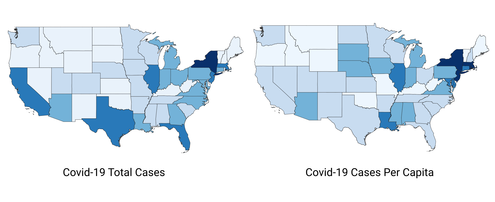

Figure 117: Choropleth (polygon) maps work best with normalized values.

Note: Both maps show Covid-19 data collected by the New York Times and
published [on GitHub](https://github.com/nytimes/covid-19-data). In one
map, we normalized (divided) values by population in each state,
according to the 2018 US Census American Community Survey, the most
recent data available on the day of writing. We didn’t add legends and
other important cartographic elements so that you can better focus on
interpreting spatial patterns. In both cases, we used Jenks natural
breaks for classification.

What are the worst-hit states according to the map showing total
Covid-19 counts? If you are familiar with the US geography, you can
quickly tell that these are New York, New Jersey, Massachusetts,
Florida, Illinois, Texas, and California. But five of these happen to be
some of the most populous states in the US, so it makes sense that they
will also have higher Covid-19 cases.

Now, how about the map on the right? You can see that New York and its
neighbors, including New Jersey and Massachusetts, have by far the
highest rates per capita (per person), which we saw in the first map.
But you can also see that in fact California, Texas, and Florida were
impacted to a lesser extent than the map on the left had suggested. So
the map with per-capita values is a much better illustration to the
story about New York being the epicenter of the Covid-19 crisis in the
United States (at least in the spring of 2020).

#### Different ways to normalize data

You can normalize data in many ways, and there is not necessarily one
acceptable way of doing it.

One of the most common ways of normalization is deriving “per capita”,
or “per person” values. If values are small, such as rare disease cases
or lottery winners, they can be presented as “per 1,000” or “per
100,000” people. Divide your quantity by population in that area to
derive per capita values.

Choropleth (polygon) maps work well with percentages. The good news is,
humans like percentages too. It is quite natural for us to understand
that a 9% unemployment rate means that of 100 people who were willing to
work, nine were unable to find a job. To derive a percentage for
unemployment, divide the number of unemployed people by labor force size
(adult population who are willing and able to work), and multiply by
100.

Unlike counts, most *measured* variables do not need normalization
because they belong to a scale. For example, median age (the age of the
“middle” person in a population, when sorted from youngest to oldest)
can be directly compared among populations. We know that humans live
anywhere between 0 and 120 years or so, and we wouldn’t expect median
ages to be vastly different from one country to another (maybe twice,
but not tenfold). Median incomes, if measured in the same currency, also
belong to the same scale and can be compared directly.

#### How not to normalize values

Absolute values are very important for context. Saying that “20% of
blond men living in in town X won the lottery” may sound like a catchy
headline, but in reality the town has 450 residents, of those 200 are
men, and of those only 5 have light hair color. One of those five (and
here comes the 20%) was lucky to win the lottery, so technically the
headline didn’t lie.

This is, of course, an extreme and comic example, but exaggerations in
this spirit are not uncommon. If you want readers to trust you, make
sure you are open about total counts when reporting normalized values
(such as percentages or per capita values).

Absolute values are important for another reason: behind numbers there
are often people, and smaller, normalized values may hide the scale of
the problem. Saying that “the unemployment rate is only 5%” is valid,
but the 5% of, say, Indian labor force (around 522 million) is about 26
million, which is pretty much the total population of Australia.

Exercise your best judgement when you normalize values. Make sure you
don’t blow numbers out of proportion by normalizing values in smaller
populations. But also don’t hide large counts behind smaller percentages
for larger populations.

At this point, you should have enough geocoding and spreadsheet skills
to aid you with map making. In the following section, we will talk about
geographical data in general and will introduce different geospatial
file formats to ensure you are ready to create, use, and share map data.

Convert to GeoJSON format
-------------------------

Geospatial data comes in an overwhelming number of file formats. We will
tell you about a few most common ones so that you have a general idea of
what tools you can use to work with them. But before we do that, let’s
talk about the basics of geospatial (map) data.

#### About geospatial data

The first thing to know about geospatial data is that it consists of two
components, **location** and **attribute**. When you use Google Maps to
search for a restaurant, you get a red marker on the screen that points
to the latitude and longitude of the physical location of the restaurant
in the real world. These latitude and longitude (two numbers) are your
location component. The name of the restaurant, its human-friendly
address, and guest reviews are the attributes, which bring value to your
location data.

Second, geospatial data can be **raster** or **vector**, as illustrated
in Figure <a href="#fig:geospatial-raster-vector">118</a>. Raster data
is a grid of cells (“pixels”) of a certain size (for example, 1 meter by
1 meter). For example, satellite images of the Earth that you see on
Google Maps are raster geospatial data. Each pixel contains the color of
Earth that satellite cameras were able to capture. People and algorithms
can then use raster data (images) to create outlines of buildings,
lakes, roads, and other objects. These outlines become vector data. For
example, most of [OpenStreetMap](https://www.openstreetmap.org) was
built by volunteers tracing outlines of objects from satellite images.

Figure 118: Geospatial data can be raster or vector.

In this book, we will focus on vector data, which is based on points,
lines, and polygons. Vector data can be much more precise than raster
data, because points’ coordinates can be expressed with precise
decimals. In addition, vector data can contain as much extra *attribute*
information about each object as desired, whereas raster data is
generally limited to 1 value per cell, whether it is the Earth color, or
temperature, or altitude. Moreover, vector map files are usually much
smaller in size than raster ones.

Let’s take a look at some of the most common vector file formats.

#### GeoJSON

[GeoJSON](https://geojson.org) is a newer, popular open format for map
data that comes in `.geojson` or `.json` files. It was first developed
in 2008, and then standardized in 2016 by the Internet Engineering Task
Force (IETF). The code snippet below represents a single point (feature)
with latitude of 41.76 and longitude of -72.67 in GeoJSON format. That
point has a *name* attribute (property) whose value is *Hartford*.

    {
      "type": "Feature",
      "geometry": {
        "type": "Point",
        "coordinates": [-72.67, 41.76]
      },
      "properties": {
        "name": "Hartford"
      }
    }

The simplicity and readability of GeoJSON allows you to edit it even in
the most simple text editor. We strongly recommend you use and share
your map data in GeoJSON. Web-based maps, such as those built with
Leaflet, Mapbox, Google Maps JS API, and Carto, as well as ArcGIS and
QGIS all support GeoJSON.

Also, your GitHub repository will automatically display any GeoJSON
files in a map view, like is shown in Figure
<a href="#fig:geojson-github">119</a>.

Figure 119: GitHub can show previews of GeoJSON files stored in
repositories.

In GeoJSON, coordinates are ordered in *longitude-latitude* format, the
same as X-Y coordinates in mathematics. This is the opposite of Google
Maps and some other web map tools, which order values as
*latitude-longitude*. For example, *Hartford, Conn.* is located at
(-72.67, 41.76) according to GeoJSON, but at (41.76, -72.67) in Google
Maps. Neither notation is right or wrong, just make sure you know which
one you are dealing with.

#### Shapefiles

The shapefile format was created in the 1990s by Esri, the company that
develops ArcGIS software. Shapefiles typically appear as a folder of
subfiles with suffixes such as `.shp`, `.shx`, and `.dbf`. The folder
with shapefiles is often compressed in a `.zip` file.

Although government agencies commonly distribute map data in shapefile
format, the standard tools for editing these files—ArcGIS and its free
and open-source cousin, QGIS—are not as easy to learn as other tools in
this book. For this reason, we recommend converting shapefiles into
GeoJSON files if possible. [Mapshaper](mapshaper.html), discussed a bit
later in the chapter, can perform such conversion.

#### GPS Exchange Format (GPX)

If you ever exported your Strava run or a bike ride from a GPS device,
chances are you ended up with a `.gpx` file. GPX is an open standard and
is based on XML markup language. Like GeoJSON, you can inspect a GPX
file in any simple text editor to see its contents. Most likely, you
will see a collection timestamps and latitude/longitude coordinates of
the recording GPS device at that particular time. You should be able to
convert GPX to GeoJSON with [GeoJson.io](geojsonio.html) utility
discussed later in this chapter.

#### Keyhole Markup Language (or KML)

The KML format rose in popularity during the late 2000s. Google Earth, a
free and user-friendly tool, allowed many people to view and edit
geographic data. KML files were often used with maps powered by Google
Fusion Tables, but that became history in late 2019.
[GeoJson.io](geojsonio.html) should be able to convert your KML file
into a GeoJSON.

Sometimes `.kml` files are distributed in a compressed `.kmz` format.
See [Converting from KMZ to KML format](convert-kmz) section of this
book to learn to convert.

#### MapInfo TAB

Similar to Esri’s shapefiles, MapInfo’s TAB format comes as a folder
with `.tab`, `.dat`, `.ind`, and some other files. It is a proprietary
format created and supported by MapInfo, Esri’s competitor, and is
designed to work well with MapInfo Pro GIS software. Unfortunately, you
will most likely need MapInfo Pro, QGIS, or ArcGIS to re-save these as
GeoJSON or a Shapefile.

GeoJson.io to Convert, Edit, and Create Map Data
------------------------------------------------

[GeoJson.io](https://geojson.io) is a popular open-source web tool to
convert, edit, and create GeoJSON files. The tool was originally
developed by [Tom MacWright](https://macwright.org/about/) in 2013 and
quickly became a go-to tool for geospatial practitioners.

In this tutorial, we will show you how to convert existing KML, GPX,
TopoJSON, and even CSV files with lat/lon data into GeoJSON files. We
will also look at editing attribute data and adding new features to
GeoJSON files, and creating them from scratch by tracing satellite
imagery.

#### Convert KML, GPX, and other formats into GeoJSON

Navigate to [GeoJson.io](https://geojson.io). You will see a map on the
left, and a Table/JSON attribute view area on the right. At the start,
it represents an empty feature collection (features are your points,
lines, and polygons).

Drag and drop your geospatial data file into the map area on the left.
Alternatively, you can also import a file from *Open &gt; File* menu. If
you don’t have a geospatial file, download [Hartford
parks](data/hartford-parks.kml) in KML format. If GeoJson.io was able to
recognize and import the file, you will see a green popup message in the
upper-left corner saying how many features (in case of Hartford parks,
polygons) were imported. Figure <a href="#fig:geojson-io-import">120</a>
shows us that 62 features were imported from the sample Hartford parks
file. You can see that the polygons appeared on top of the Mapbox world
layer.

Note: If GeoJson.io couldn’t import your file, you will see a red popup
saying it “Could not detect file type”. You will need to use a different
tool, such as Mapshaper or QGIS, to convert your file to GeoJSON.

Figure 120: GeoJson.io successfully imported Hartford parks KML file.

You can now save your file to GeoJSON. Go to *Save &gt; GeoJSON* to
download a converted GeoJSON file to your computer.

#### Create GeoJSON from a CSV file

GeoJson.io can transform a spreadsheet with *latitude* (or *lat*) and
*longitude* (or *lon*) columns into a GeoJSON file of point features.
Each row in the spreadsheet becomes its own point, and all columns other
than *lat* and *lon* become *attributes* (or *properties*) of point
features. An example of such spreadsheet is shown in Figure
<a href="#fig:geojson-io-csv-data">121</a>. You can [download
it](data/hartford-and-suburbs.csv) for the exercise.

Figure 121: A spreadsheet with lat/lon columns can be transformed into a
GeoJSON with point features.

1.  Save your spreadsheet as a CSV file, and drag-and-drop it to the map
    area of GeoJson.io. You should see a green popup in the upper-left
    corner notifying you how many features were imported.

Note: If you had some data on the map already, GeoJson.io wouldn’t erase
anything but instead would add point features to the existing map.

1.  Click on a marker to see a popup with point properties. If you used
    the sample file with towns around Hartford, you will see *town*,
    *community\_type*, and *wiki\_link* features in addition to the
    tool’s default *marker-color*, *marker-size*, and *marker-symbol*
    fields.
2.  The popup is interactive, and you can click and edit each property
    (including property names). You can also add a new property by
    clicking the *Add row* button. You can delete the marker by clicking
    *Delete feature* button.
3.  Click *Save* to record all marker changes to the GeoJSON. This will
    close the popup window, and you will see updated markers in the JSON
    tab to the right of the map.
4.  It may be quicker to view all data as a table instead of dealing
    with individual marker popups. In **Table** tab to the right of the
    map, you can add, rename, and remove columns from *all* features
    (markers) at once. Table cells are also modifiable, so you can edit
    your data there.
5.  Once you are happy with your map data, go to *Save &gt; GeoJSON* to
    download the result to your computer. You can also log into
    GeoJson.io with your GitHub account and save directly to your
    repository.

<iframe src="images/11-transform/dataviz-geojsonio-640.gif" width="100%" height="466px">
</iframe>

Figure 122: A spreadsheet with coordinates columns can be transformed
into a GeoJSON with point features.

#### Create a GeoJSON from scratch using drawing tools

GeoJson.io lets you create geospatial files from scratch, using simple
drawing tools to put markers (points), lines, and polygons to
appropriate locations. These are useful when you have no original file
to work with.

1.  Open GeoJson.io and in the lower-left corner switch from Mapbox
    (vector tiles) to Satellite.
2.  In the upper-right corner of the map, use the Search tool to find
    the area you’re interested in mapping. For this exercise, we will
    use tennis courts at Trinity College, Hartford, as shown in Figure
    <a href="#fig:geojson-io-draw">123</a>.

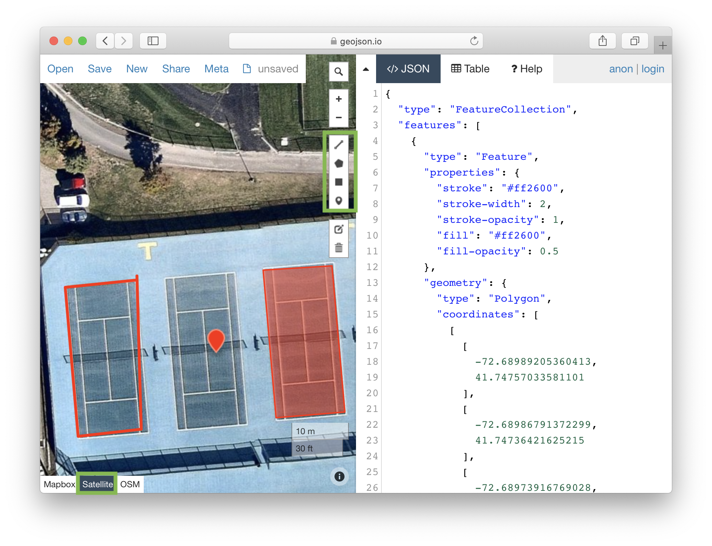

Figure 123: Use drawing tools to create points, lines, and polygons in
GeoJson.io.

1.  In the toolbar, you have a choice of four drawing tools: a polyline
    (which is a series of points connected by lines, but not closed like
    a polygon), a polygon, a rectangle (which is just an instance of a
    polygon), and a marker (point). Let’s start with the latter.
2.  Click on the *Draw a marker* button, and click anywhere on the map
    to place it. You will see a gray marker that is now part of your
    map. You can modify its properties, or delete it in the interactive
    pop-up.
3.  Next, choose *Draw a polyline* and click on multiple locations in
    the map to see connected lines appearing. To finish and create a
    feature, click again on the final point. Polylines are generally
    used for roads and paths.
4.  Drawing a polygon is similar to drawing a polyline, except that you
    need to complete the feature by making your final point at the same
    location as your initial point. Polygons are used to define object
    boundaries, from continents to buildings, cars, and anything that
    has significant dimensions.
5.  Use *Edit layers* tool (the one above *Delete*) to move a marker to
    a better position, or adjust the shapes of your features.

Once you are done creating features and their physical boundaries, it is
time to add meaningful attribution data. Use the interactive popups or
the Table view to give objects names and other qualities. When finished,
save the GeoJSON to your computer.

Drawing tools can be used to correct your existing GeoJSON files. For
example, if you created a GeoJSON from a CSV file, you might decide to
move some markers with *Edit layers* tool instead of modifying their
latitude and longitude values. Or you might decide that your polygons
(eg those representing Hartford parks) are too “simplified”, and make
them more precise with the satellite imagery.

In the next section, we will introduce Mapshaper, another free online
tool to convert and modify geospatial files.

Mapshaper to Convert, Edit, and Join Data
-----------------------------------------

Like [GeoJson.io](geojsonio.html), [Mapshaper](https://mapshaper.org) is
a free, open-source editor that can convert geospatial files, edit
attribute data, filter and dissolve features, simplify boundaries to
make files smaller, and many more. Unlike GeoJson.io, Mapshaper doesn’t
have drawing tools, so you won’t be able to create geospatial files from
scratch.

Mapshaper is developed and maintained by Matthew Bloch [on
GitHub](https://github.com/mbloch/mapshaper). It is written in
JavaScript, so we recommend you use a recent version of Firefox or
Chrome.

This free and easy-to-learn Mapshaper web tool has replaced *many* of
our map preparation tasks that previously required expensive and
hard-to-learn ArcGIS software, or its free but
still-challenging-to-learn cousin, QGIS. Even advanced GIS users may
discover Mapshaper to be a quick alternative for some common but
time-consuming tasks.

#### Import, convert, and export map boundary files

You can use Mapshaper to convert between geospatial file formats. Unlike
GeoJson.io, Mapshaper also supports Esri Shapefiles (which is a folder
of individual files with the same name, but different extensions), so
you can easily convert a Shapefile into a web-friendly GeoJSON.

1.  Navigate to [Mapshaper.org](https://mapshaper.org). The start page
    is two large drag-and-drop zones which you can use to import your
    file. The smaller area at the bottom, *Quick import*, uses default
    import settings and is a good way to begin.
2.  Drag and drop your geospatial file to the *Quick import* area, or
    use our sample Shapefile of [US state
    boundaries](data/us-states.zip). This is a `.zip` archive which
    contains a folder with all necessary files.

Note: If you want to import a folder, you need to either select all
files inside that folder and drop them all together to the import area,
or create a `.zip` archive.

1.  Each imported file becomes a layer, and is accessible from the
    dropdown menu in the top-middle of the browser window. There, you
    can see how many features each layer has, toggle their visibility,
    or delete them.
2.  To export, go to *Export* in the upper-right corner, and select a
    desired file format. The choice of export formats is shown in Figure
    <a href="#fig:mapshaper-export">124</a>. As of July 2020, these are
    Shapefile, GeoJSON, TopoJSON (similar to GeoJSON, but with
    topographical data), JSON records, CSV, or SVG (Scalable Vector
    Graphics, for web and print). If you export more than one layer at a
    time, Mapshaper will archive them first, and you will download an
    `output.zip` that contains all exported layers.

Figure 124: You can use Mapshaper to quickly convert between geospatial
file formats.

Tip: Mapshaper doesn’t work with KML or KMZ files, but you can use
[GeoJson.io](#geojson.html) to convert these.

#### Edit data for specific polygons

You can edit attribute data of individual polygons (and also points and
lines) in Mapshaper. Figure <a href="#fig:mapshaper-edit">125</a> shows
you how.

1.  Import the file whose polygon attributes you want to edit.
2.  Under the cursor tool, select *edit attributes*.
3.  Click on the polygon you want to edit. A pop-up will appear in the
    upper-left corner listing all attributes and values of the polygon.
4.  Click on any value (underlined, in blue) and edit it.
5.  When you are done, export your geospatial file by clicking *Export*
    and choosing the desired file format.

Figure 125: Use *edit attributes* tool (under Cursor tool) to edit
attributes of polygons, lines, and points.

#### Simplify map boundaries to reduce file size

You may not need precise and detailed map boundaries for data
visualization projects where zoomed-out geographies are shown. Detailed
boundaries are heavy, and may slow down your web maps.

Consider two maps of the contiguous US states, also known as Lower-48,
shown in Figure <a href="#fig:mapshaper-simplify-demo">126</a>. The map
on the left is more detailed and is about 230 kilobytes, but the map on
the right is only 37 kilobytes, 6 times smaller!

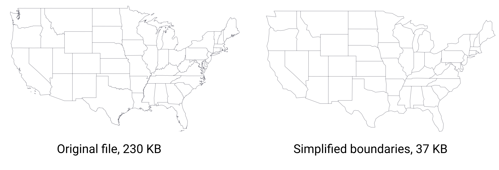

Figure 126: Consider simplifying geometries with Mapshaper to make your
web maps faster.

1.  Import your geo file to Mapshaper. You can use the [sample
    contiguous US states GeoJSON](data/lower-48.geojson).
2.  Click the *Simplify* button in the upper-right corner. The
    Simplification menu will appear, where you can choose one of three
    methods. We recommend checking *prevent shape removal*, and leaving
    the default *Visvalingam / weighted area*. Click *Apply*.
3.  You will see a slider with `100%` appear on top (Figure
    <a href="#fig:mapshaper-simplify">127</a>), replacing the layer
    selection dropdown. Move the slider to the right and see the map
    simplify its shape as you go. Stop when you think the map looks
    appropriate (when the shapes are still recognizable).
4.  Mapshaper may suggest to repair line intersections in the upper-left
    corner. Click *Repair*.
5.  You can now export your file using the *Export* feature.

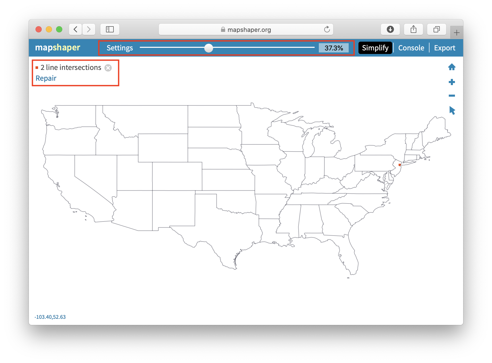

Figure 127: Use Simplify & Repair tools in Mapshaper.

Tip: You may find the US shape a bit unusual and vertically “shrunk”. In
**Console**, type `-proj EPSG:3857` to change projection to Web
Mercator, which is more common.

#### Dissolve internal polygons to create an outline map

Mapshaper’s most powerful tools are available through **Console**, which
allows you to type commands for common map editing tasks. One of such
tasks is to create an outline map by removing the internal boundaries.
For example, you can dissolve state boundaries of the US map in the
previous exercise to get the outline of the country, like is shown in
Figure <a href="#fig:mapshaper-dissolve">128</a>.

Figure 128: Mapshaper lets you dissolve boundaries to create an outline
shape.

Click the Console button, which opens a window to type in commands.
Enter the command below, then press return (Enter).

    -dissolve

You will see that internal boundaries became lighter color, and that’s
Mapshaper’s way of saying they no longer exist. You can now export your
outline shape.

#### Clip a map to match an outline layer

The state of Connecticut consists of 8 counties, which in turn are
divided into towns. There are a total of 169 towns in Connecticut.
Imagine you are given a [boundary file of all 169
towns](data/ct-towns.geojson), and [the outline of Hartford
county](data/hartfordcounty-outline.geojson). You need to “cut” the
original towns map to only include those towns that fall within Hartford
county.

Mapshaper allows you to do just that using one simple `-clip` command.

1.  Import two boundary files into Mapshaper. One is the larger one that
    is being clipped (if you use sample files, *ct-towns*), and one is
    the desired final shape (*hartfordcounty-outline*). The latter is
    what ArcGIS calls the “clip feature”.
2.  Make sure your active layer is set to the map you are clipping
    (*ct-towns*).
3.  In the **Console**, type `-clip` followed by the name of your clip
    layer, like that:

<!-- -->

    -clip hartfordcounty-outline

1.  You should see your active layer got clipped. Sometimes you end up
    with tiny “slivers” of clipped areas that remain alongside the
    borders. If that is the case, use the `-filter-slivers` command to
    remove them, like that:

<!-- -->

    -clip hartfordcounty-outline -filter-slivers

1.  Your Mapshaper state should look like pictured in Figure
    <a href="#fig:mapshaper-clip">129</a>. You can now save the file on
    your computer using the *Export* button.

Figure 129: When clipping, make sure your active layer is the one being
clipped (with many features), not the clipping feature iteslf.

#### Remove unwanted data fields

Sometimes map features, such as polygons, lines, and points, contain
unwanted *attributes* (or fields, or columns) that you may want to
remove. In **Console**, use `-filter-fields` editing command to remove
unnecessary fields.

For example, remove all fields except *town*:

    -filter-fields town

If you want to leave more than one field, separate them by a comma, but
without spaces, like that:

    -filter-fields town,state

Note: If you leave a space after comma, you will get a *Command expects
a single value* error.

#### Join spreadsheet data with polygon map

Combining spreadsheet data with geographical boundaries is a common task
for geospatial practitioners. Imagine you have a file with [Connecticut
town boundaries](data/ct-towns.geojson), and you want to add [population
data](data/ct-towns-popdensity.csv) to each of them in order to build a
choropleth map.

Mapshaper provides a powerful `-join` command to join such files.
Remember that you need some common keys in both datasets (such as *town
name*, or *state*, or *country*) in order to join files. Otherwise
Mapshaper has no way of knowing which numbers belong to which polygons.

1.  Import both geospatial file and a CSV dataset into Mapshaper using
    Quick import box.
2.  Make sure both files appear in the drop-down list of layers. Your
    CSV data will be shown as something that resembles a table. Use the
    *Cursor &gt; inspect attributes* tool to make sure the data is
    imported correctly. If you use the sample CT files, note that the
    *ct-towns* layer has *name* attribute with the name of the town, and
    *ct-towns-popdensity* has town names in the *town* column.
3.  Make your geospatial layer (*ct-towns*) is the one active.
4.  Open **Console**, and use the `-join` command, like that:

<!-- -->

    -join ct-towns-popdensity keys=name,town

where `ct-towns-popdensity` is the CSV layer you are merging with, and
`keys` are the attributes that contain values to join by. In case with
our sample files, these would be town names which are stored in `name`
attribute of the map file, and `town` column of the CSV file.

1.  You will see a message in the console notifying you if join was
    performed successfully, or if Mapshaper encountered any errors.
2.  Use the *Cursor &gt; inspect attributes* tool to make sure you see
    CSV columns as fields of your polygons, like is shown in Figure
    <a href="#fig:mapshaper-join">130</a>.
3.  You can now save the file to your computer by clicking the *Export*
    button.

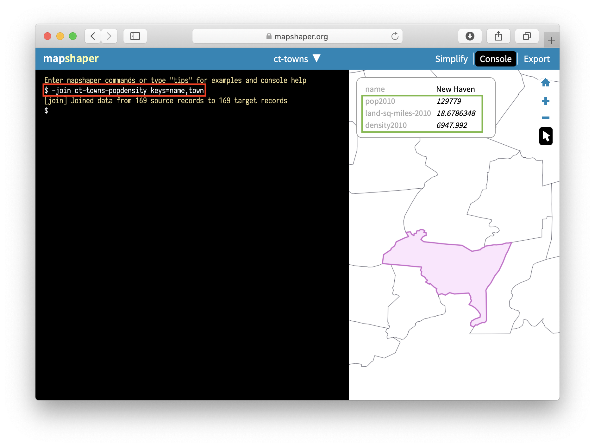

Figure 130: Mapshaper lets you join spatial and CSV files using common
keys (for example, town names).

Tip: To avoid confusion, it may be useful to re-name your CSV column
that contains key values to match the key attribute name of your map. In
our example, you would rename *town* column to *name* column in the CSV,
and your command would end with `keys=name,name`.

Do you remember aggregating address-level point records of hospitals
into [hospital counts per state](pivot-point-to-polygon.html)? Now is a
good time to find that .CSV file and practice your merging skills.

#### Count points in polygons with Mapshaper

Mapshaper lets you count points in polygons, and record that number in
polygon attributes using `-join` command.

1.  Import two geospatial files, one containing polygon boundaries (for
    example, [US state boundaries](data/us-states.geojson)), and another
    containing points that you want to aggregate (for example,
    [hospitals in the US](data/hospitals-points.geojson)).

2.  Make sure your polygons (not points) layer is active by selecting it
    from the dropdown menu.

3.  In **Console**, perform `-join` using a `count()` function, like
    that:

<!-- -->

    -join hospitals-points calc='hospitals = count()' fields=

This command tells Mapshaper to count points inside *hospitals-points*
layer and record them as *hospitals* attribute of the polygons. The
`fields=` part tells Mapshaper to not copy any fields from the points,
because we are performing many-to-one matching (many hospitals per
state, in our case).

1.  Use the *Cursor &gt; inspect attributes* tool to make sure polygons
    obtained a new field with the recorded count of points, like is
    shown in Figure <a href="#fig:mapshaper-count-points">131</a>.

2.  Save the new file using *Export* button and choosing the desired
    output format.

Figure 131: Mapshaper’s -join can count points in polygons.

#### More about joins

As you saw in counting points in polygons example, you do not need to
specify *keys* if you want to perform join based on geographical
locations between two geo files. If one of your files is a CSV, you need
*keys*.

If you don’t have a CSV table that matches the columns in your boundary
map data, you can easily create one. Upload the boundary map to
Mapshaper, and export in CSV format. Open the downloaded file in any
spreadsheet tool. To match data columns in the CSV spreadsheet, use the
[VLOOKUP](vlookup.html) function.

In real life, you will rarely have perfect files with one-to-one
matches, so you might want to have more information about which features
didn’t get matched so that you can fix your data. Mapshaper helps you
keep track of data that is not properly joined or matched. For example,
if the polygon map contains 169 features (one for each town in
Connecticut), but the CSV table contains only 168 rows of data,
Mapshaper will join all of those with matching keys, and then display
this message:

    [join] Joined data from 168 source records to 168 target records
    [join] 1/169 target records received no data
    [join] 1/169 source records could not be joined

To get more details on which values were not joined, add
`unjoined unmatched -info` flags to your join command, like this:

    -join ct-towns-popdensity keys=name,town unjoined unmatched -info

The `unjoined` flag saves a copy of each unjoined record from the source
table into another layer named *unjoined*. The `unmatched` flag saves a
copy of each unmatched record from the target table to a new layer named
*unmatched*. And the `-info` flag outputs some additional information
about the joining procedure to the console.

#### Merge selected polygons with join and dissolve commands

In Mapshaper, you can merge selected polygons into larger “clusters”
using `-join` and `-dissolve` commands.

Imagine that you are employed by the CT Department of Public Health, and
your task is to divide 169 towns into 20 so-called Health Districts and
produce a new geospatial file. By the way, health districts [are a real
thing in
Connecticut](https://portal.ct.gov/DPH/Local-Health-Admin/LHA/Local-Health-Administration---Site-Map).

You should begin by creating a *crosswalk* of towns and their health
districts. It can be as simple as a two-column CSV list of a town and
its district. Because your boss didn’t give you a list of towns in a
spreadsheet format, but instead a GeoJSON file with town boundaries,
let’s extract a list of towns from it.

1.  Import [ct-towns.geojson](data/ct-towns.geojson) to Mapshaper using
    Quick import box.
2.  You can use the *Cursor &gt; inspect attributes* tool to see that
    each polygon has a *name* attribute with the name of the town.
3.  Save attribute data as a CSV file using *Export* button. Open the
    file in any spreadsheet tool. You will see that your data is a
    one-column file with a \*name& column that lists 169 towns.
4.  Create a second column titled *merged* and copy-paste values from
    the first, *name* column. At this point your spreadsheet contains
    two columns with the same values.
5.  Pick a few towns, for example *West Hartford* and *Bloomfield*, and
    assign “Bloomfield-West Hartford” to their *merged* column, like is
    shown in Figure <a href="#fig:mapshaper-merge-csv">132</a>. You may
    stop right here and move to the next step, or keep assigning
    district names to a few other neighboring towns.

Figure 132: Create a two-column crosswalk of towns and which districts
they should be merged to.

1.  Save this new file as *ct-towns-merged.csv*, and drag-and-drop it to
    Mapshaper on top of your *ct-towns* layer. Click *Import*.
2.  This new CSV layer will be added as *ct-towns-merged* and will
    appear as a series of table cells. From the dropdown menu, select
    *ct-towns* to get back to your map.
3.  Now you are ready to merge certain towns into districts according to
    your uploaded CSV file. Open **Console**, and type:

<!-- -->

    -join ct-towns-merged keys=name,name

to join the CSV layer with the boundaries layer that you see on the
screen, followed by

    -dissolve merged

to dissolve polygons of towns according to the *merged* column of the
CSV file.

In our example, only Bloomfield and West Hartford are dissolved into a
combined “Bloomfield-West Hartford” regional health district (with the
shared boundary between towns becoming grayed out), and all of the other
polygons remain the same. Figure <a href="#fig:mapshaper-merge">133</a>
shows the final result.

Figure 133: Merge polygons based on a predefined crosswalk.

You can inspect attribute data of polygons using *Cursor &gt; inspect
attributes* tool, and save the resulting file using the *Export* button.

#### Learn more advanced MapShaper methods

There are many more commands within Mapshaper that are worth exploring
if you are serious about GIS, such as changing projections, filtering
features using JavaScript expressions, assigning colors to polygons
based on values, and many more. Explore the
[Wiki](https://github.com/mbloch/mapshaper/wiki/Command-Reference) of
Mapshaper project on GitHub for more commands and examples.

TODO: Add Mapwarper section here

Convert a Compressed KMZ file to KML format
-------------------------------------------

Sometimes KML files are distributed in compressed KMZ format. The
easiest way to convert is to use free Google Earth Pro.

1.  Download and install [Google Earth
    Pro](https://www.google.com/earth/versions/) for desktop.
2.  Double-click on any .kmz file to open it in Google Earth Pro.
    Alternatively, open Google Earth Pro first, and go to *File &gt;
    Open* and choose your KMZ file.
3.  Right-click (or control-click) on the KMZ layer under Places menu,
    and select *Save Place As…*, like is shown in Figure
    <a href="#fig:kmz-earth">134</a>.

Figure 134: In Google Earth Pro, right-click KMZ layer and choose *Save
Place As*.

1.  In the dropdown menu of *Save file…* window, choose KML format, like
    is shown in Figure <a href="#fig:kmz-save-as">135</a>.

Figure 135: Save as KML, not KMZ.

Alternatively, you can use any zip-utility to extract a KML file from
KMZ. KMZ is simply a ‘zipped’ version of a KML file!

<!--chapter:end:11-transform.Rmd-->

Detect Bias in Data Stories
===========================

While we like to believe data visualizations simply “tell the truth,”
when you dig further into this topic, you realize that there are
multiple ways to represent reality. In this chapter, you will learn how
visualizations display the biases of the people and the software that
create them. Although we cannot stop bias, we can teach people to look
for and detect it, and be aware of our own.

Sections in this chapter:

-   [How to Lie with Charts](how-to-lie-with-charts.html), inspired by
    Darrell Huff (1954)
-   [How to Lie with Maps](how-to-lie-with-maps.html), inspired by Mark
    Monmonier (1996)

Enroll in our free online course *TO DO add link*, which introduces
these topics in the brief video below, and offers more exercises and
opportunities to interact with instructors and other learners.

<iframe width="560" height="315" src="https://www.youtube.com/embed/eWfI_ANQT2Q?rel=0" frameborder="0" allow="autoplay; encrypted-media" allowfullscreen>
</iframe>

#### Learn more

-   Darrell Huff, How to Lie with Statistics (W. W. Norton & Company,
    1954),
    <a href="http://books.google.com/books?isbn=0393070875" class="uri">http://books.google.com/books?isbn=0393070875</a>
-   Mark S. Monmonier, How to Lie with Maps, 2nd ed. (University of
    Chicago Press, 1996),
    <a href="http://books.google.com/books?isbn=0226534219" class="uri">http://books.google.com/books?isbn=0226534219</a>
-   Nathan Yau, “How to Spot Visualization Lies,” FlowingData, February
    9, 2017,
    <a href="http://flowingdata.com/2017/02/09/how-to-spot-visualization-lies/" class="uri">http://flowingdata.com/2017/02/09/how-to-spot-visualization-lies/</a>

How to Lie with Charts
----------------------

One of the best ways to learn how to detect bias in data visualization
is to intentionally manipulate a chart, and tell two (or more) opposing
stories with the same data. You’ll learn what to watch out for when
viewing other people’s charts, and think more carefully about the
ethical issues when you design your own.

This exercise was inspired by a classic book published more than fifty
years ago: Darrell Huff, *How to Lie with Statistics* (W. W. Norton &
Company, 1954),
<a href="http://books.google.com/books?isbn=0393070875" class="uri">http://books.google.com/books?isbn=0393070875</a>

Right-click this link and Save to download this sample data in CSV
format to your computer:
[us-gross-domestic-product-per-capita](data/us-gross-domestic-product-per-capita.csv).
This historical data on economic productivity comes from the World Bank,
World Development Indicators,
<a href="http://data.worldbank.org/data-catalog/world-development-indicators" class="uri">http://data.worldbank.org/data-catalog/world-development-indicators</a>

Upload the CSV file to your Google Drive (with Settings to Convert to
Google format) to create a Google Sheet.

Select the data cells and Insert &gt; Chart &gt; Line chart, similar to
the default version shown below:

<iframe width="600" height="371" seamless frameborder="0" scrolling="no" src="https://docs.google.com/spreadsheets/d/11yrhgBX16JL3O99EfK6mjiRwA6CGZkfuSGXbXhrBLEQ/pubchart?oid=1711889200&amp;format=interactive">
</iframe>

In your Google Sheet chart, double-click the vertical y-axis to edit the
Minimum and Maximum values.

Make the line look “flatter” (slower economic growth) by lowering the
minimum to $36,000, and increasing the maximum to $100,000, as shown
below:

<iframe width="600" height="371" seamless frameborder="0" scrolling="no" src="https://docs.google.com/spreadsheets/d/11yrhgBX16JL3O99EfK6mjiRwA6CGZkfuSGXbXhrBLEQ/pubchart?oid=1294345990&amp;format=interactive">
</iframe>

Make the line look like a “sharper increase” (faster economic growth) by
increasing the minimum to $38,000, and lowering maximum to $52,000, as
shown below:

<iframe width="600" height="371" seamless frameborder="0" scrolling="no" src="https://docs.google.com/spreadsheets/d/11yrhgBX16JL3O99EfK6mjiRwA6CGZkfuSGXbXhrBLEQ/pubchart?oid=534244967&amp;format=interactive">
</iframe>

\*\* TO DO – add conclusion \*\*

How to Lie with Maps
--------------------

One of the best ways to learn how to detect bias in data visualization
is to intentionally manipulate a map, and tell two (or more) opposing
stories with the same data. You’ll learn what to watch out for when
viewing other people’s maps, and think more carefully about the ethical
issues when you design your own.

This exercise was inspired by Mark S. Monmonier, *How to Lie with Maps,
2nd ed.* (University of Chicago Press, 1996),
<a href="http://books.google.com/books?isbn=0226534219" class="uri">http://books.google.com/books?isbn=0226534219</a>

First, scroll through this data on Median Household Income for
Hartford-area towns, 2011-15, from American Community Survey 5-year
estimates. Or right-click to [open this Google Sheet in a new
tab](https://docs.google.com/spreadsheets/d/13bFHsXJtADIkUCGgjpO76RjrV0OAu62hzK-J3bXEVsk/edit#gid=556312122).

<iframe src="https://docs.google.com/spreadsheets/d/13bFHsXJtADIkUCGgjpO76RjrV0OAu62hzK-J3bXEVsk/pubhtml?gid=556312122&amp;single=true&amp;widget=true&amp;headers=false">
</iframe>

Next, explore two different polygon maps of the same data. Use the
drop-down menu to compare “Extreme Differences” versus “Uniform
Equality”

<iframe src="https://handsondataviz.github.io/leaflet-how-to-lie-with-maps/" width="90%" height="500">
</iframe>

Why are these two maps portray the same data so differently? To see the
answer, look at the data ranges. . ..

\*\* TO DO \*\*

Create your own version…

TODO: Add section on how interactive maps such as Google Maps change
borders and data depending on the internet address of the user

<!--chapter:end:12-detect.Rmd-->

Tell Your Data Story
====================

TODO: Write this chapter: Tell the story about your data, including its
most meaningful insights and limitations Write compelling titles,
labels, and sentences to accompany your visualization. Call attention to
the most meaningful insights in your chart, and explain any data
limitations.

This chapter draws inspiration from Cole Nussbaumer Knaflic,
*Storytelling with Data: A Data Visualization Guide for Business
Professionals* (Wiley, 2015),
<a href="http://www.storytellingwithdata.com/book/" class="uri">http://www.storytellingwithdata.com/book/</a>

-   Beginning, Middle, and End
-   Draw Attention to Meaning
-   Integrate Story with Your Data
-   Write Clearly about What You Visualize
-   Credit Data Sources and Collaborators

Credit sources and collaborators on dataviz products and readme files

Under US law, you cannot copyright data, such as the raw information in
the rows and columns of a spreadsheet. But you can copy, but
representations of data can be protected by copyright. … explain… In the
spirit of openness, we encourage you to share your data visualizations
under a Creative Commons license… explain… in fact, this book is
copyrighted, and the source text is publicly available under a Creative
Commons TODO: TYPE license…

<!--chapter:end:13-story.Rmd-->

Appendix
========

Fix Common Mistakes
===================

Creating your data visualizations through code templates hosted on
GitHub has multiple advantages over drag-and-drop tools. Coding gives
you more power to customize their appearance and interactive features,
and to control where your data and products reside online. But there’s
also a trade-off. Code can “break” and leave you staring at a blank
screen. Sometimes problems happens through no fault of your own, such as
when a “code dependency” to an online background map or code library is
unexpectedly interrupted. But more often it seems that problems arise
because we make simple mistakes that break our own code. Whatever the
cause, one big drawback of working with code is that you’re also
responsible for fixing it.

We designed this section as a guide to help new coders diagnose and
solve common errors when working with code templates on GitHub. We
understand the feeling you experience when a simple typo—such as a
misplaced semicolon (;)—makes your data visualization disappear from the
screen. Finding the source of the problem can be very frustrating. But
breaking your code—and figuring out how to fix it—also can be a great
way to learn, because trial-and-error on a computer often provides
immediate feedback that supports the learning process and develops our
thinking.

TODO: Start here; Reorganize the logic of subsections below, perhaps in
this way

-   Problems with Mac computers
-   Problems with data tables
-   Problems with iframes (since this chapter appears before code
    templates)
-   Problems with GitHub forking and hosting
-   Problems with code templates

#### Problems with Mac computers: cannot see filename extension

Several tools in this book will not work properly if your computer does
not display the filename extensions, meaning the abbreviated file format
that appears after the period, such as `data.csv` or `map.geojson`. The
Mac computer operating system hides these by default, so you need to
turn them on by going to Finder &gt; Preferences &gt; Advanced, and
check the box to *Show all filename extensions*, as shown in Figure
<a href="#fig:mac-file-extensions2">136</a>.

Preferences &gt; Advanced and check the box to *Show all filename
extensions*." /&gt;

Figure 136: On a Mac, go to Finder &gt; Preferences &gt; Advanced and
check the box to *Show all filename extensions*.

#### Problems with data tables

Avoid typing blank spaces after column headers—or any spreadsheet
entries—since some data visualization tools will not match them with
headers lacking a blank character.

#### Problems with iframes

##### My iframe does not appear in my web page

-   Go back to the [Embed tutorials in this book](embed.html) to
    double-check the directions
-   Items listed in your iframe (such as the URL, width, or height)
    should be enclosed inside straight quotation marks (single or
    double)
    -   BROKEN iframe (missing quotation marks for width and height)

    <!-- -->

        <iframe src="https://handsondataviz.github.io/leaflet-map-simple" width=90% height=350></iframe>

    -   FIXED iframe (with correct quotation marks)

    <!-- -->

        <iframe src="https://handsondataviz.github.io/leaflet-map-simple" width="90%" height="350"></iframe>
-   Use only `https` (the extra ‘s’ means ‘secure’), not `http`. Some
    web browsers will block content if it mixes http and https
    resources, and some code templates in this book require https.

-   Use only straight quotes, not curly quotes. Avoid pasting text from
    a word-processor into GitHub, which can accidentally carry over
    curly quotes. Typing directly into the GitHub editor will create
    straight quotes.

TODO: Test one way to fix GitHub errors by going into the commits and
going back to a previous version of the code. Is this possible in the
web version?

#### Safely Delete your GitHub Repo and Start Over

If you need to delete your GitHub repo and start over, here’s a simple
way to safely save your work:

-   Go to the top-level of your GitHub repository, similar to
    `https://github.com/USERNAME/REPOSITORY`
-   Click the green “Clone or Download” button, and select Download Zip
    to receive a compressed folder of your repo contents on your
    computer.
-   In your GitHub repo, click on Settings (upper-right area) and scroll
    down to Delete This Repository.
-   To prevent accidental deletions, GitHub requires you to type in the
    REPOSITORY name.
-   Now you can start over in one of these ways:
    -   If you wish to [Create a Simple Web Page with GitHub
        Pages](github-pages.html), follow that tutorial again.
    -   OR
    -   Fork another copy of the original GitHub repository to your
        account. After you create your copy, if you wish to add selected
        files that you previously downloaded to your computer, follow
        directions to [Upload Code with GitHub](create-repo) in the
        second half of this tutorial in this book

#### Problems with Creating a Simple Web Page with GitHub Pages

If you followed the [Create a Simple Web Page with GitHub Pages
tutorial](github-pages.html), it should have created two web links (or
URLs):

-   your code repository, in this format:
    `https://github.com/USERNAME/REPOSITORY`
-   your published web page, in this format:
    `https://USERNAME.github.io/REPOSITORY`

Be sure to insert your GitHub username, and your GitHub repository name,
in the general formats above.

These URLs are NOT case-sensitive, which means that
`https://github.com/USERNAME` and `https://gitub.com/username` point to
the same location.

##### My simple GitHub web page does not appear

-   Make sure that you are pointing to the correct URL for your
    published web page, in the format shown above.

-   Be patient. During busy periods on GitHub, it may take up to 1
    minute for new content to appear in your browser.

-   **MOVE UP** If your map does *not* appear right away, wait up to 30
    seconds for GitHub Pages to finish processing your edits. Then do a
    “hard refresh” to [bypass any saved content in your browser
    cache](https://en.wikipedia.org/wiki/Wikipedia:Bypass_your_cache)
    and re-download the entire web page from the server, using one of
    these key combinations:

    -   Ctrl + F5 (most browsers for Windows or Linux)
    -   Command + Shift + R (Chrome or Firefox for Mac)
    -   Shift + Reload button toolbar (Safari for Mac)
    -   Ctrl + Shift + Backspace (on Chromebook)

-   Test the link to your published web page in a different browser. If
    you normally use Chrome, try Firefox.

-   On rare occasions, the GitHub service or GitHub Pages feature may be
    down. Check
    <a href="https://status.github.com" class="uri">https://status.github.com</a>.

##### My simple GitHub web page does not display my iframe

-   If you followed the [Create a Simple Web Page with GitHub Pages
    tutorial](github-pages) and inserted an iframe in the README.md
    file, it will appear in your published web page, under these
    conditions:
    -   Ideally, your README.md should be the ONLY file in this GitHub
        repository
    -   Any other files in your repo (such as index.html, default.html,
        or index.md) will block the iframe HTML code in your README.md
        from being published on the web. If you accidentally selected a
        GitHub Pages Theme, you need to delete any extra files it
        created: click each file, select trash can to delete it, and
        commit changes.

#### Problems with Leaflet Maps with Google Sheets template

##### My map does not appear

1.  Confirm that you have completed all of the key steps in the [Leaflet
    Maps with Google Sheets](leaflet-with-google-sheets) tutorial in
    this book, especially these:

-   Sign in to Google and File &gt; Make a Copy of the Google Sheet to
    your Google Drive.
-   File &gt; Publish your Google Sheet (Jack often forgets this key
    step!)
-   Copy your Google Sheet web address from top of your browser (usually
    ends with `...XYZ/edit#gid=0`) and paste into your
    `google-doc-url.js` file in your GitHub repo. Do NOT copy the
    *Published* web address (which usually ends with `...XYZ/pubhtml`)
-   When you paste your Google Sheet web address into
    `google-doc-url.js`, be careful not to erase single-quote marks or
    semicolon
-   Go to your live map link, which should follow this format:
    `https://USERNAME.github.io/REPOSITORY`, refresh the browser, and
    wait at least 30 seconds.

1.  Check your Google Sheet for errors:

-   Do NOT rename column headers (in row 1) of any sheet, because the
    Leaflet Map code looks for these exact words.

-   Do NOT rename row labels (in column A) of any sheet, due to the same
    reason above.

-   In your Points tab, DO NOT leave any blank rows

1.  Confirm on GitHub Status
    (<a href="https://status.github.com/" class="uri">https://status.github.com/</a>)
    that all systems are operational.

2.  If you cannot find the problem, go to the top of this page to Safely
    Delete Your GitHub Repo and Start Over. Also, make a new copy of the
    Google Sheet template, give it a new name, and copy data from your
    old sheet using File &gt; Paste Special &gt; Values Only.

#### Problems with Chart.js code templates

##### Chart displays old data

If you upload new data to your Chart.js code template on GitHub Pages,
and it does not appear in your browser after refreshing and waiting up
to one minute, then GitHub Pages is probably not the cause of the
problem. Instead, some browsers continue to show “old” Chart.js in the
web cache. The simplest solution is to File &gt; Quit your browser and
re-open the link to your Chart.js

TODO: Our Chart.js templates appear blank (just text, no chart) when
viewed in the local browser. But Leaflet maps appear mostly or partially
complete. Why is this, and how should we inform readers about this?
Discuss with Ilya

#### Solve Problems with Browser Developer Tools

Peek inside any website and view the web code under the hood with the
browser developer tools.

In Chrome for Mac, go to View &gt; Developer &gt; Developer Tools

In Firefox for Mac, go to Tools &gt; Web Developer &gt; Inspector

<!--chapter:end:14-fix.Rmd-->

Find Connecticut Data
=====================

Since this book was created in Hartford, Connecticut, we include state
and municipal open data repositories and boundary files.

**Connecticut Open Data**
(<a href="http://data.ct.gov" class="uri">http://data.ct.gov</a>), the
official portal for state government agencies, is hosted on the Socrata
platform, which offers built-in data visualization tools and APIs. See
also how to create a [filtered point map with
Socrata](filtered-point-map-socrata) in this book.

See also separate repositories for individual state agencies:

-   Office of the State Comptroller
    (<a href="http://www.osc.ct.gov/openCT.html" class="uri">http://www.osc.ct.gov/openCT.html</a>)
-   CT State Department of Education
    (<a href="http://www.sde.ct.gov/sde/cwp/view.asp?a=2758&amp;q=334520" class="uri">http://www.sde.ct.gov/sde/cwp/view.asp?a=2758&amp;q=334520</a>)
-   Office of Policy and Management
    (<a href="http://ct.gov/opm/cwp/view.asp?a=3006&amp;Q=383258&amp;opmNav_GID=1386" class="uri">http://ct.gov/opm/cwp/view.asp?a=3006&amp;Q=383258&amp;opmNav_GID=1386</a>)
-   link to all CT state government agencies
    (<a href="http://portal.ct.gov/Department-and-Agencies/" class="uri">http://portal.ct.gov/Department-and-Agencies/</a>)

**Connecticut State Data Center**
(<a href="http://ctsdc.uconn.edu/" class="uri">http://ctsdc.uconn.edu/</a>),
part of the U.S. Census Data Center Network, is the lead agency for US
Census data and other socioeconomic data for Connecticut, and is based
at the University of Connecticut Libraries. The site also features data
visualizations created on the Tableau platform and provides population
projections for the state of Connecticut.

**MAGIC: The Map and Geographic Information Center**
(<a href="http://magic.lib.uconn.edu" class="uri">http://magic.lib.uconn.edu</a>),
based at the University of Connecticut Libraries, specializes in
providing geographic, aerial photography, and map images for the state,
past and present. The site also features interactive maps.

**DataHaven**
(<a href="http://ctdatahaven.org/" class="uri">http://ctdatahaven.org/</a>),
a non-profit organization, collects and interprets information about
Connecticut neighborhoods, such as its Community Wellbeing Survey. Data
resources feature neighborhood profiles for densely-populated areas (New
Haven and Hartford-West Hartford), and town profiles for other areas
across the state.

**Connecticut Data Collaborative**
(<a href="http://ctdata.org" class="uri">http://ctdata.org</a>) is a
public-private partnership that advocates for open data access to drive
planning, policy, budgeting and decision making in Connecticut at the
state, regional and local levels. We democratize public data through
custom data exploration tools and a dynamic town profile tool, hosted on
the open-source CKAN platform. Users can find state and federal data on
topics such as public health, education, crime, municipal data, and
racial profiling data.

**Hartford Data**
(<a href="http://data.hartford.gov" class="uri">http://data.hartford.gov</a>),
the official portal of the City of Hartford municipal government, is
hosted on the Socrata platform, which features built-in visualizations
and APIs. See also how to create a [filtered point map with
Socrata](filtered-point-map-socrata) in this book. Also, the Hartford
Data site links to the City’s ArcGIS Online geographic data
(<a href="http://gisdata.hartford.gov/" class="uri">http://gisdata.hartford.gov/</a>)
and the City’s financial data
(<a href="http://checkbook.hartford.gov/" class="uri">http://checkbook.hartford.gov/</a>)
and budget
(<a href="http://budget.hartford.gov/" class="uri">http://budget.hartford.gov/</a>).

In addition to the official repositories above, Connecticut news
organizations that create data visualizations often include links to
download data files.

**Connecticut Mirror / Trend CT**
(<a href="http://ctmirror.org/" class="uri">http://ctmirror.org/</a>)
and (<a href="http://trendct.org/" class="uri">http://trendct.org/</a>)
are publications of the Connecticut News Project, an independent,
nonpartisan, nonprofit organization that focuses on state policy issues.
Most of their data visualizations are built with open-source code, with
publicly accessible data files. See also their GitHub repository
(<a href="https://github.com/trendct" class="uri">https://github.com/trendct</a>).

**Hartford Courant Data Desk**
(<a href="http://www.courant.com/data-desk" class="uri">http://www.courant.com/data-desk</a>)
produces digital visualizations for the *Hartford Courant*, the largest
daily newspaper in Connecticut, owned by Tribune Publishing. Many of
these data visualizations are published on the Tableau platform, which
allows readers to download the underlying data.

### Census areas in the Hartford region

The [U.S. Census Bureau](https://census.gov) collects and shares
population, housing, and economic data on its open repositories.

-   The Decennial Census is a full count of the population every ten
    years, most recently in 2010 and the upcoming one in 2020. Because
    decennial data are counts and not estimates, they represent “true”
    values and hence come without margins of errors.
-   The American Community Survey (ACS)
    (<a href="https://www.census.gov/programs-surveys/acs/" class="uri">https://www.census.gov/programs-surveys/acs/</a>)
    is annual sample count, which produces:
    -   1-year estimates for areas with populations of 65,000+
    -   5-year estimates for all census areas
    -   ACS used to release 3-year estimates for geographies with
        population of 20,000+, but discontinued after the 2011-2013
        release.

Because ACS produces estimates and not “true” counts, data comes with
margins of errors. Generally, margins of errors are higher for smaller
geographies (eg census blocks) and smaller values (eg the number of
Asian females aged 60+ who live in Union, CT). Hence, one needs to be
critical when using ACS or other survey data.

### Data.census.gov

Data.census.gov
(<a href="https://data.census.gov" class="uri">https://data.census.gov</a>)
is the main platform to access US Census data. It provides an easy
search across census and survey tables. There is an interface to view
tables for various years and geographies, and a download button to save
data as CSV or PDF. It replaced American FactFinder
(<a href="https://factfinder.census.gov" class="uri">https://factfinder.census.gov</a>)
in July 2019.

### Social Explorer

Social Explorer
(<a href="https://www.socialexplorer.com/" class="uri">https://www.socialexplorer.com/</a>)
is a popular tool to view and download census and related demographic
data, past and present. The platform allows users to create data maps
that may be exported as static images or presentation slides. Social
Explorer requires subscription, but many academic institutions provide
access.

TODO: create tutorial on how to cleanly download census data from Social
Explorer and Census.gov to join with geography, especially census tract
numbers

Census areas are geographic divisions in this *general format*:

-   State
-   County
-   County subdivisions (equivalent to Connecticut towns and cities)
-   Census tracts (designated areas, roughly 2,500 to 8,000 people)
-   Block groups (sub-unit of tract, roughly 600 to 3,000 people)
-   Census blocks (sub-unit of block group, but not always a city block)

ADD individual data from Census Manuscript available 70+ years later –
link to national archives

The interactive map below illustrates hierarchical relations among
geographical census entities for the Hartford region, from state to
census block level.

<iframe src="https://handsondataviz.github.io/census-divisions-hartford/index.html" height="400" width="100%" frameborder="0">
</iframe>

Learn more: Explore the standard hierarchy of US Census geographic
entities and definitions
(<a href="https://www2.census.gov/geo/pdfs/reference/geodiagram.pdf" class="uri">https://www2.census.gov/geo/pdfs/reference/geodiagram.pdf</a>)

See also in this book: [Geocode addresses with the US Census
Geocoder](geocode.html)

### National Center for Education Statistics

National Center for Education Statistics (NCES)
(<a href="https://nces.ed.gov/" class="uri">https://nces.ed.gov/</a>) is
the primary federal agency for collecting and reporting education data.

-   Elementary/Secondary Information System (ELSi)
    (<a href="https://nces.ed.gov/ccd/elsi" class="uri">https://nces.ed.gov/ccd/elsi</a>) -
    create custom tables and charts from the Common Core of Data (CCD)
    and Private School Survey.

#### Boundaries

-   Converted from shapefile WGS84 to GeoJSON format
-   To download a GeoJSON file, right-click the link and Save to your
    computer
-   If you accidentally open the GeoJSON code in your browser, select
    File &gt; Save Web Page to download it
-   To view or edit, drag files into
    <a href="http://geojson.io" class="uri">http://geojson.io</a> or
    <a href="http://mapshaper.org" class="uri">http://mapshaper.org</a>
-   Learn more in the [Transform Your Map Data](transform.html) chapter
    of this book

<table>
<colgroup>
<col style="width: 32%" />
<col style="width: 25%" />
<col style="width: 21%" />
<col style="width: 21%" />
</colgroup>
<thead>
<tr class="header">
<th style="text-align: left;">Geography</th>
<th style="text-align: left;">Year-Source-Size</th>
<th style="text-align: left;">Right-click + Save to download GeoJSON</th>
<th style="text-align: left;"></th>
</tr>
</thead>
<tbody>
<tr class="odd">
<td style="text-align: left;">CT outline </td>
<td style="text-align: left;"><a href="http://magic.lib.uconn.edu/connecticut_data.html#boundaries">2010 Census UConn MAGIC WGS84 1:100,000</a></td>
<td style="text-align: left;"><a href="data/ct-outline.geojson">ct-outline.geojson</a></td>
<td style="text-align: left;"></td>
</tr>
<tr class="even">
<td style="text-align: left;">CT counties </td>
<td style="text-align: left;"><a href="http://magic.lib.uconn.edu/connecticut_data.html#boundaries">2010 Census UConn MAGIC WGS84 1:100,000</a></td>
<td style="text-align: left;"><a href="data/ct-counties.geojson">ct-counties.geojson</a></td>
<td style="text-align: left;"></td>
</tr>
<tr class="odd">
<td style="text-align: left;">CT towns </td>
<td style="text-align: left;"><a href="http://magic.lib.uconn.edu/connecticut_data.html#boundaries">2010 Census UConn MAGIC WGS84 simplified to 224k</a></td>
<td style="text-align: left;"><a href="data/ct-towns.geojson">ct-towns.geojson</a></td>
<td style="text-align: left;"></td>
</tr>
<tr class="even">
<td style="text-align: left;">CT census tracts </td>
<td style="text-align: left;"><a href="http://magic.lib.uconn.edu/connecticut_data.html#boundaries">2010 Census UConn MAGIC WGS84 1:100,000</a></td>
<td style="text-align: left;"><a href="data/ct-tracts-2010.geojson">ct-tracts-2010.geojson</a></td>
<td style="text-align: left;"></td>
</tr>
<tr class="odd">
<td style="text-align: left;">Hartford County outline </td>
<td style="text-align: left;"><a href="http://magic.lib.uconn.edu/connecticut_data.html#boundaries">2010 Census UConn MAGIC WGS84 1:100,000</a></td>
<td style="text-align: left;"><a href="data/hartfordcounty-outline.geojson">hartfordcounty-outline.geojson</a></td>
<td style="text-align: left;"></td>
</tr>
<tr class="even">
<td style="text-align: left;">Hartford County towns </td>
<td style="text-align: left;"><a href="http://magic.lib.uconn.edu/connecticut_data.html#boundaries">2010 Census UConn MAGIC WGS84 1:100,000</a></td>
<td style="text-align: left;"><a href="data/hartfordcounty-towns.geojson">hartfordcounty-towns.geojson</a></td>
<td style="text-align: left;"></td>
</tr>
<tr class="odd">
<td style="text-align: left;">Hartford County tracts </td>
<td style="text-align: left;"><a href="http://magic.lib.uconn.edu/connecticut_data.html#boundaries">2010 Census UConn MAGIC WGS84 1:100,000</a></td>
<td style="text-align: left;"><a href="data/hartfordcounty-tracts-2010.geojson">hartfordcounty-tracts-2010.geojson</a></td>
<td style="text-align: left;"></td>
</tr>
<tr class="even">
<td style="text-align: left;">Hartford outline </td>
<td style="text-align: left;"><a href="http://magic.lib.uconn.edu/connecticut_data.html#boundaries">2010 Census UConn MAGIC WGS84 1:100,000</a></td>
<td style="text-align: left;"><a href="data/hartford-outline.geojson">hartford-outline.geojson</a></td>
<td style="text-align: left;"></td>
</tr>
<tr class="odd">
<td style="text-align: left;">Hartford census tracts </td>
<td style="text-align: left;"><a href="http://magic.lib.uconn.edu/connecticut_data.html#boundaries">2010 Census UConn MAGIC WGS84 1:100,000</a></td>
<td style="text-align: left;"><a href="data/hartford-tracts-2010.geojson">hartford-tracts-2010.geojson</a></td>
<td style="text-align: left;"></td>
</tr>
<tr class="even">
<td style="text-align: left;">Hartford neighborhoods </td>
<td style="text-align: left;"><a href="http://gisdata.hartford.gov/datasets/d3deb11bfd9242ce9c927187c512da9e_5">2015 Hartford Open Data 1:50,000</a></td>
<td style="text-align: left;"><a href="data/hartford-neighborhoods.geojson">hartford-neighborhoods.geojson</a></td>
<td style="text-align: left;"></td>
</tr>
</tbody>
</table>

TODO: - add Capitol Region Council of Governments (CRCOG)
<a href="http://www.crcog.org/" class="uri">http://www.crcog.org/</a> -
add school districts (and clarify elementary-secondary) - add Capitol
Region Education Council (CREC)
<a href="http://www.crec.org/" class="uri">http://www.crec.org/</a> -
add school attendance areas from federal site - describe Freedom of
Information Act (FOIA) data requests in Connecticut

<!--chapter:end:15-ct.Rmd-->

Peer Review Samples
===================

ONLY FOR WEB EDITION: The next pages include partial-credit and
full-credit samples for peer review in the Data Visualization for All
edX course.

Section 2 Chart 1 Peer Review Sample
------------------------------------

Students in the Data Visualization for All course come from several
different countries, including Australia, Bangladesh, and Belgium.

#### Evaluate

1.  Story: Did the author clearly tell a meaningful story about the
    data, with text and visuals?
2.  Chart Type: Did the author choose a chart type that best matches
    their data story?
3.  Embed: Did the author embed an interactive chart into the web page?
4.  Good Design: Did the author follow principles of good chart design?

Section 2 Chart 1 Peer Review Sample with Notes
-----------------------------------------------

Students in the Data Visualization for All course come from several
different countries, including Australia, Bangladesh, and Belgium.

#### Evaluate

1.  Story: Did the author clearly tell a meaningful story about the
    data, with text and visuals?

-   No, this simple statement that students come from “several different
    countries” is not a very meaningful story.

1.  Chart Type: Did the author choose a chart type that best matches
    their data story?

-   No. Although a vertical column chart is a good start, a horizontal
    bar chart would be a better match for these long labels.

1.  Embed: Did the author embed an interactive chart into the web page?

-   No, when you try to float your cursor over the chart, it is a static
    image, not an interactive visualization.

1.  Good Design: Did the author follow principles of good chart design?

-   No, the chart ignores several design principles, such as: - Failure
    to sort data into a meaningful order - Failure to declutter the
    chart by removing the unnecessary legend

Section 2 Chart 2 Peer Review Sample
------------------------------------

Nations with the highest percentage of female students enrolled in Data
Visualization for All are the Ukraine (51 percent) and Turkey (47
percent), based on preliminary data for those with high enrollment
levels (25 or more students).

<iframe width="600" height="371" seamless frameborder="0" scrolling="no" src="https://docs.google.com/spreadsheets/d/1hvr0fOFUg4xm9I3L1WFzpHZvRqIRl3w8S9pMNnVg9rQ/pubchart?oid=2012433343&amp;format=interactive">
</iframe>

View the
<a href="https://docs.google.com/spreadsheets/d/1hvr0fOFUg4xm9I3L1WFzpHZvRqIRl3w8S9pMNnVg9rQ/edit#gid=1391209592">preliminary
data for 21 Feb 2017</a> from
<a href="http://handsondataviz.org" class="uri">http://handsondataviz.org</a>

#### Evaluate

1.  Story: Did the author clearly tell a meaningful story about the
    data, with text and visuals?
2.  Chart Type: Did the author choose a chart type that best matches
    their data story?
3.  Embed: Did the author embed an interactive chart into the web page?
4.  Good Design: Did the author follow principles of good chart design?

Section 2 Chart 2 Peer Review Sample with Notes
-----------------------------------------------

Nations with the highest percentage of female students enrolled in Data
Visualization for All are the Ukraine (51 percent) and Turkey (47
percent), based on preliminary data for those with high enrollment
levels (25 or more students).

<iframe width="600" height="371" seamless frameborder="0" scrolling="no" src="https://docs.google.com/spreadsheets/d/1hvr0fOFUg4xm9I3L1WFzpHZvRqIRl3w8S9pMNnVg9rQ/pubchart?oid=2012433343&amp;format=interactive">
</iframe>

View the
<a href="https://docs.google.com/spreadsheets/d/1hvr0fOFUg4xm9I3L1WFzpHZvRqIRl3w8S9pMNnVg9rQ/edit#gid=1391209592">preliminary
data for 21 Feb 2017</a> from
<a href="http://handsondataviz.org" class="uri">http://handsondataviz.org</a>

#### Evaluate

1.  Story: Did the author clearly tell a meaningful story about the
    data, with text and visuals?

-   Yes, this insight on gender differences in student enrollments
    across nations is a meaningful story.

1.  Chart Type: Did the author choose a chart type that best matches
    their data story?

-   Yes, this stacked horizontal bar chart is a good match for showing
    part-to-whole relationships (gender by percentage) between different
    nations.

1.  Embed: Did the author embed an interactive chart into the web page?

-   Yes, when you float your cursor over it, the interactive chart
    tooltip shows data labels and values.

1.  Good Design: Did the author follow principles of good chart design?

-   Yes, the chart demonstrates good design principles, such as:
    -   Sorting data into a meaningful order
    -   Using color contrast (blue vs grays) to highlight percentages of
        female students

Section 3 Peer Review Sample 1
------------------------------

#### My Leaflet map

<iframe src="https://handsondataviz.github.io/leaflet-map-simple" width="90%" height="350">
</iframe>

#### My Highcharts scatter chart

<iframe src="https://handsondataviz.github.io/highcharts-scatter-csv" width="90%" height="425">
</iframe>

#### Evaluate

1.  Leaflet map and title: Did the author embed an interactive Leaflet
    map with a new title?
2.  Leaflet map layers: Did the author add controls that toggle on/off
    different map layers?
3.  Leaflet point markers: Did the author upload a new set of markers,
    with pop-ups that show titles for each point?
4.  Highcharts scatter chart: Did the author embed an interactive
    Highcharts scatter chart with a new title and axis labels?
5.  Highcharts data tooltips: Did the author upload a new set of data,
    with tooltips that show labels and details for each point?
6.  Additional comments for the author. What works well? What could be
    improved?

Section 3 Peer Review Sample 1 with Notes
-----------------------------------------

#### My Leaflet map

<iframe src="https://handsondataviz.github.io/leaflet-map-simple" width="90%" height="350">
</iframe>

#### My Highcharts scatter chart

<iframe src="https://handsondataviz.github.io/highcharts-scatter-csv" width="90%" height="425">
</iframe>

#### Evaluate

1.  Leaflet map and title: Did the author embed an interactive Leaflet
    map with a new title?

-   No, the map title is the same as the original template, and is not
    new.

1.  Leaflet map layers: Did the author add controls that toggle on/off
    different map layers?

-   No, the map does not contain layer controls.

1.  Leaflet point markers: Did the author upload a new set of markers,
    with pop-ups that show titles for each point?

-   No, the map only contains one point, and the author did not upload a
    new set of points.

1.  Highcharts scatter chart: Did the author embed an interactive
    Highcharts scatter chart with a new title and axis labels?

-   No, the chart title and axis labels are the same as the original
    template, and are not new.

1.  Highcharts data tooltips: Did the author upload a new set of data,
    with tooltips that show labels and details for each point?

-   No, the author did not upload a new set of data points.

1.  Additional comments for the author. What works well? What could be
    improved?

Section 3 Peer Review Sample 2
------------------------------

#### My Leaflet map

<iframe src="https://handsondataviz.github.io/leaflet-map-simple-instructor-sample" width="90%" height="350">
</iframe>

#### My Highcharts scatter chart

<iframe src="https://handsondataviz.github.io/highcharts-scatter-csv-instructor-sample" width="90%" height="425">
</iframe>

#### Evaluate

1.  Leaflet map and title: Did the author embed an interactive Leaflet
    map with a new title?
2.  Leaflet map layers: Did the author add controls that toggle on/off
    different map layers?
3.  Leaflet point markers: Did the author upload a new set of markers,
    with pop-ups that show titles for each point?
4.  Highcharts scatter chart: Did the author embed an interactive
    Highcharts scatter chart with a new title and axis labels?
5.  Highcharts data tooltips: Did the author upload a new set of data,
    with tooltips that show labels and details for each point?
6.  Additional comments for the author. What works well? What could be
    improved?

Section 3 Peer Review Sample 2 with Notes
-----------------------------------------

#### My Leaflet map

<iframe src="https://handsondataviz.github.io/leaflet-map-simple-instructor-sample" width="90%" height="350">
</iframe>

#### My Highcharts scatter chart

<iframe src="https://handsondataviz.github.io/highcharts-scatter-csv-instructor-sample" width="90%" height="425">
</iframe>

#### Evaluate

1.  Leaflet map and title: Did the author embed an interactive Leaflet
    map with a new title?

-   Yes, the title in this map has changed from the original template

1.  Leaflet map layers: Did the author add controls that toggle on/off
    different map layers?

-   Yes, this map contains map layer controls.

1.  Leaflet point markers: Did the author upload a new set of markers,
    with pop-ups that show titles for each point?

-   Yes, this map contains new points that were added to the original
    template.

1.  Highcharts scatter chart: Did the author embed an interactive
    Highcharts scatter chart with a new title and axis labels?

-   Yes, this chart contains a new title and axis labels.

1.  Highcharts data tooltips: Did the author upload a new set of data,
    with tooltips that show labels and details for each point?

-   Yes, this chart contains a new set of data points that were uploaded
    to the original.

1.  Additional comments for the author. What works well? What could be
    improved?

<!--chapter:end:16-peer.Rmd-->

Publishing with Bookdown
========================

This open-access book is built with free-to-use, open-source
tools—primarily [Bookdown](https://bookdown.org),
[GitHub](http://github.com), and [Zotero](http://zotero.org)—and this
chapter explains how, so that readers may do it themselves and share
their knowledge to improve the process. In addition to our notes below,
see also Yihui Xie’s more comprehensive [Bookdown
guide](https://bookdown.org/yihui/bookdown/).[1]

Our broad goal is an efficient workflow to compose one document in the
easy-to-write [Markdown format](https://en.wikipedia.org/wiki/Markdown)
that Bookdown generates into multiple book products: an HTML web edition
to read online, a PDF print edition for traditional book publishing, a
Microsoft Word edition for editors who request it for copyediting, and
option for other formats as desired.

Since Bookdown is an [R code package](https://www.r-project.org/), we
composed the book manuscript in R-flavored Markdown, with one file
(.Rmd) for each chapter. We use Bookdown to build these files in its
GitBook style as a set of static HTML pages, which we upload to our
GitHub repository. Readers can view the open-access web edition of the
book at our custom domain:
<a href="https://HandsOnDataViz" class="uri">https://HandsOnDataViz</a>.
Also, we use Bookdown to build additional book outputs (PDF, MS Word,
Markdown) and upload these to the `docs` folder of our GitHub
repository, so that our O’Reilly Media editor may download and comment
on the manuscript as we revise. Finally, we also have the option to use
[Pandoc](https://pandoc.org) alone to convert the full-book Markdown
file (.md) into an AsciiDoc file (.asciidoc) for easier importing into
the [O’Reilly Atlas
platform](https://docs.atlas.oreilly.com/writing_in_asciidoc.html). See
some caveats and workarounds below.

### File Organization and Headers

We organized the [GitHub repository for this
book](http://github.com/handsondataviz/book) as a set of .Rmd files, one
for each chapter. As co-authors, we are careful to work on different
chapters of the book, and to regularly push our commits to the repo.
Only one of us regularly builds the book with Bookdown to avoid code
merge conflicts.

Bookdown assigns a default ID to each header, which can be used for
cross-references. The default ID for `# Topic` is `{#topic}`, and the
default ID for `## Section Name` is `{#section-name}`, where spaces are
replaced by dashes. But we do *not* rely on default IDs because they
might change due to editing or contain duplicates across the book.

Instead, we *manually assign a unique ID* to each first- and
second-level header in the following way. Note that the `{-}` symbol,
used alone or in combination *with a space* and a unique ID, prevents
auto-numbering in the second- thru fourth-level headers:

    # Top-level chapter title {#unique-name}
    ## Second-level section title {- #unique-name}
    ### Third-level subhead {-}
    #### Fourth-level subhead {-}

Also, we match the unique ID keyword to the file name for top-level
chapters this way: `01-keyword.Rmd` to keep our work organized. Unique
names should contain only *alphanumeric* characters (a-z, A-Z, 0-9) or
dashes (-).

A special header in this book is the unnumbered header beginning with
`(APPENDIX)`, which indicates that all chapters appearing afterwards are
appendices. According to
[Bookdown](https://bookdown.org/yihui/bookdown/markdown-extensions-by-bookdown.html),
the numbering style will appear correctly in HTML and LaTeX/PDF output,
but not in Word or ebooks.

    # Chapter One

    # Chapter Two

    # (APPENDIX) Appendix {-}

    # Appendix A

    # Appendix B

In the Bookdown `index.Rmd` for the HTML book output and the PDF output,
the `toc_depth: 2` setting displays chapter and section headers down to
the second level in the Table of Contents.

The `split_by: section` setting divides the HTML pages at the
second-level header, which creates shorter web pages with reduced
scrolling for readers. For each web page, the unique ID becomes the file
name, and is stored in the `docs` subfolder.

The `number_sections` setting is true for the HTML and PDF editions, and
given the `toc_depth: 2`, this means that they will display two-level
chapter-section numbering (1.1, 1.2, etc.) in the Table of Contents.
Note that `number_sections` must be true to display Figure and Table
numbers in x.x format, which is desired for this book. See relevant
settings in this excerpt from `index.Rmd`:

    output:
      bookdown::gitbook:
        ...
        toc_depth: 2
        split_by: section
        number_sections: true
        split_bib: true
        ...
    bookdown::pdf_book:
      toc_depth: 2
      number_sections: true

Note that chapter and section numbering do *not* appear automatically in
the MS Word output unless you supply a reference.docx file, as described
below:

-   <a href="https://bookdown.org/yihui/rmarkdown/word-document.html" class="uri">https://bookdown.org/yihui/rmarkdown/word-document.html</a>
-   <a href="https://stackoverflow.com/questions/52924766/numbering-and-referring-sections-in-bookdown" class="uri">https://stackoverflow.com/questions/52924766/numbering-and-referring-sections-in-bookdown</a>
-   <a href="https://stackoverflow.com/questions/50609212/caption-styles-for-word-document2-in-bookdown" class="uri">https://stackoverflow.com/questions/50609212/caption-styles-for-word-document2-in-bookdown</a>

In the `_bookdown.yml` settings, all book outputs are built into the
`docs` subfolder of our GitHub repo, as shown in this excerpt:

    output_dir: "docs"
    book_filename: "HandsOnDataViz"
    language:
      label:
        fig: "Figure "
    chapter_name: "Chapter "

In our GitHub repo, we set GitHub Pages to publish to the web using
`master/docs`, which means that visitors can browse the source files at
the root level, and view the HTML web pages hosted in the `docs`
subfolder. We use the GitHub Pages custom domain setting so that the
HTML edition is available at
<a href="https://HandsOnDataViz.org" class="uri">https://HandsOnDataViz.org</a>.

The `docs` subfolder also may contain the following items, which are
*not* generated by Bookdown and need to be manually created:

-   `CNAME` file for the custom domain, generated by GitHub Pages.
-   `.nojekyll` invisible empty file to ensure speedy processing of HTML
    files by GitHub Pages.
-   `404.html` custom file to redirects any mistaken web addresses under
    the domain back to the `index.html` page.

One more option is to copy the Google Analytics code for the web book,
paste it into an HTML file in the book repo, and include this reference
in the `index.Rmd` code:

    output:
      bookdown::gitbook:
      ...
      includes:
        in_header: google-analytics.html

Style Guide for *Hands-On Data Visualization*
---------------------------------------------

View the underlying source code to understand how this page was composed
at:
<a href="https://github.com/HandsOnDataViz/book/blob/master/17-bookdown.Rmd" class="uri">https://github.com/HandsOnDataViz/book/blob/master/17-bookdown.Rmd</a>

This book is composed in R-flavored Markdown (.Rmd), and each paragraph
begins on a separate line. O’Reilly style guide prefers *italics* rather
than bold. Use single back tics to display a monospaced `code` word.

O’Reilly guidelines recommend making your writing as conversational as
possible. Imagine you’re speaking to someone one on one, not giving a
formal lecture to a large group. Refer to the reader as “you” and to
yourself as “I” for a single-author book, and refer to yourselves as
“we” for a co-authored book. Use active voice, not passive voice.

More from O’Reilly about chapter structure: Each chapter should begin
with a paragraph or two that summarizes what the chapter is about and
why that information is important to the overall topic of your book.
Subsequent sections should walk readers through the information you’re
presenting. Keep readers oriented by including signposts like “As you
learned in Chapter 3” and “I’ll discuss this topic in more detail later
in this chapter.”

More from O’Reilly about transitions: End section X by saying something
like, “Now that you understand X, you’re ready to dig into topic Y,” and
start section Y by explaining how it relates to topic X. Daisy-chaining
helps readers understand how concepts are connected and why you’re
covering them in this order. Finally, at the end of each chapter,
summarize what you discussed in that chapter, and mention what the
following chapter is going to cover.

O’Reilly encourages the use of tips, notes, and warnings, and assigns
each of them an animal icon in their books (lemur, crow, and scorpion,
respectively). In this book manuscript, simply start each with a
paragraph beginning with the keyword, followed by a colon, to simplify
find-and-replace at a later date:

-   Tip: A couple of sentences that convey a helpful bit of information,
    a quick way to do things better.
-   Note: A couple of sentences of supplemental information. It
    describes something you want readers to keep in mind as they work,
    so you use a note to set it apart and make sure they see it.
-   Warning: Similar to a note or tip, but specifically focused on a way
    to help readers avoid making a mistake or getting into trouble.

Insert an embedded link to [O’Reilly](https://www.oreilly.com/). This
appears as a colored clickable link in HTML and Word editions, and a
non-colored but clickable link in the PDF edition. According to O’Reilly
Atlas documentation, the AsciiDoc version should automatically unfurl
for the printed edition.

Also, embed the link directly in the sentence, such as [download this
sample
PDF](https://handsondataviz.org/data/ct-dph-covid-2020-05-31.pdf), and
avoid linking words such as “here” or “this web page.”

When instructions refer to software menu items, use italics. Example:
Select *File &gt; Make a Copy* to save your own version to your Google
Drive.

For lists, always insert a blank line *before* the items, unless they
appear directly after hashtag header.

-   unordered
-   list

1.  ordered
2.  list

Dashes:

-   Use a hyphen (1 dash) for hyphenated words, such as two-thirds or
    dog-friendly hotel.
-   Use an en-dash (2 dashes) for ranges, such as the May–September
    magazine issue.
-   Use an em-dash (3 dashes) to insert an additional thought—like
    this—in a sentence.

Insert `TODO` to note items to finish or review with co-author or
editor.

At the end of each chapter, insert **Summary** using bold type, rather
than a hashtag header, to avoid creating several unnecessary web pages
named “Summary” in the HTML edition. Although this does not match the
O’Reilly style guide, it can easily be fixed in book production.

Insert three back tics to insert a code block. Check character line
length limits in [O’Reilly style
guide](http://oreillymedia.github.io/production-resources/styleguide/#line-length):

    <link rel="stylesheet" href="https://unpkg.com/leaflet@1.6.0/dist/leaflet.css" />
    

### Conditional Formatting

Conditional formatting offers the option to display text or images in
some editions, but not other editions. Options:

1.  Insert a HTML code comment `<!-- Comment -->` in the .Rmd file to
    hide a few lines of text. This appears as commented-out text in the
    HTML and .md formats, is not displayed in the HTML browser, and does
    not appear in any way in the PDF, MS Word or AsciiDoc formats.

Demo:

<!-- This comment is visible in the source text, but not visible in the HTML browser, nor PDF or MSWord or AsciiDoc outputs. -->

1.  R package function `is_[html/latex]_output` allows conditional
    output for different book products, such as text that should appear
    in the HTML edition but not the PDF edition, or vice versa.

Demos:

<!--
This line appears in the PDF and Word versions, and is commented-out in the HTML and Markdown and AsciiDoc versions.
-->

This line appears in the HTML, Word, Markdown, and AsciiDoc versions,
and is commented-out in the PDF version.

TODO: Create conditional formatting that displays *only* in the HTML
edition, and allows the inclusion of R code-chunks to conditionally
display images. See links for more complex conditional formatting:

-   <a href="https://stackoverflow.com/questions/56808355/how-to-conditionally-process-sections-in-rmarkdown" class="uri">https://stackoverflow.com/questions/56808355/how-to-conditionally-process-sections-in-rmarkdown</a>
-   <a href="https://bookdown.org/yihui/rmarkdown-cookbook/latex-html.html" class="uri">https://bookdown.org/yihui/rmarkdown-cookbook/latex-html.html</a>
-   <a href="https://blog.earo.me/2019/10/26/reduce-frictions-rmd/" class="uri">https://blog.earo.me/2019/10/26/reduce-frictions-rmd/</a>
-   <a href="https://stackoverflow.com/questions/53861244/html-specific-section-in-bookdown" class="uri">https://stackoverflow.com/questions/53861244/html-specific-section-in-bookdown</a>
-   <a href="https://stackoverflow.com/questions/41084020/add-a-html-block-above-each-chapter-header" class="uri">https://stackoverflow.com/questions/41084020/add-a-html-block-above-each-chapter-header</a>
-   <a href="https://stackoverflow.com/questions/45360998/code-folding-in-bookdown" class="uri">https://stackoverflow.com/questions/45360998/code-folding-in-bookdown</a>

1.  Option to customize the `style.css` code for the HTML book.

2.  Option to add headers, footers, preambles to the HTML or LaTeX
    versions.

3.  Build different versions of the HTML and LaTeX (PDF) books using
    different chapters by listing them in order in the `_bookdown.yml`
    file:

<!-- -->

    rmd_files:
      html: ["index.Rmd", "abstract.Rmd", "intro.Rmd"]
      latex: ["abstract.Rmd", "intro.Rmd"]

### Cross-references

In order to cross-reference in Bookdown, assign a unique name or R
code-chunk label to each chapter, section, figure, and table. Unique
names and labels should contain only *alphanumeric* characters (a-z,
A-Z, 0-9) or dashes (-).

To cross-reference any *chapter or section*, and allow readers to jump
there, use a HTML link with the unique name, such as `index.html` or
`style-guide.html`. Demos:

-   See [Introduction](index.html)
-   See [“Style Guide” in Chapter x](style-guide.html).

Contrary to the [Bookdown
manual](https://bookdown.org/yihui/bookdown/cross-references.html),
*avoid* using Bookdown unique ID links to cross-reference chapters or
sections, because these create extraneous and imprecise URLs, such as
this [bad example](#style-guide).

To cross-reference figures and tables, and display their auto-number and
allow readers to jump there, write a call-out with a Bookdown reference
to a code-chunk label, such as
`See Figure <a href="#fig:sample-map">139</a>` or
`See Table <a href="#tab:left-table">1</a>`. Demos:

-   See Figure <a href="#fig:tiger">137</a>.
-   See Table <a href="#tab:left-table">1</a>.

Cross-reference interactivity varies by output:

-   In HTML, all cross-refs are clickable.
-   In PDF, all cross-refs are clickable (except chapter-level HTML
    links).
-   In Word, no cross-refs are clickable (unless this varies with
    reference.docx).
-   TBA with Markdown (.md) and AsciiDoc.

When writing cross-references in the text, the [O’Reilly Style
Guide](http://oreillymedia.github.io/production-resources/styleguide/#considering_electronic_formats)
prefers live cross references (e.g., “see Figure 2-1”), but if not
feasible, use “preceding” or “following” because physical placement of
elements may vary across print and digital formats. *Avoid* using
“above” or “below.”

Images
------

View the underlying source code to understand how this page was composed
at:
<a href="https://github.com/HandsOnDataViz/book/blob/master/17-bookdown.Rmd" class="uri">https://github.com/HandsOnDataViz/book/blob/master/17-bookdown.Rmd</a>

Create high-resolution color screenshots and other static images in .png
or .jpg format, with tight cropping on a high-resolution Retina monitor,
typically at 144 ppi. Save items into the `images` subfolder by chapter.
Make sure that color images include high contrast and/or shading,
because they will be converted to grayscale by the publisher for the
print book. Write file names in lowercase with dashes (not spaces) and
begin with keyword of relevant section to keep related images grouped
together. Despite being in separate folders, avoid duplicate image file
names across the book. Avoid numbering images since they may not match
the final sequence.

If a screenshot requires additional artwork or text for the HTML
edition, make a copy of the original and add `-ann` to note that this
version is annotated, save into the same folder with the same root file
name, and use in the code-chunk image pathnames. The publisher will use
the original image and add their own artwork for their editions.

If an image is larger than approximately 300px on either side, one more
option is to reduce the image size in the PDF version. Use Photoshop
(*not* Preview) to reduce the image size, and save a copy with the same
file name with the .pdf extension into the folder.

In some cases (such as images inside Markdown tables, or static
screenshots to accompany iframes), it may make sense to save a full-size
version, with `-original` in the file name, for the publisher to use
when creating the print book.

Overall, sometimes the folder will contain only one version of a simple
image, but in other cases it may contain up to 3-4 versions of an image:

    images/05-chart/design-setup.png
    images/05-chart/design-setup-ann.png
    images/05-chart/design-setup-ann.pdf
    images/05-chart/design-setup-original.png

If creating images to appear as the same size in sequence, add a
code-comment with the image width, height, and resolution as a reminder
to make others match up, like this:

`<!-- Images below are 200x200 at 300 resolution -->`

In this book, use *Markdown formatting only for images that appear
inside tables* or *do not require captions or figure numbering*, and
leave the caption field blank, like this example:

<!-- Images below are 200x200 at 300 resolution do not follow style guide due to placement in a table -->

<table>
<thead>
<tr class="header">
<th>Co-Authors</th>
<th>About Us</th>
</tr>
</thead>
<tbody>
<tr class="odd">
<td></td>
<td>About <a href="http://jackdougherty.org">Jack Dougherty</a></td>
</tr>
<tr class="even">
<td></td>
<td>About <a href="https://github.com/ilyankou">Ilya Ilyankou</a></td>
</tr>
</tbody>
</table>

Although Markdown formatting offers a simple syntax that easily converts
into other formats with Bookdown/Pandoc, there is no auto-numbering in
the HTML edition, while auto-numbering appears in the PDF edition, and
numbered figures are required by the publisher. Furthermore, Markdown
formatting does not allow conditional output.

### Images using R code-chunks

For these reasons, this book *primarily uses R code-chunk formatting for
images*. The syntax is more complex but supports auto-numbering in HTML
and PDF, and conditional output for interactive and static images. Note
that R code-chunk images do *not* easily convert with Pandoc from
Markdown to AsciiDoc, but “Figure x Caption” appears as a placeholder.

Auto-numbering appears in `Figure x.x` format in HTML and PDF, but
`Figure x` format in MS Word. Note that Word formatting can be changed
with reference.docx.

Note that images in PDF output will “float” by design and may appear
before or after the desired page, so always add a cross-reference
call-out.

Write R code-chunk labels that follow the image file name, and avoid
duplicate labels across the book:

    ref:design-setup

    images/05-chart/design-setup.png

Do not insert spaces inside the `ref:chunk-label` for the caption, but
add a blank line to separate it from the code-chunk. After the
code-chunk, add *another* blank line to avoid “undefined reference”
Bookdown errors.

For each figure, manually add a cross-reference call-out and insert
`fig.pos='h'` to place the image “here” on the page in the PDF output,
to *attempt* to avoid PDF floating. Ignore the Bookdown LaTeX warning
message “h float specifier changed to ht.” See more at
<a href="https://bookdown.org/yihui/bookdown/figures.html" class="uri">https://bookdown.org/yihui/bookdown/figures.html</a>
and
<a href="https://bookdown.org/yihui/rmarkdown-cookbook/figure-placement.html" class="uri">https://bookdown.org/yihui/rmarkdown-cookbook/figure-placement.html</a>

This Bookdown `index.Rmd` file includes two global R code-chunk settings
immediately after the first header. One setting displays each code-chunk
image without a code echo. The other setting automatically inserts the
PDF version of an PNG/JPG image, whenever it exists, in the PDF output,
which allows us to manually reduce the image sizes for the PDF book.
Read more about these options in this Bookdown chapter:
<a href="https://bookdown.org/yihui/bookdown/figures.html" class="uri">https://bookdown.org/yihui/bookdown/figures.html</a>.

    {r setup, include=FALSE}
    knitr::opts_chunk$set(echo = FALSE)
    options(knitr.graphics.auto_pdf = TRUE)

### Demo: R code-chunk for small static image for HTML and PDF editions

Small is defined as each side less than 300px, as shown in Figure
<a href="#fig:tiger">137</a>.

Figure 137: Caption here. Markdown embedded links are acceptable.

### R code-chunk for larger static image using out.width and PDF img

For larger images, where one side is greater than 300px, set the
out.width to a pixel number for ideal display in the HTML edition. Also,
if needed, copy the image, use Photoshop to create a smaller image size,
and save with same file name and a .pdf extension for auto-substitution
in the PDF output …as shown in Figure
<a href="#fig:screenshot-tall">138</a>.

Figure 138: Using out.width=200 and smaller PDF image size.

R code-chunks allow more complex conditional formatting, where an
interactive map or animated GIF or YouTube video clip appears in the web
version, and a static image with an embedded link appears in the PDF and
MS Word outputs. To change the height of the default 400px iframe, add
the new height to `include_url` as shown in the examples. However, to
change the width of the default 675px iframe to less than 100 percent,
add a line in a `custom-scripts.html` file.

### Demo: R code-chunk for iframe in HTML and static image in PDF

…as shown in Figure <a href="#fig:sample-map">139</a>.

<iframe src="https://handsondataviz.github.io/leaflet-maps-with-google-sheets/" width="100%" height="600px">
</iframe>

Figure 139: Caption here, and add embedded link to explore the
[full-screen interactive
map](https://handsondataviz.github.io/leaflet-maps-with-google-sheets/).

### Demo: R code-chunk for animated GIF in HTML and static image in PDF

When appropriate, create animated GIF files using Camtasia, and add
fade-to-black to mark the end-point in the looped version. TODO: ADD
this here …as shown in Figure <a href="#fig:sheets-option-drag">140</a>.

<iframe src="images/17-bookdown/sheets-option-drag.gif" width="100%" height="250px">
</iframe>

Figure 140: Caption here, with embedded link to the [animated
GIF](https://handsondataviz.org/images/17-bookdown/sheets-option-drag.gif).

### Demo: R code-chunk for Youtube video in HTML and static image in PDF

Be sure to use the *embed* link from the YouTube *share* button.

…as shown in the video <a href="#fig:video-sample">141</a>.

<iframe src="https://www.youtube.com/embed/-nGdrzMuUnI" width="100%" height="400px">
</iframe>

Figure 141: Caption here, with embedded link to the [YouTube
video](https://youtu.be/-nGdrzMuUnI).

### Demo: R code-chunk for YouTube video in HTML, with NO static image in PDF

This option may be relevant when you wish to display a video only in the
HMTL edition, with no screenshot of it in the PDF edition. Note that
this will alter figure-numbering between the HTML and PDF editions.

<iframe src="https://www.youtube.com/embed/w6dQ-RIQ5bc" width="100%" height="400px">
</iframe>

Figure 142: Caption **only** for HTML version, with embedded link to the
[YouTube video](https://youtu.be/w6dQ-RIQ5bc).

Tables
------

View the underlying source code to understand how this page was composed
at:
<a href="https://github.com/HandsOnDataViz/book/blob/master/17-bookdown.Rmd" class="uri">https://github.com/HandsOnDataViz/book/blob/master/17-bookdown.Rmd</a>

Create tables in Markdown format, since it produces good output for
HTML, PDF, Word, and Markdown. Use a tool such as [Tables
Generator](https://www.tablesgenerator.com/markdown_tables) to import
significant table data in CSV format, format the column alignment as
desired, and press Generate button to create table in Markdown format.
For significant table data, save the CSV version in a GitHub repo for
potential later use.

TODO: Check if any un-numbered Markdown tables in the chapter affect
table auto-numbering.

Add the Markdown table code shown below to auto-number (Table x) in
HTML, PDF, Word.

…as shown in Table <a href="#tab:left-table">1</a>.

<table>
<caption>Table 1: Left-justify content, remember blank Line</caption>
<thead>
<tr class="header">
<th style="text-align: left;">Much Much Longer Header</th>
<th style="text-align: left;">Short Header</th>
<th style="text-align: left;">Short Header</th>
</tr>
</thead>
<tbody>
<tr class="odd">
<td style="text-align: left;">Left-justify text content with left-colons</td>
<td style="text-align: left;">Less</td>
<td style="text-align: left;">Here</td>
</tr>
<tr class="even">
<td style="text-align: left;">Use more hyphens to grant more space to some columns</td>
<td style="text-align: left;">Less</td>
<td style="text-align: left;">Here</td>
</tr>
</tbody>
</table>

<table>
<caption>Table 2: Right-justify content, remember blank line</caption>
<thead>
<tr class="header">
<th style="text-align: right;">Header1</th>
<th style="text-align: right;">Header2</th>
<th style="text-align: right;">Header3</th>
</tr>
</thead>
<tbody>
<tr class="odd">
<td style="text-align: right;">123</td>
<td style="text-align: right;">456</td>
<td style="text-align: right;">789</td>
</tr>
<tr class="even">
<td style="text-align: right;">Right-justify</td>
<td style="text-align: right;">numerical content</td>
<td style="text-align: right;">with right-colons</td>
</tr>
<tr class="odd">
<td style="text-align: right;">Use equal hyphens</td>
<td style="text-align: right;">to make equal space</td>
<td style="text-align: right;">for all columns</td>
</tr>
</tbody>
</table>

Workaround for Markdown-to-AsciiDoc: Currently, our attempt to use
Pandoc to directly convert a Bookdown-generated Markdown file to
AsciiDoc fails because Bookdown creates the .md file with tables in
.html format, not Markdown. Our workaround is to paste the individual
Markdown-formatted tables directly from the .Rmd into the large .md file
prior to converting with Pandoc to AsciiDoc.

Notes and Bibliography
----------------------

This book displays endnotes for each chapter in the HTML book, and
footnotes at the bottom of pages for the PDF and MS Word books, followed
by an alphabetized bibliography of all references cited on the last
page. The notes and bibliography also appear in the full-book Markdown
file.

To create notes, insert citation keys in the text, such as
`@huffHowLieStatistics1954`, which are generated by [Zotero
bibliographic database](http://zotero.org) with the [Better BibTex
extension](https://retorque.re/zotero-better-bibtex/), and export these
in the *Better BibLaTeX* format into the `dataviz.bib` in the book repo.
The repo also contains `.csl` file to generate the notes and
bibliography in a specific Chicago-style format, downloaded from the
[Zotero Styles Repository](https://www.zotero.org/styles). These
instructions are referenced in the `index.Rmd` file for both the HTML
and PDF formats, as shown in these excerpts:

    bibliography: dataviz.bib
    citation-style: chicago-fullnote-bibliography.csl
    ...
    output:
      bookdown::gitbook:
        ...
        pandoc_args: [ "--csl", "chicago-fullnote-bibliography.csl" ]

      bookdown::pdf_book:
        ...
        citation_package: none
        pandoc_args: [ "--csl", "chicago-fullnote-bibliography.csl" ]

Here’s a text-only note, with no Zotero citation.[2]

To create a note with citations only, separate Zotero/BibTeX citation
keys with semi-colons:[3]

Since notes also may include text and punctuation in Markdown syntax,
always insert a caret symbol prior to the brackets to demarcate a
note:[4]

Note that the `chicago-fullnote-bibliography.csl` format automatically
shortens the note after it its first reference.

### Manual Pandoc Conversion to AsciiDoc

The O’Reilly Atlas platform can [import AsciiDoc
documents](https://docs.atlas.oreilly.com/writing_in_asciidoc.html).
While Bookdown does not directly generated this format, one workaround
is use the Bookdown-generated large Markdown file, and manually convert
it with Pandoc to AsciiDoc format.

-   Download [Pandoc](https://pandoc.org)
-   Set Bookdown to build the book as one large Markdown file (docs
    folder, suffix .md)
-   Use command line to navigate to subfolder with `pwd` and `cd`.
-   Convert with:
    `pandoc handsondataviz.md --from markdown --to asciidoc --standalone --output handsondataviz.asciidoc`

See workaround notes in the Tables section and other sections above.

<!--chapter:end:17-bookdown.Rmd-->
<!-- Automated list of references generated by Bookdown + Zotero citation keys below. PDF output will appear without "References" at the top, but this seems to be the best solution. See https://bookdown.org/yihui/bookdown/citations.html -->

References
==========

<!--chapter:end:18-references.Rmd-->

Huff, Darrell. *How to Lie with Statistics*. W. W. Norton & Company,
1954–2010. <http://books.google.com/books?isbn=0393070875>.

Monmonier, Mark S. *How to Lie with Maps*. 2nd ed. University of Chicago
Press, 1996. <http://books.google.com/books?isbn=0226534219>.

Xie, Yihui. *Bookdown: Authoring Books and Technical Documents with R
Markdown*, 2018. <https://bookdown.org/yihui/bookdown/>.

[1] Yihui Xie, *Bookdown: Authoring Books and Technical Documents with R
Markdown*, 2018, <https://bookdown.org/yihui/bookdown/>

[2] This is a note, with no bibliographic reference.

[3] Darrell Huff, *How to Lie with Statistics* (W. W. Norton & Company,
1954–2010), <http://books.google.com/books?isbn=0393070875>; Mark S.
Monmonier, *How to Lie with Maps*, 2nd ed. (University of Chicago Press,
1996), <http://books.google.com/books?isbn=0226534219>

[4] Compare how “lying” is justified by Huff, *How to Lie with
Statistics*, pp. 10-11 and Monmonier, *How to Lie with Maps*, pp. 11-12.
