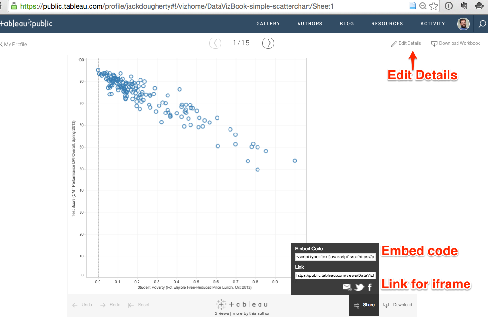

# Embed Tableau Public on your Website
*by [Jack Dougherty](../../introduction/who.md), last updated February 23, 2017*

Question: After creating an interactive data visualization with Tableau Public, how do I embed it on my website?

Answer: Tableau Public supports two embedding methods, and your choice depends on your type of website.
- A) Embed code: if you can paste directly into an HTML web page
- B) Convert Link to iFrame: to paste into WordPress.org, Wix, SquareSpace, Weebly, and many other web platforms

## Try it

Both methods produce an embedded visualization like the one below. Float your cursor over points to view data details.

<iframe src="https://public.tableau.com/views/DataVizForAll-scatter-chart/Sheet1?:showVizHome=no&:embed=true" width="100%" height="500"></iframe>

## A) Embed code method for HTML web pages

1) Use this method if you can paste HTML and JavaScript code directly into a website with HTML pages.

2) Go to the public web page of any Tableau Public visualization, such as this sample: https://public.tableau.com/profile/jackdougherty#!/vizhome/DataVizForAll-scatter-chart/Sheet1

3) Before you begin the embed process, click the upper-right Edit Details button to modify the title and make other changes as needed.

4) Click the bottom-right Share button, click inside the **Embed Code** field, and copy its contents. A typical embed code is a long string of HTML and JavaScript instructions to display the visualization.



5) Open an HTML page on your website and paste the embed code in the body section. Below is an example of a typical Tableau Public embed code pasted in the body of a simple HTML page.

```html
<!DOCTYPE html>
<html>
<head>
  <title>sample web page</title>
  <meta name="viewport" content="width=device-width, initial-scale=1.0">
  <meta charset="utf-8">
</head>
<body>
  <div class='tableauPlaceholder' id='viz1487897831506' style='position: relative'><noscript><a href='http:&#47;&#47;www.datavizforall.org&#47;chart&#47;scatter-chart-tableau&#47;index.html'></a></noscript><object class='tableauViz'  style='display:none;'><param name='host_url' value='https%3A%2F%2Fpublic.tableau.com%2F' /> <param name='site_root' value='' /><param name='name' value='DataVizForAll-scatter-chart&#47;Sheet1' /><param name='tabs' value='no' /><param name='toolbar' value='yes' /><param name='static_image' value='https:&#47;&#47;public.tableau.com&#47;static&#47;images&#47;Da&#47;DataVizForAll-scatter-chart&#47;Sheet1&#47;1.png' /> <param name='animate_transition' value='yes' /><param name='display_static_image' value='yes' /><param name='display_spinner' value='yes' /><param name='display_overlay' value='yes' /><param name='display_count' value='yes' /></object></div>                <script type='text/javascript'>                    var divElement = document.getElementById('viz1487897831506');                    var vizElement = divElement.getElementsByTagName('object')[0];                    vizElement.style.width='100%';vizElement.style.height=(divElement.offsetWidth*0.75)+'px';                    var scriptElement = document.createElement('script');                    scriptElement.src = 'https://public.tableau.com/javascripts/api/viz_v1.js';                    vizElement.parentNode.insertBefore(scriptElement, vizElement);                </script>
</body>
</html>
```

## B) Convert Link to iFrame method

1) Use this method if you need to paste an iframe into common web authoring platforms (such as WordPress.org, Squarespace, Wix, Weebly, etc.), since these platforms typically do not support HTML and JavaScript code pasted directly into content.

2) Go to the public web page of any Tableau Public visualization, such as this sample: https://public.tableau.com/profile/jackdougherty#!/vizhome/DataVizForAll-scatter-chart/Sheet1

3) Before you begin the embed process, click the upper-right Edit Details button to modify the title and make other changes as needed.

4) Click the bottom-right Share button, click inside the **Link** field (NOT the Embed Code field), and copy its contents.


5) A typical link will look similar to this example:

```html
https://public.tableau.com/views/DataVizForAll-scatter-chart/Sheet1?:embed=y&:display_count=yes&:showTabs=y
```

6) We need to edit the link to convert it into an iframe format. First, delete any code that appears after the question mark, to make it look like this:

```html
https://public.tableau.com/views/DataVizForAll-scatter-chart/Sheet1?
```

7) Add this snippet of code to the end, to replace what you deleted above:

```html
:showVizHome=no&:embed=true
```

8) Now your edited link should look similar to this:

```html
https://public.tableau.com/views/DataVizForAll-scatter-chart/Sheet1?:showVizHome=no&:embed=true
```

9) Enclose the link inside an iframe source attribute `src=" "` to make it look similar to this:

```html
src="https://public.tableau.com/views/DataVizForAll-scatter-chart/Sheet1?:showVizHome=no&:embed=true"
```

10) Optional: Add iframe attributes for `width` and `height` in percentages or pixels (default), to make it look similar to this:

```html
src="https://public.tableau.com/views/DataVizForAll-scatter-chart/Sheet1?:showVizHome=no&:embed=true" width="100%" height="500"
```

11) Add an iframe tag at the beginning `<iframe...` and end `><iframe>` to make it look similar to this:

```html
<iframe src="https://public.tableau.com/views/DataVizForAll-scatter-chart/Sheet1?:showVizHome=no&:embed=true" width="100%" height="500"></iframe>
```

12) Exception to step 11: To embed inside a WordPress.org site with the iframe plugin installed as described in the [Embed iFrame on WordPress](../embed/iframe-wordpress) chapter, insert brackets to make a shortcode similar to this:

```html
[iframe src="https://public.tableau.com/views/DataVizForAll-scatter-chart/Sheet1?:showVizHome=no&:embed=true" width="100%" height="500"]
```

13) Paste the edited iframe code inside the web platform, following the tutorials shown below:
- [Embed iFrame in WordPress](../embed/iframe-wordpress)
** TO DO: ADD MORE LINKS **

## Learn more
Embedding Tableau Public Views in iFrame, http://kb.tableau.com/articles/howto/embedding-tableau-public-views-in-iframes



