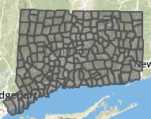
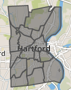

# Connecticut open data

Since this book was created in Hartford, Connecticut, it lists state and municipal open data repositories for the benefit of local readers:

**Connecticut Open Data** (http://data.ct.gov), the official portal for state government agencies, is hosted on the Socrata platform, which offers built-in data visualization tools and APIs. See also separate repositories for individual state agencies:
- Office of the State Comptroller (http://www.osc.ct.gov/openCT.html)
- CT State Department of Education (http://www.sde.ct.gov/sde/cwp/view.asp?a=2758&q=334520)
- Office of Policy and Management (http://ct.gov/opm/cwp/view.asp?a=3006&Q=383258&opmNav_GID=1386)
- link to all CT state government agencies (http://portal.ct.gov/Department-and-Agencies/)

**Connecticut State Data Center** (http://ctsdc.uconn.edu/), part of the U.S. Census Data Center Network, is the lead agency for US Census data and other socioeconomic data for Connecticut, and is based at the University of Connecticut Libraries. The site also features data visualizations created on the Tableau platform and provides population projections for the state of Connecticut.

**MAGIC: The Map and Geographic Information Center** (http://magic.lib.uconn.edu), based at the University of Connecticut Libraries, specializes in providing geographic, aerial photography, and map images for the state, past and present. The site also features interactive maps.

**DataHaven** (http://ctdatahaven.org/), a non-profit organization, collects and interprets information about Connecticut neighborhoods, such as its Community Wellbeing Survey. Data resources feature neighborhood profiles for densely-populated areas (New Haven and Hartford-West Hartford), and town profiles for other areas across the state.

**Connecticut Data Collaborative** (http://ctdata.org) is a public-private partnership that advocates for open data access to drive planning, policy, budgeting and decision making in Connecticut at the state, regional and local levels. We democratize public data through custom data exploration tools and a dynamic town profile tool, hosted on the open-source CKAN platform. Users can find state and federal data on topics such as public health, education, crime, municipal data, and racial profiling data.

**Hartford Data** (http://data.hartford.gov), the official portal of the City of Hartford municipal government, is hosted on the Socrata platform, which features built-in visualizations and APIs. Also, the site links to the City's ArcGIS Online geographic data (http://gisdata.hartford.gov/) and the City's financial data (http://checkbook.hartford.gov/) and budget (http://budget.hartford.gov/).

In addition to the official repositories above, Connecticut news organizations that create data visualizations often include links to download data files.

**Connecticut Mirror / Trend CT ** (http://ctmirror.org/) and (http://trendct.org/) are publications of the Connecticut News Project, an independent, nonpartisan, nonprofit organization that focuses on state policy issues. Most of their data visualizations are built with open-source code, with publicly accessible data files. See also their GitHub repository (https://github.com/trendct).

**Hartford Courant Data Desk** (http://www.courant.com/data-desk) produces digital visualizations for the *Hartford Courant*, the largest daily newspaper in Connecticut, owned by Tribune Publishing. Many of these data visualizations are published on the Tableau platform, which allows readers to download the underlying data.

**TO DO** describe Freedom of Information Act (FOIA) data requests in Connecticut

## Common data files for Hartford and Connecticut

### Geographic boundaries
- download and drag into http://geojson.io to view and edit
- see [polygon maps in this book](../../map/polygon-gft/index.html)

CT town borders 2010 [from MAGIC](http://magic.lib.uconn.edu/connecticut_data.html#boundaries)
- [KML](CT-town-borders-2010-MAGIC.kml)
- [GeoJSON](CT-town-borders-2010-MAGIC.geojson)

CT census tracts 2010 [from MAGIC](http://magic.lib.uconn.edu/connecticut_data.html#boundaries)
- [KML](CT-census-tracts-2010-MAGIC.kml)

Hartford neighborhood borders 2015 [from HartfordData](http://gisdata.hartford.gov/datasets/d3deb11bfd9242ce9c927187c512da9e_5)
- [KML](Hartford-neighborhoods-2015-HartGov.kml)
- [GeoJSON](Hartford-neighborhoods-2015-HartGov.geojson)

**TO DO**
- reorganize with more details about scale and projection
- add census areas (tracts; block groups) for City of Hartford; Hartford County; State
- add Capitol Region Council of Governments (CRCOG) http://www.crcog.org/
- add school districts (and clarify elementary-secondary)
- add Capitol Region Education Council (CREC) http://www.crec.org/
- add school attendance areas from federal site

---

[Improve this book:](../../gitbook/improve.md) Select text to insert comments, or suggest edits on GitHub.

[Data Visualization for All](http://datavizforall.org)
is copyrighted by [Jack Dougherty and contributors](../../introduction/who.md)
and distributed under a [Creative Commons Attribution-NonCommercial 4.0 International License](http://creativecommons.org/licenses/by-nc/4.0). You may freely share and modify this content for non-commercial purposes, with a source credit to http://DataVizForAll.org.

