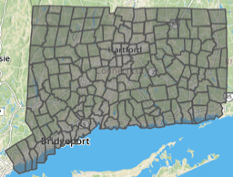

# Connecticut Open Data and Boundaries
*By [Jack Dougherty](../../introduction/who.md), last updated March 16 at 4pm, 2017*

Since this book was created in Hartford, Connecticut, we include state and municipal open data repositories and boundary files.

**Connecticut Open Data** (http://data.ct.gov), the official portal for state government agencies, is hosted on the Socrata platform, which offers built-in data visualization tools and APIs. See also how to create a [filtered point map with Socrata](../../map/socrata/index.html) in this book.

See also separate repositories for individual state agencies:
- Office of the State Comptroller (http://www.osc.ct.gov/openCT.html)
- CT State Department of Education (http://www.sde.ct.gov/sde/cwp/view.asp?a=2758&q=334520)
- Office of Policy and Management (http://ct.gov/opm/cwp/view.asp?a=3006&Q=383258&opmNav_GID=1386)
- link to all CT state government agencies (http://portal.ct.gov/Department-and-Agencies/)

**Connecticut State Data Center** (http://ctsdc.uconn.edu/), part of the U.S. Census Data Center Network, is the lead agency for US Census data and other socioeconomic data for Connecticut, and is based at the University of Connecticut Libraries. The site also features data visualizations created on the Tableau platform and provides population projections for the state of Connecticut.

**MAGIC: The Map and Geographic Information Center** (http://magic.lib.uconn.edu), based at the University of Connecticut Libraries, specializes in providing geographic, aerial photography, and map images for the state, past and present. The site also features interactive maps.

**DataHaven** (http://ctdatahaven.org/), a non-profit organization, collects and interprets information about Connecticut neighborhoods, such as its Community Wellbeing Survey. Data resources feature neighborhood profiles for densely-populated areas (New Haven and Hartford-West Hartford), and town profiles for other areas across the state.

**Connecticut Data Collaborative** (http://ctdata.org) is a public-private partnership that advocates for open data access to drive planning, policy, budgeting and decision making in Connecticut at the state, regional and local levels. We democratize public data through custom data exploration tools and a dynamic town profile tool, hosted on the open-source CKAN platform. Users can find state and federal data on topics such as public health, education, crime, municipal data, and racial profiling data.

**Hartford Data** (http://data.hartford.gov), the official portal of the City of Hartford municipal government, is hosted on the Socrata platform, which features built-in visualizations and APIs. See also how to create a [filtered point map with Socrata](../../map/socrata/index.html) in this book. Also, the Hartford Data site links to the City's ArcGIS Online geographic data (http://gisdata.hartford.gov/) and the City's financial data (http://checkbook.hartford.gov/) and budget (http://budget.hartford.gov/).

In addition to the official repositories above, Connecticut news organizations that create data visualizations often include links to download data files.

**Connecticut Mirror / Trend CT ** (http://ctmirror.org/) and (http://trendct.org/) are publications of the Connecticut News Project, an independent, nonpartisan, nonprofit organization that focuses on state policy issues. Most of their data visualizations are built with open-source code, with publicly accessible data files. See also their GitHub repository (https://github.com/trendct).

**Hartford Courant Data Desk** (http://www.courant.com/data-desk) produces digital visualizations for the *Hartford Courant*, the largest daily newspaper in Connecticut, owned by Tribune Publishing. Many of these data visualizations are published on the Tableau platform, which allows readers to download the underlying data.

## Boundaries
- Converted from shapefile WGS84 to GeoJSON format
- To download a GeoJSON file, click link and Save to your computer
- If you accidentally open the GeoJSON code in your browser, select File > Save Web Page to download it
- To view or edit, drag files into http://geojson.io or http://mapshaper.org
- Learn more in the [Transform Your Map Data](../../transform) chapter of this book

| Geography | Year-Source-Scale  | Download GeoJSON |
| :-------- | :------ | :----- | :-----   |
| CT outline  | [2010 Census UConn MAGIC WGS84 1:100,000](http://magic.lib.uconn.edu/connecticut_data.html#boundaries)|  [ct-outline.geojson](https://www.datavizforall.org/find/ct/ct-outline.geojson) |
| CT counties  | [2010 Census UConn MAGIC WGS84 1:100,000](http://magic.lib.uconn.edu/connecticut_data.html#boundaries)|  [ct-counties.geojson](https://www.datavizforall.org/find/ct/ct-counties.geojson) |
| CT towns  | [2010 Census UConn MAGIC WGS84 1:100,000](http://magic.lib.uconn.edu/connecticut_data.html#boundaries)|  [ct-towns.geojson](https://www.datavizforall.org/find/ct/ct-towns.geojson) |
| CT census tracts  | [2010 Census UConn MAGIC WGS84 1:100,000](http://magic.lib.uconn.edu/connecticut_data.html#boundaries)|  [ct-tracts-2010.geojson](https://www.datavizforall.org/find/ct/ct-tracts-2010.geojson) |
| Hartford County outline  | [2010 Census UConn MAGIC WGS84 1:100,000](http://magic.lib.uconn.edu/connecticut_data.html#boundaries) | [hartfordcounty-outline.geojson](https://www.datavizforall.org/find/ct/hartfordcounty-outline.geojson) |
| Hartford County towns  | [2010 Census UConn MAGIC WGS84 1:100,000](http://magic.lib.uconn.edu/connecticut_data.html#boundaries) | [hartfordcounty-towns.geojson](https://www.datavizforall.org/find/ct/hartfordcounty-towns.geojson) |
| Hartford County tracts  | [2010 Census UConn MAGIC WGS84 1:100,000](http://magic.lib.uconn.edu/connecticut_data.html#boundaries) | [hartfordcounty-tracts-2010.geojson](https://www.datavizforall.org/find/ct/hartfordcounty-tracts-2010.geojson) |
| Hartford outline  | [2010 Census UConn MAGIC WGS84 1:100,000](http://magic.lib.uconn.edu/connecticut_data.html#boundaries) | [hartford-outline.geojson](https://www.datavizforall.org/find/ct/hartford-outline.geojson) |
| Hartford census tracts  | [2010 Census UConn MAGIC WGS84 1:100,000](http://magic.lib.uconn.edu/connecticut_data.html#boundaries) | [hartford-tracts-2010.geojson](https://www.datavizforall.org/find/ct/hartford-tracts-2010.geojson) |
| Hartford neighborhoods  | [2015 Hartford Open Data 1:50,000](http://gisdata.hartford.gov/datasets/d3deb11bfd9242ce9c927187c512da9e_5) |  [hartford-neighborhoods.geojson](https://www.datavizforall.org/find/ct/hartford-neighborhoods.geojson) |

**TO DO**
- add Capitol Region Council of Governments (CRCOG) http://www.crcog.org/
- add school districts (and clarify elementary-secondary)
- add Capitol Region Education Council (CREC) http://www.crec.org/
- add school attendance areas from federal site
- describe Freedom of Information Act (FOIA) data requests in Connecticut



