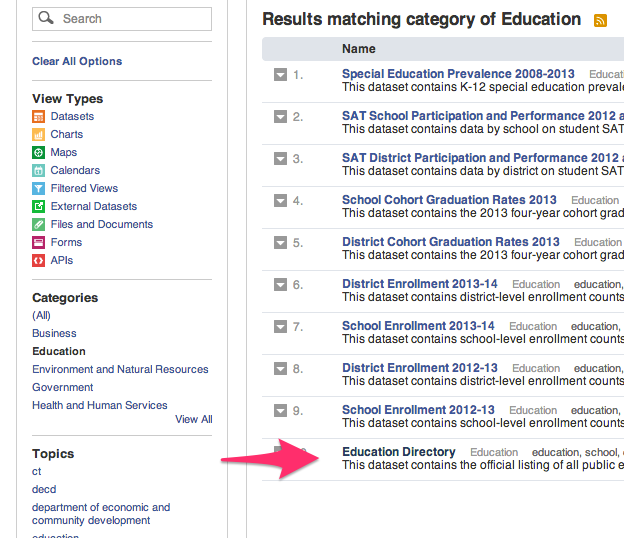
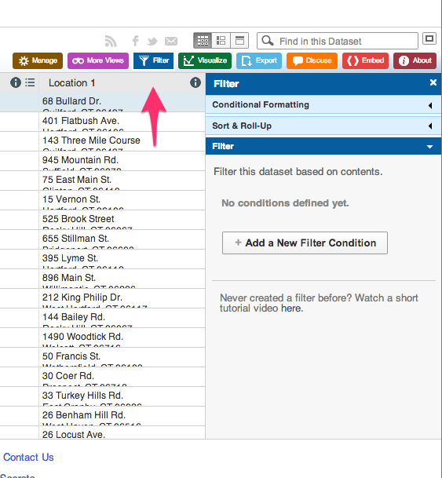
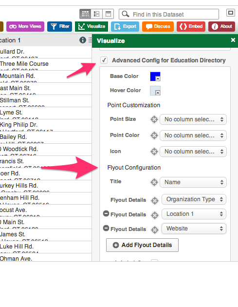

# Filtered Point Map with Socrata Open Data

*By [Veronica X. Armendariz and Jack Dougherty](../../introduction/who.md), last updated February 11, 2016*

Open data repositories recently launched by [the State of Connecticut](http://data.ct.gov) and [the City of Hartford](http://data.hartford.gov) both use [the Socrata platform](http://www.socrata.com), which offer user-friendly ways to view, filter, and export data. Also, the Socrata platform includes built-in support to create interactive charts and maps, and to embed them on your own websites. This tutorial demonstrates these features by creating an interactive point map of selected schools from the Connecticut Education Directory in the state data portal. The final product looks like this:

<iframe width="100%" title="CT Schools Map 2015" height="425px" src="https://data.ct.gov/w/qzq5-hbms/wqz6-rhce?cur=xi3jnhM8SI_&from=root" frameborder="0"scrolling="no"><a href="https://data.ct.gov/Education/CT-Schools-Map-2015/qzq5-hbms" title="CT Schools Map 2015" target="_blank">CT Schools Map 2015</a></iframe>
<a href="http://www.socrata.com/" target="_blank">Powered by Socrata</a>

One advantage of creating data visualizations directly on an open data platform is that the chart or map is linked to the data repository. For example, if the Socrata platform administrator updates the data table, then a Socrata dataviz based on that data will be automatically updated, too. This may be especially useful for "live" data that is continuously updated by agency administrators, such as fire, crime, and property data repositories.

But there are limitations to creating your chart or map on an open data repository platform. First, if the agency stops using the platform, or changes the structure of the underlying data, your online chart or map may stop functioning. Second, you are usually limited to using data tables and geographic boundaries that already exist on that platform, since importing your own may not be an option.

If these limitations concern you, a simple alternative is to export data from the open repository (which means that any "live" data would become "static" data), and import it into your preferred dataviz tool, such as those described in other chapters of this book. A second, more advanced alternative, is to learn how to pull live data from the repository directly into your dataviz, using an Application Programming Interface (API), which requires coding skills that are beyond the scope of this tutorial. (To learn more about the Socrata API: https://dev.socrata.com/.)

## Steps to create a filtered point map
Sign up for a free account ID on any Socrata platform, such as https://data.ct.gov/signup. One account will work on all Socrata sites.

Select your desired dataset in Socrata. In this tutorial, we will use CT Open Data > Education > [CT Education Directory](https://data.ct.gov/Education/Education-Directory/9k2y-kqxn). The data table must include a location column that includes geocoordinates. If there is address data but no geocoordinates, then post a suggestion to the Socrata site administrator to add a geocoded column.

Filter the data to display only the desired rows. The CT Education Directory lists both district offices and school addresses, but for this map we only wish to display the latter. On the top-right corner of the table, click the Filter tab.

Add a New Filter Condition, which displays only the rows you select. In this tutorial, select “Organization Type” and “is”, then type the exact name from the table, such as “Public Schools.” Be sure to type it correctly or the filter may not work. If you wish to select multiple types, add a new filter condition for each. In this tutorial, we also will filter for other types: Public Charter Schools, CT Technical High Schools, Regional Schools, State Agency Facilities, Endowed and Incorporated Academies Schools, and Regional Education Service Center Schools.

Select the Visualize tab and choose Map, which will display several options. First, under Config for Education Direction, select Point Map as the Plot Style, and choose the Location column to identify the geocoordinates.

Further below in the Visualize > Map options, select the checkbox for Advanced Config for the Education Directory to edit the Flyout Details (similar to a pop-up information window) that displays details when users click on a map point. Select data items you wish to display, such as Title: Name, and additional Flyout Details: Organization Type, Location I, and Website. Further down, select the “w/o labels” checkbox to avoid displaying the column headers in your flyout details.

In Visualize > Map > Base Maps, select your desired background map, such as Google Roadmap.

Add a legend to display once you build the map. In the Advanced Configuration area, select the Legend Configuration checkbox and mark its position. After selecting all of these map options, click Apply. Socrata will generate your map with default point colors. Double-check to make sure your data appear, and that your Visualize settings are correct, before moving to the next step.

Assign point colors and legend labels by returning to the Filter tab, and select Conditional Formatting. Understand the difference between these two features. Previously, we used Filter to display only selected types of data (in this case, school buildings, rather than district administrative offices). Now, we will use Conditional Formatting to assign color codes and labels to our filtered data.

In the Conditional Formatting section, type a name into the Description that you wish to display in the legend. You may type a shorter name than the longer name that appears in the data table, such as “Charter Schools” instead of the longer “Public Charter Schools.” Also, select a color for each Description.

Continue to add Conditional Formatting by defining the data columns. In this example, select “All Conditions Apply,” choose “Organization Type” and “Is”, then type the category exactly as it appears in the data table (such as Public Charter Schools). For this map of schools in the CT Education Directory data table, we added several more types (Regional Schools, CT Technical High Schools, etc.) and also added a second rule to identify Magnet Schools (where Organization Type is Public Schools, and Interdistrict Schools is 1).

After setting all of your Conditional Formatting, press Apply at the bottom of the tab. Double-check that your visualization appears exactly as you wish, then Save As under an appropriate name. Note that your visualization will become <strong>publicly visible</strong> to other users on the Socrata open data platform, though you have the option to remove it via your individual profile view.

Visualizations created in the Socrata platform produce HTML iframe codes, which allows you to embed the dataviz in your own website. Select the Embed tab to view and copy the code code. See chapter in this book on [how to embed a dataviz iframe code in your website[(http://www.datavizbook.org/content/publish/embed-iframe/).

---

[Improve this book:](../../gitbook/improve.md) Select text to insert comments, or suggest edits on GitHub.

[Data Visualization for All](http://datavizforall.org)
is copyrighted by [Jack Dougherty and contributors](../../introduction/who.md)
and distributed under a [Creative Commons Attribution-NonCommercial 4.0 International License](http://creativecommons.org/licenses/by-nc/4.0). You may freely share and modify this content for non-commercial purposes, with a source credit to http://DataVizForAll.org.

