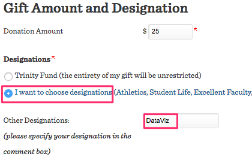

# Donate to DataViz Students at Trinity College

Help us improve this free book, *Data Visualization for All*, by donating funds to DataViz students at Trinity College in Hartford, Connecticut. Your donation will directly support Trinity students who are working to expand the book, and create visualizations with community partners. Contributions are tax-deductible.

<a href="https://securelb.imodules.com/s/1490/index-3col-form.aspx?sid=1490&gid=1&pgid=1188&cid=2232">

In the [Trinity College online donation form](https://securelb.imodules.com/s/1490/index-3col-form.aspx?sid=1490&gid=1&pgid=1188&cid=2232)
- select "I want to choose designations..."
- close the pop-up window
- in the "Other" field, type "DataViz" as shown below

** TO DO **
- add student images with testimonials



