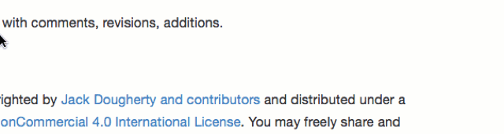
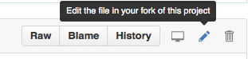

# Improve This Book-in-Progress

####Comment on any paragraph
- Select text and click the plus symbol (+) in margin.
- Requires a free GitHub or GitBook account.
- View other comments in margin, or all in [Discussions](https://www.gitbook.com/book/jackdougherty/datavizbook/discussions).
- Constructive criticism and suggestions are welcome.

####Suggest revisions on any page
- Click "Edit in GitHub" at top of any page, which opens new tab.
    
- To view the code behind the page, click Raw button.
- To suggest revisions, click Editor button (the pencil symbol), which requires a [free GitHub account](http://github.com).
    
- After entering revisions, scroll down to click Propose File Change.
- On next screen, click Create Pull Request to send changes to the book master branch.
- On next screen, click Create Pull Request again to confirm.
- The book owner will review your suggested revisions, and you will receive automatic notification on any changes.

####Submit additional chapters to the book
- Recommended: [Contact the lead author](introduction/contributors.md) with a summary of your proposed chapter.
- On the [book GitHub repository](https://github.com/JackDougherty/datavizbook), fork a copy, and create your proposed chapter.
- Follow the existing folder/file structure
- Compose the chapter in GitHub-flavored Markdown
- See more details about embedding video, iframes, etc. in [About This GitBook](gitbook/README.md)

***

This book-in-progress is freely available at http://DataVizBook.org.

You may freely share, reuse, and modify the book under its [Creative Commons Attribution-NonCommercial 4.0 International License](http://creativecommons.org/licenses/by-nc/4.0) by including a source credit to http://DataVizBook.org.

Improve this book by submitting issues, or contributing additions/corrections on the **dev branch** (development branch) of this GitHub repository: https://github.com/jackdougherty/datavizbook.
