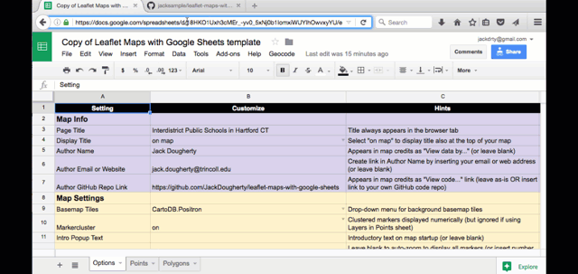
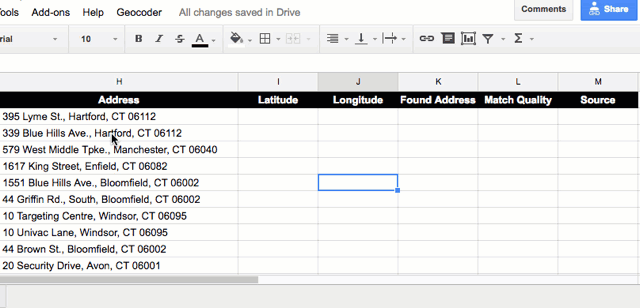

# Leaflet Maps with Google Sheets

*By [Ilya Ilyankou and Jack Dougherty](../../introduction/who.md), last updated January 27, 2017*

** TO DO **
- change directions to paste the full URL
- carefully explain the Publish step and include a screenshot
- create video tutorial


## Try the map or open in a [new tab](https://jackdougherty.github.io/leaflet-maps-with-google-sheets/)

<iframe src="https://jackdougherty.github.io/leaflet-maps-with-google-sheets/" width="100%" height=500></iframe>

## Map pulls data and options from Google Sheet
<iframe src="https://docs.google.com/spreadsheets/d/1ZxvU8eGyuN9M8GxTU9acKVJv70iC3px_m3EVFsOHN9g/pubhtml?widget=true&amp;headers=false" width="100%" height=300></iframe>

## Tool Review
- [Leaflet Maps with Google Sheets](https://github.com/JackDougherty/leaflet-maps-with-google-sheets) allows you to create and customize point, polygon, or polyline maps with no coding skills. Copy and publish the Google Sheet template, copy and host the pre-made Leaflet code template with GitHub Pages, and easily link the two together.
- Requires a free Google account and a free GitHub account
- ** TO DO ** add more advantages and limitations, currently beta version

## Tutorial to create your own

1) Sign into your GitHub account and open this code in a new tab: [Leaflet Maps with Google Sheets](https://github.com/JackDougherty/leaflet-maps-with-google-sheets)

2) Fork (or copy) the code to your GitHub account.

3) Host your code on the public web using GitHub Pages: Settings > Source > Master > Save. Your version of the map will be viewable at the link shown.


4) Sign into your Google account and open this spreadsheet in a tab: [Leaflet Maps with Google Sheets template](https://docs.google.com/spreadsheets/d/1ZxvU8eGyuN9M8GxTU9acKVJv70iC3px_m3EVFsOHN9g)

5) File > Make a Copy to your Google Drive, and File > Publish your Google Sheet to the public web


6) Link your Google Sheet to your Leaflet code.
- Copy your Google Sheet web address (or URL)
- In your Github code, click to open this file: google-doc-url.js
- Click the pencil symbol to edit the file
- Paste your Google Sheet URL into the code
- Scroll to bottom of page and press Commit (similar to save)
- **TO DO** update this visual



7) Update map options in your Google Sheet, and refresh your map browser to view


8) Click the Points tab at the bottom of your Google Sheet, paste in new address data, and select 5 columns to geocode



9) Upload polygon and polygon data in GeoJSON format to your GitHub code, and update Polygons and Polylines tabs to match and customize.


**TO DO** Add more details for steps 8 and 9 below, and review all details below to simplify above


- Set map options in a Google Sheet template
-
- upload and geocode addresses, and set map options, in the Google Sheet template
- Create Leaflet maps with a linked Google Sheets template.
- friendly and easy-to-learn searchable map tool with flexibility for advanced users
- clickable point data layers with custom marker icons and pop-up images
- color-coded polygon data layers with numeric or text legends

- host your live web map and polygon data with GitHub Pages
- responsive web design for both small and large devices
- built entirely with open-source code, and no usage limits

## Create Your Own: Fork a copy of the code template on GitHub
- https://github.com/jackdougherty/leaflet-map-simple/
- Remember, if you have already forked one copy, go to your GitHub repository Settings to rename it, or create a new GitHub repo and use GitHub Desktop to upload template Files

## To Do
- explain all steps
- Insert internal references to prior steps in this book. See the Edit and Host Code Templates section in this book. Requires a free GitHub account to host your own version on the web.

Design and host your own map on the public web, add your point and/or polygon data, and customize its appearance. *Quick directions for now -- with illustrations to come soon*

These steps require that you sign up and log into a:
- free GitHub account (https://github.com/) to edit two lines of open-source code
- free Google Drive account (https://drive.google.com) to copy and edit the Google Sheets template

#### A) Fork/copy this code repository and publish with GitHub Pages
- Click the Fork button, in the upper-right corner of this code repository, to create a copy of the code in your account.
- Reminder to fix later: if you have already created a fork of this repo, for your second version you will need to (rename original? clone or download?)
- Your new repository will have a web address in this format:
```
https://github.com/USERNAME/leaflet-maps-with-google-sheets
```
- Click the Settings button, in the upper-right section of your new repository.
- On the Settings page, scroll down to the GitHub Pages section, select Source > master branch, and click Save.
- GitHub Pages has published the *default* map from your code repository as a live public web page, which you can view by clicking on the link displayed after "Your site is published at...". It will appear in this format:
```
https://USERNAME.github.io/leaflet-maps-with-google-sheets/
```
- Copy the link to your live web page above.
- Go back to your GitHub code repository home page.
- Click on the README.md file. To edit this file, click the pencil symbol in the upper-right.
- In the Demo section, paste the link to your live web page from above.
- Scroll down and click the green Commit Changes button, which saves your edits to your GitHub repo.
- Go back to your GitHub repo home page. The new link you pasted to your default map should appear in the lower half of this page. Test it.
- Reminder to fix later: need to remove the dev branch from this public repo to avoid confusing newcomers.

#### B) File > Make a Copy and Publish your Google Sheets template
- Your live web map currently displays data from the *default* Google Sheet template. To insert your own data, you will need to make a copy and edit one line of code in your GitHub repository.
- In your GitHub repo home page, click on the [Google Sheet template link]( https://docs.google.com/spreadsheets/d/1ZxvU8eGyuN9M8GxTU9acKVJv70iC3px_m3EVFsOHN9g/edit#gid=0).
- Make sure that you are logged into your Google Drive account, and select File > Make a Copy. Insert a new name to associate it with your new map data, and save it in a folder where you can find it again later, then click OK.
- In your new Google Sheet, click File > Publish to the Web. (Leave the drop-downs as "Entire Document" and "Web page"). Click Publish. All data that you enter below will be *public*.

#### C) Paste your Google Sheets ID into the GoogleDocID.js file
- In your browser address bar, copy the long ID for your new Google Sheet, appears between "/d/" and "/edit...". It will look similar this:


- In your GitHub repo home page, click on the file named GoogleDocID.js, and click the pencil symbol to edit it.
- Replace the default Google Sheet ID by pasting your own from above. Do not erase the quote marks.
- Scroll down and click the green Commit Changes button to save your edits.

#### D) Customize your map settings in the Options tab

#### E) Geocode address data and customize markers in the Points tab

#### F) Upload/link polygon data and set legend colors in Options tab

- Go back to your live web map, which now displays data from your new Google Sheet. Keep both open in separate browser tabs or windows. When you make changes to your Google Sheet, click the refresh button in the live map to update the display.
- The Google Sheet contains three tabs (labeled at the bottom): Options, Points, Polygons.
- In the Options tab, type in your map title, use drop-downs to select map background, and so forth.
- In the Points tab, each row represents a point on your map. Type or paste in data, image links, addresses, and so forth.
  - To geocode addresses inside this Google Sheet, select the Address-Latitude-Longtiude columns, and click the Geocode > Selected Cells (Address to Lat Long) menu. (Geocoding is an add-on feature that does not appear in default Google Sheets.)
  - Group related points into Categories that you can define, which will appear as layers on the map.
- In the Polygons tab... TO DO: explain how polygon data must be prepared in GeoJSON format and uploaded into your GitHub repo (see example: ct-towns-density.geojson); refer to http://DataVizForAll.org tutorials on how to prepare your polygon data
  - find polygon data
  - refer to tutorial on how GeoJSON data is organized by "properties" -- refer to book and include this exercise: Open your GeoJSON polygon map file with http://geojson.io or http://mapshaper.org to view property categories (such as "name") and values for each item
  - if needed, convert polygon data from shapefile or KML format into GeoJSON format with http://geojson.io
  - if needed, edit polygon data and join/merge tables of new data with http://mapshaper.org



