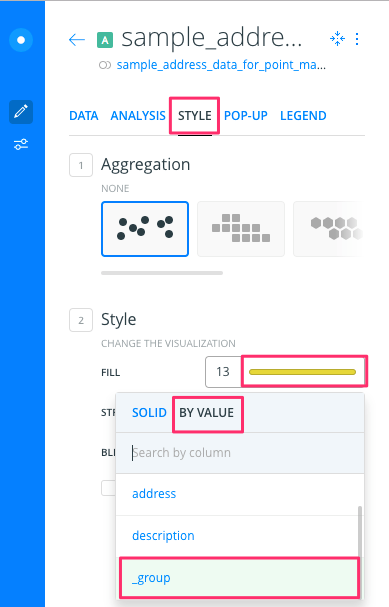

# Point Map with Carto Builder
*By [Jack Dougherty](../../introduction/who.md), last updated March 15, 2017*

## Try It
Explore the interactive point map below, or <a href="https://jackdougherty.carto.com/builder/1abbb430-ec89-11e6-a661-0e05a8b3e3d7/embed">view the full-screen version</a>,created with Carto Builder (https://carto.com).

<iframe width="90%" height="500" frameborder="0" src="https://jackdougherty.carto.com/builder/1abbb430-ec89-11e6-a661-0e05a8b3e3d7/embed" allowfullscreen webkitallowfullscreen mozallowfullscreen oallowfullscreen msallowfullscreen></iframe>

## Tool Review
- Pros:
  - Free and powerful drag-and-drop map tool in the browser
  - Customize point markers and polygon colors by data values
  - Additional features include geographic analysis tools
- Cons:
  - Several steps required to create simple point or polygon map
  - New users may get lost when moving through multiple screens
  - Free account allows only 400 geocodes per month

## Video with Step-By-Step Tutorial
lto7Z5wC2hQ

***Before you begin:*** This tutorial uses the newer Carto Builder, rather than older Carto Editor tool. Learn more at https://carto.com/learn/guides/intro/migrating-from-carto-editor-to-carto-builder If you have an old Carto account that has not automatically updated to the new Builder tool, you may need to create a brand-new account to use this tutorial.

Let's build a simple point map with sample data, using Carto Builder (https:/carto.com). Requires signing up for a free account.

1) Click this link and Save to download to your computer: [sample-address-data in CSV format](https://www.datavizforall.org/map/sample-address-data.csv). CSV means comma-separated-values, a generic spreadsheet format that many tools can easily open.

2) Open Carto in your browser https://carto.com

3) The Carto Dashboard displays two views: Maps and Datasets. Always begin with Datasets, then move to Maps. (Hint: If your dashboard looks very different than mine, then you might still be using the older Carto Editor, rather than the newer Carto Builder.)

4) First, connect your dataset, and soon we'll turn it into a map. Click blue button to add New Dataset.

5) Drag-and-drop the CSV sample address data to upload it, and select Connect Dataset. (Be patient. Sometimes this takes more than 30 seconds.)

6) Inspect your connected dataset.

7) Click the blue Create Map button.

8) Click the Edit Your Map button.

9) In your map data layer, click Add Analysis.

10) In the next screen of Analysis options, select Georeference, then click the Add Analysis button.

11) Back in your map data layer, under Georeference options, select Type > Street Addresses (scroll down to the bottom) for this sample data.

12) Under Parameters, for Column Street Address (abbreviated as Col. Street Ad.), select the "address" field for this sample data. Press the Apply button.

13) After Carto has attempted to geocode your address data, click Style This Analysis. Or, go to the map data layer and click the Style tab.

14) In Style options, for Aggregation select none (the default).

15) Under Style options:
- select Fill Number to change circle sizes
- enter a larger size, such as 13, to make our sample points more visible

- select Fill Color to change circle color
- switch from Solid (all points are same color) to By Value, and scroll down to Group (at the bottom) to automatically color by categories for this sample data. (Hint: If you don't see Group in the menu, click somewhere else and try it again.)

16) In the Pop-up tab, select a Window Style, then select boxes in Show Items to display.

17) In the Legend tab, click Select a Style to display information, and your color-coded groups from above should automatically appear on your map. (Hint: A legend may automatically appear after styling your markers by color.)

18) Before publishing your map: If you wish to rename it, do it now by selecting the three vertical dots next to the file name, and select Rename.

19) To publish your map on the web: Next to your map file name, click the blue “back” arrow (NOT your browser back button) to return to the data layer. Click the green Public button, and on the next screen, click the blue Publish button.

20) On the next screen, Get The Link generates a weblink to your map, and Embed It generates an iframe code to insert the live map in your website. For next steps, go to the [Embed on Your Web](../../embed) chapters in this book.

21) If you make edits to your map, you must click the blue Update button to republish your map to the web.

## Learn more
- Getting Started with Carto Builder https://carto.com/learn/guides/intro/getting-started-with-carto-builder



