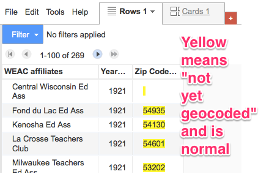
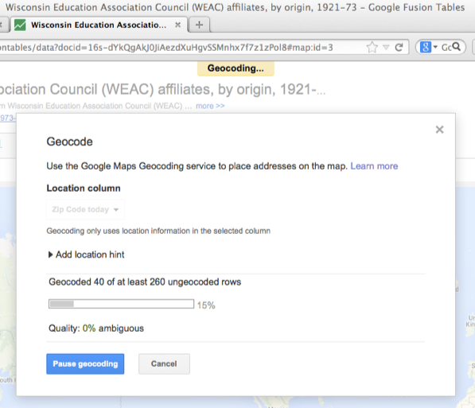
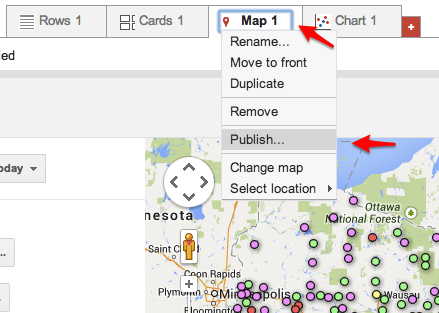

# Geocoded point map with Google Fusion Tables

*by Jack Dougherty, last updated May 2015*

Google Fusion Tables (GFT) is a free tool that allows users to upload and geocode a spreadsheet of location data, create an interactive point map with a numerical legend, and embed the product in a web page, like this:

<iframe width="100%" height="400" src="https://www.google.com/fusiontables/embedviz?q=select+col2+from+1OenqPrEAJVZDQrUe5fSeElMMVjrUbHTN9JoN0KU&viz=MAP&h=false&lat=44.517390498730755&lng=-89.70086420624999&t=1&z=6&l=col2&y=2&tmplt=2&hml=GEOCODABLE"></iframe>

*Click markers to explore Wisconsin Education Association Council affiliates, by origin, 1921-73*

GFT requires a free [Google Drive account](http://drive.google.com/) (use a regular Google username; avoid limited-access Google Apps for Education accounts). For general information, see Google documentation "[About Fusion Tables](https://support.google.com/fusiontables/answer/2571232)" and "[Create a Map](https://support.google.com/fusiontables/answer/2527132)" and also the [GFT Help Page](http://www.google.com/support/fusiontables/).

## Download and understand your data
Before starting to map, closely examine your data table to understand its meaning, sources of origin, and limitations.

1) Click to open the sample spreadsheet data, examine the source information, and determine what it does -- and does not tell us. For example, who added the present-day zip codes to this historical data? Why do they appear for some affiliates but not others?

- [sample spreadsheet location data of WEAC affiliates](https://docs.google.com/spreadsheet/ccc?key=0AtmGKybdRLlZdGlUM3hhUWhUZ1BibXdFbFFqLWVYbnc&usp=sharing), by year of origin, 1921-73 in Google Spreadsheet format, which you may File > Make a copy (to save to your Google Drive), or File > Download (to save in Excel .xlsx format on your hard drive)

Upload spreadsheet data to Google Fusion Tables (GFT)

Sign in to your Google Drive account and go to Create > Fusion Table (experimental).

If Fusion Tables is not listed, go to Create > Connect More Apps, search for "Fusion" and Connect the Fusion Tables app to your Google Drive account, as shown below:

2) In GFT, import your spreadsheet table of location data by selecting either "From this computer" or a Google Spreadsheet on your Google Drive. Click Next to confirm data, click Next again to add any source info (such as "NEA Handbook 1973-74, compiled by Campbell Scribner" and the link to his site), then click Finish.

3) In your Google Fusion Table, go to the Zip Code Today column drop-down menu, select Change Column, and modify the type of data to "Location." This will instruct GFT to geocode your data (place the locations on a map) based on this particular column.

4) Yellow highlighting will appear to signal that this data is "not yet geocoded," but will attempt to do so, which is normal.

5) Click on the red + symbol and select "Add Map" to start the geocoding process.

6) Depending on your internet connection and Google's geocoding servers, this sample location data with 269 rows of zipcodes may require about 5 minutes to complete.

Advanced tip: Read more about [Geocoding location data with Google Fusion Tables](https://support.google.com/fusiontables/answer/1012281). You can also trigger the geocoding process in the row data tab with File > Geocode. There is a daily limit of 2,500 free geocoded locations per day. Usually, location data is an address (with a city, state, and zip code all combined in one column), but partial data (such as city and state, or zip code only) also may work. If your spreadsheet already includes precise location data (such as latitude & longitude coordinates, or KML data, these are already mappable and do not need geocoding. By default, GFT attempts to geocode the most precise data in the left-most column. If GFT attempts to geocode the wrong column (shown with yellow highlighting), select the column drop-down menu and Change from "Location" to "Text" to stop it. If your location data is divided across several columns, see [how to combine multi-column locations](https://support.google.com/fusiontables/answer/175922). If your location data is geocoded incorrectly, see [how to fix map features in the wrong location](https://support.google.com/fusiontables/answer/171212).

Create and Style a Point Map with Info Windows and Automatic Legend

7) First,  if you wish to display data values in the placemark map (such as year of origin), in the Rows tab, select the Column drop-down menu and Change Type to "Number" data, since GFT can only display numerical values for data ranges.

8) In the new Map tab, go to Feature Map to Change feature styles.

9) In the Change map feature styles, select Marker Icon and experiment with Buckets to display your point data in different colored ranges. Remember to set ranges that make sense with your data, even though the formatting may differ (such as in this example, where the year "1921" appears as "1921.0" in the numeric range values.

TO DO: Advanced tip: See Mark Monmonier, How to Lie with Maps, Second Edition (University of Chicago Press, 1996), pp. 39-42 excerpt on how same data can be spatially represented in very different ways, by modifying map categories and cut-offs, in the Buckets or Gradients section of GFT. See also ColorBrewer for advice on selecting appropriate map colors and categories. (*To do: look for ColorBrewer with HTML color output.)

10) Select Automatic Legend. Check the box to display, title, and position it, and include a link to the GFT source data.

11) To modify how data appears in the map pop-up info windows, on the Map tab, under Features, select Change Info Windows. Select boxes in the Automatic tab and/or modify code in the Custom tab.

Advanced tip: To limit the data that appears in your map, go to the Table and select Filter to include or exclude selected rows.

Embed the interactive map in a WordPress post (or any web page)

12) In the GFT Table, click the Share button in upper-right corner to change the visibility settings of the default (Private) to Anyone with the Link, or Public:

13) Modify the map zoom level, center the map position, then select Map tab > Publish.

14) Modify the map width and height to fit the space allowed by the WordPress theme. (For many WordPress sites, 600 x 400 pixels looks best.) Copy the long string of code from the "Paste HTML to embed" field.

15) In the Trinity College self-hosted WordPress.org site for my courses, I have already activated a special plugin ("iframe") to correctly process the HMTL embedded map code for students with regular authoring privileges. (If you have administrative privileges or your own self-hosted WordPress.org site, this step may not be necessary. Currently, inserting an iframe will NOT work in most WordPress.com sites.)

16) Go to WordPress and create a new post. In the editor, switch from the Visual to the Text tab, which allows users to insert and modify HMTL code. Paste the long string that you copied from the step above. Add square brackets at beginning and end, and edit a few characters to match this format (called a "shortcode"), then publish to view your post.

TO DO: Add video screencast.

TO DO: To display textual data, rather than numerical, in a GFT legend, see this solution: https://github.com/JackDougherty/FusionTable-Map-custom-legend

 Data Visualization for All by <a xmlns:cc="http://creativecommons.org/ns#" href="http://www.datavizbook.org/content/introduction/contact.html" property="cc:attributionName" rel="cc:attributionURL">Jack Dougherty and contributors</a> is licensed under a <a rel="license" href="http://creativecommons.org/licenses/by-nc/4.0/">Creative Commons Attribution-NonCommercial 4.0 International License</a>. You may freely share and modify this content for non-commercial purposes, with a source credit to the author(s) listed in the byline and this link: http://DataVizBook.org.