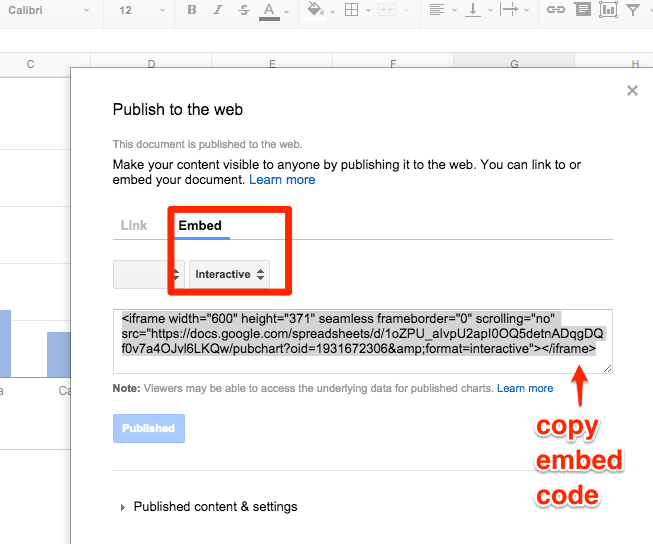

# Embed Dataviz with iframe on the web

When creating data visualizations on a web service, a common goal is to display your interactive chart or map inside a webpage on a different site. For example, if you created an interactive chart in Google Sheets, you could simply **link** to it from an organization's website. Or you could insert a static picture of your visualization, such as a screenshot, on an organization's website. But a better solution is to **embed the live visualization** inside the organization's webpage.

*TODO: bullet and illustrate link vs static vs embed concept above*

To embed one web page (the data visualization) inside a second web page (the organization's website), we use a simple HTML code known as **iframe**. (Read more about the <a href="http://www.w3schools.com/tags/tag_iframe.asp" target="_blank">ifram</a><a href="http://www.w3schools.com/tags/tag_iframe.asp" target="_blank">e tag at W3Schools</a>.)

The **general iframe concept** works across many data visualization tools and many websites:
- Copy the embed code or URL from your dataviz website
- Paste (and modify) the code as an iframe in your destination website

But details vary, so read and experiment following the examples below.

### Embed a Google Sheet dataviz in a WordPress.org site

- In Google Sheets, select data and insert > chart.
- Click right-corner of the interactive chart and select Publish chart


- Select the Embed tab, with Interactive version of your dataviz. Copy the iframe code that appears.


- On a self-hosted Wordpress.org site (such as the Trinity College DataViz site at http://commons.trincoll.edu/dataviz), I have already installed and activated the [iframe plugin](http://wordpress.org/plugins/iframe/), which  
allows authors to embed iframe codes inside posts/pages using a simple "shortcode" in square brackets. Without this plugin, self-hosted WordPress.org sites usually will "strip out" iframe codes for all users except the site administrator. Beware that inserting an iframe will NOT work for most WordPress.com sites.

<a href="http://commons.trincoll.edu/jackdougherty/files/2012/11/PluginActiveIFrame.jpg"></a>

- Go to your WordPress.org site, log in, and create a new post. In the editor window, switch from the Visual to the Text tab, which allows users to insert and modify HMTL code. 
- Paste the iframe embed code that you copied above, which initially should look like this:

```
<iframe width="600" height="371" seamless frameborder="0" scrolling="no" src="https://docs.google.com/spreadsheets/d/1oZPU_aIvpU2apI0OQ5detnADqgDQf0v7a4OJvl6LKQw/pubchart?oid=1931672306&amp;format=interactive"></iframe>

```
- Modify the front end of the iframe code by inserting a square bracket in place of the first caret symbol. At the back end, insert a square bracket in place of the last caret symbol and the iframe closing tag. The result should look like this:

```
[iframe width="600" height="371" seamless frameborder="0" scrolling="no" src="https://docs.google.com/spreadsheets/d/1oZPU_aIvpU2apI0OQ5detnADqgDQf0v7a4OJvl6LKQw/pubchart?oid=1931672306&amp;format=interactive"]
```

- Publish your post, and view it on the public web to test your embedded dataviz. You may need to modify settings.


**TODO: Revise other embed directions below**


If you're hosting your data visualization on a live website (such as <a href="http://epress.trincoll.edu/dataviz/chapter/host-html-github/" target="_blank">GitHub Pages</a>), copy the web address, like this:

<a href="http://epress.trincoll.edu/dataviz/wp-content/uploads/sites/11/2014/02/IframeCopyURL.jpg"></a>

On WordPress.org site with the iframe plugin installed, go to the post/page text editor (not visual editor), then type in a simple iframe shortcode with square brackets, and paste the web address into the "src=" (source equals) section,  like this:

<a href="http://epress.trincoll.edu/dataviz/wp-content/uploads/sites/11/2014/02/iframePasteURL.jpg"></a>

When you preview or publish the WordPress post/page, your interactive data visualization from the first website will appear embedded (or nested) within this secondary website, like the example below:

[iframe src="http://jackdougherty.github.io/tableau-public-sample/"]

If you're using BatchGeo or similar tools, look for "Embed code" and copy it, like this:

<a href="http://epress.trincoll.edu/dataviz/wp-content/uploads/sites/11/2014/02/Embed-BatchGeo.png"></a>

Then paste the BatchGeo iframe embed code  into a WordPress.org post/page, with the iframe plugin installed, and modify it like this:

<a href="http://epress.trincoll.edu/dataviz/wp-content/uploads/sites/11/2014/02/BatchGeoIFrameEmbed.png"></a>

If you're using Google Fusion Tables, modify your Sharing Settings to make your data visualization Public on the Web or to Anyone with the link. Then Publish your data visualization, and modify the width and height to fit the space allowed by the WordPress theme. (For most WordPress.org sites, 600 x 400 pixels looks best.) Copy the long string of code from the "Paste HTML to embed" field, like this:

<a href="http://commons.trincoll.edu/jackdougherty/files/2013/10/GFT_PublishHTML.png"></a>

Then paste your Google Fusion Tables embed iframe code into a WordPress.org post/page, with the iframe plugin installed, and modify the shortcode, like this:

<a href="http://commons.trincoll.edu/jackdougherty/files/2013/10/GFT_iFrameEmbedCode.png"></a>

Preview or publish your page/post, and the dataviz from the first site should appear in your second web page. Learn more about iFrame HTML tags and options to modify them at <a href="http://www.w3schools.com/html/html_iframe.asp" target="_blank">W3 schools</a>.
