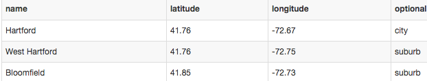
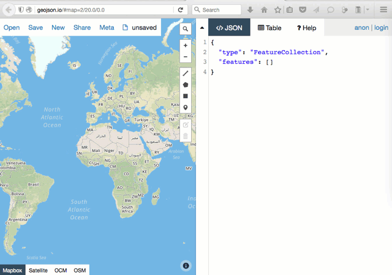

# Convert and Create Map Data with GeoJson.io

## What is GeoJSON?
GeoJSON is a relatively new and increasingly popular open format for map data, which can include:
- points (such as address locations, expressed in longitude-latitude coordinates)
- polygons (such boundary lines, expressed as a series of coordinate points)
- polylines (such as streets, expressed as a series of coordinate points)
- additional info (such as names and labels, expressed as properties of any feature above)
and more.

One big advantage of GeoJSON map data is portability across many tools. GeoJSON files can be used with Leaflet map code, Google Maps JS API code, CartoDB map tools, and more.

Also, your GitHub repository will automatically display any GeoJSON files in a map view. Click to view this [simple GeoJSON point data file on GitHub](https://github.com/JackDougherty/datavizforall/blob/master/shape/geojsonio/name-latitude-longitude-info.geojson).

GeoJSON data must follow a specific format, and the file name may end with either .geojson or .json.

GeoJSON stores coordinates in *longitude-latitude* format, the same order as X-Y points in mathematics. This is the opposite of Google Maps and several other web map tools, which stores points in *latitude-longitude* format. For example, Hartford Connecticut is located at (-72.67, 41.76) in GeoJSON, but (41.76, -72.67) in Google Maps.

## What is GeoJSON.io?

Go to http://geojson.io to explore this open-source web tool to convert, edit, and create GeoJSON map data. The tool was originally developed by Tom MacWright, and is supported by Mapbox.com.

### Convert a CSV spreadsheet of point data into GeoJSON

Use any spreadsheet tool and prepare a list of coordinate points (known as features). You must include column headers **longitude** and **latitude**, or abbreviations such as *lon* and *lat*. The order of the columns does not matter. Also, you can add more headers to identify each point (example: name) and include more details (known as the properties of the features).

Save your spreadsheet in generic CSV format. *Hint:* see [Save Spreadsheet as CSV chapter](../../transform/csv/) in this book.

Example: download this [sample CSV file](name-longitude-latitude-info.csv)

Drag the CSV file into the GeoJSON.io map window. Flip between the JSON and Table tabs to view or edit the data.

Select the Save menu and export into GeoJSON format.

Optional: Login to GeoJSON.io with your GitHub account and save directly to your repository.

### Convert Shapefile or KML polygons into GeoJSON

Polygon boundary data is often shared as ArcGIS Shapefiles (.shp) or Keyhole Markup Language (.kml) files. Drag any of these (and other) files into the http://GeoJSON.io map window. Flip between the JSON and Table tabs to view or edit the data.

Select the Save menu and export into GeoJSON format.

### Create GeoJSON data with drawing tools

Use the http://GeoJSON.io drawing tools to create points, polygons, and polylines. Flip between the JSON and Table tabs to view or edit the data.

### Learn more about GeoJSON.io

Read about more advanced features and view the code at https://github.com/mapbox/geojson.io

[Improve this book:](../../gitbook/improve.md) Select text to insert comments, or suggest edits on GitHub.

[Data Visualization for All](http://datavizforall.org)
is copyrighted by [Jack Dougherty and contributors](../../introduction/who.md)
and distributed under a [Creative Commons Attribution-NonCommercial 4.0 International License](http://creativecommons.org/licenses/by-nc/4.0). You may freely share and modify this content for non-commercial purposes, with a source credit to http://DataVizForAll.org.

