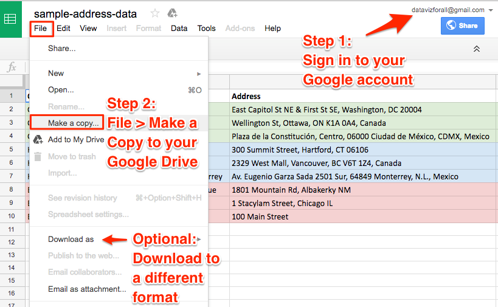

# File > Make a Copy with Google Sheets
*By [Jack Dougherty](../../introduction/who.md), last updated March 17, 2017*

In this book, you will open links to Google Sheets that allow you to view -- but not edit -- the contents. How can you quickly make your own version that you can edit?

## Best solution
1) Sign in to your Google account in the upper-right corner. Requires a free account.

2) Go to File > Make a Copy to save a duplicate of the spreadsheet to your Google Drive. By default, your copy will be private to you. Go to the [Share Data with Google Sheets](../spreadsheet/share) chapter in this book to allow others to view, comment, or edit your spreadsheet.

Highly recommended: Create folders in your Google Drive to keep your files organized and easily findable.

## Alternate solution
Another option is to File > Download As into a different format, such as:
- Microsoft Excel (.xlsx)
- OpenData System (.ods), a generic multi-tab spreadsheet
- Comma-separated values (.csv), a generic single sheet
No Google account is required.



