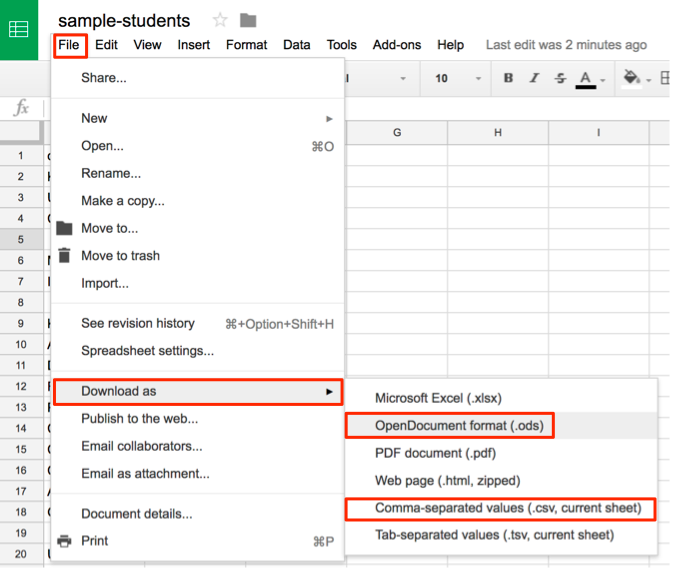

# Save Spreadsheets in CSV or ODS Formats
*By [Jack Dougherty](../../introduction/who.md), last updated March 2, 2017*

To transfer spreadsheet data to another platform, or import it into a visualization tool, you may need to convert your file into a different format. Consider two options:

## Comma-separated values (.csv)
- to transfer only one sheet of data, with no formulas or formatting, into a wide range of spreadsheet and visualization tools

## OpenDocument Spreadsheet (.ods)
- to transfer multiple sheets, with basic formulas and formatting, into many spreadsheet tools (Excel, Google Sheets, LibreOffice)

## Convert to CSV or ODS with Google Sheets

In the File > Download As menu, select either ODS (to convert a Google Sheets file with multiple tabs, formulas, and formatting) or CSV (to capture only the data in the current sheet).

## Convert to ODS with Microsoft Excel

In the File > Save As menu, select ODS format.

## Convert to CSV with Microsoft Excel

1) Note that CSV format will save only the first sheet of a multi-sheet Excel workbook. If you have source information or other data in other tabs, keep your original Excel file for backup purposes. You can give them parallel file names:
- data.csv
- data.xlsx

2) In the Excel file, select the File > Save As menu, and select CSV format.

3) Older versions of Excel may warn you that some features (such as formulas and formatting) will not be saved in a generic CSV data file. Be sure to keep a backup Excel version, then click Continue to save your data into CSV format.

4) In older versions of Excel, when you quit the appliation, another screen will ask if you wish to save the CSV file a second time. **Don't let Excel confuse you.** If you have not made any changes to the Excel file since the step above, click Don't Save, because you already saved the file in CSV format.



