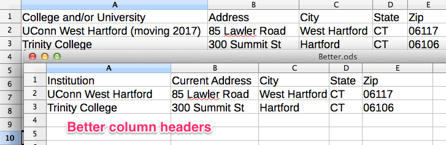

# Format and Sort Data
*By [Jack Dougherty](../../introduction/who.md), last updated January 13, 2017*

**TO DO** reorganize and emphasize the two title concepts, highlight Google Sheets, redo visuals; whenever possible, start text by posing a common data problem, and point out how the tool can help solve it

## Clean column headers and data cells

Across the top row, insert short meaningful headers for each column. Avoid special characters that may not be recognized properly by other applications.

** TO DO ** redo this visual

Make the data in the column consistent within itself.

**TO DO** insert example of inconsistent data, then show uniform data

## Format columns for consistency

**TO DO ** revise to show example of an inconsistent column, and how reformatting makes consistent

If your data needs to be formatted, select a spreadsheet column by clicking at the top. Or select the entire spreadsheet by clicking the top-left corner icon. Right-click your selection to reformat data (or use menu commands). For example, reformat the data to change the number of decimal points displayed. Or reformat a zip code from a number (because 06106 will not display the first zero) into a text or zip code field.

## Sort data by columns

** TO DO ** redo this example

To sort data rows by a column, select the entire spreadsheet (top-left corner icon), then right-click or look for the sort menu. Be sure to select the entire sheet to avoid accidentally sorting one column without the adjacent ones.



