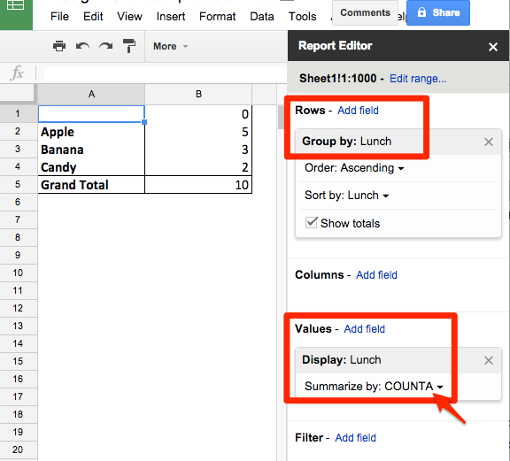

# Group Data with Pivot Tables

*By [Jack Dougherty](../../introduction/who.md), last updated March 16, 2016*

**TO DO**
- rewrite to start with a common problem, and how this method solves it
- use better example
- create better Google Sheets visuals, then Excel for Mac/Windows
- offer sample data for users to follow along

Here's a common problem: You have a large spreadsheet with columns of categories, such as (**to come**). You want to count up the number of items in each category. What's the most efficient way to do this?
- You could sort the data by column and count by hand, which would take forever
- You could insert a formula with the =COUNT() or =COUNTA() function, but that would only count one column
- You could create a pivot table to aggregate (or regroup) data in another sheet

** REDO THIS **
For example, one organization compiled a spreadsheet of its contacts. Each row included a city, and when sorted, it appeared like this:

Most spreadsheet tools include a *pivot table* feature to reorganize and regroup the data. While the buttons and appearances may differ across tools, the concept is the same.

## Simple Pivot Table in Excel for Mac
1. Select the entire sheet (click top-left box)
2. Data > Pivot Tables
3. Choose where to place the pivot table (default is a new sheet)
3. Drag a field name into the Row Labels box (to list all of the different entries under that field).
4. Drag the same field name into Values box (to display the count for each entry).
5. View results of this simple pivot table. To perform any calculations, copy and paste special > values into a new sheet.

## Simple Pivot Table in Google Sheets
1. Select the entire sheet (click top-left box)
2. Data > Pivot Tables
3. In Report Editor > Rows > add a field (to list all of the entries)
4. In Report Editor > Values > add same field > summarize by: COUNTA (to display the count for alphabet/textual entries)

** TO DO **
- show more complex pivot table with columns and rows

See more resources on pivot tables with Google Sheets
- Google Help Page https://support.google.com/docs/answer/1272898?hl=en&ref_topic=1258755&rd=1
- Andrew Ba Tran, "Tutorial: How to Make Pivot Tables in Google Sheets," TrendCT, September 4, 2015, http://trendct.org/2015/09/04/tutorial-how-to-make-pivot-tables-in-google-sheets/



