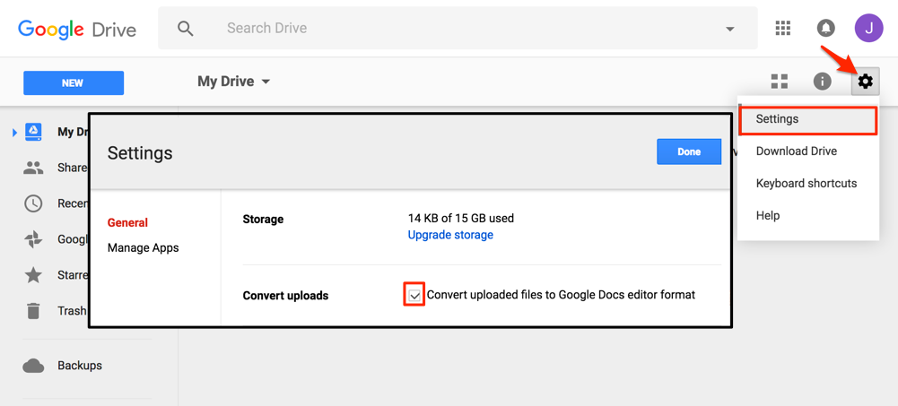
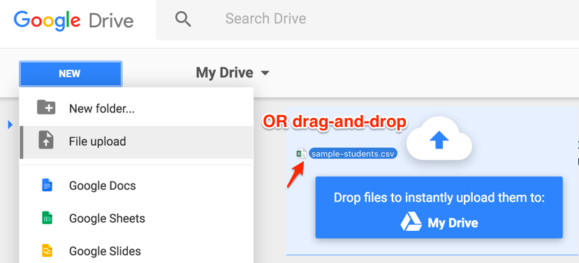
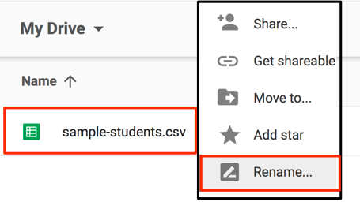
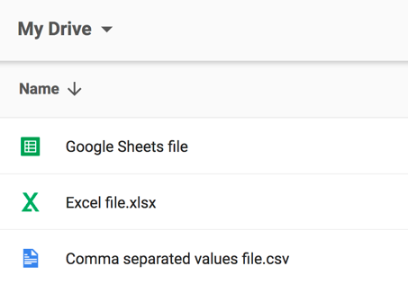

# Upload Files and Convert to Google Sheets
*by [Jack Dougherty](../../introduction/who.md), last updated March 2, 2017*

Google Drive can convert many file types into [Google Sheets format](https://www.google.com/sheets/about/):
- Microsoft Excel (.xls and .xlsx)
- OpenDocument Spreadsheet (.ods)
- Comma-separated values (.csv)
- Tab-separated values (.tab)
- Text files (.txt) into Google Sheets format

## Tutorial

1) Sign in to your free Google Drive account (http://drive.google.com)

2) To convert files into Google Sheets format, open the Settings (upper-right gear symbol), and **check the box** to Convert uploaded files to Google Docs.

3) To upload your file, use the New > File Upload menu OR drag-and-drop it into your Google Drive screen.

4) When your file is successfully converted, the Google Sheets icon will appear. Recommended: Right-click to rename the file and remove the old extension (.xlsx or .csv or other), since it is no longer in this old format.

5) Google Drive files that display different icons have **not** been converted into Google Sheets format.

**Beware**: A different way to convert spreadsheets into Google Sheets format is the File > Import menu, but this creates two files in your Google Drive (such as data and data.csv), which is confusing.  



