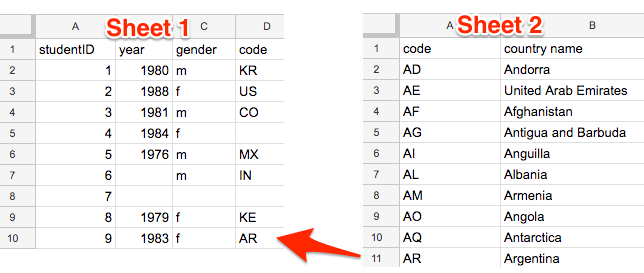
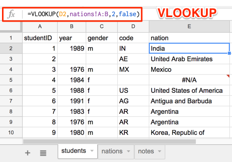

# Match Columns with VLOOKUP Function
*By [Jack Dougherty](../../introduction/who.md), last updated March 15, 2017*

Here's a common problem: Sheet 1 contains a long roster of students enrolled in our *Data Visualization For All* course, with a two-letter code for their nation. Sheet 2 contains the list of codes for each nation. How can we quickly match up this information in one sheet, so that each row contains the nation for each student?



One solution: Spreadsheets contain a VLOOKUP function, which "looks up" data across two or more vertical columns, and automatically fills in matching entries. This tutorial demonstrates how to set up this calculation in Google Sheets and Excel



## Video with step-by-step tutorial for Google Sheets
qrzKzts3mV0

1) Right-click and Save this link [sample-students-nations](sample-students-nations.ods) to download the sample data in OpenDocument System (.ods) format to your computer. For Google Sheets, see the [Upload Files and Convert tutorial](../upload) in this book. Or, open the file with Microsoft Excel or LibreOffice, and the directions below will be similar.

2) In the students sheet, type "nation" as a column header into cell E1.

3) Click in cell E2, start typing "=VLOOKUP" and the spreadsheet tool will suggest that you complete the formula in this format:
```
VLOOKUP(search_key, range, index, [is_sorted])
```
  - search_key = the Sheet 1 cell we are trying to match
  - range = the columns in Sheet 2 where matches may exist
  - index = the column in the Sheet 2 range that contains the desired result, where 1 = first column, 2 = second column, etc.
  - [is_sorted] = if the first column of the range is sorted, enter "true" to find the closest match; otherwise enter "false" to return exact matches only

4. You can type in the formula, or fill it out by clicking on cells, columns, and sheets as shown in the video above.



