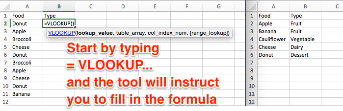

# Match Data with the VLOOKUP Function
*By [Jack Dougherty](../../introduction/who.md), last updated March 16, 2016*

**TO DO**
- redo the conceptual visual with a better example, maybe towns or school districts?
- add Google Sheets visuals
- upload sample tables for readers to follow along
- see other notes inserted below

Here's a common problem: Your first spreadsheet contains a long list of towns by population. Your second spreadsheet contains a long list of towns by income. What's the most efficient way to merge all of these columns into one sheet?
- You could copy and paste each cell, but that would take forever
- You could sort each sheet alphabetically by town, then copy and paste an entire column, but that only works if each sheet contains the exact same list of towns
- You could use the VLookup function, which "looks up" data in two vertical columns and automatically fills those that match

In Excel, the VLOOKUP formula looks complex at first, so let's break it down into steps.

1. In the target column of table 1, type: =VLOOKUP

2. Excel recognizes the start of the VLOOKUP formula, and asks you to fill in required values, separated by commas:
  - lookup_value: the shared column in table 1 (in this example, click cell A2)
  - table_array: the relevant columns in table 2 (click on table 2 columns A and B, and Excel will automatically fill in the long reference code to them)
  - col_index_num: the column from table 2 that you wish to pull into table 1 (in this example, type 2, since you want data from the second column)
  - [range_lookup]: type "FALSE", to instruct Excel to enter "#NA" if no match is found

3. After filling in the formula, press the Return key. The matched value from table 2 should appear in table 1.

4. Drag the formula down to fill in the column. Inspect your results. In this example, since Broccoli did not appear in table 2, its match is #NA (not applicable) in table 1.

5. To transform your new column from a formula to data, select all, copy, and paste special > values only.

*TO DO*
- explain limitations of VLOOKUP
- see also related tools: INDEX (?)



