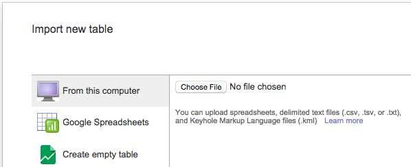
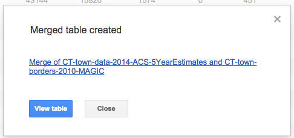
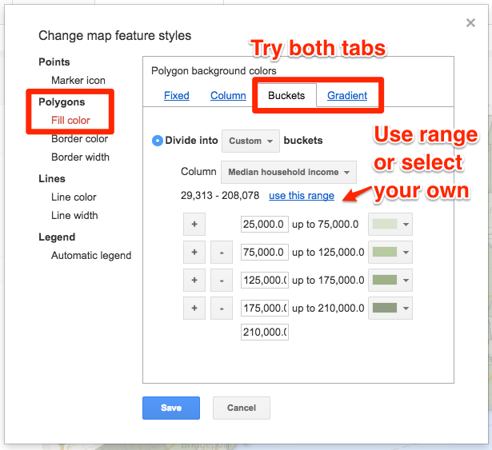
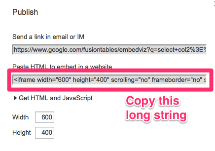

# Thematic polygon map with Google Fusion Tables

*By [Jack Dougherty](../../introduction/who.md), last updated March 16, 2016*

** TO DO - move this tutorial to separate section, will no longer be supported **

A thematic polygon map (also called a choropleth map) displays a colored pattern on each region to express its numerical value. In the interactive version embedded below, click on any region to view its info window with additional data.

<iframe width="600" height="500" scrolling="no" frameborder="no" src="https://www.google.com/fusiontables/embedviz?q=select+col2%3E%3E1+from+1MeyX2ICg1uIiAQUOChkUtbnZqfFE-3Kke3SkXnur&amp;viz=MAP&amp;h=false&amp;lat=41.51442003948278&amp;lng=-72.62841864453128&amp;t=1&amp;z=9&amp;l=col2%3E%3E1&amp;y=2&amp;tmplt=2&amp;hml=KML"></iframe>

*Median Household Income in Connecticut Towns, 2009-14, American Community Survey 5-Year Estimates, US Census/Social Explorer.*

To create a thematic polygon map, we need to merge two types of files:
- **data table:** the numerical values for each polygon
- **geographic borders:** a series of points that draws each polygon

To merge the data table and geographic borders, the two files **must share a common column** of information, usually the name or ID of each polygon. In the tutorial below, we will merge together:
- Connecticut town demographic data
- Connecticut town geographic borders

##Google Fusion Tables
This free and easy-to-learn tool looks similar to Google Sheets, but is more powerful than a spreadsheet tool. Google Fusion Tables (GFT) allows you to merge or "fuse together" two or more data tables -- including geographic border tables -- which allows you to visualize spreadsheet data on a map. GFT requires a [free Google Drive account](http://drive.google.com) (use a regular Google username; avoid limited-access Google Apps for Education accounts). For general information, see Google documentation "<a href="https://support.google.com/fusiontables/answer/2571232" target="_blank">About Fusion Tables</a>" and also the <a href="http://www.google.com/support/fusiontables/" target="_blank">GFT Help Page</a>.

###Strengths of GFT
- Free, easy-to-learn, and familiar interface for Google Drive users
- Operates entirely within the browser, across all platforms
- Upload geographic border files to create nearly any polygon map
- Publish and embed the interactive map on your own website
- Flexible GFT point and polygon maps can be inserted into [Searchable Map Template, in this book](../../fusion/searchable-point-map/index.html)

###Limitations of GFT
- Google Fusion Tables has been listed as *experimental* for several years
- Legend displays only numeric values. To display text labels in the legend, see https://github.com/JackDougherty/FusionTable-Map-custom-legend **TO DO**: Create chapter in modify section
- Not ideal for very large geography files (such as census tracts for several states)

##Install Google Fusion Tables

Sign into Google Drive (http://drive.google.com) and install GFT by clicking on New > More > Connect More Apps.

Search for "fusion" to find the free app, and click Connect to add it to your Google Drive.

In Google Drive, click New > More > Google Fusion Tables to start up.

##Download and Explore Sample Data

To follow this thematic polygon map tutorial, download two sample data files, and open them to learn about their structure:
- [Connecticut town demographic data in CSV format](CT-town-data-2014-ACS-5YearEstimates.csv). Includes columns of economic and racial data for each municipal town in Connecticut, drawn from the American Community Survey 5-year estimates for 2009-14, from the US Census/Social Explorer. Open and explore this file with any spreadsheet tool.
- [Connecticut town geographic borders in KML format](CT-town-borders-2010-MAGIC.kml). Includes many series of coordinate points to draw the polygon for each municipal town, similar to "connect the dots," from MAGIC UConn Libraries. Open and explore this file by with the http://geojson.io tool.

Since both of these sample data files share a common column -- the Connecticut town names, spelled the same way -- we can merge them in the next few steps.

##Upload Data into Google Fusion Tables

In Google Drive, click New > Google Fusion Tables. Import each sample file, one at a time, by selecting "From this computer" and navigating to the file. Click Next to confirm the data upload. Click Next to add any source information (such as "American Community Survey 2009-14" and "MAGIC UConn Libraries"), then Finish.

When you upload the CT town data CSV table, Google Fusion Tables displays yellow highlights because it is attempting to recognize and geocode the town names as locations, and place them as points on a map. But geocoding is unnecessary here, because our CT town borders KML file already includes the exact geography for each town.

To turn off the yellow highlighting, in the town name column drop-down menu, select Change, and switch the column type description from "Location" to "Text" as shown below.

##The Fusion: Merge data with borders

In your web browser, you should have two GFT tabs open: the CT town data and the CT town borders.

Start with the CT town data tab. Select File > Merge, and click on the listing for the  border file, which should be second in the list.

On the next screen, select the matching column types to merge. In this tutorial, the CT town borders should appear on the right-hand side, and you should select the "Name" column in the drop-down header. The goal is to **match the correct column type**, even if the list of town names does not appear in the same order.

Click the Next button, Merge all columns, and View the newly merged table.

##Create and Style the Thematic Map with Info Windows

Open your newly merged Google Fusion Table, which should include columns from CT town data and CT town borders. Select the Map tab, and an all-red polygon map will appear by default. Click on Change Feature Styles.

To style your thematic map, select Polygons > Fill Color, and experiment with Buckets and Gradients to adjust the range and colors. **Hint:** if you map a column of percentages (rather than raw numbers), choose an appropriate range (such as 0 - 1.0). a percentage column (rather than raw numbers), adjust the range (from 0-100 to an appropriate range, such as 0 - 1.0).

Select Automatic Legend, and check the box for its display position, insert a title, and link to the source data.

To modify how data appears in the map info windows, go to Map > Feature Map > Change info window.

In the Automatic tab, select data to be displayed. Or click on the Custom tab and learn how to edit code for info windows. **TO DO** link to learn more.

View the map to check appearance of your info windows.

##Share, Publish, and Embed the Polygon Map

In the GFT Merged Table, click the Share button in upper-right corner to change the visibility settings of the default (Private) to Anyone with the Link, or Public:

Modify the map zoom level and position, then select Map tab > Publish.

Google Fusion Tables displays an iframe embed code. Modify the map width and height to fit your destination website. Copy the long string of code code from the "Paste HTML to embed" field.

In the Trinity self-hosted WordPress site for my classes, I have already activated <a href="http://wordpress.org/plugins/iframe/" target="_blank">a special plugin ("iframe")</a> to correctly process the HMTL embedded map code for students with regular authoring privileges. (If you have administrative privileges or your own self-hosted WordPress.org site, this step may not be necessary. Currently, iframes do NOT work in most WordPress.com sites.)

Go to WordPress and create a new post. In the editor, switch from the Visual to the Text tab, which allows users to insert and modify HMTL code. Paste the long string that you copied from the step above. Add square brackets at beginning and end, and edit a few characters to match this format (called a "shortcode"), then publish to view your post.

**TO DO LIST**

<em>Advanced tip:</em> See Mark Monmonier, <em>How to Lie with Maps, Second Edition </em>(University of Chicago Press, 1996), <a title="excerpt" href="http://commons.trincoll.edu/cssp/files/2011/09/Monmonier1996excerpt.pdf" target="_blank">pp. 39-42 excerpt</a> on how same data can be spatially represented in very different ways, by modifying thematic map categories and cut-offs, in the Buckets or Gradients section of GFT. See also <a title="colorbrewer" href="http://colorbrewer2.org/" target="_blank">ColorBrewer</a> for advice on selecting appropriate map colors and categories. (*To do: look for ColorBrewer with HTML color output.)

Also, you can download census tract spreadsheet data to merge with it from <a href="http://www.census.gov" target="_blank">Census.gov</a> or <a href="http://www.socialexplorer.com" target="_blank">SocialExplorer.com</a> (export in CSV format, and multiply 6-digit tract number by 0.01 to add decimals to match).

These sample boundary files in KML (Keyhole Markup Language) format initially were downloaded from MAGIC in compressed KMZ format, which is not compatible with Google Fusion Tables. To learn how to modify files with free tools, see this <a href="http://epress.trincoll.edu/dataviz/chapter/convert-kml-filter" target="_blank">tutorial to convert from KMZ to KML in Google Earth and filter results in Google Fusion Tables</a>.

for the MAGIC border files above, note that I also removed the County Subdivisions that did not correspond to any spreadsheet

decide where to put commonly used geographic files: here or in Find CT chapter?

Advanced tip: To limit the data that appears in your map, go to the Merged Table and select Filter to exclude selected rows, as shown below:

When downloading census data for county subdivisions (municipal governments; aka towns in CT), long names may not match your data. for CT use my name converter table with VLookup. Beware that Windsor and Windsor Locks are flipped in alphabetically sorted long-name census lists versus short name lists.

Redo video screencast
https://www.youtube.com/watch?v=ReUAlZsJxP4



