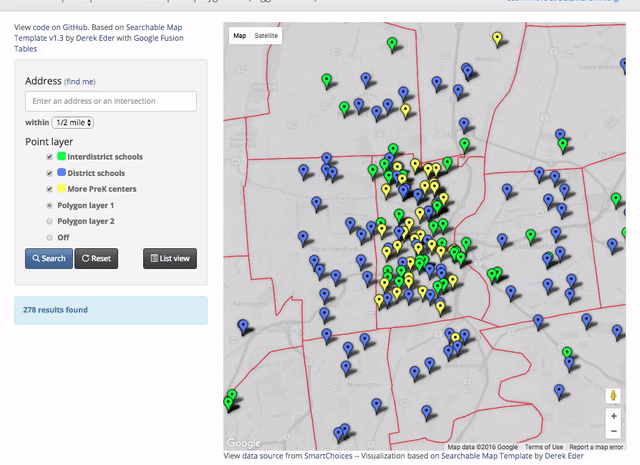

# Searchable Map Template with Sortable Results List

*By [Jack Dougherty](../../introduction/who.md), last updated April 11, 2016*

## Demo to toggle between map and list
- https://jackdougherty.github.io/fusion-point-polygon-list/index.html

## Demo to view both map and list
- https://jackdougherty.github.io/fusion-point-polygon-list/index_both.html

## Example: school search tool
- demo: https://jackdougherty.github.io/school-search-tool/
- code: https://github.com/JackDougherty/school-search-tool/

## Create Your Own: Fork the code from this GitHub repository
- https://github.com/jackdougherty/fusion-point-polygon-list/

Note that this code uses Derek's Template v1.3, with different code instructions than v1.4

## Credit
- Derek Eder http://derekeder.com/searchable_map_template/

## To Do
- insert step-by-step tutorial to for readers to edit template, based on basic searchable point map chapter
- update to Derek's template v1.4



