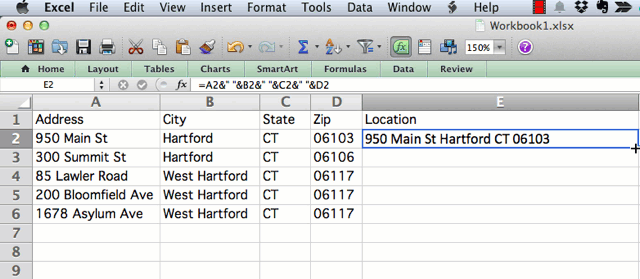

# Calculate Formulas in Spreadsheets

Simple formulas can save you lots of time. The big advantage of spreadsheet tools is the ability to insert simple formulas to calculate numbers, or combine columns of text, for entire rows and columns.

## Write a simple formula

In most spreadsheets, begin writing a simple formula with an equal sign, and refer to specific cells and functions, such as:

- = A2 + B2 + C2
- = Sum(A2:C2)
- = Average(A2:C2)

## Copy or Drag formulas

Spreadsheets can magically automate calculations across rows or columns. In most cases, you can copy and paste a formula into new cells. Sometimes you can click-and-drag the lower-right corner of a formula cell (which may appear as a cross-hair) to automate calculations.

## Copy and Paste > Special > Values to replace formulas with data

After inserting calculations in a spreadsheet, sometimes dynamic formulas must be replaced with static data before the results can be visualized. One solution is to select and copy a column (or the entire sheet), then paste > special > values to replace the formula with numerical results.

Remember that if you need to check or run the calculations again at a later point, click (or right-click) the tab to save a copy to the spreadsheet as a backup.

---

[Improve this book:](../../gitbook/improve.md) Select text to insert comments, or suggest edits on GitHub.

[Data Visualization for All](http://datavizforall.org)
is copyrighted by [Jack Dougherty and contributors](../../introduction/who.md)
and distributed under a [Creative Commons Attribution-NonCommercial 4.0 International License](http://creativecommons.org/licenses/by-nc/4.0). You may freely share and modify this content for non-commercial purposes, with a source credit to http://DataVizForAll.org.

