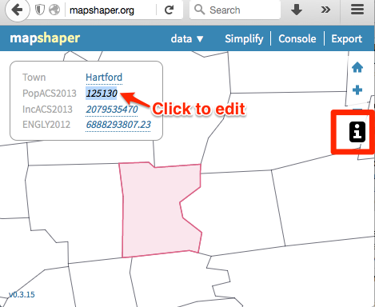

#Convert, Edit, Join, and Dissolve with MapShaper.org
*By [Jack Dougherty](../../introduction/who.md), last updated April 10, 2017*

** TO DO **
- rewrite into tool review/tutorial format
- put conversion at top and clarify import-export formats
- recommended browsers: Firefox or Chrome
- Mac users: go to Finder > Preferences > Advanced > turn on Show file extensions

MapShaper (http://MapShaper.org) is another versatile open-source mapping tool, developed and maintained by [Matthew Bloch on GitHub](https://github.com/mbloch/mapshaper). Using the web interface, users can:
- Import and export map layers in multiple formats: Shapefile, GeoJSON, CSV, and more
- Simplify (or smooth out) geographic details to reduce map file size
- Edit geography with powerful commands (dissolve, clip, join files, etc.)

This free and easy-to-learn MapShaper.org web tool has replaced *many* of my map preparation tasks that previously required expensive and hard-to-learn ArcGIS software, or its free but still-challenging-to-learn cousin, QGIS. Even advanced GIS users may discover MapShaper.org to be a quick alternative for some common time-consuming tasks.

The examples below focus on polygon boundary data to illustrate common map editing tasks. But MapShaper.org also works with other data layers, such as tables, points, and lines.

##Import and convert map boundary files

Try it! Right-click the link and Save to download this sample file to your computer: [ct-towns in GeoJSON format](https://www.datavizforall.org/find/ct/ct-towns.geojson). If you accidentally open a page of GeoJSON code in your browser, select File > Save Page As to download to your computer.

1. Drag-and-drop any map layer into the http://MapShaper.org browser window.
  - Import GeoJSON (.geojson or .json), TopoJSON, CSV, or Shapefile formats
  - For Shapefiles, import the .shp (features), .dbf (attribute data), and .prj (projection) files. Reminder: the WGS84 projection is most portable across multiple platforms.
  - KML/KMZ files are not compatible. To convert these into a format that Mapshaper can import, see the [Convert KMZ to KML](../convert-kmz) and [Geojson.io](../geojsonio) chapters in this book.

2. Click the Export button and select your preferred format:
  - Shapefile (best for ArcGIS/QGIS software)
  - GeoJSON (best for Leaflet and GitHub tools in this book)
  - TopoJSON (similar to GeoJSON, with topographical data)
  - SVG (Scalable Vector Graphics, for print or online)
  - CSV (Comma Separated Values, generic spreadsheet format)

  

##Edit data for specific polygons

To edit data for any polygon in MapShaper.org:
- Click the "i" information button
- Select the polygon
- Click inside its pop-up info window to directly edit the data

  

##Simplify map boundaries to reduce file size

If your data visualization project displays a zoomed-out state or national or world map, small geographic details that are invisible at these zoom levels may not be necessary. Consider using the Simplify command to reduce the file size, which may help your interactive web map to load faster for web visitors. The example below began with a detailed map of Connecticut town boundaries (1:100,000 scale) at 2MB, which MapShaper simplified -- without visibly sacrificing details at the statewide zoom level -- to a reduced size of about 200KB.

1. Try it! Download and upload the sample GeoJSON file as described in the Import section above.

2. Click the Simplify button to review options, and in most cases, accept the default settings. Click Next.

3. Slide the Simplify button from 100 percent down to an appropriate number for your map zoom level. If important geographic details disappear, you may have gone too far.

4. Look in the upper-left corner and click on recommended Repairs to your map file.

5. Complete the process by clicking Simplify once again. Export your file in the preferred format for your project.


##Dissolve internal polygons to create an outline map
MapShaper.org also includes a Console button to type in commands for common map editing tasks. Imagine that you begin with a boundary map that includes internal polygons, but your goal is to remove all of them to create an outline map.

Click the Console button, which opens a window to type in commands. Enter the command below, then press return. Close the Console window and Export your outline map.

```
-dissolve
```


##Clip a map to match an outline layer
Imagine that you start with a polygon map of all towns in Connecticut, and an outline map of Hartford County, a larger region that includes some (but not all) of those smaller towns. Your goal is to create a polygon map of all towns inside Hartford County. In other words, we will "clip" the statewide town map using the county outline map.

Try it! Right-click the link and Save to download both sample files to your computer:
  - [ct-towns in GeoJSON format](https://www.datavizforall.org/find/ct/ct-towns.geojson)
  - [hartfordcounty-outline in GeoJSON format](https://www.datavizforall.org/find/ct/hartfordcounty-outline.geojson)
  - If you accidentally open a page of GeoJSON code in your browser, select File > Save Page As to download to your computer.

Refresh the browser to start a new session in http://MapShaper.org.

1. Drag-and-drop the ct-towns.geojson file to import to MapShaper.

2. Drag-and-drop the hartfordcounty-outline.geojson map to MapShaper, and click Import to add this second layer.

3. In the drop-down menu, select the first map (ct-towns) to display it as the active layer.

4. Click the Console button, type or paste in the command below, and press enter.
```
-clip hartfordcounty-outline.geojson
```

5. The command above instructs MapShaper to clip the active map layer (ct-towns) using the second layer (hartfordcounty-outline).

6. Sometimes the boundaries of the clip layer do not precisely match up with your active layer, due to differences between their sources. If necessary, add the `cleanup` command to remove any null features or small "slivers" that remain after the clip.

```
- clip hartfordcounty-outline.geojson cleanup
Removed 3 null features and 5 slivers
```
**TO DO** fix animation to match new file names


##Remove unwanted data columns

Sometimes your polygon map contains several columns of unwanted data. To quickly remove them, enter the "-filter-fields" Console command to keep only the columns you list. The example below deletes all columns *except* "town":

```
-filter-fields town
```

##Join spreadsheet data with polygon map

** TO DO **
- fix images and animations to map the new file names and column headers

A common mapping task is to join (or merge) new data columns into a polygon boundary map, and MapShaper.org makes this very easy. Imagine that you have two files:
- Connecticut town boundary map
- a spreadsheet of town population data

Your goal is to unite these files, so that you can later display them in a thematic polygon map. Since these two files share a common column of data -- the town names -- you can join them together into one merged file.


Try it! Right-click each link and Save to download two sample files to your computer:
- [ct-towns in GeoJSON format](https://www.datavizforall.org/find/ct/ct-towns.geojson)
- [ct-towns-popdensity in CSV format](https://www.datavizforall.org/transform/mapshaper/ct-towns-popdensity.csv)
  - If you accidentally open a page of GeoJSON code in your browser, select File > Save Page As to download to your computer.

Refresh the browser to start a new session in http://MapShaper.org.

1. Drag-and-drop the ct-towns.geojson boundary file into MapShaper. Select the "i" info button and click on any polygon to confirm that the column header is "name".

2. Open the ct-towns-popdensity.csv file with any spreadsheet tool and confirm that first column header also is "name". Close this file.

3. Drag-and-drop the ct-towns-popdensity.csv file into MapShaper.org, and select the Import button to add it as a second layer. This table layer will appear as rectangular cells, because it does not contain geographic information.

4. Click the drop-down menu and select the map to display it as the active layer.

  

5. Click the Console button, type this command, and press return:
```
-join ct-towns-popdensity.csv keys=name,name
```
Type this precisely, with **no spaces** between the words in your keys. This command instructs MapShaper to join the active map layer to the CSV table layer, based on their shared column of data, labeled as "name" in both files. In this example, 169 rows are merged together.

  

6. Click the Console button to close the command window. Select the "i" info button and click any polygon to confirm that it now contains the new table data. Export the file in your preferred format.

  

###More about joins

1. If you don't have a CSV table that matches the columns in your boundary map data, you can easily create one. Upload the boundary map to MapShaper.org, and export in CSV format, and open with any spreadsheet tool. To match data columns in the CSV spreadsheet, use the [VLOOKUP method in this book](../../spreadsheet/vlookup).

2. The simple join example above uses identical keys (name,name) because the two columns headers are the same. But if you need to join data where the headers are not the same, enter the first key (the polygon map) and the second key (the CSV table).

3. Mapshaper also helps you to keep track of data that are not properly joined or matched. For example, if the polygon map contains 169 rows (one for each town in Connecticut), but the CSV table contains only 168 rows of data, Mapshaper will join all of those with matching keys, and then display this message:
```
Joined 168 data records
1/169 target records received no data
```
To capture data records that are not properly joined, add these terms at the end of your join command: `unjoined unmatched -info`. The first term saves a copy of each unmatched record from the target table to a new layer named "unmatched," and the second term saves a copy of each unjoined record from the source table into another layer named "unjoined." In the example below, see the console command and results, and a screenshot of the two new layers.

```
$ -join towns-data.csv keys=name,name unmatched unjoined -info
Joined 27 data records
2/29 target records received no data
2/29 source records could not be joined
Layer 1 ...
```


##Merge selected polygons with join and dissolve commands

** TO DO ** fix screenshots to match new data files and column headers

 Another common task is to merge selected polygons in a boundary map, which you can do in MapShaper with the join and dissolve commands you learned above. Imagine that you wish to create regional "cluster" boundaries from smaller polygon areas. For example, the [Connecticut Department of Public Health](http://www.ct.gov/dph/cwp/view.asp?a=3123&q=397740) has grouped individual towns, such as Bloomfield and West Hartford, into regional health districts. Your task is to begin with a statewide polygon map of all town boundaries, and to create a new polygon map that displays these regional clusters.

Try it! Right-click the link and Save to download the sample files to your computer: [ct-towns in GeoJSON format](https://www.datavizforall.org/find/ct/ct-towns.geojson). If you accidentally open a page of GeoJSON code in your browser, select File > Save Page As to download to your computer.

 Refresh the browser to start a new session in http://MapShaper.org.

1. Import the ct-towns.geojson map file into http://MapShaper.org.

2. Export in CSV format. This steps creates a spreadsheet that lists all of the polygon town names, without geographic details.

  

3. Open the CSV file with any spreadsheet tool. Copy the contents of the "name" column, paste it into a second column, and change the header of this second column to "merged".

4. In the new "merged" column, create new listings for towns you wish to merge together. In this example, Bloomfield and West Hartford are merged into Bloomfield-West Hartford. Leave other towns unchanged.

  

5. Save this spreadsheet in CSV format with a new file name, such as: ct-towns-merged.csv.

6. Drag this new ct-towns-merged.csv file into MapShaper, and click Import.

7. Use the drop-down menu to manage multiple layers in MapShaper. Since the CSV file has no geography, it appears as a series of rectangular cells. Instead, select the ct-towns.geojson map to display it as the active layer.

  

8. Click on the Console button, type in both of the commands below, and press Return at the end of each line:

```
-join CT-towns-merged.csv keys=name,name
-dissolve merged
```

  How to understand the commands above:
  - The first line "joins" the active layer (the polygon map) to the CSV spreadsheet, with "keys" to match their shared data columns, which are both labeled as "name".
  - The second line dissolves the polygons of towns listed in the "merged" column of the CSV file. In this simple example, only Bloomfield and West Hartford are dissolved into a combined "Bloomfield-West Hartford" regional health district, and all of the other polygons remain the same.

  

Click the Console button to close its window. Select the "i" information button to inspect your merged polygons. Export the map in your preferred format.


##Learn more advanced MapShaper methods

- See the MapShaper GitHub project wiki (https://github.com/mbloch/mapshaper/wiki/) for more command references and tips about map simplification

**TO DO**: illustrate concept of a point-to-polygon spatial join. When using the join command, "If the keys= option is missing, Mapshaper will perform a point-to-polygon or polygon-to-point spatial join."



