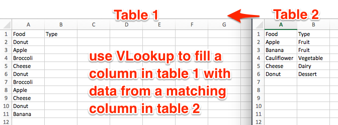

# Match Columns with the VLOOKUP Formula

Most spreadsheet tools include a VLOOKUP formula function to automatically "look up" missing data for a column in the first table, and fill it with matching data from a vertical column in a second table. If the two tables share a common data column, you can use VLOOKUP to save time.

In Excel, the VLOOKUP formula looks complex at first, so let's break it down into steps.

1. In the target column of table 1, type: =VLOOKUP

2. Excel recognizes the start of the VLOOKUP formula, and asks you to fill in required values, separated by commas:
  - lookup_value: the shared column in table 1 (in this example, click cell A2)
  - table_array: the relevant columns in table 2 (click on table 2 columns A and B, and Excel will automatically fill in the long reference code to them)
  - col_index_num: the column from table 2 that you wish to pull into table 1 (in this example, type 2, since you want data from the second column)
  - [range_lookup]: type "FALSE", to instruct Excel to enter "#NA" if no match is found

3. After filling in the formula, press the Return key. The matched value from table 2 should appear in table 1.

4. Drag the formula down to fill in the column. Inspect your results. In this example, since Broccoli did not appear in table 2, its match is #NA (not applicable) in table 1.

5. To transform your new column from a formula to data, select all, copy, and paste special > values only.

*TO DO*
- illustrate same concept in Google Sheets

---

[Improve this book:](../../gitbook/improve.md) Select text to insert comments, or suggest edits on GitHub.

[Data Visualization for All](http://datavizforall.org)
is copyrighted by [Jack Dougherty and contributors](../../introduction/who.md)
and distributed under a [Creative Commons Attribution-NonCommercial 4.0 International License](http://creativecommons.org/licenses/by-nc/4.0). You may freely share and modify this content for non-commercial purposes, with a source credit to http://DataVizForAll.org.

**TO DO**
- upload sample tables for readers to follow along
- explain limitations of VLOOKUP
- suggest related tools: INDEX (?), Merge command in Google Fusion Tables, etc.

---

[Improve this book:](../../gitbook/improve.md) Select text to insert comments, or suggest edits on GitHub.

[Data Visualization for All](http://datavizforall.org)
is copyrighted by [Jack Dougherty and contributors](../../introduction/who.md)
and distributed under a [Creative Commons Attribution-NonCommercial 4.0 International License](http://creativecommons.org/licenses/by-nc/4.0). You may freely share and modify this content for non-commercial purposes, with a source credit to http://DataVizForAll.org.

